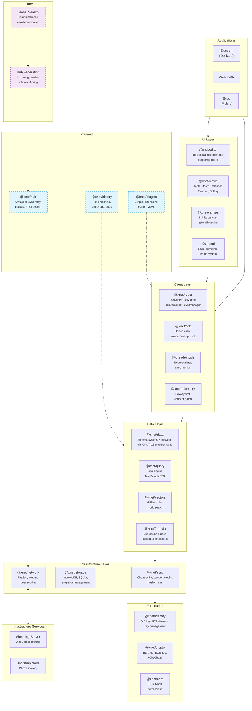
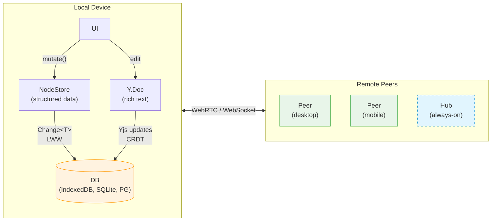
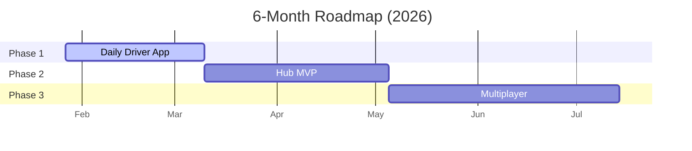

# xNet

Decentralized data infrastructure and application. Local-first, P2P-synced, user-owned data.

xNet is both the underlying infrastructure and the user-facing app — one product, one brand. It starts with documents and databases, then expands via plugins to support ERP, MCP integrations, and more.

## Getting Started

```bash
# Install dependencies
pnpm install

# Build all packages
pnpm build

# Run unit tests
pnpm test

# Run integration tests (browser)
pnpm --filter @xnet/integration-tests test

# Type check
pnpm typecheck
```

## Monorepo Structure

```
packages/              # Core SDK packages (@xnet/*)
apps/                  # Platform applications
site/                  # Static website
infrastructure/        # Bootstrap node, signaling server
tests/                 # Browser-based integration tests
docs/                  # Vision, explorations, implementation plans
```

See the README in each directory for details:

- [packages/README.md](./packages/README.md) — All 17 packages with dependency graph
- [apps/README.md](./apps/README.md) — Electron, Expo, Web apps
- [tests/README.md](./tests/README.md) — Integration test suite
- [infrastructure/signaling/README.md](./infrastructure/signaling/README.md) — Signaling server

## Packages

### Infrastructure

| Package                               | Description                                             |
| ------------------------------------- | ------------------------------------------------------- |
| [@xnet/core](./packages/core)         | Types, content addressing (CIDs), permissions           |
| [@xnet/crypto](./packages/crypto)     | BLAKE3 hashing, Ed25519 signing, XChaCha20 encryption   |
| [@xnet/identity](./packages/identity) | DID:key generation, UCAN tokens, key management         |
| [@xnet/storage](./packages/storage)   | IndexedDB adapter, snapshot management                  |
| [@xnet/sync](./packages/sync)         | Change\<T\>, Lamport clocks, hash chains, SyncProvider  |
| [@xnet/data](./packages/data)         | Schema system, NodeStore, Yjs CRDT, document operations |
| [@xnet/network](./packages/network)   | libp2p node, y-webrtc provider, DID resolution          |
| [@xnet/query](./packages/query)       | Local query engine, full-text search (Lunr.js)          |

### Application

| Package                                 | Description                                                 |
| --------------------------------------- | ----------------------------------------------------------- |
| [@xnet/react](./packages/react)         | useQuery, useMutate, useDocument, useIdentity, XNetProvider |
| [@xnet/sdk](./packages/sdk)             | Unified client, browser/node presets                        |
| [@xnet/editor](./packages/editor)       | TipTap-based collaborative rich text editor                 |
| [@xnet/ui](./packages/ui)               | Shared UI components, design tokens                         |
| [@xnet/telemetry](./packages/telemetry) | Privacy-preserving telemetry, consent, event collection     |
| [@xnet/views](./packages/views)         | Table, Board, Calendar, Gallery, Timeline views             |

### Planned

| Package                             | Description     |
| ----------------------------------- | --------------- |
| [@xnet/vectors](./packages/vectors) | Embeddings      |
| [@xnet/canvas](./packages/canvas)   | Infinite canvas |
| [@xnet/formula](./packages/formula) | Formula engine  |

## Apps

| App                         | Tech                           | Description                   |
| --------------------------- | ------------------------------ | ----------------------------- |
| [Electron](./apps/electron) | electron-vite, React, Tailwind | Desktop (macOS/Windows/Linux) |
| [Expo](./apps/expo)         | React Native, Expo             | Mobile (iOS)                  |
| [Web](./apps/web)           | Vite, TanStack Router, PWA     | Browser progressive web app   |

## Data Model

Everything is a **Node** (universal container). A **Schema** defines what the Node is.

```typescript
import { defineSchema, text, number, select } from '@xnet/data'

const InvoiceSchema = defineSchema({
  name: 'Invoice',
  namespace: 'xnet://myapp/',
  document: 'yjs', // enables rich text body via Yjs CRDT
  properties: {
    title: text({ required: true }),
    amount: number(),
    status: select({
      options: [
        { id: 'draft', name: 'Draft' },
        { id: 'sent', name: 'Sent' },
        { id: 'paid', name: 'Paid' }
      ] as const
    })
  }
})
```

### Sync Strategies

| Data Type               | Sync Mechanism      | Conflict Resolution   |
| ----------------------- | ------------------- | --------------------- |
| Rich text (documents)   | Yjs CRDT            | Character-level merge |
| Structured data (nodes) | NodeStore + Lamport | Field-level LWW       |

## React Hooks

```tsx
import { XNetProvider, useQuery, useMutate, useDocument } from '@xnet/react'

// Structured data: useQuery + useMutate
function TaskList() {
  const { data: tasks, loading } = useQuery(TaskSchema)
  const { create, update, remove } = useMutate()

  return (
    <ul>
      {tasks.map((task) => (
        <li key={task.id}>{task.title}</li>
      ))}
      <button onClick={() => create(TaskSchema, { title: 'New', status: 'todo' })}>Add</button>
    </ul>
  )
}

// Rich text: useDocument (Yjs CRDT)
function PageEditor({ nodeId }: { nodeId: string }) {
  const { doc, loading } = useDocument(nodeId)
  if (loading || !doc) return null
  return <RichTextEditor doc={doc} />
}
```

## Key Technologies

| Layer      | Technology                                        |
| ---------- | ------------------------------------------------- |
| Sync       | Event-sourced immutable logs, Lamport clocks, LWW |
| CRDT       | Yjs (conflict-free collaboration)                 |
| P2P        | libp2p + WebRTC                                   |
| Storage    | IndexedDB (browser), SQLite (native)              |
| Identity   | DID:key + UCAN authorization                      |
| Signing    | Ed25519 (via @noble/curves)                       |
| Hashing    | BLAKE3 (via @noble/hashes)                        |
| Encryption | XChaCha20-Poly1305                                |
| Build      | Turborepo, tsup, Vite                             |
| Testing    | Vitest, Playwright (browser mode)                 |

## Documentation

- [Vision](./docs/VISION.md) — The big picture: micro-to-macro data sovereignty
- [Tradeoffs](./docs/TRADEOFFS.md) — Why hybrid sync (Yjs + event sourcing)
- [Data Model](./docs/planStep02_1DataModelConsolidation/README.md) — Schema-first architecture
- [Telemetry](./docs/planStep03_1TelemetryAndNetworkSecurity/README.md) — Telemetry & network security
- [Plugins](./docs/planStep03_5Plugins/README.md) — Plugin architecture plan
- [History](./docs/planStep03_7History/README.md) — Time machine, undo, audit trails

## License

MIT

## Architecture



### Hybrid Sync Model



### Roadmap



| Phase               | Goal                           | Key Features                                                             |
| ------------------- | ------------------------------ | ------------------------------------------------------------------------ |
| **1. Daily Driver** | Personal wiki you actually use | Web feature parity, navigation polish, local search, PWA                 |
| **2. Hub MVP**      | Always-on sync + backup        | Server relay, encrypted backup, FTS5 search, file storage                |
| **3. Multiplayer**  | Real-time collaboration        | Workspace invites, presence cursors, sharing permissions, hub federation |
