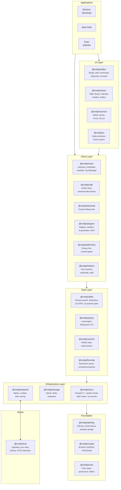
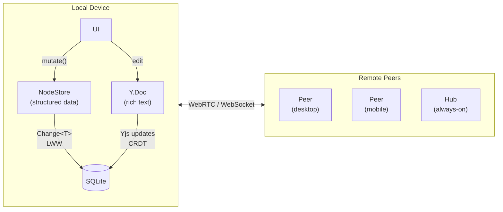

# xNet

[](https://github.com/crs48/xNet/actions/workflows/ci.yml)
[](https://www.npmjs.com/package/@xnetjs/react)
[](https://github.com/crs48/xNet/actions/workflows/electron-release.yml)
[](https://xnet.fyi/app)
[](https://github.com/crs48/xNet/actions/workflows/hub-release.yml)
[](https://hub.xnet.fyi/health)
[](https://xnet.fyi/docs)
[](https://github.com/crs48/xNet/stargazers)
[](./LICENSE)
[](https://www.typescriptlang.org/)
[](https://pnpm.io/)
[](https://turbo.build/)
[](https://github.com/crs48/xNet/pulls)

Decentralized data infrastructure and application. Local-first, P2P-synced, user-owned data.

xNet is both the underlying infrastructure and the user-facing app — one product, one brand. It starts with documents and databases, then expands via plugins to support ERP, MCP integrations, and more.

## Try It Now

**[Try the demo at xnet.fyi/app](https://xnet.fyi/app)** — no signup required, just use your device's passkey (Touch ID, Face ID, Windows Hello).

> **Demo mode:** Your data is stored locally in your browser (local-first). Encrypted backups sync to our demo hub with a 10MB quota and expire after 24 hours of inactivity. For reliable cross-device sync and permanent backups, [download the desktop app](https://xnet.fyi/download).

## Deploy a Hub

[](https://railway.app/template/xnet-hub)

## Getting Started

```bash
# Install dependencies
pnpm install

# Run the root Storybook catalog and workbenches
pnpm dev:stories

# Build the static Storybook site
pnpm build:stories

# Build all packages
pnpm build

# Run unit tests (~2400 tests across 148 test files)
pnpm test

# Run integration tests (real browser via Playwright)
pnpm --filter @xnetjs/integration-tests test

# Type check
pnpm typecheck

# Lint
pnpm lint
```

## Component Development

xNet now ships a root Storybook workspace for isolated component development across shared UI and app-facing surfaces.

- Run `pnpm dev:stories` from the repo root to launch Storybook on `http://127.0.0.1:6006`.
- Use `pnpm build:stories` to produce the static catalog and `pnpm test:stories` to run Storybook tests against a running server.
- In Electron dev builds, open the embedded Storybook surface from `Open Stories` in the system menu or command palette.
- In Web dev builds, open the embedded route at `/stories`.

Current Storybook coverage includes:

- `@xnetjs/ui` primitives, composed components, comments, settings, and devtools catalogs
- `@xnetjs/editor` rich collaborative editor workbench
- `@xnetjs/views` database surface workbench
- `@xnetjs/canvas` canvas workbench
- selected Electron and Web renderer stories

## Monorepo Structure

```
packages/           # 21 core SDK packages (@xnetjs/*)
apps/               # Electron, Web, Expo applications
site/               # Astro + Starlight documentation website
tests/              # Browser-based integration tests (Playwright)
docs/               # Vision, explorations, implementation plans
```

See the README in each directory for details:

- [packages/README.md](./packages/README.md) -- All 21 packages with dependency graph
- [apps/README.md](./apps/README.md) -- Electron, Web, Expo apps
- [tests/README.md](./tests/README.md) -- Integration test suite
- [site/README.md](./site/README.md) -- Documentation website

## Packages

### Foundation

| Package                                 | Description                                           |
| --------------------------------------- | ----------------------------------------------------- |
| [@xnetjs/core](./packages/core)         | Types, content addressing (CIDs), permissions, RBAC   |
| [@xnetjs/crypto](./packages/crypto)     | BLAKE3 hashing, Ed25519 signing, XChaCha20 encryption |
| [@xnetjs/identity](./packages/identity) | DID:key generation, UCAN tokens, passkey storage      |

### Infrastructure

| Package                               | Description                                                             |
| ------------------------------------- | ----------------------------------------------------------------------- |
| [@xnetjs/storage](./packages/storage) | SQLite/memory adapters, blob store, chunk manager, snapshots            |
| [@xnetjs/sync](./packages/sync)       | Change\<T\>, Lamport clocks, hash chains, Yjs security layer            |
| [@xnetjs/data](./packages/data)       | Schema system, NodeStore, 15 property types, Yjs CRDT, built-in schemas |
| [@xnetjs/network](./packages/network) | libp2p node, y-webrtc provider, peer scoring, security suite            |
| [@xnetjs/query](./packages/query)     | Local query engine, MiniSearch full-text search, federated router       |
| [@xnetjs/hub](./packages/hub)         | Signaling server, sync relay, backup, FTS5 search, sharding, federation |

### Application

| Package                                   | Description                                                                    |
| ----------------------------------------- | ------------------------------------------------------------------------------ |
| [@xnetjs/react](./packages/react)         | useQuery, useMutate, useNode, hub hooks, plugin hooks, sync infrastructure     |
| [@xnetjs/sdk](./packages/sdk)             | Unified client, browser/node presets, re-exports                               |
| [@xnetjs/editor](./packages/editor)       | TipTap collaborative editor, slash commands, wikilinks, drag-drop, mermaid     |
| [@xnetjs/ui](./packages/ui)               | Radix UI primitives, composed components, theme system, design tokens          |
| [@xnetjs/views](./packages/views)         | Table, Board, Gallery, Timeline, Calendar views with property renderers        |
| [@xnetjs/canvas](./packages/canvas)       | Infinite canvas, R-tree spatial indexing, ELK.js auto-layout, Yjs-backed store |
| [@xnetjs/devtools](./packages/devtools)   | 9-panel debug suite (node explorer, sync monitor, Yjs inspector, ...)          |
| [@xnetjs/history](./packages/history)     | Time machine, undo/redo, audit trails, blame, diff, verification               |
| [@xnetjs/plugins](./packages/plugins)     | Plugin registry, sandboxed scripts, AI generation, MCP server, webhooks        |
| [@xnetjs/telemetry](./packages/telemetry) | Privacy-preserving telemetry, tiered consent, k-anonymity, scrubbing           |
| [@xnetjs/formula](./packages/formula)     | Expression parser, AST evaluator, built-in function library                    |
| [@xnetjs/vectors](./packages/vectors)     | HNSW vector index, semantic search, hybrid keyword+semantic search             |

## Apps

| App                         | Tech                                                 | Description                   |
| --------------------------- | ---------------------------------------------------- | ----------------------------- |
| [Electron](./apps/electron) | Electron + Vite + React + TanStack Router + Tailwind | Desktop (macOS/Windows/Linux) |
| [Web](./apps/web)           | Vite + React + TanStack Router + Workbox PWA         | Browser progressive web app   |
| [Expo](./apps/expo)         | Expo SDK 52 + React Native + React Navigation        | Mobile (iOS/Android)          |

## Architecture



### Hybrid Sync Model



## Data Model

Everything is a **Node** (universal container). A **Schema** defines what the Node is.

```typescript
import { defineSchema, text, number, select } from '@xnetjs/data'

const InvoiceSchema = defineSchema({
  name: 'Invoice',
  namespace: 'xnet://myapp/',
  document: 'yjs',
  properties: {
    title: text({ required: true }),
    amount: number(),
    status: select({
      options: [
        { id: 'draft', name: 'Draft' },
        { id: 'sent', name: 'Sent' },
        { id: 'paid', name: 'Paid' }
      ] as const
    })
  }
})
```

### Sync Strategies

| Data Type               | Sync Mechanism      | Conflict Resolution   |
| ----------------------- | ------------------- | --------------------- |
| Rich text (documents)   | Yjs CRDT            | Character-level merge |
| Structured data (nodes) | NodeStore + Lamport | Field-level LWW       |

### Identity, Roles, and Authorization

xNet schemas can include an `authorization` block that maps **identity (DID)** to roles and actions.

- **Identity:** Every node has `createdBy: did:key:...`
- **Roles:** Resolved from creator, person properties, or related nodes
- **Actions:** Canonical actions are `read`, `write`, `delete`, `share`, `admin`
- **Delegation:** Grants (UCAN-backed) allow secure permission delegation

```typescript
const ProjectDocSchema = defineSchema({
  name: 'ProjectDoc',
  namespace: 'xnet://myapp/',
  document: 'yjs',
  properties: {
    title: text({ required: true }),
    owner: person(),
    editors: person(),
    project: relation({ schema: 'xnet://myapp/Project@1.0.0' })
  },
  authorization: {
    roles: {
      owner: role.creator(),
      editor: role.property('editors'),
      projectAdmin: role.relation('project', 'admin')
    },
    actions: {
      read: allow('owner', 'editor', 'projectAdmin'),
      write: allow('owner', 'editor', 'projectAdmin'),
      delete: allow('owner', 'projectAdmin'),
      share: allow('owner', 'projectAdmin'),
      admin: allow('projectAdmin')
    },
    publicProps: ['title']
  }
})
```

> Authorization builders (`allow`, `role`, etc.) come from the data auth module and compile to schema-level policy metadata.

## Primary React Hooks

```tsx
import { useQuery, useMutate, useNode, useIdentity, useCan, useGrants } from '@xnetjs/react'

// Structured data
function TaskList() {
  const { data: tasks, loading } = useQuery(TaskSchema)
  const { create, update, remove } = useMutate()

  return (
    <ul>
      {tasks.map((task) => (
        <li key={task.id}>{task.title}</li>
      ))}
      <button onClick={() => create(TaskSchema, { title: 'New', status: 'todo' })}>Add</button>
    </ul>
  )
}

// Rich text with Yjs CRDT
function PageEditor({ nodeId }: { nodeId: string }) {
  const { data: page, doc, syncStatus, peerCount } = useNode(PageSchema, nodeId)
  if (!doc) return null
  return <RichTextEditor ydoc={doc} />
}

// Identity + permissions
function SharingPanel({ nodeId }: { nodeId: string }) {
  const { did } = useIdentity()
  const { allowed: canShare } = useCan(nodeId, 'share')
  const { grant } = useGrants(nodeId)

  return (
    <button
      disabled={!canShare}
      onClick={() =>
        canShare && grant({ to: 'did:key:z6MkRecipient...', actions: ['read', 'write'] })
      }
    >
      Share as {did.slice(0, 16)}...
    </button>
  )
}
```

### Hook Quick Reference

| Hook          | Use for                                          |
| ------------- | ------------------------------------------------ |
| `useQuery`    | Read lists/single nodes with realtime updates    |
| `useMutate`   | Create/update/delete/transactional writes        |
| `useNode`     | Rich text nodes (`Y.Doc`), sync status, presence |
| `useIdentity` | Current DID identity context                     |
| `useCan`      | Check action permissions on a node               |
| `useCanEdit`  | Quick editable state for UI gating               |
| `useGrants`   | Grant, revoke, and inspect delegated access      |

## Key Technologies

| Layer      | Technology                                         |
| ---------- | -------------------------------------------------- |
| Sync       | Event-sourced immutable logs, Lamport clocks, LWW  |
| CRDT       | Yjs (conflict-free collaboration)                  |
| P2P        | libp2p + WebRTC                                    |
| Storage    | SQLite (OPFS in browser, native on desktop/mobile) |
| Identity   | DID:key + UCAN authorization                       |
| Signing    | Ed25519 (via @noble/curves)                        |
| Hashing    | BLAKE3 (via @noble/hashes)                         |
| Encryption | XChaCha20-Poly1305                                 |
| Search     | MiniSearch (local), FTS5 (hub)                     |
| Build      | Turborepo, tsup, Vite                              |
| Testing    | Vitest, Playwright (browser mode)                  |

## Roadmap Status (Mar 2026)

| Phase   | Focus                                                                           | Status      |
| ------- | ------------------------------------------------------------------------------- | ----------- |
| Phase 1 | Product reliability (navigation, search, daily-driver polish)                   | In progress |
| Phase 2 | Collaboration + trust (invites, sharing UX, presence reliability)               | Next        |
| Phase 3 | Platform clarity (package lifecycle, API simplification, multi-hub integration) | Planned     |

See [`docs/ROADMAP.md`](./docs/ROADMAP.md) for the detailed execution plan.

## Documentation

- [Site](./site) -- Astro + Starlight documentation website
- [Vision](./docs/VISION.md) -- The big picture: micro-to-macro data sovereignty
- [Tradeoffs](./docs/TRADEOFFS.md) -- Why hybrid sync (Yjs + event sourcing)
- [Roadmap](./docs/ROADMAP.md) -- current 6-month execution plan (Mar-Sep 2026)

## License

MIT
