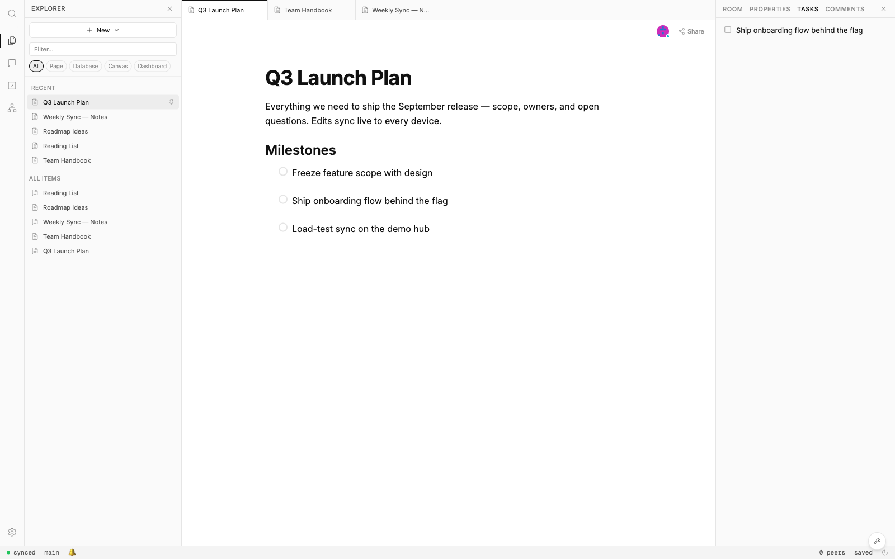

# xNet

[](https://github.com/crs48/xNet/actions/workflows/ci.yml)
[](https://www.npmjs.com/package/@xnetjs/react)
[](https://xnet.fyi/app)
[](./LICENSE)

**xNet is a local-first workspace — documents, databases, and canvases that
live on your device, sync everywhere, and belong to you.** There is no account
to create and no server in the middle: data is stored locally, synced
peer-to-peer or through a hub you control, and signed with your own keys.

<picture>
  <source media="(prefers-color-scheme: dark)" srcset="site/public/images/workbench-dark.png">
  
</picture>

## Try it

- **[Open the demo](https://xnet.fyi/app)** — no signup; sign in with your
  device's passkey (Touch ID, Face ID, Windows Hello). Demo data lives in your
  browser, with encrypted backups on our demo hub (10MB, expires after 24
  hours of inactivity).
- **[Download the desktop app](https://xnet.fyi/download)** for permanent
  backups and reliable cross-device sync.
- **[Deploy your own hub](https://railway.app/template/xnet-hub)** — an
  always-on relay and backup node that you run.

> **Alpha software.** The `@xnetjs/*` packages, desktop app, and hub image all
> ship today — but APIs, schemas, and wire formats can still change between
> releases, sometimes without a migration path. Pin your versions, read the
> [changelog](https://xnet.fyi/changelog) before upgrading, and keep a backup
> you control (`.xnetpack` export is built in). Package version numbers are
> not a maturity signal; what is and isn't stable is written down in
> [STABILITY.md](./STABILITY.md).

## Build with it

Everything in xNet is a **node**, and a **schema** describes what a node is:

```typescript
import { defineSchema, text, number, select } from '@xnetjs/data'

const InvoiceSchema = defineSchema({
  name: 'Invoice',
  namespace: 'xnet://myapp/',
  document: 'yjs',
  properties: {
    title: text({ required: true }),
    amount: number(),
    status: select({
      options: [
        { id: 'draft', name: 'Draft' },
        { id: 'sent', name: 'Sent' },
        { id: 'paid', name: 'Paid' }
      ] as const
    })
  }
})
```

React hooks give you live queries, mutations, collaborative rich text, and
permissions:

```tsx
import { useQuery, useMutate, useNode, useIdentity, useCan, useGrants } from '@xnetjs/react'

// Structured data — live queries and writes
function TaskList() {
  const { data: tasks, loading } = useQuery(TaskSchema)
  const { create, update, remove } = useMutate()

  return (
    <ul>
      {tasks.map((task) => (
        <li key={task.id}>{task.title}</li>
      ))}
      <button onClick={() => create(TaskSchema, { title: 'New', status: 'todo' })}>Add</button>
    </ul>
  )
}

// Rich text — a synced Y.Doc per node
function PageEditor({ nodeId }: { nodeId: string }) {
  const { data: page, doc, syncStatus, peerCount } = useNode(PageSchema, nodeId)
  if (!doc) return null
  return <RichTextEditor ydoc={doc} />
}

// Identity and sharing — DIDs, permission checks, delegated grants
function SharingPanel({ nodeId }: { nodeId: string }) {
  const { did } = useIdentity()
  const { allowed: canShare } = useCan(nodeId, 'share')
  const { grant } = useGrants(nodeId)

  return (
    <button
      disabled={!canShare}
      onClick={() =>
        canShare && grant({ to: 'did:key:z6MkRecipient...', actions: ['read', 'write'] })
      }
    >
      Share as {did.slice(0, 16)}...
    </button>
  )
}
```

Under the hood: SQLite for storage (OPFS in the browser, native on desktop),
Yjs CRDTs for rich text, an event-sourced change log for structured data,
libp2p + WebRTC for peer-to-peer sync, and DID:key + UCAN for identity and
sharing. The deep dives live in the [docs](https://xnet.fyi/docs).

## An open protocol

This repository is one implementation of xNet. The protocol itself is an open
standard you can re-implement in any language, over any database, and
interoperate: see the [normative spec](./docs/specs/protocol/), the
[conformance suite](./conformance) (golden vectors plus a second-language
kernel), and [xnet.fyi/docs/protocol](https://xnet.fyi/docs/protocol/overview/).
Independent implementations that pass conformance may call themselves
**"xNet-compatible"** ([how](./docs/COMPATIBILITY.md)).

## Develop

```bash
pnpm install
pnpm --filter xnet-web dev    # run the web app
pnpm dev:stories              # Storybook component catalog
pnpm build                    # build all packages
pnpm test                     # unit tests
pnpm typecheck && pnpm lint
```

The monorepo at a glance:

- [`packages/`](./packages/README.md) — the `@xnetjs/*` SDK packages, from
  crypto and storage up through React hooks, editor, views, and canvas
- [`apps/`](./apps/README.md) — Electron desktop, web PWA, and Expo mobile
- [`site/`](./site/README.md) — the docs and landing site (Astro + Starlight)
- [`tests/`](./tests/README.md) — browser-based integration tests (Playwright)

## Learn more

- [Vision](./docs/VISION.md) — the big picture: micro-to-macro data sovereignty
- [Tradeoffs](./docs/TRADEOFFS.md) — why hybrid sync (Yjs + event sourcing)
- [Roadmap](./docs/ROADMAP.md) — the current six-month execution plan

## Project

- [Governance](./GOVERNANCE.md) · [Code of Conduct](./CODE_OF_CONDUCT.md) ·
  [Charter](./docs/CHARTER.md) · [Maintainers](./MAINTAINERS.md) ·
  [Trademark & Brand](./TRADEMARK.md)
- Contributions use the [DCO](https://developercertificate.org/)
  (`git commit -s`) — no CLA. See [CONTRIBUTING.md](./CONTRIBUTING.md).

## License

MIT — see [`LICENSE`](./LICENSE). The `@xnetjs/cloud` package is
source-available under [FSL-1.1-Apache-2.0](./packages/cloud/LICENSE)
(converts to Apache-2.0 two years after each release).
