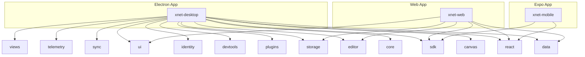

# xNet Applications

Platform-specific applications built on the xNet SDK.

## Applications

| App                    | Platform              | Tech Stack                                           | Description                              |
| ---------------------- | --------------------- | ---------------------------------------------------- | ---------------------------------------- |
| [electron](./electron) | macOS, Windows, Linux | Electron + Vite + React + TanStack Router + Tailwind | Desktop app (primary development target) |
| [web](./web)           | Browser               | Vite + React + TanStack Router + Workbox PWA         | Progressive web app                      |
| [expo](./expo)         | iOS, Android          | Expo SDK 52 + React Native + React Navigation        | Mobile app                               |

## Development

```bash
# Root Storybook catalog and workbenches
pnpm dev:stories

# Electron (primary -- starts hub + app concurrently)
cd apps/electron
pnpm dev

# Two Electron instances for sync testing
cd apps/electron
pnpm dev:both

# Web
cd apps/web
pnpm dev

# Expo
cd apps/expo
pnpm start
pnpm ios
```

## Embedded Stories

The monorepo now uses one root Storybook runtime for isolated component development.

- Storybook serves from the repo root on `http://127.0.0.1:6006`.
- Electron exposes a dev-only embedded Stories surface through `Open Stories` in the menu and command palette.
- Web exposes a dev-only embedded Stories route at `/stories`.
- Story coverage currently spans shared UI plus workbenches for the editor, database views, and canvas.

## Package Dependencies



The Electron app uses the full package set. Web uses a subset. Expo uses the minimal React + SDK layer.
