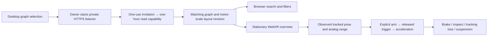

# Spatial Library experiment

The standalone browser viewer shares the desktop Library's graph types, filters,
search and initial layout. It does not import Electron preload or create a second
Library database. The desktop graph's **Spatial viewer** control pairs a frozen
projection of the links in the current view.



## Try the synthetic probe

From the repository root:

```sh
pnpm --filter xnet-desktop spatial:dev
pnpm --filter xnet-desktop spatial:build
pnpm --filter xnet-desktop spatial:typecheck
pnpm exec vitest run --project electron apps/electron/src/shared/library-flight.test.ts apps/electron/src/shared/spatial-library.test.ts apps/electron/src/main/spatial-bridge.test.ts
```

The development viewer is loopback-only. It offers 1,000, 10,000 and 56,000
synthetic links. It is a separate browser entry, not the Electron renderer in a
tab. Do not expose a development server or debugger to the headset.

## Pair a private Library snapshot

1. Build or start the desktop app. The viewer assets are built with it.
2. Connect both devices to a trusted private network. Provision a valid HTTPS
   certificate for the Mac's address and establish trust on both devices through
   the operating systems. Do not bypass certificate warnings. The headset's
   `localhost` is not the Mac.
3. In the desktop Library graph, choose filters for the links to expose and open
   **Spatial viewer**. Supply `https://your-mac.local:8443`, then choose the matching
   certificate and private key. The key stays on the Mac.
4. Open the copied, single-use link in headset Safari within five minutes. The
   viewer removes its fragment and holds the exchanged capability only in memory.
   Reloading loses the capability; create a new pairing instead of saving it.
5. Use **Revoke access** on the Mac when done. Expiry or quitting also stops the
   listener. See ADR-47 for scope, security boundaries and limitations.

Search addresses every paired link and group, even when relationship lines are
limited. Selecting a result highlights it and brakes without travelling. Choose
**Travel there** separately inside the session. Home and Back retain a bounded
return trail. Exit / search ends immersion so the browser can accept normal text
input; DOM Overlay is not assumed. The same desktop camera and target are restored.

The scene is stable during immersion. Graph changes are applied only outside the
session. Filtering retains the original resource coordinates. A new revision
resets saved travel positions. One image and card, eight group labels, 20,000
background lines and 200 selected relationships are provisional limits, not
measured headset budgets. Picking runs on deliberate selection, not every frame.

## Hardware release review — owned by Chris

No physical headset validation is recorded yet. Advanced full-pose flight and the
WebXR-versus-native decision remain blocked on these observations, as required by
exploration 0468. Button-only input does not enable flight.

For each fixture size, enter the stationary overview, then record actual headset,
visionOS, Safari and controller firmware versions in **Hardware observations**.
Pair Sense controllers in system settings. Translate and rotate each independently,
then slowly sweep the trigger from released to fully pressed. The report records
input profiles, handedness, ray mode, grip availability, non-emulated position,
observed position/orientation change and analog range. Those observations gate the
experimental Arm button; they are not a substitute for the review below.

| Review     | Required evidence                                                                                                                  |
| ---------- | ---------------------------------------------------------------------------------------------------------------------------------- |
| Input      | Full position and rotation, trigger range, disconnect/reconnect, hands-only pinch and coexistence of transient input sources       |
| Navigation | Find three known resources, inspect coverage and thumbnails, travel explicitly, return home/back                                   |
| Safety     | Held-trigger entry, tracking loss, invalid pose, hidden session and reconnect never resume without arming and release              |
| Selection  | Flight-hand trigger does not select graph nodes during flight; inspection and the squeeze brake stop motion                        |
| Comfort    | Chris's proposed 20-minute browsing trial, including a useful stationary alternative                                               |
| Scale      | Delivered cadence and p95/p99 intervals at all three sizes; sustained behavior, actual memory measurement and chosen budgets       |
| Access     | Trusted HTTPS on the physical headset, pairing, expiry/revocation and loss of network; visible errors and unchanged source Library |
| Lifecycle  | Repeated entry/exit restores the flat camera and leaves no animation loop or input listeners behind                                |

Download the probe report after each run. Timing percentiles use the last 4,096
frame intervals; frame counts and interruptions are cumulative. The report includes
Three.js geometry/texture counts, not process memory or GPU duration. Declare a
frame budget from the observed cadence, then measure actual device memory with
available platform tools. Do not report desktop results as stereo performance.

After the default interaction passes hardware review, decide whether to implement
the advanced full-pose clutch. If Safari lacks tracked Sense input, retain the
hands-based viewer and review a native visionOS client against the same tasks.
