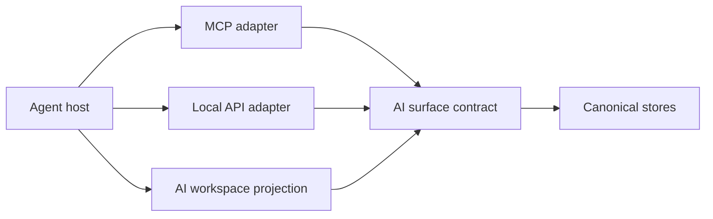
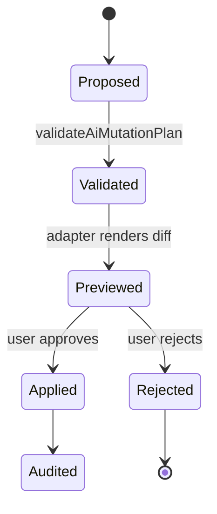

# xNet AI Surface Contract

The AI surface contract defines the shared language used by MCP, the Local API, future file projection, and in-app AI. It keeps read context, proposed writes, validation, and audit events consistent across adapters.

## Core Types

- `AiResource` describes readable context such as workspace summaries, pages, databases, canvases, search results, and audit events.
- `AiToolDefinition` describes callable actions with JSON input schemas, required scopes, and risk levels.
- `AiMutationPlan` is the plan-first write primitive. Plans contain target-specific change sets and must validate before preview or apply.
- `AiValidationResult` returns `{ valid, errors, warnings }` so adapters can report problems without throwing.
- `AiAuditEvent` records applied plans, scopes, validation, change ids, and rollback handles.

## Mutation Plan Lifecycle

## Safety Rules

- Every tool and resource declares `requiredScopes`.
- Every tool declares a risk level: `low`, `medium`, `high`, or `critical`.
- `storage.recovery` requires `critical` risk.
- Low-risk plans that request write scopes produce warnings.
- Mutation plans are serializable JSON so they can move through MCP results, REST responses, `.xnet/pending/*.plan.json`, and audit logs.
