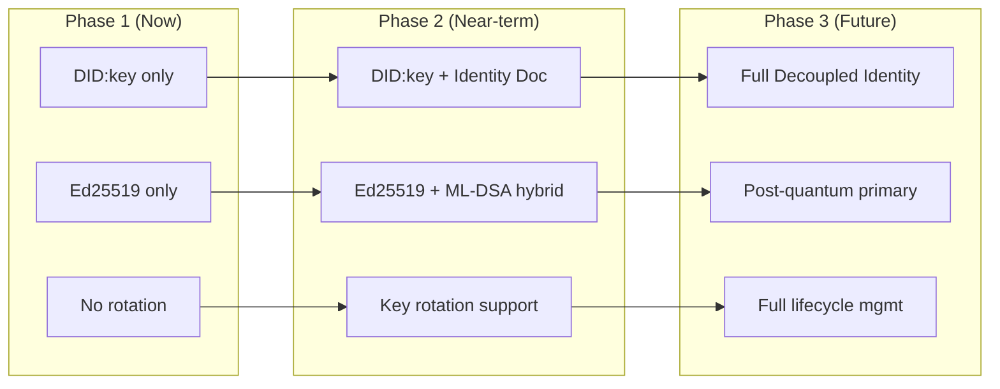
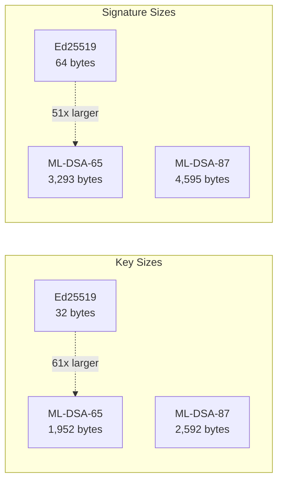
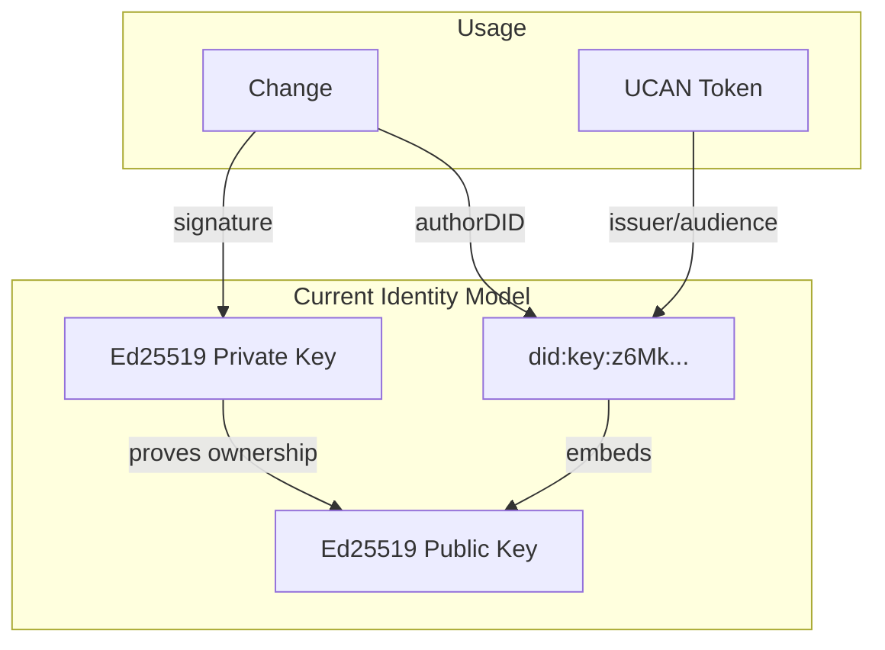
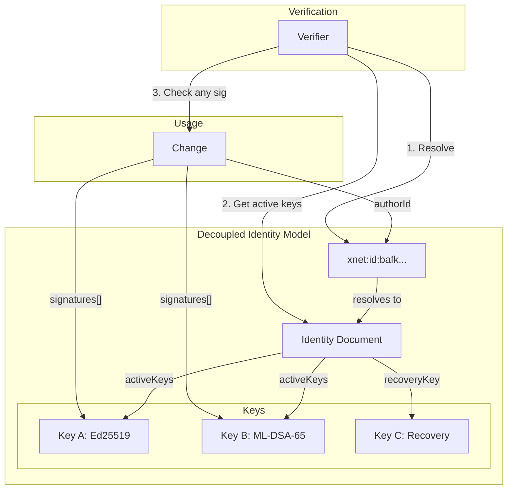
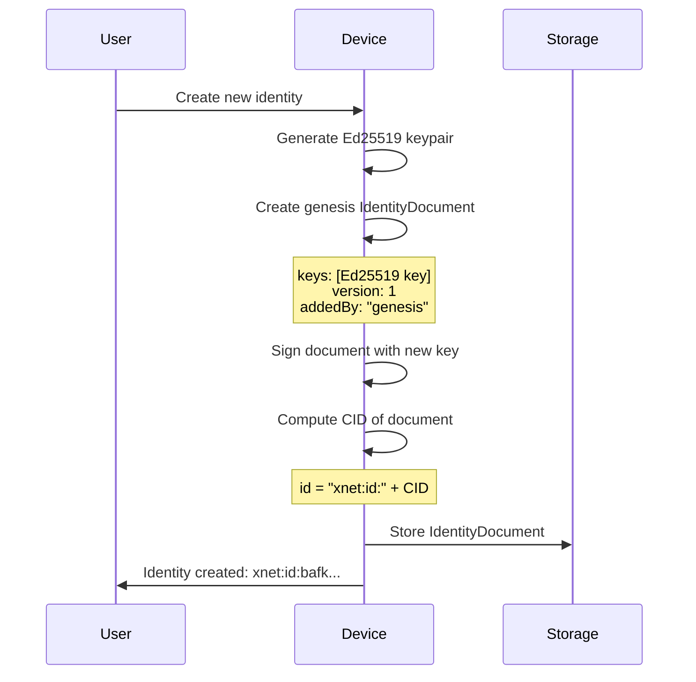
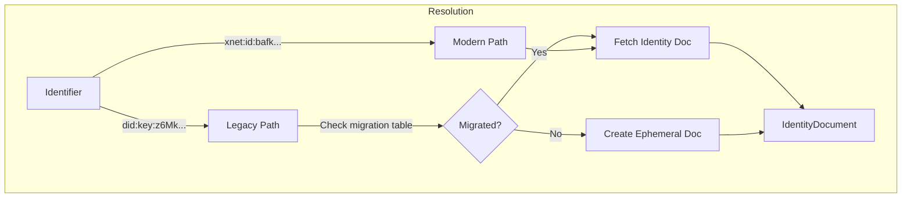
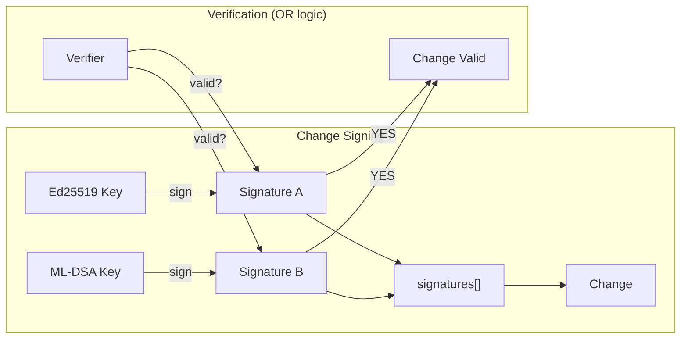
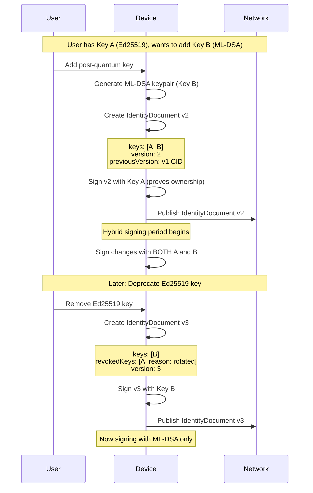
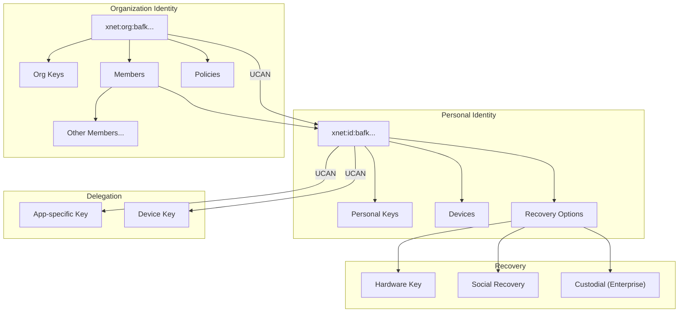
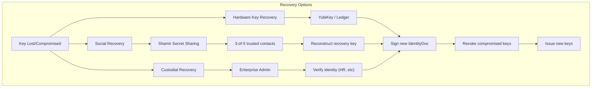

# Identity Migration Plan: DID:key to Decoupled Identity

This document outlines the migration path from simple DID:key identities to a full decoupled identity system that supports key rotation, post-quantum cryptography, and enterprise use cases.

## Overview



## Why Migrate?

| Concern               | DID:key (Current)      | Decoupled Identity (Target) |
| --------------------- | ---------------------- | --------------------------- |
| Key compromise        | Identity lost forever  | Revoke key, keep identity   |
| Key rotation          | Not possible           | Supported                   |
| Quantum computers     | Vulnerable (Ed25519)   | Migrate to ML-DSA           |
| Multiple devices      | Separate identity each | One identity, multiple keys |
| Account recovery      | Impossible             | Social/hardware recovery    |
| Enterprise compliance | Limited                | Full audit trail, policies  |

---

## Performance & Size Costs

This section enumerates the concrete costs of each phase to inform architecture decisions.

### Cryptographic Algorithm Comparison



#### Raw Algorithm Costs

| Metric             | Ed25519           | ML-DSA-65       | ML-DSA-87       | Hybrid (Ed25519 + ML-DSA-65) |
| ------------------ | ----------------- | --------------- | --------------- | ---------------------------- |
| **Public Key**     | 32 bytes          | 1,952 bytes     | 2,592 bytes     | 1,984 bytes                  |
| **Private Key**    | 64 bytes          | 4,032 bytes     | 4,896 bytes     | 4,096 bytes                  |
| **Signature**      | 64 bytes          | 3,293 bytes     | 4,595 bytes     | 3,357 bytes                  |
| **Sign ops/sec**   | ~50,000           | ~10,000         | ~6,000          | ~8,000                       |
| **Verify ops/sec** | ~20,000           | ~30,000         | ~20,000         | ~12,000                      |
| **Security Level** | 128-bit classical | 128-bit quantum | 192-bit quantum | 128-bit quantum              |

### Per-Change Overhead

Every `Change<T>` in the sync log includes identity and signature data:

| Field                       | Phase 1 (Ed25519) | Phase 2 (Hybrid) | Phase 3 (ML-DSA only) |
| --------------------------- | ----------------- | ---------------- | --------------------- |
| `authorDID`                 | 56 bytes          | 56 bytes         | -                     |
| `authorId`                  | -                 | 60 bytes         | 60 bytes              |
| `signature`                 | 64 bytes          | -                | -                     |
| `signatures[]`              | -                 | ~3,450 bytes     | ~3,380 bytes          |
| **Total identity overhead** | **120 bytes**     | **3,566 bytes**  | **3,440 bytes**       |
| **Overhead multiplier**     | 1x                | **30x**          | **29x**               |

#### Impact on Sync Volume

| Scenario                        | Changes | Phase 1 Size | Phase 2 Size | Phase 3 Size |
| ------------------------------- | ------- | ------------ | ------------ | ------------ |
| Single document edit            | 1       | 120 B        | 3.5 KB       | 3.4 KB       |
| Typing session (100 changes)    | 100     | 12 KB        | 350 KB       | 340 KB       |
| Database with 1K records        | 1,000   | 120 KB       | 3.5 MB       | 3.4 MB       |
| Database with 10K records       | 10,000  | 1.2 MB       | 35 MB        | 34 MB        |
| Active workspace (100K changes) | 100,000 | 12 MB        | 350 MB       | 340 MB       |

### Identity Document Sizes

| Component                     | Phase 1 | Phase 2 (1 key)  | Phase 2 (3 keys) | Phase 3 (5 keys + history) |
| ----------------------------- | ------- | ---------------- | ---------------- | -------------------------- |
| Base document                 | -       | ~200 bytes       | ~200 bytes       | ~300 bytes                 |
| Ed25519 key entry             | -       | ~150 bytes       | ~150 bytes       | ~150 bytes                 |
| ML-DSA-65 key entry           | -       | ~2,100 bytes     | ~2,100 bytes     | ~2,100 bytes               |
| Revoked key entry             | -       | -                | ~100 bytes       | ~100 bytes                 |
| Document signature            | -       | ~3,400 bytes     | ~3,400 bytes     | ~3,400 bytes               |
| **Total per version**         | **0**   | **~5,850 bytes** | **~8,200 bytes** | **~14,000 bytes**          |
| Version history (10 versions) | -       | -                | -                | ~100 KB                    |

### Storage Costs by Phase

| Storage Type               | Phase 1 | Phase 2  | Phase 3    |
| -------------------------- | ------- | -------- | ---------- |
| **Per user identity**      | 0       | ~6-15 KB | ~50-150 KB |
| **Per change (signature)** | 64 B    | 3.4 KB   | 3.4 KB     |
| **Per UCAN token**         | ~500 B  | ~4 KB    | ~4 KB      |
| **Key storage (private)**  | 64 B    | 4.1 KB   | 4.1 KB     |

### Network/Bandwidth Costs

| Operation                 | Phase 1             | Phase 2         | Phase 3          |
| ------------------------- | ------------------- | --------------- | ---------------- |
| **Identity resolution**   | 0 (embedded in DID) | 1 fetch (~6 KB) | 1 fetch (~15 KB) |
| **Sync 1 change**         | 120 B               | 3.5 KB          | 3.4 KB           |
| **Sync 100 changes**      | 12 KB               | 350 KB          | 340 KB           |
| **UCAN delegation**       | ~500 B              | ~4 KB           | ~4 KB            |
| **Initial identity sync** | 0                   | ~6 KB           | ~50 KB           |

### CPU/Memory Costs

| Operation               | Phase 1    | Phase 2 | Phase 3 |
| ----------------------- | ---------- | ------- | ------- |
| **Key generation**      | <1ms       | ~10ms   | ~10ms   |
| **Sign (per change)**   | ~0.02ms    | ~0.15ms | ~0.1ms  |
| **Verify (per change)** | ~0.05ms    | ~0.12ms | ~0.03ms |
| **Memory per keypair**  | ~100 B     | ~6 KB   | ~5 KB   |
| **WASM module size**    | 0 (native) | +200 KB | +200 KB |

### Verification Latency


| Step             | Phase 1        | Phase 2/3 (cached) | Phase 2/3 (uncached) |
| ---------------- | -------------- | ------------------ | -------------------- |
| Parse change     | 0.01ms         | 0.01ms             | 0.01ms               |
| Resolve identity | 0 (embedded)   | 0.1ms (cache hit)  | 10-100ms (network)   |
| Find signing key | 0 (single key) | 0.01ms             | 0.01ms               |
| Verify signature | 0.05ms         | 0.12ms             | 0.12ms               |
| **Total**        | **~0.06ms**    | **~0.24ms**        | **10-100ms**         |

### Tradeoff Summary

```mermaid
quadrantChart
    title Phase Comparison: Security vs Efficiency
    x-axis Low Efficiency --> High Efficiency
    y-axis Low Security --> High Security
    quadrant-1 Ideal (if possible)
    quadrant-2 Secure but costly
    quadrant-3 Avoid
    quadrant-4 Fast but risky

    Phase 1 Ed25519: [0.85, 0.35]
    Phase 2 Hybrid: [0.4, 0.75]
    Phase 3 ML-DSA: [0.45, 0.85]
```

| Aspect                        | Phase 1          | Phase 2       | Phase 3       |
| ----------------------------- | ---------------- | ------------- | ------------- |
| **Signature size**            | Excellent (64 B) | Poor (3.4 KB) | Poor (3.4 KB) |
| **Sign speed**                | Excellent        | Good          | Good          |
| **Verify speed**              | Good             | Good          | Excellent     |
| **Quantum resistance**        | None             | Yes           | Yes           |
| **Key rotation**              | No               | Yes           | Yes           |
| **Storage cost**              | Low              | High (30x)    | High (29x)    |
| **Bandwidth cost**            | Low              | High (30x)    | High (29x)    |
| **Implementation complexity** | Simple           | Medium        | Medium        |
| **Ecosystem support**         | Excellent        | Growing       | Growing       |

### Mitigation Strategies

To reduce Phase 2/3 overhead:

| Strategy                  | Savings                       | Tradeoff             |
| ------------------------- | ----------------------------- | -------------------- |
| **Signature aggregation** | Batch N changes, 1 signature  | Latency (must batch) |
| **Lazy verification**     | Skip verify until needed      | Trust assumption     |
| **Identity caching**      | Avoid repeated resolution     | Stale data risk      |
| **Compression**           | ~50% on signatures            | CPU cost             |
| **Single-algorithm mode** | Skip Ed25519 in Phase 3       | Lose backward compat |
| **Checkpoint snapshots**  | Verify snapshot, not full log | Complexity           |

### Recommendations

1. **Phase 1 → Phase 2 trigger**: When quantum computers reach 1000+ logical qubits, or when enterprise customers require key rotation.

2. **Batch changes**: In Phase 2+, batch multiple changes under one signature where possible (e.g., typing sessions, bulk imports).

3. **Cache aggressively**: Identity documents change rarely; cache with TTL of hours/days.

4. **Compress on wire**: Signatures compress well; use compression for sync.

5. **Progressive verification**: For large imports, verify lazily or in background.

---

## Phase 1: Current State (Ship Now)

### Architecture



### What We Have

- Identity is the public key: `did:key:z6MkhaXgBZDvotDkL5257faiztiGiC2QtKLGpbnnEGta2doK`
- Ed25519 signatures on all Changes
- UCAN tokens reference DIDs directly
- Simple, works offline, no infrastructure needed

### Limitations

- Key compromise = identity loss (no recovery)
- No key rotation
- Quantum vulnerable (Shor's algorithm breaks Ed25519)
- Each device needs separate identity or shared private key

**No changes needed for Phase 1** - this works for personal use and early adopters.

---

## Phase 2: Key Document + Hybrid Signatures

### Architecture



### 2.1 Identity Document Schema

A signed, versioned document that maps a stable identity to keys:

```typescript
interface IdentityDocument {
  // Stable identity (content-addressed from initial creation)
  id: string // "xnet:id:bafk..." (CID of genesis document)

  // Human-friendly (optional, not authoritative)
  handle?: string // "alice" (unique within a namespace)

  // Key management
  keys: KeyEntry[]
  revokedKeys: RevokedKey[]

  // Document versioning
  version: number
  previousVersion?: string // CID of previous version
  timestamp: number

  // Must be signed by an active key
  signature: string
}

interface KeyEntry {
  id: string // Key fingerprint (hash of public key)
  algorithm: 'Ed25519' | 'ML-DSA-65' | 'ML-DSA-87'
  publicKey: string // Base58 encoded
  purposes: ('sign' | 'encrypt' | 'recover')[]
  addedAt: number
  addedBy: string // Key ID that authorized this addition
  device?: string // Optional device label ("MacBook", "iPhone")
}

interface RevokedKey {
  id: string
  revokedAt: number
  revokedBy: string // Key ID that authorized revocation
  reason?: 'compromised' | 'lost' | 'rotated' | 'device-removed'
}
```

### 2.2 Identity Creation (Genesis)



```typescript
// First-time identity creation
async function createIdentity(
  algorithm: 'Ed25519' | 'ML-DSA-65' = 'Ed25519'
): Promise<{ identity: IdentityDocument; privateKey: Uint8Array }> {
  // Generate keypair
  const { publicKey, privateKey } = await generateKeypair(algorithm)
  const keyId = await fingerprintKey(publicKey)

  // Create genesis document (id and signature pending)
  const genesis: IdentityDocument = {
    id: 'pending',
    keys: [
      {
        id: keyId,
        algorithm,
        publicKey: base58Encode(publicKey),
        purposes: ['sign'],
        addedAt: Date.now(),
        addedBy: 'genesis'
      }
    ],
    revokedKeys: [],
    version: 1,
    timestamp: Date.now(),
    signature: 'pending'
  }

  // Sign with the genesis key
  genesis.signature = await sign(canonicalize(genesis), privateKey)

  // Identity = CID of signed genesis document (stable forever)
  genesis.id = `xnet:id:${await computeCID(genesis)}`

  return { identity: genesis, privateKey }
}
```

### 2.3 Backward Compatibility: DID:key Mapping



Existing DID:key users get automatic identity documents:

```typescript
// Migration: did:key -> xnet:id
async function migrateFromDidKey(
  didKey: string,
  privateKey: Uint8Array
): Promise<IdentityDocument> {
  const publicKey = extractPublicKeyFromDidKey(didKey)

  const identity = await createGenesisDocument({
    algorithm: 'Ed25519',
    publicKey,
    privateKey,
    // Preserve legacy DID for backward compat lookups
    metadata: { legacyDid: didKey }
  })

  // Store mapping for resolution
  await storeLegacyMapping(didKey, identity.id)

  return identity
}

// Lookup supports both formats
async function resolveIdentity(id: string): Promise<IdentityDocument> {
  if (id.startsWith('did:key:')) {
    // Check if this DID has been migrated
    const migratedId = await lookupLegacyDid(id)
    if (migratedId) {
      return fetchIdentityDocument(migratedId)
    }
    // Not migrated: create ephemeral doc for verification
    return createEphemeralDocFromDidKey(id)
  }

  if (id.startsWith('xnet:id:')) {
    return fetchIdentityDocument(id)
  }

  throw new Error(`Unknown identity format: ${id}`)
}
```

### 2.4 Hybrid Signatures

Changes can be signed with multiple algorithms for quantum-safe transition:



```typescript
interface Change<T> {
  // ... existing fields ...

  // Legacy (single signature) - keep for backward compat
  authorDID: string
  signature: string

  // New (Phase 2) - multiple signatures, identity reference
  authorId?: string // xnet:id:... (preferred over authorDID)
  signatures?: SignatureEntry[]
}

interface SignatureEntry {
  keyId: string // Which key signed (fingerprint)
  algorithm: string // Ed25519, ML-DSA-65, etc.
  signature: string // Base64 encoded
}

// Signing: Add both Ed25519 and ML-DSA signatures
async function signChange<T>(
  change: Change<T>,
  identity: IdentityDocument,
  keys: Map<string, Uint8Array> // keyId -> privateKey
): Promise<Change<T>> {
  const payload = canonicalize(change)
  const signatures: SignatureEntry[] = []

  for (const key of identity.keys) {
    if (!key.purposes.includes('sign')) continue
    const privateKey = keys.get(key.id)
    if (!privateKey) continue

    signatures.push({
      keyId: key.id,
      algorithm: key.algorithm,
      signature: await sign(payload, privateKey, key.algorithm)
    })
  }

  return {
    ...change,
    authorId: identity.id,
    signatures
  }
}

// Verification: Accept if ANY valid signature from an active key
async function verifyChange<T>(change: Change<T>, identity: IdentityDocument): Promise<boolean> {
  const payload = canonicalize(change)

  // Legacy: single signature (Phase 1 compatibility)
  if (!change.signatures || change.signatures.length === 0) {
    const key = identity.keys.find((k) => k.algorithm === 'Ed25519' && !isRevoked(k.id, identity))
    if (!key) return false
    return verify(payload, change.signature, key.publicKey, 'Ed25519')
  }

  // Modern: any valid signature from active key
  for (const sig of change.signatures) {
    const key = identity.keys.find((k) => k.id === sig.keyId)
    if (!key) continue
    if (isRevoked(key.id, identity)) continue

    const valid = await verify(payload, sig.signature, key.publicKey, sig.algorithm)
    if (valid) return true
  }

  return false
}
```

### 2.5 Key Rotation Flow



```typescript
// Add a new key to identity
async function addKey(
  identity: IdentityDocument,
  existingKeyId: string,
  existingPrivateKey: Uint8Array,
  newKey: { algorithm: string; publicKey: Uint8Array; purposes: string[] }
): Promise<IdentityDocument> {
  const newKeyId = await fingerprintKey(newKey.publicKey)

  const updated: IdentityDocument = {
    ...identity,
    keys: [
      ...identity.keys,
      {
        id: newKeyId,
        algorithm: newKey.algorithm,
        publicKey: base58Encode(newKey.publicKey),
        purposes: newKey.purposes,
        addedAt: Date.now(),
        addedBy: existingKeyId
      }
    ],
    version: identity.version + 1,
    previousVersion: await computeCID(identity),
    timestamp: Date.now(),
    signature: 'pending'
  }

  // Must be signed by existing active key
  updated.signature = await sign(
    canonicalize(updated),
    existingPrivateKey,
    identity.keys.find((k) => k.id === existingKeyId)!.algorithm
  )

  return updated
}

// Revoke a key
async function revokeKey(
  identity: IdentityDocument,
  signingKeyId: string,
  signingPrivateKey: Uint8Array,
  keyToRevoke: string,
  reason: RevokedKey['reason']
): Promise<IdentityDocument> {
  const keyEntry = identity.keys.find((k) => k.id === keyToRevoke)
  if (!keyEntry) throw new Error('Key not found')
  if (keyToRevoke === signingKeyId) throw new Error('Cannot revoke signing key')

  const updated: IdentityDocument = {
    ...identity,
    keys: identity.keys.filter((k) => k.id !== keyToRevoke),
    revokedKeys: [
      ...identity.revokedKeys,
      {
        id: keyToRevoke,
        revokedAt: Date.now(),
        revokedBy: signingKeyId,
        reason
      }
    ],
    version: identity.version + 1,
    previousVersion: await computeCID(identity),
    timestamp: Date.now(),
    signature: 'pending'
  }

  updated.signature = await sign(
    canonicalize(updated),
    signingPrivateKey,
    identity.keys.find((k) => k.id === signingKeyId)!.algorithm
  )

  return updated
}
```

---

## Phase 3: Full Decoupled Identity (Future)

### Architecture



### 3.1 Additional Features

| Feature                    | Description                                              |
| -------------------------- | -------------------------------------------------------- |
| **Recovery keys**          | Hardware key or social recovery (Shamir threshold)       |
| **Delegation**             | Sub-identities for devices/apps with limited permissions |
| **Namespaces**             | Organization-managed identities (corporate use)          |
| **Verifiable credentials** | Attach attestations to identity                          |
| **Key escrow**             | Optional enterprise recovery service                     |

### 3.2 Recovery Mechanisms



### 3.3 Organization/Enterprise Model

```typescript
interface OrganizationIdentity extends IdentityDocument {
  type: 'organization'

  // Organization metadata
  name: string
  domain?: string // For did:web interop

  // Membership
  members: OrgMember[]

  // Security policies
  policies: OrgPolicies
}

interface OrgMember {
  identity: string // Member's xnet:id
  roles: ('admin' | 'member' | 'readonly')[]
  permissions: string[] // Fine-grained capabilities
  addedBy: string // Admin who added
  addedAt: number
}

interface OrgPolicies {
  // Allowed signature algorithms
  allowedAlgorithms: ('Ed25519' | 'ML-DSA-65' | 'ML-DSA-87')[]

  // Require post-quantum signatures
  requireQuantumSafe: boolean

  // Minimum keys per user (require backup)
  minKeyCount: number

  // Maximum key age before rotation required
  maxKeyAgeDays?: number

  // Require hardware key for certain roles
  requireHardwareKey: 'admin'[]

  // Allowed recovery methods
  allowedRecovery: ('hardware' | 'social' | 'custodial')[]
}
```

### 3.4 UCAN Integration

```typescript
// UCAN tokens reference identity (not just DID)
interface UCAN {
  header: {
    alg: 'EdDSA' | 'ML-DSA-65' // Algorithm used
    typ: 'JWT'
  }
  payload: {
    // Can be did:key (legacy) OR xnet:id (new)
    iss: string // Issuer identity
    aud: string // Audience identity

    // New: specific key that signed
    kid?: string // Key ID within issuer's identity

    // Capabilities, expiration, etc (unchanged)
    att: Capability[]
    exp: number
    prf?: string[] // Proof chain
  }
  signature: string
}

// Verification resolves identity, then checks key
async function verifyUCAN(token: UCAN): Promise<boolean> {
  const issuerIdentity = await resolveIdentity(token.payload.iss)

  // Find the signing key
  const keyId = token.payload.kid
  const key = keyId
    ? issuerIdentity.keys.find((k) => k.id === keyId)
    : issuerIdentity.keys.find((k) => k.purposes.includes('sign'))

  if (!key || isRevoked(key.id, issuerIdentity)) {
    return false
  }

  return verify(
    `${base64url(token.header)}.${base64url(token.payload)}`,
    token.signature,
    key.publicKey,
    key.algorithm
  )
}
```

---

## Migration Timeline

```mermaid
gantt
    title Identity System Migration Timeline
    dateFormat  YYYY

    section Phase 1
    DID:key + Ed25519 (current)     :done, p1, 2025, 2026

    section Phase 2
    Identity Document schema        :p2a, 2026, 2027
    Hybrid signatures (Ed25519+ML-DSA) :p2b, 2026, 2027
    Key rotation support            :p2c, 2026, 2027
    Migration tooling               :p2d, 2026, 2027

    section Phase 2.5
    Encourage PQ key addition       :p25a, 2027, 2029
    Enterprise policies             :p25b, 2027, 2029
    Deprecation warnings            :p25c, 2028, 2030

    section Phase 3
    Post-quantum primary            :p3a, 2029, 2031
    Full lifecycle management       :p3b, 2029, 2031
    Ed25519 legacy only             :p3c, 2030, 2032
```

### Detailed Timeline

| Year      | Milestone          | Details                                                                                       |
| --------- | ------------------ | --------------------------------------------------------------------------------------------- |
| 2025-2026 | **Phase 1**        | Ship with DID:key + Ed25519. Works for personal use.                                          |
| 2026-2027 | **Phase 2 Start**  | Add Identity Document support. Add ML-DSA to crypto package. New users get hybrid by default. |
| 2027-2028 | **Phase 2 Mature** | Existing users can opt-in to add PQ keys. Key rotation fully supported.                       |
| 2028-2029 | **Phase 2.5**      | Warnings for Ed25519-only identities. Enterprise tier requires hybrid minimum.                |
| 2029-2030 | **Phase 3 Start**  | ML-DSA becomes default for new keys. Ed25519 accepted but not recommended.                    |
| 2030+     | **Phase 3 Mature** | Enterprise may require PQ-only. Ed25519 for legacy compatibility only.                        |

---

## Data Model Changes

### New Storage Schema

```typescript
// Identity document storage
interface StoredIdentity {
  id: string // xnet:id:bafk...
  currentVersion: number
  document: IdentityDocument // Latest version
  history: IdentityDocument[] // Previous versions (for audit)

  // Indexes for lookup
  legacyDid?: string // did:key -> xnet:id mapping
  handle?: string // handle -> xnet:id mapping

  // Cache
  lastResolved: number
  resolvedFrom?: string // Peer we got it from
}

// Updated Change schema
interface Change<T> {
  // Existing fields (unchanged)
  clock: number
  payload: T
  hash: string
  prevHash: string | null

  // Legacy identity (keep for Phase 1 compat)
  authorDID: string
  signature: string

  // New identity fields (Phase 2+)
  authorId?: string // xnet:id:... preferred
  signatures?: SignatureEntry[]

  // Batch fields (unchanged)
  batchId?: string
  batchIndex?: number
  batchSize?: number
}
```

### Package Changes

```
packages/
  identity/           # Existing - add IdentityDocument support
    src/
      did.ts          # Existing DID:key support
      identity.ts     # NEW: IdentityDocument creation/management
      resolution.ts   # NEW: Resolve xnet:id and did:key
      migration.ts    # NEW: did:key -> xnet:id migration

  crypto/             # Existing - add ML-DSA
    src/
      ed25519.ts      # Existing
      ml-dsa.ts       # NEW: Post-quantum signatures
      hybrid.ts       # NEW: Multi-algorithm signing

  sync/               # Existing - update Change type
    src/
      change.ts       # Add authorId, signatures fields
      verify.ts       # NEW: Multi-signature verification
```

---

## Open Questions

### 1. Identity Document Distribution

**Where do Identity Documents live?**

| Option                     | Pros                             | Cons                |
| -------------------------- | -------------------------------- | ------------------- |
| **Local + P2P sync**       | Works offline, no infrastructure | Discovery problem   |
| **Dedicated DHT**          | Decentralized resolution         | More infrastructure |
| **Signaling server cache** | Fast, already have servers       | Centralization      |
| **Hybrid**                 | Best of all                      | Complexity          |

**Recommendation:** Start with local + P2P sync (Identity Documents are just another node type). Add DHT resolution in Phase 3.

### 2. Handle Uniqueness

**How to handle human-readable names?**

| Option               | Pros                | Cons                      |
| -------------------- | ------------------- | ------------------------- |
| **No handles**       | Simplest            | Poor UX                   |
| **Global namespace** | Universal           | Governance nightmare      |
| **Per-organization** | Manageable          | Requires org context      |
| **Petnames**         | User controls names | Inconsistent across users |

**Recommendation:** Handles are optional and org-scoped. `alice@acme.xnet` not `alice`.

### 3. Recovery Mechanism

**What recovery options to support?**

| Option              | Pros                | Cons                  |
| ------------------- | ------------------- | --------------------- |
| **Hardware key**    | Most secure         | Requires purchase     |
| **Social recovery** | No hardware needed  | Coordination overhead |
| **Custodial**       | Enterprise-friendly | Centralization        |

**Recommendation:** Support all three. Hardware for security-conscious, social for individuals, custodial for enterprise.

### 4. Migration Incentives

**How to encourage Ed25519 users to add PQ keys?**

- Gentle nudges in UI ("Secure your identity with quantum-safe keys")
- Feature gating (enterprise features require hybrid)
- Warnings after deadline ("Your identity uses outdated cryptography")
- No forced migration (Ed25519 always works for basic features)

---

## Security Considerations

### Threat Model

| Threat                      | Mitigation                          |
| --------------------------- | ----------------------------------- |
| Key compromise              | Key rotation + revocation           |
| Quantum computer            | Hybrid signatures, ML-DSA migration |
| Identity document tampering | Signatures + hash chain             |
| Sybil attacks               | Same as before (out of scope)       |
| Recovery abuse              | Threshold requirements, time delays |

### Key Ceremony Best Practices

1. Generate keys on secure device (not in browser if possible)
2. Backup recovery key immediately
3. Add hardware key for high-value identities
4. Rotate keys annually (or per policy)
5. Revoke keys immediately if compromised

---

## References

- [DID Core Specification](https://www.w3.org/TR/did-core/)
- [did:key Method](https://w3c-ccg.github.io/did-method-key/)
- [UCAN Specification](https://ucan.xyz/)
- [NIST Post-Quantum Standards](https://csrc.nist.gov/projects/post-quantum-cryptography)
- [ML-DSA (Dilithium)](https://pq-crystals.org/dilithium/)
- [Keybase Sigchain](https://book.keybase.io/docs/server)
- [Signal Key Management](https://signal.org/docs/specifications/x3dh/)

---

_Last updated: January 2026_
