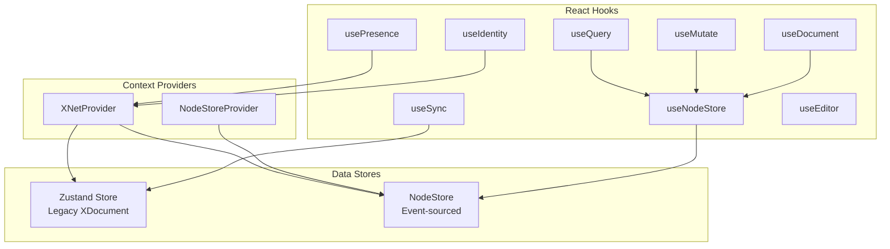
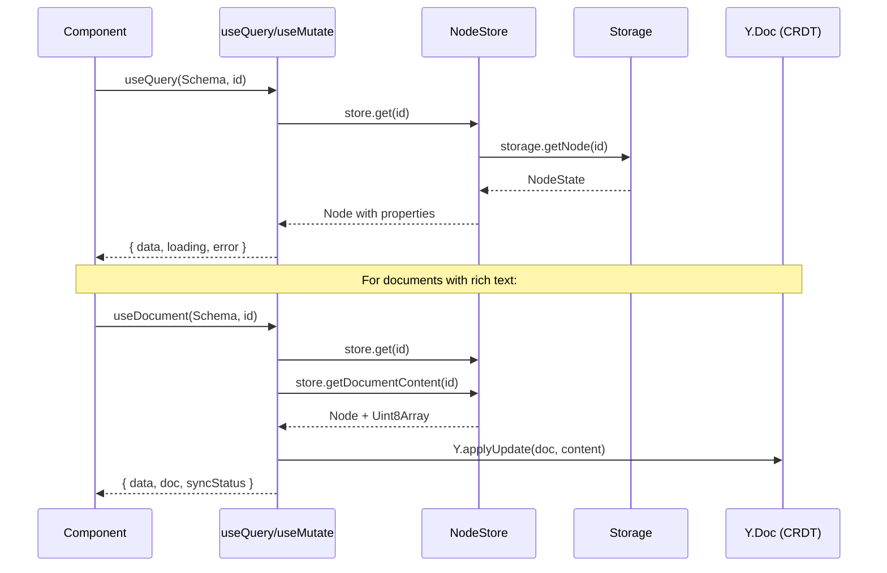
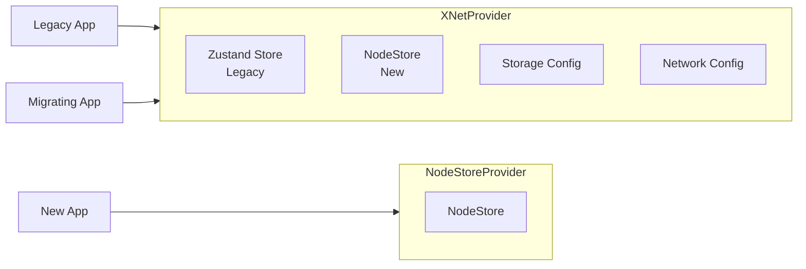

# React Hooks API Analysis

> **Status**: Current architecture analysis with improvement recommendations  
> **Package**: `@xnet/react`

## Executive Summary

The `@xnet/react` package provides the primary developer interface for xNet applications. While the current implementation is functional, several pain points affect developer experience:

1. **Dual provider system** complicates setup and migration
2. **Verbose property access** (`node.properties.title` vs `node.title`)
3. **Type casting** frequently required for property values
4. **Manual patterns** for common operations (auto-create, optimistic updates)
5. **Incomplete hooks** for presence and sync

This document analyzes each hook, identifies issues, and proposes improvements to create a "clean, beautiful, and powerful" API.

---

## Current Architecture



### Data Flow



---

## Hook Analysis

### 1. `useQuery` - Read Operations

**Location**: `packages/react/src/hooks/useQuery.ts`

**Current API**:

```tsx
// List all nodes
const { data: tasks } = useQuery(TaskSchema)

// Single node by ID
const { data: task } = useQuery(TaskSchema, taskId)

// Filtered query
const { data: urgent } = useQuery(TaskSchema, { where: { status: 'urgent' } })
```

**Strengths**:

- Clean overloaded API for different query types
- Automatic subscription to store changes
- Handles soft deletes properly
- Returns typed results based on schema

**Issues**:

| Issue                                 | Impact              | Code Example                      |
| ------------------------------------- | ------------------- | --------------------------------- |
| Properties nested under `.properties` | Verbose, repetitive | `task.properties.title`           |
| Type casting needed                   | Poor DX, unsafe     | `task.properties.title as string` |
| No sorting support                    | Limited queries     | Must sort in component            |
| No computed fields                    | Can't add virtuals  | No `fullName` from `first + last` |
| Loads all before filtering            | Inefficient         | `where` filter is post-fetch      |

**Real usage** (`apps/web/src/routes/index.tsx:22`):

```tsx
const { data: pages } = useQuery(PageSchema)
// ...
pages.map((page) => <div>{(page.properties.title as string) || 'Untitled'}</div>)
```

---

### 2. `useMutate` - Write Operations

**Location**: `packages/react/src/hooks/useMutate.ts`

**Current API**:

```tsx
const { create, update, remove, restore, mutate } = useMutate()

// Create
await create(TaskSchema, { title: 'New Task', status: 'todo' })

// Update
await update(taskId, { status: 'done' })

// Delete (soft)
await remove(taskId)

// Transaction
await mutate([
  { type: 'create', schema: TaskSchema, data: { title: 'Task 1' } },
  { type: 'update', id: taskId, data: { status: 'done' } }
])
```

**Strengths**:

- Type-safe create with schema inference
- Transaction support for atomic operations
- Soft delete with restore capability
- Schema not required for updates (node knows its type)

**Issues**:

| Issue                    | Impact                     | Code Example                       |
| ------------------------ | -------------------------- | ---------------------------------- |
| No optimistic updates    | Slow perceived performance | UI waits for persistence           |
| `isPending` always false | Can't show loading state   | `isPending: false // Could add...` |
| Update not type-safe     | Can set invalid properties | `update(id, { typo: 'x' })`        |
| No upsert pattern        | Manual existence check     | See auto-create pattern below      |

**Auto-create anti-pattern** (`apps/web/src/routes/doc.$docId.tsx:34-41`):

```tsx
// This pattern repeats everywhere that needs "get or create"
const [creating, setCreating] = useState(false)

useEffect(() => {
  if (!loading && !page && !error && !creating) {
    setCreating(true)
    create(PageSchema, { title: 'Untitled' }, docId)
      .then(() => setCreating(false))
      .catch(() => setCreating(false))
  }
}, [loading, page, error, creating, docId, create])
```

---

### 3. `useDocument` - CRDT Document Loading

**Location**: `packages/react/src/hooks/useDocument.ts`

**Current API**:

```tsx
const {
  data, // Node properties (LWW)
  doc, // Y.Doc instance
  loading,
  error,
  isDirty,
  lastSavedAt,
  syncStatus, // 'offline' | 'connecting' | 'connected'
  peerCount,
  save,
  reload
} = useDocument(PageSchema, pageId, {
  signalingServers: ['ws://localhost:4444'],
  disableSync: false,
  persistDebounce: 1000
})
```

**Strengths**:

- Unified loading of properties + CRDT doc
- Automatic y-webrtc sync setup
- Debounced persistence
- Dirty state tracking
- Peer count and sync status

**Issues**:

| Issue                              | Impact                | Code Example              |
| ---------------------------------- | --------------------- | ------------------------- |
| Hardcoded signaling server         | Dev-only default      | `['ws://localhost:4444']` |
| No auto-create                     | Manual pattern needed | See above                 |
| Null doc if schema has no document | Extra null checks     | `if (!doc) return`        |
| Property access still verbose      | Same as useQuery      | `data.properties.title`   |

---

### 4. `useNodeStore` - Direct Store Access

**Location**: `packages/react/src/hooks/useNodeStore.ts`

**Current API**:

```tsx
const { store, isReady, error } = useNodeStore()

// Direct store access (escape hatch)
const tasks = await store.list({ schemaId: TaskSchema._schemaId })
```

**Strengths**:

- Works with both providers (fallback pattern)
- Provides escape hatch for advanced use cases
- Clean ready state

**Issues**:

| Issue                          | Impact               | Code Example            |
| ------------------------------ | -------------------- | ----------------------- |
| Circular dependency workaround | Fragile code         | `require('../context')` |
| Exposes raw store              | Breaks encapsulation | Users can bypass hooks  |

---

### 5. `useSync` - Sync Status

**Location**: `packages/react/src/hooks/useSync.ts`

**Current API**:

```tsx
const { status, peers, peerCount } = useSync()
// status: 'offline' | 'connecting' | 'synced'
```

**Issues**:

| Issue                      | Severity  | Details                                    |
| -------------------------- | --------- | ------------------------------------------ |
| Uses legacy Zustand store  | Critical  | Not connected to NodeStore sync            |
| Placeholder implementation | Critical  | Comments say "would subscribe"             |
| Different status values    | Confusing | `'synced'` vs `'connected'` in useDocument |

**Code smell** (`packages/react/src/hooks/useSync.ts:36-37`):

```tsx
// In real implementation, would subscribe to network events
// and update sync status accordingly
```

---

### 6. `usePresence` - Collaboration Presence

**Location**: `packages/react/src/hooks/usePresence.ts`

**Current API**:

```tsx
const { localPresence, remotePresences, setPresence } = usePresence(docId)

// Update cursor position
setPresence({ cursor: { x: 100, y: 200 } })
```

**Issues**:

| Issue                          | Severity | Details                         |
| ------------------------------ | -------- | ------------------------------- |
| Placeholder implementation     | Critical | No actual sync                  |
| Not connected to Yjs awareness | Critical | Should use `provider.awareness` |
| remotePresences always empty   | Critical | Never populated                 |

**Code smell** (`packages/react/src/hooks/usePresence.ts:63-64`):

```tsx
// In real implementation, would subscribe to awareness updates
// for remote presences
```

---

### 7. Provider Architecture

**Location**: `packages/react/src/context.ts`



**Issues**:

| Issue                              | Impact                 |
| ---------------------------------- | ---------------------- |
| Two initialization flows           | Confusing mental model |
| Legacy store can't be removed      | Tech debt              |
| Default DID/key in production code | Security concern       |
| Hardcoded defaults                 | Not configurable       |

---

## Proposed Improvements

### 1. Flatten Property Access

**Problem**: `node.properties.title as string`

**Solution**: Schema-aware proxy or flattening at query time

```tsx
// BEFORE (current)
const { data: task } = useQuery(TaskSchema, id)
const title = task.properties.title as string

// AFTER (proposed)
const { data: task } = useQuery(TaskSchema, id)
const title = task.title // Typed as string automatically
```

**Implementation approach**:

```typescript
// In useQuery, transform NodeState to flattened type
type FlatNode<P> = {
  id: string
  schemaId: SchemaIRI
  createdAt: number
  createdBy: DID
  updatedAt: number
  deleted: boolean
} & InferProperties<P> // Properties flattened to top level
```

### 2. Add `getOrCreate` Pattern

**Problem**: Manual auto-create logic in every page component

**Solution**: Built-in upsert option

```tsx
// BEFORE (current)
const { data, loading } = useDocument(PageSchema, id)
const { create } = useMutate()
const [creating, setCreating] = useState(false)

useEffect(() => {
  if (!loading && !data && !creating) {
    setCreating(true)
    create(PageSchema, { title: 'Untitled' }, id)
  }
}, [loading, data, creating])

// AFTER (proposed)
const { data, loading } = useDocument(PageSchema, id, {
  createIfMissing: { title: 'Untitled' } // Auto-creates with these defaults
})
```

### 3. Optimistic Updates

**Problem**: UI waits for persistence

**Solution**: Immediate local state update with rollback on error

```tsx
// AFTER (proposed)
const { update, isPending } = useMutate()

// Optimistic by default
await update(taskId, { status: 'done' })
// UI updates immediately, persists in background

// Or explicit control
await update(taskId, { status: 'done' }, { optimistic: false })
```

### 4. Type-Safe Updates

**Problem**: `update()` accepts any properties

**Solution**: Schema-aware update function

```tsx
// BEFORE (current)
await update(taskId, { typo: 'value' }) // No error!

// AFTER (proposed)
const { updateTask } = useMutate(TaskSchema)
await updateTask(taskId, { typo: 'value' }) // Type error!
await updateTask(taskId, { status: 'done' }) // OK
```

### 5. Unified Sync Status

**Problem**: `useSync` disconnected from `useDocument.syncStatus`

**Solution**: Single source of truth

```tsx
// AFTER (proposed)
const {
  isConnected, // boolean
  peerCount, // number
  connectionState // 'offline' | 'connecting' | 'connected'
} = useSync()

// Works globally and per-document
const { syncStatus } = useDocument(Schema, id) // Same type
```

### 6. Real Presence with Yjs Awareness

**Problem**: `usePresence` is a placeholder

**Solution**: Connect to Yjs awareness protocol

```tsx
// AFTER (proposed)
const {
  localUser, // { id, name, color, cursor }
  remoteUsers, // User[] - actually populated!
  setLocalState // (state) => void
} = usePresence(docId)

// Automatically syncs via y-webrtc awareness
setLocalState({ cursor: { x: 100, y: 200 } })
```

### 7. Simplified Provider

**Problem**: XNetProvider has legacy + new stores

**Solution**: Clean single-purpose provider

```tsx
// AFTER (proposed)
<XNetProvider
  storage={indexedDbAdapter}
  identity={identity}
  network={{ signalingServers: [...] }}
>
  <App />
</XNetProvider>

// No more:
// - Legacy Zustand store
// - Default DID/keys
// - Dual initialization
```

---

## New Hook Proposals

### `useNode` - Single Node with Full Features

Combines best of `useQuery` (single) + `useDocument` + `useMutate`:

```tsx
const {
  data,           // Flattened node
  doc,            // Y.Doc if schema has document

  // Mutations
  update,         // Type-safe update
  remove,         // Soft delete

  // State
  loading,
  error,
  isDirty,

  // Sync
  syncStatus,
  peerCount,

  // Presence
  remoteUsers,

  // Actions
  save,
  reload
} = useNode(PageSchema, pageId, {
  createIfMissing: { title: 'Untitled' },
  sync: true
})

// Usage is clean
<input
  value={data.title}  // Flattened, typed
  onChange={(e) => update({ title: e.target.value })}  // Optimistic, type-safe
/>
```

### `useNodes` - List Query with Subscriptions

Enhanced list query:

```tsx
const {
  data, // FlatNode[]
  total, // Total count (for pagination)
  loading,
  error,

  // Pagination
  page,
  setPage,
  hasMore,
  loadMore,

  // Actions
  reload,

  // Bulk mutations
  createMany,
  updateMany,
  removeMany
} = useNodes(TaskSchema, {
  where: { status: 'todo' },
  orderBy: { createdAt: 'desc' },
  limit: 20,
  offset: 0
})
```

---

## Migration Path

### Phase 1: Non-Breaking Improvements

1. Add `createIfMissing` to `useDocument`
2. Implement optimistic updates in `useMutate`
3. Add `isPending` tracking to `useMutate`

### Phase 2: New APIs (Parallel)

1. Introduce `useNode` as recommended API
2. Introduce `useNodes` with enhanced queries
3. Implement real `usePresence` with Yjs awareness

### Phase 3: Deprecation

1. Mark `useQuery`/`useMutate`/`useDocument` as deprecated
2. Add console warnings in development
3. Provide codemod for migration

### Phase 4: Cleanup

1. Remove legacy Zustand store from `XNetProvider`
2. Remove deprecated hooks
3. Simplify provider to single concern

---

## Appendix: Current vs Proposed DX

### Document Editor (Current)

```tsx
function DocumentPage() {
  const { docId } = useParams()
  const { create, update } = useMutate()
  const [creating, setCreating] = useState(false)

  const { data: page, doc, loading, error, syncStatus, peerCount } = useDocument(PageSchema, docId)
  const { remotePresences } = usePresence(docId)

  // Manual auto-create
  useEffect(() => {
    if (!loading && !page && !error && !creating) {
      setCreating(true)
      create(PageSchema, { title: 'Untitled' }, docId).then(() => setCreating(false))
    }
  }, [loading, page, error, creating, docId, create])

  if (loading || creating) return <Loading />
  if (error) return <Error message={error.message} />
  if (!page || !doc) return <Loading />

  return (
    <div>
      <input
        value={(page.properties.title as string) || ''}
        onChange={(e) => update(docId, { title: e.target.value })}
      />
      <SyncIndicator connected={syncStatus === 'connected'} peers={peerCount} />
      <PresenceAvatars users={remotePresences} />
      <Editor doc={doc} />
    </div>
  )
}
```

### Document Editor (Proposed)

```tsx
function DocumentPage() {
  const { docId } = useParams()

  const {
    data: page,
    doc,
    update,
    loading,
    error,
    syncStatus,
    peerCount,
    remoteUsers
  } = useNode(PageSchema, docId, {
    createIfMissing: { title: 'Untitled' }
  })

  if (loading) return <Loading />
  if (error) return <Error message={error.message} />

  return (
    <div>
      <input value={page.title} onChange={(e) => update({ title: e.target.value })} />
      <SyncIndicator status={syncStatus} peers={peerCount} />
      <PresenceAvatars users={remoteUsers} />
      <Editor doc={doc} />
    </div>
  )
}
```

**Lines of code**: 45 -> 28 (38% reduction)  
**Type casts**: 1 -> 0  
**Manual patterns**: 1 -> 0  
**Cognitive load**: Significantly reduced

---

## Conclusion

The current `@xnet/react` API is functional but has accumulated patterns that hurt developer experience. The proposed improvements focus on:

1. **Ergonomics**: Flattened property access, type-safe mutations
2. **Completeness**: Real presence, unified sync status
3. **Patterns**: Built-in auto-create, optimistic updates
4. **Simplicity**: Single unified hook for common cases

These changes would make xNet's React API competitive with the best-in-class DX of tools like Prisma, Convex, and Liveblocks.
