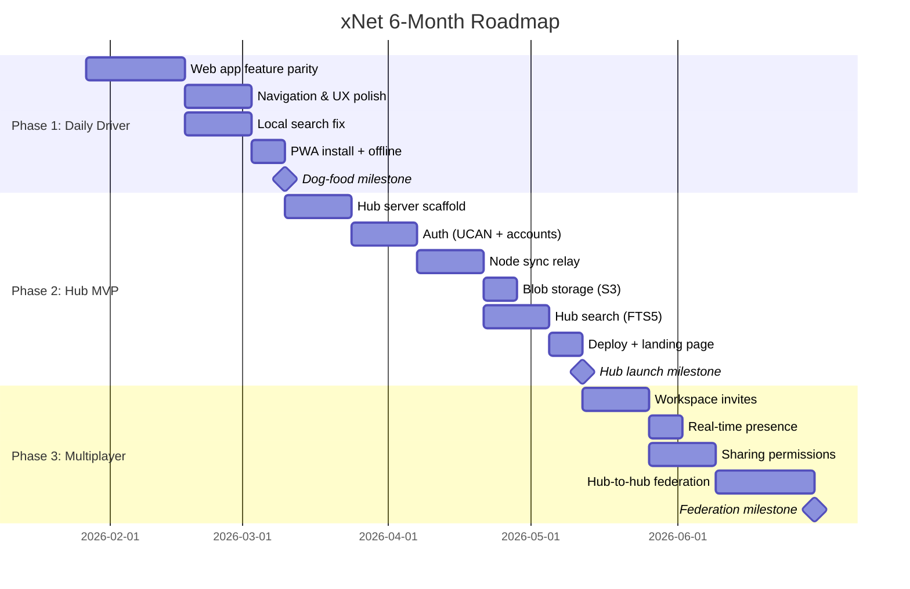

# xNet 6-Month Strategic Roadmap

> **Written**: January 2026  
> **Horizon**: January–July 2026  
> **Thesis**: Ship a daily-driver app, then extract the protocol.

---

## The Brutal Truth

The codebase has 18 packages with real implementations, 350+ tests, and three platform apps. The core data pipeline (crypto → identity → storage → sync → data → network → query → react → sdk) is **100% built**. The editor is rich. The schema system is unique.

**But nobody uses it.**

Every project in the [landscape analysis](explorations/LANDSCAPE_ANALYSIS.md) that succeeded followed one pattern: **ship a compelling app first, extract the protocol later.** Every project that tried infrastructure + application simultaneously took 6+ years or died.

xNet has the infrastructure. It does not yet have the app.

---

## What Gets Cut

These are explicitly **deferred beyond the 6-month horizon**. They are not cancelled — they are sequenced correctly.

| Feature                                    | Reason for Deferral                                    |
| ------------------------------------------ | ------------------------------------------------------ |
| Farming ERP (planStep04)                   | No users to build for yet. Requires plugin system.     |
| ERP Framework (planStep03)                 | Enterprise features before consumer product = death.   |
| Decentralized Search Tier 3 (Global Index) | Requires many hubs. Premature.                         |
| Crawl Coordination                         | Requires federation at scale. Years away.              |
| i18n/Translation (planStep04_1)            | Premature optimization. English first.                 |
| Plugin Architecture (planStep03_5)         | Powerful but premature. Stabilize core APIs first.     |
| History/Time Travel (planStep03_7)         | Nice-to-have. Not blocking adoption.                   |
| Comments (planStep03_6)                    | Collaboration feature for teams. Solo users first.     |
| Expo/Mobile SQLite (planStep03_4)          | Mobile is a follow-on. Desktop + Web first.            |
| Yjs Security (planStep03_4_1)              | Important for production, but not for first 100 users. |
| LAN mDNS Discovery                         | Desktop-only P2P. Hub makes this less critical.        |
| Index Shards                               | Requires many hubs.                                    |

**Rule: If it requires >100 users or multiple hubs to be useful, it's deferred.**

---

## What Gets Built

Three phases. Each ends with a deployable, testable milestone.

---

## Phase 1: Daily Driver (Jan 27 – Mar 9, ~6 weeks)

**Goal**: Make xNet a personal wiki/task manager you actually use every day instead of Notion/Obsidian.

**The test**: Can you use xNet exclusively for 2 weeks without switching back?

### 1.1 Web App Feature Parity (3 weeks)

The Electron app has database views, canvas views, sharing UI. The web app only has pages. Fix this.

- [ ] Wire `@xnet/views` (Table, Board, Calendar, Timeline, Gallery) into web app
- [ ] Wire `@xnet/canvas` into web app
- [ ] Database creation flow (pick schema, add properties)
- [ ] View switching UI (table → board → calendar etc.)
- [ ] Property editing inline

### 1.2 Navigation & UX Polish (2 weeks)

The current sidebar is a flat list. Real usage needs hierarchy and speed.

- [ ] Nested pages (parent-child relationships via schema property)
- [ ] Breadcrumb navigation
- [ ] Quick switcher (Cmd+K) — fuzzy search over all nodes
- [ ] Favorites / pinned pages
- [ ] Recently edited list
- [ ] Page icons (emoji picker)
- [ ] Keyboard shortcuts for navigation

### 1.3 Local Search Fix (2 weeks, parallel with 1.2)

Current search uses Lunr.js but doesn't index Yjs document bodies. Fix this.

- [ ] Extract plain text from Y.Doc (XmlFragment → string)
- [ ] Index body text in MiniSearch (replacing Lunr)
- [ ] Persist search index to IndexedDB (avoid re-indexing on load)
- [ ] Reactive re-indexing on document changes
- [ ] Search results UI with highlighting and context snippets

### 1.4 PWA Polish (1 week)

- [ ] Service worker for full offline support
- [ ] Install prompt on supported browsers
- [ ] App manifest with proper icons
- [ ] Splash screen

### Phase 1 Success Criteria

- [ ] Web app has full feature parity with Electron (pages, databases, canvas)
- [ ] You use xNet as your primary note/task tool for 2 consecutive weeks
- [ ] Search finds content inside documents, not just titles
- [ ] Navigation feels fast (<100ms transitions)
- [ ] Works fully offline after first load

---

## Phase 2: Hub MVP (Mar 10 – May 4, ~8 weeks)

**Goal**: Always-on sync, backup, and access from any device. The thing that makes local-first actually work for normal people.

**The test**: Can you edit on laptop, close it, open phone browser, and see your changes?

### 2.1 Hub Server Scaffold (2 weeks)

- [ ] `packages/hub` — Hono HTTP server + WebSocket
- [ ] SQLite for node storage (WAL mode, FTS5)
- [ ] Docker compose (hub + postgres for accounts)
- [ ] Health check, basic metrics endpoint
- [ ] Config system (env vars, workspace limits)

### 2.2 Authentication (2 weeks)

- [ ] UCAN-based auth flow (client generates keypair, requests delegation)
- [ ] Account creation (email + DID binding)
- [ ] Session management (refresh tokens)
- [ ] Workspace creation and membership
- [ ] Rate limiting per account

### 2.3 Node Sync Relay (2 weeks)

- [ ] WebSocket sync protocol (client ↔ hub)
- [ ] Hub persists all Changes to SQLite
- [ ] Hub persists Yjs updates (merged snapshots)
- [ ] Conflict resolution (same LWW as client)
- [ ] Client reconnection + catch-up (send changes since last sync)
- [ ] Offline queue drain on reconnect

### 2.4 Blob Storage (1 week, parallel with 2.5)

- [ ] S3-compatible blob storage (MinIO for self-host, R2/S3 for hosted)
- [ ] Upload endpoint with size limits
- [ ] CID-based deduplication
- [ ] Serve blobs via CDN-friendly URLs

### 2.5 Hub Search (2 weeks)

- [ ] FTS5 index over node properties + Yjs body text
- [ ] Search API endpoint
- [ ] Client `useSearch()` with hub fallback (local first, hub if no local results)
- [ ] Incremental index updates on sync

### 2.6 Deploy & Landing Page (1 week)

- [ ] Deploy to VPS (Hetzner/Fly.io)
- [ ] `hub.xnet.io` — canonical hub instance
- [ ] Simple landing page: what it is, sign up, download
- [ ] TLS, backups, monitoring (uptime + error alerting)

### Phase 2 Success Criteria

- [ ] Data syncs between web and desktop via hub within 2 seconds
- [ ] Hub persists all data (survives client cache clear)
- [ ] Search returns results from all synced documents
- [ ] Hub handles 10 concurrent users without degradation
- [ ] Self-hostable with `docker compose up`

---

## Phase 3: Multiplayer (May 5 – Jul 13, ~10 weeks)

**Goal**: Share pages and workspaces with other people. The thing that makes xNet more than a personal tool.

**The test**: Can two people collaborate on a document in real-time, and can you share a read-only page via URL?

### 3.1 Workspace Invites (2 weeks)

- [ ] Invite by email (generates UCAN delegation)
- [ ] Accept invite flow (link DID to workspace)
- [ ] Workspace member list UI
- [ ] Role assignment (admin, editor, viewer)

### 3.2 Real-time Presence (1 week)

- [ ] Awareness protocol via hub WebSocket
- [ ] Cursor positions in editor
- [ ] "Who's online" indicator
- [ ] Presence persistence across reconnects

### 3.3 Sharing & Permissions (2 weeks)

- [ ] Per-node sharing (public link, workspace-only, specific users)
- [ ] Read-only shared views (no auth required for public links)
- [ ] Permission checking on hub (reject unauthorized writes)
- [ ] Share dialog UI (copy link, manage access)

### 3.4 Hub-to-Hub Federation (3 weeks)

- [ ] Federation protocol (hub discovers peers, queries across workspaces)
- [ ] Cross-hub node references (resolve CIDs from other hubs)
- [ ] Federated search (query own hub + connected hubs)
- [ ] Trust configuration (which hubs to federate with)

### 3.5 Schema Registry (2 weeks)

- [ ] Hub hosts schema definitions (publish custom schemas)
- [ ] Schema discovery (browse available schemas from connected hubs)
- [ ] Import external schemas into workspace
- [ ] Schema versioning (backward compatibility checks)

### Phase 3 Success Criteria

- [ ] Two users can edit the same document simultaneously with visible cursors
- [ ] Sharing a page generates a public URL that works without login
- [ ] Permissions are enforced (viewer cannot edit)
- [ ] Two self-hosted hubs can discover and query each other
- [ ] Custom schemas can be published and imported across workspaces

---

## What This Unlocks (Post-July 2026)

After the 6-month roadmap, xNet will be:

- A daily-driver personal wiki with offline support
- Cloud-synced via hosted or self-hosted hub
- Multiplayer with real-time collaboration
- Federated across hub instances
- Extensible via user-defined schemas

This is the foundation for everything else:

- **Plugin system** becomes meaningful (users + schemas + hub = distribution channel)
- **Mobile app** becomes useful (hub sync means data is available everywhere)
- **Farming ERP** becomes possible (schemas + plugins + community hubs)
- **Decentralized search** becomes practical (multiple hubs with real data)

---

## Risks & Mitigations

| Risk                            | Likelihood | Impact | Mitigation                                                      |
| ------------------------------- | ---------- | ------ | --------------------------------------------------------------- |
| Scope creep into infrastructure | High       | Fatal  | This document. Re-read monthly.                                 |
| Editor bugs block daily use     | Medium     | High   | Fix bugs as encountered during dog-fooding.                     |
| Hub security issues at launch   | Medium     | High   | Start with invite-only access. No public signups until Phase 3. |
| Solo developer burnout          | Medium     | High   | Phase 1 has the fastest feedback loop. Ship weekly.             |
| libp2p complexity blocks Hub    | Low        | Medium | Hub uses plain WebSocket, not libp2p. Keep it simple.           |
| Nobody cares                    | Medium     | Fatal  | Build for yourself first. If YOU use it daily, others will too. |

---

## Non-Negotiable Principles

1. **Local-first**: The app must work fully offline. Hub is sync, not a dependency.
2. **Ship weekly**: Every week should produce a visible improvement.
3. **Dog-food ruthlessly**: Use xNet for xNet development notes/tasks.
4. **No premature abstraction**: Build the concrete thing, extract the pattern later.
5. **Tests for core, not UI**: Keep the test mandate for packages/\*, skip UI tests.

---

## Immediate Next Actions (This Week)

1. Start Phase 1.1 — wire database views into the web app
2. Update CLAUDE.md to reflect actual package status (vectors, canvas, formula are NOT placeholders)
3. Set up a weekly changelog habit (even if audience is zero)
