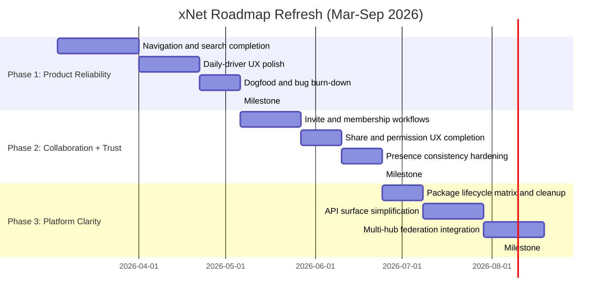

# xNet 6-Month Strategic Roadmap (Refresh)

> **Written**: March 2026  
> **Horizon**: March-September 2026  
> **Thesis**: Convert broad technical capability into a reliable, adopted daily-driver product.

---

## Why This Refresh Exists

The January roadmap assumed major pieces were still missing. Since then, the codebase moved fast:

- Web now ships pages + databases + canvas routes.
- Hub now includes relay, FTS5 search, file storage, schema routes, federation/shard primitives, and health endpoints.
- Secure share links were hardened (opaque handle redemption, replay protection, stricter endpoint policy).
- Electron security and sync hardening landed from February reviews.

The roadmap is no longer "build core capabilities from scratch." It is now:

1. close the highest-leverage product gaps,
2. reduce ambiguity in package/API surface,
3. prove real-world reliability and adoption.

---

## Status Snapshot (As of March 2026)

### What Is Already Shipped

- [x] Web app includes database and canvas experiences (`apps/web/src/routes/db.$dbId.tsx`, `apps/web/src/routes/canvas.$canvasId.tsx`)
- [x] Web app has Cmd/Ctrl+K quick search entrypoint (`apps/web/src/components/GlobalSearch.tsx`)
- [x] PWA infrastructure is wired (manifest + service worker via VitePWA) (`apps/web/vite.config.ts`)
- [x] Hub package is real, not scaffold-only (`packages/hub/src/server.ts`)
- [x] Hub search is FTS5-backed (`packages/hub/src/storage/sqlite.ts`, `packages/hub/src/services/query.ts`)
- [x] Sharing and authz hardening has landed (`packages/hub/src/server.ts`, `apps/web/src/routes/share.tsx`)
- [x] Presence/awareness pathways exist in desktop sync flow (`apps/electron/src/renderer/lib/ipc-sync-manager.ts`)

### What Is Partially Done or Still Missing

- [ ] Navigation depth in web is still shallow (no nested hierarchy, breadcrumb, pinned/recent)
- [ ] Web global search is title-only scoring today (no body-level search/snippets)
- [ ] Invites/membership UX and role lifecycle are not fully productized
- [ ] Federation exists in pieces, but not yet a complete multi-hub operator story
- [ ] API surface and package lifecycle labels are still unclear for external consumers

---

## What Gets Deferred (Explicitly)

These remain outside this 6-month execution window unless required by critical user feedback.

| Theme               | Deferred Item                                  | Why Deferred                                        |
| ------------------- | ---------------------------------------------- | --------------------------------------------------- |
| Vertical apps       | Farming ERP / large domain packs               | Requires stable plugin and schema ecosystem first   |
| Full mobile push    | Expo parity + mobile-first sync UX             | Desktop/web still produce the fastest learning loop |
| Planet-scale infra  | Public global index, large crawl orchestration | Needs sustained multi-hub traffic and ops maturity  |
| Heavy customization | Marketplace-scale plugin distribution          | API lifecycle and contract stability come first     |

**Rule:** If a feature does not improve daily use, security posture, or onboarding in the next 6 months, defer it.

---

## 6-Month Plan (March-September 2026)

---

## Phase 1: Product Reliability (March-April)

**Goal**: make xNet clearly better for daily personal use than switching back to old tools.

### 1.1 Navigation and Search Completion

- [ ] Add nested page relationships and tree rendering in web sidebar
- [ ] Add breadcrumb navigation for page/database/canvas context
- [ ] Upgrade global search from title-only to title + body + snippets
- [ ] Index rich text body content for local mode and hub-backed mode
- [ ] Keep search reactive under ongoing edits

### 1.2 Daily-Driver UX Polish

- [ ] Favorites/pinned and recently edited surfaces
- [ ] Keyboard navigation consistency across primary views
- [ ] Stabilize create/open flows (fewer blank/"untitled" dead-ends)
- [ ] Tighten loading and empty-state UX

### 1.3 Dogfood Burn-Down Loop

- [ ] Weekly "top 5 friction" bug list from real usage
- [ ] Fix or scope each friction item within the same week
- [ ] Track median open->edit latency for core routes

### Phase 1 Success Criteria

- [ ] 14 consecutive days of primary personal use without fallback tools
- [ ] Search surfaces body content, not title-only results
- [ ] Navigation overhead feels negligible for a 200+ node workspace
- [ ] No recurring "can't find my data" issues in dogfooding

---

## Phase 2: Collaboration + Trust (May-June)

**Goal**: collaboration is dependable, understandable, and secure-by-default.

### 2.1 Invite and Membership Workflows

- [ ] Implement invite issuance + acceptance UX for workspace onboarding
- [ ] Add member list and role management views
- [ ] Make role effects explicit in UI (viewer/editor/admin)
- [ ] Add clear audit trail for membership changes

### 2.2 Share and Permission UX Completion

- [ ] Consolidate share flows around secure handle redemption model
- [ ] Improve link-state UX (active, expired, revoked, replayed)
- [ ] Expose permission explanation in-product (why action denied)
- [ ] Keep recovery path clear for non-technical users

### 2.3 Presence and Reconnect Consistency

- [ ] Ensure reconnect always restores awareness state predictably
- [ ] Validate stale presence cleanup behavior under tab/app churn
- [ ] Confirm permission revocation immediately ejects active sessions

### Phase 2 Success Criteria

- [ ] New collaborator can join and edit shared workspace in <5 minutes
- [ ] Permission denials are understandable and actionable
- [ ] Revocation behavior is immediate and testable
- [ ] Presence indicators stay accurate after disconnect/reconnect cycles

---

## Phase 3: Platform Clarity (July-September)

**Goal**: make xNet easier to operate, integrate, and evolve without internal ambiguity.

### 3.1 Package Lifecycle and Portfolio Cleanup

- [ ] Add explicit lifecycle labels in package docs (`stable`, `experimental`, `deprecated`, `internal`)
- [ ] Decide disposition of low-usage packages (starting with `@xnetjs/formula`, `@xnetjs/cli`)
- [ ] Remove or archive packages that do not support near-term product goals

### 3.2 API Surface Simplification

- [ ] Split stable vs experimental entrypoints where behavior is partial
- [ ] Reduce top-level "kitchen sink" exports in major packages
- [ ] Align docs to only claim capabilities proven in current code

### 3.3 Multi-Hub Federation Integration

- [ ] Move from single-active-hub client behavior toward policy-driven multi-hub sync
- [ ] Promote node-native schema/system metadata model for federation orchestration
- [ ] Define clear operator guardrails for trust boundaries and hub peering

### Phase 3 Success Criteria

- [ ] External developers can identify stable APIs quickly
- [ ] Package set is smaller/clearer with fewer ambiguous contracts
- [ ] Multi-hub behavior is demonstrable in a repeatable local testbed
- [ ] Federation docs match shipped behavior without aspirational drift

---

## Risks and Mitigations

| Risk                               | Likelihood | Impact | Mitigation                                                            |
| ---------------------------------- | ---------- | ------ | --------------------------------------------------------------------- |
| "Everything at once" roadmap drift | High       | Fatal  | Re-prioritize monthly against this doc; enforce explicit deferrals    |
| Collaboration security regressions | Medium     | High   | Keep secure-share and revocation tests as release blockers            |
| API/documentation mismatch         | High       | High   | Docs-from-code discipline for package capability claims               |
| Solo-dev throughput bottlenecks    | Medium     | High   | Keep weekly scoped milestones and kill low-leverage side quests       |
| Multi-hub complexity explosion     | Medium     | High   | Keep node-native policy model; treat transport as boundary, not truth |

---

## Non-Negotiable Principles

1. **Local-first remains primary**: hub improves sync/backup but must not be a hard runtime dependency for core editing.
2. **Security is product UX**: safe sharing and clear permission behavior are first-class, not afterthoughts.
3. **Ship visible value weekly**: each week must remove user friction or improve reliability.
4. **Document only what exists**: no aspirational claims in package/API docs.
5. **Stability over novelty**: complete and harden critical paths before adding new big surfaces.

---

## Immediate Next Actions (This Week)

1. Finish web search upgrade plan (body indexing + snippets + performance targets).
2. Define and publish package lifecycle matrix in `packages/README.md`.
3. Build a collaboration acceptance checklist (invite -> share -> revoke -> reconnect) and run it end-to-end.
