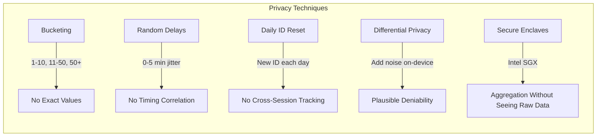
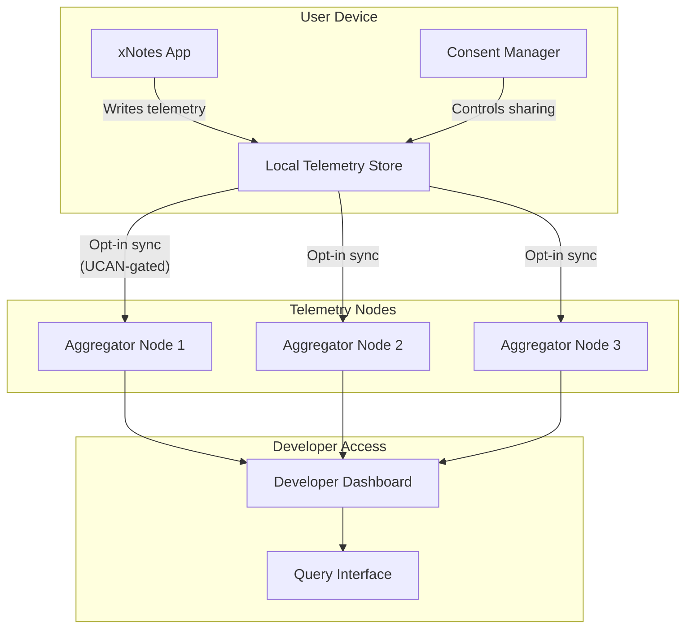
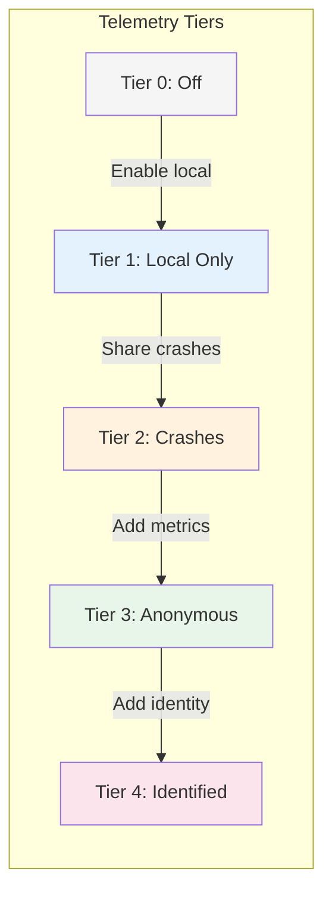
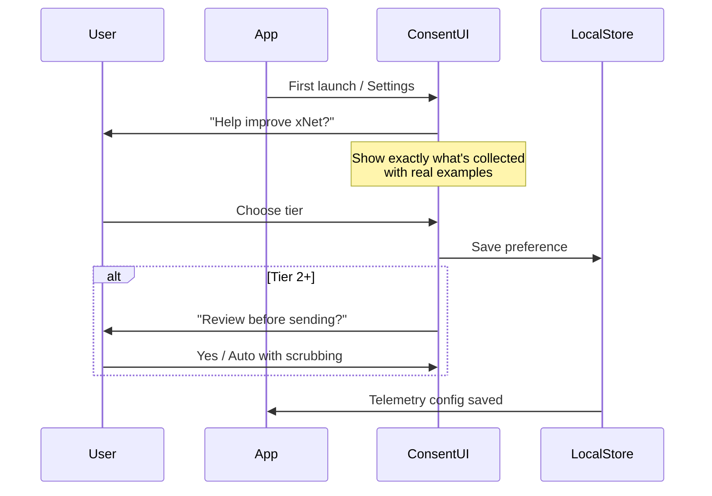
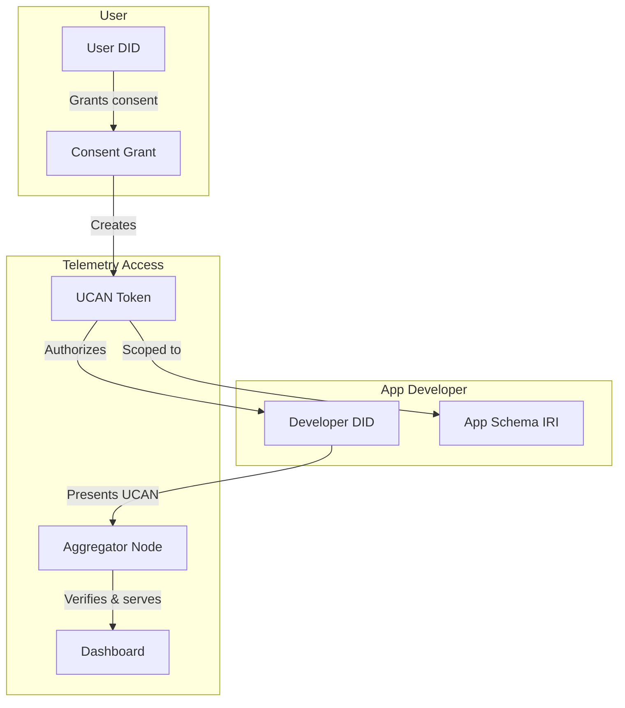
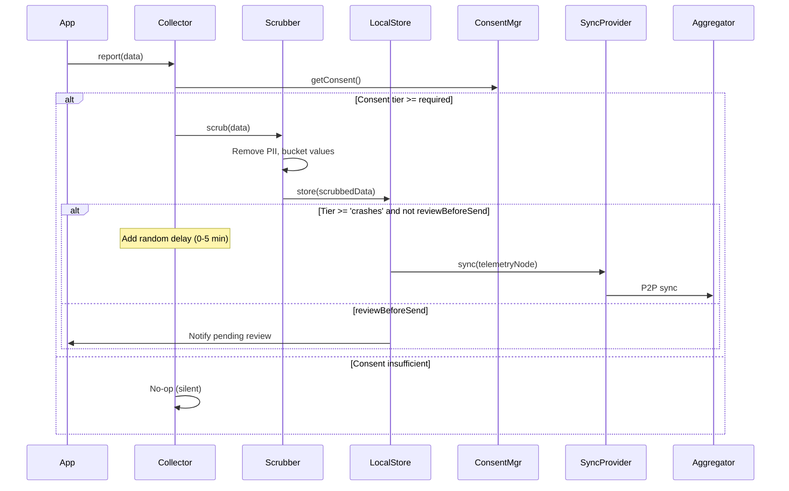
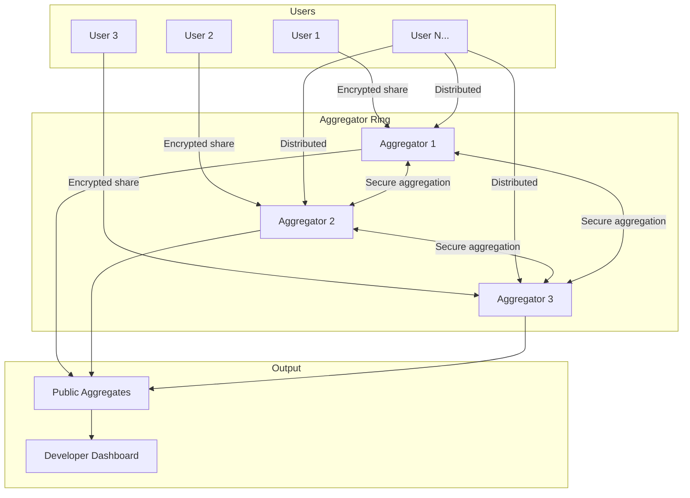

# xNet Telemetry & Logging Architecture

> Privacy-preserving observability for a decentralized system

**Status**: Design Exploration  
**Last Updated**: January 2026

---

## Executive Summary

xNet is a fully decentralized system where users own their data. Traditional telemetry approaches (send everything to a central server) are incompatible with this architecture. This document explores how to provide developers with meaningful insights while preserving user privacy and sovereignty.

**Key insight**: xNet already has the infrastructure for user-controlled, schema-defined, sync-enabled data. Telemetry can be "just another Node type" with special access controls.

---

## Table of Contents

1. [Design Principles](#design-principles)
2. [Industry Research](#industry-research)
3. [Proposed Architecture](#proposed-architecture)
4. [Telemetry Tiers](#telemetry-tiers)
5. [User Experience](#user-experience)
6. [Developer Access](#developer-access)
7. [Technical Implementation](#technical-implementation)
8. [Privacy Techniques](#privacy-techniques)
9. [Open Questions](#open-questions)

---

## Design Principles

### Non-Negotiables

1. **User sovereignty** - Users explicitly opt-in, can see exactly what's shared, and can revoke at any time
2. **No silent collection** - Zero telemetry without explicit consent
3. **Local-first** - All telemetry stored locally first; sharing is a separate decision
4. **Inspectable schemas** - Users can view the exact schema of what's being collected
5. **Deletable** - Users can delete their telemetry data at any time
6. **No unique identifiers** - No persistent tracking across sessions/devices unless user opts in

### Goals

1. **For users**: Transparency, control, and the ability to help improve software they care about
2. **For xNet developers**: Understand feature adoption, identify crashes, improve performance
3. **For app developers**: Same benefits for apps built on xNet, with xNet-native tooling
4. **For open source**: Public aggregate dashboards for community projects

---

## Industry Research

### What Others Do

| System            | Approach                                                 | Privacy Level | Learnings                                            |
| ----------------- | -------------------------------------------------------- | ------------- | ---------------------------------------------------- |
| **Obsidian**      | Zero telemetry                                           | Maximum       | Proves viable; relies on forums/Discord for feedback |
| **Brave P3A**     | Bucketed answers, random timing, no identifiers          | Very High     | Best-in-class for "some data, maximum privacy"       |
| **VS Code**       | 4-level opt-in (off/crash/error/all), transparent schema | High          | Good UX for granular control                         |
| **Mozilla Glean** | Opt-out, public data dictionary                          | Medium        | Good documentation practices                         |
| **IPFS**          | No protocol-level telemetry, app-layer concern           | N/A           | Validates separation of concerns                     |
| **Sentry**        | beforeSend hooks, local scrubbing                        | Configurable  | Good for crash reports                               |

### Key Techniques



### Brave P3A Deep Dive

Brave's approach is particularly relevant:

1. **Multiple-choice only** - "How many tabs? 0-1 / 2-5 / 6-10 / 11-50 / 50+"
2. **One answer at a time** - Can't correlate answers to same user
3. **Random timing** - Answers sent with 0-5 minute random delay
4. **IP stripped at edge** - CDN removes IP before Brave sees it
5. **Public question list** - All metrics documented on GitHub wiki
6. **7-day retention** - Logs deleted, only aggregates kept
7. **Phase 2: Secure enclaves** - For correlated queries (did users who completed onboarding also import bookmarks?)

---

## Proposed Architecture

### The xNet Advantage

xNet already has:

- **Schemas** - Define exactly what fields exist
- **Nodes** - Universal data container
- **DIDs** - User identity
- **UCANs** - Delegated, revocable permissions
- **P2P Sync** - Decentralized data sharing

**Telemetry can leverage all of this.**



### Core Concept: Telemetry as Nodes

```typescript
// Telemetry is just another schema
const CrashReportSchema = defineSchema({
  name: 'CrashReport',
  namespace: 'xnet://xnet.dev/telemetry/',
  properties: {
    // What happened
    errorType: text({ required: true }),
    errorMessage: text({ required: true }),
    stackTrace: text({ scrubPaths: true }), // Auto-scrub file paths

    // Context (all optional, user-controlled)
    appVersion: text(),
    platform: select({ options: ['macos', 'windows', 'linux', 'ios', 'android', 'web'] as const }),

    // Timestamps (bucketed, not exact)
    occurredAt: date() // Rounded to nearest hour

    // Computed fields (not stored)
    // No: userId, deviceId, sessionId, IP address
  }
})

const UsageMetricSchema = defineSchema({
  name: 'UsageMetric',
  namespace: 'xnet://xnet.dev/telemetry/',
  properties: {
    metric: text({ required: true }), // e.g., 'pages_created'
    bucket: select({
      options: ['none', 'light', 'moderate', 'heavy'] as const,
      required: true
    }),
    period: select({ options: ['daily', 'weekly', 'monthly'] as const }),
    appVersion: text(),
    platform: select({ options: ['macos', 'windows', 'linux', 'ios', 'android', 'web'] as const })
  }
})
```

---

## Telemetry Tiers

### Tier 0: Off (Default)

- Zero telemetry collected
- Zero telemetry shared
- App works fully offline with no degradation

### Tier 1: Local Only

- Telemetry collected and stored locally
- User can view their own telemetry
- Nothing shared externally
- Useful for personal debugging ("what crashed yesterday?")

### Tier 2: Crash Reports

- Local collection + opt-in sharing of crash reports
- User reviews each crash before sending (or auto-send with scrubbing)
- No usage metrics shared

### Tier 3: Anonymous Metrics

- Brave P3A-style bucketed usage metrics
- No identifiers, random timing, daily reset
- Crash reports + usage metrics

### Tier 4: Identified Feedback

- For power users/beta testers who want to help
- Includes a stable (but user-controlled) identifier
- Can correlate feedback over time
- User can delete all their data at any time



---

## User Experience

### Consent Flow



### Consent UI Mockup

```
┌─────────────────────────────────────────────────────────┐
│  Help Improve xNet                                   [×]│
├─────────────────────────────────────────────────────────┤
│                                                         │
│  xNet can collect anonymous usage data to help us      │
│  improve the app. You're always in control.            │
│                                                         │
│  ┌─────────────────────────────────────────────────┐   │
│  │ ○ Off - No data collected                       │   │
│  │ ○ Local only - For your own debugging           │   │
│  │ ● Crashes - Send crash reports (recommended)    │   │
│  │ ○ Anonymous - Crashes + usage metrics           │   │
│  │ ○ Beta tester - Help us most (with identifier)  │   │
│  └─────────────────────────────────────────────────┘   │
│                                                         │
│  [View what we collect]  [View telemetry schema]       │
│                                                         │
│  ┌─────────────────────────────────────────────────┐   │
│  │ ☑ Review crash reports before sending           │   │
│  │ ☑ Auto-scrub file paths and usernames           │   │
│  └─────────────────────────────────────────────────┘   │
│                                                         │
│                              [Cancel]  [Save Settings] │
└─────────────────────────────────────────────────────────┘
```

### "View What We Collect" Screen

```
┌─────────────────────────────────────────────────────────┐
│  Telemetry Data Viewer                               [×]│
├─────────────────────────────────────────────────────────┤
│  Your Local Telemetry (23 records)          [Delete All]│
│                                                         │
│  ┌─────────────────────────────────────────────────┐   │
│  │ 📊 Usage Metric - Jan 21, 2026                  │   │
│  │    Metric: pages_created                        │   │
│  │    Bucket: moderate (11-50)                     │   │
│  │    Period: weekly                               │   │
│  │    App: xNotes 1.2.3 / macOS                    │   │
│  │                                    [Delete] [→] │   │
│  ├─────────────────────────────────────────────────┤   │
│  │ 💥 Crash Report - Jan 20, 2026 (pending)        │   │
│  │    Error: RangeError: Invalid array length      │   │
│  │    Component: TableView                         │   │
│  │    App: xNotes 1.2.3 / macOS                    │   │
│  │                         [Review & Send] [Delete]│   │
│  └─────────────────────────────────────────────────┘   │
│                                                         │
│  Shared: 12 records | Pending: 3 | Local only: 8       │
└─────────────────────────────────────────────────────────┘
```

---

## Developer Access

### Access Control with UCANs



### Developer Experience

```typescript
// Developer registers their app's telemetry schema
const MyAppTelemetrySchema = defineSchema({
  name: 'MyAppCrashReport',
  namespace: 'xnet://did:key:z6Mk.../myapp/telemetry/',
  properties: {
    errorType: text({ required: true }),
    errorMessage: text({ required: true }),
    component: text(),
    appVersion: text()
  }
})

// App collects telemetry (only if user consented)
const telemetry = useTelemetry({
  schema: MyAppTelemetrySchema
  // Inherits user's consent level
})

// When crash happens
telemetry.report({
  errorType: 'RangeError',
  errorMessage: 'Invalid array length',
  component: 'DataGrid',
  appVersion: '1.2.3'
})

// Developer dashboard query
const dashboard = await xnet.telemetry.query({
  appDID: 'did:key:z6Mk...', // My developer DID
  schema: 'xnet://did:key:z6Mk.../myapp/telemetry/MyAppCrashReport',
  aggregation: 'count',
  groupBy: ['errorType', 'appVersion'],
  period: 'last7days'
})
// Returns: { 'RangeError': { '1.2.3': 47, '1.2.2': 12 }, ... }
```

### Access Patterns

| Scenario            | Access Model                                      |
| ------------------- | ------------------------------------------------- |
| **xNet core**       | xNet team can query xnet.dev/\* telemetry schemas |
| **Third-party app** | Developer can only query their own namespace      |
| **Open source**     | Public dashboard, anyone can view aggregates      |
| **Enterprise**      | Company admin can query company namespace         |
| **User**            | User can always view/delete their own data        |

---

## Technical Implementation

### Package Structure

```
packages/
  telemetry/
    src/
      schemas/           # Built-in telemetry schemas
        crash.ts         # CrashReport schema
        usage.ts         # UsageMetric schema
        performance.ts   # PerformanceMetric schema

      collection/
        collector.ts     # TelemetryCollector class
        bucketing.ts     # P3A-style bucketing utilities
        scrubbing.ts     # PII scrubbing (paths, emails, etc.)
        timing.ts        # Random delay utilities

      consent/
        manager.ts       # ConsentManager class
        tiers.ts         # TelemetryTier enum/types

      aggregation/
        aggregator.ts    # Server-side aggregation
        privacy.ts       # Differential privacy utilities

      hooks/
        useTelemetry.ts  # React hook for apps
        useConsent.ts    # React hook for consent UI

      index.ts
```

### Core Types

```typescript
// Telemetry tier levels
type TelemetryTier =
  | 'off' // No collection
  | 'local' // Local only
  | 'crashes' // + crash reports
  | 'anonymous' // + anonymous metrics
  | 'identified' // + stable identifier

// Consent configuration
interface TelemetryConsent {
  tier: TelemetryTier
  reviewBeforeSend: boolean
  autoScrub: boolean
  enabledSchemas: SchemaIRI[] // Which telemetry types
  grantedAt: Date
  expiresAt?: Date // Optional expiry
}

// Telemetry record (stored as Node)
interface TelemetryRecord {
  id: NodeId
  schemaId: SchemaIRI
  properties: Record<string, unknown>

  // Metadata
  collectedAt: Date // Rounded to hour
  sharedAt?: Date // When/if shared
  status: 'local' | 'pending' | 'shared' | 'rejected'
}

// Bucketing for P3A-style metrics
type Bucket<T extends string> = T
type CountBucket = Bucket<'none' | '1-5' | '6-20' | '21-100' | '100+'>
type FrequencyBucket = Bucket<'never' | 'rarely' | 'sometimes' | 'often' | 'always'>
```

### Collection Flow



### Scrubbing Implementation

```typescript
// packages/telemetry/src/collection/scrubbing.ts

interface ScrubOptions {
  scrubPaths: boolean // /Users/john/... -> /Users/[USER]/...
  scrubEmails: boolean // john@example.com -> [EMAIL]
  scrubIPs: boolean // 192.168.1.1 -> [IP]
  scrubCustom?: RegExp[] // Custom patterns
}

function scrubTelemetryData(
  data: Record<string, unknown>,
  options: ScrubOptions = { scrubPaths: true, scrubEmails: true, scrubIPs: true }
): Record<string, unknown> {
  const result = { ...data }

  for (const [key, value] of Object.entries(result)) {
    if (typeof value === 'string') {
      let scrubbed = value

      if (options.scrubPaths) {
        // macOS/Linux paths
        scrubbed = scrubbed.replace(/\/Users\/[^\/\s]+/g, '/Users/[USER]')
        scrubbed = scrubbed.replace(/\/home\/[^\/\s]+/g, '/home/[USER]')
        // Windows paths
        scrubbed = scrubbed.replace(/C:\\Users\\[^\\\s]+/g, 'C:\\Users\\[USER]')
      }

      if (options.scrubEmails) {
        scrubbed = scrubbed.replace(/[a-zA-Z0-9._%+-]+@[a-zA-Z0-9.-]+\.[a-zA-Z]{2,}/g, '[EMAIL]')
      }

      if (options.scrubIPs) {
        scrubbed = scrubbed.replace(/\b\d{1,3}\.\d{1,3}\.\d{1,3}\.\d{1,3}\b/g, '[IP]')
      }

      result[key] = scrubbed
    }
  }

  return result
}

// Bucketing for numeric values (P3A style)
function bucketCount(count: number): CountBucket {
  if (count === 0) return 'none'
  if (count <= 5) return '1-5'
  if (count <= 20) return '6-20'
  if (count <= 100) return '21-100'
  return '100+'
}

function bucketTimestamp(date: Date): Date {
  // Round to nearest hour
  const rounded = new Date(date)
  rounded.setMinutes(0, 0, 0)
  return rounded
}
```

### React Hooks

```typescript
// packages/telemetry/src/hooks/useTelemetry.ts

interface UseTelemetryOptions<S extends Schema> {
  schema: S
  minTier?: TelemetryTier // Minimum consent tier required
}

interface UseTelemetryReturn<S extends Schema> {
  report: (data: Partial<InferProperties<S>>) => void
  isEnabled: boolean
  tier: TelemetryTier
}

function useTelemetry<S extends Schema>({
  schema,
  minTier = 'crashes'
}: UseTelemetryOptions<S>): UseTelemetryReturn<S> {
  const consent = useConsent()
  const store = useNodeStore()

  const isEnabled = useMemo(
    () => tierLevel(consent.tier) >= tierLevel(minTier),
    [consent.tier, minTier]
  )

  const report = useCallback(
    async (data: Partial<InferProperties<S>>) => {
      if (!isEnabled) return

      const scrubbed = scrubTelemetryData(data as Record<string, unknown>)
      const bucketed = bucketValues(scrubbed, schema)

      await store.create({
        schemaId: schema.iri,
        properties: {
          ...bucketed,
          collectedAt: bucketTimestamp(new Date()),
          status: consent.reviewBeforeSend ? 'pending' : 'local'
        }
      })

      if (!consent.reviewBeforeSend && consent.tier !== 'local') {
        // Schedule sync with random delay
        scheduleWithJitter(() => syncTelemetry(schema.iri), {
          minDelay: 0,
          maxDelay: 5 * 60 * 1000 // 0-5 minutes
        })
      }
    },
    [isEnabled, consent, store, schema]
  )

  return { report, isEnabled, tier: consent.tier }
}
```

---

## Privacy Techniques

### Differential Privacy (Future)

For aggregate queries, we can add differential privacy noise:

```typescript
// Add Laplacian noise to protect individual contributions
function addDifferentialPrivacy(
  count: number,
  epsilon: number = 1.0, // Privacy budget
  sensitivity: number = 1 // Max one user can contribute
): number {
  const scale = sensitivity / epsilon
  const noise = laplacianNoise(scale)
  return Math.max(0, Math.round(count + noise))
}

function laplacianNoise(scale: number): number {
  const u = Math.random() - 0.5
  return -scale * Math.sign(u) * Math.log(1 - 2 * Math.abs(u))
}
```

### Federated Aggregation

Instead of a central server, aggregation can happen across multiple nodes:



### k-Anonymity

Only release aggregates when k or more users contributed:

```typescript
interface AggregateResult {
  value: number
  contributors: number
  suppressed: boolean // True if < k contributors
}

function enforceKAnonymity(
  results: Map<string, number>,
  k: number = 10
): Map<string, AggregateResult> {
  const output = new Map<string, AggregateResult>()

  for (const [key, value] of results) {
    const contributors = getContributorCount(key)
    output.set(key, {
      value: contributors >= k ? value : 0,
      contributors: contributors >= k ? contributors : 0,
      suppressed: contributors < k
    })
  }

  return output
}
```

---

## Open Questions

### Technical

1. **Aggregator node incentives** - Who runs aggregator nodes? Volunteer? Paid?
2. **Revocation propagation** - How quickly do consent revocations propagate?
3. **Historical data deletion** - When user revokes, do aggregates need recomputation?
4. **Cross-app correlation** - Should apps be able to see telemetry from other apps?
5. **Retention periods** - How long to keep aggregates? Individual records?

### UX

1. **Default tier** - Should crash reports be opt-out for better coverage?
2. **Nag frequency** - How often to remind users who chose "Off"?
3. **Beta programs** - Special telemetry for beta testers?
4. **Incentives** - Should users be rewarded for sharing telemetry?

### Business

1. **Paid telemetry** - Should enterprise apps pay for telemetry infrastructure?
2. **Public dashboards** - Open by default for open source?
3. **Competitive data** - Could telemetry reveal competitive app metrics?

---

## Comparison: xNet vs Traditional

| Aspect            | Traditional Telemetry     | xNet Telemetry                               |
| ----------------- | ------------------------- | -------------------------------------------- |
| Default state     | Opt-out (on by default)   | Opt-in (off by default)                      |
| Data location     | Central server            | User's device first                          |
| Identifier        | Persistent device/user ID | None, or user-controlled                     |
| Schema visibility | Often opaque              | Always inspectable                           |
| User deletion     | Request required          | Instant, local control                       |
| Developer access  | Direct database access    | UCAN-gated queries                           |
| Aggregation       | Central server            | Federated/distributed                        |
| Privacy technique | Server-side anonymization | Client-side bucketing + differential privacy |

---

## Implementation Phases

### Phase 1: Foundation (4 weeks)

- [ ] Telemetry schemas (CrashReport, UsageMetric)
- [ ] TelemetryCollector with local storage
- [ ] ConsentManager with tier system
- [ ] Scrubbing utilities
- [ ] React hooks (useTelemetry, useConsent)
- [ ] Consent UI components

### Phase 2: Sharing (4 weeks)

- [ ] P3A-style bucketing and random timing
- [ ] Sync integration for telemetry nodes
- [ ] UCAN-based access control for developers
- [ ] Basic aggregation queries
- [ ] Developer dashboard (basic)

### Phase 3: Advanced Privacy (6 weeks)

- [ ] Differential privacy for aggregates
- [ ] Federated aggregation across multiple nodes
- [ ] k-anonymity enforcement
- [ ] Public dashboards for open source projects

### Phase 4: Ecosystem (ongoing)

- [ ] Third-party app telemetry SDK
- [ ] Enterprise features (dedicated aggregators)
- [ ] Telemetry marketplace (opt-in data sharing with compensation?)

---

## References

- [Brave P3A](https://brave.com/privacy-preserving-product-analytics-p3a/) - Privacy-preserving product analytics
- [Google RAPPOR](https://research.google/pubs/rappor-randomized-aggregatable-privacy-preserving-ordinal-response/) - Differential privacy for telemetry
- [VS Code Telemetry](https://code.visualstudio.com/docs/getstarted/telemetry) - Tiered opt-in model
- [IPFS Privacy](https://docs.ipfs.tech/concepts/privacy-and-encryption/) - Privacy as app-layer concern
- [UCAN Spec](https://ucan.xyz/) - Decentralized authorization
- [Obsidian Privacy](https://obsidian.md/privacy) - Zero telemetry reference

---

_This is a design exploration document. Implementation details may change based on community feedback and technical constraints._
