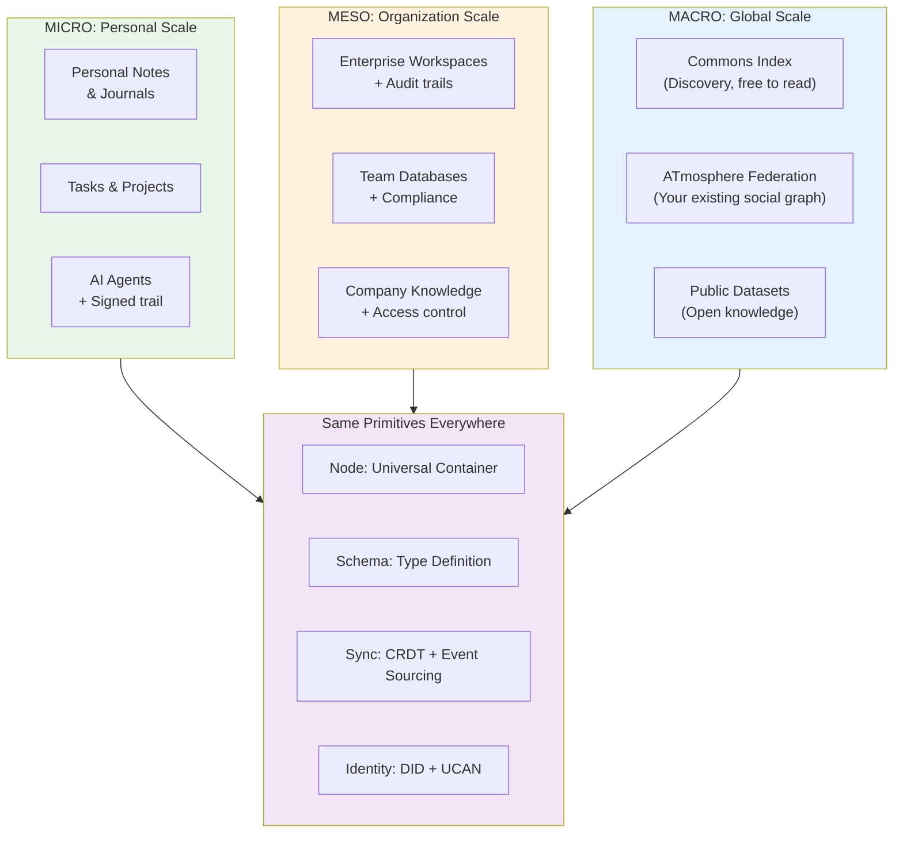
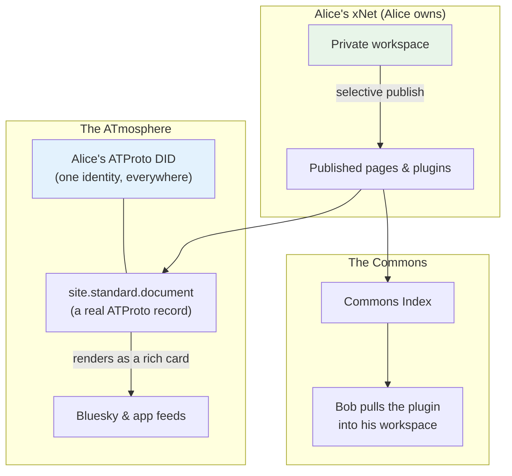
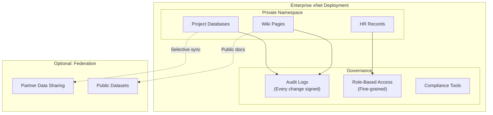
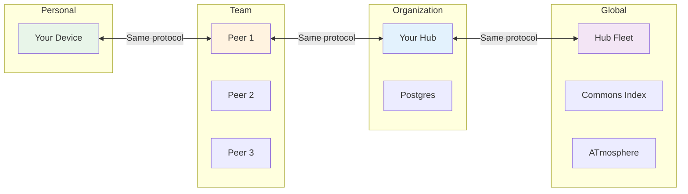

# xNet Vision: The Decentralized Data Layer of the Internet

> From personal notes to planetary-scale infrastructure — seamlessly.

**Version**: 2.0 | **Last Updated**: July 2026

> **What changed in 2.0**: the vision itself is unchanged — user-owned data on
> the same primitives at every scale. What this revision adds is how we get
> there, learned by building: **AI agents working inside the workspace with
> total visibility** is the wedge; **joining the ATmosphere** (ATProto) is the
> social strategy instead of building a rival network; and the global layer
> begins as a **commons Index**, not a Google clone. The concrete sequencing
> lives in [`ROADMAP.md`](./ROADMAP.md), and the long-form argument for every
> claim here lives in [the essays](https://xnet.fyi/blog).

---

## The Big Picture

xNet is not another productivity app. It's not just another local-first SDK.

**xNet is infrastructure for a new internet** — one where data is:

- **User-owned** from personal notes to enterprise databases
- **Globally addressable** via a universal namespace
- **Locally controlled** with fine-grained permissions
- **Infinitely extensible** through user-defined schemas
- **Legible to people and agents alike** — every change signed and attributable
- **Performant at any scale** from a single device to billions of queries

```
┌─────────────────────────────────────────────────────────────────────────────┐
│                           THE xNet VISION                                    │
│                                                                             │
│   Today's Internet              →           Tomorrow's Internet             │
│   ─────────────────                         ───────────────────             │
│   Data in silos                             Data in a global namespace      │
│   Companies own your data                   You own your data               │
│   Centralized search (Google)               Commons indexes                 │
│   Walled gardens (social)                   Federated, interoperable        │
│   AI acts in the dark                       AI acts on the record           │
│   Vendor lock-in                            Portable, user-controlled       │
│   Pay with your privacy                     Pay with value, not data        │
│                                                                             │
└─────────────────────────────────────────────────────────────────────────────┘
```

The operational expression of this stance — what we commit to and refuse, with a
receipt for each promise — is the [Humane Internet Charter](./CHARTER.md):
**Own, Exit, Calm, Consent, Agency, Commons.** What the refusals make room
for — the feel we cultivate — is written down in [`VIBE.md`](./VIBE.md).

---

## The Micro-to-Macro Continuum

The same primitives work at every scale — from your personal task list to a global commons index:



**Key Insight**: Your personal task list and a planetary commons index are just different namespaces in the same system. The architecture doesn't change — only the scale.

---

## The Strategic Play

### The Bet: AI Under Glass

The wedge that makes xNet compelling *now* — not in some federated future — is
a gap nobody else can fill:

**Deep AI integration with total visibility, on top of a malleable, sandboxed
workspace.**

Everywhere else you choose between two bad options: an AI in a chat box bolted
onto someone else's silo (it can talk but barely act), or an agent with your
terminal (it can do anything, including things you'll never know about).
xNet's architecture dissolves the trade-off:

- Every node has a **signed change log**. When an agent edits a document,
  builds a database, or restructures your workspace, the record of exactly
  what it touched isn't a log file — it *is* the data model.
- **Agents are collaborators with passports, not ghosts in the machine.** An
  agent gets its own cryptographic identity, distinct from yours, with an
  explicitly scoped grant — it works through the same coupling, permission
  checks, and audit trail as any human collaborator. A tool with a name, on a
  leash you hold.
- **The model is yours to choose.** AI reaches the workspace through a ladder
  of connectors — managed cloud, your own local agent CLI, your own API key,
  a local model server, even a model running entirely in the browser. Local
  models are first-class citizens, never second-class to a tier we sell.
- The workspace is **Lego**. Pages, databases, canvases, views, frames — all
  composable nodes. An agent that can generate nodes can generate *workspace*.
- Plugins are **sandboxed xNet artifacts**, not shell scripts. A plugin is a
  view plus a **capability manifest** — a consent form. What it doesn't
  declare, it doesn't get; and every plugin carries provenance (built-in,
  written by you, AI-generated, shared by a friend) mapped to a trust tier.

*Tell an agent what you need → it builds docs, databases, and plugins inside
your workspace → you see everything it did → you keep, share, or discard the
result.* That loop is the product, and no one else has the signed data model
and malleable substrate to build it.

### xNet: The Trojan Horse

The app is not the end goal — it's the beginning. It's the interface that gets people to:

1. **Create personal namespaces** — their notes, tasks, projects
2. **Learn the mental model** — Nodes, Schemas, local-first sync
3. **Build their data infrastructure** — one document, one agent session at a time

```mermaid
flowchart LR
    subgraph PILLAR1["Pillar 1: Daily Driver"]
        APP["xNet App"]
        AI["AI agents, visible"]
        PERSONAL["Personal Data"]
    end

    subgraph PILLAR2["Pillar 2: Effortless Cloud"]
        HUB["Your Own Hub"]
        IDENTITY2["Portable Identity"]
        TEAMS["Team Workspaces"]
    end

    subgraph PILLAR3["Pillar 3: The Commons"]
        ATMOSPHERE["ATmosphere Publishing"]
        INDEX2["Commons Index"]
        CIRCULATION["Shared Plugins & Docs"]
    end

    subgraph BEYOND["Beyond: Global Layer"]
        FEDERATION["Federated Queries"]
        DATASETS2["Public Datasets"]
        SERVICES["Decentralized Services"]
    end

    PILLAR1 --> PILLAR2 --> PILLAR3 --> BEYOND

    style PILLAR1 fill:#e8f5e9
    style PILLAR2 fill:#fff3e0
    style PILLAR3 fill:#e3f2fd
    style BEYOND fill:#f3e5f5
```



These first three stages are the current [roadmap](./ROADMAP.md) — the daily
driver, the effortless cloud, the commons — ordered by dependency: the commons
opens only once there is something real to index.

### The Namespace is the Network

Every piece of data in xNet has a globally unique address:

```
xnet://did:key:z6MkAlice.../personal/notes/2026-07-21      # Alice's journal
xnet://acme-corp.com/projects/apollo/tasks                 # Company data
xnet://xnet.dev/schemas/Task                               # Built-in schema
xnet://public/indexes/commons                              # The commons Index
```

This isn't just an addressing scheme — it's the foundation for:

- **Federated queries** across organizations
- **Interoperable schemas** between apps
- **Commons indexes** anyone can contribute to and query

And it doesn't stand alone: xNet identities bridge to **ATProto DIDs**, so the
identity you already have in the ATmosphere (Bluesky and beyond) links to your
xNet namespace instead of multiplying. The rule is *adopt > extend > mint* —
we join existing decentralized vocabulary before inventing our own.

---

## Concrete Examples

### Example 1: The AI Daily Driver

Your workspace, extended on request — with a receipt for everything:

```
┌─────────────────────────────────────────────────────────────────────────────┐
│                    AN AGENT SESSION, ON THE RECORD                           │
│                                                                             │
│   You: "Track my reading. Books, status, notes — and a shelf view."         │
│                                                                             │
│   Agent (inside your workspace, consent-gated):                             │
│   ├── creates schema  Book { title, author, status, rating }                │
│   ├── creates database "Reading Log" + populates from your notes            │
│   ├── builds a gallery view grouped by status                               │
│   └── writes a small sandboxed plugin: "shelf" visualization                │
│                                                                             │
│   You open the history:                                                     │
│   ┌─────────────────────────────────────────────────────────────────────┐  │
│   │  Every change signed, attributed to the agent session,              │  │
│   │  reviewable node by node. Keep it, share it, or discard it.         │  │
│   └─────────────────────────────────────────────────────────────────────┘  │
│                                                                             │
│   The chat itself persists as an ordinary node — searchable, portable.      │
│                                                                             │
└─────────────────────────────────────────────────────────────────────────────┘
```

**What's different from every other AI integration:**

| Aspect                     | Chat-box AI          | Terminal agents       | xNet                        |
| -------------------------- | -------------------- | --------------------- | --------------------------- |
| Can it build real things?  | Barely               | Yes                   | Yes (docs, DBs, plugins)    |
| Can you see what it did?   | N/A                  | Log files, maybe      | Signed change log, in-product |
| Where does its work live?  | The vendor's silo    | Your filesystem       | Your workspace, synced      |
| Blast radius               | None                 | Your whole machine    | A sandbox you can revoke    |

### Example 2: The Commons Index

Not a Google clone — a commons. One place to see what's happening in xNet:
plugins people built (including AI-built ones), documents people published,
hubs and communities that exist.

```
┌─────────────────────────────────────────────────────────────────────────────┐
│                         THE COMMONS INDEX                                    │
│                                                                             │
│   CONTRIBUTORS (anyone who publishes)                                        │
│   ┌─────────┐ ┌─────────┐ ┌─────────┐ ┌─────────┐                          │
│   │ Alice   │ │  Bob's  │ │ Carol's │ │  ...    │                          │
│   │ shares  │ │  hub    │ │ plugin  │ │         │  ← Cards on your PDS,    │
│   │ a doc   │ │ lists   │ │ ships   │ │         │    bodies on hubs        │
│   └────┬────┘ └────┬────┘ └────┬────┘ └────┬────┘                          │
│        └───────────┴───────────┴───────────┘                                │
│                         │                                                   │
│                         ▼                                                   │
│   ┌─────────────────────────────────────────────────────────────────────┐  │
│   │   xnet://public/indexes/commons                                     │  │
│   │                                                                      │  │
│   │   • Free to read, free to be listed                                 │  │
│   │   • Ranked by legible, reproducible rules — no engagement bait      │  │
│   │   • Run as an ordinary hub role — anyone can operate a mirror       │  │
│   │   • A mirror of the commons, never its master                       │  │
│   └─────────────────────────────────────────────────────────────────────┘  │
│                                                                             │
└─────────────────────────────────────────────────────────────────────────────┘
```

**How it differs from centralized search:**

| Aspect                  | Centralized search | The commons Index          |
| ----------------------- | ------------------ | -------------------------- |
| Who controls ranking?   | One company (opaque) | Open rules (auditable)   |
| Who tracks users?       | The operator       | Nobody                     |
| Admission               | Pay or SEO         | Free                       |
| Can it be forked?       | No                 | Yes — it's an ordinary hub |
| Engagement optimization | The business model | Designed out               |

Two design laws govern it. **An index you cannot reproduce is a chokepoint** —
so any ranking must be reproducible by someone running the same crawler. And
the commons it reflects must survive its infrastructure: because every member
of a scene holds a replica of their shared space, no server seizure can take
the archive — you can raid the palace; everyone leaves with a copy.

### Example 3: Social via the ATmosphere

We don't build a rival social network — we plug into the decentralized one
that already exists. ATProto (the protocol under Bluesky) provides identity
and public broadcast; xNet provides the private, structured, local-first data
layer those networks lack.



**What's different:**

- Your identity is a portable DID — your Bluesky account can even anchor
  account recovery
- Publishing a page or plugin produces a real ATProto record that renders in
  feeds people already read — no rebuilding your audience
- Your private data never touches the public network; publishing is a
  deliberate, selective act
- Adopt > extend > mint: we use existing lexicons before inventing `fyi.xnet.*`
  ones, and we never mint our own follow graph

### Example 4: Enterprise Knowledge Base

The same substrate, self-hosted, with governance:



**Enterprise guarantees:**

- Full audit trail of every change (who, what, when) — including AI agents
- Fine-grained permissions down to individual fields
- Self-hosted = your data never leaves your infrastructure
- Optional federation with partners on YOUR terms

---

## Technical Foundation

> These primitives are written down as a **normative, re-implementable
> protocol** in [`docs/specs/protocol/`](./specs/protocol/) — layered specs
> (primitives, data model, replication, authorization, schema evolution), an
> umbrella version (`xnet/1.0`), and a language-agnostic
> [conformance corpus](../conformance/). The vision here is the *why*; the
> spec is the *exactly how*.

### The Core Primitives

Everything in xNet is built on four primitives:

```typescript
// 1. NODE: The universal container
interface Node {
  id: string // Unique identifier
  schemaId: string // What type is this? (IRI)
  createdAt: number // When created
  createdBy: string // Who created it (DID) — human or agent, same trail
  [key: string]: unknown // Schema-defined properties
}

// 2. SCHEMA: The type definition
const TaskSchema = defineSchema({
  name: 'Task',
  namespace: 'xnet://xnet.dev/',
  properties: {
    title: text({ required: true }),
    status: select({ options: STATUS_OPTIONS }),
    dueDate: date({ includeTime: false })
  },
  hasContent: true // Has rich text body?
})

// 3. IDENTITY: Self-sovereign via DID + UCAN
type DID = `did:key:z6Mk${string}` // Decentralized identifier
type UCAN = {
  /* capability token */
} // Delegatable permissions
// Bridges to ATProto DIDs for public identity in the ATmosphere

// 4. SYNC: Hybrid CRDT + Event Sourcing
// Rich text: Yjs CRDT (character-level merge)
// Structured data: Event-sourced (field-level LWW), signed per change
```

One discipline underlies all four: **there is no other write path**. Every
edit becomes an immutable change record — content-addressed (BLAKE3), signed
(Ed25519), chained to its parent — and current state is *derived* from that
log, never stored instead of it. Undo, blame, diff, and "what did this look
like in March?" are queries, not features. The wire format is pinned to golden
conformance vectors so independent implementations interoperate by shared law,
not by trusting our code.

### Why This Architecture Enables Scale



**The protocol doesn't change** — only the infrastructure beneath it:

- Personal: SQLite on your device (OPFS in modern browsers)
- Team: P2P sync between devices
- Organization: a hub — one binary with named roles (relay, index, subscriber)
- Global: fleets of hubs, the commons Index, and ATProto for public identity

---

## The Competitive Landscape

### What Exists Today

| Project             | What It Does          | xNet Difference                          |
| ------------------- | --------------------- | ---------------------------------------- |
| **Notion/AFFiNE**   | Productivity apps     | We're infrastructure, not just an app    |
| **Chat-box AI**     | AI bolted onto silos  | Our agents act on data you own, on the record |
| **Jazz**            | Local-first SDK       | We're fully P2P (no required servers)    |
| **DXOS**            | P2P framework         | We have global namespace + economics     |
| **ATProto/Bluesky** | Public social + identity | We add the private, structured, local-first layer — and join rather than compete |
| **IPFS/Filecoin**   | File storage          | We have structured, queryable data       |

### xNet's Unique Position

```
                    More Decentralized
                          ↑
                          │
                    xNet  ●──────────── Global namespace
                          │             + User-owned data
            DXOS ●        │             + AI with a signed trail
                          │             + SDK-first
        ──────────────────┼──────────────────────────→ More Features
                          │
              Jazz ●      │        ● Notion/AFFiNE
                          │
           Zero ●         │
                          │
                    Less Decentralized
```

**What makes xNet different:**

1. **True P2P** — No servers required for basic operation
2. **Global namespace** — `xnet://` addresses work anywhere
3. **AI under glass** — agents that do real work, with every action signed and reviewable
4. **User-defined schemas** — Not locked into our data model
5. **Dual sync strategy** — Right tool for each data type
6. **DID/UCAN identity, bridged to ATProto** — Self-sovereign, delegatable, portable
7. **SDK-first** — Build ANY app, not just productivity

---

## Where We Are, Where It Goes

### Where We Are Now (July 2026)

The platform is real and in product-hardening:

- Core package stack and the web/desktop/mobile apps are implemented and
  actively maintained; pages, databases, canvas, and views all ship.
- The **protocol is specified** ([`docs/specs/protocol/`](./specs/protocol/))
  with a conformance corpus — xNet is re-implementable, not just open source.
- The **hub is one binary with named roles**; sync relay, FTS search, file
  handling, and federation primitives are in place.
- The **AI foundation shipped**: a local bridge streams live agent sessions
  into the app, retrieval runs over your own workspace, conversations persist
  as ordinary nodes, and agent writes are consent-gated.
- The **ATmosphere bridge shipped**: ATProto identity linking, publishing
  pages as `site.standard.document` records, Bluesky-anchored recovery.

### What's Next

The near-term plan is three pillars, in dependency order — detailed in
[`ROADMAP.md`](./ROADMAP.md):

1. **The AI daily driver** — agents do real work on nodes and build sandboxed
   plugins, with visibility as a first-class surface. Gated by real daily use,
   not feature count.
2. **The cloud, effortless** — consumer-grade sign-up to a private hub in
   minutes; one identity, progressively upgraded to a portable ATProto DID.
3. **The commons on the ATmosphere** — the Index opens as the front page of
   what people are building, once there's something real to index.

The macro layer — federated queries, public datasets, decentralized
services — remains the horizon those pillars build toward.

---

## Guiding Principles

### 1. Local-First, Always

Data lives on your device first. The network is an optimization, not a requirement.

```
Your Device (primary) ──sync──> Network (optional)
     │
     └── Works offline, instant, private
```

### 2. User Owns Their Data

Not "user can export" — user OWNS. The data is theirs by architecture, not by policy.

```
Traditional: Company Database → User Access
xNet:        User Namespace ← Company has delegated access
```

Apps are **views, not vaults**: the data is the ground; the software is the
weather. Views are disposable — cheaper every year as AI makes them cheap to
build — and the data is the heirloom. Heirlooms don't live in other people's
vaults. And because voice only has power when exit is credible, leaving must
lose nothing: export is whole, the fork is complete, and your keys work on
any hub.

### 3. The Past Is Kept, Not Overwritten

A tree only ever adds rings. Every edit is a signed fact appended to history,
never a stroke of the scribe's knife; the record can't be rewritten — not
even by us. Keeping attributable history is now so cheap that erasing it
saves almost nothing; overwriting users' history is no longer thrift, just a
habit wearing thrift's old clothes.

### 4. Visibility Is the Product

AI that acts without a legible trail is the competition's product, not ours.
Agents get more capability only inside boundaries the user can see and
revoke — the plugin sandbox, not the terminal.

### 5. Schemas Are User-Extensible

We provide built-in schemas (Page, Task, Database). Users define their own.

```typescript
// Your custom schema is a first-class citizen
const RecipeSchema = defineSchema({
  namespace: 'xnet://did:key:z6Mk.../schemas/',
  name: 'Recipe',
  properties: {
    /* ... */
  }
})
```

### 6. Same Primitives at Every Scale

No special-casing for "enterprise" or "global". The same Node/Schema/Sync works everywhere.

### 7. Mirror, Not Master

The commons layer reflects what people build; it never encloses it. Free to
read, legible ranking, forkable by construction. Adopt existing vocabulary
before minting our own.

### 8. Open by Default

- Open source (MIT core)
- Open, specified protocols
- Open schemas
- No vendor lock-in

---

## The Essays: Where the Vision Is Argued

This document states the vision; the [blog](https://xnet.fyi/blog) argues it,
one essay at a time. Each pairs an outside anchor — Ostrom's commons, Hickey's
epochal time, Hirschman's exit-and-voice, LEGO's 1958 patent — with a code
receipt from a real package path, and each includes its own honest
self-critique. Grouped by the thread of the vision they carry:

**Owning your data (and your exit)**

- [The Vault and the View](https://xnet.fyi/blog/the-vault-and-the-view) —
  apps as views over data you own, not vaults that hold it hostage
- [The Right to Say No](https://xnet.fyi/blog/the-right-to-say-no) — growth
  vs. leverage; exit as the door software can actually rebuild
- [Weights You Can Hold](https://xnet.fyi/blog/weights-you-can-hold) — a
  generation trading rented things for things they can hold, models included
- [A Great Pirate Age](https://xnet.fyi/blog/a-great-pirate-age) — your own
  flag, your own log, your choice of port

**The signed change log (provenance as architecture)**

- [Tree Rings](https://xnet.fyi/blog/tree-rings) — append-only history and
  epochal time, taken literally at the protocol level
- [Palimpsest](https://xnet.fyi/blog/palimpsest) — the economics of keeping
  history: the price of the scribe's knife finally inverted, with receipts
- [The Loom You Can Read](https://xnet.fyi/blog/the-loom-you-can-read) — one
  note followed through every layer of a machine you're allowed to open
- [The Tip of the Hook](https://xnet.fyi/blog/the-tip-of-the-hook) — the
  developer's view: the hook is the API, the schema is the authorization

**Malleable software (Lego, workshops, agents)**

- [Clutch Power](https://xnet.fyi/blog/clutch-power) — the coupling, not the
  block: everything combines, everything comes apart
- [The Workshop and the Walled Garden](https://xnet.fyi/blog/the-workshop-and-the-walled-garden) —
  mods made safe by scoping authority, not banning tinkering; a plugin is a
  view plus a consent form
- [People in Disguise](https://xnet.fyi/blog/people-in-disguise) — Lanier's
  forty-year argument as a buildable spec; the agent passport

**The commons (scenes, economics, refusals)**

- [The World's Greatest Record Store](https://xnet.fyi/blog/the-worlds-greatest-record-store) —
  Ostrom's principles rediscovered by music trackers; scenes that outlive
  their servers
- [Rig the Game or Play](https://xnet.fyi/blog/rig-the-game-or-play) — the
  four anti-rigging tests, published before the temptation arrives
- [The Harvest You Can Count](https://xnet.fyi/blog/the-harvest-you-can-count) —
  legibility as destiny: what accounting systems can't see, they compete out
- [Hand on the Tiller](https://xnet.fyi/blog/hand-on-the-tiller) — alignment
  as course correction; keeping the feedback loop connected
- The nature quartet — [Data Should Work Like Soil](https://xnet.fyi/blog/data-should-work-like-soil),
  [The Gentlest Furnace](https://xnet.fyi/blog/the-gentlest-furnace),
  [The Desert That Feeds the Forest](https://xnet.fyi/blog/the-desert-that-feeds-the-forest),
  [The Forest and the Field](https://xnet.fyi/blog/the-forest-and-the-field) —
  mycelium, stars, dust, and permaculture as models for regenerative
  infrastructure
- [Timeout](https://xnet.fyi/blog/timeout) — the personal origin: a network
  where absence is a duration, not a verdict, and reconnection is assumed

### What We Haven't Solved

Honesty about the gap is itself a commitment (the essays call it the house
style), so the open problems belong in the vision too:

- **Becoming countable without becoming a monoculture.** Our best properties —
  data you keep, a fork that works, no lock-in — have no column on a
  procurement form. We haven't solved how to be legible to markets without
  optimizing for the ledger.
- **Attribution without a data market.** We built the provenance half of data
  dignity and deliberately refused the royalties half — a stance, not a gap,
  but one we expect to keep defending.
- **The visibility surface is younger than the trail.** Every agent action is
  signed and attributable today; the in-product experience that makes that
  trail effortless to *read* is still being built (see the
  [roadmap](./ROADMAP.md), Pillar 1).

---

## Call to Action

### For Developers

Build on xNet. Use `@xnetjs/react` to create apps where users own their data.

```bash
npm install @xnetjs/react
```

### For Organizations

Deploy xNet as your knowledge base. Own your data. No SaaS fees. Full compliance.

### For the Future

Help us build the decentralized data layer. Contribute to:

- Core SDK development
- Schema standards and ATmosphere lexicons
- Hub infrastructure and the commons Index
- Documentation and examples

---

## Summary

| Layer          | What It Enables                          | Status            |
| -------------- | ---------------------------------------- | ----------------- |
| **Personal**   | Your notes, tasks, AI-built workspace    | Shipping now      |
| **Team**       | Collaborative workspaces, P2P sync       | Shipping now      |
| **Cloud**      | Your own hub, portable identity          | Hardening now     |
| **Commons**    | ATmosphere publishing, the Index         | Publishing shipped; Index next |
| **Global**     | Federated queries, decentralized services | Vision           |

**The path**: make xNet someone's actual daily driver (with AI doing visible
work), make their cloud effortless, then open the commons — and layer the
global namespace on top of a community that already uses it.

**The goal**: A world where data silos don't exist, where users own their data, and where the infrastructure of the internet is as decentralized as its original promise.

---

_"We shape our tools and thereafter our tools shape us."_

xNet is the tool that shapes a better internet.

---

[Roadmap](./ROADMAP.md) | [Charter](./CHARTER.md) | [Protocol Spec](./specs/protocol/) | [Essays](https://xnet.fyi/blog)
