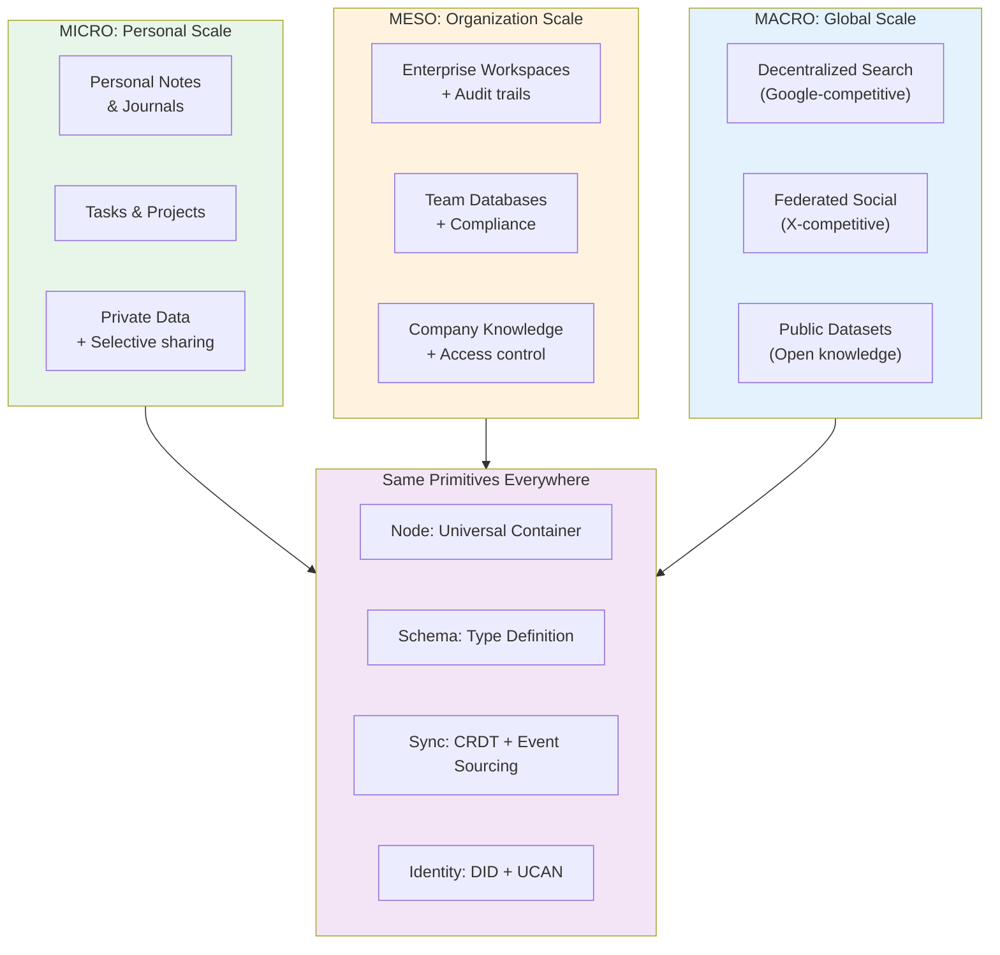
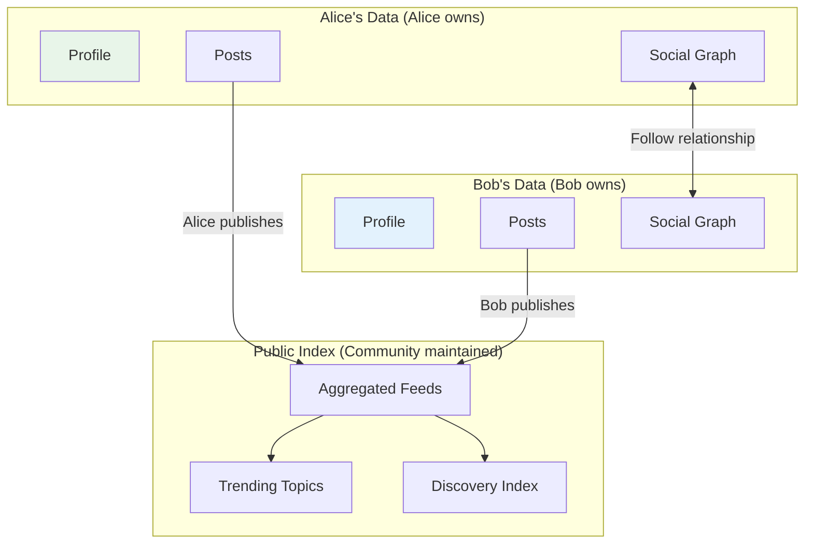
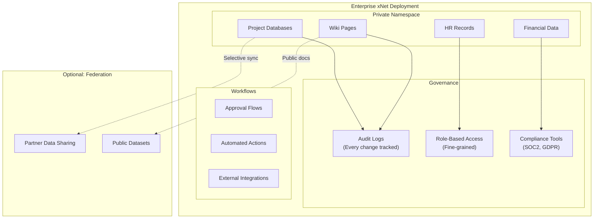
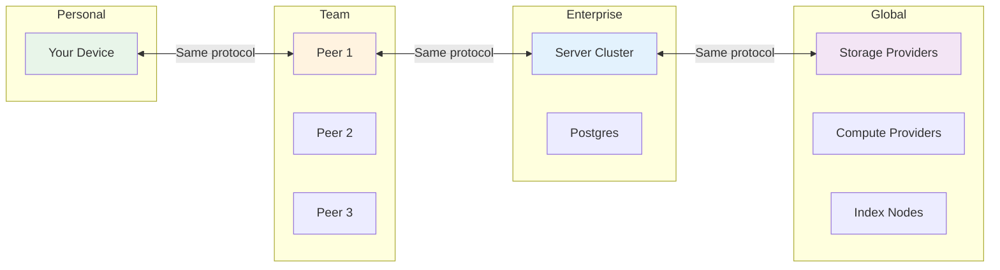
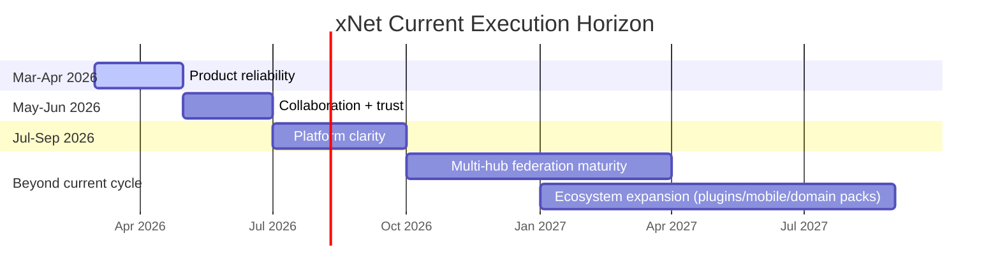

# xNet Vision: The Decentralized Data Layer of the Internet

> From personal notes to planetary-scale infrastructure — seamlessly.

**Version**: 1.0 | **Last Updated**: January 2026

---

## The Big Picture

xNet is not another productivity app. It's not just another local-first SDK.

**xNet is infrastructure for a new internet** — one where data is:

- **User-owned** from personal notes to enterprise databases
- **Globally addressable** via a universal namespace
- **Locally controlled** with fine-grained permissions
- **Infinitely extensible** through user-defined schemas
- **Performant at any scale** from a single device to billions of queries

```
┌─────────────────────────────────────────────────────────────────────────────┐
│                           THE xNET VISION                                    │
│                                                                             │
│   Today's Internet              →           Tomorrow's Internet             │
│   ─────────────────                         ───────────────────             │
│   Data in silos                             Data in a global namespace      │
│   Companies own your data                   You own your data               │
│   Centralized search (Google)               Distributed indexes             │
│   Walled gardens (social)                   Federated, interoperable        │
│   Vendor lock-in                            Portable, user-controlled       │
│   Pay with your privacy                     Pay with value, not data        │
│                                                                             │
└─────────────────────────────────────────────────────────────────────────────┘
```

---

## The Micro-to-Macro Continuum

The same primitives work at every scale — from your personal task list to a global search index:



**Key Insight**: Your personal task list and a planetary search index are just different namespaces in the same system. The architecture doesn't change — only the scale.

---

## The Strategic Play

### xNet: The Trojan Horse

xNet is not the end goal — it's the beginning. It's the interface that gets people to:

1. **Create personal namespaces** — their notes, tasks, projects
2. **Learn the mental model** — Nodes, Schemas, local-first sync
3. **Build their data infrastructure** — one document at a time

```mermaid
flowchart LR
    subgraph PHASE1["Phase 1: Seed"]
        XNOTES["xNet App"]
        PERSONAL["Personal Data"]
        TEAMS["Team Workspaces"]
    end

    subgraph PHASE2["Phase 2: Grow"]
        SDK["Developer SDK"]
        APPS["Third-party Apps"]
        ENTERPRISE["Enterprise Deployments"]
    end

    subgraph PHASE3["Phase 3: Connect"]
        FEDERATION["Federated Queries"]
        NAMESPACE["Global Namespace"]
        INDEXES["Distributed Indexes"]
    end

    subgraph PHASE4["Phase 4: Decentralize"]
        SEARCH["Global Search"]
        SOCIAL["Social Networks"]
        COMMONS["Data Commons"]
    end

    PHASE1 --> PHASE2 --> PHASE3 --> PHASE4

    style PHASE1 fill:#e8f5e9
    style PHASE2 fill:#fff3e0
    style PHASE3 fill:#e3f2fd
    style PHASE4 fill:#f3e5f5
```



### The Namespace is the Network

Every piece of data in xNet has a globally unique address:

```
xnet://did:key:z6MkAlice.../personal/notes/2026-01-21      # Alice's journal
xnet://acme-corp.com/projects/apollo/tasks                 # Company data
xnet://xnet.dev/schemas/Task                               # Built-in schema
xnet://public/indexes/web-search                           # Global search index
```

This isn't just an addressing scheme — it's the foundation for:

- **Federated queries** across organizations
- **Interoperable schemas** between apps
- **Global indexes** anyone can contribute to and query

---

## Concrete Examples

### Example 1: Decentralized Web Search

A Google-scale search engine with no central operator:

```
┌─────────────────────────────────────────────────────────────────────────────┐
│                    DISTRIBUTED SEARCH ENGINE                                 │
│                                                                             │
│   CRAWLERS (millions of participants)                                       │
│   ┌─────────┐ ┌─────────┐ ┌─────────┐ ┌─────────┐                          │
│   │ Alice's │ │  Bob's  │ │ Carol's │ │  ...    │                          │
│   │ Laptop  │ │ Desktop │ │  Phone  │ │ millions│  ← Everyone contributes  │
│   │ crawls  │ │ crawls  │ │ crawls  │ │         │    a little              │
│   │ 10 sites│ │ 50 sites│ │ 5 sites │ │         │                          │
│   └────┬────┘ └────┬────┘ └────┬────┘ └────┬────┘                          │
│        └───────────┴───────────┴───────────┘                                │
│                         │                                                   │
│                         ▼                                                   │
│   ┌─────────────────────────────────────────────────────────────────────┐  │
│   │                    GLOBAL INDEX                                      │  │
│   │   xnet://public/indexes/web-search                                  │  │
│   │                                                                      │  │
│   │   • Billions of pages indexed                                       │  │
│   │   • Distributed across storage providers                            │  │
│   │   • Open ranking algorithm (auditable, not a black box)             │  │
│   │   • No tracking, no filter bubbles                                  │  │
│   └─────────────────────────────────────────────────────────────────────┘  │
│                                                                             │
│   QUERY: "best local-first databases 2026"                                  │
│                                                                             │
│   → Routed to nearest index shards                                          │
│   → Results aggregated from multiple providers                              │
│   → No single point of control or censorship                                │
│                                                                             │
└─────────────────────────────────────────────────────────────────────────────┘
```

**How it beats Google:**

| Aspect                  | Google            | xNet Search                |
| ----------------------- | ----------------- | -------------------------- |
| Who controls ranking?   | Google (opaque)   | Open algorithm (auditable) |
| Who tracks users?       | Google            | Nobody                     |
| Who profits?            | Shareholders      | Contributors               |
| Can be censored?        | Yes (one company) | No (distributed)           |
| Can you verify results? | No                | Yes (provable indexing)    |

### Example 2: Federated Social Network

An X/Twitter-scale social network where you own your social graph:



**What's different:**

- Your posts live in YOUR namespace (not Twitter's servers)
- Your social graph is YOUR data (portable to any app)
- Algorithms are transparent and customizable
- No platform can ban you from your own data

### Example 3: Enterprise Knowledge Base

Tesla's Warp Drive, but open-source and self-hosted:



**Enterprise guarantees:**

- Full audit trail of every change (who, what, when)
- Fine-grained permissions down to individual fields
- Self-hosted = your data never leaves your infrastructure
- Optional federation with partners on YOUR terms

---

## Technical Foundation

### The Core Primitives

Everything in xNet is built on four primitives:

```typescript
// 1. NODE: The universal container
interface Node {
  id: string // Unique identifier
  schemaId: string // What type is this? (IRI)
  createdAt: number // When created
  createdBy: string // Who created it (DID)
  [key: string]: unknown // Schema-defined properties
}

// 2. SCHEMA: The type definition
const TaskSchema = defineSchema({
  name: 'Task',
  namespace: 'xnet://xnet.dev/',
  properties: {
    title: text({ required: true }),
    status: select({ options: STATUS_OPTIONS }),
    dueDate: date({ includeTime: false })
  },
  hasContent: true // Has rich text body?
})

// 3. IDENTITY: Self-sovereign via DID + UCAN
type DID = `did:key:z6Mk${string}` // Decentralized identifier
type UCAN = {
  /* capability token */
} // Delegatable permissions

// 4. SYNC: Hybrid CRDT + Event Sourcing
// Rich text: Yjs CRDT (character-level merge)
// Structured data: Event-sourced (field-level LWW)
```

### Why This Architecture Enables Scale



**The protocol doesn't change** — only the infrastructure beneath it:

- Personal: SQLite on your device (OPFS in modern browsers)
- Team: P2P sync between devices
- Enterprise: Postgres cluster + relay servers
- Global: Incentivized storage/compute providers

---

## The Competitive Landscape

### What Exists Today

| Project           | What It Does        | xNet Difference                        |
| ----------------- | ------------------- | -------------------------------------- |
| **Notion/AFFiNE** | Productivity apps   | We're infrastructure, not just an app  |
| **Jazz**          | Local-first SDK     | We're fully P2P (no required servers)  |
| **DXOS**          | P2P framework       | We have global namespace + economics   |
| **IPFS/Filecoin** | File storage        | We have structured, queryable data     |
| **The Graph**     | Blockchain indexing | We're general-purpose, not just crypto |

### xNet's Unique Position

```
                    More Decentralized
                          ↑
                          │
                    xNet  ●──────────── Global namespace
                          │             + User-owned data
            DXOS ●        │             + SDK-first
                          │             + Economic layer
        ──────────────────┼──────────────────────────→ More Features
                          │
              Jazz ●      │        ● Notion/AFFiNE
                          │
           Zero ●         │
                          │
                    Less Decentralized
```

**What makes xNet different:**

1. **True P2P** — No servers required for basic operation
2. **Global namespace** — `xnet://` addresses work anywhere
3. **User-defined schemas** — Not locked into our data model
4. **Dual sync strategy** — Right tool for each data type
5. **DID/UCAN identity** — Self-sovereign, delegatable
6. **SDK-first** — Build ANY app, not just productivity

---

## Implementation Roadmap

### Where We Are Now

The project is now beyond "platform POC" status and in a product-hardening phase:

- Core package stack and three apps are implemented and actively maintained.
- Web includes pages, databases, and canvas routes.
- Hub includes sync relay, FTS5 search, file handling, schema routes, and federation primitives.
- Share/auth flows have received security hardening (handle redemption, replay protection, stricter endpoint policy).

Execution focus for the current cycle is not building first versions of capabilities; it is making them dependable, understandable, and easy to adopt.

### What's Next



---

## Guiding Principles

### 1. Local-First, Always

Data lives on your device first. The network is an optimization, not a requirement.

```
Your Device (primary) ──sync──> Network (optional)
     │
     └── Works offline, instant, private
```

### 2. User Owns Their Data

Not "user can export" — user OWNS. The data is theirs by architecture, not by policy.

```
Traditional: Company Database → User Access
xNet:        User Namespace ← Company has delegated access
```

### 3. Schemas Are User-Extensible

We provide built-in schemas (Page, Task, Database). Users define their own.

```typescript
// Your custom schema is a first-class citizen
const RecipeSchema = defineSchema({
  namespace: 'xnet://did:key:z6Mk.../schemas/',
  name: 'Recipe',
  properties: {
    /* ... */
  }
})
```

### 4. Same Primitives at Every Scale

No special-casing for "enterprise" or "global". The same Node/Schema/Sync works everywhere.

### 5. Open by Default

- Open source (MIT)
- Open protocols
- Open schemas
- No vendor lock-in

---

## Call to Action

### For Developers

Build on xNet. Use `@xnet/react` to create apps where users own their data.

```bash
npm install @xnet/react
```

### For Organizations

Deploy xNet as your knowledge base. Own your data. No SaaS fees. Full compliance.

### For the Future

Help us build the decentralized data layer. Contribute to:

- Core SDK development
- Schema standards
- Infrastructure nodes
- Documentation and examples

---

## Summary

| Layer          | What It Enables                        | Status       |
| -------------- | -------------------------------------- | ------------ |
| **Personal**   | Your notes, tasks, private data        | Building now |
| **Team**       | Collaborative workspaces, P2P sync     | Building now |
| **Enterprise** | Audit trails, compliance, scale        | Phase 3      |
| **Federation** | Cross-org queries, partner data        | Future       |
| **Global**     | Public indexes, decentralized services | Vision       |

**The path**: Build the foundation right (Node, Schema, Sync, Identity), then layer on federation and global namespace when ready.

**The goal**: A world where data silos don't exist, where users own their data, and where the infrastructure of the internet is as decentralized as its original promise.

---

_"We shape our tools and thereafter our tools shape us."_

xNet is the tool that shapes a better internet.

---

[Back to Main Plan](./plan/README.md) | [Implementation Details](./plan01MVP/README.md)
