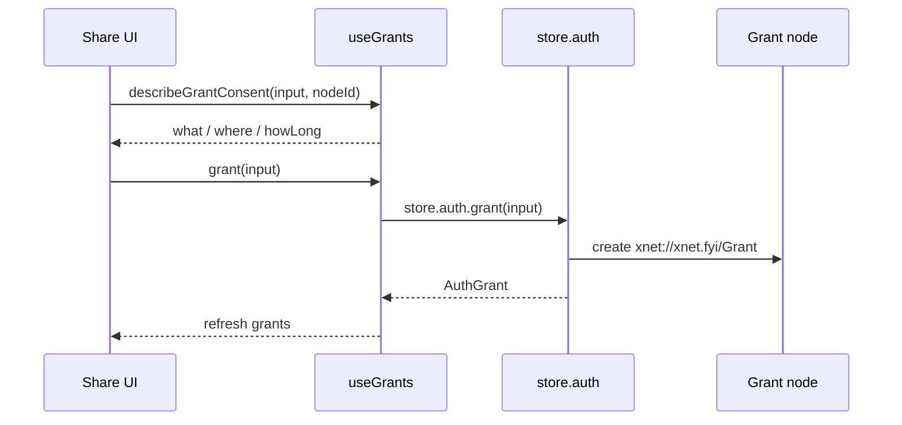

# Authorization Recipes

Quick patterns for using the authorization API in app code.

## Gated Actions with `useCan`

```tsx
import { useCan } from '@xnetjs/react'

export function EditButton({ nodeId }: { nodeId: string }) {
  const { canWrite, loading } = useCan(nodeId)

  if (loading || !canWrite) {
    return null
  }

  return <button type="button">Edit</button>
}
```

## Share Dialog with `useGrants`

```tsx
import type { DID } from '@xnetjs/data'
import { describeGrantConsent, useCan, useGrants } from '@xnetjs/react'

export function SharePanel({ nodeId }: { nodeId: string }) {
  const { canShare } = useCan(nodeId)
  const { grants, grant, revoke, loading } = useGrants(nodeId)

  if (!canShare) {
    return null
  }

  const onGrant = async (to: DID, actions: Array<'read' | 'write' | 'delete' | 'share'>) => {
    const summary = describeGrantConsent({ to, actions, resource: nodeId }, nodeId)
    console.info('Grant consent preview', {
      what: summary.what,
      where: summary.where,
      howLong: summary.howLong
    })

    await grant({ to, actions, resource: nodeId })
  }

  if (loading) {
    return <p>Loading grants...</p>
  }

  return (
    <div>
      <button type="button" onClick={() => onGrant('did:key:z6MkExample', ['read'])}>
        Grant Read Access
      </button>

      <ul>
        {grants.map((item) => (
          <li key={item.id}>
            <span>{item.grantee}</span>
            <span>{item.actions.join(', ')}</span>
            <button type="button" onClick={() => revoke(item.id)}>
              Revoke
            </button>
          </li>
        ))}
      </ul>
    </div>
  )
}
```



## Debugging Decisions with `store.auth.explain`

```ts
const trace = await store.auth.explain({ action: 'write', nodeId })

if (!trace.allowed) {
  console.info('Auth denied', {
    reasons: trace.reasons,
    roles: trace.roles,
    steps: trace.steps
  })
}
```

## React Trace Surface with `useAuthTrace`

```tsx
import { useAuthTrace } from '@xnetjs/react'

export function AuthDebugPanel({ nodeId }: { nodeId: string }) {
  const { summary, loading, refresh } = useAuthTrace({ nodeId, action: 'write' })

  if (loading || !summary) {
    return null
  }

  return (
    <section>
      <button type="button" onClick={() => void refresh()}>
        Refresh
      </button>
      <pre>{JSON.stringify(summary, null, 2)}</pre>
    </section>
  )
}
```
