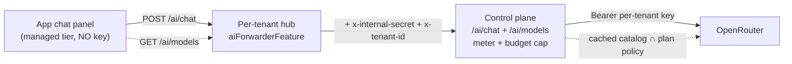

# Managed AI Setup (OpenRouter)

How to turn on **managed AI** for xNet Cloud — metered, budget-capped AI that the
app uses with **no API key in the browser**, plus **model switching** across the
OpenRouter catalog. This is the operator guide for exploration
[0208](../explorations/0208_[x]_OPENROUTER_MANAGED_AI_MODEL_SWITCHING_AND_CLIENT_WIRING.md)
(builds on [0200](../explorations/0200_[_]_CLOUD_BILLING_AI_METERING_AND_RUN_IN_PUBLIC_DASHBOARD.md)
/ [0201](../explorations/0201_[_]_OPENROUTER_LITELLM_METERED_AI_AND_CREDITS_BILLING.md)).

**TL;DR** — you configure **one place** (the control plane). Add a few env vars,
run the preflight script, done. Hubs need **no** AI config — the control plane
injects the per-tenant credential into each AI-enabled hub automatically.

```
node scripts/cloud-openrouter-setup.mjs --key sk-or-... --probe-mint
```

## How it fits together



- The **client never holds a key**. The hub injects the shared internal secret +
  its tenant id; the control plane resolves the tenant's budgeted OpenRouter key.
- **Metering + the hard cap** live in the control plane (`/ai/chat`): a `402`
  stops the spend, exact `usage.cost` is billed, the dashboard shows used/included/cap.
- **Model switching** is driven by `GET /ai/models` (the live OpenRouter catalog,
  cached, intersected with the tenant's plan policy).

## Prerequisites

1. A working xNet Cloud **control plane** (`apps/cloud`) — see [SETUP.md](SETUP.md).
   You already have `XNET_CLOUD_BASE_URL` and `XNET_CLOUD_INTERNAL_SECRET` set.
2. An **OpenRouter account** with **credits** (managed AI draws down your
   OpenRouter balance; you re-bill tenants with a markup).
3. Optionally **Stripe** wired (`STRIPE_SECRET_KEY`) for real metered billing —
   without it, metering runs against a no-op fake (fine for staging smoke tests).

## Step 1 — OpenRouter account

1. Create an account at <https://openrouter.ai> and **add credits**
   (<https://openrouter.ai/credits>). Set an org spend limit if you want a backstop.
2. Create a **Provisioning API key** (NOT a normal inference key):
   <https://openrouter.ai/settings/provisioning-api-keys>. This key only mints and
   manages per-tenant keys — it can't run inference itself. Copy it
   (`sk-or-...`); it's the value of `OPENROUTER_MANAGEMENT_KEY`.

> The control plane mints **one budgeted OpenRouter key per tenant** at provision
> time (limit = the plan's monthly AI cap, monthly reset) and stores its ref on the
> tenant record. There is **no** shared inference key to manage.

## Step 2 — Control-plane env

Add these to the control plane's environment (e.g. `apps/cloud/.env.staging`,
then mirror to your secret store — see [SETUP.md](SETUP.md) Part 3):

```bash
AI_GATEWAY_PROVIDER=openrouter
AI_GATEWAY_BASE_URL=https://openrouter.ai/api/v1
OPENROUTER_MANAGEMENT_KEY=sk-or-...        # the Provisioning API key from Step 1
AI_MARKUP=1.3                              # retail markup over provider cost (≥ 1)
# Optional global allow-list (per-plan gating is separate — see Step 4):
# AI_ALLOWED_MODELS=anthropic/claude-sonnet-4-6,openai/gpt-4o-mini
```

Already present from base control-plane setup, and **reused** for managed AI:

| Var                          | Why managed AI needs it                                                         |
| ---------------------------- | ------------------------------------------------------------------------------- |
| `XNET_CLOUD_BASE_URL`        | The URL hubs call back to (`/ai/chat`). Injected into hubs as `XNET_CLOUD_URL`. |
| `XNET_CLOUD_INTERNAL_SECRET` | The hub↔control-plane shared secret. Injected into AI hubs.                     |
| `STRIPE_SECRET_KEY`          | Real metered billing (omit ⇒ keyless fake; no charges).                         |

The env doctor knows these vars — validate with:

```bash
node scripts/cloud-env-doctor.mjs            # or your usual env check
```

## Step 3 — Preflight (scripted)

Run the setup script. Read-only by default; `--probe-mint` additionally mints and
deletes a $0.01 key to prove the Provisioning API works end-to-end (the exact path
the control plane uses per tenant):

```bash
OPENROUTER_MANAGEMENT_KEY=sk-or-... node scripts/cloud-openrouter-setup.mjs --probe-mint
```

It checks the Provisioning key, your credit balance, the live model catalog (and
that the plans' default models exist), optionally the mint→delete round-trip, then
prints the env block. Add `--write staging` to append it to `apps/cloud/.env.staging`.

## Step 4 — Plans & model gating (already defaulted)

Per-plan AI lives in the entitlements catalog
([`packages/entitlements/src/plans.ts`](../../packages/entitlements/src/plans.ts))
and rides the signed `HUB_PLAN` token — no env needed. Defaults ship sensibly:

| Plan                       | AI  | Included / cap (USD) | Models (`aiModels`) | Default                       |
| -------------------------- | --- | -------------------- | ------------------- | ----------------------------- |
| demo                       | off | —                    | —                   | —                             |
| personal                   | on  | $2 / $25             | cheap subset        | `anthropic/claude-haiku-4-5`  |
| family                     | on  | $5 / $60             | standard subset     | `anthropic/claude-sonnet-4-6` |
| team / community / company | on  | $8–15 / $200–500     | **all**             | `anthropic/claude-sonnet-4-6` |
| enterprise                 | on  | $25 / $2000          | **all**             | `anthropic/claude-opus-4-8`   |

To change them, edit `PLAN_CATALOG` (or use `withAiModels` / `withAiBudget` for
per-tenant overrides). `CHEAP_AI_MODELS` / `STANDARD_AI_MODELS` are the curated
tiers. Model ids are OpenRouter-style `provider/model`.

## Step 5 — Hubs: nothing to do

When the control plane has `OPENROUTER_MANAGEMENT_KEY` + `XNET_CLOUD_BASE_URL` +
`XNET_CLOUD_INTERNAL_SECRET`, it injects the forwarder env
(`XNET_CLOUD_URL`, `XNET_CLOUD_INTERNAL_SECRET`, `XNET_TENANT_ID`) into **every
AI-enabled hub** at provision time. Existing hubs pick it up on their next
provision / plan-change / recovery. AI-off tenants (e.g. demo) get nothing, so
their `/ai/health` reports `managed:false` and the app's managed tier stays hidden.

## Verify

```bash
# On a hub — availability probe (booleans only):
curl -s https://<hub>/ai/health            # → {"ok":true,"managed":true}

# Authenticated (session cookie) — the plan-gated catalog:
curl -s https://<hub>/ai/models | jq '.models[0], .defaultModel'

# A metered round-trip (LiteLLM/OpenRouter mock_response avoids a real spend):
curl -s -X POST https://<hub>/ai/chat -H 'content-type: application/json' \
  -d '{"model":"anthropic/claude-haiku-4-5","messages":[{"role":"user","content":"hi"}],"mockResponse":"pong"}' \
  | jq '{text, model, spendThisPeriodUsd, budgetUsd, budgetState}'
```

In the app: open the AI chat panel — it should auto-select **xNet Cloud (managed,
metered)**, show a model picker (grouped, with price/context badges) and a
"used / included / cap" budget gauge.

## How billing works (recap)

- You buy OpenRouter credits; each tenant gets a budgeted key (its monthly cap).
- Every call is metered at **`ceil(usage.cost × AI_MARKUP)`** into the usage ledger
  and (with Stripe) a metered meter event. `includedAiUsd` is free first; beyond it
  is metered overage to the hard cap; a `402` stops spend at the cap.
- `AI_MARKUP=1.3` (~30%) absorbs OpenRouter's credit-purchase fee + Stripe fees.
  Tune via the measured margin reconciliation.

## User-set spend caps (weekly / monthly / rolling)

Beyond the plan's hard cap, each tenant can set **their own** AI spend limit from
the dashboard ("Managed AI" card → _Your spend cap_), enforced over a window
(exploration [0244](../explorations/0244_[_]_OPENROUTER_DEEP_INTEGRATION_MARGIN_SAFE_BILLING_AND_USER_SPEND_CAPS.md)):

- **monthly** (calendar month — the default, aligned to the Stripe invoice),
- **weekly** (Mon–Sun UTC — aligned to OpenRouter's native weekly key reset), or
- **rolling N days** ("at most $X in the last N days").

The cap is always clamped to ≤ the plan's `aiMonthlyBudgetUsd`; the metered
gateway sums ledger spend since the window start and `402`s at the cap. The
OpenRouter key's `limit_reset` is aligned to the window as a coarse provider-side
backstop (its `limit` stays at the plan cap, never the tighter user cap). Note:
the cap governs **access**; the **invoice** is still the calendar month.

## Keep the account funded (low-balance alert)

Managed AI draws on **one** OpenRouter account — if its balance hits zero, _every_
tenant `402`s. Two safeguards:

- **Buy credits in bulk.** OpenRouter's ~5.5% credit-purchase fee has an **$0.80
  minimum**, so many small top-ups bleed margin; top up in larger increments. The
  margin model already prices the 5.5% in (`EFFECTIVE_COGS_MULTIPLIER = 1.055`).
- **Alert before zero.** Poll the balance with `OpenRouterCreditsClient`
  (`GET /api/v1/credits`) and alert when `isLowBalance(balance, threshold)` — wire
  it to your monitoring / a cron, ideally with auto-top-up:

  ```ts
  import { OpenRouterCreditsClient, isLowBalance } from '@xnetjs/cloud/ai'
  const credits = new OpenRouterCreditsClient({ apiKey: process.env.OPENROUTER_API_KEY! })
  const balance = await credits.getBalance()
  if (isLowBalance(balance, 50)) alertOps(`OpenRouter balance low: $${balance.remainingUsd}`)
  ```

## Reconcile metering against OpenRouter

To catch a metering bug (or a missed meter call), periodically compare our ledger's
provider-cost total for a tenant against OpenRouter's own per-key counter:

```ts
import { reconcileKeyUsage } from '@xnetjs/cloud/cost'
const { usageUsd } = await keyManager.usage(tenant.aiKeyManageRef!) // GET /keys/{hash}
const r = reconcileKeyUsage(ledgerProviderCostUsd, usageUsd) // tolerance default $0.01
if (!r.withinTolerance) alertOps(`AI metering drift for ${tenant.tenantId}: $${r.driftUsd}`)
```

## Self-host / no control plane

Managed AI is Cloud-only. With no control plane (or the vars unset), hubs report
`managed:false`, the managed tier hides, and **bring-your-own-key** stays the path
(Anthropic / OpenAI / OpenRouter-with-your-own-key, local Ollama/LM Studio, the
bridge). No hard failure — the anti-lock-in invariant holds.

## Env var reference

| Var                                                                | Side          | Required     | Purpose                                            |
| ------------------------------------------------------------------ | ------------- | ------------ | -------------------------------------------------- |
| `AI_GATEWAY_PROVIDER`                                              | control plane | rec.         | `openrouter` (or `litellm`)                        |
| `AI_GATEWAY_BASE_URL`                                              | control plane | yes          | `https://openrouter.ai/api/v1`                     |
| `OPENROUTER_MANAGEMENT_KEY`                                        | control plane | yes          | Provisioning API key (mints per-tenant keys)       |
| `AI_MARKUP`                                                        | control plane | no (def 1.3) | retail markup over provider cost (≥ 1)             |
| `AI_ALLOWED_MODELS`                                                | control plane | no           | global allow-list (per-plan gating is separate)    |
| `XNET_CLOUD_BASE_URL`                                              | control plane | yes\*        | hubs call this for `/ai/chat` (\*already set)      |
| `XNET_CLOUD_INTERNAL_SECRET`                                       | control plane | yes\*        | hub↔control-plane secret (\*already set)           |
| `STRIPE_SECRET_KEY`                                                | control plane | for billing  | real metering (else no-op fake)                    |
| `XNET_CLOUD_URL` / `XNET_CLOUD_INTERNAL_SECRET` / `XNET_TENANT_ID` | hub           | **auto**     | injected by the control plane — do not set by hand |

## Troubleshooting

- **`managed:false` on `/ai/health`** — the hub has no forwarder env. Confirm the
  control plane has `OPENROUTER_MANAGEMENT_KEY` + `XNET_CLOUD_BASE_URL` +
  `XNET_CLOUD_INTERNAL_SECRET`, then re-provision the tenant (plan-change or upgrade).
- **`401` from `/ai/chat`** — the tenant isn't `aiEnabled`, or the internal secret
  mismatches between hub and control plane.
- **`model_not_allowed`** — the model isn't in the plan's `aiModels`; pick one from
  `/ai/models` or raise the plan tier.
- **`402 ai_budget_exceeded`** — the tenant hit its monthly cap; raise the cap or
  wait for the period reset.
- **Empty model picker** — the catalog couldn't be fetched (or the plan is `'all'`
  on a non-OpenRouter gateway). Check `AI_GATEWAY_PROVIDER=openrouter` and rerun the
  preflight script.
- **Provisioning key rejected** — you used a normal inference key. Create a
  **Provisioning** key (Step 1).
