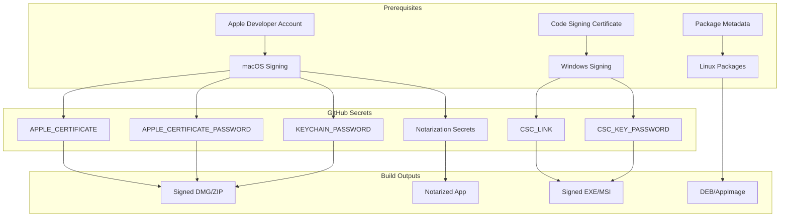
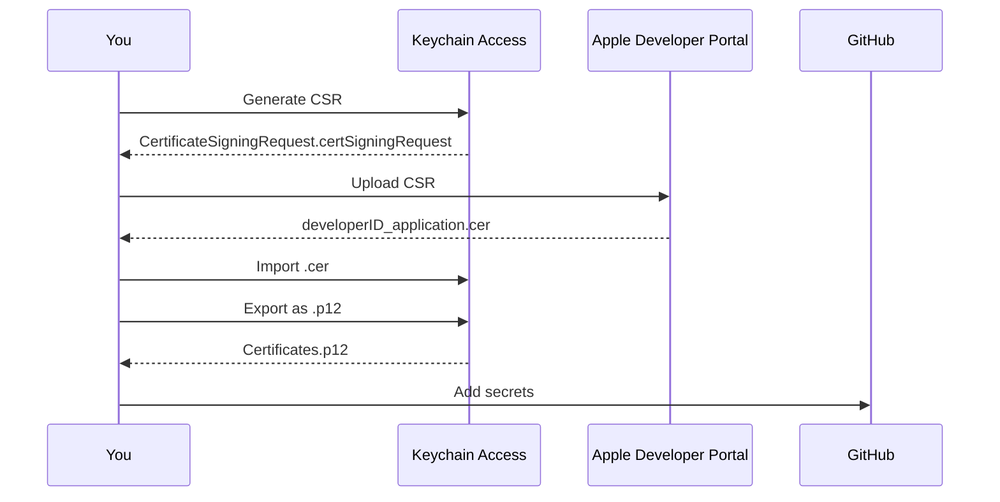
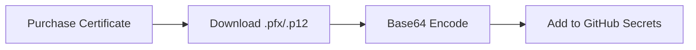

# Setting Up Electron Builds for xNet

This guide walks you through enabling signed Electron builds for macOS, Windows, and Linux.

## Overview



## Current Build Status

| Platform    | Status      | Requirement                 |
| ----------- | ----------- | --------------------------- |
| Linux x64   | Ready       | None (unsigned)             |
| Linux arm64 | Ready       | None (unsigned)             |
| macOS x64   | Needs Setup | Apple Developer Certificate |
| macOS arm64 | Needs Setup | Apple Developer Certificate |
| Windows     | Needs Setup | Code Signing Certificate    |

---

## Linux Builds

Linux builds work without code signing. The workflow produces:

- `.AppImage` - Universal Linux package
- `.deb` - Debian/Ubuntu package

No additional setup required.

---

## macOS Builds

### Prerequisites

- [ ] Apple Developer Program membership ($99/year)
- [ ] macOS computer (for certificate creation)
- [ ] Keychain Access app

### Step 1: Create a Developer ID Certificate



#### 1.1 Generate a Certificate Signing Request (CSR)

1. Open **Keychain Access** on your Mac
2. Go to **Keychain Access > Certificate Assistant > Request a Certificate from a Certificate Authority**
3. Fill in:
   - **User Email Address**: Your Apple ID email
   - **Common Name**: Your name or company name
   - **CA Email Address**: Leave blank
   - **Request is**: Select "Saved to disk"
4. Click **Continue** and save the `.certSigningRequest` file

#### 1.2 Create the Certificate on Apple Developer Portal

1. Go to [Apple Developer Certificates](https://developer.apple.com/account/resources/certificates/list)
2. Click the **+** button to create a new certificate
3. Select **Developer ID Application** (for distributing outside the App Store)
4. Click **Continue**
5. Upload your `.certSigningRequest` file
6. Click **Continue** and then **Download**
7. You'll get a `developerID_application.cer` file

#### 1.3 Install and Export the Certificate

1. Double-click the `.cer` file to install it in Keychain Access
2. Open **Keychain Access**
3. Find your certificate under **My Certificates** (it should say "Developer ID Application: Your Name")
4. Right-click the certificate and select **Export**
5. Choose **Personal Information Exchange (.p12)** format
6. Set a strong password - you'll need this later
7. Save as `Certificates.p12`

#### 1.4 Encode the Certificate for GitHub

```bash
# Convert the .p12 file to base64
base64 -i Certificates.p12 -o certificate-base64.txt

# Copy the contents (it will be one long string)
cat certificate-base64.txt | pbcopy
```

### Step 2: Add GitHub Secrets

Go to your repository: **Settings > Secrets and variables > Actions > New repository secret**

Add these secrets:

| Secret Name                  | Value                                | Description                       |
| ---------------------------- | ------------------------------------ | --------------------------------- |
| `APPLE_CERTIFICATE`          | Contents of `certificate-base64.txt` | Base64-encoded .p12 certificate   |
| `APPLE_CERTIFICATE_PASSWORD` | Password you set when exporting      | .p12 file password                |
| `KEYCHAIN_PASSWORD`          | Any secure password                  | Used to create temporary keychain |

#### Checklist

- [ ] Created Developer ID Application certificate
- [ ] Exported as .p12 with password
- [ ] Converted to base64
- [ ] Added `APPLE_CERTIFICATE` secret
- [ ] Added `APPLE_CERTIFICATE_PASSWORD` secret
- [ ] Added `KEYCHAIN_PASSWORD` secret

### Step 3: (Optional) Enable Notarization

Notarization is required for macOS 10.15+ to avoid Gatekeeper warnings.

#### 3.1 Create an App-Specific Password

1. Go to [appleid.apple.com](https://appleid.apple.com)
2. Sign in and go to **Security > App-Specific Passwords**
3. Click **Generate an app-specific password**
4. Name it "xNet Notarization"
5. Copy the generated password

#### 3.2 Get Your Team ID

1. Go to [Apple Developer Membership](https://developer.apple.com/account/#!/membership)
2. Copy your **Team ID** (10-character string)

#### 3.3 Add Notarization Secrets

| Secret Name         | Value                 | Description               |
| ------------------- | --------------------- | ------------------------- |
| `APPLE_ID`          | your@email.com        | Your Apple ID email       |
| `APPLE_ID_PASSWORD` | App-specific password | From step 3.1             |
| `APPLE_TEAM_ID`     | XXXXXXXXXX            | Your 10-character Team ID |

#### Checklist

- [ ] Created app-specific password
- [ ] Found Team ID
- [ ] Added `APPLE_ID` secret
- [ ] Added `APPLE_ID_PASSWORD` secret
- [ ] Added `APPLE_TEAM_ID` secret

---

## Windows Builds

### Prerequisites

You need a code signing certificate from a Certificate Authority. Options:

| Provider                                                               | Cost         | Notes                                 |
| ---------------------------------------------------------------------- | ------------ | ------------------------------------- |
| [SignPath](https://signpath.io)                                        | Free for OSS | Good for open source projects         |
| [SSL.com](https://www.ssl.com/certificates/ev-code-signing/)           | ~$300/year   | EV certificates for SmartScreen trust |
| [Sectigo](https://sectigo.com/ssl-certificates-tls/code-signing)       | ~$200/year   | Standard code signing                 |
| [DigiCert](https://www.digicert.com/signing/code-signing-certificates) | ~$400/year   | Enterprise option                     |

### Option A: Standard Code Signing Certificate



#### Step 1: Obtain a Certificate

1. Purchase a code signing certificate from a CA
2. Complete the validation process (usually identity verification)
3. Download the certificate as a `.pfx` or `.p12` file

#### Step 2: Encode and Add to GitHub

```bash
# Convert to base64
base64 -i certificate.pfx -o certificate-base64.txt

# Or on Windows (PowerShell)
[Convert]::ToBase64String([IO.File]::ReadAllBytes("certificate.pfx")) | Out-File certificate-base64.txt
```

Add these GitHub secrets:

| Secret Name        | Value                                | Description                |
| ------------------ | ------------------------------------ | -------------------------- |
| `CSC_LINK`         | Contents of `certificate-base64.txt` | Base64-encoded certificate |
| `CSC_KEY_PASSWORD` | Certificate password                 | Password for the .pfx file |

#### Checklist

- [ ] Purchased code signing certificate
- [ ] Completed CA validation
- [ ] Downloaded .pfx/.p12 file
- [ ] Converted to base64
- [ ] Added `CSC_LINK` secret
- [ ] Added `CSC_KEY_PASSWORD` secret

### Option B: SignPath (Free for Open Source)

[SignPath](https://signpath.io/product/open-source) offers free code signing for open source projects.

1. Apply at [signpath.io/open-source](https://signpath.io/product/open-source)
2. Once approved, follow their GitHub Actions integration guide
3. This requires modifying the workflow to use their signing service

---

## Verification

After adding all secrets, trigger a new build:

```bash
# From the repository root
gh workflow run "Electron Release" --ref main
```

### Expected Results

| Platform             | Without Signing                | With Signing               |
| -------------------- | ------------------------------ | -------------------------- |
| Linux                | Builds successfully            | Builds successfully        |
| macOS                | Fails at "Import certificates" | Builds + signs DMG         |
| macOS + Notarization | -                              | Builds + signs + notarizes |
| Windows              | Fails at "Build Electron app"  | Builds + signs EXE         |

### Troubleshooting

#### macOS: "security: SecKeychainItemImport: One or more parameters passed to a function were not valid"

This usually means:

- `APPLE_CERTIFICATE` is empty or invalid base64
- The .p12 file was corrupted during export

**Fix**: Re-export the certificate and re-encode it.

#### macOS: "The specified item could not be found in the keychain"

The certificate wasn't properly imported.

**Fix**: Ensure you exported the certificate with the private key (right-click the certificate in "My Certificates", not just "Certificates").

#### Windows: "Cannot find certificate xNet"

The `CSC_LINK` secret is empty or the certificate doesn't contain the expected name.

**Fix**: Verify the certificate is valid and properly base64-encoded.

#### Windows: "Error: signtool.exe not found"

This shouldn't happen on GitHub Actions Windows runners, but if it does:

**Fix**: The runner image may need Windows SDK. Check if the workflow needs an update.

---

## Security Best Practices

1. **Never commit certificates to the repository** - Always use GitHub Secrets
2. **Use strong passwords** - Generate random passwords for certificates
3. **Rotate certificates before expiry** - Set calendar reminders
4. **Limit secret access** - Use environment protection rules if needed
5. **Audit secret usage** - Regularly review Actions logs

---

## Quick Reference: All Required Secrets

### Minimum (Signed Builds)

| Secret                       | Platform | Required |
| ---------------------------- | -------- | -------- |
| `APPLE_CERTIFICATE`          | macOS    | Yes      |
| `APPLE_CERTIFICATE_PASSWORD` | macOS    | Yes      |
| `KEYCHAIN_PASSWORD`          | macOS    | Yes      |
| `CSC_LINK`                   | Windows  | Yes      |
| `CSC_KEY_PASSWORD`           | Windows  | Yes      |

### Full (With Notarization)

| Secret                       | Platform | Required         |
| ---------------------------- | -------- | ---------------- |
| `APPLE_CERTIFICATE`          | macOS    | Yes              |
| `APPLE_CERTIFICATE_PASSWORD` | macOS    | Yes              |
| `KEYCHAIN_PASSWORD`          | macOS    | Yes              |
| `APPLE_ID`                   | macOS    | For notarization |
| `APPLE_ID_PASSWORD`          | macOS    | For notarization |
| `APPLE_TEAM_ID`              | macOS    | For notarization |
| `CSC_LINK`                   | Windows  | Yes              |
| `CSC_KEY_PASSWORD`           | Windows  | Yes              |

---

## Related Links

- [Apple Developer Program](https://developer.apple.com/programs/)
- [Apple Code Signing Guide](https://developer.apple.com/support/code-signing/)
- [electron-builder Code Signing](https://www.electron.build/code-signing)
- [GitHub Encrypted Secrets](https://docs.github.com/en/actions/security-guides/encrypted-secrets)
- [SignPath Open Source](https://signpath.io/product/open-source)
