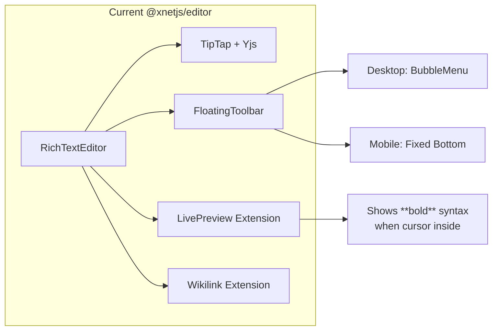
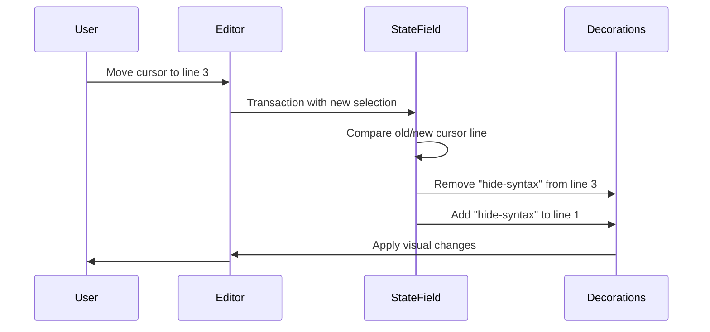
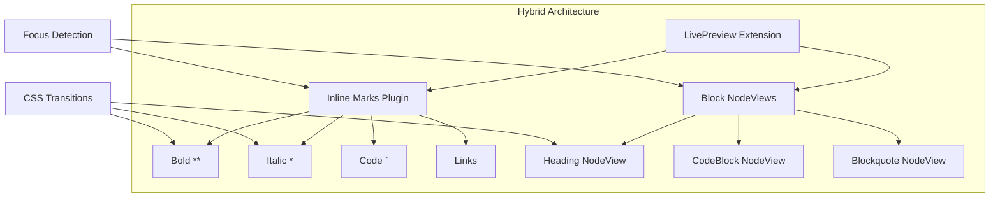

# Rich Text Editor Redesign: Obsidian/Notion-Style Experience

> **Status**: ✅ IMPLEMENTED - The editor now has Obsidian-style live preview and Notion-style UI

## Implementation Status

The custom build approach was chosen and implemented:

- [x] **Phase 1: Enhanced Inline Marks** - `extensions/live-preview/inline-marks.ts` with CSS styling
- [x] **Phase 2: Block-Level NodeViews**
  - [x] `nodeviews/HeadingView.tsx` - Shows `#` prefix when focused
  - [x] `nodeviews/CodeBlockView.tsx` - Shows fences when focused
  - [x] `nodeviews/BlockquoteView.tsx` - Shows `>` prefix when focused
  - [x] `nodeviews/hooks/useNodeFocus.ts` - Focus detection hook
- [x] **Phase 3: Slash Commands** - `extensions/slash-command/` with `SlashMenu` component
- [x] **Phase 4: Enhanced Bubble Menu** - `FloatingToolbar.tsx` with animations
- [x] **Phase 5: Drag Handles** - `components/DragHandle/` with full drag/drop support

Additional features implemented beyond the original plan:

- Callout blocks (`extensions/callout/`)
- Toggle blocks (`extensions/toggle/`)
- Mermaid diagrams (`extensions/mermaid/`)
- Image/file uploads (`extensions/image/`, `extensions/file/`)
- Embeds (`extensions/embed/`)
- Comments (`extensions/comment/`)
- Keyboard shortcuts (`extensions/keyboard-shortcuts/`)

---

## Original Research

> **Goal**: Transform xNet's TipTap editor into a polished, Obsidian-like live preview experience with Notion-style UI elements.

---

## Table of Contents

1. [Current State Analysis](#current-state-analysis)
2. [Reference Implementations](#reference-implementations)
3. [Obsidian Live Preview Architecture](#obsidian-live-preview-architecture)
4. [Implementation Approaches](#implementation-approaches)
5. [Slash Commands & Menus](#slash-commands--menus)
6. [CSS & Visual Polish](#css--visual-polish)
7. [Implementation Phases](#implementation-phases)
8. [Decision Matrix](#decision-matrix)

---

## Current State Analysis

### What xNet Editor Has



**Current Extensions** (`packages/editor/src/extensions.ts`):

- `Wikilink` - `[[page-name]]` links
- `LivePreview` - Basic decoration-based syntax showing (bold, italic, strike, code)
- Re-exports: StarterKit, Placeholder, Collaboration, TaskList, TaskItem, Link, Typography

**Current LivePreview Behavior**:

- Shows `**` around bold text when cursor is inside
- Uses ProseMirror `Decoration.widget()`
- Only handles inline marks, not block elements (headings, code blocks)

### Gaps vs Obsidian

| Feature                     | xNet Current   | Obsidian            | Gap         |
| --------------------------- | -------------- | ------------------- | ----------- |
| Header syntax (`##`)        | Not shown      | Faded when focused  | **Missing** |
| Code block fences           | Not shown      | Shown when focused  | **Missing** |
| Link syntax `[](url)`       | Not shown      | Shown when editing  | **Missing** |
| Smooth transitions          | None           | CSS fade animations | **Missing** |
| Syntax in lighter color     | All same color | Muted/faded         | **Missing** |
| Block-level focus detection | None           | Full support        | **Missing** |
| Slash commands              | None           | Full menu           | **Missing** |
| Drag handles                | None           | Block reordering    | **Missing** |

---

## Reference Implementations

### Tier 1: Direct Adoption Candidates

| Project                                              | Stars | Approach             | License    | Notes                          |
| ---------------------------------------------------- | ----- | -------------------- | ---------- | ------------------------------ |
| [Novel](https://github.com/steven-tey/novel)         | 15.9k | TipTap + AI          | Apache 2.0 | Notion-style, best bubble menu |
| [BlockNote](https://github.com/TypeCellOS/BlockNote) | 9k    | TipTap blocks        | MPL 2.0    | Block-based, drag handles      |
| [Milkdown](https://github.com/Milkdown/milkdown)     | 11k   | ProseMirror + remark | MIT        | Plugin architecture            |

### Tier 2: Pattern References

| Project                                                          | Stars | Key Learning                                                     |
| ---------------------------------------------------------------- | ----- | ---------------------------------------------------------------- |
| [prosemirror-math](https://github.com/benrbray/prosemirror-math) | 297   | `selectNode()`/`deselectNode()` pattern for edit vs render modes |
| [tiptap-markdown](https://github.com/aguingand/tiptap-markdown)  | 509   | Markdown serialization                                           |
| [Doist Typist](https://github.com/Doist/typist)                  | 579   | Rich + plain text modes                                          |

### Novel Deep Dive

Novel is the closest to what we want for Notion-style UI:

```typescript
// Novel's bubble menu pattern
<BubbleMenu
  shouldShow={({ editor, state }) => !state.selection.empty}
  tippyOptions={{
    moveTransition: 'transform 0.15s ease-out',
    placement: 'top'
  }}
>
  <EditorBubbleMenu />
</BubbleMenu>
```

**Novel provides**:

- Polished bubble menu with animations
- Slash command palette
- AI completion integration
- Tailwind + shadcn/ui styling

**Novel lacks**:

- Obsidian-style live preview (showing `##` for headers)
- Mobile toolbar

### prosemirror-math Pattern

This is the key pattern for showing different content based on focus:

```typescript
// In NodeView implementation
class MathView {
  selectNode() {
    // Show raw LaTeX source
    this.dom.classList.add('selected')
    this.showSource()
  }

  deselectNode() {
    // Show rendered math
    this.dom.classList.remove('selected')
    this.showRendered()
  }
}
```

This pattern directly translates to showing `##` when a heading is focused.

---

## Obsidian Live Preview Architecture

### How Obsidian Works (CodeMirror 6)

Obsidian uses CodeMirror 6's decoration system with line-level focus detection:



### Key Behaviors to Replicate

#### 1. Headers - Faded `#` Characters

When cursor is on a heading line:

```
## My Heading    ← cursor here, "##" visible but faded
```

When cursor is elsewhere:

```
My Heading       ← "##" hidden, just styled heading text
```

**CSS approach**:

```css
.heading-syntax {
  opacity: 0.4;
  color: var(--text-muted);
  font-weight: 300;
  user-select: none;
}

.heading-line:not(.has-focus) .heading-syntax {
  display: none;
}
```

#### 2. Inline Formatting - Adjacent Syntax

When cursor is inside/adjacent to bold:

```
Some **bold text** here   ← "**" visible when cursor between the stars
```

When cursor is elsewhere:

```
Some bold text here       ← rendered as bold, no stars
```

#### 3. Code Blocks - Fence Visibility

When cursor is inside code block:

````
```javascript
const x = 1
```                        ← fences visible
````

When cursor is elsewhere:

```
┌─────────────────┐
│ const x = 1     │        ← just the code, styled
└─────────────────┘
```

#### 4. Links - Full Syntax on Edit

When cursor is on link:

```
Check out [my link](https://example.com) for more
```

When cursor is elsewhere:

```
Check out my link for more   ← "my link" is clickable, styled
```

---

## Implementation Approaches

### Approach A: Decoration Plugin (Recommended for Inline)

Best for inline marks (bold, italic, code, links):

```typescript
import { Extension } from '@tiptap/core'
import { Plugin, PluginKey } from '@tiptap/pm/state'
import { Decoration, DecorationSet } from '@tiptap/pm/view'

export const LivePreviewInline = Extension.create({
  name: 'livePreviewInline',

  addProseMirrorPlugins() {
    return [
      new Plugin({
        key: new PluginKey('livePreviewInline'),

        props: {
          decorations(state) {
            const { doc, selection } = state
            const decorations: Decoration[] = []

            // Only process on cursor (not range selection)
            if (!selection.empty) return DecorationSet.empty

            const cursorPos = selection.$from.pos
            const cursorParent = selection.$from.parent

            // Find all marks in the current block
            doc.nodesBetween(selection.$from.start(), selection.$from.end(), (node, pos) => {
              if (!node.isText) return

              node.marks.forEach((mark) => {
                const syntax = MARK_SYNTAX[mark.type.name]
                if (!syntax) return

                const markRange = getMarkRange(pos, mark, doc)
                const cursorInMark = cursorPos >= markRange.from && cursorPos <= markRange.to

                if (cursorInMark) {
                  // Show syntax widgets
                  decorations.push(
                    Decoration.widget(markRange.from, createSyntaxSpan(syntax.open)),
                    Decoration.widget(markRange.to, createSyntaxSpan(syntax.close))
                  )
                }
              })
            })

            return DecorationSet.create(doc, decorations)
          }
        }
      })
    ]
  }
})

function createSyntaxSpan(text: string) {
  return () => {
    const span = document.createElement('span')
    span.className = 'md-syntax'
    span.textContent = text
    return span
  }
}
```

### Approach B: Custom NodeView (Required for Blocks)

Best for block-level elements (headings, code blocks):

```typescript
import { Node } from '@tiptap/core'
import { ReactNodeViewRenderer, NodeViewWrapper, NodeViewContent } from '@tiptap/react'

const HeadingWithSyntax = Node.create({
  name: 'heading',

  // ... standard heading config ...

  addNodeView() {
    return ReactNodeViewRenderer(({ node, editor, getPos }) => {
      const level = node.attrs.level
      const prefix = '#'.repeat(level) + ' '

      // Check if cursor is in this node
      const { from, to } = editor.state.selection
      const nodePos = getPos()
      const nodeEnd = nodePos + node.nodeSize
      const isFocused = from >= nodePos && to <= nodeEnd

      const Tag = `h${level}` as keyof JSX.IntrinsicElements

      return (
        <NodeViewWrapper as={Tag} className="heading-line" data-focused={isFocused}>
          <span
            className={cn(
              'heading-syntax',
              'text-text-muted opacity-40 font-light select-none',
              'transition-opacity duration-150',
              !isFocused && 'hidden'
            )}
            contentEditable={false}
          >
            {prefix}
          </span>
          <NodeViewContent as="span" />
        </NodeViewWrapper>
      )
    })
  }
})
```

### Approach C: Hybrid (Best of Both)



---

## Slash Commands & Menus

### TipTap Suggestion API

```typescript
import { Extension } from '@tiptap/core'
import Suggestion from '@tiptap/suggestion'

interface CommandItem {
  title: string
  description: string
  icon: React.ReactNode
  command: (props: { editor: Editor; range: Range }) => void
}

const SlashCommand = Extension.create({
  name: 'slashCommand',

  addOptions() {
    return {
      suggestion: {
        char: '/',
        command: ({ editor, range, props }) => {
          props.command({ editor, range })
        },
        items: ({ query }) => {
          return COMMAND_ITEMS.filter(
            (item) =>
              item.title.toLowerCase().includes(query.toLowerCase()) ||
              item.searchTerms?.some((t) => t.includes(query.toLowerCase()))
          )
        },
        render: () => {
          let component: ReactRenderer
          let popup: Instance[]

          return {
            onStart: (props) => {
              component = new ReactRenderer(CommandList, { props, editor: props.editor })
              popup = tippy('body', {
                getReferenceClientRect: props.clientRect,
                content: component.element,
                showOnCreate: true,
                interactive: true,
                trigger: 'manual',
                placement: 'bottom-start'
              })
            },
            onUpdate: (props) => {
              component.updateProps(props)
              popup[0].setProps({ getReferenceClientRect: props.clientRect })
            },
            onKeyDown: (props) => {
              if (props.event.key === 'Escape') {
                popup[0].hide()
                return true
              }
              return component.ref?.onKeyDown(props)
            },
            onExit: () => {
              popup[0].destroy()
              component.destroy()
            }
          }
        }
      }
    }
  },

  addProseMirrorPlugins() {
    return [
      Suggestion({
        editor: this.editor,
        ...this.options.suggestion
      })
    ]
  }
})
```

### Command Items

```typescript
const COMMAND_ITEMS: CommandItem[] = [
  {
    title: 'Heading 1',
    description: 'Large section heading',
    searchTerms: ['h1', 'title', 'big'],
    icon: <Heading1Icon />,
    command: ({ editor, range }) => {
      editor.chain().focus().deleteRange(range).setNode('heading', { level: 1 }).run()
    }
  },
  {
    title: 'Heading 2',
    description: 'Medium section heading',
    searchTerms: ['h2', 'subtitle'],
    icon: <Heading2Icon />,
    command: ({ editor, range }) => {
      editor.chain().focus().deleteRange(range).setNode('heading', { level: 2 }).run()
    }
  },
  {
    title: 'Bullet List',
    description: 'Create a bullet list',
    searchTerms: ['ul', 'unordered', 'bullets'],
    icon: <ListIcon />,
    command: ({ editor, range }) => {
      editor.chain().focus().deleteRange(range).toggleBulletList().run()
    }
  },
  {
    title: 'Code Block',
    description: 'Add a code block',
    searchTerms: ['code', 'pre', 'snippet'],
    icon: <CodeIcon />,
    command: ({ editor, range }) => {
      editor.chain().focus().deleteRange(range).toggleCodeBlock().run()
    }
  },
  // ... more items
]
```

---

## CSS & Visual Polish

### Core Styles

```css
/* ============================================
   Live Preview - Markdown Syntax
   ============================================ */

/* Base syntax character styling */
.md-syntax {
  color: var(--text-muted);
  opacity: 0.5;
  font-weight: 400;
  font-family: var(--font-mono);
  user-select: none;
  pointer-events: none;

  /* Smooth appearance */
  transition: opacity 0.15s ease-out;
}

/* Slightly more visible when actively editing */
.ProseMirror-focused .md-syntax {
  opacity: 0.6;
}

/* ============================================
   Headings with Syntax
   ============================================ */

.heading-line {
  position: relative;
}

.heading-syntax {
  color: var(--text-muted);
  opacity: 0.35;
  font-weight: 300;
  margin-right: 0.25em;

  /* Prevent layout shift */
  display: inline-block;
  min-width: 0;

  /* Animate */
  transition:
    opacity 0.15s ease-out,
    color 0.15s ease-out;
}

/* Hide when not focused */
.heading-line:not([data-focused='true']) .heading-syntax {
  opacity: 0;
  width: 0;
  margin-right: 0;
  overflow: hidden;
}

/* ============================================
   Code Block Fences
   ============================================ */

.code-block-wrapper {
  position: relative;
}

.code-fence {
  display: block;
  color: var(--text-muted);
  opacity: 0.4;
  font-size: 0.85em;
  font-family: var(--font-mono);
  user-select: none;

  transition: opacity 0.15s ease-out;
}

.code-block-wrapper:not([data-focused='true']) .code-fence {
  opacity: 0;
  height: 0;
  overflow: hidden;
}

/* Language label */
.code-language {
  color: var(--text-muted);
  opacity: 0.6;
}

/* ============================================
   Links with Syntax
   ============================================ */

.link-wrapper {
  /* When not editing, just show styled link */
}

.link-wrapper[data-editing='true'] {
  /* Show full [text](url) syntax */
}

.link-syntax {
  color: var(--text-muted);
  opacity: 0.5;
}

.link-url {
  color: var(--text-muted);
  opacity: 0.7;
  font-size: 0.9em;
}

/* ============================================
   Bubble Menu / Floating Toolbar
   ============================================ */

.bubble-menu {
  display: flex;
  align-items: center;
  gap: 2px;
  padding: 4px 6px;

  background: var(--bg);
  border: 1px solid var(--border);
  border-radius: 8px;

  box-shadow:
    0 4px 6px -1px rgba(0, 0, 0, 0.1),
    0 2px 4px -2px rgba(0, 0, 0, 0.1);

  /* Smooth appear */
  animation: bubble-appear 0.15s ease-out;
}

@keyframes bubble-appear {
  from {
    opacity: 0;
    transform: translateY(4px) scale(0.95);
  }
  to {
    opacity: 1;
    transform: translateY(0) scale(1);
  }
}

/* ============================================
   Slash Command Menu
   ============================================ */

.slash-menu {
  min-width: 280px;
  max-height: 320px;
  overflow-y: auto;

  background: var(--bg);
  border: 1px solid var(--border);
  border-radius: 8px;

  box-shadow:
    0 10px 15px -3px rgba(0, 0, 0, 0.1),
    0 4px 6px -4px rgba(0, 0, 0, 0.1);

  animation: slash-appear 0.1s ease-out;
}

@keyframes slash-appear {
  from {
    opacity: 0;
    transform: translateY(-4px);
  }
  to {
    opacity: 1;
    transform: translateY(0);
  }
}

.slash-item {
  display: flex;
  align-items: center;
  gap: 12px;
  padding: 8px 12px;
  cursor: pointer;

  transition: background 0.1s ease;
}

.slash-item:hover,
.slash-item[data-selected='true'] {
  background: var(--bg-secondary);
}

.slash-item-icon {
  width: 24px;
  height: 24px;
  display: flex;
  align-items: center;
  justify-content: center;

  background: var(--bg-tertiary);
  border-radius: 4px;
  color: var(--text-muted);
}

.slash-item-text {
  flex: 1;
}

.slash-item-title {
  font-weight: 500;
  color: var(--text);
}

.slash-item-description {
  font-size: 0.85em;
  color: var(--text-muted);
}
```

### Preventing Layout Shift

Critical for smooth experience:

```css
/* Use visibility + width instead of display:none */
.syntax-hide {
  visibility: hidden;
  width: 0;
  overflow: hidden;
  transition: width 0.15s ease-out;
}

/* Or use transform for GPU acceleration */
.syntax-hide-transform {
  transform: scaleX(0);
  transform-origin: left center;
  transition: transform 0.15s ease-out;
}

/* Reserve space with opacity only */
.syntax-fade-only {
  opacity: 0;
  /* Width stays the same, no layout shift */
  transition: opacity 0.15s ease-out;
}
```

---

## Implementation Phases

### Phase 1: Enhanced Inline Marks (1-2 days)

Improve existing `LivePreview` extension:

1. Add CSS classes for faded styling
2. Add transition animations
3. Fix edge cases (nested marks, selection spans)
4. Add link syntax support

```mermaid
gantt
    title Phase 1: Inline Marks
    dateFormat  X
    axisFormat %s

    section Core
    CSS styling for .md-syntax    :a1, 0, 2
    Transition animations         :a2, 2, 2

    section Marks
    Fix bold/italic edge cases    :b1, 0, 3
    Add link syntax support       :b2, 3, 3
    Add strikethrough             :b3, 6, 2
```



**Deliverables**:

- Faded `**`, `*`, `` ` ``, `~~` syntax when cursor adjacent
- Smooth fade in/out transitions
- Full link syntax `[text](url)` shown when editing

### Phase 2: Block-Level NodeViews (2-3 days)

Create custom NodeViews for block elements:

1. Heading NodeView with `#` prefix
2. CodeBlock NodeView with ``` fences
3. Blockquote NodeView with `>` prefix
4. Focus detection for all blocks

```typescript
// packages/editor/src/nodeviews/HeadingView.tsx
export function HeadingView({ node, editor, getPos }: NodeViewProps) {
  const level = node.attrs.level
  const isFocused = useNodeFocus(editor, getPos)

  return (
    <NodeViewWrapper>
      <HeadingSyntax level={level} visible={isFocused} />
      <NodeViewContent />
    </NodeViewWrapper>
  )
}
```

**Deliverables**:

- `##` visible (faded) when editing heading
- ```visible when editing code block

  ```

- `>` visible when editing blockquote

### Phase 3: Slash Commands (2 days)

Implement Notion-style `/` command palette:

1. Create suggestion extension
2. Build command list component
3. Add keyboard navigation
4. Style with animations

**Deliverables**:

- `/` triggers command menu
- Arrow keys + Enter to select
- Filter by typing
- Smooth animations

### Phase 4: Enhanced Bubble Menu (1 day)

Polish the floating toolbar:

1. Add appear/disappear animations
2. Improve button styling
3. Add tooltips
4. Better mobile experience

**Deliverables**:

- Animated bubble menu
- Keyboard shortcuts in tooltips
- Consistent with app design system

### Phase 5: Drag Handles (2 days)

Block-level drag and drop:

1. Add drag handle on block hover
2. Implement drag/drop reordering
3. Visual feedback during drag

**Deliverables**:

- Drag handle appears on hover
- Blocks can be reordered
- Visual drop indicator

---

## Decision Matrix

### Build vs Adopt

| Factor                      | Build Custom     | Adopt Novel        | Adopt BlockNote    |
| --------------------------- | ---------------- | ------------------ | ------------------ |
| Obsidian-style live preview | **Full control** | Not included       | Not included       |
| Time to polish              | 2-3 weeks        | 1 week + customize | 1 week + customize |
| Bundle size                 | Minimal          | ~50kb+             | ~80kb+             |
| Yjs integration             | Already have     | Need to add        | Built-in           |
| Mobile toolbar              | Already have     | Need to build      | Partial            |
| Maintenance                 | Us               | Community          | Community          |
| Customization               | **Full**         | Medium             | Medium             |

### Recommendation

**Build custom**, using patterns from reference implementations:

1. **Obsidian live preview** - No existing solution, must build
2. **Slash commands** - Copy patterns from Novel
3. **Bubble menu** - Enhance existing implementation
4. **Drag handles** - Use Novel/BlockNote patterns

This gives us full control over the UX details that make Obsidian great.

---

## File Structure (Proposed)

````
packages/editor/src/
├── extensions/
│   ├── index.ts
│   ├── live-preview/
│   │   ├── index.ts           # Main extension
│   │   ├── inline-marks.ts    # Decoration plugin for marks
│   │   ├── syntax-config.ts   # Mark-to-syntax mapping
│   │   └── styles.css         # Syntax styling
│   ├── slash-command/
│   │   ├── index.ts           # Suggestion extension
│   │   ├── commands.ts        # Command definitions
│   │   └── CommandList.tsx    # React component
│   └── wikilink.ts            # Existing
├── nodeviews/
│   ├── index.ts
│   ├── HeadingView.tsx        # ## heading
│   ├── CodeBlockView.tsx      # ``` code
│   ├── BlockquoteView.tsx     # > quote
│   └── hooks.ts               # useNodeFocus, etc.
├── components/
│   ├── RichTextEditor.tsx     # Main component
│   ├── FloatingToolbar.tsx    # Existing, enhanced
│   ├── BubbleMenu.tsx         # Desktop toolbar
│   ├── MobileToolbar.tsx      # Mobile toolbar
│   └── SlashMenu.tsx          # Command palette
├── styles/
│   ├── editor.css             # Base editor styles
│   ├── syntax.css             # Markdown syntax
│   ├── menus.css              # Toolbars & menus
│   └── animations.css         # Transitions
└── utils.ts
````

---

## References

### Documentation

- [TipTap Node Views](https://tiptap.dev/docs/editor/extensions/custom-extensions/node-views)
- [TipTap Mark Views](https://tiptap.dev/docs/editor/extensions/custom-extensions/mark-views)
- [TipTap Focus Extension](https://tiptap.dev/docs/editor/extensions/functionality/focus)
- [TipTap Suggestion](https://tiptap.dev/docs/editor/extensions/functionality/suggestion)
- [ProseMirror Decorations](https://prosemirror.net/docs/ref/#view.Decorations)

### Source Code References

- [Novel Editor](https://github.com/steven-tey/novel) - Bubble menu, slash commands
- [BlockNote](https://github.com/TypeCellOS/BlockNote) - Block-based editing
- [prosemirror-math](https://github.com/benrbray/prosemirror-math) - selectNode/deselectNode pattern
- [Milkdown](https://github.com/Milkdown/milkdown) - Plugin architecture

### npm Packages

- `@tiptap/extension-focus` - Focus class on nodes
- `@tiptap/suggestion` - Autocomplete/slash commands
- `tippy.js` - Tooltip positioning (used by Novel)
- `@floating-ui/react` - Modern positioning alternative

---

## Next Steps

1. **Decide**: Build custom vs adopt Novel as base
2. **Phase 1**: Start with inline mark improvements (low risk, high impact)
3. **Phase 2**: Add heading NodeView as proof of concept
4. **Iterate**: Get user feedback, refine UX details

The key insight is that the **details matter**. Obsidian's polish comes from:

- Consistent, subtle animations
- Carefully chosen opacity/color values
- Preventing any layout shift
- Responsive to every cursor movement

Budget extra time for these micro-interactions.
