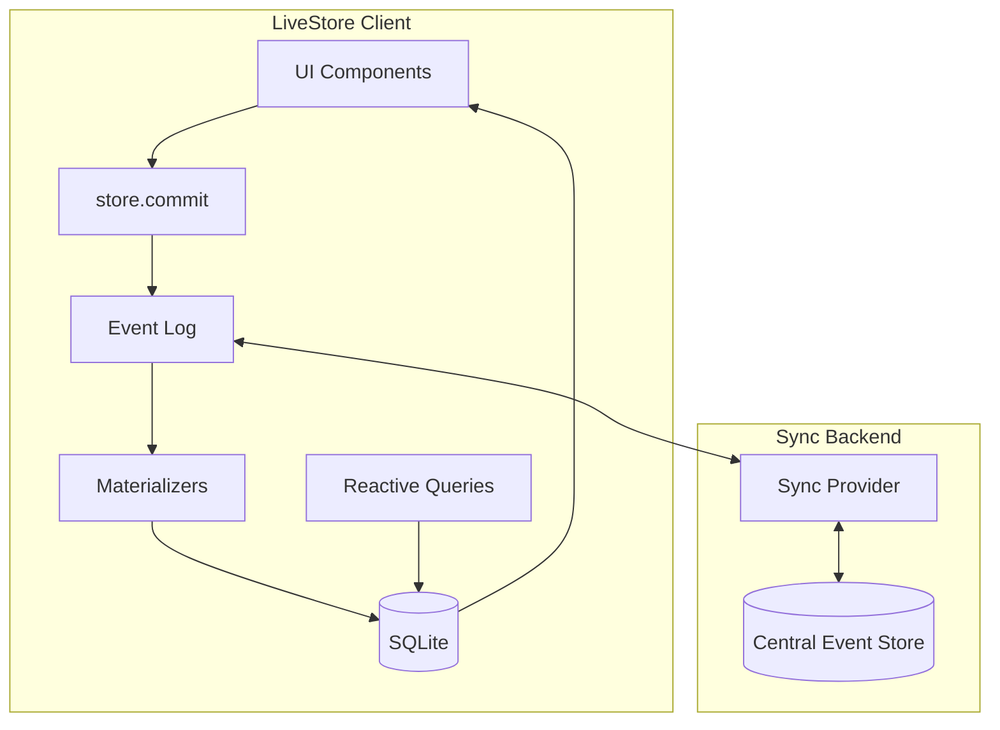

# LiveStore Evaluation for xNet

> Exploring whether LiveStore could replace or complement xNet's storage and sync layers

**Date:** January 2026  
**Status:** Exploration / Research

## Executive Summary

[LiveStore](https://livestore.dev) is a local-first state management framework based on reactive SQLite and event-sourcing with git-style syncing. This document evaluates whether xNet could adopt LiveStore for its storage and sync infrastructure.

**TL;DR:** LiveStore shares many philosophical similarities with xNet (event-sourcing, local-first, SQLite), but has fundamental incompatibilities with xNet's P2P security model. It could potentially be used for the structured data layer while keeping our existing Yjs-based rich text sync, but would require significant modifications to integrate our DID-based identity and UCAN authorization.

## What is LiveStore?

### Core Architecture



### Key Features

| Feature              | Description                                                                        |
| -------------------- | ---------------------------------------------------------------------------------- |
| **Event Sourcing**   | All changes are events; state is derived by replaying events through materializers |
| **Reactive SQLite**  | Local SQLite database that reactively updates when events are committed            |
| **Git-Style Sync**   | Push/pull model with rebasing for conflict resolution                              |
| **Cross-Platform**   | Web (IndexedDB/OPFS), Expo, Electron, Tauri, Node                                  |
| **Type-Safe Schema** | Effect Schema for event and state definitions                                      |
| **Devtools**         | Excellent debugging tools for inspecting events and state                          |

### Sync Model

LiveStore uses a **centralized sync backend** that:

1. Provides global ordering of events (total order via sequence numbers)
2. Handles push/pull synchronization
3. Requires events to be rebased before pushing
4. Supports pluggable backends (Cloudflare, ElectricSQL, S2)

```
Client A: [e1, e2, e3*] (* = pending)
                  ↓ pull
Server:   [e1, e2, e4, e5]
                  ↓ rebase e3 on top of e5
Client A: [e1, e2, e4, e5, e3']
                  ↓ push
Server:   [e1, e2, e4, e5, e3']
```

## Comparison with xNet Architecture

### Similarities ✅

| Aspect                     | LiveStore        | xNet                      | Notes                                    |
| -------------------------- | ---------------- | ------------------------- | ---------------------------------------- |
| **Event Sourcing**         | Yes              | Yes (for structured data) | Both use append-only event logs          |
| **Local-First**            | Yes              | Yes                       | Data works offline, syncs when connected |
| **SQLite Storage**         | Yes              | Yes                       | Both use SQLite for persistence          |
| **Lamport-Style Ordering** | Sequence numbers | Lamport timestamps        | Both provide total ordering              |
| **Code-First Schema**      | Effect Schema    | `defineSchema()`          | Both infer types from code               |
| **Materializers**          | Event → SQL      | Change → Node state       | Same pattern, different implementations  |

### Fundamental Differences ❌

| Aspect            | LiveStore               | xNet               | Conflict                                            |
| ----------------- | ----------------------- | ------------------ | --------------------------------------------------- |
| **Sync Topology** | Client ↔ Central Server | P2P (WebRTC)       | **Major** - LiveStore requires a central authority  |
| **Identity**      | None built-in           | DID:key            | LiveStore has no identity model                     |
| **Authorization** | None built-in           | UCAN tokens        | No capability-based security                        |
| **Signing**       | None                    | Ed25519 signatures | Events aren't cryptographically signed              |
| **Rich Text**     | No CRDT support         | Yjs integration    | LiveStore doesn't handle collaborative text editing |
| **P2P Discovery** | N/A (server-based)      | Signaling + WebRTC | Completely different networking model               |

## Integration Analysis

### Scenario 1: Replace Everything with LiveStore

**Verdict: Not Feasible ❌**

LiveStore's sync model fundamentally requires a central authority to:

- Assign global sequence numbers
- Accept/reject pushes based on ordering
- Serve as the source of truth

This conflicts with xNet's P2P architecture where:

- Peers sync directly without a central server
- Changes are signed by the author's DID
- Authorization is verified via UCAN chains
- No single point of failure

### Scenario 2: Use LiveStore for Structured Data Only

**Verdict: Possible but Complex ⚠️**

We could potentially use LiveStore for the NodeStore layer (databases, tasks, etc.) while keeping:

- Yjs for rich text (documents)
- Our own P2P sync for blob storage
- Our identity/authorization layer

**Required Modifications:**

1. **Custom Sync Provider**: Build a P2P sync provider that:
   - Replaces centralized sequence numbers with Lamport timestamps
   - Verifies DID signatures on events
   - Checks UCAN authorization before accepting events
   - Routes sync through WebRTC instead of HTTP

2. **Event Signing**: Wrap LiveStore events in our Change<T> structure:

   ```typescript
   // LiveStore event
   { name: 'TodoCreated', args: { id, title } }

   // Wrapped for xNet
   {
     id: 'change-xyz',
     type: 'livestore-event',
     payload: { name: 'TodoCreated', args: { id, title } },
     hash: 'cid:blake3:...',
     parentHash: 'cid:blake3:...',
     authorDID: 'did:key:z6Mk...',
     signature: Uint8Array,
     lamport: { time: 42, author: 'did:key:z6Mk...' }
   }
   ```

3. **Schema Mapping**: Map between Effect Schema (LiveStore) and our property builders:

   ```typescript
   // LiveStore
   Schema.Struct({ title: Schema.String })

   // xNet
   text({ required: true })
   ```

**Effort Estimate:** 4-6 weeks of integration work, ongoing maintenance burden.

### Scenario 3: Learn from LiveStore, Keep Our Stack

**Verdict: Recommended ✅**

LiveStore validates many of xNet's architectural decisions. We can adopt specific patterns without taking on the full dependency:

#### Patterns to Adopt

1. **Materializer Pattern**

   LiveStore's explicit event → SQL mapping is cleaner than our current approach:

   ```typescript
   // LiveStore style (adopt this)
   const materializers = {
     TaskCreated: ({ id, title }) => tables.tasks.insert({ id, title, completed: false }),
     TaskCompleted: ({ id }) => tables.tasks.update({ completed: true }).where({ id })
   }
   ```

2. **Reactive Query System**

   LiveStore's `queryDb()` with automatic reactivity is excellent:

   ```typescript
   const tasks$ = queryDb((get) => tables.tasks.where({ deletedAt: null }))
   // Automatically re-runs when relevant data changes
   ```

3. **Devtools Approach**

   LiveStore's devtools (event inspector, state viewer, time-travel) could inspire xNet devtools.

4. **Effect Schema Integration**

   Consider Effect Schema as an alternative to our property builders for better validation and serialization.

#### What We Already Do Better

| Feature             | xNet Advantage                              |
| ------------------- | ------------------------------------------- |
| **P2P Sync**        | True decentralization, no central server    |
| **Identity**        | DID-based identity with cryptographic proof |
| **Authorization**   | UCAN delegation chains                      |
| **Rich Text**       | Yjs CRDT with character-level merging       |
| **Blob Storage**    | Content-addressed with chunking             |
| **Offline Signing** | Changes are author-signed offline           |

## Security Model Incompatibility

The most significant issue is that **LiveStore has no security model**. The sync backend is trusted to:

- Accept any event from any client
- Enforce ordering (can reorder/reject events)
- Store and serve the authoritative event log

In xNet's threat model:

- Peers don't trust each other
- Every change must be signed
- Authorization is verified cryptographically
- No single entity can censor or reorder events

### LiveStore's Encryption Pattern

LiveStore's [encryption documentation](https://docs.livestore.dev/patterns/encryption/) states:

> LiveStore doesn't yet support encryption but might in the future. For now you can implement encryption yourself e.g. by encrypting the events using a custom Effect Schema definition.

This means:

- Events are stored in plaintext on the sync backend
- No end-to-end encryption out of the box
- The sync provider operator can read all data

xNet's approach (encrypted at rest, signed changes) would need to be bolted on top, defeating much of the simplicity benefits.

## P2P Sync: The Core Problem

LiveStore explicitly states in their docs:

> **What LiveStore doesn't do:**
>
> - Doesn't support peer-to-peer/decentralized syncing

Their sync model requires:

1. A central authority for global ordering
2. Push/pull with the server (not peer-to-peer)
3. Server-side conflict resolution (rebasing)

This is fundamentally incompatible with xNet's goals:

- User-owned data
- No reliance on any infrastructure
- Works in mesh networks without internet

### Could We Build a P2P Sync Provider?

Theoretically yes, but it would require:

1. Replacing sequence numbers with CRDTs or Lamport timestamps
2. Distributed consensus for total ordering (expensive)
3. Re-implementing most of LiveStore's sync logic

At that point, we're not really using LiveStore's sync anymore—just the local SQLite reactivity.

## Recommendation

### Short Term: Don't Adopt LiveStore

The integration effort outweighs the benefits given:

- Fundamental sync model incompatibility
- No built-in security/identity
- We'd need to modify core assumptions
- Maintenance burden of a fork

### Medium Term: Adopt Specific Patterns

1. **Improve our materializer pattern** based on LiveStore's design
2. **Add better devtools** inspired by LiveStore's approach
3. **Consider Effect Schema** for validation/serialization
4. **Enhance query reactivity** to match LiveStore's DX

### Long Term: Watch for Evolution

LiveStore is early (v0.3 beta). If they add:

- P2P sync support
- Pluggable identity layer
- Event signing/encryption

Then re-evaluate. The team is thoughtful and the architecture is clean.

## Appendix: Technology Comparison

| Feature          | LiveStore       | xNet Current             | xNet + LiveStore (Hypothetical) |
| ---------------- | --------------- | ------------------------ | ------------------------------- |
| Event Storage    | SQLite eventlog | IndexedDB/SQLite changes | LiveStore eventlog              |
| State Derivation | Materializers   | NodeStore + LWW          | Materializers                   |
| Reactive Queries | `queryDb()`     | `useQuery()` hooks       | `queryDb()`                     |
| Rich Text        | Not supported   | Yjs CRDT                 | Yjs (keep existing)             |
| Sync Protocol    | HTTP push/pull  | WebRTC + y-webrtc        | Custom P2P provider             |
| Identity         | None            | DID:key                  | Custom layer on top             |
| Authorization    | None            | UCAN                     | Custom layer on top             |
| Encryption       | DIY             | XChaCha20-Poly1305       | DIY                             |
| Blob Storage     | Not supported   | BlobStore + chunking     | Keep existing                   |

## References

- [LiveStore Documentation](https://docs.livestore.dev)
- [LiveStore GitHub](https://github.com/livestorejs/livestore)
- [LiveStore Syncing](https://docs.livestore.dev/reference/syncing/)
- [When to Use LiveStore](https://docs.livestore.dev/evaluation/when-livestore/)
- [xNet TRADEOFFS.md](./TRADEOFFS.md) - Our architectural decisions
- [Riffle Research](https://riffle.systems) - Academic foundation for LiveStore

---

_This exploration document was created to evaluate LiveStore as a potential technology adoption. The recommendation is to learn from LiveStore's patterns rather than adopt it directly due to fundamental architectural incompatibilities with xNet's P2P security model._
