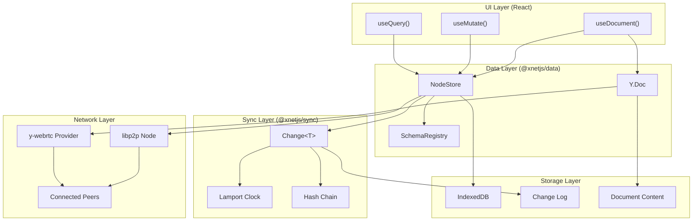
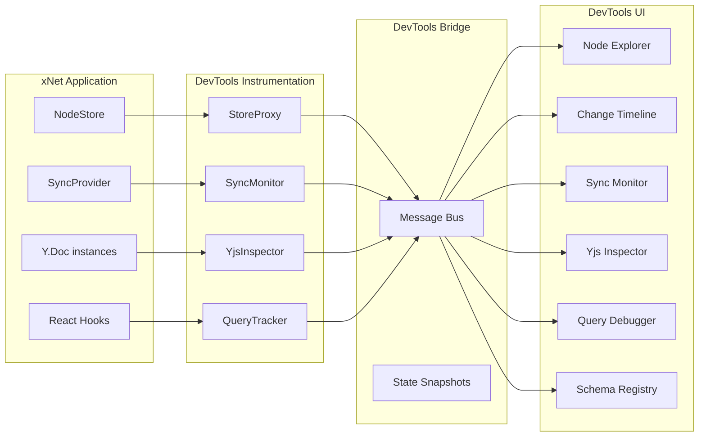
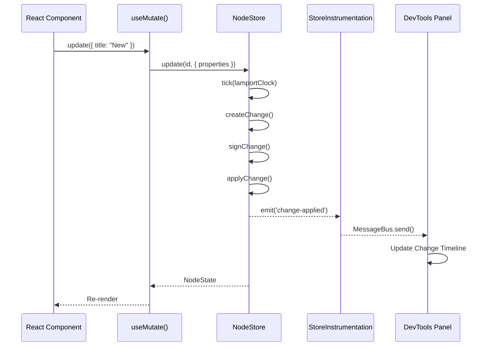
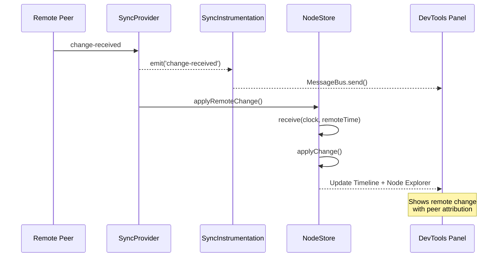
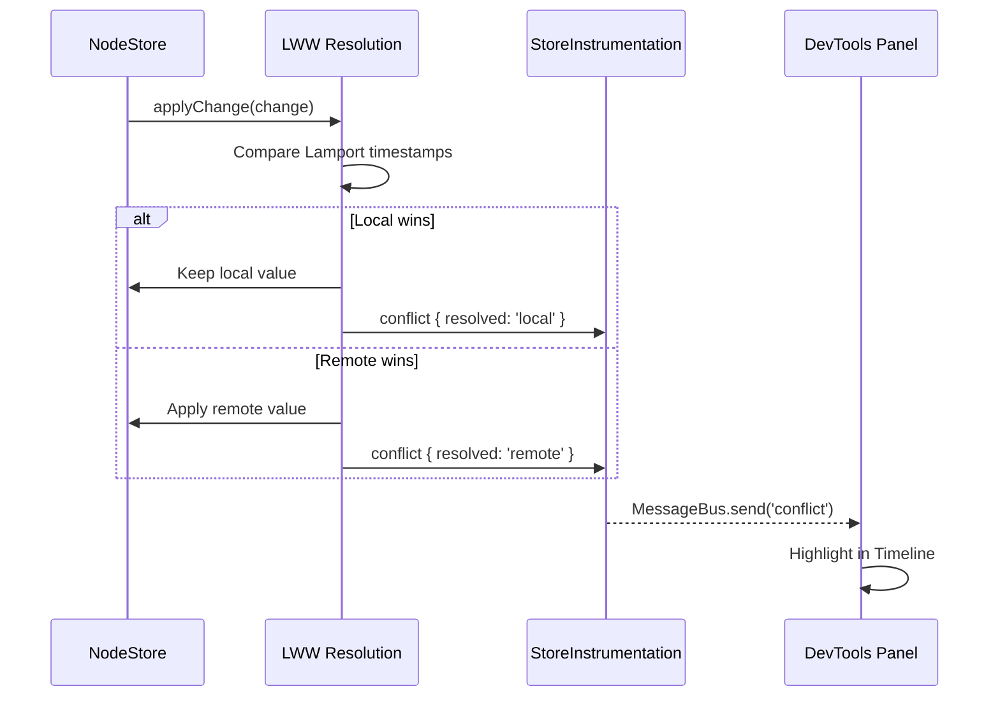

# xNet DevTools Design Document

> **Status**: ✅ IMPLEMENTED - The `@xnetjs/devtools` package is complete with 7 panels

## Implementation Status

The devtools package has been fully implemented at `packages/devtools/`:

- [x] **Core Infrastructure** - DevToolsProvider, event bus, instrumentation
- [x] **Node Explorer** - Browse and inspect all nodes (`panels/NodeExplorer/`)
- [x] **Change Timeline** - Visualize event-sourced changes (`panels/ChangeTimeline/`)
- [x] **Yjs Inspector** - Inspect Y.Doc state and sync (`panels/YjsInspector/`)
- [x] **Sync Monitor** - Monitor P2P connections (`panels/SyncMonitor/`)
- [x] **Query Debugger** - Monitor reactive queries (`panels/QueryDebugger/`)
- [x] **Schema Registry** - View registered schemas (`panels/SchemaRegistry/`)
- [x] **Instrumentation** - Store, sync, query, Yjs instrumentation

Additional panels beyond original design:

- [x] Security Panel - View identity and security info
- [x] Telemetry Panel - Performance metrics
- [x] History Panel - Undo/redo history
- [x] Version Panel - Version compatibility info
- [x] Migration Wizard - Schema migration tools

---

## Original Design

This document proposes **xNet DevTools** - a comprehensive debugging and inspection toolkit for xNet applications. Inspired by LiveStore's devtools but adapted for xNet's unique P2P, CRDT-based architecture, these tools will help developers understand data flow, debug sync issues, and optimize performance in local-first applications.

---

## 1. Research: LiveStore DevTools

### 1.1 Features Analysis

LiveStore devtools provide:

| Feature                    | Description                      | xNet Equivalent Need                  |
| -------------------------- | -------------------------------- | ------------------------------------- |
| **Real-time Data Browser** | 2-way sync view of SQLite tables | Node Explorer with live updates       |
| **Query Inspector**        | Monitor reactive queries         | Query/Subscription debugger           |
| **Eventlog Browser**       | View event history with args     | Change Timeline with Lamport ordering |
| **Sync Status**            | Connection state visualization   | P2P Sync Monitor                      |
| **Export/Import**          | Data portability                 | Snapshot management                   |
| **Reactivity Graph**       | Signal dependency visualization  | React hook dependency graph           |
| **SQLite Playground**      | Run SQL queries                  | Query builder / search                |

### 1.2 Key Differences from xNet

| Aspect                  | LiveStore                            | xNet                           |
| ----------------------- | ------------------------------------ | ------------------------------ |
| **Sync Model**          | Client-server (Cloudflare, Electric) | P2P via libp2p/y-webrtc        |
| **Storage**             | SQLite + eventlog                    | IndexedDB + Change log + Yjs   |
| **Text Editing**        | External (pattern docs)              | Built-in Yjs CRDT              |
| **Conflict Resolution** | Materializers                        | LWW (Lamport) + Yjs CRDT merge |
| **Identity**            | Session-based                        | DID-based with signatures      |

---

## 2. xNet Architecture Analysis

### 2.1 Data Flow



### 2.2 Key Components to Instrument

1. **NodeStore** (`packages/data/src/store/store.ts:48-676`)
   - CRUD operations create signed Changes
   - LWW conflict resolution with timestamps
   - Subscription system for reactive updates
   - Tracks merge conflicts

2. **Change<T>** (`packages/sync/src/change.ts:26-74`)
   - Unique ID, type, payload
   - Hash chain (parentHash linkage)
   - Lamport timestamps for ordering
   - Ed25519 signatures
   - Batch support for transactions

3. **Y.Doc** (`packages/data/src/document.ts`)
   - Rich text via Yjs CRDT
   - Metadata in Y.Map
   - State vectors for sync

4. **SyncProvider** (`packages/sync/src/provider.ts:61-132`)
   - Status: disconnected/connecting/synced/syncing/error
   - Peer info with connection times
   - Event emitters for changes

5. **SchemaRegistry** (`packages/data/src/schema/registry.ts:28-152`)
   - Runtime schema lookup
   - Built-in vs custom schemas
   - Lazy loading

---

## 3. xNet DevTools Architecture

### 3.1 High-Level Design



### 3.2 Delivery Options

| Option                | Pros                          | Cons                               | Recommendation      |
| --------------------- | ----------------------------- | ---------------------------------- | ------------------- |
| **Embedded Panel**    | Zero setup, always available  | Increases bundle size              | **Primary for dev** |
| **Browser Extension** | Separate from app, persistent | Requires install, Chrome-only      | Future enhancement  |
| **Separate App**      | Full-featured, multi-tab      | Requires running, connection setup | For advanced use    |
| **Expo Plugin**       | Mobile support                | Expo-specific                      | For mobile dev      |

**Recommendation**: Start with **embedded panel** (toggleable via keyboard shortcut or floating button), similar to React Query DevTools. Can be tree-shaken in production.

---

## 4. Feature Specifications

### 4.1 Node Explorer

**Purpose**: Browse and inspect all Nodes in the store.

```
┌─────────────────────────────────────────────────────────────────┐
│ Node Explorer                                        [Filter ▼] │
├─────────────────────────────────────────────────────────────────┤
│ Schema: All ▼  │ Search: [________________]  │ Show deleted ☐  │
├─────────────────────────────────────────────────────────────────┤
│ ▼ Page (3)                                                      │
│   ├─ abc123  "Getting Started"        Updated: 2 min ago       │
│   ├─ def456  "Architecture Notes"     Updated: 1 hour ago      │
│   └─ ghi789  "Meeting Notes"          Updated: yesterday       │
│ ▼ Task (5)                                                      │
│   ├─ task001 "Fix sync bug"  status: todo    Updated: 5 min    │
│   └─ ...                                                        │
├─────────────────────────────────────────────────────────────────┤
│ Selected: abc123                                                │
│ ┌─────────────────────────────────────────────────────────────┐ │
│ │ Schema: xnet://xnet.dev/Page                                │ │
│ │ Created: 2024-01-15 10:30 by did:key:z6Mk...               │ │
│ │ Updated: 2024-01-15 14:22 by did:key:z6Mk...               │ │
│ │                                                             │ │
│ │ Properties:                                                 │ │
│ │   title: "Getting Started"  [L:42]                         │ │
│ │   icon: "📚"                [L:41]                         │ │
│ │   archived: false           [L:40]                         │ │
│ │                                                             │ │
│ │ [View Changes] [View Document] [Export]                    │ │
│ └─────────────────────────────────────────────────────────────┘ │
└─────────────────────────────────────────────────────────────────┘
```

**Data Source**:

- `NodeStore.list()` for node listing
- `NodeStore.get(id)` for details
- `NodeStore.subscribe()` for live updates

**Features**:

- Group by schema
- Filter by schema, search text
- Show/hide deleted nodes
- Property viewer with Lamport timestamps (`[L:42]`)
- Edit properties inline (dev mode only)
- Navigate to Change Timeline for specific node

### 4.2 Change Timeline

**Purpose**: Visualize event-sourced changes with causal ordering.

```
┌─────────────────────────────────────────────────────────────────┐
│ Change Timeline                              [Filter ▼] [Pause]│
├─────────────────────────────────────────────────────────────────┤
│ Node: All ▼  │ Type: All ▼  │ Author: All ▼  │ Time: Last hour │
├─────────────────────────────────────────────────────────────────┤
│                                                                 │
│  L:45 ─●─ node-change  abc123  { title: "Updated Title" }      │
│         │ Author: did:key:z6Mk...  Batch: batch-abc-123 (1/2)  │
│         │ Hash: cid:blake3:a1b2...  Parent: cid:blake3:9f8e... │
│         │                                                       │
│  L:44 ─●─ node-change  abc123  { archived: false }             │
│         │ Author: did:key:z6Mk...  Batch: batch-abc-123 (2/2)  │
│         │                                                       │
│  L:43 ─●─ node-change  task001 { status: "done" }              │
│    ├────● [CONFLICT] Remote won (L:43 > L:42)                  │
│    │     Local: "in-progress" (L:42)                           │
│         │                                                       │
│  L:42 ─●─ node-change  abc123  { title: "Getting Started" }    │
│         │                                                       │
│  L:41 ─●─ node-change  abc123  (create) Page                   │
│         │ Properties: { title: "Untitled", icon: "📄" }        │
│                                                                 │
├─────────────────────────────────────────────────────────────────┤
│ Selected Change Details:                                        │
│ ┌─────────────────────────────────────────────────────────────┐ │
│ │ ID: m1abc-xyz                                               │ │
│ │ Type: node-change                                           │ │
│ │ Lamport: { time: 45, nodeId: "did:key:z6Mk..." }           │ │
│ │ Wall Time: 2024-01-15 14:22:33.456                         │ │
│ │ Signature: ✓ Verified                                       │ │
│ │ Hash Chain: ✓ Valid                                         │ │
│ │                                                             │ │
│ │ Payload (JSON):                                             │ │
│ │ {                                                           │ │
│ │   "nodeId": "abc123",                                       │ │
│ │   "properties": { "title": "Updated Title" }                │ │
│ │ }                                                           │ │
│ │                                                             │ │
│ │ [Replay to Here] [Export Change] [View in Graph]           │ │
│ └─────────────────────────────────────────────────────────────┘ │
└─────────────────────────────────────────────────────────────────┘
```

**Data Source**:

- `NodeStore.getAllChanges()`
- `NodeStore.getChanges(nodeId)`
- `NodeStore.getRecentConflicts()`
- `NodeStore.subscribe()` for live updates

**Features**:

- Chronological view sorted by Lamport timestamp
- Filter by node, type, author, time range
- Batch grouping (transaction visualization)
- Conflict highlighting with resolution info
- Hash chain visualization
- Signature verification status
- **Time-travel debugging**: Replay state to any point

### 4.3 Yjs Inspector

**Purpose**: Inspect Yjs document state and sync.

```
┌─────────────────────────────────────────────────────────────────┐
│ Yjs Inspector                                   [Select Doc ▼] │
├─────────────────────────────────────────────────────────────────┤
│ Document: abc123 (Page: "Getting Started")                      │
│ Client ID: 1234567890  │  State Vector: 3 entries               │
├─────────────────────────────────────────────────────────────────┤
│                                                                 │
│ ▼ Y.Map: meta (3 entries)                                       │
│   ├─ _schemaId: "xnet://xnet.dev/Page"                         │
│   ├─ title: "Getting Started"                                   │
│   └─ icon: "📚"                                                 │
│                                                                 │
│ ▼ Y.XmlFragment: content (12 elements)                          │
│   ├─ <paragraph> "Welcome to xNet..."                          │
│   ├─ <heading level="2"> "Features"                            │
│   ├─ <paragraph> "Local-first..."                              │
│   └─ ...                                                        │
│                                                                 │
│ ▼ Undo Manager                                                  │
│   ├─ Undo Stack: 5 items                                        │
│   ├─ Redo Stack: 0 items                                        │
│   └─ [Undo] [Redo] [Clear]                                     │
│                                                                 │
├─────────────────────────────────────────────────────────────────┤
│ State Vector:                                                   │
│ ┌───────────────┬──────────┐                                    │
│ │ Client ID     │ Clock    │                                    │
│ ├───────────────┼──────────┤                                    │
│ │ 1234567890    │ 42       │  (local)                          │
│ │ 9876543210    │ 38       │                                    │
│ │ 5555555555    │ 15       │                                    │
│ └───────────────┴──────────┘                                    │
│                                                                 │
│ Encoded Size: 2.3 KB  │  [Export State] [Import State]         │
└─────────────────────────────────────────────────────────────────┘
```

**Data Source**:

- `Y.Doc` instances from `useDocument`
- `Y.encodeStateVector()`
- `Y.UndoManager`

**Features**:

- Tree view of Y.Doc structure (Maps, Arrays, XmlFragments)
- State vector inspection
- Undo/redo stack visibility
- Manual undo/redo controls
- Export/import document state
- Size metrics

### 4.4 Sync Monitor

**Purpose**: Monitor P2P connections and sync status.

```
┌─────────────────────────────────────────────────────────────────┐
│ Sync Monitor                                        [Refresh]  │
├─────────────────────────────────────────────────────────────────┤
│                                                                 │
│ Local Identity                                                  │
│ ┌─────────────────────────────────────────────────────────────┐ │
│ │ DID: did:key:z6MkhaXgBZD...vYbRg                           │ │
│ │ Public Key: [Copy]                                          │ │
│ │ Lamport Time: 45                                            │ │
│ └─────────────────────────────────────────────────────────────┘ │
│                                                                 │
│ Connection Status: ● Connected (3 peers)                        │
│                                                                 │
│ ▼ y-webrtc (Room: xnet-doc-abc123)                              │
│   │ Status: ● Connected                                         │
│   │ Signaling: ws://localhost:4444                             │
│   │                                                             │
│   │ Peers:                                                      │
│   │ ├─ peer-1  ● Connected  Latency: 12ms   Since: 5 min ago   │
│   │ ├─ peer-2  ● Connected  Latency: 45ms   Since: 2 min ago   │
│   │ └─ peer-3  ○ Connecting...                                 │
│                                                                 │
│ ▼ Sync Events (live)                                            │
│   │ 14:22:33 ← Received change from peer-1 (L:44)              │
│   │ 14:22:30 → Broadcast change (L:45)                         │
│   │ 14:22:28 ← Received change from peer-2 (L:43)              │
│   │ 14:22:25 ✓ Sync complete with peer-1                       │
│                                                                 │
├─────────────────────────────────────────────────────────────────┤
│ Pending Changes: 0  │  Last Sync: 2 sec ago                     │
│ [Force Sync] [Disconnect] [Clear Events]                        │
└─────────────────────────────────────────────────────────────────┘
```

**Data Source**:

- `SyncProvider.status`
- `SyncProvider.peerInfo`
- `SyncProvider` events: `status-change`, `change-received`, `peer-connected`
- `WebrtcProvider` from y-webrtc

**Features**:

- Local identity display
- Connection status with peer list
- Per-peer latency and connection duration
- Live event log
- Manual sync controls
- Signaling server status

### 4.5 Query Debugger

**Purpose**: Monitor reactive queries and subscriptions.

```
┌─────────────────────────────────────────────────────────────────┐
│ Query Debugger                                    [Clear Stats] │
├─────────────────────────────────────────────────────────────────┤
│                                                                 │
│ Active Subscriptions: 4                                         │
│                                                                 │
│ ┌─────────────────────────────────────────────────────────────┐ │
│ │ #1 useQuery(TaskSchema)                                     │ │
│ │    Component: TaskList (src/components/TaskList.tsx:15)     │ │
│ │    Filter: { where: { status: "todo" } }                    │ │
│ │    Results: 12 nodes                                        │ │
│ │    Updates: 5 (last: 30 sec ago)                           │ │
│ │    Render time: 2.3ms avg                                   │ │
│ └─────────────────────────────────────────────────────────────┘ │
│                                                                 │
│ ┌─────────────────────────────────────────────────────────────┐ │
│ │ #2 useQuery(PageSchema, "abc123")                           │ │
│ │    Component: PageView (src/pages/PageView.tsx:42)          │ │
│ │    Mode: Single node                                        │ │
│ │    Result: { title: "Getting Started", ... }                │ │
│ │    Updates: 2 (last: 5 min ago)                            │ │
│ └─────────────────────────────────────────────────────────────┘ │
│                                                                 │
│ ┌─────────────────────────────────────────────────────────────┐ │
│ │ #3 useDocument(PageSchema, "abc123")                        │ │
│ │    Component: Editor (src/components/Editor.tsx:28)         │ │
│ │    Y.Doc updates: 42                                        │ │
│ │    Sync status: connected (2 peers)                         │ │
│ │    Dirty: false                                             │ │
│ └─────────────────────────────────────────────────────────────┘ │
│                                                                 │
├─────────────────────────────────────────────────────────────────┤
│ Performance Summary:                                            │
│ Total queries: 4  │  Total updates: 49  │  Avg render: 1.8ms   │
└─────────────────────────────────────────────────────────────────┘
```

**Data Source**:

- Custom instrumentation in `useQuery`, `useMutate`, `useDocument`
- React DevTools integration (optional)

**Features**:

- List all active subscriptions
- Show component source location
- Track update frequency
- Performance metrics (render time)
- Filter visualization
- Result preview

### 4.6 Schema Registry

**Purpose**: View registered schemas and their definitions.

```
┌─────────────────────────────────────────────────────────────────┐
│ Schema Registry                                    [Refresh]    │
├─────────────────────────────────────────────────────────────────┤
│                                                                 │
│ Built-in Schemas (4)                                            │
│ ├─ xnet://xnet.dev/Page         ● Loaded                       │
│ ├─ xnet://xnet.dev/Database     ○ Not loaded                   │
│ ├─ xnet://xnet.dev/Task         ● Loaded                       │
│ └─ xnet://xnet.dev/Canvas       ○ Not loaded                   │
│                                                                 │
│ Custom Schemas (2)                                              │
│ ├─ xnet://myapp.com/Recipe      ● Registered                   │
│ └─ xnet://myapp.com/Ingredient  ● Registered                   │
│                                                                 │
├─────────────────────────────────────────────────────────────────┤
│ Selected: xnet://xnet.dev/Task                                  │
│ ┌─────────────────────────────────────────────────────────────┐ │
│ │ IRI: xnet://xnet.dev/Task                                   │ │
│ │ Label: Task                                                 │ │
│ │ Document: none                                              │ │
│ │                                                             │ │
│ │ Properties:                                                 │ │
│ │ ┌──────────────┬──────────────┬──────────────────────────┐ │ │
│ │ │ Name         │ Type         │ Options                  │ │ │
│ │ ├──────────────┼──────────────┼──────────────────────────┤ │ │
│ │ │ title        │ text         │ required                 │ │ │
│ │ │ status       │ select       │ todo, in-progress, done  │ │ │
│ │ │ dueDate      │ date         │ optional                 │ │ │
│ │ │ assignee     │ person       │ optional                 │ │ │
│ │ │ priority     │ number       │ min: 1, max: 5          │ │ │
│ │ └──────────────┴──────────────┴──────────────────────────┘ │ │
│ │                                                             │ │
│ │ Nodes using this schema: 5                                  │ │
│ │ [View Nodes] [Export Schema]                               │ │
│ └─────────────────────────────────────────────────────────────┘ │
└─────────────────────────────────────────────────────────────────┘
```

**Data Source**:

- `SchemaRegistry.getAllIRIs()`
- `SchemaRegistry.get(iri)`
- `NodeStore.list({ schemaId })`

**Features**:

- List built-in and custom schemas
- Show loaded/registered status
- Property definitions with types
- Link to nodes using each schema
- Schema export

---

## 5. Technical Implementation

### 5.1 Package Structure

```
packages/devtools/
├── src/
│   ├── index.ts              # Main exports
│   ├── DevToolsPanel.tsx     # Main UI component
│   │
│   ├── instrumentation/
│   │   ├── StoreInstrumentation.ts
│   │   ├── SyncInstrumentation.ts
│   │   ├── YjsInstrumentation.ts
│   │   └── QueryInstrumentation.ts
│   │
│   ├── bridge/
│   │   ├── MessageBus.ts     # Cross-context communication
│   │   └── StateSnapshot.ts  # Serialization
│   │
│   ├── panels/
│   │   ├── NodeExplorer/
│   │   ├── ChangeTimeline/
│   │   ├── YjsInspector/
│   │   ├── SyncMonitor/
│   │   ├── QueryDebugger/
│   │   └── SchemaRegistry/
│   │
│   ├── hooks/
│   │   └── useDevTools.ts    # Hook for app integration
│   │
│   └── utils/
│       ├── formatters.ts     # Data formatting
│       └── timers.ts         # Performance tracking
│
├── package.json
└── tsconfig.json
```

### 5.2 Instrumentation Layer

```typescript
// StoreInstrumentation.ts
import type { NodeStore, NodeChange, NodeState, MergeConflict } from '@xnetjs/data'

export interface StoreInstrumentationEvents {
  'change-created': (change: NodeChange) => void
  'change-applied': (change: NodeChange, node: NodeState | null) => void
  'conflict-detected': (conflict: MergeConflict) => void
  'node-updated': (node: NodeState) => void
}

export function instrumentStore(store: NodeStore): () => void {
  // Wrap store methods to emit events
  const originalCreate = store.create.bind(store)
  const originalUpdate = store.update.bind(store)
  const originalDelete = store.delete.bind(store)
  const originalApplyRemoteChange = store.applyRemoteChange.bind(store)

  // Subscribe to store events
  const unsubscribe = store.subscribe((event) => {
    emit('change-applied', event.change, event.node)
    if (event.node) {
      emit('node-updated', event.node)
    }
  })

  // Track conflicts
  const conflictInterval = setInterval(() => {
    const conflicts = store.getRecentConflicts()
    conflicts.forEach((c) => emit('conflict-detected', c))
  }, 1000)

  return () => {
    unsubscribe()
    clearInterval(conflictInterval)
    // Restore original methods if needed
  }
}
```

### 5.3 Message Bus (for Extension Support)

```typescript
// MessageBus.ts
export interface DevToolsMessage {
  type: 'INIT' | 'STATE_UPDATE' | 'CHANGE' | 'SYNC_EVENT' | 'QUERY_EVENT'
  payload: unknown
  timestamp: number
  source: 'app' | 'devtools'
}

export class DevToolsMessageBus {
  private listeners = new Map<string, Set<Function>>()
  private channel: BroadcastChannel | null = null

  constructor(private channelName = 'xnet-devtools') {
    if (typeof BroadcastChannel !== 'undefined') {
      this.channel = new BroadcastChannel(channelName)
      this.channel.onmessage = (event) => this.handleMessage(event.data)
    }
  }

  send(message: Omit<DevToolsMessage, 'timestamp'>) {
    const fullMessage: DevToolsMessage = {
      ...message,
      timestamp: Date.now()
    }
    this.channel?.postMessage(fullMessage)
    this.emit(message.type, message.payload)
  }

  on(type: string, listener: Function) {
    if (!this.listeners.has(type)) {
      this.listeners.set(type, new Set())
    }
    this.listeners.get(type)!.add(listener)
  }

  private emit(type: string, payload: unknown) {
    this.listeners.get(type)?.forEach((fn) => fn(payload))
  }

  private handleMessage(message: DevToolsMessage) {
    this.emit(message.type, message.payload)
  }
}
```

### 5.4 React Integration

```tsx
// DevToolsProvider.tsx
import { createContext, useContext, useEffect, useState } from 'react'
import type { NodeStore } from '@xnetjs/data'
import { instrumentStore } from './instrumentation/StoreInstrumentation'
import { DevToolsPanel } from './DevToolsPanel'

interface DevToolsContextValue {
  isOpen: boolean
  toggle: () => void
  store: NodeStore | null
}

const DevToolsContext = createContext<DevToolsContextValue | null>(null)

export function DevToolsProvider({
  children,
  store,
  defaultOpen = false
}: {
  children: React.ReactNode
  store: NodeStore
  defaultOpen?: boolean
}) {
  const [isOpen, setIsOpen] = useState(defaultOpen)

  useEffect(() => {
    if (process.env.NODE_ENV === 'development') {
      const cleanup = instrumentStore(store)
      return cleanup
    }
  }, [store])

  // Keyboard shortcut: Ctrl/Cmd + Shift + D
  useEffect(() => {
    const handler = (e: KeyboardEvent) => {
      if ((e.ctrlKey || e.metaKey) && e.shiftKey && e.key === 'd') {
        e.preventDefault()
        setIsOpen((prev) => !prev)
      }
    }
    window.addEventListener('keydown', handler)
    return () => window.removeEventListener('keydown', handler)
  }, [])

  return (
    <DevToolsContext.Provider value={{ isOpen, toggle: () => setIsOpen(!isOpen), store }}>
      {children}
      {isOpen && <DevToolsPanel />}
    </DevToolsContext.Provider>
  )
}

export function useDevTools() {
  const ctx = useContext(DevToolsContext)
  if (!ctx) throw new Error('useDevTools must be used within DevToolsProvider')
  return ctx
}
```

### 5.5 Time-Travel Debugging

```typescript
// TimeTravel.ts
import type { NodeStore, NodeChange } from '@xnetjs/data'

export class TimeTravelDebugger {
  private changes: NodeChange[] = []
  private currentIndex: number = -1
  private snapshotStore: Map<string, unknown> = new Map()

  constructor(private store: NodeStore) {
    this.loadChanges()
  }

  private async loadChanges() {
    this.changes = await this.store.getAllChanges()
    // Sort by Lamport timestamp
    this.changes.sort((a, b) => a.lamport.time - b.lamport.time)
    this.currentIndex = this.changes.length - 1
  }

  async goToChange(changeId: string): Promise<void> {
    const index = this.changes.findIndex((c) => c.id === changeId)
    if (index === -1) return

    // Replay changes from start to index
    // This requires a fresh store instance or reset capability
    // For now, we compute the state without modifying the real store

    const state = this.computeStateAtIndex(index)
    this.currentIndex = index

    // Emit event for UI to display computed state
    this.emit('state-computed', state)
  }

  private computeStateAtIndex(index: number): Map<string, unknown> {
    const state = new Map<string, Record<string, unknown>>()

    for (let i = 0; i <= index; i++) {
      const change = this.changes[i]
      const { nodeId, properties, schemaId, deleted } = change.payload

      let node = state.get(nodeId) || { id: nodeId, schemaId, properties: {} }

      if (deleted !== undefined) {
        node.deleted = deleted
      }

      // Apply properties with LWW (simplified - real impl needs timestamp comparison)
      node.properties = { ...node.properties, ...properties }
      state.set(nodeId, node)
    }

    return state
  }

  get canGoBack(): boolean {
    return this.currentIndex > 0
  }

  get canGoForward(): boolean {
    return this.currentIndex < this.changes.length - 1
  }
}
```

---

## 6. Data Flow Diagrams

### 6.1 Change Creation Flow



### 6.2 Sync Event Flow



### 6.3 Conflict Resolution Flow



---

## 7. Implementation Roadmap

### Phase 1: Core Infrastructure (Week 1-2)

- [ ] Create `@xnetjs/devtools` package
- [ ] Implement MessageBus for communication
- [ ] Build StoreInstrumentation
- [ ] Create basic DevToolsPanel shell

### Phase 2: Node Explorer (Week 2-3)

- [ ] Node listing with schema grouping
- [ ] Property viewer with timestamps
- [ ] Search and filter
- [ ] Live updates via subscription

### Phase 3: Change Timeline (Week 3-4)

- [ ] Change list with Lamport ordering
- [ ] Batch/transaction grouping
- [ ] Conflict highlighting
- [ ] Basic time-travel (view state at point)

### Phase 4: Sync Monitor (Week 4-5)

- [ ] SyncProvider instrumentation
- [ ] Peer list with status
- [ ] Event log
- [ ] y-webrtc integration

### Phase 5: Yjs Inspector (Week 5-6)

- [ ] Y.Doc structure viewer
- [ ] State vector display
- [ ] Undo manager integration
- [ ] Export/import

### Phase 6: Query Debugger & Schema Registry (Week 6-7)

- [ ] Query instrumentation in hooks
- [ ] Subscription tracking
- [ ] Schema registry viewer
- [ ] Performance metrics

### Phase 7: Polish & Documentation (Week 7-8)

- [ ] Keyboard shortcuts
- [ ] Responsive layout
- [ ] Documentation
- [ ] Example integration

---

## 8. API Reference

### 8.1 DevToolsProvider

```tsx
import { DevToolsProvider } from '@xnetjs/devtools'

function App() {
  return (
    <NodeStoreProvider store={store}>
      <DevToolsProvider
        defaultOpen={false}
        position="bottom" // or "right", "floating"
        height={300}
      >
        <YourApp />
      </DevToolsProvider>
    </NodeStoreProvider>
  )
}
```

### 8.2 useDevTools Hook

```tsx
import { useDevTools } from '@xnetjs/devtools'

function DebugButton() {
  const { isOpen, toggle } = useDevTools()
  return <button onClick={toggle}>{isOpen ? 'Close' : 'Open'} DevTools</button>
}
```

### 8.3 Programmatic API

```typescript
import { devtools } from '@xnetjs/devtools'

// Manually log a custom event
devtools.log('custom-event', { data: 'something' })

// Take a snapshot
const snapshot = await devtools.snapshot()

// Export all data
const exported = await devtools.export()
```

---

## 9. Future Enhancements

1. **Browser Extension**: Chrome/Firefox extension for persistent devtools
2. **Network Graph**: Visualize P2P topology
3. **Performance Profiler**: Track render times, query performance
4. **Diff Viewer**: Side-by-side comparison of node states
5. **AI Assistant**: Natural language queries about data state
6. **Remote Debugging**: Connect to mobile apps via network
7. **Replay Recording**: Record and replay sessions for bug reports

---

## 10. Appendix: Comparison with Alternatives

| Feature             | xNet DevTools | React Query DT | Redux DT | LiveStore DT |
| ------------------- | ------------- | -------------- | -------- | ------------ |
| Event sourcing view | ✓             | -              | ✓        | ✓            |
| CRDT inspection     | ✓             | -              | -        | -            |
| P2P sync monitoring | ✓             | -              | -        | -            |
| Time travel         | ✓             | -              | ✓        | -            |
| Schema registry     | ✓             | -              | -        | ✓            |
| Embedded panel      | ✓             | ✓              | -        | ✓            |
| Browser extension   | Future        | -              | ✓        | ✓            |
