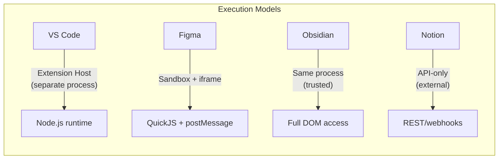
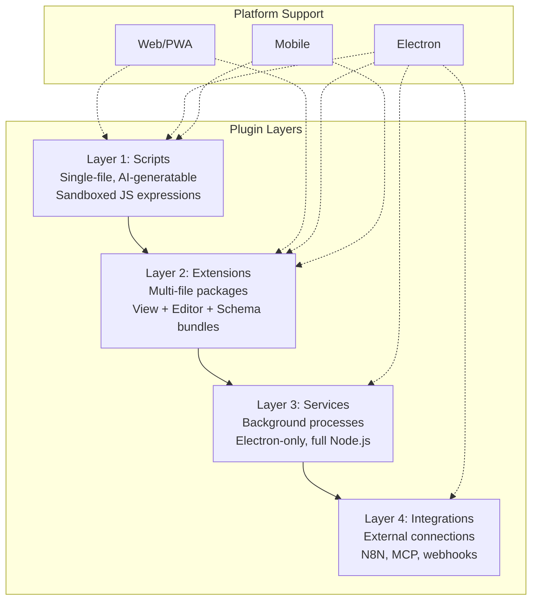
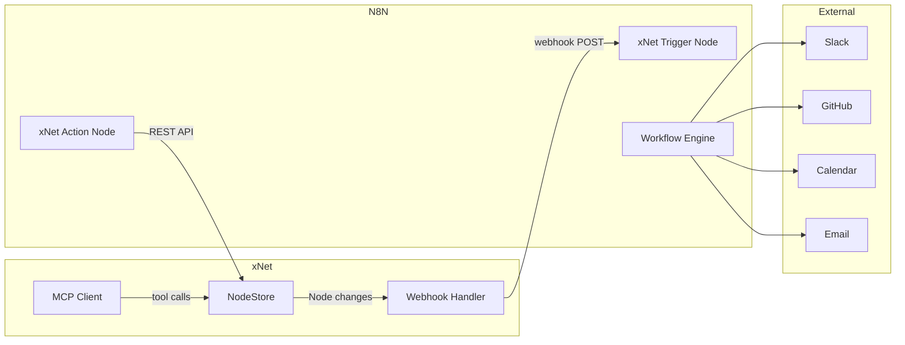
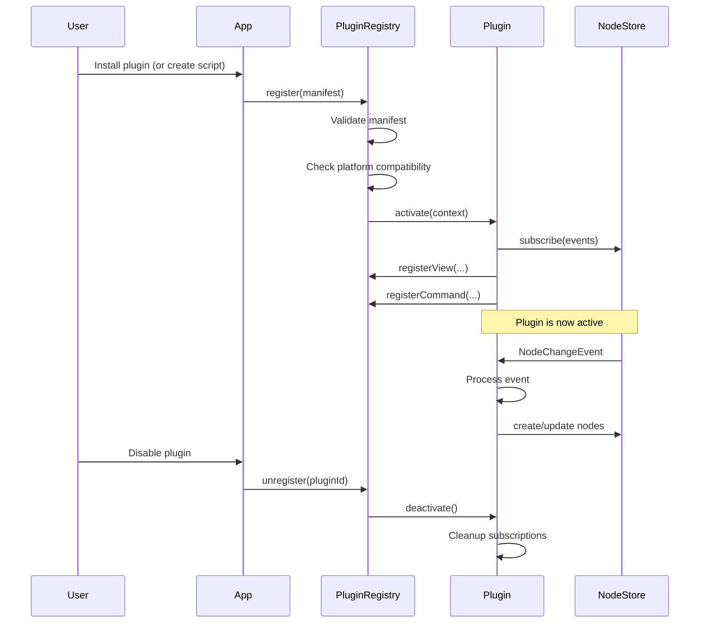
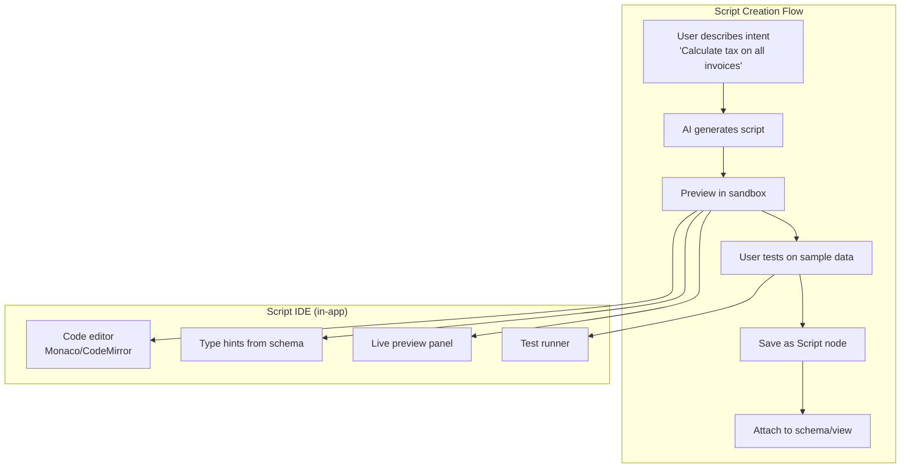
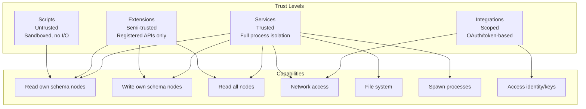
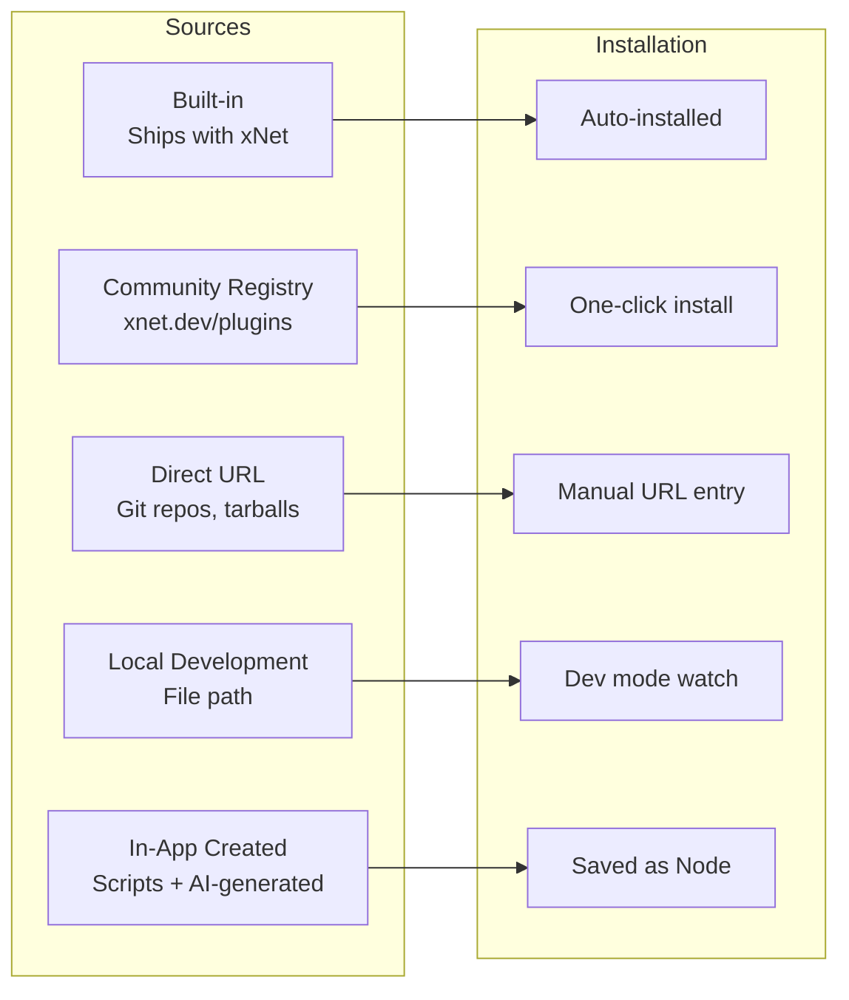
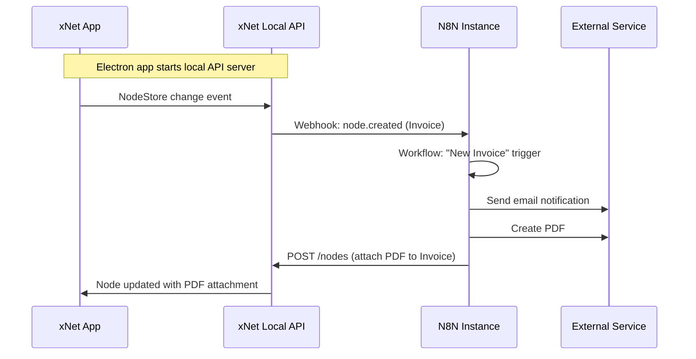
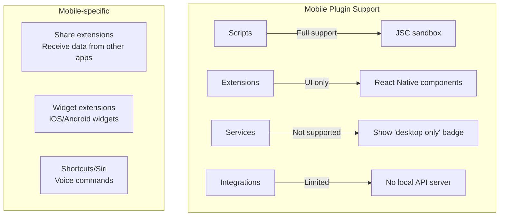
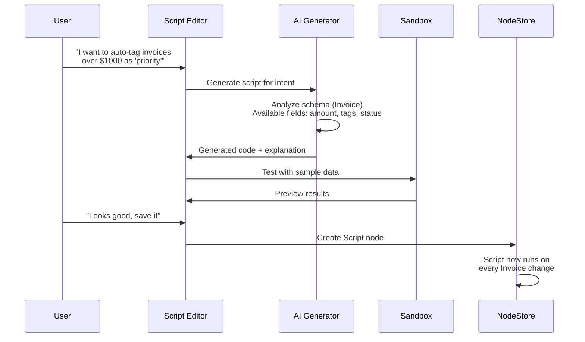

# Plugin Architecture Exploration

> **Status**: ✅ IMPLEMENTED - The `@xnet/plugins` package provides the full plugin system

## Implementation Status

The plugin architecture has been implemented at `packages/plugins/`:

- [x] **Plugin Registry** - `registry.ts` with install/uninstall/enable/disable
- [x] **Extension Context** - `context.ts` providing store, schema, UI registration
- [x] **Contributions System** - `contributions.ts` for views, commands, etc.
- [x] **Script Sandbox** - `sandbox/` with AST validation and secure execution
- [x] **Script Schema** - `schemas/script.ts` for storing scripts as nodes
- [x] **AI Script Generator** - `ai/generator.ts` with prompt templates
- [x] **MCP Server** - `services/mcp-server.ts` exposing xNet as MCP tools
- [x] **Local API** - `services/local-api.ts` REST API for external tools
- [x] **Process Manager** - `services/process-manager.ts` for background services
- [x] **Webhook Emitter** - `services/webhook-emitter.ts` for N8N integration
- [x] **Plugin Schema** - `schemas/plugin.ts` for storing plugins as nodes
- [x] **Middleware** - `middleware.ts` for NodeStore hooks

---

## Original Design

This document explores how xNet can support a plugin/extension system that works across all platforms (Electron, Web/PWA, Mobile) while enabling users—including non-developers—to extend functionality through custom views, editor extensions, automations, and integrations.

The goal is an architecture where:

- Plugins are easy to build (ideally just a single file for simple cases)
- Users can prototype and create plugins directly in the UI
- AI can generate plugins on behalf of users
- The same plugin runs everywhere (with graceful capability degradation)
- Deep integration is possible for power users (background processes, custom protocols)

---

## Prior Art Comparison



| Feature        | VS Code              | Figma                      | Obsidian            | Notion       |
| -------------- | -------------------- | -------------------------- | ------------------- | ------------ |
| Execution      | Separate process     | Sandboxed main + iframe UI | Same process        | External API |
| Language       | TypeScript/JS        | TypeScript/JS              | TypeScript/JS       | Any          |
| UI Access      | Webview panels       | iframe with postMessage    | Direct DOM          | Blocks API   |
| Security       | Process isolation    | QuickJS sandbox            | Trust-based         | OAuth scopes |
| Offline        | Yes                  | Partial                    | Yes                 | No           |
| Performance    | Excellent (isolated) | Good (sandbox)             | Risky (main thread) | N/A          |
| Complexity     | High (APIs galore)   | Medium                     | Low (full access)   | Low (REST)   |
| AI-generatable | Hard (complex APIs)  | Medium                     | Easy                | Easy         |

### Key Takeaways

- **Figma's model** is the best fit for web/mobile: sandboxed execution with message-passing to UI. Secure but still powerful.
- **Obsidian's model** is the best fit for developer experience: full access, easy to build, but only works in trusted environments.
- **VS Code's model** is the best for the Electron app: separate processes for heavy workloads.
- **Notion's model** (external API + webhooks) maps to our N8N integration strategy.

---

## Proposed Architecture: Layered Plugin System



### Layer 1: Scripts (All Platforms)

Simple, single-expression or single-function plugins. Think "Excel formulas but for your data pipeline." These are the ones AI generates for users.

**Examples:**

- "Calculate total from line items"
- "Format phone numbers as (xxx) xxx-xxxx"
- "When status changes to 'Done', set completedAt to now"
- "Color-code rows where amount > 1000"

**Execution:** Evaluated in a restricted JS sandbox (no DOM, no network, no imports). Pure functions over node data.

```typescript
// Script manifest (stored as a Node with ScriptSchema)
interface Script {
  id: string
  name: string
  trigger: ScriptTrigger // when does it run?
  code: string // the JS expression/function body
  inputSchema?: SchemaIRI // what type of nodes it operates on
  outputType?: 'value' | 'mutation' | 'decoration'
}

type ScriptTrigger =
  | { type: 'manual' } // user clicks "Run"
  | { type: 'onChange'; property?: string } // reactive
  | { type: 'onView' } // decorates view output
  | { type: 'scheduled'; cron: string } // periodic (Electron only)

// Example: A computed column script
const script: Script = {
  id: 'total-calculator',
  name: 'Calculate Line Total',
  trigger: { type: 'onChange', property: 'quantity' },
  code: `(node) => node.quantity * node.unitPrice`,
  inputSchema: 'xnet://xnet.dev/LineItem',
  outputType: 'value'
}
```

**Sandbox API surface exposed to scripts:**

```typescript
interface ScriptContext {
  node: FlatNode // current node (read-only)
  nodes: (schema: string) => FlatNode[] // query sibling nodes
  now: () => number // current timestamp
  format: FormatHelpers // date, number, string formatting
  math: MathHelpers // aggregations, rounding
  // NO: fetch, DOM, imports, global mutation
}
```

### Layer 2: Extensions (All Platforms)

Full plugin packages that can contribute views, editor extensions, schemas, property handlers, and UI components. This is the primary plugin layer.

**Execution:** Runs in the main thread (like Obsidian) but through a controlled registration API. Extensions are npm packages or local folders.

```typescript
// Extension manifest
interface XNetExtension {
  id: string // e.g., 'com.example.kanban-pro'
  name: string
  version: string
  xnetVersion: string // minimum xNet version
  platforms?: Platform[] // ['web', 'electron', 'mobile'] (default: all)

  // What this extension contributes
  contributes?: {
    schemas?: SchemaContribution[]
    views?: ViewContribution[]
    editorExtensions?: EditorContribution[]
    propertyHandlers?: PropertyHandlerContribution[]
    blocks?: BlockContribution[]
    commands?: CommandContribution[]
    settings?: SettingContribution[]
    sidebarItems?: SidebarContribution[]
    slashCommands?: SlashCommandContribution[]
    themes?: ThemeContribution[]
  }

  // Lifecycle
  activate?(ctx: ExtensionContext): void | Promise<void>
  deactivate?(): void | Promise<void>
}
```

**Extension Context (what extensions receive):**

```typescript
interface ExtensionContext {
  // Data access
  store: NodeStore // read/write nodes
  query: <T>(schema: SchemaIRI, filter?: Filter) => FlatNode<T>[]
  subscribe: (schema: SchemaIRI, cb: NodeChangeListener) => Unsubscribe

  // Schema
  registerSchema: (schema: DefinedSchema) => void

  // UI registration
  registerView: (view: ViewRegistration) => Disposable
  registerPropertyHandler: (handler: PropertyHandler) => Disposable
  registerCommand: (command: Command) => Disposable
  registerSidebarItem: (item: SidebarItem) => Disposable

  // Editor
  registerEditorExtension: (ext: TipTapExtension) => Disposable
  registerSlashCommand: (cmd: SlashCommand) => Disposable
  registerBlockType: (block: BlockDefinition) => Disposable

  // Storage (extension-private)
  storage: ExtensionStorage // key-value store scoped to this extension

  // Platform
  platform: 'web' | 'electron' | 'mobile'
  capabilities: PlatformCapabilities

  // Lifecycle
  subscriptions: Disposable[] // auto-disposed on deactivate
}
```

#### View Contributions

```typescript
interface ViewContribution {
  type: string // e.g., 'gantt', 'map', 'chart'
  name: string
  icon: string // icon name or SVG
  component: React.ComponentType<ViewProps>
  configSchema?: PropertyDefinition[] // view-specific settings
  supportedSchemas?: SchemaIRI[] // which node types this view works with
}

interface ViewProps {
  nodes: FlatNode[]
  schema: DefinedSchema
  viewConfig: ViewConfig
  onUpdateNode: (id: NodeId, updates: Partial<NodePayload>) => void
  onNavigate: (nodeId: NodeId) => void
}
```

#### Editor Contributions

```typescript
interface EditorContribution {
  // Standard TipTap extension
  extension: Extension | Node | Mark
  // Optional toolbar button
  toolbar?: {
    icon: string
    title: string
    isActive?: (editor: TipTapEditor) => boolean
  }
}

// Example: A Mermaid diagram block
const mermaidExtension: EditorContribution = {
  extension: Node.create({
    name: 'mermaid',
    group: 'block',
    atom: true,
    addAttributes: () => ({ code: { default: '' } }),
    parseHTML: () => [{ tag: 'div[data-mermaid]' }],
    renderHTML: ({ HTMLAttributes }) => ['div', { 'data-mermaid': '', ...HTMLAttributes }],
    addNodeView: () => ReactNodeViewRenderer(MermaidNodeView)
  }),
  toolbar: {
    icon: 'diagram',
    title: 'Insert Mermaid Diagram'
  }
}
```

#### Slash Commands

```typescript
interface SlashCommand {
  name: string // '/mermaid', '/table', '/ai'
  description: string
  icon?: string
  keywords?: string[] // for fuzzy search
  execute: (editor: TipTapEditor, range: Range) => void
}
```

### Layer 3: Services (Electron Only)

Long-running background processes for heavy computation, local AI, file watchers, local servers.

```typescript
interface ServicePlugin {
  id: string
  name: string
  platforms: ['electron'] // Electron only

  // Process configuration
  process: {
    command: string // executable or script path
    args?: string[]
    env?: Record<string, string>
    restart?: 'always' | 'on-failure' | 'never'
  }

  // Communication
  protocol: 'stdio' | 'ipc' | 'http' | 'websocket'
  port?: number // for http/websocket

  // What the service provides
  provides?: {
    mcp?: MCPServerConfig // exposes MCP tools
    search?: SearchProviderConfig // custom search backend
    sync?: SyncProviderConfig // custom sync transport
  }
}
```

**Use cases:**

- Local LLM inference (Ollama wrapper)
- File system watchers (import from folders)
- Custom sync relay servers
- PDF/image processing
- Database connectors (SQLite, PostgreSQL bridge)

### Layer 4: Integrations (Primarily Electron, some Web)

External system connections. N8N is the primary automation engine, but plugins can also define direct integrations.



#### N8N Integration (xNet as an N8N Node)

Rather than building xNet plugins for every service, we create **one N8N community node** that exposes xNet's data operations:

```typescript
// n8n-nodes-xnet (community node package)
// Trigger: fires on node changes
export class XNetTrigger implements INodeType {
  description: INodeTypeDescription = {
    displayName: 'xNet Trigger',
    name: 'xNetTrigger',
    group: ['trigger'],
    properties: [
      { name: 'schema', type: 'string', description: 'Schema IRI to watch' },
      { name: 'events', type: 'multiOptions', options: ['created', 'updated', 'deleted'] }
    ]
  }
}

// Action: CRUD operations on xNet nodes
export class XNetNode implements INodeType {
  description: INodeTypeDescription = {
    displayName: 'xNet',
    name: 'xNet',
    group: ['transform'],
    properties: [
      {
        name: 'operation',
        type: 'options',
        options: ['create', 'read', 'update', 'delete', 'query']
      },
      { name: 'schema', type: 'string' },
      { name: 'nodeId', type: 'string' },
      { name: 'data', type: 'json' }
    ]
  }
}
```

**Connection mechanism:** xNet exposes a local HTTP API (Electron) or uses the sync protocol to send/receive webhook-like events to a connected N8N instance.

#### MCP Integration

xNet can act as both an MCP client (consuming AI tools) and MCP server (exposing data to AI agents):

```typescript
// xNet as MCP Server - exposes node operations as tools
const xnetMCPServer: MCPServerConfig = {
  tools: [
    { name: 'xnet_query', description: 'Query nodes by schema and filter' },
    { name: 'xnet_create', description: 'Create a new node' },
    { name: 'xnet_update', description: 'Update node properties' },
    { name: 'xnet_search', description: 'Full-text search across all nodes' }
  ],
  resources: [
    { uri: 'xnet://nodes/{id}', description: 'Access a specific node' },
    { uri: 'xnet://schemas/{iri}', description: 'Get schema definition' }
  ]
}
```

---

## Plugin Lifecycle & Registration



### Plugin Registry Implementation

```typescript
class PluginRegistry {
  private plugins = new Map<string, RegisteredPlugin>()
  private contributions = new ContributionRegistry()

  async install(manifest: XNetExtension, source: PluginSource): Promise<void> {
    // 1. Validate manifest
    this.validateManifest(manifest)

    // 2. Check platform compatibility
    if (!this.isPlatformCompatible(manifest)) {
      throw new PluginError(`Plugin requires: ${manifest.platforms}`)
    }

    // 3. Store plugin metadata as a Node (plugins are data too!)
    await this.store.create(PluginSchema, {
      id: manifest.id,
      name: manifest.name,
      version: manifest.version,
      enabled: true,
      source: source
    })

    // 4. Activate
    await this.activate(manifest)
  }

  private async activate(manifest: XNetExtension): Promise<void> {
    const context = this.createContext(manifest.id)

    // Register static contributions
    if (manifest.contributes?.schemas) {
      for (const s of manifest.contributes.schemas) {
        schemaRegistry.register(s.schema)
      }
    }
    if (manifest.contributes?.views) {
      for (const v of manifest.contributes.views) {
        this.contributions.views.register(v.type, v)
      }
    }
    // ... other contributions

    // Call activate lifecycle
    if (manifest.activate) {
      await manifest.activate(context)
    }
  }
}
```

---

## The Script Editor: In-App Plugin Creation

The key differentiator for xNet is enabling non-developers to create plugins directly in the UI:



### UI Components for Script Creation

```typescript
// The script editor component
interface ScriptEditorProps {
  schema: DefinedSchema // context: what data is available
  initialCode?: string
  onSave: (script: Script) => void
}

// AI-assisted script generation
interface AIScriptRequest {
  intent: string // natural language description
  schema: DefinedSchema // available fields
  examples?: FlatNode[] // sample data for context
}

// The AI generates:
interface AIScriptResponse {
  code: string
  explanation: string
  testCases: { input: FlatNode; expectedOutput: unknown }[]
}
```

### Script Sandbox Implementation

```typescript
// Secure sandbox for script execution
class ScriptSandbox {
  private realm: ShadowRealm | QuickJS // platform-dependent

  constructor(private capabilities: SandboxCapabilities) {}

  async evaluate(code: string, context: ScriptContext): Promise<unknown> {
    // 1. Parse and validate AST (no imports, no globals, no async unless allowed)
    const ast = parse(code)
    this.validateAST(ast, this.capabilities)

    // 2. Execute in isolated context
    const fn = this.realm.evaluate(`(${code})`)

    // 3. Apply timeout
    const result = await withTimeout(
      fn(Object.freeze(context)),
      this.capabilities.timeoutMs ?? 1000
    )

    // 4. Validate output
    return this.sanitizeOutput(result)
  }
}
```

**Platform-specific sandboxes:**

| Platform            | Sandbox Technology                      | Limitations                  |
| ------------------- | --------------------------------------- | ---------------------------- |
| Web/PWA             | ShadowRealm (Stage 3) or iframe sandbox | No network, no DOM           |
| Electron (renderer) | Same as web                             | No network, no DOM           |
| Electron (main)     | Node.js `vm` module or QuickJS          | Full capabilities if Service |
| Mobile              | JavaScriptCore (React Native)           | No network, limited memory   |

---

## Extension Points Map (Current Codebase)

```mermaid
graph TB
    subgraph "@xnet/data"
        SR[SchemaRegistry<br/>register/unregister]
        BR[BlockRegistry<br/>registerBlockType]
        NS[NodeStore<br/>subscribe + middleware]
        SA[StorageAdapter<br/>interface]
    end

    subgraph "@xnet/editor"
        TE[TipTap Extensions<br/>Mark/Node/Extension.create]
        TB[Toolbar Items<br/>needs registry]
        SC[Slash Commands<br/>needs implementation]
        EE[Editor Events<br/>on change/selection/focus]
    end

    subgraph "@xnet/views"
        VR[View Registry<br/>needs creation]
        PH[PropertyHandlers<br/>needs registerFn]
        FO[Filter Operators<br/>needs extension]
    end

    subgraph "@xnet/query"
        SI[SearchIndex<br/>interface]
        QE[QueryEngine<br/>filter operators]
        FR[FederatedRouter<br/>data sources]
    end

    subgraph "@xnet/network"
        LP[libp2p Protocols<br/>handle()]
        SP[SyncProtocol<br/>message handlers]
        PD[Peer Discovery<br/>strategies]
    end

    subgraph "@xnet/react"
        XP[XNetProvider<br/>config.plugins]
        HC[Hook Composition<br/>useQuery/useMutate]
    end

    subgraph "Apps"
        ER[Electron: IPC + Menu + Processes]
        WR[Web: Routes + Sidebar + Layout]
        MR[Mobile: Screens + Navigation]
    end
```

### Readiness Assessment

| Extension Point          | Current State     | Work Needed                      | Priority |
| ------------------------ | ----------------- | -------------------------------- | -------- |
| Schema Registry          | Working           | Docs only                        | P0       |
| Block Registry           | Working           | Link to TipTap rendering         | P1       |
| NodeStore Subscribe      | Working           | Add middleware chain             | P1       |
| Storage Adapter          | Interface exists  | Docs only                        | P2       |
| Editor Extensions        | TipTap works      | Add `extensions` prop            | P0       |
| Slash Commands           | Not implemented   | Build suggestion plugin          | P1       |
| Toolbar Items            | Hardcoded         | Add registry/prop                | P2       |
| View Types               | Hardcoded union   | Build ViewRegistry               | P0       |
| Property Handlers        | Static object     | Add `registerPropertyHandler()`  | P1       |
| Filter Operators         | Fixed set         | Add operator registry            | P2       |
| Search Backends          | Lunr.js hardcoded | Abstract to interface            | P2       |
| Query Sources            | Local only        | Federated router                 | P3       |
| Network Protocols        | libp2p ready      | Docs + helpers                   | P2       |
| Plugin Provider          | Not exists        | Build `PluginRegistry` + context | P0       |
| IPC Extension (Electron) | Not exists        | Plugin IPC namespace             | P1       |
| Route Registration (Web) | File-based only   | Dynamic route addition           | P2       |
| Sidebar Items            | Hardcoded         | Slot registry                    | P1       |
| Background Services      | Not exists        | Process manager (Electron)       | P2       |
| Script Sandbox           | Not exists        | Build sandbox runtime            | P1       |

---

## Implementation Phases

### Phase 1: Foundation (Enable Extension Development)

Create the core `PluginRegistry` and make existing registries accessible:

```typescript
// packages/plugins/src/registry.ts
export class PluginRegistry {
  install(extension: XNetExtension): Promise<void>
  uninstall(pluginId: string): Promise<void>
  enable(pluginId: string): Promise<void>
  disable(pluginId: string): Promise<void>
  getAll(): RegisteredPlugin[]
  getContributions(type: ContributionType): Contribution[]
}

// packages/plugins/src/context.ts
export function createExtensionContext(
  pluginId: string,
  store: NodeStore,
  registry: PluginRegistry
): ExtensionContext
```

**Key changes to existing packages:**

1. `@xnet/editor` - Add `extensions` prop to `RichTextEditor`
2. `@xnet/views` - Add `registerViewType()` and `registerPropertyHandler()`
3. `@xnet/react` - Add `plugins` field to `XNetConfig`
4. `@xnet/data` - Add middleware hooks to `NodeStore`

### Phase 2: Script System (Enable End-User Customization)

1. Build script sandbox (ShadowRealm-based)
2. Create `ScriptSchema` for storing scripts as nodes
3. Build in-app script editor UI
4. Integrate AI script generation
5. Connect scripts to views (computed columns, conditional formatting)

### Phase 3: UI Extension Points

1. Slash command system for editor
2. Sidebar slot registry
3. Command palette (Ctrl+P / Cmd+K)
4. Settings panel registration
5. Custom view rendering

### Phase 4: Services & Integrations (Electron)

1. Process manager for background services
2. MCP server/client implementation
3. N8N community node package
4. Local HTTP API for external tool access

---

## Security Model



### Permission Model

```typescript
interface PluginPermissions {
  // Data access
  schemas: {
    read: SchemaIRI[] | '*' // which schemas can be read
    write: SchemaIRI[] | '*' // which schemas can be written
    create: SchemaIRI[] // which schemas can be instantiated
  }

  // Platform capabilities (must be declared in manifest)
  capabilities: {
    network?: boolean | string[] // domain allowlist
    storage?: 'local' | 'shared' // extension-private or shared
    clipboard?: boolean
    notifications?: boolean
    processes?: boolean // Electron only
    identity?: 'read' | 'sign' // access to DID/keys
  }
}
```

---

## Plugin Distribution



### Plugin as Data (P2P Distribution)

Since xNet is decentralized, plugins themselves can be stored as Nodes and synced via the P2P network:

```typescript
const PluginSchema = defineSchema({
  name: 'Plugin',
  namespace: 'xnet://xnet.dev/',
  properties: {
    name: text({ required: true }),
    version: text({ required: true }),
    author: person({}),
    description: text({}),
    source: text({ required: true }), // JS bundle or code
    manifest: text({ required: true }), // JSON manifest
    permissions: text({}), // declared permissions
    trusted: checkbox({ default: false }), // user has reviewed
    enabled: checkbox({ default: false })
  }
})
```

This means plugins can be shared between peers just like any other data. A user can create a script, and their collaborators automatically get it.

---

## Example Plugins

### Simple: Pomodoro Timer (Script)

```javascript
// Script: Shows time remaining, mutates node when timer completes
;(node, ctx) => {
  if (!node.timerStart) return null
  const elapsed = ctx.now() - node.timerStart
  const remaining = 25 * 60 * 1000 - elapsed
  if (remaining <= 0) {
    return { status: 'completed', completedAt: ctx.now() }
  }
  return { _decoration: `${Math.ceil(remaining / 60000)}m remaining` }
}
```

### Medium: Gantt Chart View (Extension)

```typescript
import { defineExtension, type ViewProps } from '@xnet/plugins'

export default defineExtension({
  id: 'com.xnet.gantt-view',
  name: 'Gantt Chart',
  version: '1.0.0',
  contributes: {
    views: [
      {
        type: 'gantt',
        name: 'Gantt Chart',
        icon: 'bar-chart-horizontal',
        component: GanttView,
        configSchema: [
          { name: 'startDateProperty', type: 'select', required: true },
          { name: 'endDateProperty', type: 'select', required: true },
          { name: 'groupByProperty', type: 'select' }
        ]
      }
    ]
  }
})

function GanttView({ nodes, viewConfig, onUpdateNode }: ViewProps) {
  // ... React component rendering a Gantt chart
  // Uses nodes' date properties to render timeline bars
  // Drag to resize updates node dates via onUpdateNode
}
```

### Complex: Local AI Assistant (Service + Extension)

```typescript
import { defineExtension } from '@xnet/plugins'

export default defineExtension({
  id: 'com.xnet.local-ai',
  name: 'Local AI Assistant',
  version: '1.0.0',
  platforms: ['electron'],

  contributes: {
    slashCommands: [
      {
        name: '/ai',
        description: 'Ask AI about your data',
        execute: async (editor, range, ctx) => {
          const prompt = editor.getText(range)
          const response = await ctx.services.call('local-ai', 'complete', { prompt })
          editor.insertContentAt(range, response.text)
        }
      }
    ],
    commands: [
      {
        id: 'ai.summarize',
        title: 'AI: Summarize Page',
        execute: async (ctx) => {
          const doc = ctx.activeDocument
          const summary = await ctx.services.call('local-ai', 'summarize', { text: doc.getText() })
          // Insert summary at top
        }
      }
    ]
  },

  services: [
    {
      id: 'local-ai',
      process: {
        command: 'ollama',
        args: ['serve'],
        restart: 'on-failure'
      },
      protocol: 'http',
      port: 11434,
      provides: {
        mcp: {
          tools: ['complete', 'summarize', 'embed']
        }
      }
    }
  ]
})
```

---

## N8N Integration Detail



### xNet Local API (for N8N + other tools)

```typescript
// Runs as a Service plugin on Electron
// Provides REST API for external tools

// GET /api/v1/nodes?schema=xnet://xnet.dev/Invoice&status=pending
// POST /api/v1/nodes { schema, properties }
// PATCH /api/v1/nodes/:id { properties }
// DELETE /api/v1/nodes/:id
// GET /api/v1/schemas
// POST /api/v1/query { schema, filter, sort, limit }
// WebSocket /api/v1/events (real-time node changes)
```

---

## Mobile Considerations



Mobile plugins have additional constraints:

- No background execution (iOS limits)
- No process spawning
- Limited memory for sandbox
- UI must use React Native components (not web-only HTML/CSS)

**Strategy:** Layer 1 (Scripts) works identically. Layer 2 (Extensions) work if they use the view abstraction layer (React components that work in both web and native). Layers 3-4 are Electron-only.

---

## AI-Generated Plugin Flow



The AI generation leverages:

1. **Schema context** - knows what fields/types are available
2. **Sample data** - can generate test cases
3. **Script API surface** - constrained to the sandbox API, so AI can't generate broken/dangerous code
4. **Validation** - AST-checked before saving, runs in sandbox before going live

---

## Open Questions

1. **Hot reloading** - Should extensions hot-reload during development? (Yes for DX, complex for state management)
2. **Extension marketplace** - Centralized registry vs. pure P2P distribution? (Start P2P, add registry later)
3. **Versioning** - How to handle breaking changes in the plugin API? (Semver on `xnetVersion` field)
4. **Multi-user permissions** - Can one user install a plugin that affects all collaborators? (Need per-workspace plugin settings)
5. **WASM plugins** - Should we support WASM for non-JS languages? (Future consideration, enables Rust/Go plugins)
6. **Plugin conflicts** - Two plugins registering the same slash command? (Last-registered wins with warning, user can configure priority)
7. **Computed columns vs scripts** - Are scripts the implementation of the planned `formula` property type? (Yes, scripts ARE formulas)

---

## Relationship to Existing Roadmap

| Roadmap Item          | Plugin Connection                                      |
| --------------------- | ------------------------------------------------------ |
| Formula property type | = Script (Layer 1) with `outputType: 'value'`          |
| Rollup property type  | = Script that aggregates related nodes                 |
| Canvas view           | = Built-in Extension (Layer 2)                         |
| ERP features          | = Extension packs (schemas + views + scripts)          |
| MCP integration       | = Service plugin (Layer 3) exposing xNet as MCP server |
| Federated search      | = Query source plugins in FederatedRouter              |
| Custom sync           | = Network protocol plugins via libp2p                  |

---

## Recommended Next Steps

1. **Create `packages/plugins/`** - Core plugin infrastructure (registry, context, lifecycle)
2. **Add `extensions` prop to RichTextEditor** - Minimal change, unlocks editor plugins immediately
3. **Build ViewRegistry** - Replace hardcoded view type mapping in apps
4. **Implement Script Sandbox** - ShadowRealm or iframe-based, enables AI-generated scripts
5. **Create `ScriptSchema`** - Store scripts as nodes (syncs with P2P!)
6. **Build in-app script editor** - Monaco/CodeMirror with schema-aware autocomplete
7. **N8N community node** - Separate repo, enables external automation immediately
