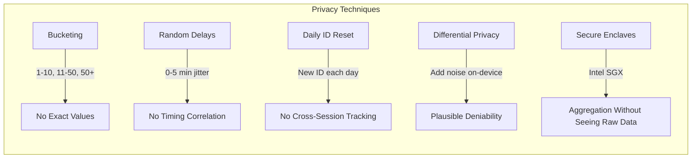
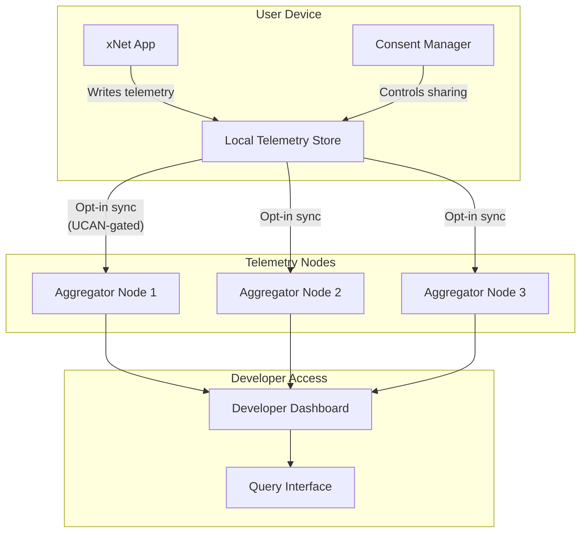
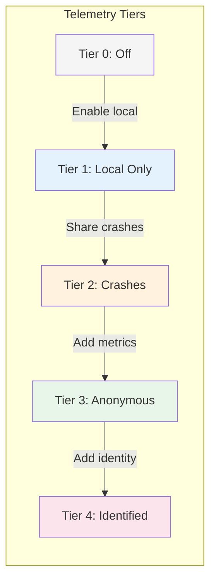
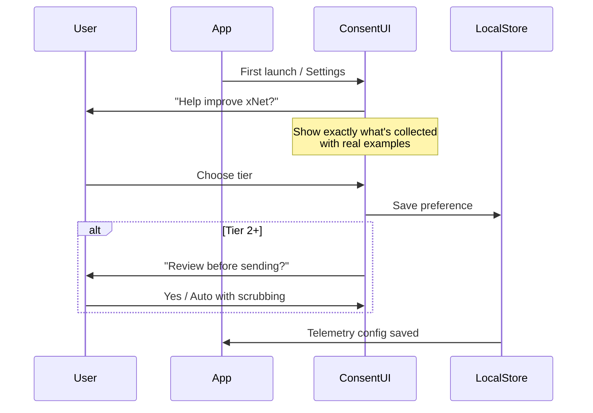
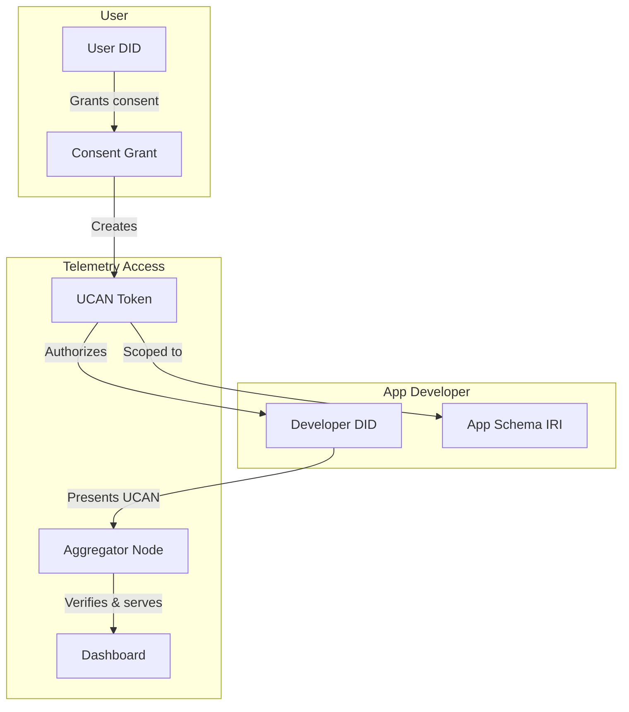
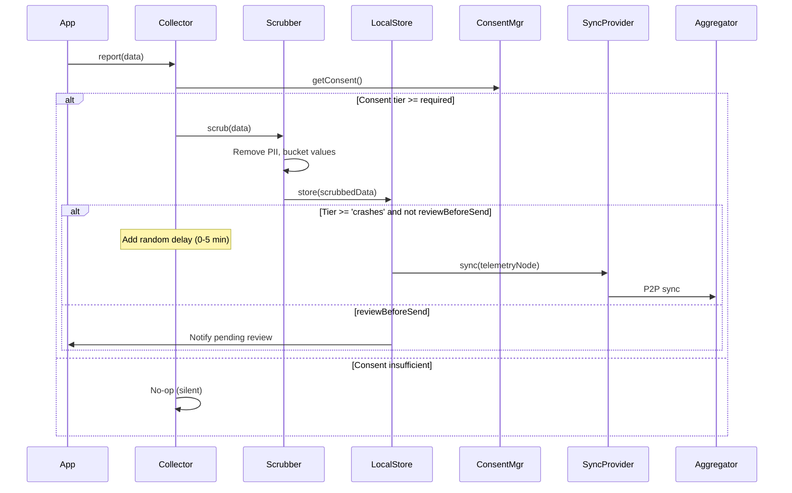
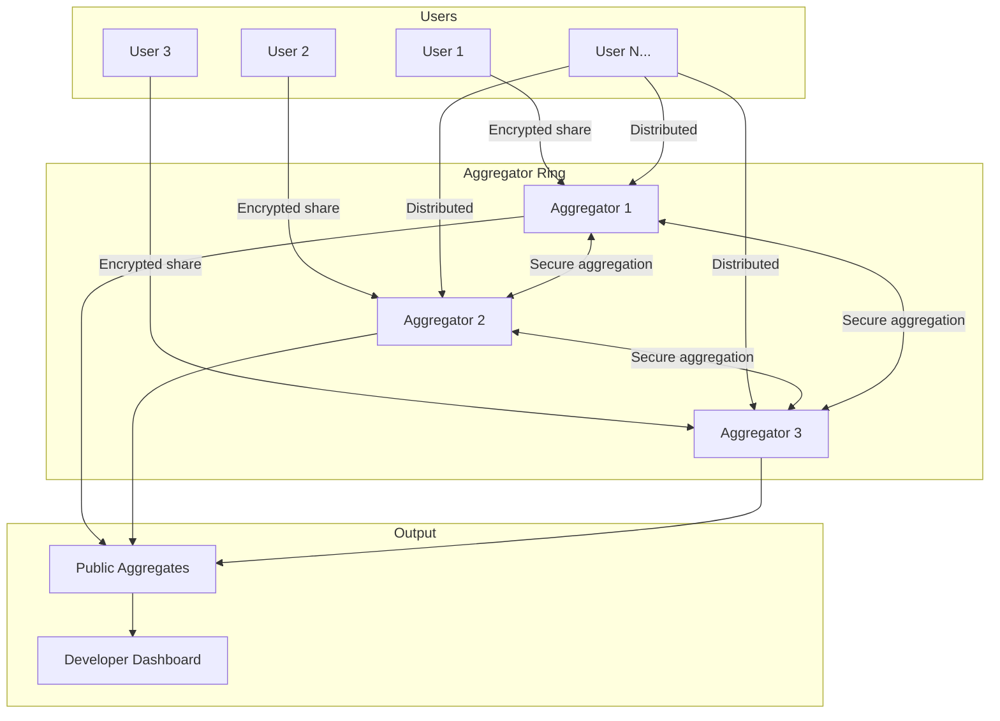
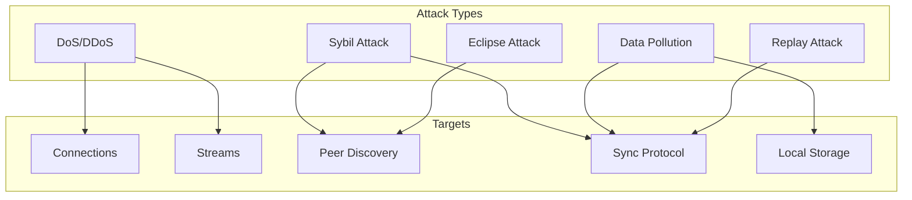
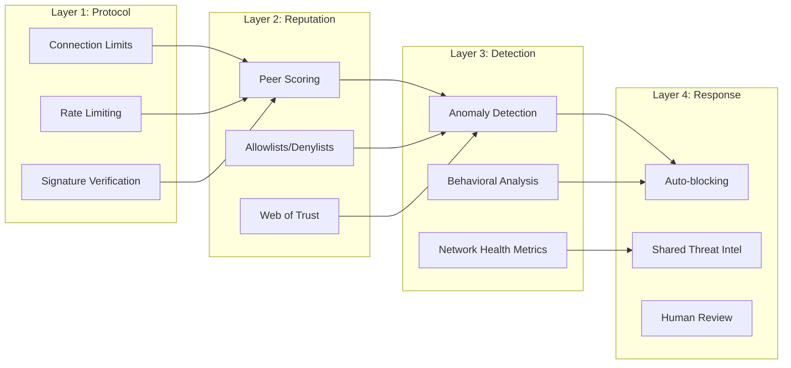

# xNet Telemetry & Logging Architecture

> Privacy-preserving observability for a decentralized system

**Status**: ✅ IMPLEMENTED - The `@xnet/telemetry` package provides privacy-preserving telemetry  
**Last Updated**: January 2026

## Implementation Status

The telemetry system has been implemented at `packages/telemetry/`:

- [x] **Consent Management** - `consent/manager.ts` with tiered opt-in
- [x] **Telemetry Schemas** - CrashReport, UsageMetric, SecurityEvent, PerformanceMetric
- [x] **Collection** - `collection/collector.ts` with consent-gated recording
- [x] **PII Scrubbing** - `collection/scrubbing.ts` removes identifiable info
- [x] **Bucketing** - `collection/bucketing.ts` for privacy-preserving ranges
- [x] **Random Timing** - `collection/timing.ts` adds jitter to prevent correlation
- [x] **Sync Provider** - `sync/provider.ts` for opt-in sharing with aggregators
- [x] **React Hooks** - `useTelemetry`, `useConsent` for component integration
- [x] **DevTools Panel** - TelemetryPanel in `@xnet/devtools`

---

---

## Executive Summary

xNet is a fully decentralized system where users own their data. Traditional telemetry approaches (send everything to a central server) are incompatible with this architecture. This document explores how to provide developers with meaningful insights while preserving user privacy and sovereignty.

**Key insight**: xNet already has the infrastructure for user-controlled, schema-defined, sync-enabled data. Telemetry can be "just another Node type" with special access controls.

---

## Table of Contents

1. [Design Principles](#design-principles)
2. [Industry Research](#industry-research)
3. [Proposed Architecture](#proposed-architecture)
4. [Telemetry Tiers](#telemetry-tiers)
5. [User Experience](#user-experience)
6. [Developer Access](#developer-access)
7. [Technical Implementation](#technical-implementation)
8. [Privacy Techniques](#privacy-techniques)
9. [Network Security & Attack Detection](#network-security--attack-detection)
10. [Open Questions](#open-questions)

---

## Design Principles

### Non-Negotiables

1. **User sovereignty** - Users explicitly opt-in, can see exactly what's shared, and can revoke at any time
2. **No silent collection** - Zero telemetry without explicit consent
3. **Local-first** - All telemetry stored locally first; sharing is a separate decision
4. **Inspectable schemas** - Users can view the exact schema of what's being collected
5. **Deletable** - Users can delete their telemetry data at any time
6. **No unique identifiers** - No persistent tracking across sessions/devices unless user opts in

### Goals

1. **For users**: Transparency, control, and the ability to help improve software they care about
2. **For xNet developers**: Understand feature adoption, identify crashes, improve performance
3. **For app developers**: Same benefits for apps built on xNet, with xNet-native tooling
4. **For open source**: Public aggregate dashboards for community projects

---

## Industry Research

### What Others Do

| System            | Approach                                                 | Privacy Level | Learnings                                            |
| ----------------- | -------------------------------------------------------- | ------------- | ---------------------------------------------------- |
| **Obsidian**      | Zero telemetry                                           | Maximum       | Proves viable; relies on forums/Discord for feedback |
| **Brave P3A**     | Bucketed answers, random timing, no identifiers          | Very High     | Best-in-class for "some data, maximum privacy"       |
| **VS Code**       | 4-level opt-in (off/crash/error/all), transparent schema | High          | Good UX for granular control                         |
| **Mozilla Glean** | Opt-out, public data dictionary                          | Medium        | Good documentation practices                         |
| **IPFS**          | No protocol-level telemetry, app-layer concern           | N/A           | Validates separation of concerns                     |
| **Sentry**        | beforeSend hooks, local scrubbing                        | Configurable  | Good for crash reports                               |

### Key Techniques



### Brave P3A Deep Dive

Brave's approach is particularly relevant:

1. **Multiple-choice only** - "How many tabs? 0-1 / 2-5 / 6-10 / 11-50 / 50+"
2. **One answer at a time** - Can't correlate answers to same user
3. **Random timing** - Answers sent with 0-5 minute random delay
4. **IP stripped at edge** - CDN removes IP before Brave sees it
5. **Public question list** - All metrics documented on GitHub wiki
6. **7-day retention** - Logs deleted, only aggregates kept
7. **Phase 2: Secure enclaves** - For correlated queries (did users who completed onboarding also import bookmarks?)

---

## Proposed Architecture

### The xNet Advantage

xNet already has:

- **Schemas** - Define exactly what fields exist
- **Nodes** - Universal data container
- **DIDs** - User identity
- **UCANs** - Delegated, revocable permissions
- **P2P Sync** - Decentralized data sharing

**Telemetry can leverage all of this.**



### Core Concept: Telemetry as Nodes

Field names are aligned with [OpenTelemetry semantic conventions](https://opentelemetry.io/docs/specs/semconv/) (Option C from [OPENTELEMETRY_EVALUATION.md](./OPENTELEMETRY_EVALUATION.md)). We use OTel's naming patterns without adopting its SDK or export pipeline.

```typescript
// Telemetry is just another schema — with OTel-aligned field names
const CrashReportSchema = defineSchema({
  name: 'CrashReport',
  namespace: 'xnet://xnet.dev/telemetry/',
  properties: {
    // OTel: exception.* conventions
    exceptionType: text({ required: true }), // exception.type
    exceptionMessage: text({ required: true }), // exception.message
    exceptionStacktrace: text({ scrubPaths: true }), // exception.stacktrace

    // OTel: code.*, service.*, os.*
    codeNamespace: text(), // code.namespace
    serviceVersion: text(), // service.version
    osType: select({ options: ['macos', 'windows', 'linux', 'ios', 'android', 'web'] as const }), // os.type

    // Timestamps (bucketed, not exact)
    occurredAt: date() // Rounded to nearest hour

    // Computed fields (not stored)
    // No: userId, deviceId, sessionId, IP address
  }
})

const UsageMetricSchema = defineSchema({
  name: 'UsageMetric',
  namespace: 'xnet://xnet.dev/telemetry/',
  properties: {
    // OTel metric naming: <namespace>.<noun>.<verb>
    metricName: text({ required: true }), // e.g., 'xnet.pages.created'
    metricBucket: select({
      options: ['none', '1-5', '6-20', '21-100', '100+'] as const,
      required: true
    }),
    period: select({ options: ['daily', 'weekly', 'monthly'] as const }),
    serviceVersion: text(), // OTel: service.version
    osType: select({ options: ['macos', 'windows', 'linux', 'ios', 'android', 'web'] as const }) // OTel: os.type
  }
})
```

---

## Telemetry Tiers

### Tier 0: Off (Default)

- Zero telemetry collected
- Zero telemetry shared
- App works fully offline with no degradation

### Tier 1: Local Only

- Telemetry collected and stored locally
- User can view their own telemetry
- Nothing shared externally
- Useful for personal debugging ("what crashed yesterday?")

### Tier 2: Crash Reports

- Local collection + opt-in sharing of crash reports
- User reviews each crash before sending (or auto-send with scrubbing)
- No usage metrics shared

### Tier 3: Anonymous Metrics

- Brave P3A-style bucketed usage metrics
- No identifiers, random timing, daily reset
- Crash reports + usage metrics

### Tier 4: Identified Feedback

- For power users/beta testers who want to help
- Includes a stable (but user-controlled) identifier
- Can correlate feedback over time
- User can delete all their data at any time



---

## User Experience

### Consent Flow



### Consent UI Mockup

```
┌─────────────────────────────────────────────────────────┐
│  Help Improve xNet                                   [×]│
├─────────────────────────────────────────────────────────┤
│                                                         │
│  xNet can collect anonymous usage data to help us      │
│  improve the app. You're always in control.            │
│                                                         │
│  ┌─────────────────────────────────────────────────┐   │
│  │ ○ Off - No data collected                       │   │
│  │ ○ Local only - For your own debugging           │   │
│  │ ● Crashes - Send crash reports (recommended)    │   │
│  │ ○ Anonymous - Crashes + usage metrics           │   │
│  │ ○ Beta tester - Help us most (with identifier)  │   │
│  └─────────────────────────────────────────────────┘   │
│                                                         │
│  [View what we collect]  [View telemetry schema]       │
│                                                         │
│  ┌─────────────────────────────────────────────────┐   │
│  │ ☑ Review crash reports before sending           │   │
│  │ ☑ Auto-scrub file paths and usernames           │   │
│  └─────────────────────────────────────────────────┘   │
│                                                         │
│                              [Cancel]  [Save Settings] │
└─────────────────────────────────────────────────────────┘
```

### "View What We Collect" Screen

```
┌─────────────────────────────────────────────────────────┐
│  Telemetry Data Viewer                               [×]│
├─────────────────────────────────────────────────────────┤
│  Your Local Telemetry (23 records)          [Delete All]│
│                                                         │
│  ┌─────────────────────────────────────────────────┐   │
│  │ 📊 Usage Metric - Jan 21, 2026                  │   │
│  │    Metric: pages_created                        │   │
│  │    Bucket: moderate (11-50)                     │   │
│  │    Period: weekly                               │   │
│  │    App: xNet 1.2.3 / macOS                    │   │
│  │                                    [Delete] [→] │   │
│  ├─────────────────────────────────────────────────┤   │
│  │ 💥 Crash Report - Jan 20, 2026 (pending)        │   │
│  │    Error: RangeError: Invalid array length      │   │
│  │    Component: TableView                         │   │
│  │    App: xNet 1.2.3 / macOS                    │   │
│  │                         [Review & Send] [Delete]│   │
│  └─────────────────────────────────────────────────┘   │
│                                                         │
│  Shared: 12 records | Pending: 3 | Local only: 8       │
└─────────────────────────────────────────────────────────┘
```

---

## Developer Access

### Access Control with UCANs



### Developer Experience

```typescript
// Developer registers their app's telemetry schema
const MyAppTelemetrySchema = defineSchema({
  name: 'MyAppCrashReport',
  namespace: 'xnet://did:key:z6Mk.../myapp/telemetry/',
  properties: {
    errorType: text({ required: true }),
    errorMessage: text({ required: true }),
    component: text(),
    appVersion: text()
  }
})

// App collects telemetry (only if user consented)
const telemetry = useTelemetry({
  schema: MyAppTelemetrySchema
  // Inherits user's consent level
})

// When crash happens
telemetry.report({
  errorType: 'RangeError',
  errorMessage: 'Invalid array length',
  component: 'DataGrid',
  appVersion: '1.2.3'
})

// Developer dashboard query
const dashboard = await xnet.telemetry.query({
  appDID: 'did:key:z6Mk...', // My developer DID
  schema: 'xnet://did:key:z6Mk.../myapp/telemetry/MyAppCrashReport',
  aggregation: 'count',
  groupBy: ['errorType', 'appVersion'],
  period: 'last7days'
})
// Returns: { 'RangeError': { '1.2.3': 47, '1.2.2': 12 }, ... }
```

### Access Patterns

| Scenario            | Access Model                                      |
| ------------------- | ------------------------------------------------- |
| **xNet core**       | xNet team can query xnet.dev/\* telemetry schemas |
| **Third-party app** | Developer can only query their own namespace      |
| **Open source**     | Public dashboard, anyone can view aggregates      |
| **Enterprise**      | Company admin can query company namespace         |
| **User**            | User can always view/delete their own data        |

---

## Technical Implementation

### Package Structure

```
packages/
  telemetry/
    src/
      schemas/           # Built-in telemetry schemas
        crash.ts         # CrashReport schema
        usage.ts         # UsageMetric schema
        performance.ts   # PerformanceMetric schema

      collection/
        collector.ts     # TelemetryCollector class
        bucketing.ts     # P3A-style bucketing utilities
        scrubbing.ts     # PII scrubbing (paths, emails, etc.)
        timing.ts        # Random delay utilities

      consent/
        manager.ts       # ConsentManager class
        tiers.ts         # TelemetryTier enum/types

      aggregation/
        aggregator.ts    # Server-side aggregation
        privacy.ts       # Differential privacy utilities

      hooks/
        useTelemetry.ts  # React hook for apps
        useConsent.ts    # React hook for consent UI

      index.ts
```

### Core Types

```typescript
// Telemetry tier levels
type TelemetryTier =
  | 'off' // No collection
  | 'local' // Local only
  | 'crashes' // + crash reports
  | 'anonymous' // + anonymous metrics
  | 'identified' // + stable identifier

// Consent configuration
interface TelemetryConsent {
  tier: TelemetryTier
  reviewBeforeSend: boolean
  autoScrub: boolean
  enabledSchemas: SchemaIRI[] // Which telemetry types
  grantedAt: Date
  expiresAt?: Date // Optional expiry
}

// Telemetry record (stored as Node)
interface TelemetryRecord {
  id: NodeId
  schemaId: SchemaIRI
  properties: Record<string, unknown>

  // Metadata
  collectedAt: Date // Rounded to hour
  sharedAt?: Date // When/if shared
  status: 'local' | 'pending' | 'shared' | 'rejected'
}

// Bucketing for P3A-style metrics
type Bucket<T extends string> = T
type CountBucket = Bucket<'none' | '1-5' | '6-20' | '21-100' | '100+'>
type FrequencyBucket = Bucket<'never' | 'rarely' | 'sometimes' | 'often' | 'always'>
```

### Collection Flow



### Scrubbing Implementation

```typescript
// packages/telemetry/src/collection/scrubbing.ts

interface ScrubOptions {
  scrubPaths: boolean // /Users/john/... -> /Users/[USER]/...
  scrubEmails: boolean // john@example.com -> [EMAIL]
  scrubIPs: boolean // 192.168.1.1 -> [IP]
  scrubCustom?: RegExp[] // Custom patterns
}

function scrubTelemetryData(
  data: Record<string, unknown>,
  options: ScrubOptions = { scrubPaths: true, scrubEmails: true, scrubIPs: true }
): Record<string, unknown> {
  const result = { ...data }

  for (const [key, value] of Object.entries(result)) {
    if (typeof value === 'string') {
      let scrubbed = value

      if (options.scrubPaths) {
        // macOS/Linux paths
        scrubbed = scrubbed.replace(/\/Users\/[^\/\s]+/g, '/Users/[USER]')
        scrubbed = scrubbed.replace(/\/home\/[^\/\s]+/g, '/home/[USER]')
        // Windows paths
        scrubbed = scrubbed.replace(/C:\\Users\\[^\\\s]+/g, 'C:\\Users\\[USER]')
      }

      if (options.scrubEmails) {
        scrubbed = scrubbed.replace(/[a-zA-Z0-9._%+-]+@[a-zA-Z0-9.-]+\.[a-zA-Z]{2,}/g, '[EMAIL]')
      }

      if (options.scrubIPs) {
        scrubbed = scrubbed.replace(/\b\d{1,3}\.\d{1,3}\.\d{1,3}\.\d{1,3}\b/g, '[IP]')
      }

      result[key] = scrubbed
    }
  }

  return result
}

// Bucketing for numeric values (P3A style)
function bucketCount(count: number): CountBucket {
  if (count === 0) return 'none'
  if (count <= 5) return '1-5'
  if (count <= 20) return '6-20'
  if (count <= 100) return '21-100'
  return '100+'
}

function bucketTimestamp(date: Date): Date {
  // Round to nearest hour
  const rounded = new Date(date)
  rounded.setMinutes(0, 0, 0)
  return rounded
}
```

### React Hooks

```typescript
// packages/telemetry/src/hooks/useTelemetry.ts

interface UseTelemetryOptions<S extends Schema> {
  schema: S
  minTier?: TelemetryTier // Minimum consent tier required
}

interface UseTelemetryReturn<S extends Schema> {
  report: (data: Partial<InferProperties<S>>) => void
  isEnabled: boolean
  tier: TelemetryTier
}

function useTelemetry<S extends Schema>({
  schema,
  minTier = 'crashes'
}: UseTelemetryOptions<S>): UseTelemetryReturn<S> {
  const consent = useConsent()
  const store = useNodeStore()

  const isEnabled = useMemo(
    () => tierLevel(consent.tier) >= tierLevel(minTier),
    [consent.tier, minTier]
  )

  const report = useCallback(
    async (data: Partial<InferProperties<S>>) => {
      if (!isEnabled) return

      const scrubbed = scrubTelemetryData(data as Record<string, unknown>)
      const bucketed = bucketValues(scrubbed, schema)

      await store.create({
        schemaId: schema.iri,
        properties: {
          ...bucketed,
          collectedAt: bucketTimestamp(new Date()),
          status: consent.reviewBeforeSend ? 'pending' : 'local'
        }
      })

      if (!consent.reviewBeforeSend && consent.tier !== 'local') {
        // Schedule sync with random delay
        scheduleWithJitter(() => syncTelemetry(schema.iri), {
          minDelay: 0,
          maxDelay: 5 * 60 * 1000 // 0-5 minutes
        })
      }
    },
    [isEnabled, consent, store, schema]
  )

  return { report, isEnabled, tier: consent.tier }
}
```

---

## Privacy Techniques

### Differential Privacy (Future)

For aggregate queries, we can add differential privacy noise:

```typescript
// Add Laplacian noise to protect individual contributions
function addDifferentialPrivacy(
  count: number,
  epsilon: number = 1.0, // Privacy budget
  sensitivity: number = 1 // Max one user can contribute
): number {
  const scale = sensitivity / epsilon
  const noise = laplacianNoise(scale)
  return Math.max(0, Math.round(count + noise))
}

function laplacianNoise(scale: number): number {
  const u = Math.random() - 0.5
  return -scale * Math.sign(u) * Math.log(1 - 2 * Math.abs(u))
}
```

### Federated Aggregation

Instead of a central server, aggregation can happen across multiple nodes:



### k-Anonymity

Only release aggregates when k or more users contributed:

```typescript
interface AggregateResult {
  value: number
  contributors: number
  suppressed: boolean // True if < k contributors
}

function enforceKAnonymity(
  results: Map<string, number>,
  k: number = 10
): Map<string, AggregateResult> {
  const output = new Map<string, AggregateResult>()

  for (const [key, value] of results) {
    const contributors = getContributorCount(key)
    output.set(key, {
      value: contributors >= k ? value : 0,
      contributors: contributors >= k ? contributors : 0,
      suppressed: contributors < k
    })
  }

  return output
}
```

---

## Network Security & Attack Detection

A decentralized network is inherently more vulnerable to certain attacks than centralized systems. Without a central authority to validate participants, attackers can:

- Flood the network with garbage data (pollution attacks)
- Create fake identities to gain influence (Sybil attacks)
- Isolate nodes from honest peers (eclipse attacks)
- Exhaust resources through connection/stream abuse (DoS attacks)

This section explores how to detect and automatically remediate these attacks using telemetry, AI, and decentralized coordination.

### Attack Vectors in xNet



| Attack                  | Description                                | Impact on xNet                             |
| ----------------------- | ------------------------------------------ | ------------------------------------------ |
| **Connection Flooding** | Open many connections to exhaust resources | Node becomes unresponsive                  |
| **Stream Exhaustion**   | Open many streams per connection           | Memory/CPU exhaustion                      |
| **Sybil Attack**        | Create many fake identities                | Influence DHT, outvote honest peers        |
| **Eclipse Attack**      | Surround a node with malicious peers       | Isolate from honest network, feed bad data |
| **Data Pollution**      | Inject garbage or malicious data           | Corrupt user data, waste storage           |
| **Replay Attack**       | Re-send old valid messages                 | Revert state, cause conflicts              |

### Defense Layers



### Layer 1: Protocol-Level Defenses

These are built into `@xnet/network` and provide the first line of defense.

#### Connection Management

```typescript
// @xnet/network connection limits (inspired by libp2p Resource Manager)
interface ConnectionLimits {
  // System-wide limits
  maxConnections: number // Total connections allowed (default: 100)
  maxConnectionsPerPeer: number // Per-peer limit (default: 2)
  maxPendingConnections: number // Connections still negotiating (default: 20)

  // Rate limits
  maxConnectionsPerMinute: number // Inbound connection rate (default: 30)
  maxStreamsPerConnection: number // Streams per connection (default: 50)
  maxStreamsPerProtocol: number // Per-protocol stream limit (default: 10)

  // Timeouts
  connectionTimeout: number // Handshake timeout ms (default: 30000)
  streamIdleTimeout: number // Idle stream timeout ms (default: 60000)
}

// Connection gater for custom logic
interface ConnectionGater {
  // Called before accepting inbound connection
  interceptAccept(multiaddr: Multiaddr): boolean | Promise<boolean>

  // Called before dialing outbound
  interceptDial(peerId: PeerId): boolean | Promise<boolean>

  // Called after security negotiation
  interceptSecured(peerId: PeerId, direction: 'inbound' | 'outbound'): boolean
}
```

#### Rate Limiting

```typescript
// Token bucket rate limiter for sync requests
class SyncRateLimiter {
  private buckets = new Map<PeerId, TokenBucket>()

  constructor(
    private tokensPerSecond: number = 10,
    private bucketSize: number = 50
  ) {}

  canSync(peerId: PeerId): boolean {
    const bucket = this.getOrCreateBucket(peerId)
    return bucket.tryConsume(1)
  }

  // Penalize misbehaving peers by reducing their rate
  penalize(peerId: PeerId, severity: 'minor' | 'major' | 'severe') {
    const bucket = this.buckets.get(peerId)
    if (bucket) {
      const penalties = { minor: 0.9, major: 0.5, severe: 0.1 }
      bucket.rate *= penalties[severity]
    }
  }
}
```

#### Signature Verification

Already implemented in `@xnet/sync` - all changes are signed and verified:

```typescript
// Every Change<T> includes cryptographic proof
interface Change<T> {
  // ... existing fields ...
  authorDID: DID // Who made the change
  signature: Uint8Array // Ed25519 signature
  hash: ContentId // Content-addressed hash
  parentHash: ContentId // Hash chain for integrity
}

// Reject unsigned or invalid changes immediately
function verifyChange<T>(change: Change<T>, publicKey: PublicKey): boolean {
  const valid = ed25519.verify(change.signature, change.hash, publicKey)
  if (!valid) {
    logSecurityEvent('invalid_signature', { peerId, changeId: change.id })
  }
  return valid
}
```

### Layer 2: Reputation System

#### Peer Scoring (inspired by GossipSub v1.1)

```typescript
// @xnet/network peer scoring
interface PeerScore {
  peerId: PeerId

  // Behavior metrics (higher = better)
  syncSuccessRate: number // 0-1: successful syncs / total attempts
  validDataRate: number // 0-1: valid changes / total changes received
  responseLatency: number // Average response time ms
  uptime: number // Time connected (rewards stability)

  // Penalty counters (lower = better)
  invalidSignatures: number // Count of bad signatures received
  invalidData: number // Count of malformed data received
  rateLimitViolations: number // Count of rate limit hits

  // Computed score
  score: number // Weighted combination, -100 to +100

  // Timestamps
  firstSeen: Date
  lastSeen: Date
  lastScoreUpdate: Date
}

// Score calculation (GossipSub-inspired)
function calculatePeerScore(metrics: PeerMetrics): number {
  const weights = {
    syncSuccess: 20, // P1: Rewards reliable sync
    validData: 30, // P2: Rewards sending valid data
    latency: 10, // P3: Rewards responsiveness
    uptime: 10, // P4: Rewards stability
    invalidSignatures: -50, // P5: Heavy penalty for bad signatures
    invalidData: -30, // P6: Penalty for bad data
    rateLimitViolations: -10, // P7: Penalty for flooding
    ipColocation: -5 // P8: Penalty for many peers from same IP
  }

  let score = 0
  score += metrics.syncSuccessRate * weights.syncSuccess
  score += metrics.validDataRate * weights.validData
  score += Math.max(0, 1 - metrics.responseLatency / 5000) * weights.latency
  score += Math.min(metrics.uptime / 86400000, 1) * weights.uptime // Cap at 1 day
  score += metrics.invalidSignatures * weights.invalidSignatures
  score += metrics.invalidData * weights.invalidData
  score += metrics.rateLimitViolations * weights.rateLimitViolations

  return Math.max(-100, Math.min(100, score))
}

// Actions based on score
function handlePeerScore(peerId: PeerId, score: number) {
  if (score < -50) {
    // Severe: disconnect and ban
    disconnectPeer(peerId)
    addToDenylist(peerId, { duration: '24h', reason: 'low_score' })
  } else if (score < -20) {
    // Moderate: reduce resource allocation
    reducePeerLimits(peerId, 0.5)
  } else if (score < 0) {
    // Minor: increase monitoring
    increasePeerMonitoring(peerId)
  } else if (score > 50) {
    // Good: increase limits, prefer for sync
    increasePeerLimits(peerId, 1.5)
  }
}
```

#### Allowlists and Denylists

```typescript
// Workspace-level peer access control
interface PeerAccessControl {
  workspaceId: string

  // Allowlist: only these peers can sync (if enabled)
  allowlist?: {
    enabled: boolean
    peers: PeerId[]
    // Or by DID for user-level control
    dids: DID[]
  }

  // Denylist: these peers are blocked
  denylist: {
    peers: Map<PeerId, { reason: string; until: Date; addedBy: DID }>
    // IP-level blocking for severe cases
    ips: Map<string, { reason: string; until: Date }>
  }
}

// Share blocklists between trusted workspaces
interface SharedBlocklist {
  sourceWorkspace: string
  sourceDID: DID
  entries: Array<{
    peerId: PeerId
    reason: string
    evidence?: string // Optional hash of evidence
    reportedAt: Date
  }>
  signature: Uint8Array
}
```

#### Web of Trust (Future)

For Sybil resistance, leverage social connections:

```typescript
// Trust flows through social graph
interface TrustGraph {
  // Direct trust: user explicitly trusts another DID
  directTrust: Map<DID, { level: number; since: Date }>

  // Computed trust: propagated through graph
  computedTrust(targetDID: DID, maxDepth: number = 3): number
}

// Peers vouched for by trusted DIDs get higher limits
function getPeerTrustMultiplier(peerId: PeerId, userTrustGraph: TrustGraph): number {
  const peerDID = resolvePeerDID(peerId)
  if (!peerDID) return 1.0

  const trust = userTrustGraph.computedTrust(peerDID)
  // Trust 0-1 maps to multiplier 1-3
  return 1 + trust * 2
}
```

### Layer 3: Anomaly Detection

#### Security Event Logging

```typescript
// Security-specific telemetry schema
const SecurityEventSchema = defineSchema({
  name: 'SecurityEvent',
  namespace: 'xnet://xnet.dev/telemetry/',
  properties: {
    eventType: select({
      options: [
        'invalid_signature',
        'rate_limit_exceeded',
        'connection_flood',
        'invalid_data',
        'peer_score_drop',
        'eclipse_detected',
        'anomaly_detected'
      ] as const,
      required: true
    }),
    severity: select({ options: ['low', 'medium', 'high', 'critical'] as const }),

    // Peer info (anonymized for sharing)
    peerIdHash: text(), // SHA256 of peerId, not raw
    peerScoreBucket: select({
      options: ['very_low', 'low', 'neutral', 'good', 'excellent'] as const
    }),

    // Event details
    details: text(), // Structured JSON, scrubbed

    // Action taken
    actionTaken: select({
      options: ['none', 'warned', 'throttled', 'blocked', 'reported'] as const
    })
  }
})

// Canonical log format (fail2ban compatible)
function logSecurityEvent(event: SecurityEvent) {
  // Local log for fail2ban
  console.log(
    `XNET_SECURITY: type=${event.eventType} ` +
      `severity=${event.severity} ` +
      `peer=${event.peerIdHash.slice(0, 16)} ` +
      `action=${event.actionTaken}`
  )

  // Store as telemetry node (if user consents)
  if (telemetryConsent.tier >= 'anonymous') {
    telemetry.report(SecurityEventSchema, event)
  }
}
```

#### Local Anomaly Detection

```typescript
// Detect unusual patterns in peer behavior
class PeerAnomalyDetector {
  private baselines = new Map<PeerId, PeerBaseline>()

  // Learn normal behavior per peer
  updateBaseline(peerId: PeerId, metrics: PeerMetrics) {
    const baseline = this.baselines.get(peerId) || createEmptyBaseline()

    // Exponential moving average for each metric
    baseline.avgSyncRate = ema(baseline.avgSyncRate, metrics.syncRate, 0.1)
    baseline.avgLatency = ema(baseline.avgLatency, metrics.latency, 0.1)
    baseline.avgDataSize = ema(baseline.avgDataSize, metrics.dataSize, 0.1)

    // Track variance for anomaly thresholds
    baseline.syncRateVariance = emaVariance(
      baseline.syncRateVariance,
      metrics.syncRate,
      baseline.avgSyncRate,
      0.1
    )

    this.baselines.set(peerId, baseline)
  }

  // Detect anomalies using z-score
  detectAnomalies(peerId: PeerId, metrics: PeerMetrics): Anomaly[] {
    const baseline = this.baselines.get(peerId)
    if (!baseline || baseline.sampleCount < 100) return [] // Need baseline

    const anomalies: Anomaly[] = []
    const threshold = 3 // Standard deviations

    // Check sync rate spike (possible DoS)
    const syncRateZ =
      (metrics.syncRate - baseline.avgSyncRate) / Math.sqrt(baseline.syncRateVariance)
    if (syncRateZ > threshold) {
      anomalies.push({
        type: 'sync_rate_spike',
        severity: syncRateZ > 5 ? 'high' : 'medium',
        value: metrics.syncRate,
        expected: baseline.avgSyncRate,
        zscore: syncRateZ
      })
    }

    // Check data size spike (possible pollution)
    const dataSizeZ =
      (metrics.dataSize - baseline.avgDataSize) / Math.sqrt(baseline.dataSizeVariance)
    if (dataSizeZ > threshold) {
      anomalies.push({
        type: 'data_size_spike',
        severity: dataSizeZ > 5 ? 'high' : 'medium',
        value: metrics.dataSize,
        expected: baseline.avgDataSize,
        zscore: dataSizeZ
      })
    }

    return anomalies
  }
}
```

#### Network Health Metrics

```typescript
// Aggregate network health for pattern detection
interface NetworkHealthMetrics {
  // Connection metrics
  totalConnections: number
  connectionChurn: number // Connections opened+closed per minute
  uniquePeersLastHour: number

  // Sync metrics
  syncSuccessRate: number
  avgSyncLatency: number
  pendingSyncs: number

  // Security metrics
  invalidSignaturesLastHour: number
  rateLimitHitsLastHour: number
  blockedPeersCount: number

  // Network topology
  clusteringCoefficient: number // High = potential Sybil cluster
  avgPeerScore: number
}

// Detect network-wide attacks
function detectNetworkAnomalies(
  current: NetworkHealthMetrics,
  historical: NetworkHealthMetrics[]
): NetworkAnomaly[] {
  const anomalies: NetworkAnomaly[] = []
  const avg = computeHistoricalAverages(historical)

  // Sudden spike in invalid signatures = coordinated attack
  if (current.invalidSignaturesLastHour > avg.invalidSignaturesLastHour * 5) {
    anomalies.push({
      type: 'signature_attack',
      severity: 'critical',
      message: `Invalid signature rate 5x above normal`
    })
  }

  // High clustering coefficient = potential Sybil cluster
  if (current.clusteringCoefficient > 0.8 && current.avgPeerScore < 0) {
    anomalies.push({
      type: 'sybil_cluster_suspected',
      severity: 'high',
      message: `Highly clustered low-score peers detected`
    })
  }

  return anomalies
}
```

#### AI-Assisted Detection (Future)

```typescript
// ML model for attack classification
interface AttackClassifier {
  // Input: time series of peer metrics
  // Output: attack probability and type
  classify(peerHistory: PeerMetrics[]): {
    isAttack: boolean
    confidence: number
    attackType?: 'dos' | 'sybil' | 'eclipse' | 'pollution'
    recommendedAction?: 'monitor' | 'throttle' | 'block'
  }
}

// Federated learning for threat detection (future)
interface FederatedThreatModel {
  // Each node trains on local data
  trainLocal(events: SecurityEvent[]): ModelUpdate

  // Aggregate updates without sharing raw data
  aggregateUpdates(updates: ModelUpdate[]): GlobalModel

  // Apply global model locally
  applyModel(model: GlobalModel): void
}
```

### Layer 4: Automated Response

#### fail2ban Integration

xNet logs security events in a format compatible with fail2ban:

```bash
# /etc/fail2ban/filter.d/xnet-security.conf
[Definition]
failregex = ^.*XNET_SECURITY: type=(invalid_signature|rate_limit_exceeded|connection_flood).* peer=<HOST>
ignoreregex =
```

```bash
# /etc/fail2ban/jail.d/xnet.conf
[xnet-security]
enabled = true
filter = xnet-security
action = iptables-allports[name=xnet]
logpath = /var/log/xnet/security.log
maxretry = 5
findtime = 300   # 5 minutes
bantime = 3600   # 1 hour
```

#### Automatic Blocking

```typescript
// Auto-block based on security events
class AutoBlocker {
  private eventCounts = new Map<PeerId, Map<string, number>>()

  // Thresholds for automatic blocking
  private thresholds: Record<string, { count: number; window: number; banDuration: number }> = {
    invalid_signature: { count: 3, window: 60000, banDuration: 86400000 }, // 3 in 1 min = 24h ban
    rate_limit_exceeded: { count: 10, window: 60000, banDuration: 3600000 }, // 10 in 1 min = 1h ban
    invalid_data: { count: 5, window: 300000, banDuration: 43200000 } // 5 in 5 min = 12h ban
  }

  handleEvent(event: SecurityEvent, peerId: PeerId) {
    this.recordEvent(peerId, event.eventType)

    const threshold = this.thresholds[event.eventType]
    if (!threshold) return

    const count = this.getEventCount(peerId, event.eventType, threshold.window)
    if (count >= threshold.count) {
      this.blockPeer(peerId, {
        reason: event.eventType,
        duration: threshold.banDuration,
        evidence: `${count} events in ${threshold.window}ms`
      })
    }
  }

  private blockPeer(peerId: PeerId, ban: BanInfo) {
    // Add to local denylist
    peerAccessControl.denylist.peers.set(peerId, {
      reason: ban.reason,
      until: new Date(Date.now() + ban.duration),
      addedBy: 'system'
    })

    // Disconnect immediately
    network.disconnect(peerId)

    // Log for audit
    logSecurityEvent({
      eventType: 'peer_blocked',
      severity: 'high',
      peerIdHash: hash(peerId),
      details: JSON.stringify(ban),
      actionTaken: 'blocked'
    })
  }
}
```

#### Shared Threat Intelligence

```typescript
// Privacy-preserving threat sharing between nodes
interface ThreatReport {
  // Anonymized peer identifier
  peerIdHash: string // SHA256 of peerId

  // Attack classification
  attackType: 'dos' | 'sybil' | 'pollution' | 'other'
  severity: 'low' | 'medium' | 'high' | 'critical'

  // Evidence (bucketed, no raw data)
  eventCountBucket: '1-5' | '6-20' | '21-100' | '100+'
  timeframeBucket: 'minutes' | 'hours' | 'days'

  // Reporter info
  reporterDIDHash: string // Anonymized reporter
  reportedAt: Date

  // Signature for authenticity
  signature: Uint8Array
}

// Aggregate threat reports with k-anonymity
class ThreatIntelligenceAggregator {
  private reports = new Map<string, ThreatReport[]>()

  // Only share when k+ reporters agree
  getSharedThreats(k: number = 5): SharedThreat[] {
    const threats: SharedThreat[] = []

    for (const [peerIdHash, reports] of this.reports) {
      // Count unique reporters
      const uniqueReporters = new Set(reports.map((r) => r.reporterDIDHash)).size

      if (uniqueReporters >= k) {
        threats.push({
          peerIdHash,
          reportCount: uniqueReporters,
          consensusSeverity: mode(reports.map((r) => r.severity)),
          consensusType: mode(reports.map((r) => r.attackType))
        })
      }
    }

    return threats
  }
}
```

### Security Dashboard

```
┌─────────────────────────────────────────────────────────────┐
│  Network Security Status                              [×]   │
├─────────────────────────────────────────────────────────────┤
│                                                             │
│  Overall Health: ████████░░ 82%                             │
│                                                             │
│  ┌─────────────────────────────────────────────────────┐   │
│  │ Active Threats (Last 24h)                           │   │
│  │                                                     │   │
│  │  ⚠ Connection flood from 3 IPs      [Auto-blocked] │   │
│  │  ⚠ Invalid signatures from 1 peer   [Auto-blocked] │   │
│  │  ℹ Rate limit hits: 47              [Throttled]    │   │
│  └─────────────────────────────────────────────────────┘   │
│                                                             │
│  ┌─────────────────────────────────────────────────────┐   │
│  │ Peer Health Distribution                            │   │
│  │                                                     │   │
│  │  Excellent (50+):  ████████████ 47                  │   │
│  │  Good (20-50):     ████████ 32                      │   │
│  │  Neutral (0-20):   ████ 18                          │   │
│  │  Low (-20-0):      █ 2                              │   │
│  │  Blocked:          █ 1                              │   │
│  └─────────────────────────────────────────────────────┘   │
│                                                             │
│  ┌─────────────────────────────────────────────────────┐   │
│  │ Recent Security Events                              │   │
│  │                                                     │   │
│  │  12:34  rate_limit_exceeded  peer:a3f2..  throttled │   │
│  │  12:31  invalid_signature    peer:b7c1..  blocked   │   │
│  │  12:28  anomaly_detected     peer:d9e4..  monitored │   │
│  │                                                     │   │
│  │                               [View All] [Export]   │   │
│  └─────────────────────────────────────────────────────┘   │
│                                                             │
│  [Configure Thresholds]  [Manage Blocklist]  [View Logs]   │
└─────────────────────────────────────────────────────────────┘
```

### Implementation Phases for Security

#### Phase 1: Foundation (with telemetry Phase 1)

- [ ] Connection limits in `@xnet/network`
- [ ] Rate limiting for sync protocol
- [ ] Security event logging (fail2ban compatible)
- [ ] Basic peer scoring

#### Phase 2: Active Defense (4 weeks)

- [ ] Full peer scoring system
- [ ] Automatic blocking based on thresholds
- [ ] Allowlist/denylist management
- [ ] Security dashboard UI

#### Phase 3: Intelligence (6 weeks)

- [ ] Local anomaly detection
- [ ] Network health metrics
- [ ] Shared threat intelligence (privacy-preserving)
- [ ] Eclipse attack detection

#### Phase 4: AI-Assisted (future)

- [ ] ML-based attack classification
- [ ] Federated learning for threat models
- [ ] Predictive blocking
- [ ] Automated incident response

### References for Security

- [libp2p DoS Mitigation](https://docs.libp2p.io/concepts/security/dos-mitigation/) - Connection limits, rate limiting, fail2ban
- [GossipSub v1.1 Security](https://github.com/libp2p/specs/blob/master/pubsub/gossipsub/gossipsub-v1.1.md) - Peer scoring, Sybil resistance
- [S/Kademlia](https://telematics.tm.kit.edu/publications/Files/267/SKademlia_2007.pdf) - Disjoint path queries for DHT security
- [Matrix Server ACLs](https://spec.matrix.org/latest/) - Federation access control
- [Filecoin Reputation](https://docs.filecoin.io/basics/the-blockchain/proofs/) - Economic Sybil resistance

---

## Open Questions

### Technical

1. **Aggregator node incentives** - Who runs aggregator nodes? Volunteer? Paid?
2. **Revocation propagation** - How quickly do consent revocations propagate?
3. **Historical data deletion** - When user revokes, do aggregates need recomputation?
4. **Cross-app correlation** - Should apps be able to see telemetry from other apps?
5. **Retention periods** - How long to keep aggregates? Individual records?

### UX

1. **Default tier** - Should crash reports be opt-out for better coverage?
2. **Nag frequency** - How often to remind users who chose "Off"?
3. **Beta programs** - Special telemetry for beta testers?
4. **Incentives** - Should users be rewarded for sharing telemetry?

### Business

1. **Paid telemetry** - Should enterprise apps pay for telemetry infrastructure?
2. **Public dashboards** - Open by default for open source?
3. **Competitive data** - Could telemetry reveal competitive app metrics?

---

## Comparison: xNet vs Traditional

| Aspect            | Traditional Telemetry     | xNet Telemetry                               |
| ----------------- | ------------------------- | -------------------------------------------- |
| Default state     | Opt-out (on by default)   | Opt-in (off by default)                      |
| Data location     | Central server            | User's device first                          |
| Identifier        | Persistent device/user ID | None, or user-controlled                     |
| Schema visibility | Often opaque              | Always inspectable                           |
| User deletion     | Request required          | Instant, local control                       |
| Developer access  | Direct database access    | UCAN-gated queries                           |
| Aggregation       | Central server            | Federated/distributed                        |
| Privacy technique | Server-side anonymization | Client-side bucketing + differential privacy |

---

## Implementation Phases

### Phase 1: Foundation (4 weeks)

- [ ] Telemetry schemas (CrashReport, UsageMetric)
- [ ] TelemetryCollector with local storage
- [ ] ConsentManager with tier system
- [ ] Scrubbing utilities
- [ ] React hooks (useTelemetry, useConsent)
- [ ] Consent UI components

### Phase 2: Sharing (4 weeks)

- [ ] P3A-style bucketing and random timing
- [ ] Sync integration for telemetry nodes
- [ ] UCAN-based access control for developers
- [ ] Basic aggregation queries
- [ ] Developer dashboard (basic)

### Phase 3: Advanced Privacy (6 weeks)

- [ ] Differential privacy for aggregates
- [ ] Federated aggregation across multiple nodes
- [ ] k-anonymity enforcement
- [ ] Public dashboards for open source projects

### Phase 4: Ecosystem (ongoing)

- [ ] Third-party app telemetry SDK
- [ ] Enterprise features (dedicated aggregators)
- [ ] Telemetry marketplace (opt-in data sharing with compensation?)

### Phase 5: AI-Assisted Security (future)

- [ ] ML-based attack classification models
- [ ] Federated learning for distributed threat detection
- [ ] Predictive blocking based on behavioral patterns
- [ ] Automated incident response playbooks

---

## References

- [Brave P3A](https://brave.com/privacy-preserving-product-analytics-p3a/) - Privacy-preserving product analytics
- [Google RAPPOR](https://research.google/pubs/rappor-randomized-aggregatable-privacy-preserving-ordinal-response/) - Differential privacy for telemetry
- [VS Code Telemetry](https://code.visualstudio.com/docs/getstarted/telemetry) - Tiered opt-in model
- [IPFS Privacy](https://docs.ipfs.tech/concepts/privacy-and-encryption/) - Privacy as app-layer concern
- [UCAN Spec](https://ucan.xyz/) - Decentralized authorization
- [Obsidian Privacy](https://obsidian.md/privacy) - Zero telemetry reference

---

_This is a design exploration document. Implementation details may change based on community feedback and technical constraints._
