# Event Sourcing History: Audit, Revert, and Time Travel

## Overview

xNet already stores a complete, cryptographically-signed, content-addressed change log for every node. Every property change, every creation, every deletion is an immutable entry in a hash chain with Lamport timestamps and author attribution. This is a gold mine that's currently only used for sync — but it can power:

- **Time Machine UI** — a scrubber that lets you rewind any document, database, or canvas to any point in history and watch changes play forward/backward in real time
- **Audit trails** — who changed what, when, from which device
- **Undo/Redo** — per-node and per-transaction undo stacks
- **Branching/Forking** — create a branch from a historical point, explore alternatives
- **Blame/Attribution** — per-property "last edited by" with full history
- **Compliance** — immutable records with cryptographic proof of authorship and ordering
- **Diff views** — compare any two points in time
- **Change notifications** — "3 fields changed since you last looked"

---

## What Already Exists

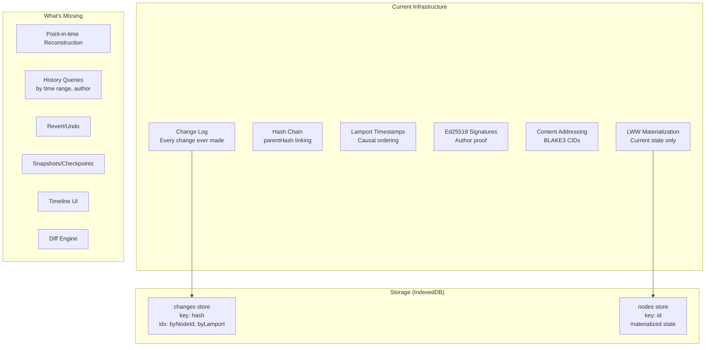

### Current Change Shape

Every mutation produces a `NodeChange` with:

| Field                | Type              | Purpose                       |
| -------------------- | ----------------- | ----------------------------- |
| `id`                 | string            | Unique change ID              |
| `hash`               | `cid:blake3:...`  | Content-addressed identity    |
| `parentHash`         | ContentId \| null | Previous change for this node |
| `payload.nodeId`     | NodeId            | Which node was changed        |
| `payload.schemaId`   | SchemaIRI         | Node type (on first change)   |
| `payload.properties` | Record            | Sparse: only changed props    |
| `payload.deleted`    | boolean           | Soft delete flag              |
| `authorDID`          | DID               | Who made the change           |
| `lamport`            | { time, author }  | Causal ordering               |
| `wallTime`           | number            | Wall clock (display only)     |
| `signature`          | Uint8Array        | Ed25519 proof                 |
| `batchId?`           | string            | Transaction grouping          |

### What We Can Already Do (Without New Code)

1. `store.getChanges(nodeId)` — get the full change log for any node
2. Walk `parentHash` to get the exact sequence
3. `topologicalSort(changes)` — order changes causally
4. `getAncestry(change, allChanges)` — walk back the chain
5. `detectFork(changes)` — find concurrent edits
6. Every change has `authorDID` + `wallTime` — full attribution

---

## Time Machine: The Vision

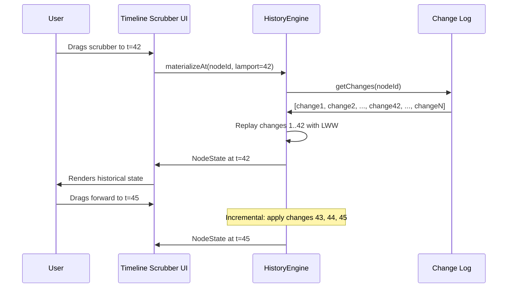

### Three Modes of Time Travel

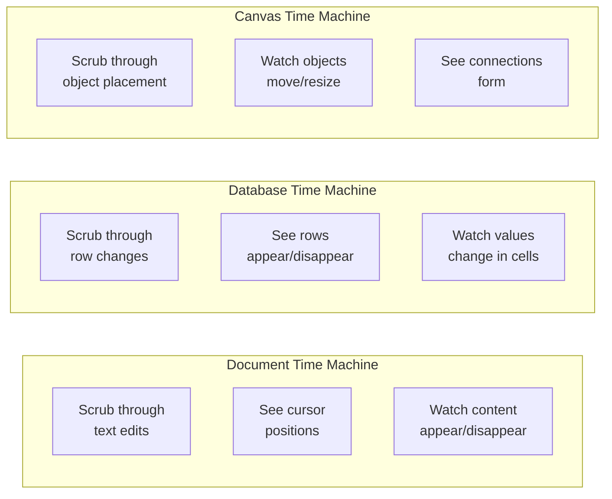

**Document (Yjs CRDT):** The Yjs document stores its own history as updates. We can use `Y.createSnapshot()` at intervals, then apply updates incrementally to reconstruct any point. TipTap can render a read-only editor at any historical state.

**Database (Node event sourcing):** Each row is a Node with a change log. The `HistoryEngine` replays changes up to a target Lamport time. The table view renders the reconstructed state.

**Canvas:** Same as database — each canvas object is a Node. Replay changes to see objects appear, move, resize, and connect.

---

## Architecture

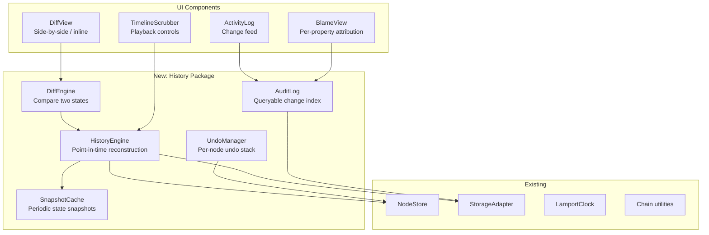

---

## Implementation: HistoryEngine

The core component that enables point-in-time reconstruction:

```typescript
interface HistoryEngine {
  // Point-in-time reconstruction
  materializeAt(nodeId: NodeId, target: HistoryTarget): Promise<HistoricalState>
  materializeMultipleAt(nodeIds: NodeId[], target: HistoryTarget): Promise<HistoricalState[]>

  // Change enumeration
  getTimeline(nodeId: NodeId): Promise<TimelineEntry[]>
  getTimelineRange(nodeId: NodeId, from: HistoryTarget, to: HistoryTarget): Promise<TimelineEntry[]>

  // Diff
  diff(nodeId: NodeId, from: HistoryTarget, to: HistoryTarget): Promise<PropertyDiff[]>

  // Revert
  revertTo(nodeId: NodeId, target: HistoryTarget): Promise<NodeChange>
  revertChange(changeHash: ContentId): Promise<NodeChange>
  revertBatch(batchId: string): Promise<NodeChange[]>

  // Undo/Redo
  undo(nodeId: NodeId): Promise<NodeChange | null>
  redo(nodeId: NodeId): Promise<NodeChange | null>
  getUndoStack(nodeId: NodeId): HistoryTarget[]
  getRedoStack(nodeId: NodeId): HistoryTarget[]
}

// How to specify a point in time
type HistoryTarget =
  | { type: 'lamport'; time: number } // by Lamport time
  | { type: 'wall'; timestamp: number } // by wall clock
  | { type: 'hash'; hash: ContentId } // by specific change
  | { type: 'index'; index: number } // by change count (nth change)
  | { type: 'relative'; offset: number } // -1 = previous, -5 = five ago

interface HistoricalState {
  node: NodeState // reconstructed state
  target: HistoryTarget // which point
  changeIndex: number // how many changes applied
  totalChanges: number // total changes available
  timestamp: number // wall time at this point
  author: DID // who made the change at this point
}

interface TimelineEntry {
  change: NodeChange
  index: number
  properties: string[] // which properties changed
  type: 'create' | 'update' | 'delete' | 'restore'
  author: DID
  wallTime: number
  lamport: LamportTimestamp
  batchId?: string
}

interface PropertyDiff {
  property: string
  before: unknown
  after: unknown
  changedAt: number // wall time
  changedBy: DID
}
```

### Materialization Algorithm

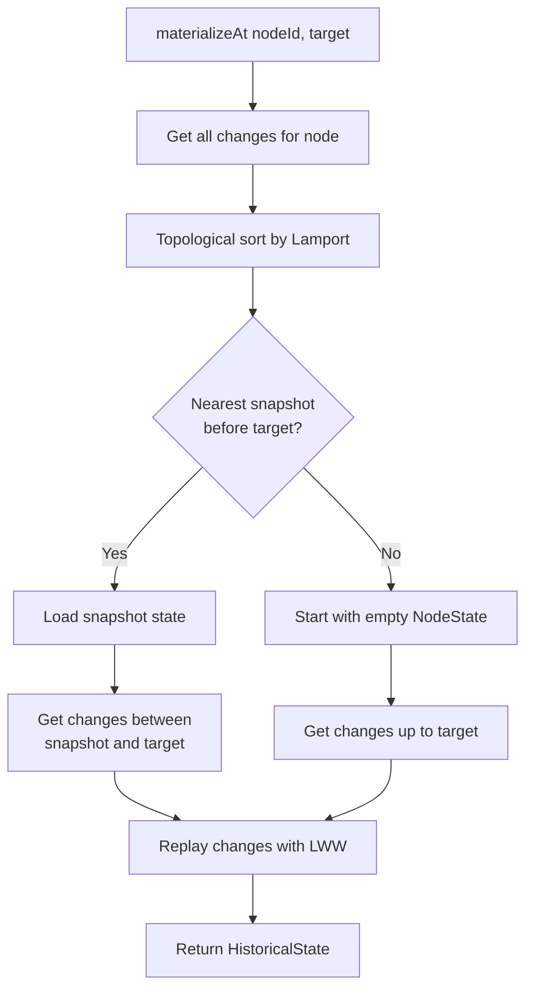

```typescript
class HistoryEngineImpl implements HistoryEngine {
  constructor(
    private store: NodeStore,
    private storage: NodeStorageAdapter,
    private snapshots: SnapshotCache
  ) {}

  async materializeAt(nodeId: NodeId, target: HistoryTarget): Promise<HistoricalState> {
    // 1. Get all changes for this node, sorted
    const allChanges = await this.storage.getChanges(nodeId)
    const sorted = topologicalSort(allChanges)

    // 2. Resolve target to an index
    const targetIndex = this.resolveTarget(target, sorted)

    // 3. Check for nearest snapshot before target
    const snapshot = await this.snapshots.getNearestBefore(nodeId, targetIndex)

    // 4. Start from snapshot or empty state
    let state: NodeState = snapshot?.state ?? this.emptyState(nodeId, sorted[0])
    const startIndex = snapshot?.changeIndex ?? 0

    // 5. Replay changes from startIndex to targetIndex
    for (let i = startIndex; i <= targetIndex && i < sorted.length; i++) {
      state = this.applyChangeToState(state, sorted[i])
    }

    return {
      node: state,
      target,
      changeIndex: targetIndex,
      totalChanges: sorted.length,
      timestamp: sorted[targetIndex]?.wallTime ?? 0,
      author: sorted[targetIndex]?.authorDID ?? ''
    }
  }

  private applyChangeToState(state: NodeState, change: NodeChange): NodeState {
    // Same LWW logic as NodeStore.applyChange, but on a plain object
    const newState = { ...state, properties: { ...state.properties } }

    for (const [key, value] of Object.entries(change.payload.properties)) {
      const incoming: PropertyTimestamp = {
        lamport: change.lamport,
        wallTime: change.wallTime
      }
      const existing = newState.timestamps?.[key]

      if (!existing || compareLamportTimestamps(incoming.lamport, existing.lamport) > 0) {
        if (value === undefined) {
          delete newState.properties[key]
        } else {
          newState.properties[key] = value
        }
        newState.timestamps = { ...newState.timestamps, [key]: incoming }
      }
    }

    if (change.payload.deleted !== undefined) {
      newState.deleted = change.payload.deleted
    }

    newState.updatedAt = change.wallTime
    newState.updatedBy = change.authorDID
    return newState
  }
}
```

---

## Snapshot Cache (Performance Optimization)

Without snapshots, materializing a node with 10,000 changes means replaying all 10,000. Snapshots provide periodic checkpoints:

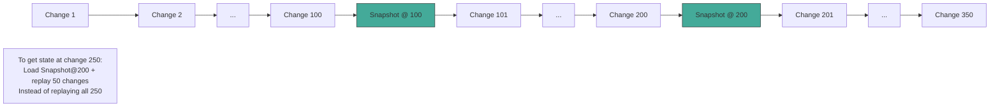

```typescript
interface SnapshotCache {
  // Store a snapshot at a specific change index
  save(nodeId: NodeId, changeIndex: number, state: NodeState): Promise<void>

  // Get nearest snapshot at or before target index
  getNearestBefore(nodeId: NodeId, changeIndex: number): Promise<Snapshot | null>

  // Auto-snapshot policy
  shouldSnapshot(nodeId: NodeId, changeCount: number): boolean
}

interface Snapshot {
  nodeId: NodeId
  changeIndex: number
  changeHash: ContentId // hash of the change at this index
  state: NodeState // full materialized state
  createdAt: number
}

class SnapshotCacheImpl implements SnapshotCache {
  private readonly SNAPSHOT_INTERVAL = 100 // snapshot every 100 changes

  shouldSnapshot(nodeId: NodeId, changeCount: number): boolean {
    return changeCount % this.SNAPSHOT_INTERVAL === 0
  }

  // Called by NodeStore after applying a change
  async maybeSnapshot(nodeId: NodeId, state: NodeState, changeIndex: number): Promise<void> {
    if (this.shouldSnapshot(nodeId, changeIndex)) {
      await this.save(nodeId, changeIndex, structuredClone(state))
    }
  }
}
```

---

## Timeline Scrubber UI

The key interaction: a slider that maps to the change index for a node (or set of nodes).

```mermaid
flowchart TD
    subgraph "Timeline Scrubber Component"
        direction LR
        SL[Slider<br/>0...totalChanges]
        PB[Play/Pause<br/>Auto-advance]
        SP[Speed Control<br/>1x, 2x, 5x, 10x]
        JB[Jump Buttons<br/>|< < > >|]
    end

    subgraph "Timeline Annotations"
        direction LR
        CM[Change Markers<br/>dots on timeline]
        AG[Author Groups<br/>colored segments]
        BM[Batch Markers<br/>grouped changes]
        TM[Time Labels<br/>wall clock]
    end

    subgraph "State Display"
        direction LR
        RO[Read-only View<br/>at historical state]
        DF[Diff Overlay<br/>highlights changes]
        IN[Info Panel<br/>who/when/what]
    end
```

```typescript
interface TimelineScrubberProps {
  // What to show history for
  nodeId?: NodeId // single node
  nodeIds?: NodeId[] // multiple nodes (database rows)
  schemaIRI?: SchemaIRI // all nodes of a type

  // Current position
  position: number // change index
  onPositionChange: (index: number) => void

  // Display options
  showAuthors?: boolean
  showBatches?: boolean
  groupByTime?: 'second' | 'minute' | 'hour' | 'day'
  colorByAuthor?: boolean
}

interface TimelineState {
  position: number
  totalChanges: number
  isPlaying: boolean
  playSpeed: number // 1, 2, 5, 10
  historicalState: HistoricalState | null
}
```

### Playback Engine

```typescript
class PlaybackEngine {
  private timer: number | null = null
  private position = 0
  private speed = 1
  private timeline: TimelineEntry[] = []

  async load(nodeId: NodeId): Promise<void> {
    this.timeline = await historyEngine.getTimeline(nodeId)
  }

  play(): void {
    this.timer = setInterval(() => {
      this.position++
      if (this.position >= this.timeline.length) {
        this.pause()
        return
      }
      this.emit('position', this.position)
    }, 1000 / this.speed)
  }

  pause(): void {
    if (this.timer) clearInterval(this.timer)
    this.timer = null
  }

  seek(index: number): void {
    this.position = Math.max(0, Math.min(index, this.timeline.length - 1))
    this.emit('position', this.position)
  }

  setSpeed(speed: number): void {
    this.speed = speed
    if (this.timer) {
      this.pause()
      this.play()
    }
  }

  // Smart seek: jump to next meaningful change (skip batches)
  nextMeaningful(): void {
    const current = this.timeline[this.position]
    let next = this.position + 1
    // Skip changes in the same batch
    while (next < this.timeline.length && this.timeline[next].batchId === current?.batchId) {
      next++
    }
    this.seek(next)
  }
}
```

---

## Document Time Machine (Yjs Integration)

For rich text documents, the change log is the Yjs update stream. Yjs has native snapshot support:

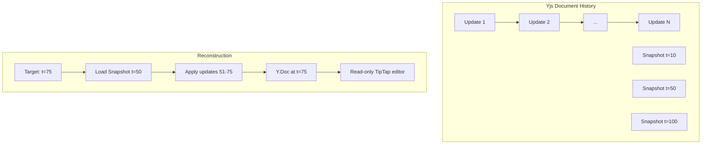

```typescript
interface DocumentHistoryEngine {
  // Get document state at a point in time
  getDocumentAt(nodeId: NodeId, target: HistoryTarget): Promise<Y.Doc>

  // Get all update timestamps for the timeline
  getDocumentTimeline(nodeId: NodeId): Promise<DocumentTimelineEntry[]>

  // Diff two document states (returns ProseMirror diffing)
  diffDocuments(doc1: Y.Doc, doc2: Y.Doc): DocumentDiff
}

interface DocumentTimelineEntry {
  index: number
  timestamp: number
  author: DID
  characterCount: number           // total chars at this point
  changeSize: number               // bytes in this update
}

// Integration with TipTap for rendering historical state
function HistoricalDocumentView({ nodeId, position }: { nodeId: NodeId; position: number }) {
  const [historicalDoc, setHistoricalDoc] = useState<Y.Doc | null>(null)

  useEffect(() => {
    documentHistory.getDocumentAt(nodeId, { type: 'index', index: position })
      .then(setHistoricalDoc)
  }, [nodeId, position])

  if (!historicalDoc) return <Loading />

  return (
    <RichTextEditor
      fragment={historicalDoc.getXmlFragment('content')}
      editable={false}  // read-only historical view
    />
  )
}
```

---

## Database Time Machine

For databases, each row is a Node. The database view reconstructs all rows at a given point:

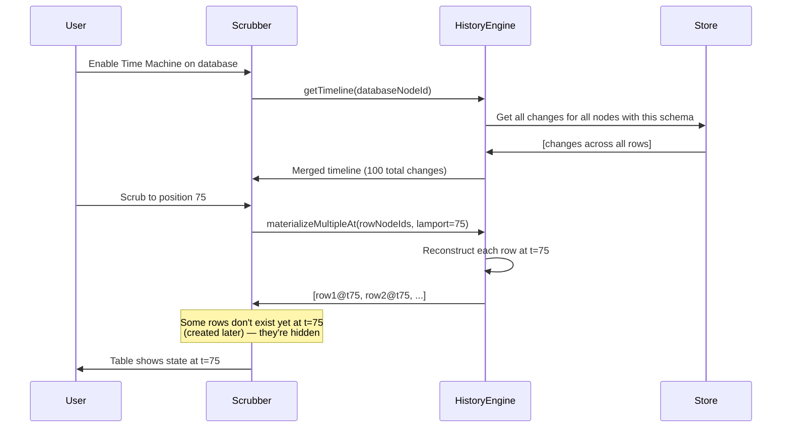

```typescript
interface DatabaseTimelineProps {
  schemaIRI: SchemaIRI                // the database schema
  viewConfig: ViewConfig              // current view settings
}

function DatabaseTimeMachine({ schemaIRI, viewConfig }: DatabaseTimelineProps) {
  const [position, setPosition] = useState<number | null>(null)  // null = live
  const [timeline, setTimeline] = useState<TimelineEntry[]>([])
  const [historicalNodes, setHistoricalNodes] = useState<FlatNode[]>([])

  // Load merged timeline for all nodes of this schema
  useEffect(() => {
    historyEngine.getSchemaTimeline(schemaIRI).then(setTimeline)
  }, [schemaIRI])

  // Reconstruct all rows at the target position
  useEffect(() => {
    if (position === null) return  // live mode
    const target: HistoryTarget = { type: 'index', index: position }
    historyEngine.materializeSchemaAt(schemaIRI, target).then(setHistoricalNodes)
  }, [position, schemaIRI])

  const isLive = position === null
  const nodes = isLive ? liveNodes : historicalNodes

  return (
    <div className="database-time-machine">
      <TimelineScrubber
        totalChanges={timeline.length}
        position={position ?? timeline.length}
        onPositionChange={(p) => setPosition(p === timeline.length ? null : p)}
        timeline={timeline}
      />

      {!isLive && (
        <div className="time-machine-banner">
          Viewing state at {formatDate(timeline[position!]?.wallTime)}
          <button onClick={() => setPosition(null)}>Return to Present</button>
          <button onClick={() => historyEngine.revertSchemaTo(schemaIRI, { type: 'index', index: position! })}>
            Restore This State
          </button>
        </div>
      )}

      <TableView
        nodes={nodes}
        schema={schema}
        viewConfig={viewConfig}
        readOnly={!isLive}
      />
    </div>
  )
}
```

### Visual Diff in Table View

When scrubbing, cells that changed at the current position can be highlighted:

```typescript
interface CellHighlight {
  nodeId: NodeId
  property: string
  type: 'added' | 'modified' | 'removed'
  previousValue?: unknown
}

function getHighlightsAtPosition(timeline: TimelineEntry[], position: number): CellHighlight[] {
  const entry = timeline[position]
  if (!entry) return []

  return entry.change.payload.properties
    ? Object.keys(entry.change.payload.properties).map((prop) => ({
        nodeId: entry.change.payload.nodeId,
        property: prop,
        type: entry.type === 'create' ? 'added' : 'modified'
      }))
    : []
}
```

---

## Audit Log

A queryable, filterable view of all changes across the system:

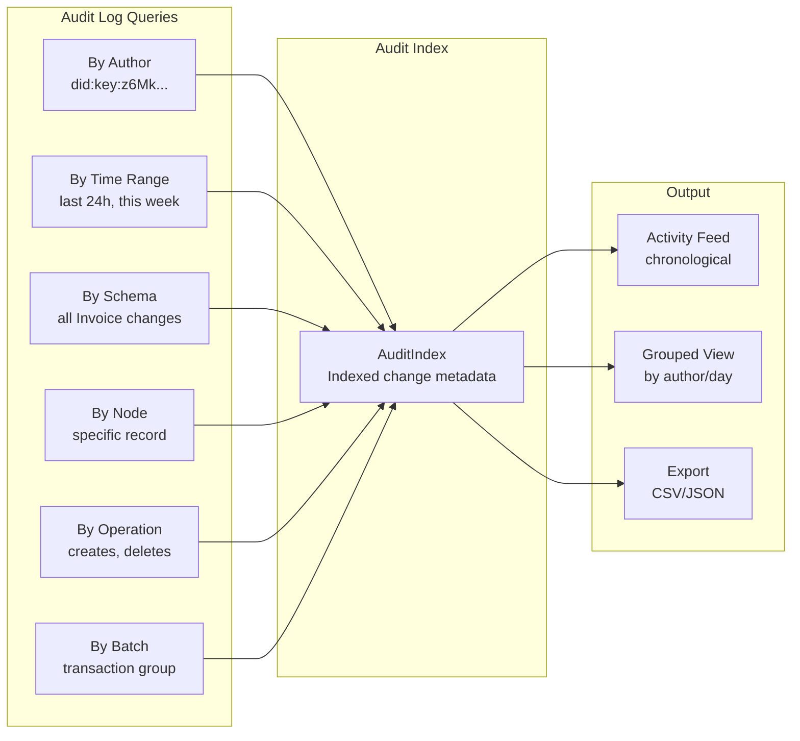

```typescript
interface AuditQuery {
  nodeId?: NodeId
  nodeIds?: NodeId[]
  schemaIRI?: SchemaIRI
  author?: DID
  authors?: DID[]
  fromTime?: number // wall time
  toTime?: number
  fromLamport?: number
  toLamport?: number
  operations?: ('create' | 'update' | 'delete' | 'restore')[]
  batchId?: string
  properties?: string[] // only changes to these properties
  limit?: number
  offset?: number
}

interface AuditEntry {
  change: NodeChange
  operation: 'create' | 'update' | 'delete' | 'restore'
  author: DID
  wallTime: number
  lamport: LamportTimestamp
  nodeId: NodeId
  schemaIRI: SchemaIRI
  properties: string[] // which properties changed
  batchId?: string
  batchSize?: number
  isRemote: boolean
}

interface AuditIndex {
  query(q: AuditQuery): Promise<AuditEntry[]>
  count(q: AuditQuery): Promise<number>

  // Aggregations
  getAuthorActivity(author: DID, timeRange?: [number, number]): Promise<ActivitySummary>
  getNodeActivity(nodeId: NodeId): Promise<ActivitySummary>
  getSchemaActivity(schemaIRI: SchemaIRI): Promise<ActivitySummary>

  // Real-time
  subscribe(q: AuditQuery, callback: (entry: AuditEntry) => void): () => void
}

interface ActivitySummary {
  totalChanges: number
  creates: number
  updates: number
  deletes: number
  authors: DID[]
  firstChange: number // wall time
  lastChange: number
  activeProperties: string[] // most-changed properties
}
```

### Storage Adapter Enhancements

The current IndexedDB adapter has a `byLamport` index but doesn't support rich queries. We need:

```typescript
// Additional indexes needed on the 'changes' store:
// - byAuthor: change.authorDID
// - byWallTime: change.wallTime
// - bySchemaAndTime: [change.payload.schemaId, change.wallTime]  (compound)
// - byBatchId: change.batchId

interface EnhancedNodeStorageAdapter extends NodeStorageAdapter {
  // New query methods for audit
  queryChanges(query: AuditQuery): Promise<NodeChange[]>
  countChanges(query: AuditQuery): Promise<number>

  // Time-range queries
  getChangesSince(nodeId: NodeId, lamportTime: number): Promise<NodeChange[]>
  getChangesInRange(nodeId: NodeId, from: number, to: number): Promise<NodeChange[]>

  // Author queries
  getChangesByAuthor(author: DID, limit?: number): Promise<NodeChange[]>

  // Snapshot storage
  getSnapshot(nodeId: NodeId, beforeIndex: number): Promise<Snapshot | null>
  saveSnapshot(snapshot: Snapshot): Promise<void>
}
```

---

## Undo/Redo System

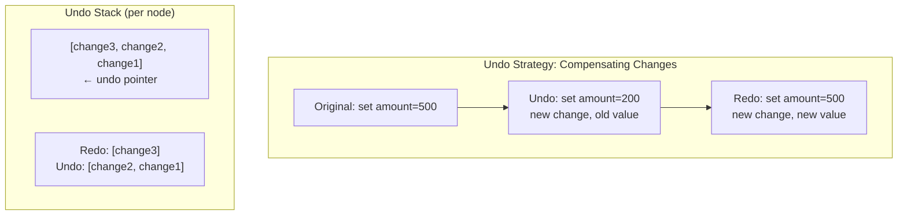

Two approaches to undo:

### Approach A: Compensating Changes (Recommended)

Create a new change that sets properties back to their pre-change values. This preserves the full history and works with P2P sync (everyone sees the undo as a new change).

```typescript
class UndoManager {
  private undoStacks = new Map<NodeId, UndoEntry[]>()
  private redoStacks = new Map<NodeId, UndoEntry[]>()

  constructor(
    private store: NodeStore,
    private history: HistoryEngine
  ) {
    // Track local changes for undo
    store.subscribe((event) => {
      if (!event.isRemote && event.node) {
        this.pushUndo(event.change, event.node)
      }
    })
  }

  async undo(nodeId: NodeId): Promise<NodeChange | null> {
    const stack = this.undoStacks.get(nodeId)
    if (!stack?.length) return null

    const entry = stack.pop()!

    // Create compensating change (restore previous values)
    const change = await this.store.update(nodeId, entry.previousValues)

    // Push to redo stack
    const redoStack = this.redoStacks.get(nodeId) ?? []
    redoStack.push({ change: entry.change, previousValues: entry.currentValues })
    this.redoStacks.set(nodeId, redoStack)

    return change
  }

  async redo(nodeId: NodeId): Promise<NodeChange | null> {
    const stack = this.redoStacks.get(nodeId)
    if (!stack?.length) return null

    const entry = stack.pop()!
    const change = await this.store.update(nodeId, entry.previousValues)

    // Push back to undo stack
    const undoStack = this.undoStacks.get(nodeId) ?? []
    undoStack.push({ change: entry.change, previousValues: entry.currentValues })
    this.undoStacks.set(nodeId, undoStack)

    return change
  }

  // Batch undo: undo all changes in a transaction together
  async undoBatch(batchId: string): Promise<NodeChange[]> {
    // Find all changes with this batchId
    // Create compensating changes for each
    // Group as a new transaction
  }

  private pushUndo(change: NodeChange, currentState: NodeState): void {
    const nodeId = change.payload.nodeId
    const stack = this.undoStacks.get(nodeId) ?? []

    // Calculate previous values for the changed properties
    const previousValues: Record<string, unknown> = {}
    const currentValues: Record<string, unknown> = {}
    for (const key of Object.keys(change.payload.properties)) {
      // Previous value = current state before this change was applied
      // (We need to capture this BEFORE applying the change, or reconstruct from history)
      previousValues[key] = currentState.properties[key]
      currentValues[key] = change.payload.properties[key]
    }

    stack.push({ change, previousValues, currentValues })
    this.undoStacks.set(nodeId, stack)

    // Clear redo stack on new change
    this.redoStacks.delete(nodeId)
  }
}

interface UndoEntry {
  change: NodeChange
  previousValues: Record<string, unknown>
  currentValues: Record<string, unknown>
}
```

### Approach B: Replay Without (Not Recommended for P2P)

Replay all changes except the one being undone. This doesn't create new changes, so peers wouldn't see the undo. Only works for local-only scenarios.

---

## Revert to Point in Time

Different from undo — this creates a single change (or batch) that sets the node to exactly the state it was in at a historical point:

```typescript
async function revertTo(nodeId: NodeId, target: HistoryTarget): Promise<NodeChange> {
  // 1. Get current state
  const current = await store.get(nodeId)

  // 2. Get historical state
  const historical = await historyEngine.materializeAt(nodeId, target)

  // 3. Compute diff (what needs to change to get back)
  const updates: Record<string, unknown> = {}
  const allKeys = new Set([
    ...Object.keys(current.properties),
    ...Object.keys(historical.node.properties)
  ])

  for (const key of allKeys) {
    const currentVal = current.properties[key]
    const historicalVal = historical.node.properties[key]
    if (!deepEqual(currentVal, historicalVal)) {
      updates[key] = historicalVal ?? undefined // undefined = delete
    }
  }

  // 4. Apply as a single change
  return store.update(nodeId, updates)
}
```

---

## Branching / What-If Exploration

Since we have the full change log, users could branch from a historical point to explore alternatives:

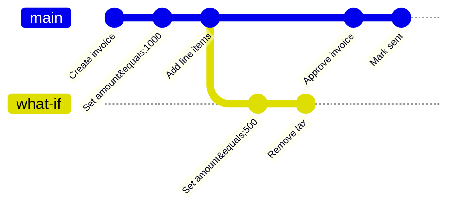

```typescript
interface Branch {
  id: string
  name: string
  nodeId: NodeId
  forkPoint: ContentId // hash of the change we branched from
  changes: NodeChange[] // branch-only changes
  createdAt: number
  author: DID
}

// Branching is essentially:
// 1. materializeAt(nodeId, forkPoint) → get state
// 2. Create a new node (or shadow copy) with that state
// 3. Apply changes to the branch copy independently
// 4. Optionally merge back: diff branch tip vs main tip, apply
```

This is a more advanced feature but the infrastructure supports it naturally since changes are just data.

---

## Blame / Attribution View

Per-property "last edited by" with full history:

```typescript
interface BlameInfo {
  property: string
  currentValue: unknown
  lastChangedBy: DID
  lastChangedAt: number
  changeCount: number // how many times this property changed
  history: PropertyChangeEntry[] // full history of this property
}

interface PropertyChangeEntry {
  value: unknown
  author: DID
  wallTime: number
  lamport: LamportTimestamp
  changeHash: ContentId
}

async function getBlame(nodeId: NodeId): Promise<BlameInfo[]> {
  const changes = await storage.getChanges(nodeId)
  const sorted = topologicalSort(changes)

  const blame = new Map<string, BlameInfo>()

  for (const change of sorted) {
    for (const [prop, value] of Object.entries(change.payload.properties)) {
      if (!blame.has(prop)) {
        blame.set(prop, {
          property: prop,
          currentValue: value,
          lastChangedBy: change.authorDID,
          lastChangedAt: change.wallTime,
          changeCount: 0,
          history: []
        })
      }
      const info = blame.get(prop)!
      info.currentValue = value
      info.lastChangedBy = change.authorDID
      info.lastChangedAt = change.wallTime
      info.changeCount++
      info.history.push({
        value,
        author: change.authorDID,
        wallTime: change.wallTime,
        lamport: change.lamport,
        changeHash: change.hash
      })
    }
  }

  return [...blame.values()]
}
```

---

## Change Notifications / "What Changed Since..."

```typescript
interface ChangesSinceResult {
  nodeId: NodeId
  changes: NodeChange[]
  summary: {
    propertiesChanged: string[]
    authors: DID[]
    changeCount: number
    firstChange: number // wall time
    lastChange: number
  }
}

// "What changed in this database since I last looked?"
async function getChangesSince(
  schemaIRI: SchemaIRI,
  since: number | LamportTimestamp
): Promise<ChangesSinceResult[]> {
  // Query changes across all nodes of this schema since the given time
  // Group by nodeId and summarize
}

// Per-node: show a badge "3 changes by Alice since yesterday"
function useChangesBadge(nodeId: NodeId, since: number): { count: number; authors: DID[] } {
  // Subscribe to changes and count since the given timestamp
}
```

---

## Cryptographic Verification

Since every change is signed, we can verify the entire history is authentic:

```typescript
interface VerificationResult {
  valid: boolean
  errors: VerificationError[]
  stats: {
    totalChanges: number
    verifiedSignatures: number
    validHashChain: boolean
    authors: DID[]
    timespan: [number, number] // first, last wall time
  }
}

interface VerificationError {
  changeHash: ContentId
  type: 'invalid-signature' | 'broken-chain' | 'tampered-hash' | 'clock-anomaly'
  details: string
}

async function verifyNodeHistory(nodeId: NodeId): Promise<VerificationResult> {
  const changes = await storage.getChanges(nodeId)
  const errors: VerificationError[] = []

  for (const change of changes) {
    // 1. Verify hash integrity
    const computed = computeHash(toUnsigned(change))
    if (computed !== change.hash) {
      errors.push({ changeHash: change.hash, type: 'tampered-hash', details: 'Hash mismatch' })
    }

    // 2. Verify signature
    const valid = await verifySignature(change.hash, change.signature, change.authorDID)
    if (!valid) {
      errors.push({
        changeHash: change.hash,
        type: 'invalid-signature',
        details: 'Signature verification failed'
      })
    }

    // 3. Verify chain continuity
    if (change.parentHash) {
      const parent = changes.find((c) => c.hash === change.parentHash)
      if (!parent) {
        errors.push({
          changeHash: change.hash,
          type: 'broken-chain',
          details: `Parent ${change.parentHash} not found`
        })
      }
    }
  }

  return {
    valid: errors.length === 0,
    errors,
    stats: {
      totalChanges: changes.length,
      verifiedSignatures:
        changes.length - errors.filter((e) => e.type === 'invalid-signature').length,
      validHashChain: !errors.some((e) => e.type === 'broken-chain'),
      authors: [...new Set(changes.map((c) => c.authorDID))],
      timespan: [changes[0]?.wallTime ?? 0, changes[changes.length - 1]?.wallTime ?? 0]
    }
  }
}
```

---

## Performance Considerations

| Scenario                       | Changes      | Strategy                                   |
| ------------------------------ | ------------ | ------------------------------------------ |
| New node (< 100 changes)       | Few          | Replay from scratch, fast enough           |
| Active node (100-1000)         | Moderate     | Snapshot every 100, replay remainder       |
| Heavy node (1000-10000)        | Many         | Multiple snapshots, nearest lookup         |
| Historical query (exact point) | Varies       | Snapshot + incremental replay              |
| Scrubbing (rapid seeking)      | Many seeks   | Pre-compute snapshots at regular intervals |
| Database view (many nodes)     | N \* changes | Parallel reconstruction, shared timeline   |

### Scrubbing Performance

For smooth scrubbing (60fps), we can't reconstruct from scratch on every frame:

```typescript
class ScrubCache {
  // Pre-compute states at regular intervals
  private precomputed = new Map<number, NodeState>() // index → state

  async precomputeForScrubbing(nodeId: NodeId, resolution = 10): Promise<void> {
    const changes = await storage.getChanges(nodeId)
    const sorted = topologicalSort(changes)

    let state = this.emptyState(nodeId, sorted[0])
    for (let i = 0; i < sorted.length; i++) {
      state = this.applyChange(state, sorted[i])
      if (i % resolution === 0) {
        this.precomputed.set(i, structuredClone(state))
      }
    }
  }

  // Fast seek: find nearest precomputed, replay few changes
  getStateAt(index: number): NodeState {
    const nearest = Math.floor(index / 10) * 10
    const base = this.precomputed.get(nearest)!
    let state = structuredClone(base)
    for (let i = nearest + 1; i <= index; i++) {
      state = this.applyChange(state, this.changes[i])
    }
    return state
  }
}
```

---

## Change Log Pruning (Future)

For nodes with extremely long histories, we may eventually need pruning:

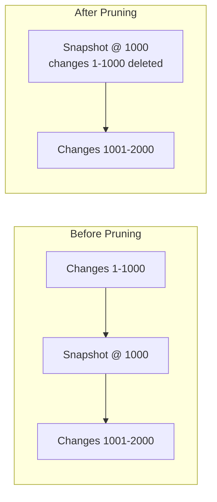

Rules for safe pruning:

1. Never prune if there are unsynced peers (they may need the changes)
2. Only prune behind a verified snapshot
3. Keep at least N recent changes (configurable)
4. Pruning is optional — nodes with compliance requirements keep everything

---

## Integration with Plugin System

The history/audit features integrate naturally with the plugin architecture from planStep03_5:

- **Scripts** can query history: `ctx.history(node.id)` returns `TimelineEntry[]`
- **Views** can render historical state: Time Machine is just another view mode
- **Middleware** can intercept undo/redo: validation before revert
- **Audit log** is a built-in view plugin (sidebar item)
- **MCP tools** expose history: `xnet_history`, `xnet_revert`, `xnet_diff`

---

## Open Questions

1. **Yjs + Node history unification** — Should document CRDT updates be indexed alongside Node changes for a single timeline? Currently they're separate systems.
2. **Pruning policy** — Who decides when to prune? Per-schema setting? Per-node? Global?
3. **Branch storage** — Are branches separate nodes, shadow copies, or just tagged change sequences?
4. **Selective history** — Should users be able to mark certain properties as "don't track history" for privacy?
5. **History size budget** — On mobile, should we limit change retention and reconstruct from snapshots?
6. **Cross-node timeline** — Showing a unified timeline across all nodes in a database requires merging and sorting potentially thousands of change streams.
7. **Collaborative undo** — If Alice undoes a change that Bob already built on, how do we handle that? (Compensating change = safe, replay-without = dangerous)
