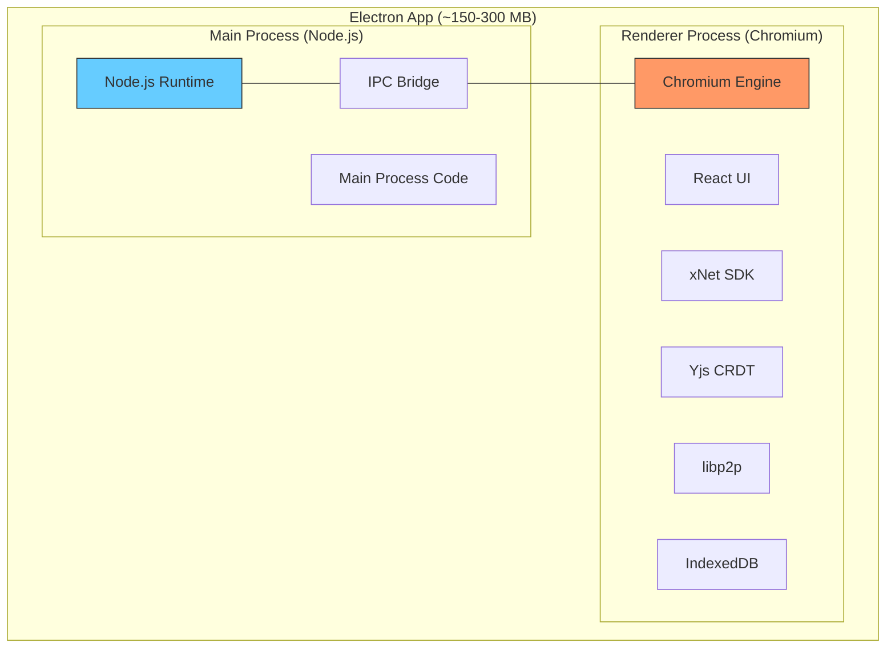
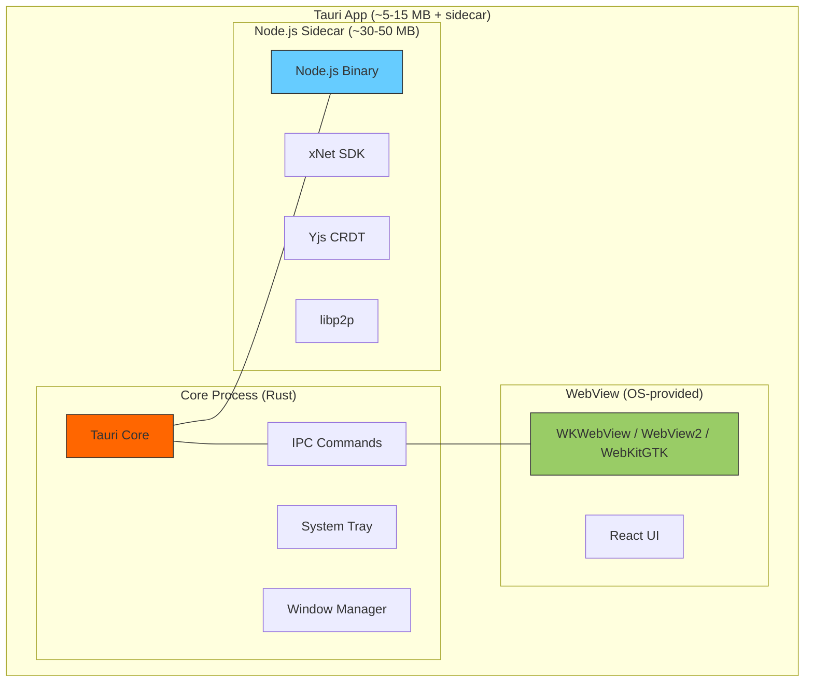
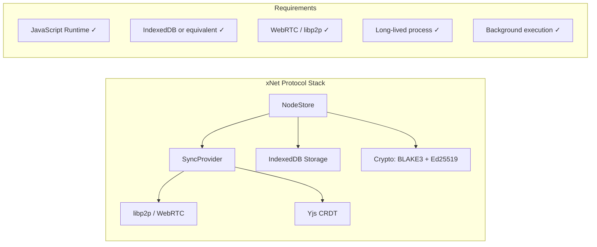
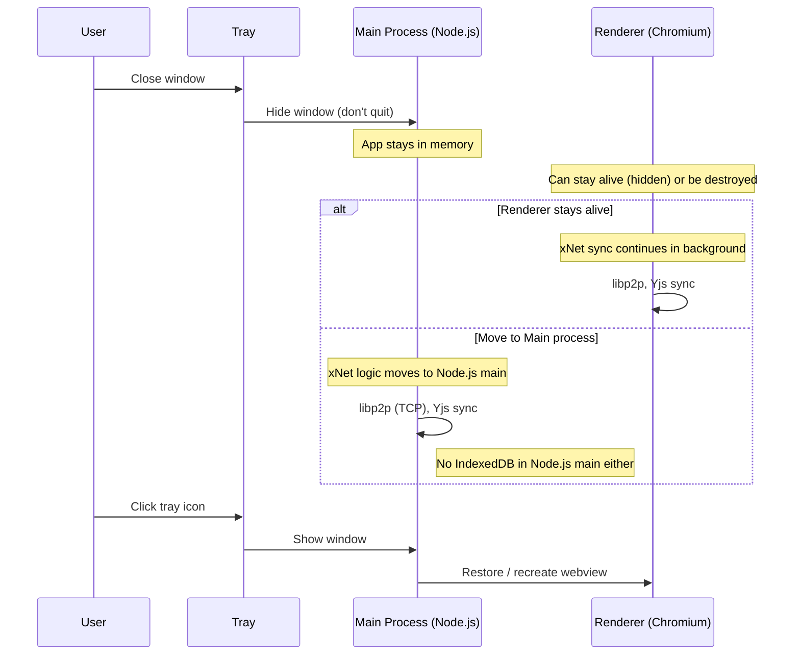
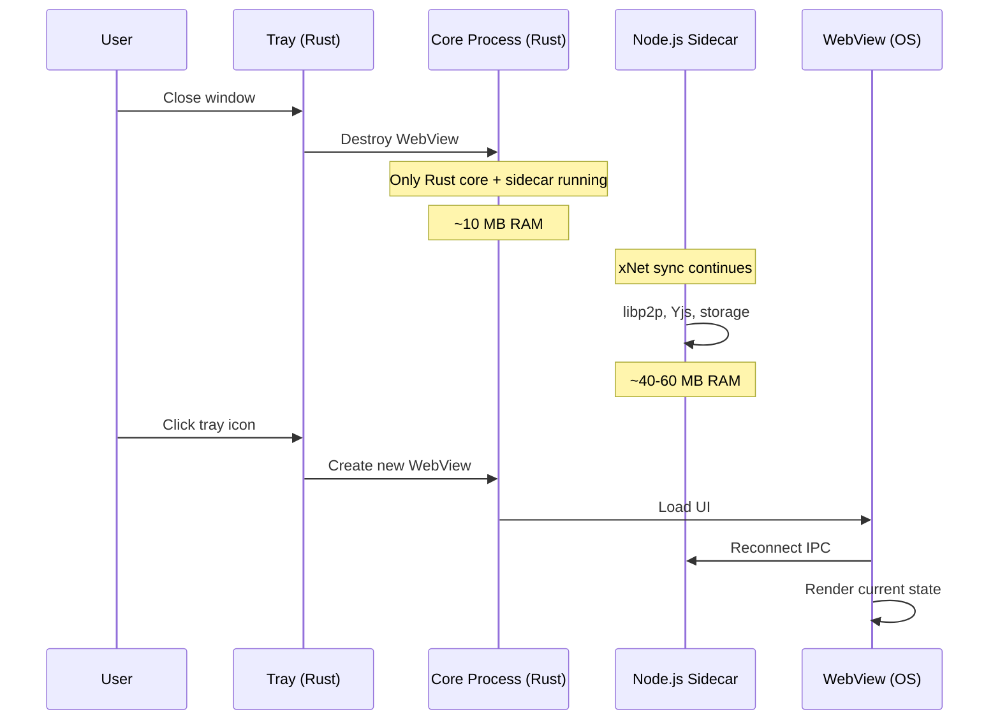
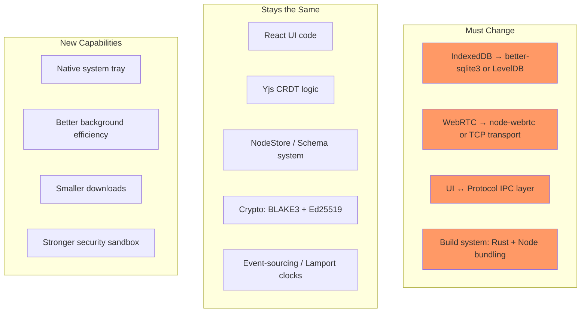
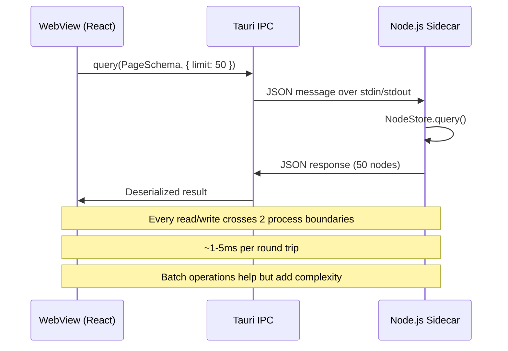
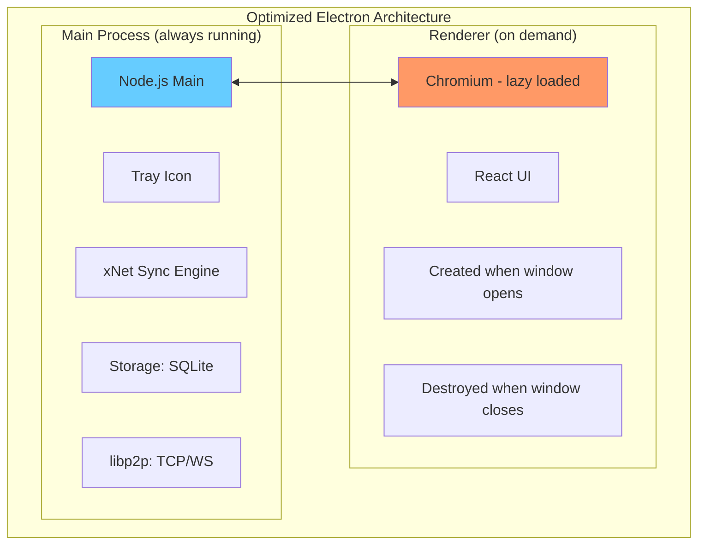
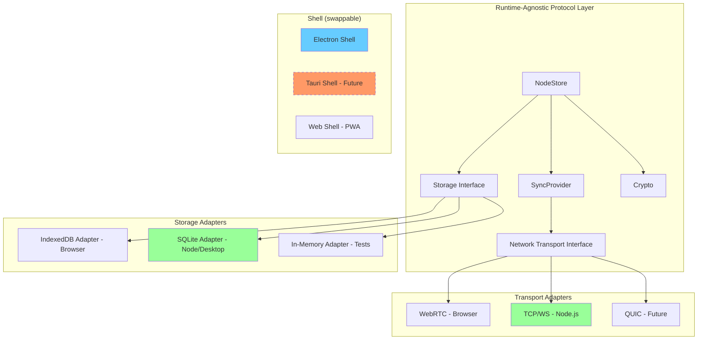

# Tauri vs Electron for xNet Desktop

## Context

xNet embeds significant protocol infrastructure into its desktop app: libp2p networking, Yjs CRDT sync, IndexedDB storage, BLAKE3 hashing, Ed25519 signing, and event-sourced state management. We need the app to:

1. Run from the **system tray / menu bar** (background daemon)
2. Perform **P2P sync in the background** without a visible window
3. Be as **resource-efficient** as possible (RAM, CPU, disk, battery)
4. Keep the existing **TypeScript/JavaScript codebase** (no Rust rewrite)

This document compares Tauri v2 and Electron for this use case.

---

## Architecture Comparison

### Electron (Current)

**Key point**: Electron ships a full Chromium browser (~120 MB) and a full Node.js runtime (~30 MB). The xNet protocol code runs in the renderer process (browser context), which gives it access to IndexedDB, WebRTC, and the full Web API surface.

### Tauri v2

**Key point**: Tauri uses the OS's native webview (no Chromium shipped), but xNet's protocol layer needs a JavaScript runtime. This would run as a **Node.js sidecar** — a separate bundled process that Tauri manages.

---

## The Critical Question: Where Does xNet Protocol Code Run?

### In Electron

The entire xNet stack runs in the **renderer process** (Chromium). It has native access to IndexedDB, WebRTC, and all Web APIs. The main process handles window management and tray. This is simple — one process, one runtime, full Web API access.

### In Tauri

The webview is **not guaranteed** to run when the window is hidden. The protocol stack would need to run in the **Node.js sidecar**, which means:

- **No IndexedDB** — would need to switch to SQLite, LevelDB, or a file-based store
- **No WebRTC** (browser API) — would need `node-webrtc` (native addon) or use libp2p's TCP/WebSocket transports instead
- **IPC overhead** — UI ↔ sidecar communication for every node read/write
- **Two runtimes** — Rust core + Node.js sidecar both running simultaneously

---

## Detailed Comparison

| Dimension                       | Electron                                                      | Tauri v2 (with Node sidecar)                                    |
| ------------------------------- | ------------------------------------------------------------- | --------------------------------------------------------------- |
| **App bundle size**             | 150-300 MB                                                    | 5-15 MB (Tauri) + 30-50 MB (Node sidecar) = **35-65 MB**        |
| **RAM at idle**                 | 80-200 MB (Chromium + Node)                                   | 10-30 MB (Tauri) + 40-80 MB (Node sidecar) = **50-110 MB**      |
| **RAM with window open**        | 150-400 MB                                                    | 30-60 MB (Tauri + WebView) + 40-80 MB (sidecar) = **70-140 MB** |
| **Background sync (no window)** | Works: renderer can stay alive, or move logic to main process | Works: sidecar runs independently of window                     |
| **System tray**                 | Supported (Tray API)                                          | Supported (native, built into Rust core)                        |
| **Tray-only mode**              | Possible but keeps Chromium alive                             | Native — Rust core + sidecar only, no webview loaded            |
| **Startup time**                | 2-5 seconds                                                   | <1 second (Rust) + sidecar startup                              |
| **IndexedDB**                   | Native (Chromium)                                             | Not available in sidecar. Need alternative.                     |
| **WebRTC**                      | Native (Chromium)                                             | Need `node-webrtc` or alternative transport                     |
| **WebView consistency**         | Guaranteed (ships Chromium)                                   | Varies by OS (WKWebView, WebView2, WebKitGTK)                   |
| **DevTools**                    | Built-in Chrome DevTools                                      | Limited (CrabNebula DevTools or browser inspectors)             |
| **Auto-updater**                | electron-updater (mature)                                     | tauri-plugin-updater (built-in, works well)                     |
| **Code signing**                | Standard macOS/Windows                                        | Standard macOS/Windows                                          |
| **Build complexity**            | Simple (one artifact)                                         | Complex (Rust + Node sidecar + cross-compile)                   |
| **Cross-platform parity**       | High (same Chromium everywhere)                               | Medium (WebView differences, platform CSS quirks)               |
| **Security model**              | Weaker (full Node access from renderer by default)            | Stronger (capability-based permissions, IPC sandboxing)         |

---

## Background Execution Models

### Electron: Tray-Only Background Mode

**Electron trade-off**: Keeping the renderer alive in the background means Chromium stays in RAM (~100-200 MB). Alternatively, the xNet logic can run in the main (Node.js) process, but then you lose IndexedDB and browser WebRTC — same problem as Tauri's sidecar.

### Tauri: Tray-Only Background Mode

**Tauri advantage**: When the window is closed, only the lean Rust core (10 MB) and the Node sidecar (40-60 MB) run. No Chromium overhead. Total background footprint: ~50-70 MB vs Electron's ~100-250 MB.

---

## Migration Effort for xNet

### What Changes With Tauri

### Effort Breakdown

| Task                                                       | Effort          | Risk                                             |
| ---------------------------------------------------------- | --------------- | ------------------------------------------------ |
| Replace IndexedDB with SQLite/LevelDB in `@xnetjs/storage` | 2-3 weeks       | Medium — need to maintain same async API         |
| Replace browser WebRTC with node-webrtc or libp2p TCP      | 1-2 weeks       | High — node-webrtc has native compilation issues |
| Build IPC bridge (sidecar ↔ webview)                       | 2-3 weeks       | Medium — need to serialize all node operations   |
| Set up Tauri project + Rust boilerplate                    | 1 week          | Low                                              |
| Bundle Node.js sidecar (pkg or Bun compile)                | 1 week          | Medium — cross-platform binary compilation       |
| Port electron-specific code (window, menu, tray)           | 1 week          | Low                                              |
| Testing + cross-platform validation                        | 2-3 weeks       | Medium                                           |
| **Total**                                                  | **10-16 weeks** |                                                  |

---

## The Sidecar Problem In Detail

The Node.js sidecar approach (Tauri's official recommendation) has specific issues for xNet:

### 1. IndexedDB Replacement

xNet's `@xnetjs/storage` uses IndexedDB (via `idb` wrapper). In a Node.js sidecar:

- **Option A**: `better-sqlite3` — synchronous, fast, but different API semantics
- **Option B**: `level` (LevelDB) — async, key-value, closer to IndexedDB semantics
- **Option C**: Custom SQLite wrapper mimicking IndexedDB's `objectStore` + `index` API

All options require rewriting the storage adapter and testing durability/performance parity.

### 2. WebRTC Without a Browser

libp2p in the browser uses WebRTC for peer connections. In Node.js:

- **`node-webrtc`** — exists but is a heavy native addon, often has build issues on macOS ARM64
- **`werift`** — pure JS WebRTC implementation, but less mature
- **TCP/WebSocket transports** — simpler, but requires different NAT traversal (relay servers)
- **QUIC transport** — libp2p supports it in Node.js, good performance, but different connection semantics

### 3. IPC Serialization Overhead

Every UI interaction that reads/queries nodes would cross process boundaries:

For a realtime collaborative editor, this latency could be noticeable during rapid typing if Yjs updates need to round-trip through IPC.

---

## Alternative: Electron with Optimized Background Mode

Instead of switching to Tauri, Electron can be optimized for the background use case:

**This approach**:

- Moves xNet protocol code to Node.js **main process** (same runtime, no sidecar needed)
- Destroys the renderer when the window closes (saves Chromium RAM)
- Recreates the renderer on demand when the user clicks the tray
- Still requires replacing IndexedDB with SQLite (same as Tauri sidecar)
- Still requires non-browser WebRTC (same as Tauri sidecar)
- **No IPC overhead** for protocol operations (everything in one process)
- **Simpler build** — no Rust, no cross-compilation, no sidecar bundling

---

## Resource Comparison: Background Mode

| Metric           | Electron (renderer alive) | Electron (main only)    | Tauri (sidecar)       |
| ---------------- | ------------------------- | ----------------------- | --------------------- |
| RAM (background) | 150-250 MB                | 50-80 MB                | 50-70 MB              |
| CPU (idle sync)  | ~1-3%                     | ~0.5-1%                 | ~0.5-1%               |
| Disk (app size)  | 150-300 MB                | 150-300 MB              | 35-65 MB              |
| Battery impact   | High                      | Low-Medium              | Low                   |
| Startup to UI    | Instant (already loaded)  | 2-4 sec (load Chromium) | <1 sec (load webview) |

**Key insight**: The RAM difference between "Electron main-only" and "Tauri sidecar" is minimal (50-80 MB vs 50-70 MB). Both run a Node.js process for the protocol stack. The real savings from Tauri are **disk size** (no bundled Chromium) and **slightly faster** cold-start webview creation.

---

## WebView Compatibility Concerns

Tauri uses the OS's built-in webview, which varies:

| Platform | WebView Engine            | Concerns for xNet                                                           |
| -------- | ------------------------- | --------------------------------------------------------------------------- |
| macOS    | WKWebView (WebKit)        | Generally good. Some CSS flex differences.                                  |
| Windows  | WebView2 (Chromium-based) | Very good. Requires WebView2 Runtime (usually pre-installed on Win 10+).    |
| Linux    | WebKitGTK                 | Most variable. Older distros may have outdated versions. Some Web API gaps. |

For xNet's current UI (React + Tailwind), WebKit differences are unlikely to cause major issues. But if the editor uses advanced TipTap features or Canvas APIs, WebKit on Linux could be problematic.

---

## Decision Matrix

| Factor                     | Weight | Electron     | Tauri | Notes                                    |
| -------------------------- | ------ | ------------ | ----- | ---------------------------------------- |
| Migration effort           | High   | ★★★★★ (none) | ★★☆☆☆ | 10-16 weeks of work for Tauri            |
| Background RAM usage       | High   | ★★★☆☆        | ★★★★☆ | ~20 MB difference (main-only mode)       |
| App download size          | Medium | ★★☆☆☆        | ★★★★★ | 300 MB vs 50 MB                          |
| Build complexity           | Medium | ★★★★★        | ★★☆☆☆ | Rust + sidecar bundling is complex       |
| Cross-platform consistency | Medium | ★★★★★        | ★★★☆☆ | WebView differences on Linux             |
| Security model             | Medium | ★★★☆☆        | ★★★★★ | Capability-based permissions             |
| Developer experience       | Medium | ★★★★★        | ★★★☆☆ | Chrome DevTools vs limited debugging     |
| System tray / native feel  | Low    | ★★★★☆        | ★★★★★ | Both work, Tauri is slightly more native |
| Future-proofing            | Low    | ★★★☆☆        | ★★★★☆ | Tauri has strong momentum                |

---

## Recommendation

**Stay with Electron for now**, but architect the protocol layer for eventual portability:

### Why Not Switch Now

1. **10-16 weeks of migration work** with no functional benefit to users
2. **IndexedDB replacement needed either way** — whether in Tauri sidecar or Electron main process
3. **The RAM savings are modest** (~20 MB) when comparing "Electron main-only" vs "Tauri sidecar"
4. **WebView inconsistencies** on Linux would introduce new bugs
5. **IPC overhead** in Tauri's sidecar model adds latency to the collaborative editor
6. **Build complexity** (Rust toolchain + Node.js bundling + cross-platform native addons) would slow development

### What To Do Instead

1. **Move protocol logic to Electron's main process** — same runtime benefits as a sidecar, zero IPC overhead
2. **Replace IndexedDB with SQLite** in `@xnetjs/storage` — this is needed for background mode regardless of framework choice, and makes the storage layer portable
3. **Abstract WebRTC** behind a transport interface in `@xnetjs/network` — so TCP/WebSocket/QUIC can be swapped in for non-browser contexts
4. **Implement tray-mode** in Electron with renderer destruction on window close
5. **Keep Tauri as a future option** — once the protocol layer is runtime-agnostic (no browser APIs), switching to Tauri becomes a 2-3 week UI-only migration

### Migration-Ready Architecture

This approach gives us:

- **Immediate benefit**: Background tray mode, lower RAM usage (destroy renderer)
- **Portable protocol**: Storage and network layers work in any JS runtime
- **Future optionality**: Switch to Tauri in 2-3 weeks when the time is right
- **Zero user disruption**: Same features, same UX, progressively better efficiency

---

## When Would Tauri Make Sense?

Revisit the Tauri decision when:

1. ✅ `@xnetjs/storage` uses SQLite (not IndexedDB)
2. ✅ `@xnetjs/network` has TCP/WebSocket transport (not just WebRTC)
3. ✅ Protocol layer has zero browser-API dependencies
4. ✅ App download size becomes a competitive issue
5. ✅ Tauri's WebView2/WKWebView have proven stable for rich text editors

At that point, the migration is purely a shell swap — move the React UI to a Tauri webview, keep the Node.js protocol process as a sidecar. Effort: ~2-3 weeks.
