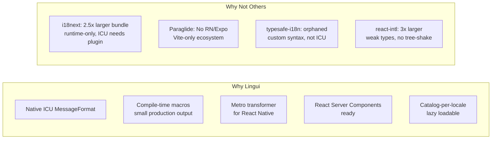
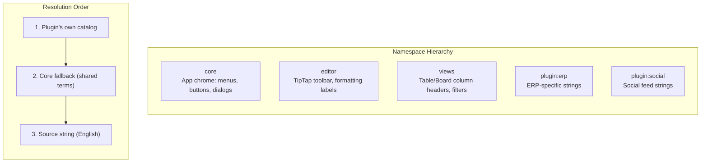
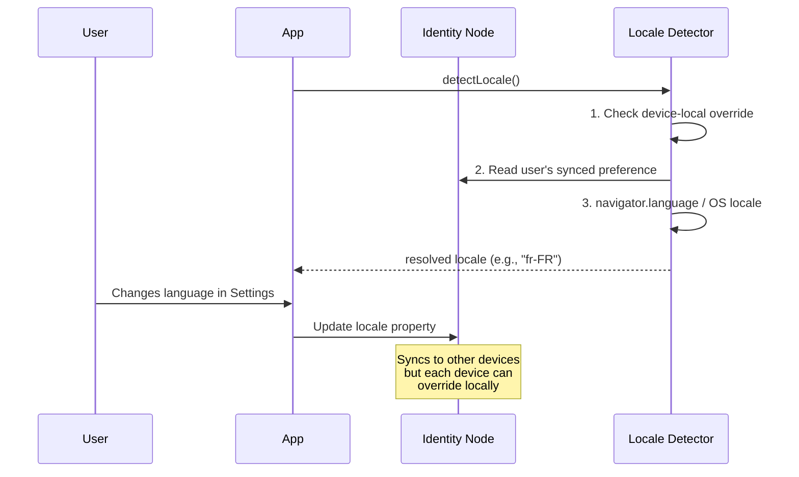
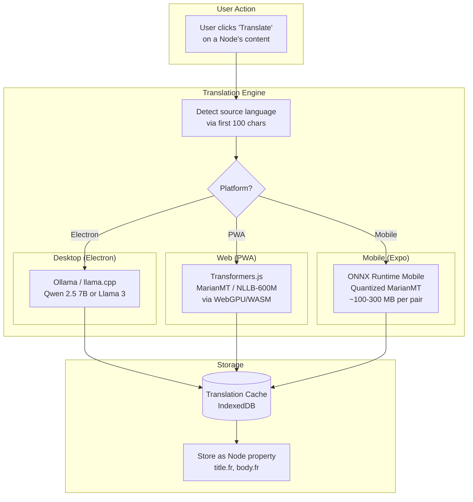
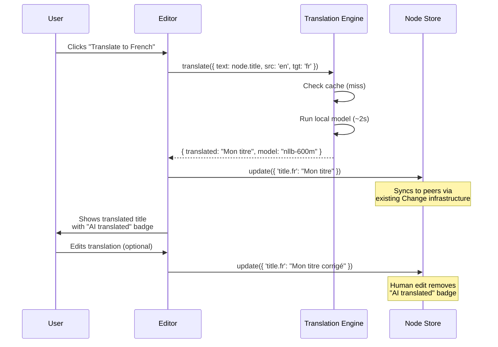
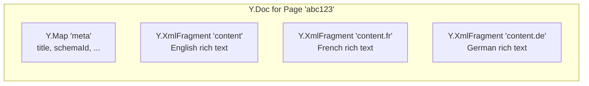
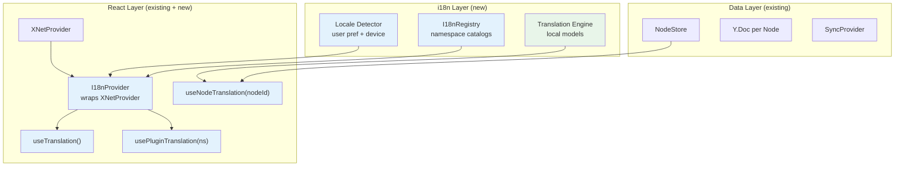

# i18n Architecture Exploration

> Internationalization for a local-first, plugin-extensible, P2P app — from UI chrome to user content to offline AI translation.

**Status**: Design Exploration  
**Last Updated**: January 2026

---

## Goals

1. **All apps internationalized** — web (PWA), desktop (Electron), mobile (Expo) share the same translation infrastructure
2. **Plugin-extensible** — third-party plugins ship their own translations, isolated by namespace
3. **Type-safe** — wrong keys or missing interpolation args are compile-time errors
4. **Offline AI translation** — translate user content (Node titles, rich text) locally without cloud APIs
5. **ICU MessageFormat** — industry-standard pluralization, gender, date/number formatting
6. **Small bundle** — only load translations for the active locale, tree-shake unused messages

---

## Architecture Overview

```mermaid
flowchart TB
    subgraph "Translation Sources"
        CORE[Core App Translations<br/>apps/web/locales/en.json]
        PKG[Package Translations<br/>packages/editor/locales/en.json]
        PLUG[Plugin Translations<br/>plugins/erp/locales/en.json]
    end

    subgraph "i18n Runtime"
        LOAD[Catalog Loader<br/>lazy per-locale]
        NS[Namespace Registry<br/>core | editor | plugin:erp]
        FMT[ICU Formatter<br/>plurals, select, dates]
    end

    subgraph "React Integration"
        HOOK["useTranslation(ns?)"]
        TRANS["<Trans> component"]
        PROVIDER[I18nProvider]
    end

    subgraph "AI Translation"
        LOCAL[Local Models<br/>MarianMT / NLLB / LLM]
        CACHE[Translation Cache<br/>IndexedDB]
    end

    CORE --> LOAD
    PKG --> LOAD
    PLUG --> LOAD
    LOAD --> NS
    NS --> FMT
    FMT --> HOOK
    FMT --> TRANS
    PROVIDER --> HOOK
    PROVIDER --> TRANS
    LOCAL --> CACHE
    CACHE --> FMT

    style LOCAL fill:#e8f5e9
    style CACHE fill:#e8f5e9
```

---

## Library Comparison

### Candidates

| Library           | Bundle (gzip) | Type Safety | Tree-Shake | Plugin Namespaces | ICU    | RN/Expo     | Status      |
| ----------------- | ------------- | ----------- | ---------- | ----------------- | ------ | ----------- | ----------- |
| **Lingui**        | ~5 KB         | Good        | Partial    | Moderate          | Native | Yes (Metro) | Active (v5) |
| **i18next**       | ~12 KB        | Partial     | No         | Excellent         | Plugin | Yes         | Mature      |
| **Paraglide**     | ~2 KB         | Excellent   | Yes        | Limited           | Plugin | Unclear     | New         |
| **typesafe-i18n** | ~1.6 KB       | Excellent   | Yes        | Limited           | Custom | Yes         | Orphaned\*  |
| **react-intl**    | ~15 KB        | Weak        | No         | Minimal           | Native | Yes         | Stable      |

\*typesafe-i18n's creator passed away in 2023; community-maintained since.

### Decision: Lingui



**Lingui advantages for xNet:**

1. **ICU MessageFormat** — standard syntax, translator tooling support, future-proof
2. **Compile-time macros** — `<Trans>` and `t` macros are compiled to optimized runtime calls, dead messages are stripped
3. **Metro transformer** — `@lingui/metro-transformer` for Expo/React Native
4. **Catalog format** — JSON catalogs per locale, lazy-loadable, splittable by namespace
5. **Active development** — v5 released recently with RSC support, SWC plugin
6. **Reasonable type safety** — generated message catalogs catch missing translations at build time

---

## Namespace Architecture

Plugins need isolated translation namespaces so they don't collide with the core app or each other.



### Plugin Manifest

```typescript
// plugins/erp/manifest.ts
export default {
  id: 'com.example.erp',
  name: 'ERP Suite',
  i18n: {
    namespace: 'erp',
    localesDir: './locales', // contains en.json, fr.json, de.json, etc.
    fallbackLocale: 'en'
  }
}
```

### Plugin Locale File

```json
// plugins/erp/locales/fr.json
{
  "invoice.title": "Facture",
  "invoice.total": "{count, plural, one {# article} other {# articles}} — {amount, number, ::currency/EUR}",
  "order.status.pending": "En attente",
  "order.status.shipped": "Expédié"
}
```

### Plugin Usage

```tsx
// Plugin code uses the xNet-provided hook
import { usePluginTranslation } from '@xnetjs/react'

function InvoiceHeader({ count, amount }: Props) {
  const { t } = usePluginTranslation('erp')

  return (
    <h1>{t('invoice.title')}</h1>
    <p>{t('invoice.total', { count, amount })}</p>
  )
}
```

### Host App Registration

```typescript
// packages/react/src/i18n/registry.ts
interface I18nNamespace {
  id: string
  catalogs: Map<string, Record<string, string>> // locale -> messages
}

class I18nRegistry {
  private namespaces = new Map<string, I18nNamespace>()

  /** Register a plugin's translations */
  register(namespace: string, locale: string, catalog: Record<string, string>) {
    const ns = this.namespaces.get(namespace) ?? { id: namespace, catalogs: new Map() }
    ns.catalogs.set(locale, catalog)
    this.namespaces.set(namespace, ns)
  }

  /** Resolve a key in a namespace with fallback chain */
  resolve(namespace: string, key: string, locale: string): string | null {
    // 1. Plugin's locale-specific catalog
    const ns = this.namespaces.get(namespace)
    const msg = ns?.catalogs.get(locale)?.[key]
    if (msg) return msg

    // 2. Plugin's fallback locale
    const fallback = ns?.catalogs.get('en')?.[key]
    if (fallback) return fallback

    // 3. Core namespace (shared terms like "Save", "Cancel")
    const core = this.namespaces.get('core')
    return core?.catalogs.get(locale)?.[key] ?? null
  }
}
```

---

## File Structure

```
packages/
  i18n/                          # New package: @xnetjs/i18n
    src/
      index.ts                   # Registry, formatters, locale detection
      registry.ts                # Namespace registry
      formatter.ts               # ICU MessageFormat wrapper
      detector.ts                # Locale detection (browser, OS, user pref)
      loader.ts                  # Lazy catalog loader
      types.ts                   # Shared types
    locales/                     # Core app translations
      en.json
      fr.json
      de.json
      es.json
      ja.json
      zh.json
      ...

  react/
    src/
      i18n/
        I18nProvider.tsx          # Context provider
        useTranslation.ts        # Hook for core namespace
        usePluginTranslation.ts  # Hook for plugin namespaces
        Trans.tsx                # Component for rich text translations

  editor/
    locales/
      en.json                    # Editor-specific strings
      fr.json
      ...

apps/
  web/locales/                   # App-specific overrides (rare)
  electron/locales/
  expo/locales/
```

---

## Locale Detection & Preference



### Locale Preference Storage

```typescript
// User's synced preference (in Identity Node)
const UserPrefsSchema = defineSchema({
  name: 'UserPreferences',
  namespace: 'xnet://xnet.dev/',
  properties: {
    locale: text(), // e.g., "fr-FR" — syncs across devices
    theme: select({ options: [{ id: 'light' }, { id: 'dark' }, { id: 'system' }] })
  }
})

// Device-local override (not synced)
// Stored in localStorage/AsyncStorage
const deviceLocaleOverride = localStorage.getItem('xnet:locale-override')
```

**Key insight**: Syncing locale preference should be opt-in. A user with a French MacBook and an English work PC probably wants different locales on each device.

---

## Offline AI Translation

### Architecture



### Model Selection by Platform

| Platform    | Model                    | Size (quantized) | Languages | Quality   | Speed                |
| ----------- | ------------------------ | ---------------- | --------- | --------- | -------------------- |
| **Desktop** | Qwen 2.5 7B via Ollama   | ~4 GB (Q4)       | All major | Excellent | ~40 tok/s (M-series) |
| **Desktop** | NLLB-200-3.3B via Ollama | ~3 GB            | 200       | Good      | ~60 tok/s            |
| **Web**     | MarianMT (per-pair)      | ~300 MB (Q8)     | Per pair  | Good      | ~5-10 tok/s (WebGPU) |
| **Web**     | NLLB-200-distilled-600M  | ~600 MB (Q4)     | 200       | Decent    | ~3-5 tok/s (WASM)    |
| **Mobile**  | MarianMT (per-pair)      | ~150 MB (Q4)     | Per pair  | Good      | ~10-20 tok/s         |

### Translation Flow

```typescript
// packages/i18n/src/translate.ts
interface TranslationRequest {
  text: string
  sourceLang: string
  targetLang: string
  context?: string // surrounding text for better quality
}

interface TranslationResult {
  translated: string
  model: string
  confidence?: number
  cached: boolean
}

interface TranslationEngine {
  translate(request: TranslationRequest): Promise<TranslationResult>
  isAvailable(): Promise<boolean>
  estimateSize(): number // bytes needed to download model
}

// Platform-specific implementations
class OllamaTranslationEngine implements TranslationEngine {
  /* ... */
}
class TransformersJSEngine implements TranslationEngine {
  /* ... */
}
class ONNXMobileEngine implements TranslationEngine {
  /* ... */
}
```

### Caching Strategy

```mermaid
flowchart LR
    REQ[Translation Request<br/>hash: sha256(text+src+tgt)]

    REQ --> CHECK{In Cache?}
    CHECK -->|Yes| HIT[Return cached<br/>instant]
    CHECK -->|No| MODEL[Run model<br/>~1-5s]
    MODEL --> STORE[Cache result<br/>IndexedDB]
    STORE --> HIT
```

Translations are cached by content hash (`blake3(text + sourceLang + targetLang)`), so:

- Same text translated again is instant
- Edited text gets a new translation
- Cache persists across sessions (IndexedDB)
- Cache can be synced as a Node (optional — share translations with peers)

### User Content Translation UX



---

## Multilingual Content in Nodes

User-generated content (titles, descriptions, rich text) can have multiple locale variants stored directly on the Node.

### Data Model

```typescript
// Option A: Flat properties with locale suffix
const PageSchema = defineSchema({
  name: 'Page',
  namespace: 'xnet://xnet.dev/',
  properties: {
    title: text(), // Primary/source language
    'title.fr': text(), // French translation
    'title.de': text() // German translation
    // Rich text: separate Y.Doc sub-docs per locale
  }
})

// Option B: Nested locale map (preferred — more flexible)
const PageSchema = defineSchema({
  name: 'Page',
  namespace: 'xnet://xnet.dev/',
  properties: {
    title: text(), // Source text
    translations: json<{
      // Locale -> translated fields
      [locale: string]: {
        title?: string
        translatedBy?: 'ai' | 'human'
        translatedAt?: number
        model?: string // e.g., "nllb-600m", "qwen-2.5-7b"
      }
    }>()
  }
})
```

### Rich Text Translation

For rich-text content (Y.Doc / TipTap), each locale gets its own `XmlFragment`:



This allows:

- Each locale's rich text syncs independently via CRDT
- Multiple users can edit different locale versions simultaneously
- The source content and translations don't conflict
- Translations can be partial (only some paragraphs translated)

---

## Integration with Existing xNet Architecture



### Hook API

```typescript
// UI translations (static, from catalogs)
function useTranslation(namespace?: string) {
  // Returns t() bound to the active locale and namespace
  const { t, locale, changeLocale } = useTranslation('editor')
  return t('toolbar.bold') // "Gras" in French
}

// Plugin translations
function usePluginTranslation(pluginId: string) {
  // Same as useTranslation but scoped to plugin namespace
  const { t } = usePluginTranslation('erp')
  return t('invoice.title') // Resolved from plugin's catalog
}

// Node content translation (AI-powered)
function useNodeTranslation(nodeId: string, targetLocale: string) {
  // Returns translated content for a Node, using cache or running model
  const {
    title, // Translated title (or source if no translation)
    isTranslated, // Whether this is a translation or source
    translatedBy, // 'ai' | 'human'
    translate, // Trigger AI translation
    isTranslating // Loading state
  } = useNodeTranslation(nodeId, 'fr')
}
```

---

## Implementation Plan

### Phase 1: Core i18n (UI translations)

1. Add `@xnetjs/i18n` package with registry, formatter, detector
2. Set up Lingui with SWC plugin for web, Metro transformer for Expo
3. Extract all hardcoded English strings from apps into catalogs
4. Add `I18nProvider` to `@xnetjs/react`
5. Implement `useTranslation()` hook
6. Add language switcher to Settings

### Phase 2: Plugin i18n

7. Define plugin manifest `i18n` field
8. Implement namespace registry and lazy catalog loading
9. Add `usePluginTranslation()` hook
10. Document plugin i18n guide for developers

### Phase 3: AI Translation (Content)

11. Integrate Transformers.js for web (MarianMT)
12. Integrate Ollama for desktop (Qwen 2.5 / NLLB)
13. Implement translation cache in IndexedDB
14. Add `useNodeTranslation()` hook
15. Add "Translate" button to editor toolbar
16. Store translations as Node properties

### Phase 4: Community Translations

17. Add translation contribution UI (suggest/approve flow)
18. Implement shared translation Yjs document (optional P2P sync)
19. Crowdsource app translations from users

---

## Open Questions

1. **How many languages to ship initially?** Top 10 (en, zh, es, fr, de, ja, pt, ko, it, ru) covers ~75% of internet users.

2. **Should AI translations sync?** Probably yes — if one peer translates a page title, others benefit. But the "AI translated" badge should sync too so peers know it's machine-generated.

3. **Should we support RTL?** Hebrew, Arabic, Persian — yes, but as Phase 2. Lingui + CSS logical properties (`inline-start`/`inline-end`) handle this.

4. **How to handle translation drift?** When source text is edited, mark translations as "stale" and offer one-click re-translation.

5. **Model download UX?** First translation triggers a model download (~300 MB for MarianMT, ~4 GB for LLM). Show progress, allow cancel, cache permanently.

---

## Key Tradeoffs

| Decision              | Choice                                  | Why                                                                 |
| --------------------- | --------------------------------------- | ------------------------------------------------------------------- |
| Library               | Lingui                                  | ICU native, compile-time macros, Metro support, active development  |
| Message format        | ICU MessageFormat                       | Industry standard, translator tooling, handles plurals/gender/dates |
| Plugin isolation      | Namespace per plugin ID                 | WordPress-proven, no collisions, lazy-loadable                      |
| Locale preference     | Device-local + synced user pref         | Different devices may want different locales                        |
| Translation storage   | Node properties (not separate entities) | Translations belong to the content, sync naturally                  |
| AI models             | Tiered by platform capability           | Desktop=LLM quality, Web/Mobile=smaller dedicated models            |
| Rich text translation | Separate Y.XmlFragment per locale       | Independent CRDT editing, no cross-locale conflicts                 |
| Translation cache     | Content-addressed (blake3 hash)         | Deduplication, instant repeat lookups                               |

---

## References

- [Lingui docs](https://lingui.dev/)
- [ICU MessageFormat spec](https://unicode-org.github.io/icu/userguide/format_parse/messages/)
- [Transformers.js translation pipeline](https://huggingface.co/docs/transformers.js/api/pipelines#translationpipeline)
- [NLLB-200 paper](https://arxiv.org/abs/2207.04672) — Meta's 200-language translation model
- [Ollama](https://ollama.ai/) — local LLM runtime
- [VS Code extension i18n](https://code.visualstudio.com/api/references/vscode-api#l10n)
- [WordPress i18n handbook](https://developer.wordpress.org/plugins/internationalization/)
