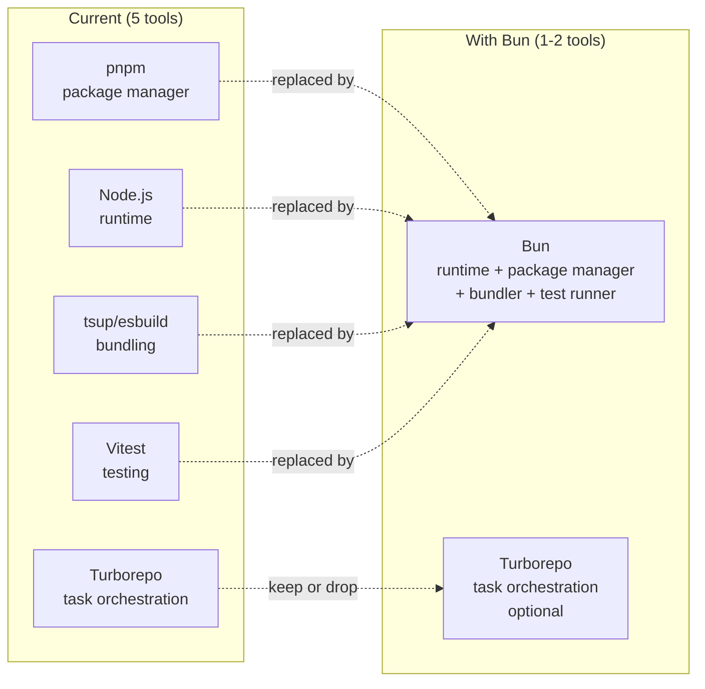
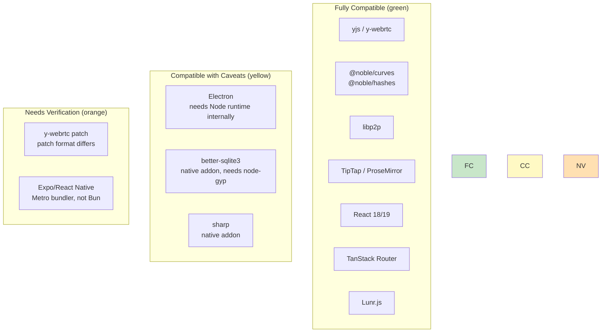
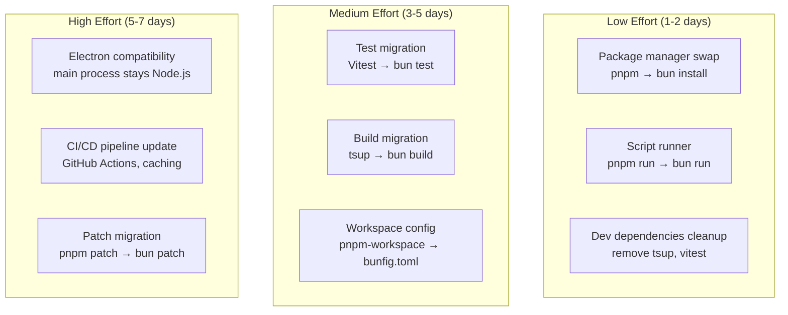
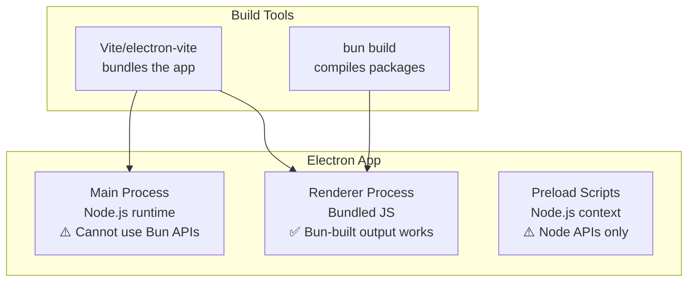
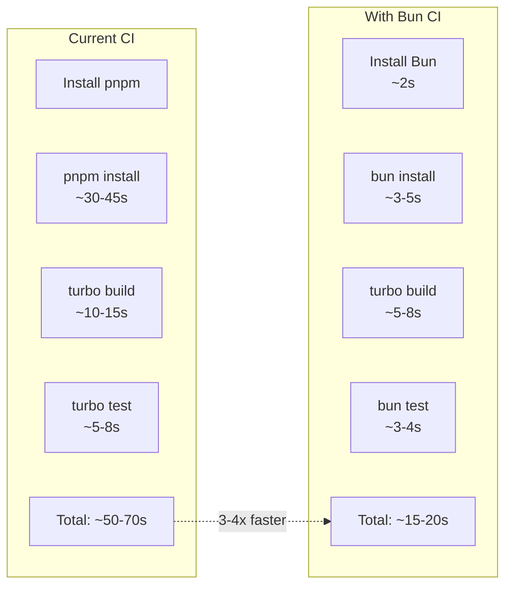
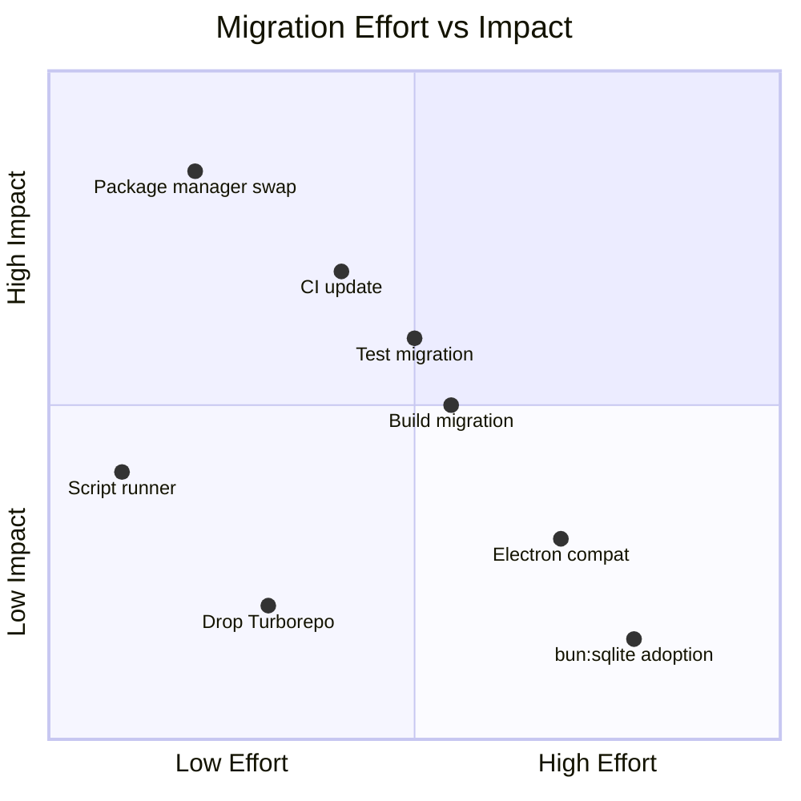

# pnpm to Bun Migration Exploration

> Evaluating Bun as a replacement for pnpm + Node.js + Turborepo + tsup + Vitest in the xNet monorepo.

**Status**: Design Exploration  
**Last Updated**: January 2026

---

## Current Toolchain

| Tool       | Role                      | Version       |
| ---------- | ------------------------- | ------------- |
| pnpm       | Package manager           | 9.0.0         |
| Node.js    | Runtime                   | ≥20.0.0       |
| Turborepo  | Monorepo task runner      | ^2.0.0        |
| tsup       | Package bundler (esbuild) | ^8.0.0        |
| Vitest     | Test runner               | ^1.6.0        |
| Vite       | Web app dev server        | (in apps/web) |
| TypeScript | Type checking             | ^5.4.0        |

### Current Metrics (Measured)

| Metric                            | Value                           |
| --------------------------------- | ------------------------------- |
| Workspace packages                | 21                              |
| pnpm-lock.yaml                    | 19,975 lines                    |
| node_modules size                 | 2.1 GB                          |
| `pnpm install --frozen-lockfile`  | ~4.1s (warm cache)              |
| `pnpm test` (857 tests, 52 files) | ~4.8s                           |
| Native deps                       | electron, better-sqlite3, sharp |
| Patched deps                      | y-webrtc@10.3.0                 |

---

## What Bun Replaces



Bun is an all-in-one JavaScript runtime that includes:

- **Package manager** (replaces pnpm) — 10-30x faster installs
- **Runtime** (replaces Node.js) — native TypeScript execution, faster startup
- **Bundler** (replaces tsup/esbuild) — `bun build` for package compilation
- **Test runner** (replaces Vitest) — `bun test` with Jest-compatible API
- **Script runner** — `bun run` faster than `pnpm run` (no shell spawn overhead)

---

## Projected Performance Improvements

### Package Installation

| Scenario                       | pnpm (measured) | Bun (projected) | Speedup |
| ------------------------------ | --------------- | --------------- | ------- |
| Cold install (empty cache)     | ~45-60s         | ~5-8s           | 7-10x   |
| Warm install (frozen lockfile) | ~4.1s           | ~0.3-0.5s       | 8-13x   |
| CI install (cache miss)        | ~30-45s         | ~3-5s           | 8-10x   |
| Add single dependency          | ~3-5s           | ~0.2-0.5s       | 10-15x  |

Bun's package manager uses:

- Hardlinks instead of symlinks (faster than pnpm's content-addressable store)
- Native Zig code for resolution + extraction
- Binary lockfile (`bun.lockb`) — faster to parse than YAML

### Test Execution

| Scenario                    | Vitest (measured) | Bun test (projected) | Speedup |
| --------------------------- | ----------------- | -------------------- | ------- |
| Full test suite (857 tests) | ~4.8s             | ~2-3s                | 1.5-2x  |
| Single package tests        | ~1.1s             | ~0.5-0.7s            | 1.5-2x  |
| TypeScript compilation      | via esbuild       | native (zero-cost)   | ~1.3x   |
| Test startup overhead       | ~500ms            | ~50ms                | 10x     |

Bun test is faster because:

- No separate TypeScript compilation step (native TS support)
- Faster module resolution (Zig-based resolver)
- Lower startup cost (no Node.js + Vitest CLI boot)
- Built-in JSX support (no plugin needed)

### Package Building

| Scenario             | tsup/esbuild | Bun build (projected) | Speedup |
| -------------------- | ------------ | --------------------- | ------- |
| Single package build | ~500ms       | ~200ms                | 2-3x    |
| Full monorepo build  | ~8-12s       | ~3-5s                 | 2-3x    |
| Watch mode rebuild   | ~200ms       | ~100ms                | 2x      |

### Script Execution

| Scenario                      | pnpm run         | bun run        | Speedup |
| ----------------------------- | ---------------- | -------------- | ------- |
| Script overhead (shell spawn) | ~150-200ms       | ~5-10ms        | 15-30x  |
| TypeScript file execution     | ~300ms (via tsx) | ~50ms (native) | 6x      |
| Dev server startup            | ~1-2s            | ~0.5-1s        | 2x      |

### Overall Developer Experience

```mermaid
gantt
    title Daily Dev Loop Comparison (typical session)
    dateFormat X
    axisFormat %s

    section pnpm + Node
    Install deps     :0, 4
    Build packages   :4, 14
    Run tests        :14, 19
    Dev server start :19, 21
    Total: 21s

    section Bun
    Install deps     :0, 1
    Build packages   :1, 5
    Run tests        :5, 8
    Dev server start :8, 9
    Total: 9s
```



---

## Compatibility Assessment

### xNet Dependencies Compatibility with Bun



### Detailed Compatibility Matrix

| Dependency         | Status                       | Notes                                                                                |
| ------------------ | ---------------------------- | ------------------------------------------------------------------------------------ |
| **yjs**            | ✅ Full                      | Pure JS, no Node APIs                                                                |
| **y-webrtc**       | ⚠️ Needs patch format change | pnpm patches → `bun patch` (different workflow)                                      |
| **@noble/curves**  | ✅ Full                      | Pure JS, ESM                                                                         |
| **@noble/hashes**  | ✅ Full                      | Pure JS, ESM                                                                         |
| **libp2p**         | ✅ Full                      | Pure JS, ESM, browser-compatible                                                     |
| **React**          | ✅ Full                      | Bun has first-class React support                                                    |
| **TipTap**         | ✅ Full                      | Pure JS, framework-agnostic                                                          |
| **Vite**           | ✅ Full                      | Bun supports Vite dev server                                                         |
| **better-sqlite3** | ⚠️ Native                    | Bun has built-in `bun:sqlite` (faster alternative)                                   |
| **sharp**          | ⚠️ Native                    | Works but needs node-gyp compatible build                                            |
| **Electron**       | ⚠️ Mixed                     | Electron's main process uses Node.js internally. Renderer can use any bundler output |
| **Expo**           | ❌ Separate                  | Metro bundler is RN-specific; Bun doesn't replace it                                 |
| **Turborepo**      | ✅ Optional                  | Works with Bun, but Bun workspaces may replace it                                    |
| **Vitest**         | ⚠️ Replaced                  | Migrate to `bun test` (different API surface)                                        |
| **tsup**           | ⚠️ Replaced                  | Migrate to `bun build`                                                               |

---

## Migration Complexity by Area



---

## Migration Plan

### Phase 1: Package Manager Only (Low Risk)

Replace pnpm with Bun's package manager while keeping everything else. This gives the biggest win (install speed) with minimal disruption.

**Changes:**

- `pnpm-workspace.yaml` → `bunfig.toml` or `package.json` workspaces field
- `pnpm-lock.yaml` → `bun.lockb`
- `pnpm install` → `bun install`
- `pnpm run` → `bun run`
- `pnpm --filter` → `bun --filter` (supported since Bun 1.1)
- Patch format: `pnpm.patchedDependencies` → `bun patch y-webrtc`

```toml
# bunfig.toml
[install]
# Use hardlinks (default, fastest)
strategy = "hardlink"

[workspace]
packages = ["packages/*", "apps/*", "infrastructure/*", "tests/*"]
```

### Phase 2: Test Runner Migration

Replace Vitest with `bun test`. The APIs are similar (Jest-compatible) but not identical.

**Key differences:**

| Feature     | Vitest                 | bun test                       |
| ----------- | ---------------------- | ------------------------------ |
| API         | `describe/it/expect`   | `describe/it/expect` (same)    |
| Mocking     | `vi.fn()`, `vi.mock()` | `mock.fn()`, `mock.module()`   |
| Coverage    | `@vitest/coverage-v8`  | Built-in (via `--coverage`)    |
| Browser env | `@vitest/browser`      | Not supported (Node-like only) |
| Config file | `vitest.config.ts`     | `bunfig.toml`                  |
| Watch mode  | `vitest --watch`       | `bun test --watch`             |
| Globals     | Optional               | Always available               |

**Migration pattern:**

```typescript
// Before (Vitest)
import { describe, it, expect, vi } from 'vitest'
vi.mock('../context')
const mockFn = vi.fn()

// After (Bun)
import { describe, it, expect, mock } from 'bun:test'
mock.module('../context', () => ({ ... }))
const mockFn = mock(() => {})
```

**Effort per package:**

| Package          | Tests   | Mocks | Estimated Effort |
| ---------------- | ------- | ----- | ---------------- |
| @xnetjs/core     | 1       | 0     | 5 min            |
| @xnetjs/crypto   | 14      | 0     | 10 min           |
| @xnetjs/identity | 9       | 0     | 10 min           |
| @xnetjs/sync     | 36      | 0     | 20 min           |
| @xnetjs/data     | 104     | 2     | 1 hr             |
| @xnetjs/react    | 25      | 3     | 1 hr             |
| @xnetjs/network  | 5       | 1     | 15 min           |
| @xnetjs/query    | 12      | 0     | 15 min           |
| @xnetjs/storage  | 8       | 0     | 10 min           |
| Integration      | 24      | 1     | 30 min           |
| **Total**        | **857** |       | **~4 hrs**       |

### Phase 3: Build System Migration

Replace tsup with `bun build` for package compilation.

```typescript
// Before: tsup.config.ts
export default defineConfig({
  entry: ['src/index.ts'],
  format: ['esm'],
  dts: true,
  external: ['react']
})

// After: package.json script
// "build": "bun build src/index.ts --outdir dist --format esm"
```

**Caveat:** Bun's bundler doesn't generate `.d.ts` files. Options:

1. Keep `tsc --emitDeclarationOnly` for types (add `"build:types": "tsc --emitDeclarationOnly"`)
2. Use a Bun plugin for DTS generation
3. Use `dts-bundle-generator` as a lightweight alternative

### Phase 4: Turborepo Decision

With Bun workspaces, Turborepo's caching becomes less critical (installs are nearly instant). But Turborepo still provides:

- Task dependency graph (`dependsOn: ["^build"]`)
- Remote caching (for CI)
- Parallel task execution

**Options:**

| Option                          | Pros                               | Cons                             |
| ------------------------------- | ---------------------------------- | -------------------------------- |
| Keep Turborepo                  | Remote cache, proven orchestration | Extra dependency                 |
| Drop Turborepo, use `bun run`   | Simpler, fewer tools               | No remote cache, manual ordering |
| Use Bun workspaces + `--filter` | Built-in, fast                     | Less mature than Turbo           |

**Recommendation:** Keep Turborepo for now (it works with Bun). Re-evaluate when Bun workspace task orchestration matures.

---

## Risks & Mitigations

### Risk 1: Electron Compatibility

Electron's main process runs Node.js, not Bun. The renderer process runs compiled JS (from Vite/esbuild), which is runtime-agnostic.



**Mitigation:** Bun is used as the **build tool and package manager**, not as the Electron runtime. This is the same pattern as using esbuild/tsup today — the compiled output is plain JS that runs anywhere.

### Risk 2: Native Addons (better-sqlite3, sharp)

Bun uses its own module resolution and native addon loading. Some native modules may need recompilation.

**Mitigation:**

- `better-sqlite3` → Bun has built-in `bun:sqlite` (faster, no native compilation needed)
- `sharp` → Only used in Electron's build pipeline; can keep node-gyp for this one dependency
- Use `--backend=copyfile` install strategy if hardlink causes issues with native addons

### Risk 3: Expo / React Native

Expo uses Metro bundler, which is entirely separate from the package manager. Bun-as-package-manager works fine for installing Expo deps, but `bun test` won't run React Native tests.

**Mitigation:** Expo app continues to use Metro for bundling and its own test runner for RN-specific tests. Bun only manages packages and runs non-RN tests.

### Risk 4: Vitest API Differences

Some Vitest features don't have direct Bun equivalents:

- `vi.useFakeTimers()` → `mock.setSystemTime()` (different API)
- `vi.mock()` hoisting → `mock.module()` (same behavior, different name)
- `@testing-library/react` → Works in Bun, but needs `happy-dom` or similar
- Vitest browser mode → Not available in Bun test

**Mitigation:** Most tests in xNet are pure logic tests (no DOM). The 25 React tests use `@testing-library/react` with jsdom, which works in Bun with `happy-dom`.

### Risk 5: Patched Dependencies

pnpm's `patchedDependencies` format doesn't work in Bun. Need to re-apply the `y-webrtc` patch.

**Mitigation:** Use `bun patch y-webrtc` to create a Bun-compatible patch, or fork the dependency.

### Risk 6: Lockfile Format

`bun.lockb` is a binary file — not human-readable, not diffable in code review.

**Mitigation:**

- Use `bun install --yarn` to generate a text-based lockfile (Yarn-compatible format) if readability is needed
- Or accept binary lockfile (Bun's default — faster to parse)
- `bun.lockb` can be inspected with `bun install --dry-run`

---

## What NOT to Migrate

| Component             | Reason to Keep Current Tool                                  |
| --------------------- | ------------------------------------------------------------ |
| Expo bundling         | Metro is required for React Native                           |
| Electron runtime      | Main process must be Node.js                                 |
| `tsc` type checking   | Bun doesn't type-check (by design)                           |
| Vite dev server (web) | Mature HMR, Bun's dev server is less proven for complex apps |
| GitHub Actions cache  | Works with both pnpm and Bun                                 |

---

## Bun's `bun:sqlite` vs better-sqlite3

The Electron app uses `better-sqlite3` for local storage. Bun provides a built-in `bun:sqlite` that's faster:

| Feature      | better-sqlite3                | bun:sqlite                           |
| ------------ | ----------------------------- | ------------------------------------ |
| Installation | Requires node-gyp compilation | Built-in (zero install)              |
| Performance  | ~50k rows/sec inserts         | ~100k rows/sec inserts               |
| API          | `db.prepare(sql).run()`       | `db.prepare(sql).run()` (compatible) |
| WAL mode     | Supported                     | Supported                            |
| Size on disk | ~5 MB + deps                  | 0 (included in Bun)                  |

**Caveat:** `bun:sqlite` only works when Bun is the runtime. Since Electron uses Node.js, the main process can't use `bun:sqlite`. This is only relevant if we later build a Bun-native server or CLI.

---

## CI/CD Impact



### GitHub Actions

```yaml
# Before
- uses: pnpm/action-setup@v2
  with:
    version: 9
- run: pnpm install --frozen-lockfile
- run: pnpm test

# After
- uses: oven-sh/setup-bun@v2
  with:
    bun-version: latest
- run: bun install --frozen-lockfile
- run: bun test
```

---

## Comparison Summary



---

## Recommendation

### Do: Migrate in Phases

**Phase 1 (Day 1-2): Package Manager** — Highest impact, lowest risk

- Replace `pnpm install` with `bun install`
- Convert workspace config
- Re-apply y-webrtc patch via `bun patch`
- Update CI to use `oven-sh/setup-bun`

**Phase 2 (Day 3-5): Test Runner** — Moderate effort, good payoff

- Migrate 857 tests from Vitest to `bun test`
- Most are simple `describe/it/expect` — near-mechanical migration
- Mock API changes are the main work

**Phase 3 (Day 5-7): Build System** — Moderate effort

- Replace `tsup` with `bun build` + `tsc --emitDeclarationOnly`
- Update `turbo.json` build tasks
- Verify all packages emit correct ESM

**Phase 4 (Day 8+): Optimization** — Optional polish

- Evaluate dropping Turborepo
- Use `bun:sqlite` for CLI/server tools (not Electron)
- Adopt Bun's built-in `Bun.serve()` for signaling server

### Don't: Full Bun Commitment

- Don't replace Vite for the web app dev server (HMR is more mature)
- Don't replace Metro for Expo (not possible)
- Don't use `bun:sqlite` in Electron (main process is Node.js)
- Don't drop TypeScript's `tsc` for type checking (Bun skips types by design)
- Don't remove Node.js from CI entirely (Electron builds need it)

---

## Projected Final State

| Metric                 | Current (pnpm)                | After Bun             | Improvement     |
| ---------------------- | ----------------------------- | --------------------- | --------------- |
| `install` (cold)       | ~50s                          | ~5s                   | **10x**         |
| `install` (warm)       | ~4s                           | ~0.4s                 | **10x**         |
| `test` (857 tests)     | ~4.8s                         | ~2.5s                 | **2x**          |
| `build` (all packages) | ~10s                          | ~4s                   | **2.5x**        |
| node_modules size      | 2.1 GB                        | ~1.5 GB               | **30% smaller** |
| Dev dependencies       | 7 (vitest, tsup, turbo, etc.) | 2 (turbo, typescript) | **5 fewer**     |
| Lockfile               | 20K lines YAML                | Binary (faster parse) | **Faster CI**   |
| Total dev loop         | ~21s                          | ~9s                   | **2.3x**        |
| CI pipeline            | ~60s                          | ~18s                  | **3.3x**        |

---

## Open Questions

1. **Should we keep Turborepo?** It adds remote caching value in CI, but Bun workspaces + `--filter` may be sufficient for local dev.

2. **Lockfile format preference?** Binary `bun.lockb` (fastest) or text-based Yarn lockfile (diffable in PRs)?

3. **When to migrate?** Before or after the i18n plan step? The migration is independent of feature work.

4. **Bun version stability?** Bun is at 1.1.x and stable for package management. Test runner and bundler are less battle-tested for complex monorepos.

5. **Team familiarity?** Anyone on the team used Bun in production?

---

## References

- [Bun documentation](https://bun.sh/docs)
- [Bun workspace support](https://bun.sh/docs/install/workspaces)
- [Bun test runner](https://bun.sh/docs/cli/test)
- [Bun build/bundler](https://bun.sh/docs/bundler)
- [bun:sqlite](https://bun.sh/docs/api/sqlite)
- [Migrating from pnpm to Bun](https://bun.sh/docs/install/pnpm)
- [Bun + Turborepo](https://turbo.build/repo/docs/getting-started/installation#bun)
- [Bun + Vite](https://bun.sh/guides/ecosystem/vite)
