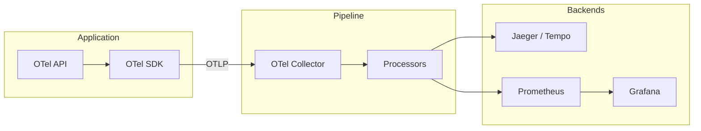
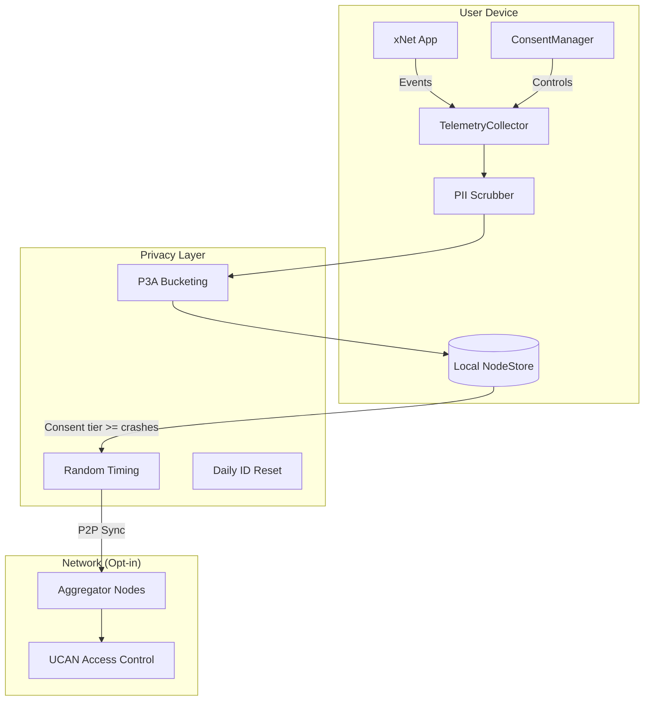
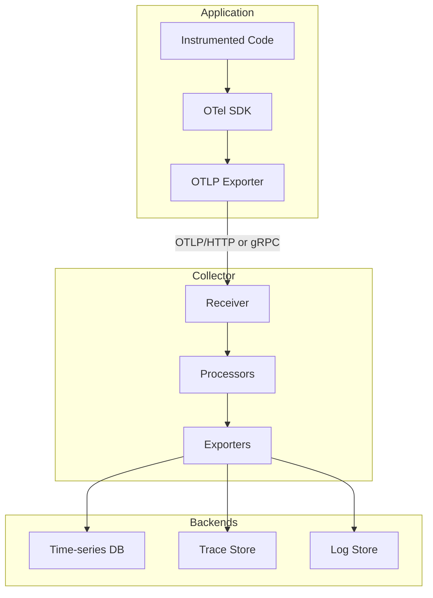
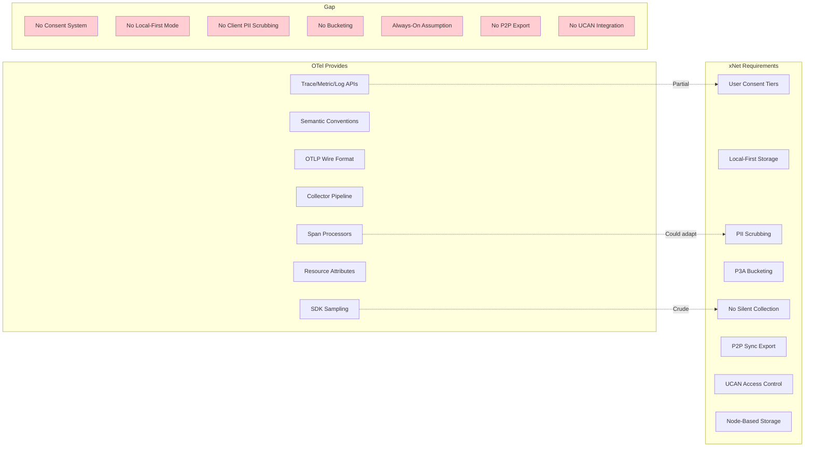
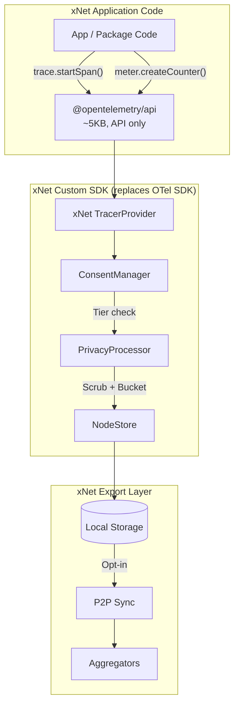
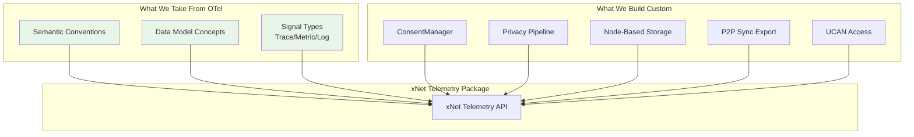
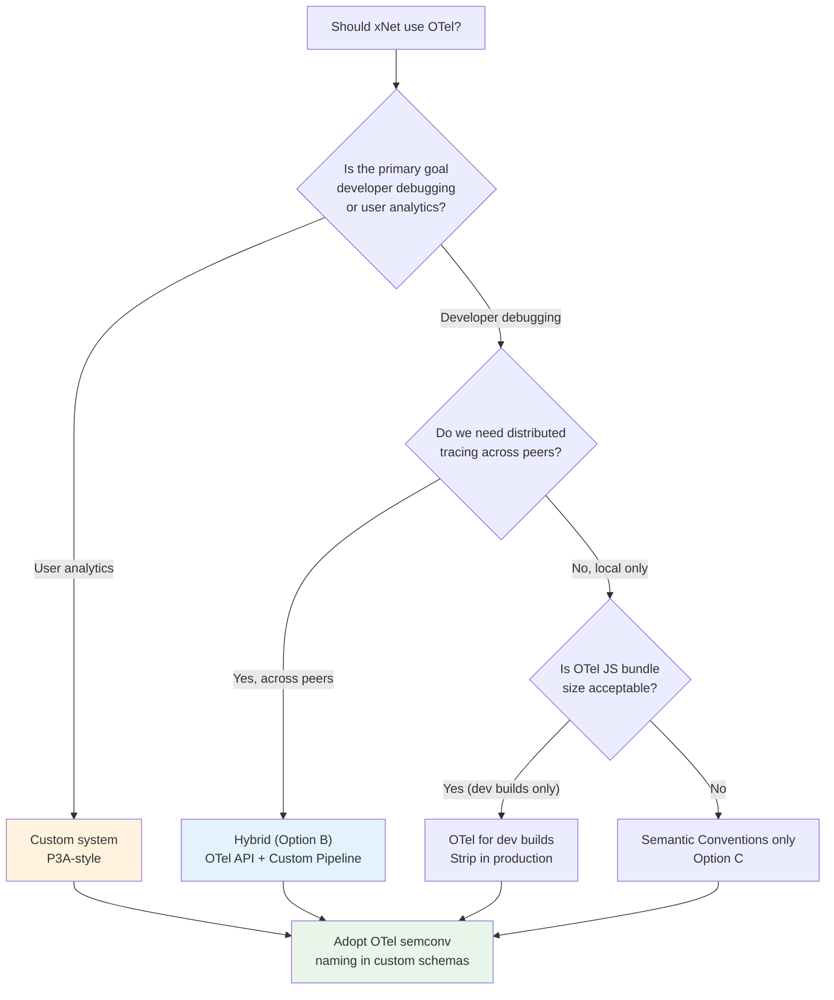
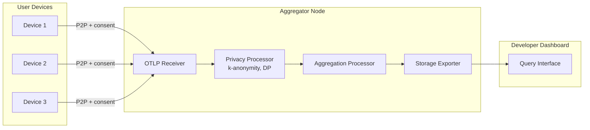
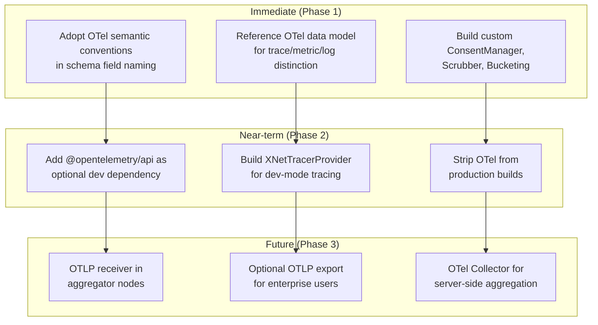

# OpenTelemetry Integration Evaluation for xNet

> Should xNet adopt OpenTelemetry instead of (or alongside) a custom telemetry system?

**Status**: ✅ COMPLETED - Decision: Custom telemetry with OTel-inspired semantics  
**Last Updated**: January 2026

## Decision Outcome

The evaluation concluded that OpenTelemetry's centralized collector model doesn't align with xNet's privacy-first, P2P architecture. The `@xnetjs/telemetry` package was implemented with:

- Custom consent-gated collection (not OTel's always-on model)
- P3A-style bucketing and scrubbing (privacy-preserving)
- Telemetry as Nodes (syncs via P2P, not to central collector)
- OTel-inspired semantic conventions where applicable

---

---

## Executive Summary

xNet currently plans a custom telemetry package (`@xnetjs/telemetry`) that treats telemetry as "just another Node type" with privacy-first consent tiers and P3A-style bucketing. This document evaluates whether OpenTelemetry (OTel) — the CNCF's vendor-neutral observability standard — should replace, supplement, or inform that design.

**Bottom line**: OpenTelemetry is designed for server-side distributed systems and assumes a centralized collector receiving all data. xNet is a local-first, privacy-sovereign, P2P desktop/mobile app. The paradigms don't align well. However, OTel's _data model_ and _semantic conventions_ are valuable design references, and a hybrid approach — using OTel's API internally for developer tracing while keeping the privacy-first consent layer custom — offers the best of both worlds.

---

## What is OpenTelemetry?

OpenTelemetry is an observability framework providing:

1. **Three signal types**: Traces, Metrics, and Logs
2. **APIs & SDKs** for instrumentation (JS, Python, Go, Java, etc.)
3. **OTLP** (OpenTelemetry Protocol) for wire format
4. **Collector** — a proxy/pipeline for receiving, processing, and exporting telemetry
5. **Semantic Conventions** — standardized attribute names (e.g., `http.request.method`, `exception.type`)



### OTel Signal Types

| Signal      | Purpose                             | xNet Relevance                          |
| ----------- | ----------------------------------- | --------------------------------------- |
| **Traces**  | Distributed request lifecycle spans | Sync operations, document operations    |
| **Metrics** | Counters, histograms, gauges        | Usage metrics, peer scores, performance |
| **Logs**    | Structured event records            | Security events, crash reports          |

### OTel JS/Browser Support

OTel has a JavaScript SDK with browser support:

- `@opentelemetry/api` — API package (~5KB)
- `@opentelemetry/sdk-trace-web` — Browser trace SDK
- `@opentelemetry/sdk-metrics` — Metrics SDK
- `@opentelemetry/exporter-trace-otlp-http` — OTLP exporter
- Auto-instrumentation for `fetch`, `XMLHttpRequest`, document load

**Status**: The browser/web SDK is functional but considered less mature than Node.js. React Native support is community-driven, not officially stable.

---

## Architecture Comparison

### Current xNet Plan: Custom Telemetry



**Key properties**:

- Telemetry stored as Nodes (same as user data)
- 5-tier consent system (off → local → crashes → anonymous → identified)
- Client-side PII scrubbing and value bucketing
- No data leaves device without explicit consent
- UCAN-gated developer access to aggregates

### OpenTelemetry Standard Architecture



**Key properties**:

- Assumes always-on export to a collector
- No built-in consent management
- No client-side privacy controls (scrubbing/bucketing)
- Designed for server-to-server communication
- Vendor-neutral but centralization-assumed

---

## Gap Analysis: OTel vs. xNet Requirements



### Detailed Gap Assessment

| xNet Requirement              | OTel Support | Gap Severity | Notes                                                                   |
| ----------------------------- | ------------ | ------------ | ----------------------------------------------------------------------- |
| **Consent tiers**             | None         | Critical     | OTel has no concept of user consent. Exporters are always-on or off.    |
| **Local-first storage**       | None         | Critical     | OTel buffers in memory, exports immediately. No persistent local store. |
| **PII scrubbing**             | Partial      | Medium       | SpanProcessors can filter, but no built-in PII detection.               |
| **P3A bucketing**             | None         | High         | OTel reports exact values. No concept of privacy-preserving ranges.     |
| **No silent collection**      | None         | Critical     | OTel collects by default once SDK is initialized.                       |
| **P2P sync export**           | None         | High         | OTLP expects HTTP/gRPC to a collector endpoint.                         |
| **UCAN access control**       | None         | High         | OTel uses standard auth (API keys, mTLS).                               |
| **Schema as Node**            | None         | Medium       | OTel has its own schema system (semconv), not Node-based.               |
| **Decentralized aggregation** | None         | High         | OTel Collector is a centralized process.                                |
| **Browser/RN support**        | Partial      | Medium       | Web SDK exists but mobile (React Native) is immature.                   |

---

## Integration Options

### Option A: Full OTel Replacement (Not Recommended)

Replace the custom plan entirely with OpenTelemetry SDK + custom exporter.

```typescript
// What this would look like
import { trace, metrics } from '@opentelemetry/api'

const tracer = trace.getTracer('xnet-sync')
const meter = metrics.getMeter('xnet-usage')

// Problem: No consent check before collection
const span = tracer.startSpan('sync.operation')
span.setAttribute('peer.id', peerId) // PII leak!
span.end() // Exports immediately
```

**Pros**:

- Standard API, community familiarity
- Auto-instrumentation for fetch/WebSocket

**Cons**:

- Must build consent, scrubbing, bucketing, local-storage, P2P-export all as custom layers on top
- OTel SDK has significant overhead for a desktop/mobile app (~100KB+ minified)
- Breaks the "telemetry as Node" unification
- React Native support is experimental
- You'd essentially be wrapping OTel with so much custom logic that the standard APIs become a hindrance

**Verdict**: The gaps are too fundamental. You'd spend more time fighting OTel's assumptions than building from scratch.

### Option B: OTel API Internally, Custom Pipeline (Hybrid)

Use the lightweight OTel API package for instrumentation, but replace the SDK/exporter layer entirely with xNet's custom pipeline.



```typescript
// packages/telemetry/src/otel-bridge.ts
import { trace, metrics, SpanProcessor } from '@opentelemetry/api'
import { ConsentManager } from './consent/manager'
import { scrubAttributes } from './collection/scrubbing'
import { bucketValue } from './collection/bucketing'

// Custom TracerProvider that respects consent
class XNetTracerProvider implements TracerProvider {
  constructor(
    private consent: ConsentManager,
    private store: NodeStore
  ) {}

  getTracer(name: string): Tracer {
    return new XNetTracer(name, this.consent, this.store)
  }
}

// Custom SpanProcessor that scrubs and stores locally
class PrivacySpanProcessor implements SpanProcessor {
  onEnd(span: ReadableSpan) {
    if (this.consent.tier === 'off') return // No-op

    const scrubbed = scrubAttributes(span.attributes)
    const bucketed = bucketValues(scrubbed)

    // Store as a Node, not export to collector
    this.store.create({
      schemaId: 'xnet://xnet.dev/telemetry/Trace',
      properties: {
        name: span.name,
        duration: bucketDuration(span.duration),
        attributes: bucketed,
        status: span.status
      }
    })
  }
}

// Register with OTel API
trace.setGlobalTracerProvider(new XNetTracerProvider(consentManager, nodeStore))
```

**Pros**:

- Familiar API for developers who know OTel
- Lightweight (~5KB API package)
- Can use OTel auto-instrumentation libraries selectively
- Doesn't lock into OTel's export pipeline
- Clean separation: OTel API for instrumentation, xNet for everything else
- Easy to add standard OTLP export later for debugging

**Cons**:

- OTel API types may not map perfectly to xNet's privacy requirements
- Slight abstraction overhead (API → custom provider)
- Must maintain compatibility with OTel API version updates
- Metric instruments (Counter, Histogram) are designed for exact values, not bucketed ranges

**Verdict**: Viable hybrid. Low cost to adopt, easy to remove if it doesn't work out.

### Option C: Adopt OTel Semantic Conventions Only (Recommended Starting Point)

Don't use OTel's code at all. Instead, adopt their _naming conventions_ and _data model concepts_ as design references for the custom system.

```typescript
// Current xNet plan (custom everything)
telemetry.report({
  errorType: 'RangeError',
  errorMessage: 'Invalid array length',
  component: 'TableView',
  appVersion: '1.2.3'
})

// Enhanced with OTel semantic convention naming
telemetry.report({
  'exception.type': 'RangeError', // OTel semconv
  'exception.message': 'Invalid array length', // OTel semconv
  'code.namespace': 'TableView', // OTel semconv
  'service.version': '1.2.3', // OTel semconv
  'xnet.consent.tier': 'crashes', // xNet-specific
  'xnet.privacy.bucketed': true // xNet-specific
})
```



**What to adopt from OTel semantic conventions**:

| OTel Convention                                               | xNet Usage                 |
| ------------------------------------------------------------- | -------------------------- |
| `exception.type`, `exception.message`, `exception.stacktrace` | CrashReport schema fields  |
| `service.name`, `service.version`                             | App identification         |
| `os.type`, `os.version`                                       | Platform context           |
| `device.id` (if consented)                                    | Identified tier only       |
| `session.id`                                                  | Only if tier >= identified |
| `browser.language`                                            | Locale bucketing           |
| Trace model (spans, parent-child)                             | Sync operation tracing     |
| Metric model (counter, histogram)                             | Usage metric types         |

**Pros**:

- Zero dependency cost
- Naming compatibility with the broader ecosystem
- Future interop if we ever want to bridge to OTel
- No impedance mismatch with xNet's privacy model
- Freedom to design the best API for the use case

**Cons**:

- No auto-instrumentation libraries
- No community tooling compatibility (Jaeger, Grafana)
- Must maintain our own API (small con — we'd do this anyway)

**Verdict**: Best starting point. Adopt conventions, build custom. Leave the door open for Option B later.

---

## Decision Framework



### When OTel Makes Sense

1. **Developer/debug builds** — Full OTel tracing for sync debugging, stripped in production
2. **Aggregator nodes** — If xNet ever runs server-side aggregators, OTel Collector is excellent for that
3. **Enterprise deployments** — Companies may want to pipe xNet telemetry into their existing OTel infrastructure

### When OTel Doesn't Make Sense

1. **End-user privacy telemetry** — OTel has no consent model
2. **Local-first storage** — OTel assumes immediate export
3. **P2P/decentralized export** — OTLP requires a collector endpoint
4. **Mobile (React Native)** — OTel RN support is immature
5. **Bundle size sensitive** — The full OTel SDK adds significant weight

---

## Recommended Approach: Phased Hybrid

### Phase 1: Semantic Conventions (Now)

Adopt OTel naming conventions in xNet's custom telemetry schemas. Zero code dependency.

```typescript
// Align schema field names with OTel semconv where applicable
const CrashReportSchema = defineSchema({
  name: 'CrashReport',
  namespace: 'xnet://xnet.dev/telemetry/',
  properties: {
    // OTel-aligned names
    exceptionType: text({ required: true }), // exception.type
    exceptionMessage: text({ required: true }), // exception.message
    exceptionStacktrace: text({ scrubPaths: true }), // exception.stacktrace
    serviceName: text(), // service.name
    serviceVersion: text(), // service.version
    osType: select({ options: ['macos', 'windows', 'linux', 'ios', 'android', 'web'] as const }),

    // xNet-specific (no OTel equivalent)
    consentTier: select({ options: ['local', 'crashes', 'anonymous', 'identified'] as const }),
    privacyBucketed: boolean()
  }
})
```

### Phase 2: OTel API Bridge for Dev Tracing (Later)

Add optional OTel API integration for developer debugging of sync operations.

```typescript
// packages/telemetry/src/dev-tracing.ts
// Only active in development builds

import { trace } from '@opentelemetry/api'

export function instrumentSync() {
  if (process.env.NODE_ENV !== 'development') return

  const tracer = trace.getTracer('xnet-sync', '0.1.0')

  // Wrap sync operations with spans
  const original = SyncProvider.prototype.sync
  SyncProvider.prototype.sync = async function (...args) {
    const span = tracer.startSpan('sync.execute', {
      attributes: {
        'xnet.sync.peer_count': args[0].peers.length,
        'xnet.sync.changes': args[0].changes.length
      }
    })
    try {
      const result = await original.apply(this, args)
      span.setStatus({ code: SpanStatusCode.OK })
      return result
    } catch (error) {
      span.setStatus({ code: SpanStatusCode.ERROR, message: error.message })
      throw error
    } finally {
      span.end()
    }
  }
}
```

### Phase 3: OTel Collector for Aggregators (Future)

If xNet builds server-side aggregator nodes, use OTel Collector as the receiving pipeline.



---

## Bundle Size Comparison

| Approach                              | Additional Bundle Size | Notes                        |
| ------------------------------------- | ---------------------- | ---------------------------- |
| Custom only (current plan)            | ~0 KB (built in)       | Part of `@xnetjs/telemetry`  |
| OTel API only                         | ~5 KB                  | Lightweight, no SDK          |
| OTel API + Web SDK                    | ~80-120 KB             | Full trace/metric collection |
| OTel API + SDK + auto-instrumentation | ~150-200 KB            | fetch, document load, etc.   |

For a desktop/mobile app where bundle size matters less than web, the API-only approach is negligible. The full SDK is harder to justify for production builds.

---

## Comparison: What Others Do

| Project           | Approach           | Why                                       |
| ----------------- | ------------------ | ----------------------------------------- |
| **Obsidian**      | Zero telemetry     | Privacy-first desktop app                 |
| **VS Code**       | Custom (not OTel)  | Tiered opt-in, custom schemas             |
| **Brave**         | Custom P3A         | Privacy-preserving analytics              |
| **Firefox**       | Custom Glean SDK   | Mozilla-specific privacy needs            |
| **Grafana**       | Full OTel          | Server-side, observability is the product |
| **Vercel**        | Full OTel          | Server-side, standard infra               |
| **Electron apps** | Sentry (custom)    | Crash reporting focus                     |
| **IPFS/libp2p**   | Prometheus metrics | Server-side node operators                |

**Pattern**: Privacy-focused client-side apps universally use custom telemetry. OTel adoption is in server-side and enterprise tooling.

---

## Risk Assessment

| Risk                                 | Likelihood | Impact   | Mitigation                                       |
| ------------------------------------ | ---------- | -------- | ------------------------------------------------ |
| OTel SDK introduces privacy leak     | Medium     | Critical | Only use API package, not SDK, in production     |
| OTel API breaking changes            | Low        | Medium   | Pin versions, thin adapter layer                 |
| OTel RN support never matures        | Medium     | Low      | Custom system works on all platforms             |
| Custom system re-invents OTel poorly | Medium     | Medium   | Reference OTel design docs during implementation |
| Community expects OTel compatibility | Low        | Low      | Publish OTLP bridge for enterprise users         |

---

## Recommendation



**Summary**:

1. **Don't adopt OTel as the primary telemetry system** — The privacy gaps are too fundamental
2. **Do adopt OTel's semantic conventions** — Free interop, good naming standards
3. **Do keep the door open** — The API-only bridge pattern costs almost nothing
4. **Do consider OTel for server-side aggregators** — It's excellent for that use case
5. **Don't delay the custom system** — Waiting for OTel to solve privacy-first use cases would be indefinite

The current plan in `docs/plans/plan03_1TelemetryAndNetworkSecurity/` is sound. The main enhancement is aligning field names with OTel semantic conventions where they overlap, and designing the aggregator layer (Phase 5 in the current plan) with an OTLP-compatible receiver.

---

## References

- [OpenTelemetry Documentation](https://opentelemetry.io/docs/)
- [OTel JavaScript SDK](https://opentelemetry.io/docs/languages/js/)
- [OTel Semantic Conventions](https://opentelemetry.io/docs/specs/semconv/)
- [OTel Client-side/Web Platform](https://opentelemetry.io/docs/platforms/client-apps/web/)
- [Brave P3A](https://brave.com/privacy-preserving-product-analytics-p3a/)
- [Mozilla Glean](https://docs.telemetry.mozilla.org/concepts/glean/glean.html)
- [xNet Telemetry Design](./TELEMETRY_DESIGN.md)
- [xNet Plan Step 03.1](../plans/plan03_1TelemetryAndNetworkSecurity/README.md)

---

_This is an exploration document. The recommendation is to proceed with the current custom telemetry plan, enhanced with OTel semantic convention alignment._
