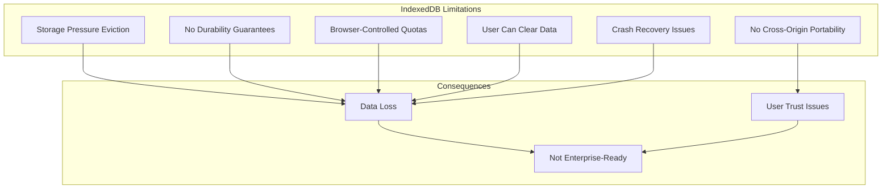
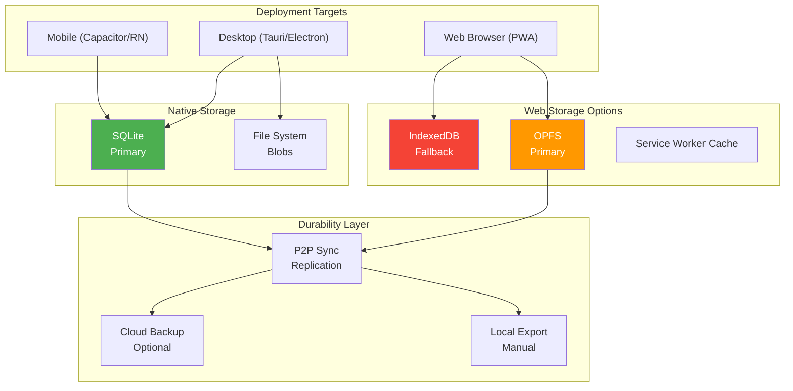
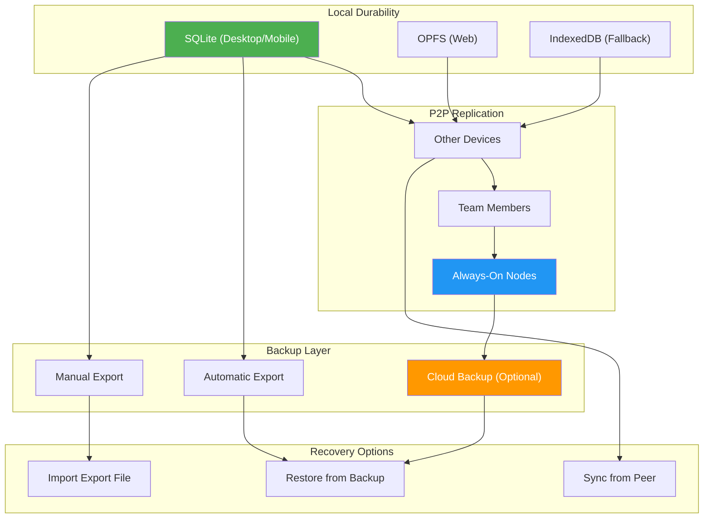
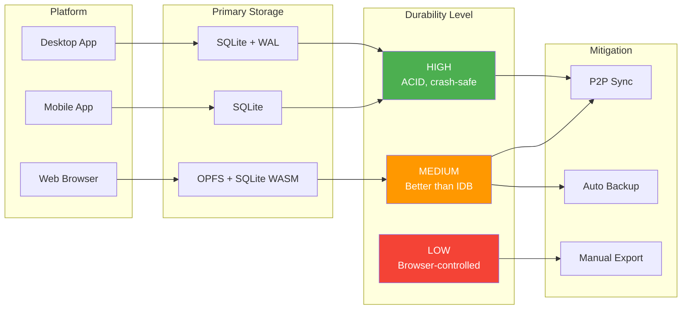

# xNet Persistence & Durability Architecture

> **Status**: ✅ IMPLEMENTED - The `@xnetjs/sqlite` package provides durable storage

## Implementation Status

The persistence architecture has been implemented at `packages/sqlite/`:

- [x] **SQLite Adapter** - `adapter.ts` with unified interface
- [x] **Electron Adapter** - `adapters/electron.ts` using better-sqlite3
- [x] **Web Adapter** - `adapters/web.ts` using sql.js with OPFS
- [x] **Web Worker** - `adapters/web-worker.ts` for off-main-thread
- [x] **Expo Adapter** - `adapters/expo.ts` for React Native
- [x] **Memory Adapter** - `adapters/memory.ts` for testing
- [x] **Full-Text Search** - `fts.ts` for FTS5 support
- [x] **Query Builder** - `query-builder.ts` for type-safe queries
- [x] **Schema Management** - `schema.ts` for migrations
- [x] **Diagnostics** - `diagnostics.ts` for debugging

The storage layer in `@xnetjs/storage` uses these adapters to provide durable persistence across all platforms.

---

## The Problem with IndexedDB

IndexedDB is convenient but fundamentally unsuitable for production data that users cannot afford to lose:



### Real-World Failure Scenarios

| Scenario               | IndexedDB Behavior           | User Impact                             |
| ---------------------- | ---------------------------- | --------------------------------------- |
| Low disk space         | Browser evicts data silently | Complete data loss                      |
| iOS Safari             | 7-day expiry for PWA data    | Data disappears after a week of non-use |
| Incognito/Private mode | Data never persisted         | Users lose work                         |
| Browser update         | Can corrupt IDB              | Potential data loss                     |
| User clears cache      | Includes IDB                 | Accidental data loss                    |
| Multiple tabs          | Complex locking              | Potential corruption                    |

---

## Persistence Strategy by Platform



---

## Tier 1: Native Desktop/Mobile (Recommended for Production)

### SQLite as Primary Storage

SQLite is the gold standard for local-first applications:

- **ACID compliant** — Transactions are atomic, consistent, isolated, durable
- **Battle-tested** — Used by virtually every mobile app, browsers themselves
- **Crash-safe** — WAL mode provides excellent crash recovery
- **Portable** — Single file, can be copied/backed up
- **Fast** — Highly optimized, supports complex queries
- **Size** — Handles databases up to 281 TB

```typescript
// packages/storage/src/adapters/sqlite.ts

import Database from 'better-sqlite3'
import { join } from 'path'
import { existsSync, mkdirSync } from 'fs'

export interface SQLiteConfig {
  dataDir: string
  walMode: boolean
  synchronous: 'OFF' | 'NORMAL' | 'FULL' | 'EXTRA'
  busyTimeout: number
}

export class SQLiteAdapter implements StorageAdapter {
  private db: Database.Database
  private config: SQLiteConfig

  constructor(config: Partial<SQLiteConfig> = {}) {
    this.config = {
      dataDir: config.dataDir || this.getDefaultDataDir(),
      walMode: config.walMode ?? true,
      synchronous: config.synchronous || 'NORMAL',
      busyTimeout: config.busyTimeout || 5000
    }

    this.ensureDataDir()
    this.db = this.openDatabase()
    this.initSchema()
  }

  private getDefaultDataDir(): string {
    // Platform-specific data directories
    const platform = process.platform
    const appName = 'xnet'

    switch (platform) {
      case 'darwin':
        return join(process.env.HOME!, 'Library', 'Application Support', appName)
      case 'win32':
        return join(process.env.APPDATA!, appName)
      case 'linux':
        return join(process.env.HOME!, '.local', 'share', appName)
      default:
        return join(process.env.HOME!, `.${appName}`)
    }
  }

  private ensureDataDir(): void {
    if (!existsSync(this.config.dataDir)) {
      mkdirSync(this.config.dataDir, { recursive: true })
    }
  }

  private openDatabase(): Database.Database {
    const dbPath = join(this.config.dataDir, 'xnet.db')
    const db = new Database(dbPath)

    // Configure for durability
    if (this.config.walMode) {
      db.pragma('journal_mode = WAL')
    }
    db.pragma(`synchronous = ${this.config.synchronous}`)
    db.pragma(`busy_timeout = ${this.config.busyTimeout}`)
    db.pragma('foreign_keys = ON')

    // Optimize for performance
    db.pragma('cache_size = -64000') // 64MB cache
    db.pragma('temp_store = MEMORY')

    return db
  }

  private initSchema(): void {
    this.db.exec(`
      -- Document metadata
      CREATE TABLE IF NOT EXISTS documents (
        id TEXT PRIMARY KEY,
        workspace_id TEXT NOT NULL,
        type TEXT NOT NULL,
        created_at INTEGER NOT NULL,
        updated_at INTEGER NOT NULL,
        deleted_at INTEGER,

        CONSTRAINT fk_workspace
          FOREIGN KEY (workspace_id)
          REFERENCES workspaces(id)
          ON DELETE CASCADE
      );

      -- CRDT state vectors for sync
      CREATE TABLE IF NOT EXISTS crdt_state (
        document_id TEXT PRIMARY KEY,
        state_vector BLOB NOT NULL,
        update_clock INTEGER NOT NULL DEFAULT 0,

        CONSTRAINT fk_document
          FOREIGN KEY (document_id)
          REFERENCES documents(id)
          ON DELETE CASCADE
      );

      -- CRDT updates (append-only log)
      CREATE TABLE IF NOT EXISTS crdt_updates (
        id INTEGER PRIMARY KEY AUTOINCREMENT,
        document_id TEXT NOT NULL,
        update_data BLOB NOT NULL,
        timestamp INTEGER NOT NULL,
        origin TEXT, -- peer ID that created this update

        CONSTRAINT fk_document
          FOREIGN KEY (document_id)
          REFERENCES documents(id)
          ON DELETE CASCADE
      );

      -- Workspaces
      CREATE TABLE IF NOT EXISTS workspaces (
        id TEXT PRIMARY KEY,
        name TEXT NOT NULL,
        created_at INTEGER NOT NULL,
        encryption_key_id TEXT,
        settings TEXT -- JSON
      );

      -- Blobs (images, files, etc.)
      CREATE TABLE IF NOT EXISTS blobs (
        hash TEXT PRIMARY KEY, -- content-addressed
        data BLOB NOT NULL,
        mime_type TEXT,
        size INTEGER NOT NULL,
        created_at INTEGER NOT NULL,
        reference_count INTEGER DEFAULT 1
      );

      -- Full-text search index
      CREATE VIRTUAL TABLE IF NOT EXISTS search_index USING fts5(
        document_id,
        title,
        content,
        tags,
        tokenize='porter unicode61'
      );

      -- Indexes for common queries
      CREATE INDEX IF NOT EXISTS idx_documents_workspace
        ON documents(workspace_id);
      CREATE INDEX IF NOT EXISTS idx_documents_type
        ON documents(type);
      CREATE INDEX IF NOT EXISTS idx_documents_updated
        ON documents(updated_at);
      CREATE INDEX IF NOT EXISTS idx_crdt_updates_document
        ON crdt_updates(document_id);
      CREATE INDEX IF NOT EXISTS idx_crdt_updates_timestamp
        ON crdt_updates(timestamp);
    `)
  }

  // ============================================
  // CRDT Operations
  // ============================================

  /**
   * Store a Yjs update with durability guarantee
   */
  storeUpdate(documentId: string, update: Uint8Array, origin?: string): void {
    const stmt = this.db.prepare(`
      INSERT INTO crdt_updates (document_id, update_data, timestamp, origin)
      VALUES (?, ?, ?, ?)
    `)

    this.db.transaction(() => {
      stmt.run(documentId, update, Date.now(), origin)

      // Update the document's updated_at
      this.db
        .prepare(
          `
        UPDATE documents SET updated_at = ? WHERE id = ?
      `
        )
        .run(Date.now(), documentId)
    })()
  }

  /**
   * Get all updates for a document (for reconstruction)
   */
  getUpdates(documentId: string, since?: number): Uint8Array[] {
    const stmt = since
      ? this.db.prepare(`
          SELECT update_data FROM crdt_updates
          WHERE document_id = ? AND timestamp > ?
          ORDER BY id ASC
        `)
      : this.db.prepare(`
          SELECT update_data FROM crdt_updates
          WHERE document_id = ?
          ORDER BY id ASC
        `)

    const rows = since ? stmt.all(documentId, since) : stmt.all(documentId)

    return rows.map((row: any) => row.update_data)
  }

  /**
   * Store merged state vector
   */
  storeStateVector(documentId: string, stateVector: Uint8Array): void {
    this.db
      .prepare(
        `
      INSERT OR REPLACE INTO crdt_state (document_id, state_vector, update_clock)
      VALUES (?, ?, COALESCE(
        (SELECT update_clock + 1 FROM crdt_state WHERE document_id = ?),
        1
      ))
    `
      )
      .run(documentId, stateVector, documentId)
  }

  /**
   * Get state vector for sync
   */
  getStateVector(documentId: string): Uint8Array | null {
    const row = this.db
      .prepare(
        `
      SELECT state_vector FROM crdt_state WHERE document_id = ?
    `
      )
      .get(documentId) as { state_vector: Uint8Array } | undefined

    return row?.state_vector ?? null
  }

  // ============================================
  // Compaction (important for long-lived docs)
  // ============================================

  /**
   * Compact CRDT updates by merging them
   * Call periodically to prevent unbounded growth
   */
  compactDocument(documentId: string, mergedUpdate: Uint8Array): void {
    this.db.transaction(() => {
      // Delete old updates
      this.db
        .prepare(
          `
        DELETE FROM crdt_updates WHERE document_id = ?
      `
        )
        .run(documentId)

      // Insert merged update
      this.db
        .prepare(
          `
        INSERT INTO crdt_updates (document_id, update_data, timestamp, origin)
        VALUES (?, ?, ?, 'compaction')
      `
        )
        .run(documentId, mergedUpdate, Date.now())
    })()
  }

  // ============================================
  // Backup & Recovery
  // ============================================

  /**
   * Create a backup of the entire database
   */
  async backup(targetPath: string): Promise<void> {
    await this.db.backup(targetPath)
  }

  /**
   * Get database file path for manual backup
   */
  getDatabasePath(): string {
    return join(this.config.dataDir, 'xnet.db')
  }

  /**
   * Verify database integrity
   */
  checkIntegrity(): { ok: boolean; errors: string[] } {
    const result = this.db.pragma('integrity_check') as { integrity_check: string }[]
    const errors = result.map((r) => r.integrity_check).filter((r) => r !== 'ok')

    return {
      ok: errors.length === 0,
      errors
    }
  }

  // ============================================
  // Lifecycle
  // ============================================

  close(): void {
    this.db.close()
  }

  /**
   * Ensure all writes are flushed to disk
   */
  checkpoint(): void {
    this.db.pragma('wal_checkpoint(TRUNCATE)')
  }
}
```

### Tauri Integration

```rust
// src-tauri/src/storage.rs

use rusqlite::{Connection, params};
use std::path::PathBuf;
use tauri::api::path::app_data_dir;

#[tauri::command]
pub fn get_database_path(app_handle: tauri::AppHandle) -> Result<String, String> {
    let data_dir = app_data_dir(&app_handle.config())
        .ok_or("Failed to get app data directory")?;

    std::fs::create_dir_all(&data_dir)
        .map_err(|e| e.to_string())?;

    let db_path = data_dir.join("xnet.db");
    Ok(db_path.to_string_lossy().to_string())
}

#[tauri::command]
pub fn store_crdt_update(
    db_path: String,
    document_id: String,
    update: Vec<u8>,
) -> Result<(), String> {
    let conn = Connection::open(&db_path)
        .map_err(|e| e.to_string())?;

    conn.execute(
        "INSERT INTO crdt_updates (document_id, update_data, timestamp) VALUES (?1, ?2, ?3)",
        params![document_id, update, chrono::Utc::now().timestamp_millis()],
    ).map_err(|e| e.to_string())?;

    Ok(())
}

#[tauri::command]
pub fn backup_database(db_path: String, backup_path: String) -> Result<(), String> {
    let src = Connection::open(&db_path)
        .map_err(|e| e.to_string())?;

    src.backup(rusqlite::DatabaseName::Main, &backup_path, None)
        .map_err(|e| e.to_string())?;

    Ok(())
}
```

---

## Tier 2: Web Browser (OPFS + IndexedDB Fallback)

### Origin Private File System (OPFS)

OPFS is a newer API that provides better durability than IndexedDB:

- **Dedicated storage** — Not shared with cache/cookies
- **File-based** — More resistant to corruption
- **Synchronous access** — Via Web Workers (better for SQLite)
- **Better quotas** — Usually higher than IDB

```typescript
// packages/storage/src/adapters/opfs.ts

/**
 * OPFS-based storage adapter with SQLite via sql.js or wa-sqlite
 *
 * This provides much better durability than IndexedDB:
 * - Dedicated file storage (not evicted with cache)
 * - Can use SQLite WASM for ACID guarantees
 * - Synchronous access via OPFS in workers
 */

import { SQLiteFS, createSQLiteThread } from 'wa-sqlite'

export class OPFSAdapter implements StorageAdapter {
  private sqlite: any
  private db: any
  private ready: Promise<void>

  constructor(workspaceId: string) {
    this.ready = this.initialize(workspaceId)
  }

  private async initialize(workspaceId: string): Promise<void> {
    // Check OPFS support
    if (!('storage' in navigator) || !('getDirectory' in navigator.storage)) {
      throw new Error('OPFS not supported - falling back to IndexedDB')
    }

    // Get OPFS root
    const root = await navigator.storage.getDirectory()
    const xnetDir = await root.getDirectoryHandle('xnet', { create: true })
    const workspaceDir = await xnetDir.getDirectoryHandle(workspaceId, { create: true })

    // Initialize SQLite with OPFS backend
    const { default: SQLiteESMFactory } = await import('wa-sqlite/dist/wa-sqlite.mjs')
    const { OPFSCoopSyncVFS } = await import('wa-sqlite/src/OPFSCoopSyncVFS.js')

    const module = await SQLiteESMFactory()
    this.sqlite = SQLite.create(module)

    // Register OPFS VFS
    const vfs = new OPFSCoopSyncVFS('xnet-vfs', workspaceDir)
    await vfs.isReady
    this.sqlite.vfs_register(vfs, true)

    // Open database
    this.db = await this.sqlite.open_v2(
      'xnet.db',
      SQLite.SQLITE_OPEN_READWRITE | SQLite.SQLITE_OPEN_CREATE,
      'xnet-vfs'
    )

    await this.initSchema()
  }

  private async initSchema(): Promise<void> {
    await this.sqlite.exec(
      this.db,
      `
      PRAGMA journal_mode = WAL;
      PRAGMA synchronous = NORMAL;

      CREATE TABLE IF NOT EXISTS documents (
        id TEXT PRIMARY KEY,
        type TEXT NOT NULL,
        created_at INTEGER NOT NULL,
        updated_at INTEGER NOT NULL
      );

      CREATE TABLE IF NOT EXISTS crdt_updates (
        id INTEGER PRIMARY KEY AUTOINCREMENT,
        document_id TEXT NOT NULL,
        update_data BLOB NOT NULL,
        timestamp INTEGER NOT NULL
      );

      CREATE INDEX IF NOT EXISTS idx_updates_doc
        ON crdt_updates(document_id);
    `
    )
  }

  async storeUpdate(documentId: string, update: Uint8Array): Promise<void> {
    await this.ready

    await this.sqlite.exec(
      this.db,
      `
      INSERT INTO crdt_updates (document_id, update_data, timestamp)
      VALUES (?, ?, ?)
    `,
      [documentId, update, Date.now()]
    )
  }

  async getUpdates(documentId: string): Promise<Uint8Array[]> {
    await this.ready

    const results: Uint8Array[] = []
    await this.sqlite.exec(
      this.db,
      `
      SELECT update_data FROM crdt_updates
      WHERE document_id = ?
      ORDER BY id ASC
    `,
      [documentId],
      (row: any) => {
        results.push(new Uint8Array(row[0]))
      }
    )

    return results
  }

  /**
   * Request persistent storage to reduce eviction risk
   */
  async requestPersistence(): Promise<boolean> {
    if (navigator.storage && navigator.storage.persist) {
      return await navigator.storage.persist()
    }
    return false
  }

  /**
   * Check storage persistence status
   */
  async isPersisted(): Promise<boolean> {
    if (navigator.storage && navigator.storage.persisted) {
      return await navigator.storage.persisted()
    }
    return false
  }

  /**
   * Get storage quota info
   */
  async getStorageEstimate(): Promise<{ usage: number; quota: number }> {
    if (navigator.storage && navigator.storage.estimate) {
      const estimate = await navigator.storage.estimate()
      return {
        usage: estimate.usage || 0,
        quota: estimate.quota || 0
      }
    }
    return { usage: 0, quota: 0 }
  }
}
```

### Storage Persistence Request

Always request persistent storage on web:

```typescript
// packages/storage/src/web/persistence.ts

export async function ensurePersistentStorage(): Promise<{
  persisted: boolean
  quota: number
  usage: number
  warnings: string[]
}> {
  const warnings: string[] = []

  // Check if storage API is available
  if (!navigator.storage) {
    warnings.push('Storage API not available')
    return { persisted: false, quota: 0, usage: 0, warnings }
  }

  // Request persistence
  let persisted = false
  if (navigator.storage.persist) {
    persisted = await navigator.storage.persist()
    if (!persisted) {
      warnings.push(
        'Persistent storage denied. Your data may be cleared by the browser. ' +
          'Consider using the desktop app for important work.'
      )
    }
  }

  // Get quota
  const estimate = await navigator.storage.estimate()
  const quota = estimate.quota || 0
  const usage = estimate.usage || 0

  // Warn if low on space
  if (quota > 0 && usage / quota > 0.8) {
    warnings.push(
      `Storage is ${Math.round((usage / quota) * 100)}% full. ` + 'Consider exporting a backup.'
    )
  }

  // iOS Safari specific warning
  if (/iPad|iPhone|iPod/.test(navigator.userAgent)) {
    warnings.push(
      'iOS Safari may delete web app data after 7 days of inactivity. ' +
        'Use the iOS app or sync to another device for reliable storage.'
    )
  }

  return { persisted, quota, usage, warnings }
}
```

---

## Tier 3: Multi-Layer Durability

True durability comes from **redundancy**, not just local storage:



### Automatic Backup System

```typescript
// packages/storage/src/backup/auto-backup.ts

import { SQLiteAdapter } from '../adapters/sqlite'
import { join } from 'path'
import { existsSync, mkdirSync, readdirSync, unlinkSync, statSync } from 'fs'

export interface AutoBackupConfig {
  enabled: boolean
  intervalMs: number // How often to backup
  maxBackups: number // Max backups to keep
  backupDir: string // Where to store backups
  minChangeThreshold: number // Min changes before backup
}

export class AutoBackupManager {
  private config: AutoBackupConfig
  private storage: SQLiteAdapter
  private timer: NodeJS.Timeout | null = null
  private lastBackupTime: number = 0
  private changesSinceBackup: number = 0

  constructor(storage: SQLiteAdapter, config: Partial<AutoBackupConfig> = {}) {
    this.storage = storage
    this.config = {
      enabled: config.enabled ?? true,
      intervalMs: config.intervalMs ?? 30 * 60 * 1000, // 30 minutes
      maxBackups: config.maxBackups ?? 10,
      backupDir: config.backupDir ?? join(storage.getDatabasePath(), '..', 'backups'),
      minChangeThreshold: config.minChangeThreshold ?? 100
    }

    this.ensureBackupDir()
  }

  private ensureBackupDir(): void {
    if (!existsSync(this.config.backupDir)) {
      mkdirSync(this.config.backupDir, { recursive: true })
    }
  }

  /**
   * Start automatic backups
   */
  start(): void {
    if (!this.config.enabled || this.timer) return

    this.timer = setInterval(() => {
      this.maybeBackup()
    }, this.config.intervalMs)

    // Also backup on start if we have changes
    this.maybeBackup()
  }

  /**
   * Stop automatic backups
   */
  stop(): void {
    if (this.timer) {
      clearInterval(this.timer)
      this.timer = null
    }
  }

  /**
   * Record a change (call this on each write)
   */
  recordChange(): void {
    this.changesSinceBackup++
  }

  /**
   * Backup if conditions are met
   */
  private async maybeBackup(): Promise<void> {
    if (this.changesSinceBackup < this.config.minChangeThreshold) {
      return // Not enough changes
    }

    await this.backup()
  }

  /**
   * Force a backup now
   */
  async backup(): Promise<string> {
    const timestamp = new Date().toISOString().replace(/[:.]/g, '-')
    const backupPath = join(this.config.backupDir, `backup-${timestamp}.db`)

    await this.storage.backup(backupPath)

    this.lastBackupTime = Date.now()
    this.changesSinceBackup = 0

    // Cleanup old backups
    this.cleanupOldBackups()

    return backupPath
  }

  /**
   * Remove old backups beyond maxBackups
   */
  private cleanupOldBackups(): void {
    const files = readdirSync(this.config.backupDir)
      .filter((f) => f.startsWith('backup-') && f.endsWith('.db'))
      .map((f) => ({
        name: f,
        path: join(this.config.backupDir, f),
        time: statSync(join(this.config.backupDir, f)).mtime.getTime()
      }))
      .sort((a, b) => b.time - a.time) // Newest first

    // Delete old backups
    const toDelete = files.slice(this.config.maxBackups)
    for (const file of toDelete) {
      unlinkSync(file.path)
    }
  }

  /**
   * List available backups
   */
  listBackups(): Array<{ name: string; path: string; time: Date; size: number }> {
    return readdirSync(this.config.backupDir)
      .filter((f) => f.startsWith('backup-') && f.endsWith('.db'))
      .map((f) => {
        const path = join(this.config.backupDir, f)
        const stat = statSync(path)
        return {
          name: f,
          path,
          time: stat.mtime,
          size: stat.size
        }
      })
      .sort((a, b) => b.time.getTime() - a.time.getTime())
  }

  /**
   * Restore from a backup
   */
  async restore(backupPath: string): Promise<void> {
    // This should be called with the app in a safe state
    // (no active writes, user confirmed)

    const currentPath = this.storage.getDatabasePath()

    // Close current database
    this.storage.close()

    // Backup current (in case restore fails)
    const emergencyBackup = `${currentPath}.emergency-${Date.now()}`
    await require('fs').promises.copyFile(currentPath, emergencyBackup)

    try {
      // Copy backup to current
      await require('fs').promises.copyFile(backupPath, currentPath)
    } catch (error) {
      // Restore emergency backup
      await require('fs').promises.copyFile(emergencyBackup, currentPath)
      throw error
    } finally {
      // Cleanup emergency backup
      unlinkSync(emergencyBackup)
    }
  }
}
```

### Export/Import for User-Controlled Backups

```typescript
// packages/storage/src/backup/export.ts

import * as Y from 'yjs'
import { SQLiteAdapter } from '../adapters/sqlite'

export interface ExportFormat {
  version: string
  exportedAt: string
  workspace: {
    id: string
    name: string
  }
  documents: Array<{
    id: string
    type: string
    content: any // JSON content
    crdtState: string // Base64 encoded Yjs state
  }>
  blobs: Array<{
    hash: string
    mimeType: string
    data: string // Base64 encoded
  }>
}

export async function exportWorkspace(
  storage: SQLiteAdapter,
  workspaceId: string
): Promise<ExportFormat> {
  const documents = storage.getDocuments(workspaceId)
  const exportedDocs = []

  for (const doc of documents) {
    const updates = storage.getUpdates(doc.id)

    // Reconstruct Yjs document
    const ydoc = new Y.Doc()
    for (const update of updates) {
      Y.applyUpdate(ydoc, update)
    }

    exportedDocs.push({
      id: doc.id,
      type: doc.type,
      content: ydoc.toJSON(),
      crdtState: Buffer.from(Y.encodeStateAsUpdate(ydoc)).toString('base64')
    })
  }

  // Export blobs
  const blobs = storage.getBlobsForWorkspace(workspaceId)
  const exportedBlobs = blobs.map((blob) => ({
    hash: blob.hash,
    mimeType: blob.mimeType,
    data: Buffer.from(blob.data).toString('base64')
  }))

  return {
    version: '1.0.0',
    exportedAt: new Date().toISOString(),
    workspace: storage.getWorkspace(workspaceId),
    documents: exportedDocs,
    blobs: exportedBlobs
  }
}

export async function importWorkspace(
  storage: SQLiteAdapter,
  data: ExportFormat,
  options: { merge?: boolean; newWorkspaceId?: string } = {}
): Promise<void> {
  const workspaceId = options.newWorkspaceId || data.workspace.id

  // Create workspace if needed
  if (!options.merge) {
    storage.createWorkspace({
      id: workspaceId,
      name: data.workspace.name,
      createdAt: Date.now()
    })
  }

  // Import documents
  for (const doc of data.documents) {
    const crdtState = Buffer.from(doc.crdtState, 'base64')

    storage.createDocument({
      id: options.merge ? `${doc.id}-imported` : doc.id,
      workspaceId,
      type: doc.type,
      createdAt: Date.now(),
      updatedAt: Date.now()
    })

    storage.storeUpdate(doc.id, new Uint8Array(crdtState), 'import')
  }

  // Import blobs
  for (const blob of data.blobs) {
    const data = Buffer.from(blob.data, 'base64')
    storage.storeBlob(blob.hash, new Uint8Array(data), blob.mimeType)
  }
}
```

---

## Durability Guarantees Summary



| Platform           | Storage       | Durability | ACID | Crash-Safe | Eviction Risk     |
| ------------------ | ------------- | ---------- | ---- | ---------- | ----------------- |
| Desktop (Tauri)    | SQLite        | HIGH       | Yes  | Yes        | None              |
| Desktop (Electron) | SQLite        | HIGH       | Yes  | Yes        | None              |
| iOS App            | SQLite        | HIGH       | Yes  | Yes        | None              |
| Android App        | SQLite        | HIGH       | Yes  | Yes        | None              |
| Web (Modern)       | OPFS + SQLite | MEDIUM     | Yes  | Partial    | Low               |
| Web (Legacy)       | IndexedDB     | LOW        | No   | No         | High              |
| Web (Safari iOS)   | IndexedDB     | VERY LOW   | No   | No         | Very High (7-day) |

---

## Recommendations

### For Production Deployment

1. **Push users toward desktop/mobile apps** for critical work
2. **Always request persistent storage** on web
3. **Show clear warnings** about web storage limitations
4. **Enable P2P sync** to multiple devices as primary backup
5. **Implement automatic local backups** on desktop
6. **Provide easy export/import** for user-controlled backups
7. **Consider optional encrypted cloud backup** for enterprise

### User Messaging

```typescript
// Example warning UI

function StorageWarning({ platform, persisted }: { platform: string; persisted: boolean }) {
  if (platform !== 'web') return null;

  if (!persisted) {
    return (
      <Warning type="critical">
        <h4>Your data may not be saved permanently</h4>
        <p>
          This browser hasn't granted persistent storage. Your work could be
          deleted if the browser needs space.
        </p>
        <Actions>
          <Button onClick={requestPersistence}>Request Persistent Storage</Button>
          <Button onClick={downloadApp}>Download Desktop App</Button>
          <Button onClick={exportData}>Export Backup Now</Button>
        </Actions>
      </Warning>
    );
  }

  return (
    <Warning type="info">
      <p>
        For best reliability, consider using the desktop app or syncing to
        another device.
      </p>
    </Warning>
  );
}
```

---

## Implementation Priority

1. **Phase 1 (MVP)**: SQLite for Tauri desktop, IndexedDB for web with warnings
2. **Phase 1.5**: Add OPFS support for web browsers
3. **Phase 2**: Automatic backup system, export/import
4. **Phase 3**: Optional encrypted cloud backup, enterprise compliance features
