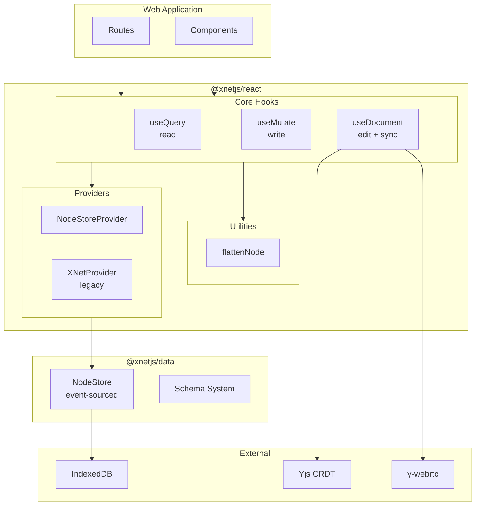
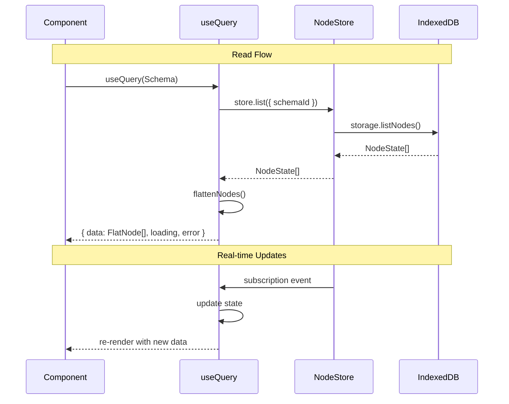

# React Hooks API Analysis v2

> **Date**: January 2026  
> **Package**: `@xnetjs/react`  
> **Status**: ✅ IMPLEMENTED - The `useNode` hook provides the unified API proposed here

## Implementation Status

The key proposals from this analysis have been implemented:

- [x] **`useNode` hook** - Unified hook combining data, mutations, sync, and presence
- [x] **Flattened properties** - `flattenNode()` utility provides `node.title` access
- [x] **`createIfMissing`** - Auto-create nodes when they don't exist
- [x] **Type-safe updates** - Update function typed to schema properties
- [x] **Real presence** - Connected to Yjs awareness protocol
- [x] **SyncManager** - Background sync independent of component lifecycle

See `packages/react/src/hooks/useNode.ts` for the implementation.

---

## Executive Summary

The `@xnetjs/react` package is the primary developer interface for xNet. After a thorough code review, I've identified the current architecture, bugs that need immediate fixing, and opportunities to create a truly beautiful API.

**Current State**: 3 core hooks (`useQuery`, `useMutate`, `useDocument`) with good foundations but inconsistent patterns and several bugs.

**Vision**: A minimal, powerful API where common patterns are effortless and advanced use cases are still possible.

---

## Table of Contents

1. [Current Architecture](#1-current-architecture)
2. [Critical Bugs](#2-critical-bugs)
3. [API Surface Analysis](#3-api-surface-analysis)
4. [Proposed Improvements](#4-proposed-improvements)
5. [The Ideal API](#5-the-ideal-api)
6. [Migration Path](#6-migration-path)

---

## 1. Current Architecture



### Data Flow



---

## 2. Critical Bugs

### Bug #1: `useSync` Doesn't Exist

**Files affected**: `__root.tsx:5`, `settings.tsx:5`

```tsx
// These imports will fail at runtime!
import { useSync } from '@xnetjs/react'
const { status, peerCount } = useSync() // TypeError: useSync is not a function
```

**Root cause**: `useSync` was deleted in the hooks QoL refactor but the app still imports it.

**Fix**: Either restore `useSync` or update the app to get sync status from `useDocument`.

---

### Bug #2: Sidebar Uses Old Property Access

**File**: `Sidebar.tsx:41`

```tsx
// Current (broken with FlatNode)
{
  ;(page.properties.title as string) || 'Untitled'
}

// Should be
{
  page.title || 'Untitled'
}
```

**Root cause**: Not all files were updated when FlatNode was introduced.

---

### Bug #3: Awareness Cleanup Leak

**File**: `useDocument.ts:402`

```tsx
// Current (broken)
if (user) {
  provider.awareness.off('change', () => {})  // Empty function - doesn't remove listener!
}

// Should be
const awarenessHandler = () => { ... }
awareness.on('change', awarenessHandler)
// ...
awareness.off('change', awarenessHandler)  // Same function reference
```

---

### Bug #4: Hardcoded Dev Credentials

**File**: `context.ts:66-67`

```tsx
const DEFAULT_DID = 'did:key:z6MkhaXgBZDvotDkL5257faiztiGiC2QtKLGpbnnEGta2doK'
const DEFAULT_SIGNING_KEY = new Uint8Array(32).fill(1)
```

These are used in production if no credentials are provided. Security risk.

---

## 3. API Surface Analysis

### 3.1 `useQuery` - Current State

**Strengths**:

- Clean overloaded API (list, single, filtered)
- FlatNode for ergonomic property access
- Real-time subscriptions
- Sorting support

**Weaknesses**:

- Client-side filtering (loads all, then filters)
- No cursor-based pagination
- No optimistic cache
- `JSON.stringify` in dependency arrays

**Current Usage**:

```tsx
// List all
const { data: tasks } = useQuery(TaskSchema)

// Single by ID
const { data: task } = useQuery(TaskSchema, taskId)

// Filtered
const { data } = useQuery(TaskSchema, {
  where: { status: 'done' },
  orderBy: { createdAt: 'desc' },
  limit: 20
})
```

### 3.2 `useMutate` - Current State

**Strengths**:

- Type-safe `create()` with schema inference
- `updateTyped()` for compile-time checking
- Transaction support
- Pending state tracking

**Weaknesses**:

- `update()` is untyped (accepts any properties)
- `MutateOptions.optimistic` is documented but not implemented
- No error return (errors logged but not propagated)
- Schema parameter in `updateTyped` unused at runtime

**Current Usage**:

```tsx
const { create, update, updateTyped, remove, isPending } = useMutate()

await create(TaskSchema, { title: 'New', status: 'todo' })
await updateTyped(TaskSchema, id, { status: 'done' })
await remove(id)
```

### 3.3 `useDocument` - Current State

**Strengths**:

- Unified hook for Node + Y.Doc
- Auto-create with `createIfMissing`
- Integrated presence
- Type-safe `update()`
- Sync status tracking

**Weaknesses**:

- Hardcoded localhost signaling server
- `user` object in deps causes unnecessary re-renders
- No awareness cleanup (memory leak)
- Double-load potential on mount

**Current Usage**:

```tsx
const {
  data, // FlatNode
  doc, // Y.Doc
  update, // Type-safe
  syncStatus, // 'offline' | 'connecting' | 'connected'
  presence // Collaborators
} = useDocument(PageSchema, pageId, {
  createIfMissing: { title: 'Untitled' },
  user: { name: 'Alice' }
})
```

---

## 4. Proposed Improvements

### 4.1 Restore Global Sync Status

The app needs global sync status for the header indicator. Two options:

**Option A: Simple `useConnectionStatus` hook**

```tsx
function useConnectionStatus() {
  // Derive from NodeStore's sync state
  const { store } = useNodeStore()
  const [isOnline, setIsOnline] = useState(navigator.onLine)

  return {
    isOnline
    // Future: actual P2P connection status
  }
}
```

**Option B: Bring back `useSync` with minimal scope**

```tsx
function useSync() {
  return {
    isOnline: navigator.onLine
    // No peer count - that's per-document via useDocument
  }
}
```

**Recommendation**: Option A - rename to `useConnectionStatus` to be clear about scope.

---

### 4.2 Simplify Provider Setup

Current setup is confusing with `XNetProvider` vs `NodeStoreProvider`:

```tsx
// Current - two providers, unclear which to use
<XNetProvider config={...}>      // Legacy + new
<NodeStoreProvider storage={...}> // New only
```

**Proposed: Single unified provider**

```tsx
// New - one provider, clear purpose
<XNetProvider storage={indexedDbAdapter} identity={identity}>
  <App />
</XNetProvider>
```

---

### 4.3 Better Error Handling

Current hooks swallow errors. Proposed pattern:

```tsx
const { data, error, isError } = useQuery(Schema)

// Or with error boundary integration
const { data } = useQuery(Schema, {
  throwOnError: true // Throw to nearest error boundary
})
```

---

### 4.4 Optimistic Updates (Actually Implement Them)

The `MutateOptions.optimistic` flag exists but does nothing. Real implementation:

```tsx
const { update } = useMutate()

// Optimistic by default - UI updates immediately
await update(taskId, { status: 'done' })

// Explicit control
await update(taskId, { status: 'done' }, { optimistic: false })
```

Implementation approach:

1. Update local cache immediately
2. Persist in background
3. Rollback on error with toast notification

---

### 4.5 Query Invalidation

After mutations, related queries should automatically refresh:

```tsx
const { create } = useMutate()

// Creating a task should update any useQuery(TaskSchema) automatically
await create(TaskSchema, { title: 'New' })
// All components using useQuery(TaskSchema) re-render with new data
```

This already works via `store.subscribe()` but could be more explicit.

---

### 4.6 Suspense Support

Modern React pattern for loading states:

```tsx
// Current - manual loading handling
const { data, loading } = useQuery(Schema)
if (loading) return <Spinner />

// Proposed - Suspense integration
const { data } = useQuery(Schema, { suspense: true })
// Suspense boundary handles loading automatically
```

---

## 5. The Ideal API

After all improvements, here's what the ideal developer experience looks like:

### Setup (Once)

```tsx
// main.tsx
import { XNetProvider } from '@xnetjs/react'
import { createIndexedDBStorage } from '@xnetjs/storage'

const storage = createIndexedDBStorage('my-app')
const identity = await loadOrCreateIdentity()

createRoot(document.getElementById('root')!).render(
  <XNetProvider storage={storage} identity={identity}>
    <App />
  </XNetProvider>
)
```

### Reading Data

```tsx
import { useQuery } from '@xnetjs/react'
import { TaskSchema } from './schemas'

function TaskList() {
  // Simple list
  const { data: tasks } = useQuery(TaskSchema)

  // With options
  const { data: urgent } = useQuery(TaskSchema, {
    where: { priority: 'high', status: 'todo' },
    orderBy: { dueDate: 'asc' },
    limit: 10
  })

  // Single by ID
  const { data: task } = useQuery(TaskSchema, taskId)

  return (
    <ul>
      {tasks.map((task) => (
        <li key={task.id}>
          {task.title} {/* Direct access - no .properties */}
          <span>{task.status}</span> {/* Correctly typed */}
        </li>
      ))}
    </ul>
  )
}
```

### Writing Data

```tsx
import { useMutate } from '@xnetjs/react'
import { TaskSchema } from './schemas'

function TaskForm() {
  const { create, isPending } = useMutate()

  const handleSubmit = async (data) => {
    // Type-safe - only valid properties allowed
    await create(TaskSchema, {
      title: data.title,
      status: 'todo',
      priority: data.priority
    })
    // All useQuery(TaskSchema) hooks automatically update
  }

  return (
    <form onSubmit={handleSubmit}>
      <input name="title" required />
      <button disabled={isPending}>{isPending ? 'Creating...' : 'Create Task'}</button>
    </form>
  )
}
```

### Inline Updates

```tsx
function TaskItem({ taskId }) {
  const { data: task } = useQuery(TaskSchema, taskId)
  const { update } = useMutate()

  if (!task) return null

  return (
    <div>
      <input value={task.title} onChange={(e) => update(taskId, { title: e.target.value })} />
      <select value={task.status} onChange={(e) => update(taskId, { status: e.target.value })}>
        <option value="todo">To Do</option>
        <option value="done">Done</option>
      </select>
    </div>
  )
}
```

### Rich Text Documents

```tsx
import { useDocument } from '@xnetjs/react'
import { PageSchema } from './schemas'
import { Editor } from '@xnetjs/editor'

function DocumentPage({ pageId }) {
  const {
    data: page,
    doc,
    update,
    syncStatus,
    presence
  } = useDocument(PageSchema, pageId, {
    createIfMissing: { title: 'Untitled' }
  })

  if (!page) return <Loading />

  return (
    <div>
      {/* Title - instant update */}
      <input value={page.title} onChange={(e) => update({ title: e.target.value })} />

      {/* Sync indicator */}
      <SyncBadge status={syncStatus} />

      {/* Collaborators */}
      <AvatarStack users={presence} />

      {/* Rich text editor with CRDT */}
      <Editor doc={doc} />
    </div>
  )
}
```

### Transactions

```tsx
function ReorderTasks({ tasks }) {
  const { mutate } = useMutate()

  const handleReorder = async (newOrder) => {
    // Atomic - all succeed or all fail
    await mutate(
      newOrder.map((task, index) => ({
        type: 'update',
        id: task.id,
        data: { order: index }
      }))
    )
  }

  return <DragDropList items={tasks} onReorder={handleReorder} />
}
```

---

## 6. Migration Path

### Phase 1: Bug Fixes (Immediate)

1. Fix `useSync` import errors in web app
2. Fix Sidebar property access
3. Fix awareness cleanup leak
4. Remove hardcoded dev credentials

### Phase 2: API Polish (Short-term)

1. Add `useConnectionStatus` hook
2. Implement real optimistic updates
3. Add proper error propagation
4. Memoize `user` option properly in useDocument

### Phase 3: Advanced Features (Medium-term)

1. Suspense support
2. Cursor-based pagination
3. Server-side filtering (when sync server exists)
4. Offline queue with retry

### Phase 4: Simplification (Long-term)

1. Deprecate `XNetProvider` in favor of unified provider
2. Remove legacy Zustand store
3. Remove deprecated hooks (useDocumentSync, useNodeSync, useEditor)

---

## Appendix: Code Quality Checklist

### Every Hook Should:

- [ ] Return `loading`, `error` states
- [ ] Handle cleanup properly in useEffect
- [ ] Memoize callbacks with useCallback
- [ ] Use stable dependency arrays (no objects/arrays that change reference)
- [ ] Subscribe to real-time updates
- [ ] Handle the "not ready" state gracefully

### Type Safety:

- [ ] Schema inference should "just work"
- [ ] No `as` casts needed by consumers
- [ ] Compile-time errors for invalid property names
- [ ] Runtime validation for untrusted data

### Testing:

- [ ] Unit tests for each hook
- [ ] Integration tests with real store
- [ ] Tests for error cases
- [ ] Tests for cleanup/unmount

---

## Summary

The `@xnetjs/react` API has solid foundations but needs polish to be truly "beautiful":

1. **Fix the bugs** - Broken imports, memory leaks, security issues
2. **Complete the features** - Optimistic updates, error handling
3. **Simplify setup** - One provider, clear purpose
4. **Enhance DX** - Suspense, better types, query invalidation

The goal: A developer should be able to build a full collaborative app with just `useQuery`, `useMutate`, and `useDocument` - and it should feel effortless.
