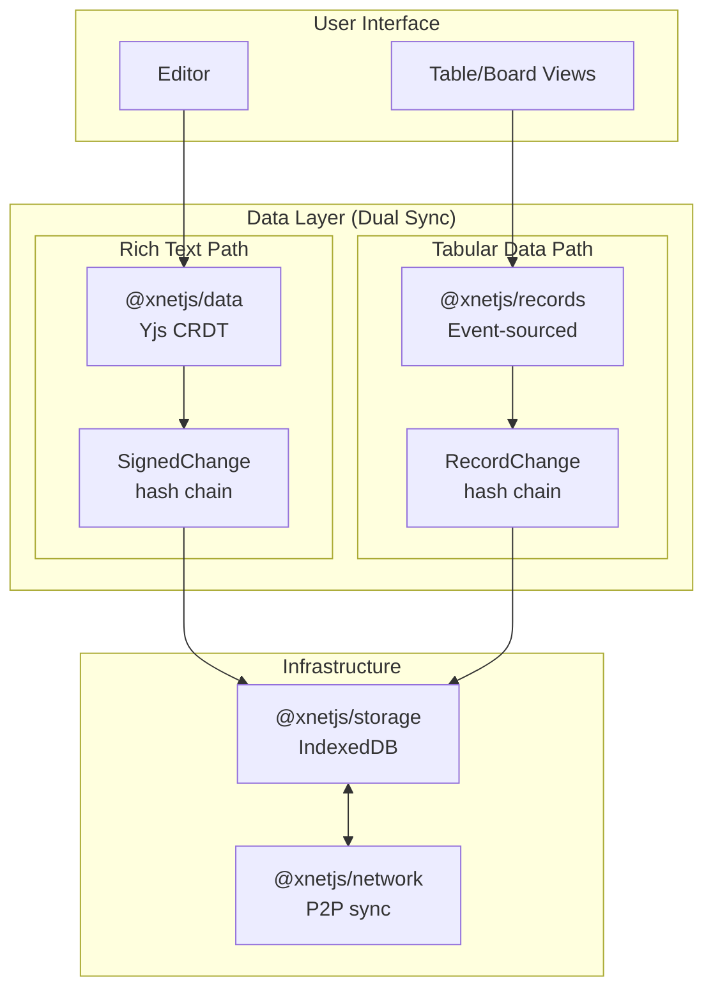
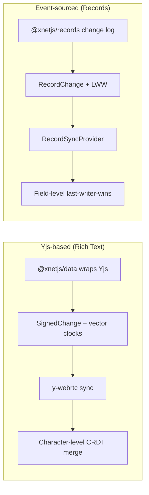
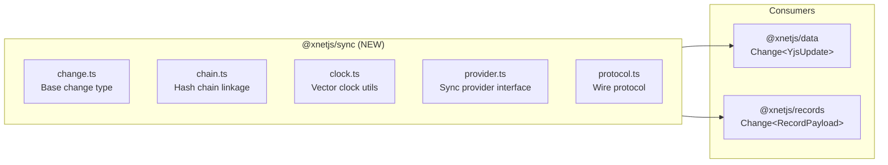
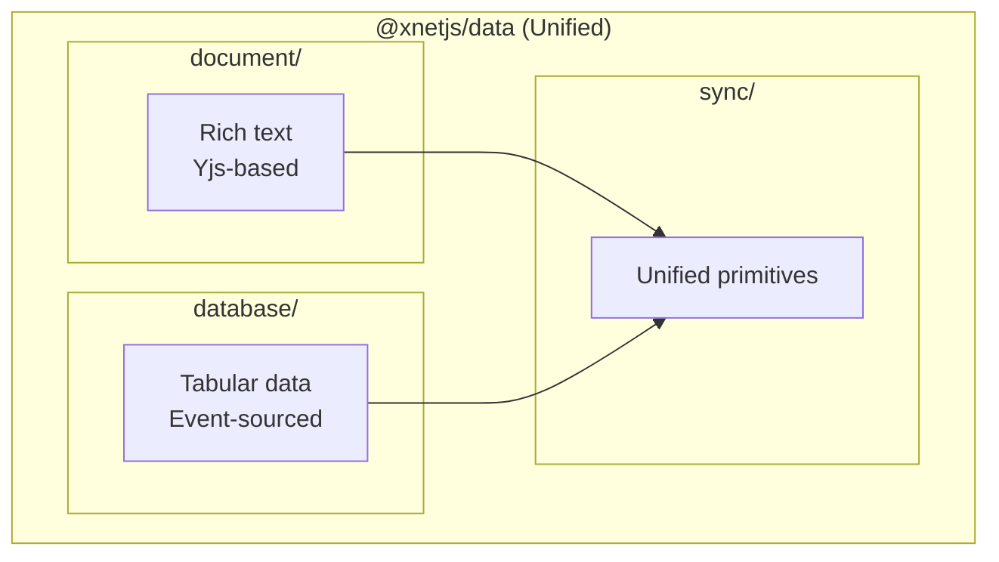
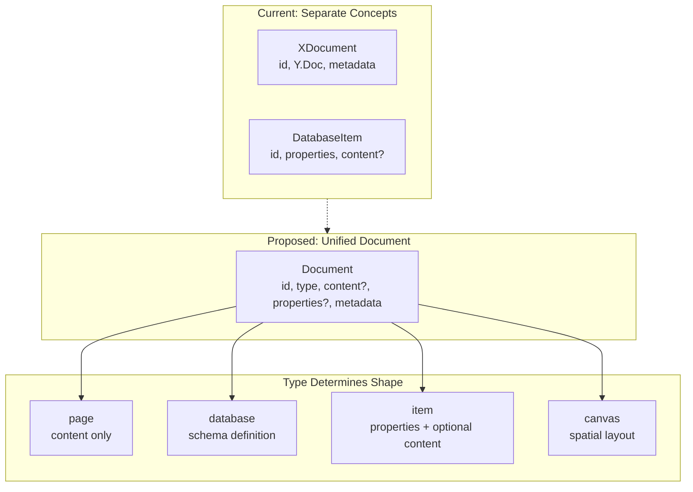
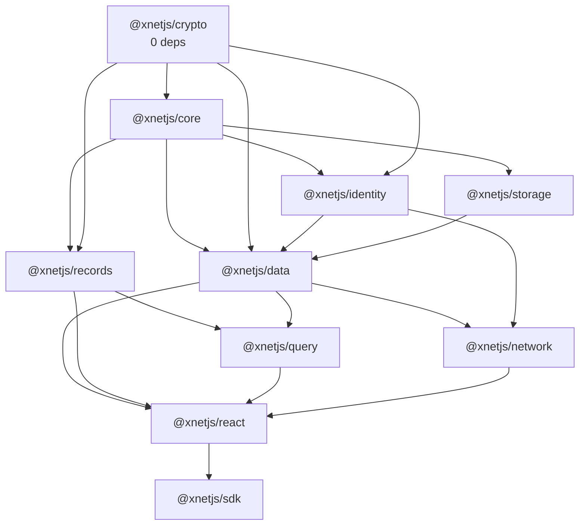
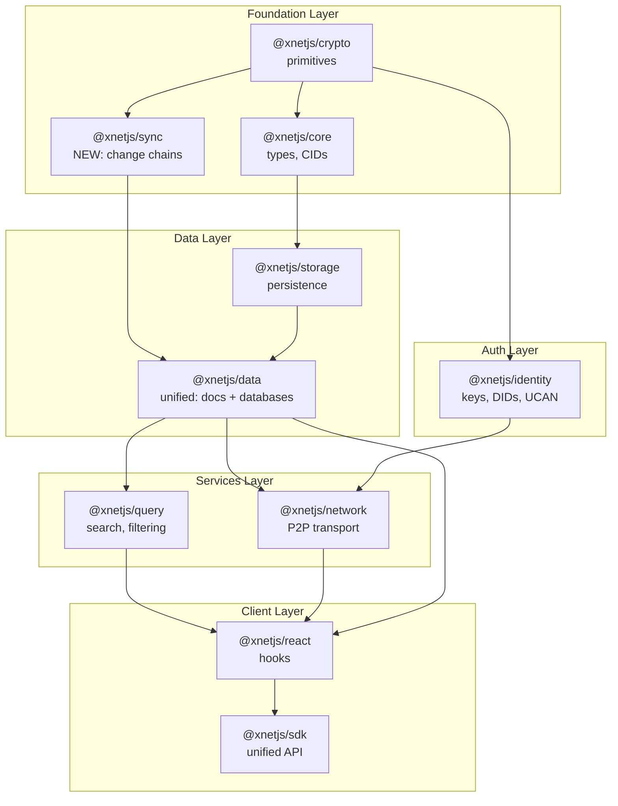
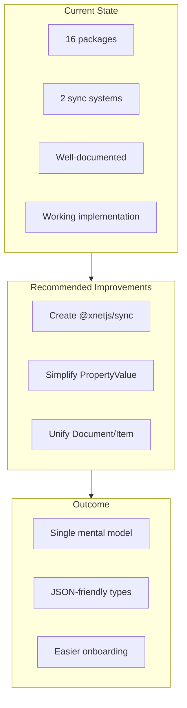

# xNet Codebase Review & Improvement Recommendations

**Date:** January 21 2026  
**Reviewer:** AI Agent Analysis

---

## Executive Summary

xNet is a decentralized data infrastructure SDK with a clear vision: enable local-first, P2P-synced applications where users own their data. The codebase is well-organized at a high level, with clear separation of concerns across packages. However, there are opportunities to simplify the data model and reduce conceptual overhead.

**Key Findings:**

1. The hybrid sync approach (Yjs for rich text, event-sourcing for records) is architecturally sound
2. Package boundaries are mostly clean, but some overlap exists
3. The data model has more layers than necessary for the current use case
4. Documentation is excellent but slightly out of sync with implementation

---

## Part 1: Codebase Intent vs. Implementation

### Intended Architecture (from docs)

The documentation describes a 10-package hierarchy:

```
core → crypto → identity → storage → data → network → query → vectors → react → sdk
```

### Actual Implementation

The codebase has **16 packages**, with some divergence from the documented structure:

| Package            | Documented | Implemented | Notes                                          |
| ------------------ | ---------- | ----------- | ---------------------------------------------- |
| `@xnetjs/core`     | Yes        | Yes         | Content addressing, snapshots, permissions     |
| `@xnetjs/crypto`   | Yes        | Yes         | Clean primitives                               |
| `@xnetjs/identity` | Yes        | Yes         | DID:key, UCAN                                  |
| `@xnetjs/storage`  | Yes        | Yes         | IndexedDB + Memory adapters                    |
| `@xnetjs/data`     | Yes        | Yes         | Yjs wrapper, signed updates                    |
| `@xnetjs/network`  | Yes        | Yes         | libp2p, y-webrtc                               |
| `@xnetjs/query`    | Yes        | Yes         | Local + search                                 |
| `@xnetjs/vectors`  | Yes        | Partial     | Mostly placeholder                             |
| `@xnetjs/react`    | Yes        | Yes         | Hooks                                          |
| `@xnetjs/sdk`      | Yes        | Yes         | Unified client                                 |
| `@xnetjs/records`  | Yes\*      | Yes         | Implements `@xnetjs/database` spec from plan02 |
| `@xnetjs/editor`   | Implied    | Yes         | Tiptap-based (part of rich text requirements)  |
| `@xnetjs/ui`       | No         | Yes         | Shared UI components                           |
| `@xnetjs/views`    | Yes        | Yes         | Table/Board views (plan02)                     |
| `@xnetjs/canvas`   | Yes        | Partial     | plan02/09-infinite-canvas.md                   |
| `@xnetjs/formula`  | Yes        | Partial     | plan02/07-formula-engine.md                    |

\*Note: `@xnetjs/records` implements the `@xnetjs/database` specification from `plan02DatabasePlatform/`. The package was named `records` instead of `database` during implementation.

**Key Observation:** The `@xnetjs/records` package implements the Notion-like database functionality documented in `plan02DatabasePlatform/`. It uses event-sourcing for sync, which is a deliberate choice parallel to `@xnetjs/data` (Yjs) for rich text.

---

## Part 2: Data Model Analysis

### Current Data Flow



### The Problem: Two Parallel Sync Systems

The codebase has **two independent sync mechanisms**:



1. **Yjs-based (for rich text):**
   - `@xnetjs/data` wraps Yjs
   - Uses `SignedChange` with vector clocks
   - Syncs via y-webrtc
   - Character-level CRDT merge

2. **Event-sourcing (for records):**
   - `@xnetjs/records` implements its own change log
   - Uses `RecordChange` with LWW per-field
   - Has its own `RecordSyncProvider`
   - Field-level last-writer-wins

**This is documented as intentional** (see `TRADEOFFS.md`), but creates:

- Two sets of types to learn (`SignedUpdate` vs `RecordChange`)
- Two sync providers to maintain
- Conceptual overhead when reasoning about "how does data sync?"

### Type Duplication

Several concepts are defined in multiple places:

| Concept           | Defined In                                           | Notes                                        |
| ----------------- | ---------------------------------------------------- | -------------------------------------------- |
| `VectorClock`     | `@xnetjs/core`                                       | Good - single source                         |
| `SignedUpdate`    | `@xnetjs/core`                                       | For Yjs (→ Change<YjsUpdate>)                |
| `RecordChange`    | `@xnetjs/records/sync/types`                         | Parallel structure (→ Change<RecordPayload>) |
| `ContentId`       | `@xnetjs/core`                                       | Good - single source                         |
| Hash verification | Both `@xnetjs/core` and `@xnetjs/records/sync/store` | Duplicated                                   |
| DID type          | `@xnetjs/core`                                       | Good - re-exported                           |

---

## Part 3: Organizational Improvements

### Recommendation 1: Consolidate Sync Layer

Create a unified sync abstraction that both Yjs and event-sourcing use:



Then `@xnetjs/data` and `@xnetjs/records` both import from `@xnetjs/sync`:

```typescript
// @xnetjs/sync/change.ts
export interface Change<T = unknown> {
  id: string
  type: string
  payload: T
  hash: ContentId
  parentHash: ContentId | null
  authorDID: DID
  signature: Uint8Array
  timestamp: number
  vectorClock: VectorClock
}

// @xnetjs/data uses: Change<YjsUpdate>
// @xnetjs/records uses: Change<CreateItem | UpdateItem | ...>
```

**Benefit:** Single mental model for "how data syncs"

### Recommendation 2: Flatten the ID System

Current IDs are prefixed but inconsistently:

```typescript
// Current
type DatabaseId = `db:${string}`
type PropertyId = `prop:${string}`
type ViewId = `view:${string}`
type ItemId = `item:${string}`
type ContentId = `cid:blake3:${string}`
type DID = `did:key:${string}`
```

This is good for debugging but the prefixes are inconsistent (`db:` vs `cid:` vs `did:`). Consider:

```typescript
// Option A: All use xnet prefix
type DatabaseId = `xnet:db:${string}`
type ItemId = `xnet:item:${string}`

// Option B: Remove prefixes for internal IDs, keep for external
type DatabaseId = string // Just UUIDs internally
type ContentId = `blake3:${string}` // Shorter CID format
```

I'd recommend **Option B** - use plain UUIDs internally, only add prefixes for externally-visible identifiers.

### Recommendation 3: Merge `@xnetjs/data` and `@xnetjs/records`

These packages share the same goal (structured data with sync) but use different mechanisms. Consider:



The key insight: **both are just different strategies for the same problem** (conflict-free collaborative data). Keep them in one package with clear internal boundaries.

### Recommendation 4: Simplify @xnetjs/core

`@xnetjs/core` is doing too much:

```typescript
// Currently exports:
- Content addressing (hashing, CIDs, Merkle trees)
- Snapshots (triggers, formats)
- Signed updates (vector clocks, chains)
- DID resolution (peer locations, DHT config)
- Query federation (data sources, routing)
- Permissions (roles, capabilities, RBAC)
```

This should be split:

| Keep in `@xnetjs/core`       | Move elsewhere                                  |
| ---------------------------- | ----------------------------------------------- |
| Content addressing           | -                                               |
| Basic types (DID, ContentId) | -                                               |
| Snapshots                    | `@xnetjs/storage`                               |
| Signed updates               | `@xnetjs/sync` (new)                            |
| DID resolution               | `@xnetjs/network`                               |
| Query federation             | `@xnetjs/query`                                 |
| Permissions                  | `@xnetjs/identity` or new `@xnetjs/permissions` |

**Result:** `@xnetjs/core` becomes a minimal, stable foundation.

---

## Part 4: Implementation Simplifications

### Simplification 1: Unified Property Value Type

Current `PropertyValue` union is complex:

```typescript
export type PropertyValue =
  | string
  | number
  | boolean
  | Date
  | null
  | string[] // multiSelect, person, relation
  | DateRange
  | FileValue[]
```

Simplify to JSON-compatible values only:

```typescript
export type PropertyValue =
  | string
  | number
  | boolean
  | null
  | PropertyValue[]
  | { [key: string]: PropertyValue }
```

Then define semantic types via config:

```typescript
// Date is stored as number (timestamp)
{ type: 'date', value: 1706140800000 }

// DateRange is stored as object
{ type: 'dateRange', value: { start: 1706140800000, end: 1706227200000 } }

// File is stored as object
{ type: 'file', value: { id: '...', name: '...', url: '...' } }
```

**Benefit:** All values are JSON-serializable, no special handling needed.

### Simplification 2: Remove Computed Properties from Storage

`rollup` and `formula` properties are computed, not stored. Currently they're in the property type union and require special handling everywhere.

Instead:

```typescript
// Stored properties
type StoredPropertyType = 'text' | 'number' | 'checkbox' | 'date' | ...

// Computed properties (never stored)
type ComputedPropertyType = 'rollup' | 'formula' | 'created' | 'updated' | 'createdBy'

// Full union for schema definition
type PropertyType = StoredPropertyType | ComputedPropertyType
```

Then in storage:

```typescript
interface ItemState {
  properties: Record<PropertyId, PropertyValue> // Only stored values
}

// Computed values are materialized in the view layer, not storage
```

### Simplification 3: Merge Document and Item Concepts

Currently:

- Rich text docs are `XDocument` with a `Y.Doc` inside
- Database items are `DatabaseItem` with a `properties` object

But database items can also have rich text content (`content?: Y.Doc`). This creates conceptual overlap.



Unify:

```typescript
// Everything is a Document
interface Document {
  id: string
  type: 'page' | 'database' | 'item' | 'canvas'

  // Rich content (Yjs)
  content?: Y.Doc

  // Structured properties (for items/databases)
  properties?: Record<string, PropertyValue>

  // Metadata
  created: number
  updated: number
  createdBy: DID
}
```

### Simplification 4: Single Source of Truth for Timestamps

Currently timestamps appear in multiple places:

- `item.created` / `item.updated`
- `item.propertyTimestamps[propId].timestamp`
- `operation.timestamp`

Simplify by using only operation timestamps for LWW:

```typescript
interface ItemState {
  id: ItemId
  databaseId: DatabaseId
  properties: Record<PropertyId, PropertyValue>
  // Remove propertyTimestamps - derive from operation log when needed
  deleted: boolean
  latestChangeHash: ContentId // Link to change log
}
```

When resolving conflicts, query the operation log. This is slower for reads but simpler and more correct (single source of truth).

---

## Part 5: Package Dependency Cleanup

### Current Dependencies (from imports)



### Issues

1. **Circular potential:** `data` and `records` have similar responsibilities
2. **Over-coupling:** `react` depends on almost everything
3. **Missing:** `records` is not in the documented dependency chain

### Recommended Dependency Graph



---

## Part 6: Quick Wins

These changes provide immediate benefit with low risk:

### 1. Move Vector Clock Utils to `@xnetjs/core`

Currently defined in `@xnetjs/core/updates.ts` but also reimplemented in `@xnetjs/records`. Ensure single implementation, import everywhere.

### 2. Standardize Hash Functions

Both `@xnetjs/crypto` and `@xnetjs/core` have hashing:

- `@xnetjs/crypto`: `hash()`, `hashHex()`, `hashBase64()`
- `@xnetjs/core`: `hashContent()`, `createContentId()`

Keep only `@xnetjs/crypto` for raw hashing, `@xnetjs/core` for CID formatting.

### 3. Remove Unused Exports

Several packages export types that aren't used:

- `@xnetjs/core`: `MerkleNode`, `ContentTree` (not implemented)
- `@xnetjs/core`: `QueryRouter` interface (federation not implemented)
- `@xnetjs/data`: `UpdateBatch` (not used)

Clean these up to reduce API surface.

### 4. Consolidate Config Types

Multiple packages define their own config types:

- `NetworkConfig` in `@xnetjs/network`
- `StorageConfig` (implicit in adapters)
- `XNetClientConfig` in `@xnetjs/sdk`

Create a single `@xnetjs/core/config.ts` with all config types.

---

## Part 7: Documentation Sync

### Docs vs. Reality

| Document                      | Accuracy | Notes                                                   |
| ----------------------------- | -------- | ------------------------------------------------------- |
| `CLAUDE.md`                   | 95%      | Updated with all packages and relationships             |
| `TRADEOFFS.md`                | 95%      | Excellent, explains key decisions                       |
| `PERSISTENCE_ARCHITECTURE.md` | 90%      | Good, some code samples outdated                        |
| `plan01MVP/`                  | 95%      | Implementation complete                                 |
| `plan02DatabasePlatform/`     | 90%      | `@xnetjs/records` implements this as `@xnetjs/database` |

### Recommended Updates

1. ~~**Add `@xnetjs/records` to CLAUDE.md**~~ - Done
2. ~~**Update package dependency diagram**~~ - Done
3. ~~**Document the hybrid sync strategy**~~ - Done in CLAUDE.md
4. **Add data flow diagrams** - Visual representations help (already in plan02)

---

## Summary: Priority Actions

### High Priority (Done)

1. ~~**Update CLAUDE.md** with accurate package list and relationships~~ - Completed
2. ~~**Document `@xnetjs/records`**~~ - Already documented in plan02DatabasePlatform as `@xnetjs/database`
3. **Consolidate hash/verify functions** into single locations (minor improvement)

### Medium Priority (Next Sprint)

4. **Create `@xnetjs/sync`** to unify sync primitives
5. **Simplify `PropertyValue` type** to JSON-only
6. **Move computed properties** out of storage layer

### Low Priority (Future)

7. **Merge `@xnetjs/data` and `@xnetjs/records`** (or keep separate, see TRADEOFFS.md)
8. **Unify Document/Item concepts**
9. **Split `@xnetjs/core`** into smaller focused packages

---

## Conclusion

The xNet codebase is well-engineered with clear separation of concerns. The main opportunity for improvement is **reducing the conceptual surface area** - there are currently two mental models (Yjs vs. event-sourcing) where one could suffice.



The recommended approach:

1. Keep the hybrid implementation (it's working)
2. Create unified abstractions on top
3. Simplify the data types to be more JSON-friendly
4. Improve documentation to match reality

This will make the codebase easier to reason about without requiring major rewrites.
