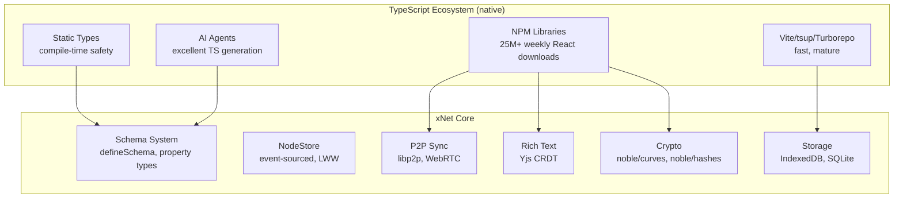
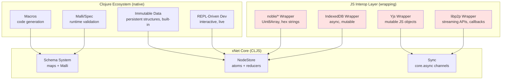
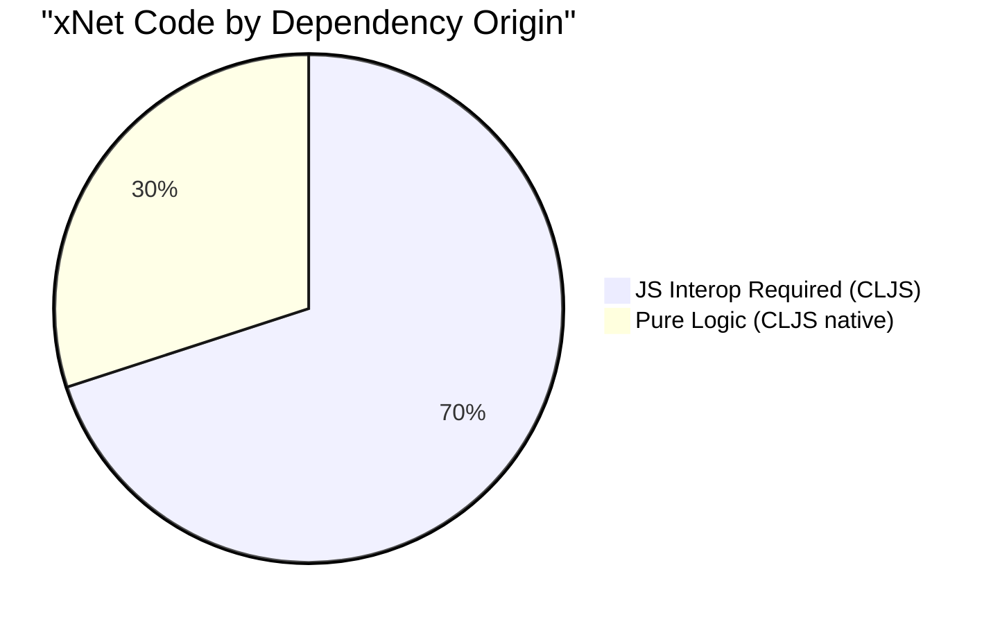
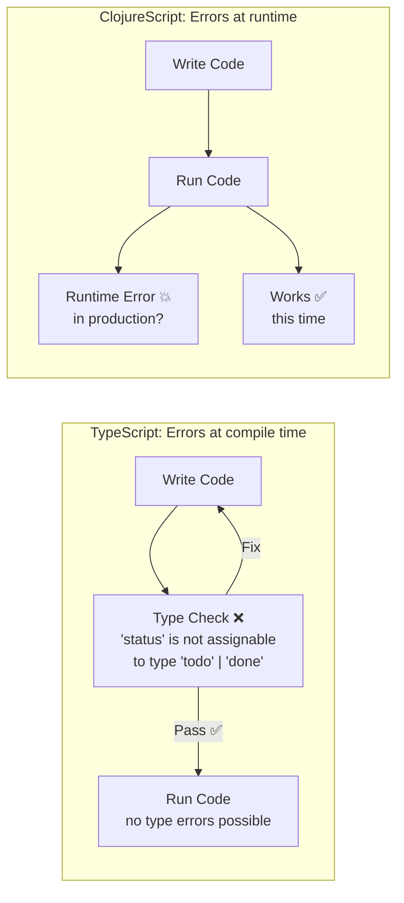
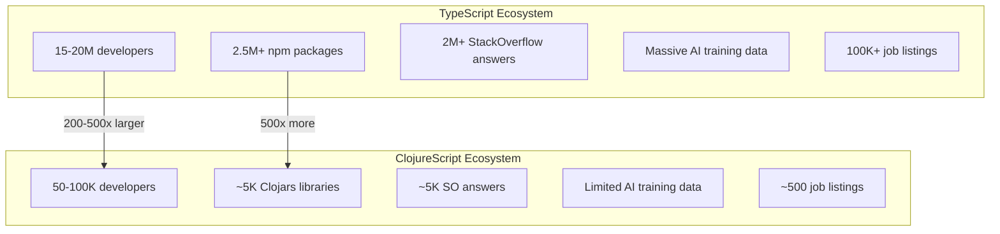
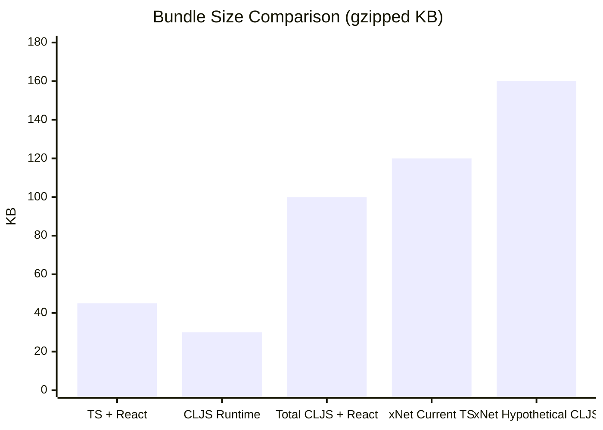
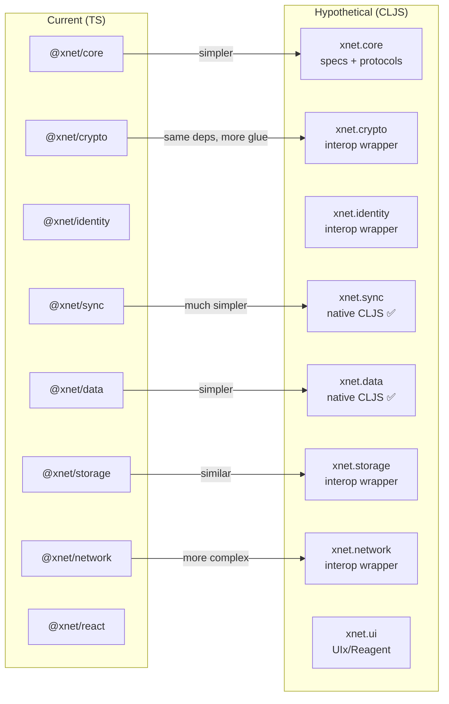
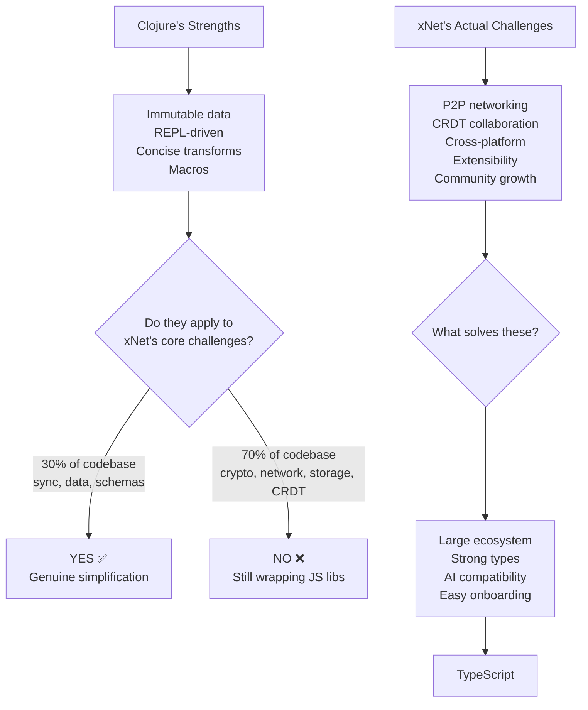

# Exploration: Porting xNet to Clojure/ClojureScript

## Context

This is a thought experiment exploring what a Clojure(Script) rewrite of xNet would look like — the tradeoffs, what would get simpler, what would get harder, and why TypeScript is ultimately the right choice for this project. This exploration exists because Clojure is a beautiful language with genuine advantages for data-oriented systems, and it's worth understanding exactly where those advantages apply and where they don't.

**TL;DR**: Clojure's strengths (immutable data, REPL, macros, data-as-code) would simplify the schema system and event-sourcing layers significantly. However, xNet's core infrastructure is ~70% JS library interop (Yjs, libp2p, noble/curves, IndexedDB), and CLJS adds a translation layer over these without providing native alternatives. Combined with a ~200-500x smaller community, weaker AI agent support, and loss of compile-time types critical for an extensible OSS project, a port would create more problems than it solves.

---

## Architecture Comparison

### Current: TypeScript



### Hypothetical: ClojureScript



The red nodes are where CLJS adds friction without benefit — wrapping JS APIs that have no native CLJS alternatives.

---

## What Would Get Simpler

### 1. Schema System → Maps + Malli

TypeScript's `defineSchema` uses builder patterns and generics to achieve type inference. In Clojure, schemas are just data:

```clojure
;; Clojure: Schemas are plain maps (data-as-code)
(def TaskSchema
  {:name "Task"
   :namespace "xnet://myapp/"
   :document :yjs
   :properties
   {:title    [:string {:required true}]
    :status   [:enum "todo" "in-progress" "done"]
    :priority [:int {:min 1 :max 5}]
    :due      [:time/local-date]}})

;; Malli gives runtime validation + generation
(def TaskMalli
  [:map
   [:title [:string {:min 1}]]
   [:status [:enum "todo" "in-progress" "done"]]
   [:priority {:optional true} [:int {:min 1 :max 5}]]
   [:due {:optional true} :time/local-date]])

;; Generate test data
(mg/generate TaskMalli) ; => {:title "abc" :status "todo" :priority 3}

;; Validate
(m/validate TaskMalli {:title "Buy seeds" :status "todo"}) ; => true
```

**vs TypeScript:**

```typescript
// TypeScript: Needs generics + builder pattern for type inference
const TaskSchema = defineSchema({
  name: 'Task',
  namespace: 'xnet://myapp/',
  properties: {
    title: text({ required: true }),
    status: select({
      options: [
        { id: 'todo', name: 'To Do' },
        { id: 'in-progress', name: 'In Progress' },
        { id: 'done', name: 'Done' }
      ] as const
    }),
    priority: number({ min: 1, max: 5 }),
    due: date()
  }
})
```

**Verdict**: Clojure is genuinely more concise here. Schemas-as-data means they're trivially composable, mergeable, and serializable. No generics gymnastics needed.

### 2. Event Sourcing → Reducers + Persistent Data

Clojure's immutable data structures make event sourcing feel natural:

```clojure
;; Change application is just a reduce over immutable maps
(defn apply-change [state change]
  (let [{:keys [properties lamport]} change
        current-props (:properties state {})]
    (reduce-kv
      (fn [props k v]
        (if (newer? lamport (get-in state [:timestamps k]))
          (assoc props k v)
          props))
      current-props
      properties)))

;; Materialize at any point = reduce over changes
(defn materialize-at [changes target]
  (->> changes
       (sort-by (comp :time :lamport))
       (take-while #(before? (:lamport %) target))
       (reduce apply-change {})))

;; The entire history is just a vector of maps
(def history [{:hash "cid:..." :properties {:title "Draft"} :lamport {:time 1}}
              {:hash "cid:..." :properties {:title "Final"} :lamport {:time 2}}])
```

**vs TypeScript:**

```typescript
// TypeScript: Same logic but with mutable state management, type annotations
async materializeAt(nodeId: NodeId, target: HistoryTarget): Promise<HistoricalState> {
  const changes = await this.storage.getChanges(nodeId)
  const sorted = topologicalSort(changes)
  const resolved = this.resolveTarget(sorted, target)

  let state: NodeState = this.emptyState(nodeId)
  for (let i = 0; i <= resolved; i++) {
    state = this.applyChange(state, sorted[i])
  }
  return { node: state, ... }
}
```

**Verdict**: Clojure's persistent data structures make point-in-time reconstruction trivial — every intermediate state is already immutable and cheap to retain. No need for `structuredClone` or careful mutation avoidance. The event sourcing layer would be ~40% less code.

### 3. NodeStore → Atom + Watchers

```clojure
;; Store is an atom with watchers (built-in reactivity)
(def store (atom {:nodes {} :changes []}))

;; Mutations are pure functions
(defn create-node [store schema-id properties]
  (let [node-id (nano-id)
        change (sign-change {:node-id node-id
                             :schema-id schema-id
                             :properties properties})]
    (swap! store
      (fn [s]
        (-> s
            (update :changes conj change)
            (assoc-in [:nodes node-id] (materialize [change])))))))

;; React integration via re-frame subscriptions
(rf/reg-sub :nodes
  (fn [db _]
    (:nodes db)))

(rf/reg-sub :node
  (fn [db [_ node-id]]
    (get-in db [:nodes node-id])))
```

**Verdict**: Atoms + watchers provide reactivity without hooks boilerplate. Re-frame's subscription model is genuinely elegant. But this is trading compile-time type safety for runtime elegance.

### 4. Macros for Boilerplate Reduction

```clojure
;; Macro: define a farming schema with less ceremony
(defschema SoilTest
  :namespace "xnet://farming/"
  :document :yjs
  :properties
  {:site-id    [:relation SiteSchema]
   :test-date  [:date {:required true}]
   :ph         [:number]
   :organic-matter [:number]
   :earthworm-count [:number]})

;; Expands to schema map + Malli schema + constructor + query helper
;; One macro = 4 TypeScript files worth of boilerplate
```

**Verdict**: Macros genuinely reduce boilerplate. But they also reduce readability for newcomers and make tooling harder (AI agents, LSPs, and new contributors struggle with macro-heavy code).

---

## What Would Get Harder

### 1. JS Interop for Core Dependencies

xNet's infrastructure is built on JS libraries. Every one requires interop wrappers:



```clojure
;; Yjs interop: Fighting mutable JS objects from immutable CLJS
(defn create-yjs-doc []
  (let [doc (js/Y.Doc.)]
    ;; Yjs uses mutable shared types - antithetical to Clojure's model
    (.on doc "update"
      (fn [update origin]
        ;; Convert JS Uint8Array to CLJS data...
        ;; This bridge is constant friction
        (let [state (js->clj (.toJSON (.getMap doc "content")))]
          (swap! app-state assoc-in [:docs doc-id] state))))))

;; libp2p interop: Complex async streaming APIs
(defn create-libp2p-node []
  (go
    (let [node (<p! (createLibp2p
                      (clj->js
                        {:addresses {:listen ["/ip4/0.0.0.0/tcp/0/ws"]}
                         :transports [(js/webRTC.)
                                      (js/webSockets.)]
                         :connectionEncrypters [(js/noise.)]
                         :streamMuxers [(js/yamux.)]})))]
      ;; Every event handler needs JS->CLJ conversion
      (.addEventListener node "peer:discovery"
        (fn [evt]
          (let [peer-info (js->clj (.-detail evt) :keywordize-keys true)]
            ;; ...
            ))))))

;; noble/curves interop: Uint8Array everywhere
(defn sign-change [unsigned signing-key]
  (let [hash-bytes (.-encode (js/TextEncoder.) (pr-str unsigned))
        hash (js/blake3 hash-bytes)
        hash-hex (.join (js/Array.from hash) "")
        signature (js/ed25519.sign
                    (.-encode (js/TextEncoder.) hash-hex)
                    signing-key)]
    (assoc unsigned
      :hash (str "cid:blake3:" hash-hex)
      :signature signature)))
```

**Every interop boundary has friction:**

- `clj->js` and `js->clj` conversions (performance cost + potential data loss)
- Mutable JS objects don't play well with Clojure's immutability expectations
- Async JS patterns (Promises) need `core.async` bridges
- Uint8Array/Buffer handling is awkward in CLJS
- Error handling across the boundary loses stack traces

### 2. Loss of Compile-Time Types



For an OSS project intended to be extensible by anyone + AI agents:

| Concern                   | TypeScript                          | Clojure + Malli                       |
| ------------------------- | ----------------------------------- | ------------------------------------- |
| New contributor opens PR  | IDE shows all type errors instantly | Must run code to find issues          |
| AI agent generates plugin | Types guide correct API usage       | No compile-time feedback on structure |
| Schema property typo      | Caught at compile time              | Caught at runtime (if validated)      |
| Refactoring               | Find all references, rename symbol  | Grep + hope (dynamic dispatch)        |
| API documentation         | Types ARE the docs                  | Must write + maintain separate docs   |
| Breaking changes          | Compiler tells all callers          | Discover in production                |

### 3. Community & Ecosystem Scale



**Critical single-maintainer risk:**

- **shadow-cljs** (the build tool): 1 maintainer (Thomas Heller)
- If Thomas stops maintaining it, the entire CLJS build story breaks
- TypeScript has multiple build tools (tsc, esbuild, swc, oxc) with large teams

### 4. AI Agent Productivity

Real-world comparison for xNet-relevant code:

| Task                  | AI Quality (TypeScript)         | AI Quality (CLJS)                       |
| --------------------- | ------------------------------- | --------------------------------------- |
| Define a new schema   | Excellent (types guide it)      | Good (simple maps)                      |
| Write Yjs integration | Good (typed APIs)               | Poor (interop syntax errors)            |
| Write libp2p handler  | Good                            | Poor (complex interop)                  |
| Write React component | Excellent                       | Moderate (Reagent ok, UIx less known)   |
| Debug type error      | Excellent (error message clear) | N/A (no type errors, runtime crash)     |
| Write unit test       | Excellent                       | Good                                    |
| Refactor across files | Good (type system guides)       | Moderate (dynamic, may miss references) |

AI models have been trained on orders of magnitude more TypeScript than ClojureScript. For interop-heavy code (which is 70% of xNet), AI agents produce significantly more errors in CLJS.

### 5. Bundle Size & Performance



ClojureScript adds ~30-40KB baseline for the persistent data structures runtime. Additionally, Google Closure Compiler **cannot tree-shake npm dependencies** — they're passed through as foreign libs. This means the full libp2p, Yjs, and noble/\* bundles ship regardless of what's actually used.

### 6. React Native / Expo

While Status.im proved CLJS + React Native works, the maintenance burden is real:

- React Native frequently makes breaking changes
- CLJS tooling lags behind by weeks/months
- Expo SDK updates need shadow-cljs target updates
- Fewer community examples and debugging resources

---

## What a CLJS Port Would Actually Look Like

### Package Mapping



Only `xnet.sync` and `xnet.data` would be genuinely simpler in CLJS. The others would be the same or more complex due to interop overhead.

### Estimated Code Reduction

| Package      | TS Lines | CLJS Lines (est.) | Change   | Reason                               |
| ------------ | -------- | ----------------- | -------- | ------------------------------------ |
| core (types) | 400      | 150               | -62%     | Maps + protocols vs interfaces       |
| crypto       | 200      | 250               | +25%     | Same libs, interop wrapper overhead  |
| identity     | 300      | 350               | +17%     | Interop with DID libraries           |
| sync         | 800      | 400               | -50%     | Native immutable data, reducers      |
| data         | 1200     | 700               | -42%     | Schemas-as-data, atom store          |
| storage      | 500      | 600               | +20%     | IndexedDB interop is verbose in CLJS |
| network      | 600      | 800               | +33%     | libp2p interop is very complex       |
| react        | 800      | 500               | -38%     | Re-frame subscriptions vs hooks      |
| **Total**    | **4800** | **3750**          | **-22%** |                                      |

Net: ~22% less code, but the remaining code is harder to maintain (interop) and harder for new contributors/AI to work with.

---

## The REPL Advantage (Real But Insufficient)

Clojure's REPL-driven development is genuinely powerful for exploring data:

```clojure
;; Connect to running app, inspect live state
(keys @store)
;; => (:nodes :changes :clock)

(count (:changes @store))
;; => 1,247

;; Time-travel: materialize a node at any point
(materialize-at (get-changes "node-123") {:time 42})
;; => {:title "Draft" :status "todo" :created-at ...}

;; Hot-patch a running system
(defn apply-change [state change]
  ;; Fixed version, immediately live
  ...)
```

This is beautiful for development. But:

- It doesn't help new contributors who aren't in a REPL
- AI agents can't use a REPL (they generate files)
- Production debugging still needs logging/telemetry
- TypeScript's type narrowing gives similar "exploration" via IDE

---

## Honest Comparison Table

| Dimension                        | TypeScript (current)   | ClojureScript (hypothetical)         | Winner |
| -------------------------------- | ---------------------- | ------------------------------------ | ------ |
| Schema definition conciseness    | Verbose (generics)     | Elegant (data-as-code)               | CLJS   |
| Event sourcing ergonomics        | Good                   | Excellent (immutable native)         | CLJS   |
| REPL / live development          | Limited (nodemon)      | Excellent                            | CLJS   |
| Macro-based code generation      | N/A                    | Powerful                             | CLJS   |
| Data transformation (maps)       | Verbose                | Concise (threading macros)           | CLJS   |
| JS interop overhead              | None (native)          | Significant (70% of codebase)        | TS     |
| Compile-time safety              | Excellent              | None (runtime only)                  | TS     |
| IDE support                      | Excellent (LSP mature) | Good (clj-kondo, CLJS LSP)           | TS     |
| AI agent code generation         | Excellent              | Moderate-Poor                        | TS     |
| Community size                   | 15-20M devs            | 50-100K devs                         | TS     |
| Library ecosystem                | 2.5M npm packages      | ~5K Clojars + npm interop            | TS     |
| Hiring                           | Easy                   | Very difficult                       | TS     |
| Bundle size                      | Optimal (tree-shaking) | +30-40KB runtime + no npm tree-shake | TS     |
| Build tool bus factor            | Multiple options       | 1 person (shadow-cljs)               | TS     |
| React Native support             | First-class            | Works but fragile                    | TS     |
| Extensibility for plugin authors | Types = docs           | Must learn CLJS + interop            | TS     |
| Onboarding new contributors      | Moderate (TS common)   | High barrier (CLJS rare)             | TS     |
| Long-term maintenance            | Low risk               | High risk (small community)          | TS     |

**Score: TypeScript 12, ClojureScript 5** (for this specific project)

---

## The Core Tension



Clojure would genuinely improve ~30% of xNet (the pure-data parts). But it would make ~70% harder (the interop parts) while also sacrificing the project's ability to grow through community contributions, AI agents, and plugin authors.

---

## When Clojure WOULD Be the Right Choice

A Clojure rewrite would make sense if:

1. **Native CLJS alternatives existed** for Yjs, libp2p, and noble/curves (they don't)
2. **The project was for a small expert team** (not an OSS community project)
3. **AI agents weren't a primary development tool** (they are)
4. **The plugin system didn't need to be accessible to everyone** (it does)
5. **Hiring from a tiny pool was acceptable** (it's not, long-term)
6. **The build tooling had multiple maintainers** (shadow-cljs doesn't)

None of these conditions hold for xNet.

---

## What We CAN Take From Clojure

Even without porting, Clojure's philosophy informs good TypeScript:

1. **Data-first**: Keep schemas as plain objects, not class hierarchies (we already do this with `defineSchema`)
2. **Immutability by default**: Use `readonly` types, avoid mutations in the store layer
3. **Reducers for state**: Event sourcing is already a reducer pattern — keep it functional
4. **REPL-like exploration**: Build better devtools (the planStep03_2_2 DevTools plan)
5. **Persistent data structures**: Consider Immer or structuredClone for history snapshots
6. **Simplicity over complexity**: Rich Hickey's "Simple Made Easy" applies regardless of language

---

## Conclusion

Clojure is a superior language for pure data transformation. xNet isn't a pure data transformation project — it's a systems integration project that happens to have data transformation at its core. The 70% of code that wraps JS libraries would become harder, not easier, in CLJS. And the strategic requirements (community growth, AI agents, plugin extensibility, hiring) all favor TypeScript decisively.

The right move: keep writing TypeScript that embodies Clojure's values (immutability, data-first, functional transforms) without paying Clojure's interop tax.

---

## References

- [shadow-cljs](https://github.com/thheller/shadow-cljs) — ClojureScript build tool (single maintainer)
- [UIx](https://github.com/pitch-io/uix) — Modern React wrapper for CLJS
- [re-frame](https://github.com/day8/re-frame) — Event-driven CLJS framework
- [Malli](https://github.com/metosin/malli) — Data-driven schemas for Clojure/Script
- [replikativ](https://github.com/replikativ/replikativ) — CLJS CRDT replication (research project)
- [Logseq](https://github.com/logseq/logseq) — Electron + CLJS knowledge base (proof of concept)
- [Status.im](https://status.im/) — React Native + CLJS crypto messenger (production precedent)
- [Rich Hickey, "Simple Made Easy"](https://www.infoq.com/presentations/Simple-Made-Easy/) — Philosophy we can adopt regardless
