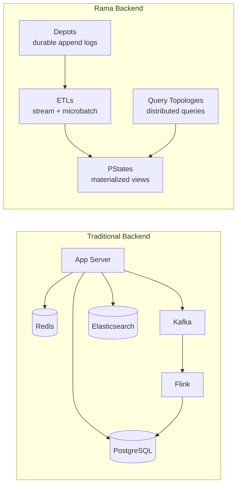
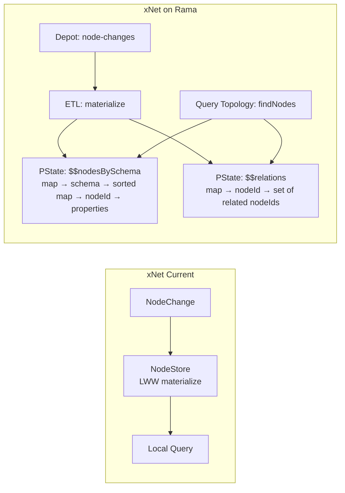
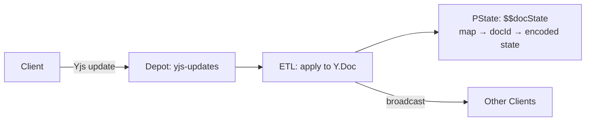
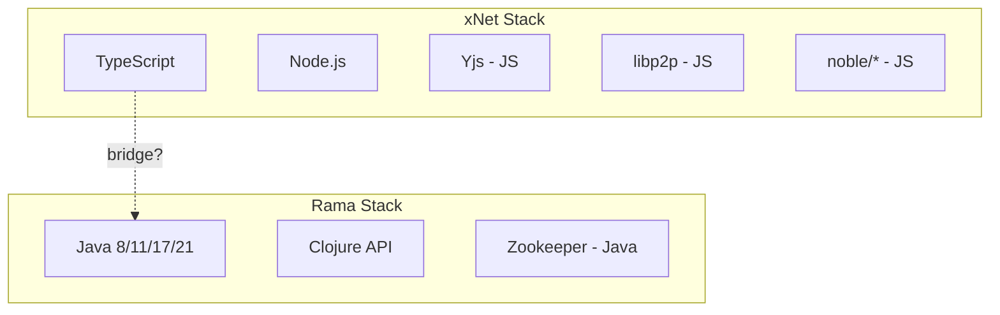
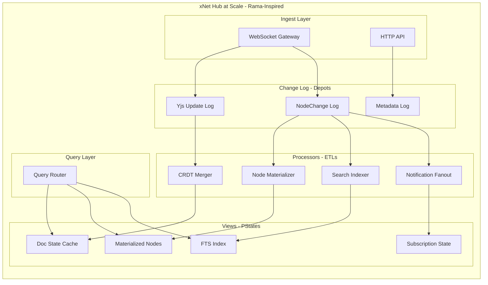

# Exploration: Rama for the xNet Hub at Scale

## Context

The [Server Infrastructure exploration](./SERVER_INFRASTRUCTURE.md) proposes a hybrid approach: start with a simple Node.js + SQLite hub (Phase 1), then swap to PostgreSQL + S3 (Phase 2), and finally scale horizontally with Redis pub/sub + multiple workers (Phase 3). Phase 3 requires assembling and operating multiple independent systems (Postgres, Redis, S3, load balancer, multiple Node.js workers) — the classic distributed systems tax.

[Rama](https://redplanetlabs.com/) is a platform by Red Planet Labs (created by Nathan Marz, the creator of Apache Storm) that unifies computation and storage into a single coherent model. It replaces the need for separate databases, message queues, stream processors, and caches. Red Planet Labs demonstrated this by building a Twitter-scale Mastodon backend in 10k lines of code — 100x less than Twitter's equivalent — running 3,500 posts/sec at 403 avg fanout with linear scalability.

This exploration evaluates whether Rama is the right tool for xNet's hub **at the scale-out phase** (10,000+ users, federated queries, distributed indexes). It is NOT a proposal to replace Phase 1 (which should remain Node.js + SQLite for simplicity).

**TL;DR**: Rama's model is an almost perfect architectural fit for xNet's at-scale needs (event-sourced data, fanout, materialized views, reactive queries). However, the language mismatch (Java/Clojure), commercial licensing ($1000+/mo at scale), operational complexity (Zookeeper dependency), and the Clojure Port exploration's conclusion that CLJS adds interop friction all suggest Rama is better as _architectural inspiration_ than as a direct dependency. The right move: keep the Phase 1-2 Node.js hub, and when Phase 3 arrives, evaluate whether Rama's licensing model has evolved or whether a lighter event-sourcing framework (like Kafka + Flink + RocksDB, or a custom solution) can provide similar benefits in TypeScript.

---

## What Rama Is



Rama has four core concepts:

| Concept              | What It Does                                            | Traditional Equivalent         |
| -------------------- | ------------------------------------------------------- | ------------------------------ |
| **Depots**           | Durable, replicated, partitioned append-only logs       | Kafka topics                   |
| **ETLs**             | Stream or microbatch topologies that process depot data | Kafka Streams / Flink          |
| **PStates**          | Materialized views as composable data structures        | Database tables + Redis caches |
| **Query Topologies** | Distributed queries across PStates                      | Stored procedures + API layer  |

Key differentiators from assembling these separately:

- **Colocation**: ETLs, PStates, and query topologies run in the same processes — no network hops for reads during writes
- **Flexible indexing**: PStates are arbitrary nested data structures (map of sorted maps of sets), not rigid database schemas
- **Fine-grained reactivity**: `proxy` API pushes incremental diffs to subscribers (not just "row changed" triggers)
- **Linear scalability**: Add nodes → proportional throughput increase, no architectural changes
- **Single deployment unit**: One `.jar` file contains your entire backend

---

## Why Rama Architecturally Fits xNet

### 1. Event-Sourced Data Model → Depots + ETLs

xNet's `NodeStore` is already event-sourced: changes are appended as `SignedChange` objects with Lamport timestamps, then materialized into current state via LWW resolution.



The mapping is natural:

- `SignedChange` appends → Depot appends (with hash-chain ordering preserved)
- `NodeStore.materializeNode()` → ETL topology (LWW resolution per property)
- Local query engine → Query topologies (distributed, scalable)

### 2. Yjs CRDT Sync → Depot + Microbatch Persistence

The hub's sync relay receives Yjs updates from clients and persists them:



Rama's microbatch mode is ideal here — batch Yjs updates, merge into doc state, persist, and broadcast. The `DocPool` hot/warm/cold eviction strategy maps to PState's disk-backed storage with in-memory caching.

### 3. Timeline Fanout → Rama's Sweet Spot

The future social/activity features in VISION.md (feeds, notifications, activity streams) are exactly what Rama was built for. The Twitter-scale Mastodon demo proves:

- 3,500 posts/sec at 403 avg fanout
- Sub-100ms timeline rendering (87ms average)
- Linear scaling by adding nodes

xNet's equivalent: when a user updates a shared document, notify all collaborators, update search indexes, recompute rollup properties, trigger webhooks — all of this is "fanout" that Rama handles elegantly.

### 4. Distributed Search → PState Subindexing + Query Topologies

VISION.md's "decentralized Google" requires distributed full-text and semantic search indexes. Rama's PStates with subindexing can efficiently store:

```
$$searchIndex: map → schemaIri → subindexed sorted map → term → set of nodeIds
$$embeddings: map → nodeId → vector
```

Query topologies can scatter-gather across partitions, merge results, and return ranked results — all in the same deployment unit, no Elasticsearch cluster needed.

### 5. Fine-Grained Reactivity → Real-Time Collaboration

Rama's `proxy` API pushes incremental diffs: "key X in map Y changed from A to B". This is architecturally similar to xNet's Yjs awareness/presence system and could power:

- Real-time node property updates across devices
- Live query result updates (subscriptions)
- Collaborative awareness without polling

---

## Why Rama Doesn't Fit xNet (Today)

### 1. Language Mismatch: Java/Clojure vs TypeScript



The [Clojure Port exploration](./CLOJURE_PORT.md) already concluded:

- 70% of xNet's code is JS library interop (Yjs, libp2p, noble/curves)
- AI agents produce significantly worse Clojure than TypeScript
- The TypeScript ecosystem is 200-500x larger
- shadow-cljs has a single maintainer (bus factor = 1)

Using Rama means:

- Hub backend in Java or Clojure (different language from all other packages)
- All Yjs integration becomes interop (Y.Doc is a JS object)
- Cannot share `@xnetjs/data`, `@xnetjs/sync`, `@xnetjs/crypto` code with hub
- Two mental models, two build systems, two deployment pipelines

### 2. Commercial Licensing

| Tier       | Max Nodes  | Monthly Cost            |
| ---------- | ---------- | ----------------------- |
| Free       | 2 nodes    | $0                      |
| Evaluation | 100 nodes  | $0 (2 month limit)      |
| Pro        | 100 nodes  | $1,000 base + $100/node |
| Enterprise | >100 nodes | Custom                  |

For xNet's self-hostable philosophy:

- Self-hosters would need their OWN Rama license (or we'd need to bundle/redistribute)
- $1,000+/mo base cost for a hosted service is acceptable, but locks self-hosters out of scaling past 2 nodes
- Conflicts with MIT license and "anyone can run their own hub" principle

### 3. Operational Complexity

Rama requires:

- **Zookeeper cluster** for metadata coordination
- **Conductor daemon** for orchestration
- **Supervisor daemons** on each worker node
- **Module deployment** via `.jar` files

Compare to the Phase 1 hub: `npx @xnetjs/hub` — one command, zero dependencies.

Even at scale, the Phase 3 proposal (Postgres + Redis + S3 + Node.js workers) uses well-understood, widely-available managed services. Rama introduces a novel system that few engineers know, few cloud providers support, and has a small community.

### 4. No TypeScript/JavaScript API

Rama is Java-only with a Clojure wrapper. There is no:

- Node.js client library
- TypeScript SDK
- JavaScript depot/PState client
- REST API for PState queries (UPDATE: Rama does have a REST API, but it's limited)

The hub would need a gateway layer translating between TypeScript clients and Java/Clojure Rama modules — adding latency and complexity.

### 5. Yjs Integration Is Awkward

Yjs is a JavaScript CRDT library. In Rama:

- Y.Doc would need to run in a Node.js sidecar or via GraalVM polyglot
- Every CRDT merge operation crosses a language boundary
- The sync protocol (currently pure TypeScript) would need a Java reimplementation or bridge

This is the same interop friction the Clojure exploration identified, but worse — Rama's ETLs run in JVM processes, not in Node.js.

---

## Comparison: Phase 3 Approaches

| Dimension                | Node.js + Postgres + Redis       | Rama                                             |
| ------------------------ | -------------------------------- | ------------------------------------------------ |
| Language match           | TypeScript (same as client)      | Java/Clojure (different)                         |
| Code sharing with client | Full (@xnetjs/\* packages)       | None                                             |
| Yjs integration          | Native (same process)            | Interop bridge required                          |
| Operational complexity   | 4 services (app, PG, Redis, S3)  | 5+ daemons (ZK, Conductor, Supervisors, Workers) |
| Self-hosting ease        | `docker-compose up`              | Complex multi-daemon setup                       |
| Licensing                | All open source                  | $1000+/mo at scale                               |
| Linear scalability       | Manual (add workers, shard PG)   | Built-in (add nodes)                             |
| Event sourcing           | Must build (Kafka/custom)        | Native (depots)                                  |
| Materialized views       | Must build (triggers/workers)    | Native (PStates)                                 |
| Reactive queries         | Must build (WebSocket + polling) | Native (proxy diffs)                             |
| Full-text search         | PG FTS or Elasticsearch          | PState subindexing                               |
| Community/hiring         | Massive                          | Tiny                                             |
| AI code generation       | Excellent                        | Poor                                             |
| Cost at 10 nodes         | ~$200/mo (managed services)      | ~$2000/mo (license + infra)                      |
| Time to implement        | 4-6 weeks                        | 8-12 weeks (learning curve)                      |

---

## What We Can Learn From Rama

Even without adopting Rama, its architecture validates several design decisions and offers inspiration:

### 1. Depot Pattern → Our Change Log

Rama's depots are append-only logs that drive all computation. xNet already has this pattern — `SignedChange` is an append-only hash-chain that materializes into node state. The hub should make this first-class:

```typescript
// The hub's change log IS a depot
interface ChangeLog {
  append(change: SignedChange): Promise<void>
  subscribe(since: LamportTime): AsyncIterable<SignedChange>
  getChanges(nodeId: NodeId, since?: LamportTime): Promise<SignedChange[]>
}
```

### 2. PState Pattern → Our Materialized Views

Instead of querying raw change logs, the hub should maintain pre-computed views:

```typescript
// PState-inspired materialized views
interface MaterializedView<T> {
  // Updated by "ETL" (change processor)
  apply(change: SignedChange): void

  // Queried by clients
  get(key: string): T

  // Reactive (Rama's proxy equivalent)
  subscribe(key: string): Observable<Diff<T>>
}

// Example views:
// - nodesBySchema: Map<SchemaIRI, Map<NodeId, NodeState>>
// - searchIndex: Map<Term, Set<NodeId>>
// - relationGraph: Map<NodeId, Set<NodeId>>
```

### 3. Colocation Principle → Single-Process Advantage

Rama colocates computation and storage for zero-latency reads during writes. Our Phase 1 hub already does this (SQLite in-process). At scale, we should preserve colocation where possible:

- Each worker "owns" a partition of nodes
- Materialized views are local to the owning worker
- Cross-partition queries use a scatter-gather pattern

### 4. Flexible Indexing → Beyond Relational

Rama's PStates can be any nested data structure. We should avoid over-committing to relational schemas:

```typescript
// Flexible, denormalized indexes (PState-inspired)
// Instead of: SELECT * FROM nodes WHERE schema = 'Task' AND status = 'done'
// Store: nodesBySchemaAndProperty['Task']['status']['done'] = Set<NodeId>
```

### 5. Fine-Grained Reactivity → Diff-Based Sync

Rama pushes diffs, not full values. xNet should adopt this for hub subscriptions:

```typescript
// Instead of sending full query results on every change:
type QuerySubscription = {
  initial: NodeState[]
  updates: Observable<{
    type: 'added' | 'removed' | 'updated'
    nodeId: NodeId
    diff?: Partial<NodeState> // Only changed fields
  }>
}
```

---

## Alternative: Rama-Inspired TypeScript Architecture

Rather than adopting Rama directly, we can build a "mini-Rama" in TypeScript that captures the key architectural benefits without the language/licensing constraints:



Implementation options for the "mini-Rama" components:

| Component    | Rama Equivalent   | TypeScript Implementation                                     |
| ------------ | ----------------- | ------------------------------------------------------------- |
| Change Logs  | Depots            | SQLite WAL / Postgres logical replication / custom append log |
| Processors   | ETLs              | Worker threads processing from change logs                    |
| Views        | PStates           | SQLite tables / in-memory maps / Redis                        |
| Partitioning | Hash partitioning | Consistent hashing across worker processes                    |
| Reactivity   | Proxy diffs       | WebSocket subscriptions with JSON Patch diffs                 |
| Scalability  | Add Rama nodes    | Add worker processes + Redis pub/sub for coordination         |

This gives us:

- Same language (TypeScript) across client and server
- Same packages (@xnetjs/data, @xnetjs/sync) running in hub workers
- Event-sourced architecture with materialized views
- Incremental scalability (add workers)
- No commercial license dependency
- Familiar operational model (Docker, managed services)

---

## When Rama WOULD Be the Right Choice

Rama would make sense for xNet if:

1. **The hub was a separate product** with its own team (not sharing code with client packages)
2. **Java/Clojure was the existing stack** (not TypeScript)
3. **The licensing was open source** or had a generous free tier for self-hosters
4. **Yjs didn't exist** or the CRDT was a Java-native implementation
5. **The team had JVM expertise** and didn't need AI agents for hub development
6. **Scale was the primary constraint from day one** (it's not — Phase 1 serves 90% of users)

None of these conditions hold for xNet today. If condition #3 changes (Rama goes fully open source), it would be worth revisiting.

---

## Recommendation

**Do not adopt Rama for xNet's hub.** Instead:

1. **Phase 1-2**: Keep the Node.js + SQLite → Postgres plan (simple, ships fast)
2. **Phase 3**: Build a "Rama-inspired" architecture in TypeScript:
   - Append-only change logs (depot pattern)
   - Worker processes consuming logs and building materialized views (ETL pattern)
   - Denormalized, purpose-built indexes per query (PState pattern)
   - Diff-based WebSocket subscriptions (proxy pattern)
   - Consistent-hash partitioning across workers
3. **Monitor Rama's evolution**: If licensing becomes more permissive, or if a TypeScript binding appears, revisit

The key insight from Rama: **the architecture is the innovation, not the runtime**. We can implement depots + ETLs + PStates in TypeScript with familiar tools, getting 80% of Rama's architectural benefits with 0% of its integration costs.

---

## References

- [Red Planet Labs - Rama Documentation](https://redplanetlabs.com/docs/~/index.html)
- [How we reduced the cost of building Twitter at Twitter-scale by 100x](https://blog.redplanetlabs.com/2023/08/15/how-we-reduced-the-cost-of-building-twitter-at-twitter-scale-by-100x/)
- [Twitter-scale Mastodon (open source)](https://github.com/redplanetlabs/twitter-scale-mastodon)
- [Rama Pricing](https://redplanetlabs.com/pricing)
- [xNet Server Infrastructure Exploration](./SERVER_INFRASTRUCTURE.md)
- [xNet Clojure Port Exploration](./CLOJURE_PORT.md)
- [Nathan Marz - "Suffering-Oriented Programming"](http://nathanmarz.com/blog/suffering-oriented-programming.html)
