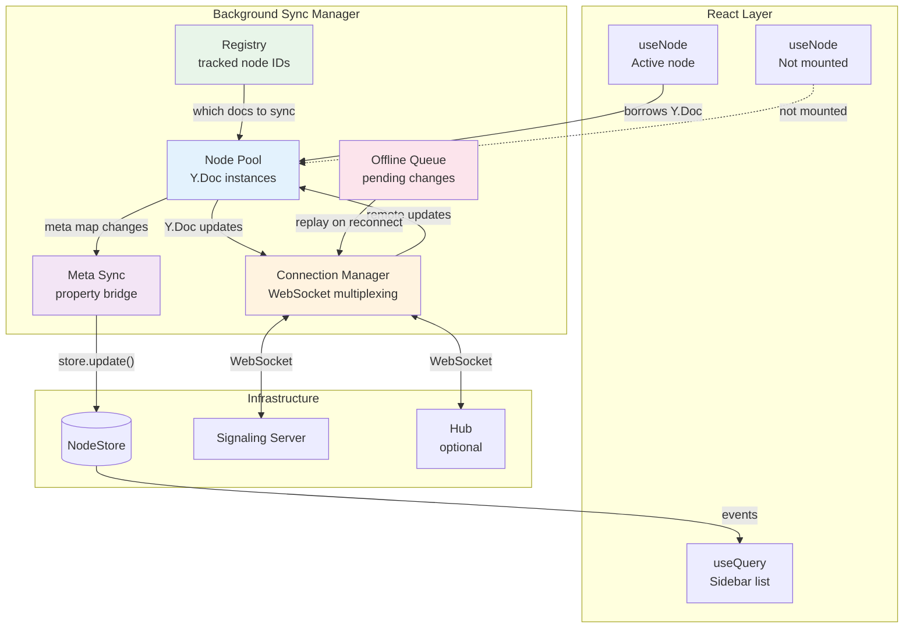
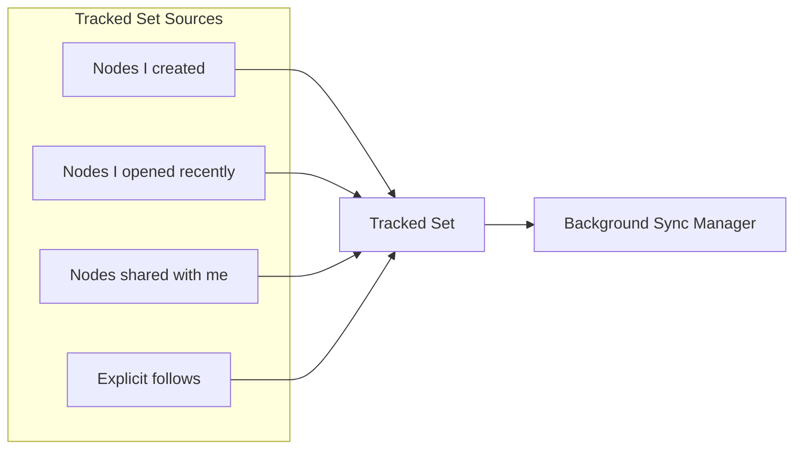
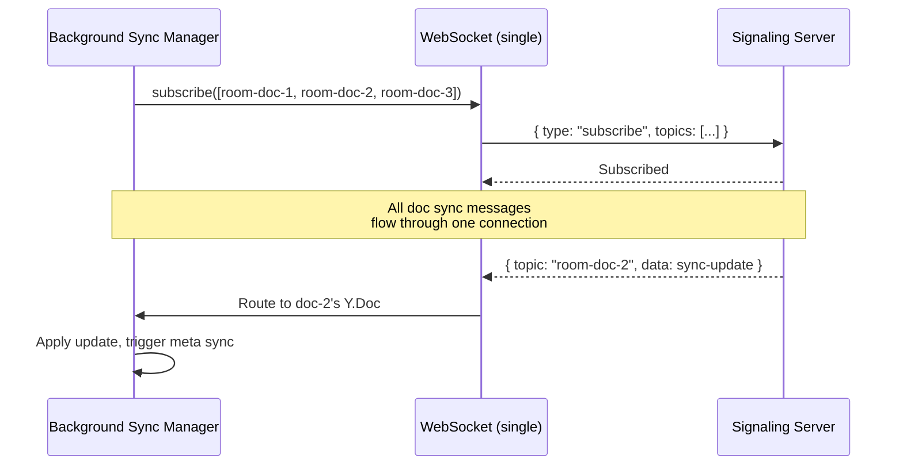
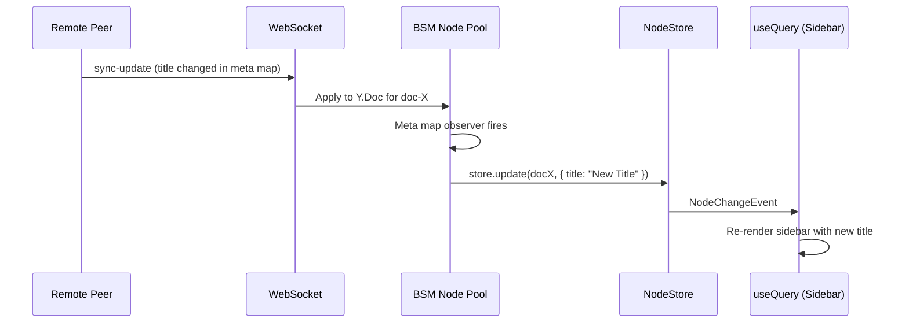
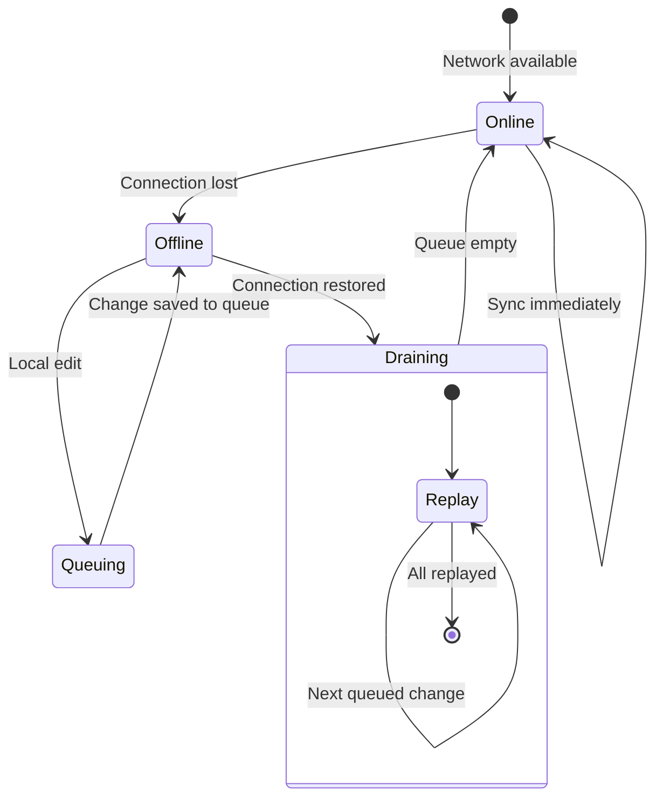
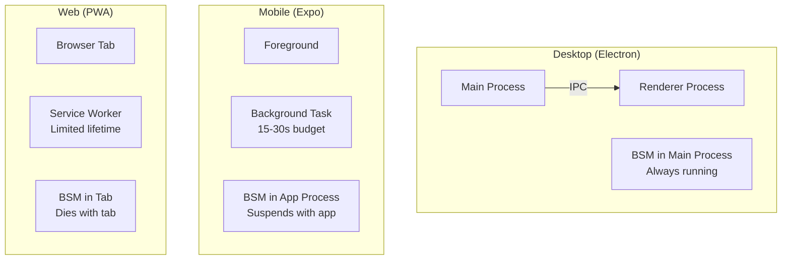
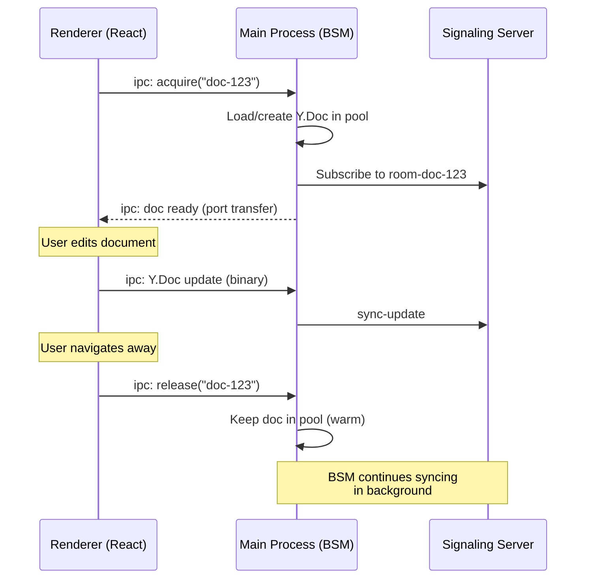
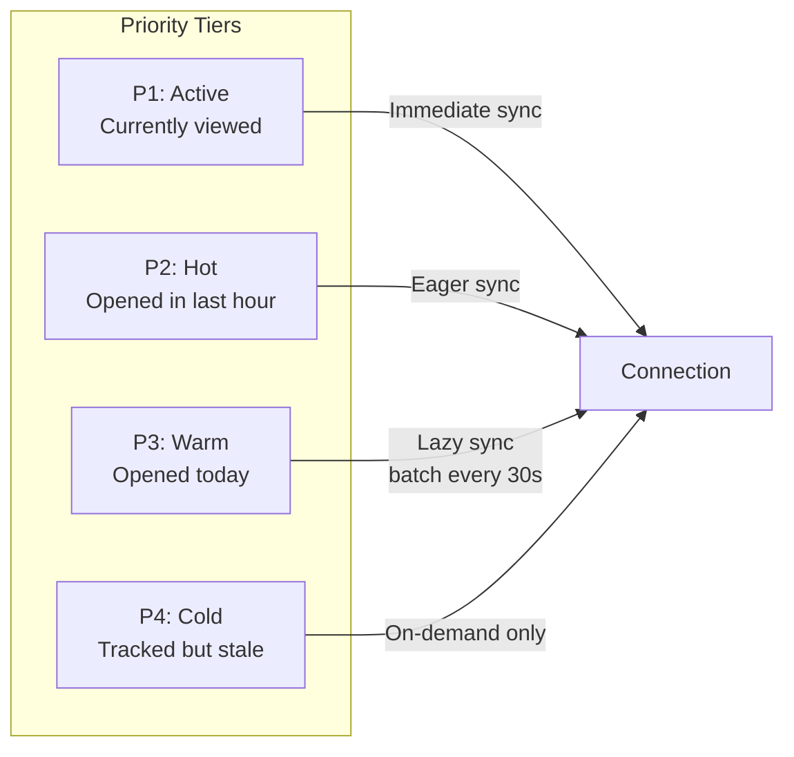
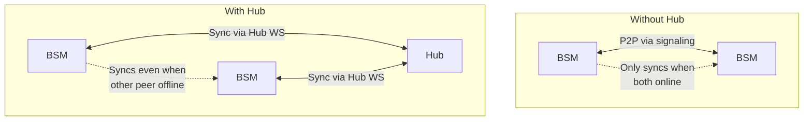

# Background Sync Manager

> Client-side sync orchestrator that keeps Nodes synced independently of UI component lifecycle

## Problem Statement

Currently, sync is entirely **reactive and component-scoped**: `useNode` creates a `WebSocketSyncProvider` per open Node. When the component unmounts (user navigates away), the provider is destroyed and sync stops.

This creates several concrete problems:

| Problem                | Example                                             | User Impact                                |
| ---------------------- | --------------------------------------------------- | ------------------------------------------ |
| **Stale sidebar**      | Peer edits a title on doc A while I'm viewing doc B | Sidebar shows old title until I open doc A |
| **Missed updates**     | Peer adds rows to a shared database I'm not viewing | I don't see changes until I re-open it     |
| **Cold start latency** | Opening a shared doc after being offline            | Full sync on open — slow first paint       |
| **No offline queue**   | Edit a doc, close it, lose network                  | Changes may not have synced before unmount |
| **Awareness gaps**     | Can't show "X is editing doc Y" in sidebar          | No presence data for non-viewed docs       |

The hub (planStep03_8) solves the **server-side** persistence problem — documents stay synced on the server even when no clients are online. But the **client** still needs a way to maintain sync state for documents the user owns/follows without requiring them to be rendered.

## Architecture

The Background Sync Manager (BSM) sits between the storage layer and the network, managing Node sync state (Y.Doc instances + meta properties) independently of React.



## Key Design Decisions

### 1. Ownership Inversion

Currently: React component creates and owns the Y.Doc + provider.
Proposed: BSM owns Y.Doc instances; React components **borrow** them.

```typescript
// Current: useNode creates Y.Doc internally
const { doc } = useNode(PageSchema, docId)
// doc is created on mount, destroyed on unmount

// Proposed: useNode borrows from BSM
const { doc } = useNode(PageSchema, docId)
// doc comes from BSM pool — survives unmount
```

This is analogous to the hub's `NodePool` (LRU managed Y.Doc instances) but on the client side.

### 2. Tracked Document Set

Not every Node should be synced in the background. The BSM tracks a set of "followed" Nodes:



**Heuristic**: Track any Node the user has opened in the last N days, plus explicitly shared Nodes. The set is persisted in storage so it survives app restarts.

### 3. Connection Multiplexing

Instead of one WebSocket per Node, the BSM multiplexes all tracked Nodes over a single WebSocket connection (or a small pool for parallelism):



This reduces connection count from O(tracked nodes) to O(1), which matters for resource-constrained environments (mobile, many tabs).

### 4. Meta Sync Bridge

When a remote update changes the meta map of a background-synced Node, the BSM applies it to the NodeStore — bridging the gap that currently only `useNode` fills:



This is exactly what `applyMetaToNodeStore` does in `useNode` today — the BSM extracts that logic into a persistent service.

### 5. Offline Queue

When the network is unavailable, local changes are queued:



The queue is persisted to storage (IndexedDB/SQLite) so pending changes survive app restarts. On reconnect, queued Y.Doc updates are replayed in order.

## Component Design

### SyncManager Class

```typescript
interface SyncManagerConfig {
  /** Storage adapter for persisting tracked set + queue */
  storage: NodeStorageAdapter
  /** NodeStore instance for meta sync bridge */
  nodeStore: NodeStore
  /** Signaling server URL */
  signalingUrl: string
  /** Optional hub URL (uses hub as primary sync target) */
  hubUrl?: string
  /** Max concurrent Y.Doc instances in memory (LRU eviction) */
  poolSize?: number // default: 50
  /** How long to keep a doc tracked after last open (ms) */
  trackTTL?: number // default: 7 days
  /** Author DID for awareness */
  authorDID?: string
}

interface SyncManager {
  /** Start the background sync manager */
  start(): Promise<void>
  /** Stop and cleanup */
  stop(): Promise<void>

  /** Add a document to the tracked set */
  track(docId: string, schemaId: string): void
  /** Remove a document from the tracked set */
  untrack(docId: string): void
  /** Get all tracked document IDs */
  getTracked(): TrackedDoc[]

  /** Borrow a Y.Doc (used by useDocument) */
  acquire(docId: string): Promise<Y.Doc>
  /** Return a Y.Doc (component unmounted, but doc stays in pool) */
  release(docId: string): void

  /** Connection status */
  readonly status: SyncStatus
  /** Number of docs currently in memory */
  readonly poolCount: number
  /** Number of queued offline changes */
  readonly queueSize: number

  /** Subscribe to status changes */
  on(event: 'status', handler: (status: SyncStatus) => void): void
  on(event: 'sync', handler: (docId: string) => void): void
  on(event: 'error', handler: (error: Error) => void): void
}

interface TrackedDoc {
  docId: string
  schemaId: string
  lastOpened: number
  lastSynced: number
}
```

### Node Pool (Client-Side LRU)

```typescript
/**
 * Client-side Node pool with LRU eviction.
 *
 * States:
 * - Active: Component has acquired it (never evicted)
 * - Warm: Recently released, still in memory (evicted on pressure)
 * - Cold: On disk only, loaded on demand
 *
 * Eviction saves Y.Doc state to storage before dropping from memory.
 */
interface NodePoolEntry {
  doc: Y.Doc
  state: 'active' | 'warm' | 'cold'
  refCount: number // active borrowers
  lastAccess: number
  dirty: boolean // has unsaved changes
  metaObserver: () => void // cleanup handle
}
```

### Integration with useNode

```typescript
// packages/react/src/hooks/useDocument.ts (proposed changes)

export function useNode<P extends Record<string, PropertyBuilder>>(
  schema: DefinedSchema<P>,
  id: string | null,
  options: UseNodeOptions<P> = {}
): UseNodeResult<P> {
  const syncManager = useSyncManager() // From XNetProvider context

  useEffect(() => {
    if (!id || !syncManager) return

    // Acquire Y.Doc from BSM (creates or reuses from pool)
    let doc: Y.Doc | null = null
    syncManager.acquire(id).then((d) => {
      doc = d
      setDoc(d)
    })

    return () => {
      if (id) {
        // Release back to pool (stays alive for background sync)
        syncManager.release(id)
      }
    }
  }, [id, syncManager])

  // ... rest of hook uses the borrowed doc
}
```

## Platform Considerations



| Platform    | BSM Lifetime                      | Constraints                               | Strategy                                          |
| ----------- | --------------------------------- | ----------------------------------------- | ------------------------------------------------- |
| **Desktop** | Always-on (main process)          | None — full OS access                     | Run BSM in Electron main process, IPC to renderer |
| **Mobile**  | App foreground + brief background | iOS: 30s background, no persistent WS     | Sync on foreground; batch on background wake      |
| **Web**     | Tab lifetime only                 | No persistent connections when tab closed | Sync while tab open; rely on hub for offline      |

### Desktop: Main Process BSM

On desktop, the BSM runs in the Electron main process. This means:

- It survives renderer crashes/reloads
- It can maintain WebSocket connections even when all windows are closed (dock/tray mode)
- Renderer communicates via IPC to acquire/release docs



### Mobile: Foreground + Wake Sync

On mobile, persistent WebSocket connections aren't possible when backgrounded. Strategy:

- Sync aggressively while foregrounded
- On background entry: flush queue, save all dirty docs
- On background wake (push notification, periodic task): quick sync burst

### Web: Tab-Lifetime + Hub Fallback

In the browser, the BSM lives in the tab. When the tab closes, sync stops.

- For offline resilience: rely on the hub to persist state
- Service Worker could handle basic push notifications for "doc updated" alerts
- SharedWorker could share a BSM across multiple tabs (same origin)

## Sync Priority & Bandwidth

Not all tracked Nodes are equally important. The BSM uses a priority system:



| Priority    | Sync Behavior           | Pool State        | Meta Bridge |
| ----------- | ----------------------- | ----------------- | ----------- |
| P1 (Active) | Real-time, every update | In memory, active | Immediate   |
| P2 (Hot)    | Real-time, subscribed   | In memory, warm   | Immediate   |
| P3 (Warm)   | Batched every 30s       | In memory or disk | On batch    |
| P4 (Cold)   | Only when opened        | Disk only         | None        |

This prevents the BSM from consuming unbounded bandwidth syncing hundreds of stale Nodes.

## Relationship to Hub

The BSM and Hub are complementary:



| Concern           | BSM (Client)             | Hub (Server)                    |
| ----------------- | ------------------------ | ------------------------------- |
| **Purpose**       | Keep local state fresh   | Persist state for offline peers |
| **Lifetime**      | App process              | Always-on server                |
| **Node storage**  | LRU pool + disk          | All subscribed nodes            |
| **Connection**    | To signaling or hub      | Accepts from clients            |
| **Offline story** | Queue changes locally    | Store changes for absent peers  |
| **Awareness**     | Track who's editing what | Relay awareness between peers   |

Without a hub, the BSM still provides value: it keeps Nodes synced with peers who happen to be online simultaneously. With a hub, the BSM can sync through the hub even when the original author is offline.

## Migration Path

### Phase 1: Extract Meta Sync (Immediate, No New Package)

Move `applyMetaToNodeStore` out of `useNode` into a standalone utility. When the BSM isn't available (current behavior), `useNode` still handles its own meta sync. When BSM is present, it handles meta sync for all tracked Nodes.

```typescript
// packages/react/src/sync/meta-bridge.ts
export function createMetaBridge(store: NodeStore) {
  return {
    observe(docId: string, doc: Y.Doc): () => void {
      const metaMap = doc.getMap('meta')
      const observer = (event: Y.YMapEvent<unknown>) => {
        if (event.transaction.origin !== null && event.transaction.origin !== 'local') {
          applyMetaToNodeStore(docId, metaMap, store)
        }
      }
      metaMap.observe(observer)
      return () => metaMap.unobserve(observer)
    }
  }
}
```

### Phase 2: Node Pool + Registry (New `@xnet/sync-manager` or extend `@xnet/react`)

Add the pool and tracked set. `useNode` starts borrowing from the pool instead of creating its own Y.Doc. Nodes released by the UI stay in the pool and continue syncing.

### Phase 3: Connection Multiplexing

Replace per-Node WebSocket connections with a single multiplexed connection. The signaling protocol already supports multi-room subscriptions (`subscribe: topics[]`), so this is mostly a client-side refactor.

### Phase 4: Offline Queue + Desktop Main Process

Add persistent offline queue. On desktop, move BSM to the Electron main process for true always-on background sync.

## Where This Fits in Plan Sequence

| Step     | Topic                       | Relationship                               |
| -------- | --------------------------- | ------------------------------------------ |
| 03_2     | Signaling                   | BSM uses the signaling protocol            |
| 03_4     | Expo Storage                | BSM needs durable offline queue on mobile  |
| 03_5     | Plugins                     | Plugin services could extend BSM           |
| **03_9** | **Background Sync Manager** | **This work**                              |
| 03_8     | Hub                         | BSM connects to hub as primary sync target |

The BSM should come after signaling (03_2) is stable and before the hub (03_8), since:

- It provides immediate value without requiring hub infrastructure
- It establishes the client-side patterns that hub integration builds on
- The hub's client integration (08-client-integration.md) assumes a connection manager exists

Recommended plan step: **`planStep03_9BackgroundSyncManager`**

## Naming: Node is the Unit of Sync

The hook is `useNode` (with `useDocument` kept as a backwards-compatible alias). The Node is the universal container — it holds structured properties AND optionally a Y.Doc. The Y.Doc is just one sync channel within a Node.

A Node has **two sync channels** that both need to converge for it to be "fully synced":

| Layer                 | Transport                            | Data                       |
| --------------------- | ------------------------------------ | -------------------------- |
| Structured properties | Change log (LWW, not yet synced P2P) | title, status, etc.        |
| CRDT content          | Yjs protocol (WebSocket)             | Rich text, canvas, DB rows |

Both are keyed by the same Node ID.

### Naming conventions (decided)

| Name                    | Rationale                                     |
| ----------------------- | --------------------------------------------- |
| `useNode`               | Hook loads a Node (properties + optional doc) |
| `NodePool`              | Pool manages full Node sync lifecycle         |
| `WebSocketSyncProvider` | Specifically the Y.Doc sync transport         |
| `applyMetaToNodeStore`  | Describes the meta→store bridge               |
| `useDocument`           | Deprecated alias for `useNode`                |

## Open Questions

1. **SharedWorker for web?** — Could a SharedWorker host the BSM across tabs? This avoids redundant connections but adds complexity. Worth exploring for web-heavy deployments.

2. **Memory budget** — How many Y.Docs can we keep in memory? Each Y.Doc is roughly (document size \* 2-3x) in memory. A pool of 50 docs at ~100KB each = ~5MB — acceptable for desktop, tight for mobile.

3. **Selective sync** — Should the BSM sync full Y.Doc content or just the meta map for background docs? Meta-only sync would reduce bandwidth significantly but wouldn't provide instant content when opening a doc.

4. **Conflict with useDocument** — When `useDocument` is active for a doc, should BSM step aside entirely or share the Y.Doc instance? Sharing is more efficient but requires careful refcount management.

5. **Push notifications** — On mobile, could we use push to wake the app when a tracked doc changes? This would provide near-real-time sidebar updates even when backgrounded.

## Estimated Effort

| Phase                                 | Scope                          | Effort         |
| ------------------------------------- | ------------------------------ | -------------- |
| Phase 1: Meta Bridge extract          | Refactor only                  | 1-2 days       |
| Phase 2: Node Pool + Registry         | New code, modify useNode       | 3-5 days       |
| Phase 3: Connection Multiplexing      | Refactor WebSocketSyncProvider | 2-3 days       |
| Phase 4: Offline Queue + Main Process | New persistence, IPC           | 5-7 days       |
| **Total**                             |                                | **~2-3 weeks** |

## References

- `packages/react/src/hooks/useDocument.ts` — Current per-component sync (`useNode`)
- `packages/react/src/sync/WebSocketSyncProvider.ts` — Current per-Node connection
- `docs/planStep03_8HubPhase1VPS/03-sync-relay.md` — Hub's NodePool (server analog)
- `docs/planStep03_8HubPhase1VPS/08-client-integration.md` — Hub client connection
- `docs/planStep03_2Signaling/README.md` — Signaling protocol (multi-room subscribe)
- `docs/planStep03_4ExpoStorage/README.md` — Mobile offline queue requirements
- `docs/TRADEOFFS.md` — Why hybrid sync (Yjs + event-sourcing)
