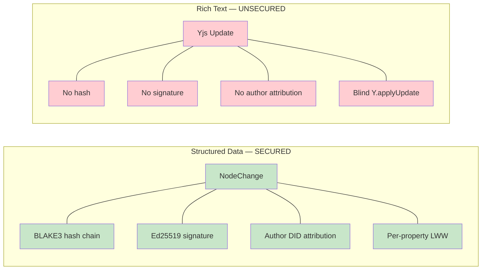
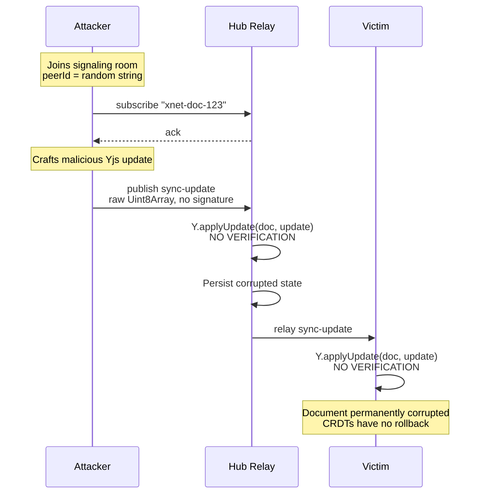
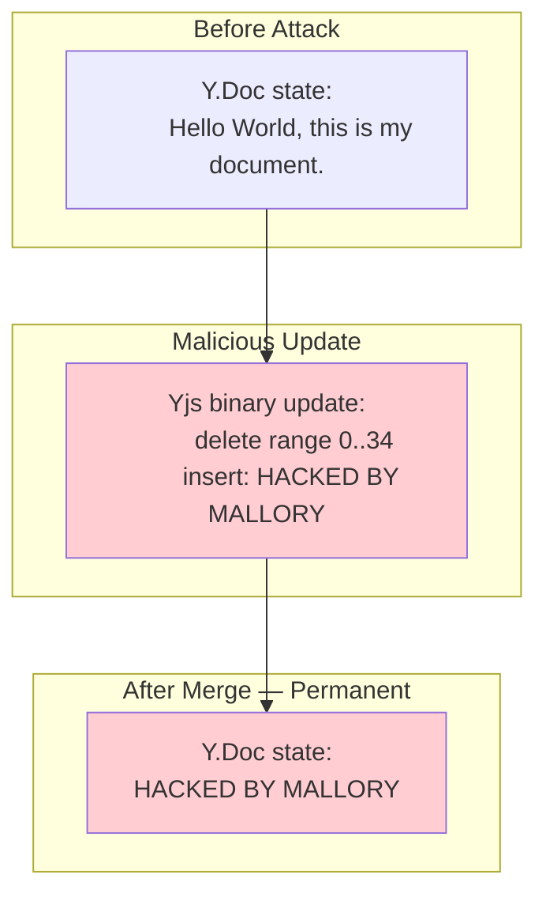
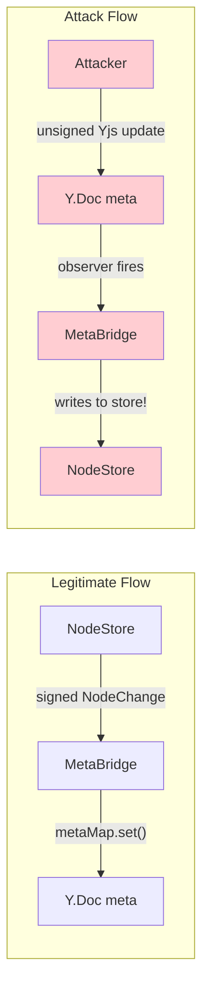
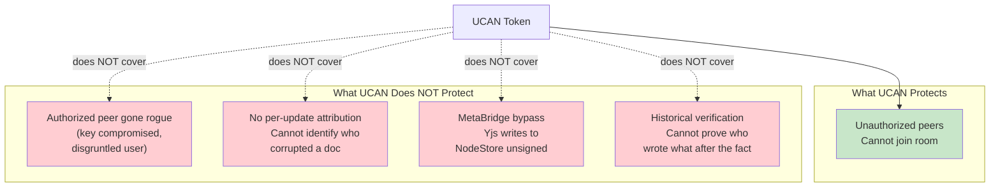
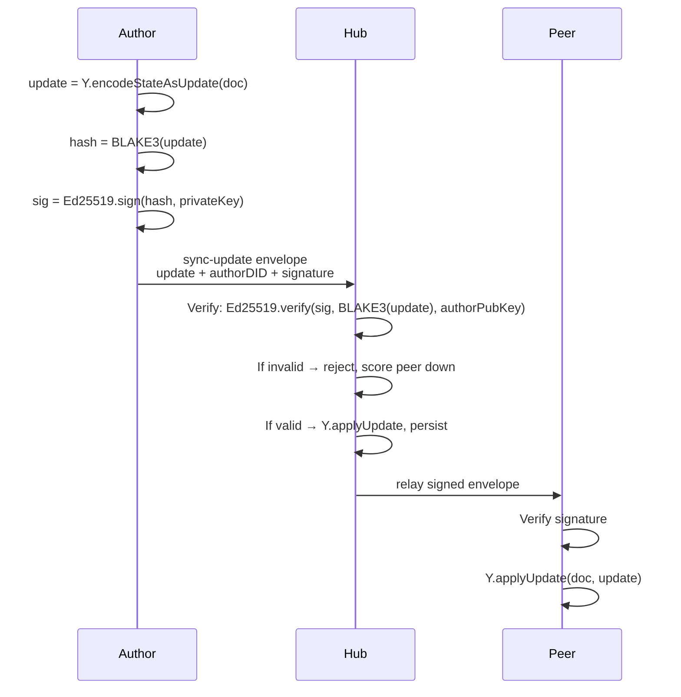
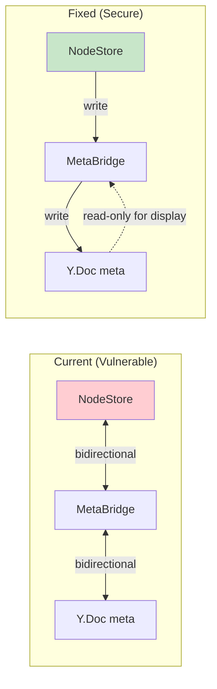
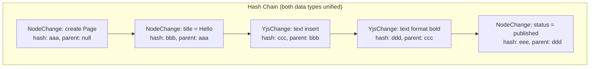
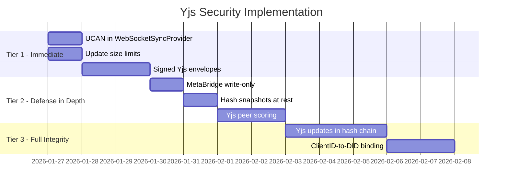

# Yjs Security Analysis

> The rich text layer has fundamentally weaker security guarantees than structured data — here's what's at risk and how to fix it.

## The Problem

xNet has two data layers with radically different security postures:



| Property          | NodeChanges                        | Yjs Updates                  |
| ----------------- | ---------------------------------- | ---------------------------- |
| Content integrity | BLAKE3 hash of canonical JSON      | None                         |
| Author proof      | Ed25519 signature per change       | None                         |
| Attribution       | `authorDID` field, verifiable      | Random `clientID` integer    |
| Chain linkage     | `parentHash` → verifiable history  | None                         |
| Tamper detection  | `verifyChangeHash()` recomputes    | None                         |
| Hub verification  | Hash check before persist          | Blind `Y.applyUpdate()`      |
| Audit trail       | Full change log with DID per entry | No history of who wrote what |

---

## How Yjs Updates Flow Today



Key observations from the code:

1. **`WebSocketSyncProvider`** (`packages/react/src/sync/WebSocketSyncProvider.ts`): The `peerId` is `Math.random().toString(36).slice(2, 10)` — not a DID, trivially spoofable.

2. **Message handling**: `_handleSyncMessage()` calls `Y.applyUpdate(this.doc, update, this)` directly on any received `sync-step2` or `sync-update`. Zero validation.

3. **Hub relay** (`03-sync-relay.md`): The `RelayService` calls `Y.applyUpdate(doc, update, 'relay')` on incoming updates, then persists via `pool.markDirty()`. No signature check.

4. **Storage**: `documentContent` is a raw `Uint8Array` in IndexedDB/SQLite. No hash envelope, no integrity check on load.

---

## Attack Vectors

### 1. Document Corruption (Irreversible)

A peer sends a crafted `sync-update` that:

- Deletes all existing content (Yjs deletion markers)
- Inserts arbitrary garbage text
- Once merged into the CRDT, this becomes canonical state
- All peers who sync will converge on the corrupted version
- **CRDTs have no rollback** — the garbage is permanent



**Recovery options**: Restore from a backup blob (if one exists). But any peer who synced the corrupted state before the restore will re-propagate the corruption.

### 2. Author Impersonation

Yjs `clientID` is a random integer assigned per `Y.Doc` instance. It has no cryptographic binding to a DID:

- An attacker can set `doc.clientID = victimClientID`
- Edits will appear to come from the victim in awareness/cursor UIs
- The change history in the Yjs document structure will attribute content to the wrong author
- **No forensic trail** — there's no signature to prove who really wrote what

### 3. MetaBridge Poisoning (Bypass NodeChange Signatures)

The `MetaBridge` (`packages/react/src/sync/meta-bridge.ts`) observes the Y.Doc's meta map and writes changes into the NodeStore:



A malicious peer can set arbitrary properties via the Y.Doc meta map, and the MetaBridge will apply them to the local NodeStore — **completely bypassing the signed NodeChange pipeline**. This means:

- Title, status, tags, relations can be modified without a signature
- The change won't appear in the NodeChange audit log
- LWW timestamps won't be properly maintained

### 4. Denial of Service

- Legitimate Yjs edits are small (incremental updates, typically <1KB per keystroke batch)
- An attacker can send valid Yjs-formatted updates of arbitrary size
- `Y.applyUpdate()` is synchronous — processing a 50MB update blocks the event loop
- The hub's `DocPool` stores Y.Docs in memory — large documents exhaust RAM
- Current plan has `maxMessageSize: 5MB` but a valid 4.9MB Yjs update is expensive to merge

### 5. Stealth Content Injection

Unlike NodeChanges (which have an audit trail), a malicious Yjs update leaves no trace of who injected it:

- No DID in the update
- No signature to verify
- The hub relay just passes it through
- After merge, the content looks like any other text
- Could be used to inject misinformation, illegal content, or phishing links into a victim's documents

---

## What Yjs Itself Provides (and Doesn't)

### Internal Protections

| Feature                  | Protection Level                                     |
| ------------------------ | ---------------------------------------------------- |
| Binary format validation | Malformed updates throw on `Y.applyUpdate()`         |
| CRDT convergence         | All peers seeing same updates converge to same state |
| Idempotency              | Applying the same update twice is a no-op            |
| Undo manager             | Local undo only — cannot undo remote changes         |

### What Yjs Does NOT Provide

| Missing Feature     | Consequence                                                     |
| ------------------- | --------------------------------------------------------------- |
| Signed updates      | Any peer can send any content                                   |
| Author verification | `clientID` is a random integer, not cryptographic               |
| Access control      | Yjs has no concept of permissions                               |
| Rollback            | CRDTs always merge forward — no "reject this update"            |
| Size enforcement    | No limit on update or document size                             |
| Selective rejection | Cannot reject one update without rejecting all from that client |

---

## Is UCAN Room-Gating Sufficient?

**No.** UCAN room-gating (from `02-ucan-auth.md`) is necessary but not sufficient:



UCAN prevents unauthorized access, but:

- A stolen key grants full write access to all documents in scope
- A legitimately authorized user can corrupt documents maliciously
- There is no per-update audit trail — no way to identify the attacker after the fact
- The MetaBridge bypass means Yjs corruption can poison the signed NodeStore

---

## Recommendations

### Tier 1: Immediate (Low Effort, High Impact)

These should be part of Hub Phase 1 implementation:

#### 1.1 Signed Yjs Update Envelopes

Wrap each outgoing Yjs update in a signed envelope before sending over WebSocket:

```typescript
interface SignedYjsEnvelope {
  /** The raw Yjs binary update */
  update: string // base64-encoded Uint8Array

  /** Author identity */
  authorDID: DID

  /** Ed25519 signature of BLAKE3(update bytes) */
  signature: string // base64

  /** When this update was created */
  timestamp: number

  /** Yjs clientID used by this author (for binding) */
  clientId: number
}
```



**Cost**: ~0.1ms per update for BLAKE3 + Ed25519. Negligible for typical edit rates (1-5 updates/sec).

#### 1.2 UCAN Token in WebSocketSyncProvider

Add authentication to the existing sync provider:

```typescript
// Current (insecure):
this.ws = new WebSocket(this.url)

// Fixed:
const url = new URL(this.url)
url.searchParams.set('token', this.ucanToken)
this.ws = new WebSocket(url.toString())
```

This is already planned in `08-client-integration.md` but should be prioritized.

#### 1.3 Per-Update Size Limits

Reject Yjs updates above a threshold at both client and hub:

```typescript
// In WebSocketSyncProvider._handleSyncMessage():
if (update.length > MAX_YJS_UPDATE_SIZE) {
  console.warn(`Rejecting oversized Yjs update: ${update.length} bytes`)
  return // Don't apply
}
```

Recommended limit: **1MB per individual update**. Legitimate incremental edits are typically <10KB. Large initial syncs (sync-step2) can be chunked.

---

### Tier 2: Defense in Depth (Medium Effort)

#### 2.1 Hash Yjs Snapshots at Rest

Store a BLAKE3 hash alongside persisted document content:

```typescript
// On persist:
const state = Y.encodeStateAsUpdate(doc)
const hash = blake3(state)
await storage.setDocState(docId, state)
await storage.setDocStateHash(docId, hash)

// On load:
const state = await storage.getDocState(docId)
const hash = await storage.getDocStateHash(docId)
if (hash && blake3(state) !== hash) {
  throw new Error('Document content tampered at rest')
}
```

This detects storage-level corruption (disk errors, database tampering) but not merge-level corruption.

#### 2.2 Make MetaBridge Write-Only (NodeStore → Yjs)

The current MetaBridge is bidirectional — Yjs meta map changes write back to NodeStore. Make it unidirectional:



Property changes should ONLY flow through signed NodeChanges. The Y.Doc meta map should be a read cache for the editor UI, not a write path.

#### 2.3 Peer Scoring for Yjs Behavior

Extend the `PeerScorer` (`packages/network/src/security/peer-scorer.ts`) with Yjs-specific metrics:

```typescript
interface YjsPeerMetrics {
  updatesPerMinute: number // Rate limiting
  averageUpdateSize: number // Size anomaly detection
  invalidSignatures: number // Tier 1 violations
  oversizedUpdates: number // Size limit violations
  unexpectedClientIds: number // clientID mismatch
}
```

Score degradation → eventual auto-block via the existing `AutoBlocker`.

---

### Tier 3: Full Integrity (Strongest Guarantees)

#### 3.1 Yjs Updates as Signed Changes in the Hash Chain

Wrap Yjs updates into the existing `Change<T>` system:

```typescript
interface YjsUpdatePayload {
  nodeId: NodeId
  update: Uint8Array // The Yjs binary update
  clientId: number // Yjs clientID for this author
}

type YjsChange = Change<YjsUpdatePayload>
// Gets: id, hash, parentHash, signature, authorDID, lamport, wallTime
```



**Trade-offs:**

- Full audit trail for rich text (who typed what, when)
- Significant overhead: ~200 bytes of envelope per update (signature + hash + metadata)
- At 5 updates/sec typing speed = ~1KB/sec of overhead
- Mitigation: batch updates every 2 seconds or on paragraph boundaries, reducing to 0.5 updates/sec

#### 3.2 ClientID-to-DID Binding

On room join, broadcast a signed attestation:

```typescript
interface ClientIdAttestation {
  type: 'clientid-bind'
  clientId: number // Yjs clientID for this session
  did: DID // The author's DID
  signature: Uint8Array // Ed25519 sign(clientId + did, privateKey)
  sessionExpiry: number // When this binding expires
}
```

Peers maintain a verified `clientID → DID` map. Updates from unattested clientIDs are rejected. This enables:

- Verifiable "who typed this paragraph" in the Yjs document structure
- Detection of clientID spoofing
- Accurate cursor/presence attribution

---

## Implementation Priority



## Minimum Viable Security Posture

The **minimum acceptable security** for a production hub is:

1. **UCAN room-gating** (prevents unauthorized access)
2. **Signed Yjs envelopes** (per-update attribution + integrity)
3. **Update size limits** (DoS prevention)
4. **MetaBridge write-only** (prevents NodeStore poisoning via Yjs)

This covers:

- Unauthorized access ✓
- Per-update verification ✓
- Author attribution ✓
- DoS mitigation ✓
- NodeStore integrity ✓

It does NOT cover:

- Full audit trail for rich text edits (Tier 3)
- ClientID-based attribution in Yjs internals (Tier 3)
- Storage-level tamper detection (Tier 2)

These can be added incrementally after the hub ships.

---

## References

| File                                                 | Relevance                                  |
| ---------------------------------------------------- | ------------------------------------------ |
| `packages/react/src/sync/WebSocketSyncProvider.ts`   | Current Yjs sync — no auth, no signing     |
| `packages/react/src/sync/meta-bridge.ts`             | MetaBridge — bidirectional Yjs ↔ NodeStore |
| `packages/react/src/sync/node-pool.ts`               | Y.Doc persistence — raw Uint8Array         |
| `packages/sync/src/change.ts`                        | How NodeChanges get signed + hashed        |
| `packages/network/src/security/peer-scorer.ts`       | Existing peer scoring infrastructure       |
| `packages/network/src/security/auto-blocker.ts`      | Auto-blocking misbehaving peers            |
| `docs/plans/plan03_8HubPhase1VPS/02-ucan-auth.md`    | Planned UCAN auth for hub                  |
| `docs/plans/plan03_8HubPhase1VPS/03-sync-relay.md`   | Hub Yjs relay — blind Y.applyUpdate        |
| `docs/explorations/0026_NODE_CHANGE_ARCHITECTURE.md` | How NodeChanges work (the secure path)     |
