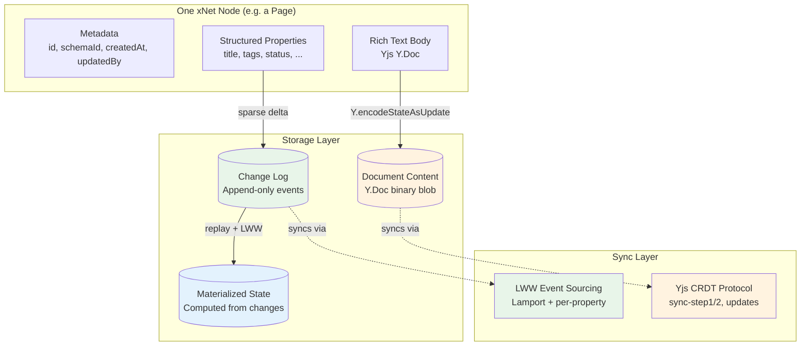
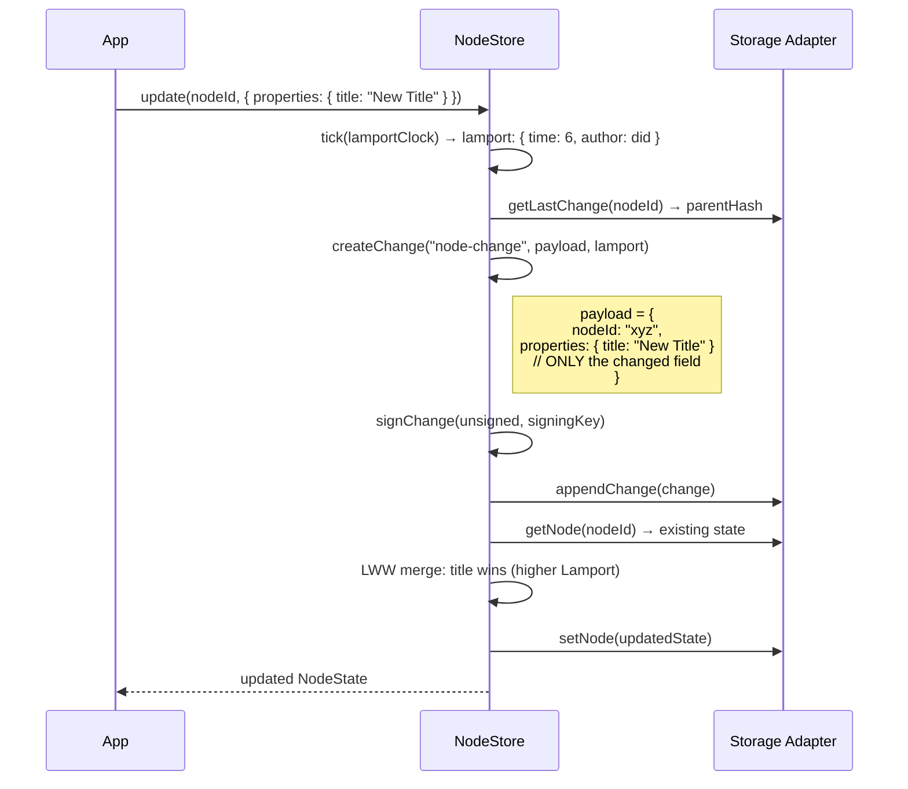
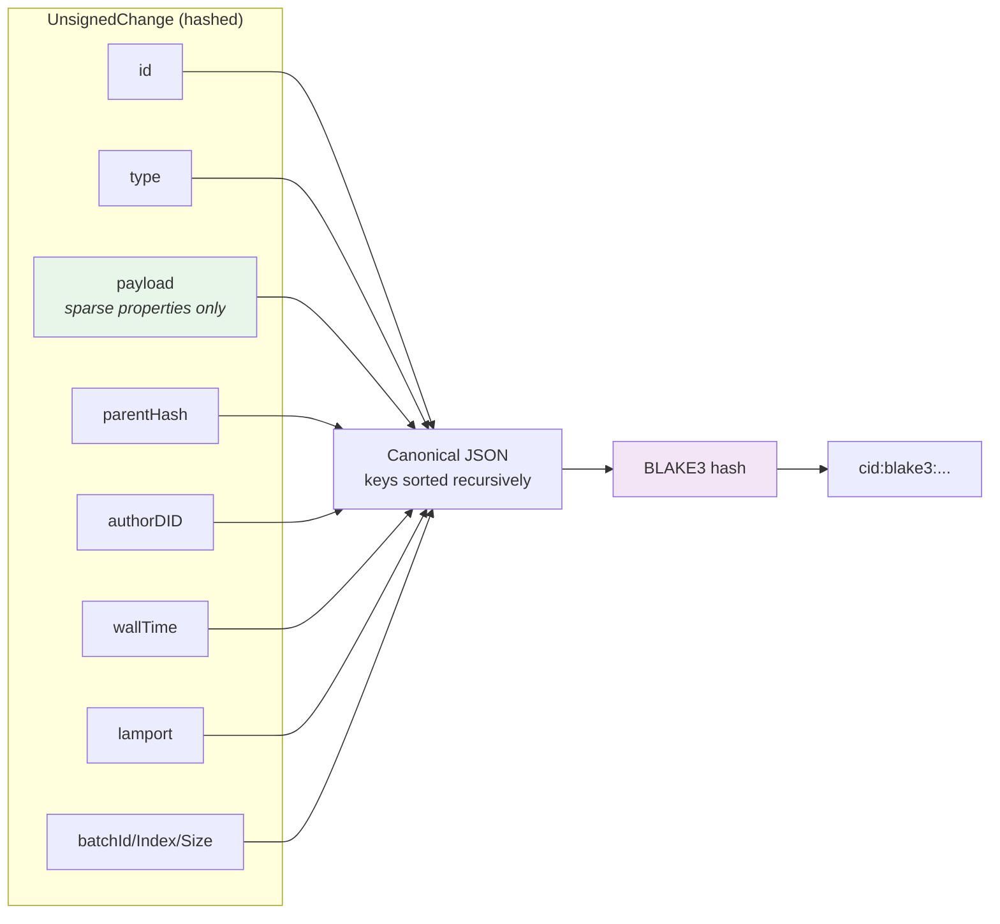
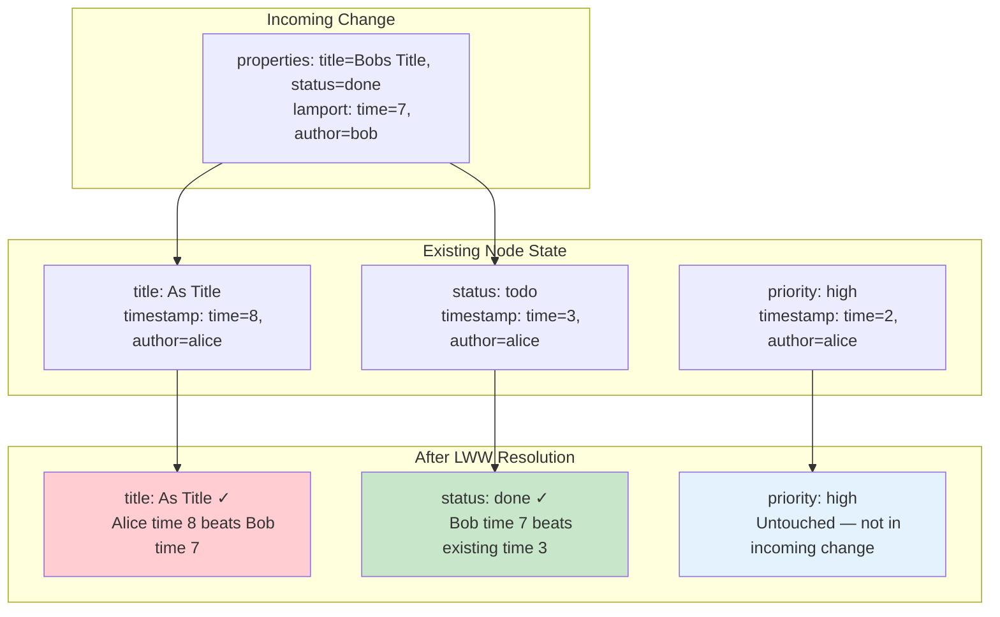
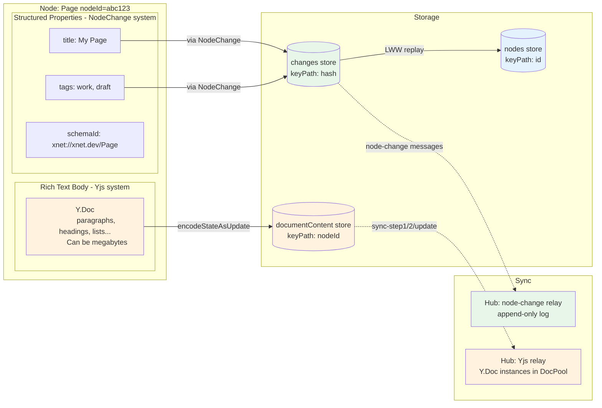
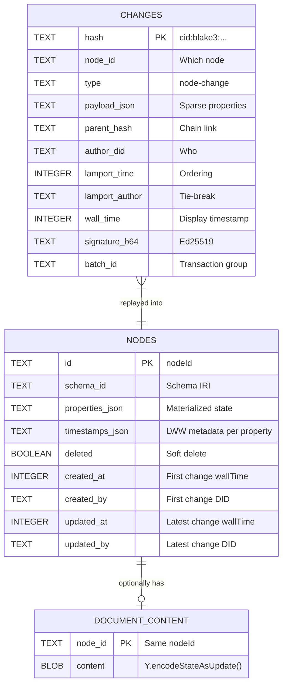
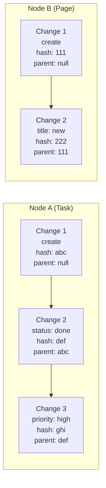
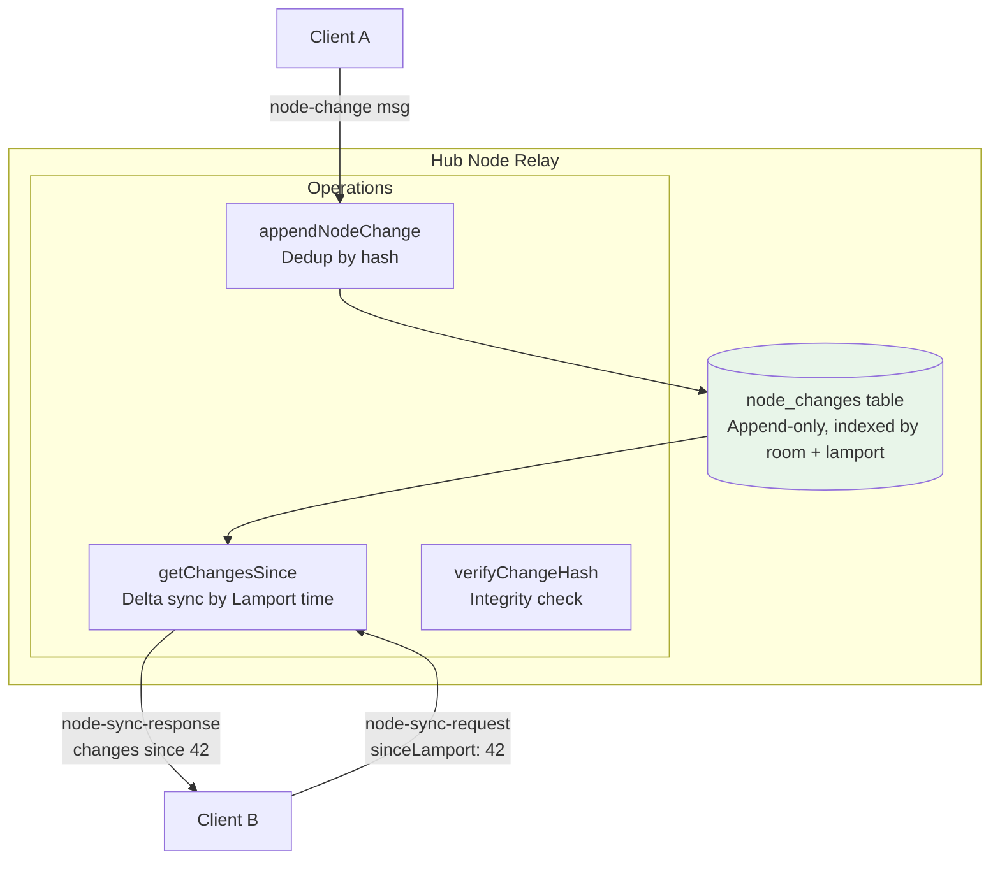

# Node Change Architecture Exploration

> How granular are NodeStore changes? How is Yjs content kept separate? A deep dive into the event-sourced structured data system.

## TL;DR

Changes are **sparse (delta-only)**. When you update one property, only that property goes into the change log. Yjs document content is stored in a **completely separate path** — it never appears in NodeChanges, never gets hashed into the change chain, and syncs via its own CRDT protocol. The two systems are independent by design.

---

## Architecture Overview



The key insight: **a Node with a rich text body is actually two independent data structures** that happen to share a `nodeId`. They sync via different protocols and never interfere with each other.

---

## How Granular Are Changes?

### Answer: Per-Property Delta (Sparse)

When you call `store.update(nodeId, { properties: { title: 'New Title' } })`, the resulting `NodeChange` contains **only** the changed property:



The `NodePayload` type enforces this explicitly:

```typescript
// packages/data/src/store/types.ts:33-51

interface NodePayload {
  nodeId: NodeId
  schemaId?: SchemaIRI // Only required on FIRST change (node creation)
  properties: Record<PropertyKey, unknown> // SPARSE - only what changed
  deleted?: boolean // Only present on delete/restore
}
```

### What Does NOT Go Into a Change

| Data                                  | Stored in Change? | Why                                       |
| ------------------------------------- | ----------------- | ----------------------------------------- |
| Unchanged properties                  | No                | Sparse delta — only the diff              |
| The full node state                   | No                | Materialized separately via LWW replay    |
| Yjs document content                  | No                | Separate storage + separate sync protocol |
| Computed properties (formula, rollup) | No                | "Compute at read time" — never persisted  |
| Node metadata (createdAt, updatedBy)  | No                | Derived from change metadata during apply |

---

## The Full Change Object

When `store.update(nodeId, { properties: { title: 'New Title' } })` executes, this is the exact object that gets appended to the log:

```typescript
{
  // Identity
  id: "a7b3c9f2...",                        // nanoid
  type: "node-change",                      // always this literal

  // Payload (THE IMPORTANT PART — sparse delta)
  payload: {
    nodeId: "xyz123...",
    properties: { title: "New Title" }      // ← ONLY the changed property
    // No schemaId (only on create)
    // No deleted (only on delete/restore)
  },

  // Hash chain
  hash: "cid:blake3:def456...",             // BLAKE3 of canonical JSON
  parentHash: "cid:blake3:abc123...",       // Previous change for THIS node
  signature: Uint8Array(64),                // Ed25519 over the hash string

  // Ordering
  lamport: { time: 6, author: "did:key:z6Mk..." },
  wallTime: 1706000000000,                  // Display only, not used for ordering

  // Author
  authorDID: "did:key:z6Mk...",

  // Optional: transaction grouping
  batchId?: "batch-abc",
  batchIndex?: 0,
  batchSize?: 3
}
```

### Hash Computation (What's Actually Hashed)



The hash is computed over `JSON.stringify(sortObjectKeys(unsigned))` — a deterministic canonical representation. **Yjs content is never part of this hash.**

---

## LWW Conflict Resolution (Per-Property)

Each property maintains its own `LamportTimestamp`. When a remote change arrives, each property in the change is compared independently:



The comparison algorithm:

```typescript
// Higher Lamport time wins
// On tie: lexicographically greater DID wins (deterministic)
function compareLamportTimestamps(a, b): -1 | 0 | 1 {
  if (a.time !== b.time) return a.time > b.time ? 1 : -1
  return a.author.localeCompare(b.author) // DID string tie-break
}
```

This means:

- Two users can edit **different properties** of the same node simultaneously with zero conflicts
- Two users editing the **same property** will have one value win (last-writer based on Lamport time)
- The loser's value is still stored in the change log (full audit trail) — it just doesn't appear in the materialized state

---

## How Yjs Document Content Is Kept Separate

This is the most important architectural decision for the hub relay. A node that represents a "Page" has:



### The Separation in Code

**NodeStore methods for document content** (`packages/data/src/store/store.ts:447-465`):

```typescript
// These are STANDALONE methods — no Change is created, no Lamport tick
async getDocumentContent(nodeId: NodeId): Promise<Uint8Array | null> {
  return this.storage.getDocumentContent(nodeId)
}

async setDocumentContent(nodeId: NodeId, content: Uint8Array): Promise<void> {
  await this.storage.setDocumentContent(nodeId, content)
}
```

**IndexedDB adapter** — three separate object stores (`packages/data/src/store/indexeddb-adapter.ts:67-93`):

| Object Store      | Key Path | What It Holds                                      |
| ----------------- | -------- | -------------------------------------------------- |
| `changes`         | `hash`   | Append-only change events (sparse property deltas) |
| `nodes`           | `id`     | Materialized state (computed from changes)         |
| `documentContent` | `nodeId` | Y.Doc binary blobs (managed by Yjs CRDT)           |

### Why This Matters for the Hub

The hub has **two independent relay systems** that never need to coordinate:

1. **Yjs Relay** (existing Phase 3): Manages `Y.Doc` instances in `DocPool`, handles `sync-step1/2/update` messages, persists via `doc_state` table. This handles rich text.

2. **Node Relay** (new Phase 8): Append-only log of `NodeChange` events, handles `node-change` and `node-sync-request/response` messages, persists via `node_changes` table. This handles structured properties.

They share a `nodeId` as a logical link, but:

- They use different message types over WebSocket
- They use different storage tables
- They use different sync protocols
- A change to the title does NOT trigger a Yjs sync
- A keystroke in the editor does NOT create a NodeChange

---

## Storage Architecture (All Three Layers)



### Size Implications

| Data                     | Typical Size  | Growth Pattern             |
| ------------------------ | ------------- | -------------------------- |
| Single NodeChange        | 200-500 bytes | One per property edit      |
| Materialized NodeState   | 1-5 KB        | Fixed (current properties) |
| Y.Doc (simple page)      | 5-50 KB       | Grows with edit history    |
| Y.Doc (complex document) | 100 KB - 5 MB | Can be very large          |
| Change log (100 edits)   | 20-50 KB      | Linear with edit count     |

The key insight: **NodeChanges are tiny** (just the delta property + metadata). Even thousands of changes for a node total less than the Yjs document for that same node. The expensive data (Yjs) is already handled by its own optimized CRDT sync — we don't duplicate it in the event-sourced log.

---

## Create vs Update vs Delete

```mermaid
stateDiagram-v2
    [*] --> Created: store.create(schemaId, properties)
    Created --> Updated: store.update(id, properties)
    Updated --> Updated: store.update(id, properties)
    Updated --> Deleted: store.delete(id)
    Deleted --> Restored: store.restore(id)
    Restored --> Updated: store.update(id, properties)

    state Created {
        note: "payload.schemaId = required\npayload.properties = initial values"
    }
    state Updated {
        note: "payload.properties = sparse delta\nNo schemaId needed"
    }
    state Deleted {
        note: "payload.deleted = true\nNode still exists in log"
    }
```

| Operation | `schemaId` in payload | `properties` in payload | `deleted` in payload |
| --------- | --------------------- | ----------------------- | -------------------- |
| Create    | Required              | All initial values      | -                    |
| Update    | -                     | Only changed properties | -                    |
| Delete    | -                     | -                       | `true`               |
| Restore   | -                     | -                       | `false`              |

---

## Change Chain (Hash Linked List per Node)

Each node maintains its own independent hash chain:



- Each change's `parentHash` points to the previous change **for the same node**
- The chain is per-node, not per-store or per-workspace
- This enables fork detection and causal ordering within a single node's history
- The hub relay stores changes from ALL nodes in a room, but the chain linkage is per-node

---

## Implications for Hub Relay Design

### What the Hub Needs to Store (Node Sync)



### What the Hub Does NOT Need for Node Sync

| Not Needed                         | Why                                                              |
| ---------------------------------- | ---------------------------------------------------------------- |
| Materialized NodeState             | The hub is just a relay — clients compute their own state        |
| LWW resolution                     | Clients resolve conflicts locally after receiving changes        |
| Y.Doc instances                    | Handled by the separate Yjs relay (DocPool)                      |
| Schema validation                  | The hub doesn't interpret property values                        |
| Signature verification (initially) | Requires the author's public key (DID resolution); can add later |

### Bandwidth Efficiency

Because changes are sparse deltas:

- Updating the `title` of a Page node = ~300 bytes over the wire
- The Page's Yjs document (potentially megabytes) is untouched
- 100 property edits across 50 nodes = ~30 KB total sync payload
- Compare to: if we sent full node state on each edit = potentially megabytes per update

---

## Confirmed Design Principles

1. **Changes are always sparse** — only changed properties go into the payload
2. **Yjs is completely separate** — own storage, own sync, no change events
3. **LWW is per-property** — two users can edit different fields with zero conflict
4. **Hash chains are per-node** — each node has its own independent history
5. **Computed values are never stored** — formulas and rollups compute at read time
6. **Relations are plain values** — stored as node ID strings, same LWW pipeline
7. **The change log is append-only** — changes are never mutated or deleted
8. **Both winner and loser are in the log** — full audit trail regardless of LWW outcome

---

## References

| File                                                 | Key Contents                                                    |
| ---------------------------------------------------- | --------------------------------------------------------------- |
| `packages/data/src/store/types.ts:33-51`             | `NodePayload` type (sparse properties)                          |
| `packages/data/src/store/types.ts:75-108`            | `NodeState` type (materialized, includes documentContent)       |
| `packages/data/src/store/store.ts:120-138`           | `update()` — passes sparse properties directly                  |
| `packages/data/src/store/store.ts:447-465`           | `getDocumentContent()` / `setDocumentContent()` — separate path |
| `packages/data/src/store/store.ts:513-535`           | `createChange()` — builds unsigned change from payload          |
| `packages/data/src/store/store.ts:575-668`           | `applyChange()` — full LWW per-property merge                   |
| `packages/sync/src/change.ts:167-173`                | `computeChangeHash()` — canonical JSON + BLAKE3                 |
| `packages/sync/src/change.ts:182-195`                | `signChange()` — Ed25519 over hash string                       |
| `packages/sync/src/clock.ts:85-96`                   | `compareLamportTimestamps()` — time then DID                    |
| `packages/data/src/store/memory-adapter.ts`          | Memory adapter — 4 independent Maps                             |
| `packages/data/src/store/indexeddb-adapter.ts:67-93` | IndexedDB — 4 object stores                                     |
