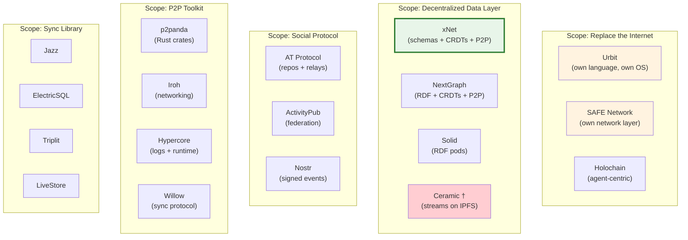

# Landscape Analysis: Decentralized Data Infrastructure

> Every project that tried (or is trying) to build "the new internet" — where users own their data, it's globally addressable, and applications are just views on user-controlled infrastructure.

**Date**: January 2026

---

## What We're Looking For

Not sync libraries. Not Notion clones. Not CRDT implementations. We're looking for projects with the same **scope** as xNet: infrastructure for a new internet where data is user-owned, P2P-synced, schema-typed, globally addressable, and queryable. Projects that want to replace the entire application/data stack — or at least a large chunk of it.

---

## The Full Landscape

### Tier 1: "Replace the Internet" — Genuinely Ambitious Infrastructure

These projects share xNet's scope: a complete data layer for user-owned, decentralized applications.

---

#### Hypercore / Pear Runtime (Holepunch)

|            |                                                                                                         |
| ---------- | ------------------------------------------------------------------------------------------------------- |
| **What**   | Append-only log primitives + a full P2P application runtime. Apps load from peers, run without servers. |
| **GitHub** | `holepunchto/hypercore` — active, 100+ repos in org                                                     |
| **Team**   | Funded company (Holepunch). BitTorrent founder involved.                                                |
| **Status** | **Shipping.** Keet (P2P video/chat) works today. Pear Runtime is stable.                                |

**Architecture:**

- **Hypercore**: Single-writer append-only log with Merkle tree verification, sparse replication
- **Autobase**: Multi-writer linearization — causal DAG analysis, quorum-based checkpoints
- **Hyperbee**: B-tree on top of Hypercore (key-value database)
- **Hyperdrive**: Filesystem on top (P2P Dropbox)
- **Hyperswarm**: DHT-based peer discovery with Noise encryption
- **Pear Runtime**: Desktop/mobile JS runtime that loads apps P2P via `pear://` links

**Why it matters:** The most technically mature P2P infrastructure that actually ships real apps. Autobase's multi-writer approach (causal DAG + quorum checkpointing) is philosophically similar to xNet's event-sourcing + Lamport timestamps.

**How it compares to xNet:**

|              | Hypercore                     | xNet                                  |
| ------------ | ----------------------------- | ------------------------------------- |
| Data model   | Append-only logs + B-tree     | Schema-first Nodes + Yjs              |
| Multi-writer | Autobase (DAG linearization)  | Lamport LWW per-property              |
| Rich text    | Not built-in (bring your own) | Yjs CRDT (TipTap)                     |
| Schema       | None (raw bytes)              | TypeScript `defineSchema()` with IRIs |
| Query        | None built-in                 | Full-text + structured filters        |
| Runtime      | Bare (custom JS runtime)      | Browser + Electron + Expo             |
| Identity     | Public key per core           | DID:key + UCAN                        |

**Honest assessment:** Hypercore is lower-level infrastructure. xNet is higher-level (schemas, queries, rich text). They could be complementary: xNet's data model running on Hypercore's transport. But Holepunch is a private company with opaque incentives.

---

#### AT Protocol (Bluesky)

|            |                                                                                                              |
| ---------- | ------------------------------------------------------------------------------------------------------------ |
| **What**   | Federated protocol for social apps with cryptographic identity, portable data repos, and algorithmic choice. |
| **GitHub** | `bluesky-social/atproto` — very active, ~30M users on Bluesky                                                |
| **Team**   | VC-funded company (Bluesky PBC). ~50 engineers.                                                              |
| **Status** | **Production.** 30M+ accounts. Growing post-Twitter exodus.                                                  |

**Architecture:**

- **Personal Data Server (PDS)**: Hosts your repo (a signed Merkle tree of all your records)
- **Lexicons**: Global schema definitions (like GraphQL for the protocol). `app.bsky.feed.post`, etc.
- **Relay (Firehose)**: Aggregates all PDS updates into a single event stream (~5M events/day)
- **AppView**: Indexes the firehose into application-specific views (search, feeds)
- **DIDs**: `did:plc` (centralized registry) or `did:web`
- **Feed Generators**: Third-party algorithmic feeds
- **Labelers**: Third-party moderation services

**Why it matters:** Most successful "new protocol" by user count since email. Proves that cryptographic identity + portable data repos work at scale. Lexicon schemas = typed data at protocol level.

**How it compares to xNet:**

|                  | AT Protocol                          | xNet                                      |
| ---------------- | ------------------------------------ | ----------------------------------------- |
| Use case         | Social networking                    | General data (docs, databases, ERP)       |
| Identity         | DID:plc (centralized registry)       | DID:key (self-sovereign)                  |
| Data model       | Signed repo (Merkle tree of records) | Nodes + Schemas + Yjs docs                |
| Schema           | Lexicons (global, immutable)         | `defineSchema()` (user-defined, evolving) |
| Sync             | Firehose (centralized relay)         | P2P (libp2p, WebRTC)                      |
| Offline          | No (server-to-server)                | Yes (local-first)                         |
| Collaboration    | Not designed for it                  | Yjs CRDT real-time editing                |
| Decentralization | Partial (relay is centralized)       | Full (no required servers)                |

**Honest assessment:** AT Protocol is the most successful decentralized protocol alive. But it's purpose-built for social — no offline-first, no collaboration, no databases. And it's practically centralized today (one relay, one AppView, one PLC directory). Could you build Notion on it? Technically yes, practically no — the architecture doesn't suit write-heavy collaborative workloads.

---

#### Holochain

|            |                                                                                                        |
| ---------- | ------------------------------------------------------------------------------------------------------ |
| **What**   | Agent-centric P2P framework. Each user has their own chain; DHT for shared state. No global consensus. |
| **GitHub** | `holochain/holochain` — active, 7+ years of development                                                |
| **Team**   | Funded (HOT token sale). 20+ core developers.                                                          |
| **Status** | **Perpetual beta.** No 1.0 after 7 years. Small community of believers.                                |

**Architecture:**

- **DNA**: Application definition (integrity zomes + coordinator zomes, Rust → WASM)
- **Source chain**: Each agent has their own append-only hash chain
- **DHT**: Kademlia-like, peers validate data against app rules
- **Validation**: Random peers validate entries — invalid data triggers "warrants"
- **No mining, no blocks, no gas** — validation is per-entry

**Why it matters:** The most radically different architecture. "Agent-centric" means your data lives in YOUR chain, validated by YOUR rules. No single point of truth — just millions of individual truths that gossip and validate each other.

**Honest assessment:** Beautiful ideas, no adoption. 7 years without 1.0. Rust-only development (no JS/TS for app logic). No browser runtime. The HOT token confused the messaging. The community is tiny and insular. Don't build on this unless you're willing to wait years and write Rust.

---

#### Solid (Tim Berners-Lee / Inrupt)

|            |                                                                                            |
| ---------- | ------------------------------------------------------------------------------------------ |
| **What**   | W3C-spec protocol where users store data in "Pods" and grant apps permission per-resource. |
| **GitHub** | `CommunitySolidServer/CommunitySolidServer` — 575 stars, active                            |
| **Team**   | Inrupt (company) + W3C community. Berners-Lee is chairman.                                 |
| **Status** | **Alive but irrelevant to mainstream.** Academic/government interest only.                 |

**Architecture:**

- **Pod**: A web server implementing Solid Protocol (LDP, WAC, WebID)
- **Storage**: RDF (Linked Data) — everything is triples (Turtle, JSON-LD)
- **Query**: SPARQL
- **Auth**: WebID + Solid-OIDC
- **Access control**: WAC (ACL files per resource)

**Why it failed:**

1. RDF is hostile to app developers — nobody writes SPARQL for a todo app
2. No offline-first, no CRDT, no conflict resolution — it's just REST with ACLs
3. Pod hosting problem — who runs your Pod?
4. App ecosystem is 10-20 demo apps, no killer app
5. Solving the wrong problem (data storage) without solving the hard problems (sync, offline, UX)

**Honest assessment:** The "establishment" answer to data sovereignty. Technically sound as a spec. Dead as a developer platform. RDF requirement is a death sentence for adoption.

---

#### Ceramic Network / ComposeDB

|            |                                                                                                   |
| ---------- | ------------------------------------------------------------------------------------------------- |
| **What**   | Decentralized event-streaming protocol for verifiable, mutable data streams anchored to Ethereum. |
| **GitHub** | `ceramicnetwork/js-ceramic` — being deprecated                                                    |
| **Team**   | 3Box Labs. VC-funded. Recently merged with Textile.                                               |
| **Status** | **Pivoted to AI.** Original vision abandoned. ComposeDB deprecated.                               |

**What happened:**

- Claimed "400 apps, 10M streams" at peak (mostly Gitcoin Passport stamps)
- Developer experience was terrible — running a node was complex and flaky
- ComposeDB was slow, complex, never production-quality
- Crypto winter killed funding
- Merged with Textile (Feb 2025), pivoted to "Intelligence Layer for AI Agents"

**Lesson for xNet:** DX matters more than decentralization theory. If your developer experience is bad, nobody will build on you no matter how elegant the protocol.

---

#### Nostr

|            |                                                                                                        |
| ---------- | ------------------------------------------------------------------------------------------------------ |
| **What**   | Minimal protocol for decentralized publishing. Signed events relayed between clients and dumb servers. |
| **GitHub** | Multiple implementations, 500K-1M users                                                                |
| **Team**   | No company. Pure community protocol.                                                                   |
| **Status** | **Growing.** Active development across many apps.                                                      |

**Architecture:**

- **Events**: JSON with `id`, `pubkey`, `created_at`, `kind`, `tags`, `content`, `sig`
- **Keys**: secp256k1 keypairs. Identity = your key. No recovery.
- **Relays**: Dumb WebSocket servers that store/forward events
- **Kinds**: Event types (0=metadata, 1=text, 4=DM, 30000+=replaceable key-value)
- **NIPs**: Community standards process

**Why it matters:** Radical simplicity works. The protocol is ~2 pages. Anyone can implement a relay in an afternoon. This simplicity enabled rapid ecosystem growth (microblogging, long-form, markets, git, live streaming, groups).

**Could it support databases?** Partially — replaceable events act like key-value stores. But: no query language, no indexes, no joins, no schema enforcement, no CRDT. You'd be building a database on pub/sub.

**Lesson for xNet:** Simplicity drives adoption. Complex protocols (Solid, Ceramic, Holochain) die of complexity. Nostr's success comes from doing less, not more.

---

#### Urbit

|            |                                                                                                               |
| ---------- | ------------------------------------------------------------------------------------------------------------- |
| **What**   | A complete computing stack from scratch — personal server OS with its own language, networking, and identity. |
| **GitHub** | `urbit/urbit` — niche community                                                                               |
| **Team**   | Tlon (company). Funded.                                                                                       |
| **Status** | **Niche art project.** Tens of thousands of ships.                                                            |

**Architecture:**

- **Nock**: Minimal combinator calculus (instruction set)
- **Hoon**: Functional language compiling to Nock
- **Arvo**: Event-sourced OS kernel
- **Ames**: P2P networking (encrypted, authenticated, UDP)
- **Azimuth**: Ethereum-based identity (artificial scarcity: only 2^32 planets)

**Honest assessment:** Intellectually fascinating. Practically irrelevant. The intentional obscurity (alien language, scarce identity, exclusionary vibes) plus political baggage (Curtis Yarvin) make it a non-factor. After 10+ years, the apps are worse than free alternatives. Event-sourced OS is a cool idea executed badly.

---

### Tier 2: "Better Pieces" — Projects Solving Part of the Problem Well

These don't claim to be the whole stack, but they solve critical pieces better than anything else.

---

#### p2panda

|            |                                                                                                    |
| ---------- | -------------------------------------------------------------------------------------------------- |
| **What**   | Modular P2P toolkit (Rust crates) for networking, sync, encryption, access control, and discovery. |
| **GitHub** | `p2panda/p2panda` — 366 stars, EU-funded                                                           |
| **Team**   | 3-4 developers, Berlin-based. NGI-funded (€400-600K).                                              |
| **Status** | **Active.** v0.5.0 (Jan 2026).                                                                     |

**Architecture:**

- Multi-writer DAG ("hash graph") of signed CBOR operations
- CRDT-agnostic (bring your own — currently uses Loro)
- Transport via iroh (QUIC), discovery via mDNS/STUN
- **Group encryption**: DCGKA-based (Double Ratchet for messages, symmetric key for data)
- **Access control**: CRDT-based ACL with nested groups, strong removal semantics
- "Broadcast-only" design (works with LoRa, BLE, USB sticks)

**Why it matters for xNet:** The most architecturally similar toolkit. Could be used as a dependency:

- `p2panda-encryption` for group E2E encryption (DCGKA, audited)
- `p2panda-auth` for CRDT-based access control
- `p2panda-sync` for efficient log sync

**Key difference:** p2panda is a library (Rust). xNet is an application + SDK (TypeScript). p2panda has no schema system, no query engine, no rich text built-in.

---

#### NextGraph

|            |                                                                                                                         |
| ---------- | ----------------------------------------------------------------------------------------------------------------------- |
| **What**   | Convergence of P2P and Semantic Web. CRDT-synced, E2E encrypted repositories with RDF graph + Yjs/Automerge per branch. |
| **GitHub** | `nextgraph-org/nextgraph-rs` — 67 stars, EU-funded                                                                      |
| **Team**   | 1-3 developers. French association. NGI-funded.                                                                         |
| **Status** | **Alpha.** Ambitious scope, tiny team.                                                                                  |

**Architecture:**

- **Three CRDTs in one document**: RDF graph (linking) + Yjs (text) + Automerge (structured)
- **Git-like**: Repos → Branches → Commits → Blocks (Merkle tree, convergent encryption)
- **2-tier network**: Brokers (zero-knowledge relays) + Verifiers (decrypt + validate)
- **SPARQL queries** over the RDF graph layer
- Noise Protocol encryption, WebSocket transport

**Why it matters:** The most academically rigorous approach to "schema + CRDT + P2P." Uniquely combines semantic web (RDF/SPARQL) with modern CRDTs. If it ships, it would be the most feature-complete decentralized data layer.

**Honest assessment:** Extremely ambitious for a 1-3 person team. Bus factor of 1. Alpha quality. The RDF requirement may be as fatal for developer adoption as it was for Solid. But the ideas are worth studying.

---

#### Iroh (n0 Computer)

|            |                                                                                                                                   |
| ---------- | --------------------------------------------------------------------------------------------------------------------------------- |
| **What**   | Modular Rust networking stack. Dial by public key, automatic hole-punching, QUIC, content-addressed blobs, gossip, CRDT KV store. |
| **GitHub** | `n0-computer/iroh` — 7.4K stars                                                                                                   |
| **Team**   | Funded company (n0, inc). Professional team.                                                                                      |
| **Status** | **Production.** Running on millions of devices (Delta Chat uses it).                                                              |

**Architecture:**

- Core: QUIC connections by public key, automatic relay fallback
- iroh-blobs: Content-addressed verified data transfer
- iroh-gossip: Pub/sub between peers
- iroh-docs: CRDT-based key-value store
- iroh-willow: Willow Protocol implementation (in development)

**Why it matters:** The best P2P networking layer available. If xNet ever outgrows libp2p/y-webrtc, iroh is the upgrade path. Their iroh-docs (CRDT KV) is directly relevant.

---

#### Willow Protocol

|            |                                                                                                                    |
| ---------- | ------------------------------------------------------------------------------------------------------------------ |
| **What**   | A family of P2P protocols for synchronisable, eventually-consistent data storage with fine-grained access control. |
| **URL**    | willowprotocol.org                                                                                                 |
| **Team**   | Aljoscha Meyer (ex-Earthstar). NLnet funded.                                                                       |
| **Status** | **Active.** Specification + JS implementation.                                                                     |

**Architecture:**

- **3D data model**: Namespace × Subspace × (Path + Time)
- **Meadowcap**: Capability-based access control (fine-grained read/write delegation)
- **True deletion support** (unlike append-only systems)
- Transport-agnostic sync protocol

**Why it matters:** The most thoughtful protocol design for user-owned data. Meadowcap capabilities are more principled than UCAN for fine-grained access control. Designed by someone who deeply understands the space (built Earthstar first, learned from it).

---

#### Spritely / OCapN (Christine Lemmer-Webber)

|            |                                                                                                      |
| ---------- | ---------------------------------------------------------------------------------------------------- |
| **What**   | Distributed programming framework using object capability security. Includes OCapN network protocol. |
| **GitHub** | Codeberg: `spritely` org                                                                             |
| **Team**   | 501(c)(3) nonprofit. ActivityPub co-author leads.                                                    |
| **Status** | **Active.** Pre-alpha but deep research. OCapN standardization in progress.                          |

**Architecture:**

- Object capability security (ocaps) — most principled permission model
- Promise pipelining for efficient distributed computation
- Scheme/WebAssembly (Hoot compiler)
- Tor-based networking for anonymity
- Distributed garbage collection

**Why it matters:** The deepest theoretical foundation. OCapN could be to permissions what HTTP was to documents. If it ships, it would make UCAN look primitive. But it's years from production.

---

#### Veilid (Cult of the Dead Cow)

|            |                                                                                          |
| ---------- | ---------------------------------------------------------------------------------------- |
| **What**   | P2P application framework for privacy-first networked apps. Rust core, Flutter bindings. |
| **URL**    | veilid.com                                                                               |
| **Team**   | Cult of the Dead Cow (legendary hacktivists).                                            |
| **Status** | **Active.** Released at DEF CON 2023. Ongoing development.                               |

**Architecture:**

- DHT-based routing (similar to Tor + IPFS hybrid)
- End-to-end encrypted everything
- Rust core with FFI bindings (Python, Dart/Flutter, WASM)
- Designed for apps, not just communication

**Why it matters:** Backed by cDc (credibility in privacy community). Aims to be "infrastructure for all privacy apps." More practical than Tor, more private than IPFS.

---

#### Perkeep (Brad Fitzpatrick)

|            |                                                                                       |
| ---------- | ------------------------------------------------------------------------------------- |
| **What**   | System for modeling, storing, searching, sharing, and synchronizing data permanently. |
| **GitHub** | `perkeep/perkeep` — ~6.5K stars                                                       |
| **Team**   | Brad Fitzpatrick (Go team, LiveJournal creator).                                      |
| **Status** | **Slow but alive.** v0.12 (Nov 2025).                                                 |

**Architecture:**

- Content-addressed blobs (SHA-224)
- Schema-based objects on top of blobs (JSON schemas)
- Built-in search/indexing
- Multi-backend storage (local, S3, GCS, etc.)
- FUSE filesystem for OS-level integration

**Why it matters:** "Your data is alive in 80 years." The oldest content-addressed personal data store still in development. Brad Fitzpatrick's taste for simplicity and durability is instructive. Built-in search is rare in this space.

---

### Tier 3: "The Graveyard" — What Failed and Why

| Project              | What It Was                               | Why It Died                                             |
| -------------------- | ----------------------------------------- | ------------------------------------------------------- |
| **Ceramic**          | Decentralized data streams on IPFS        | Bad DX, slow, complex node setup, crypto winter         |
| **Gun.js**           | P2P graph DB with CRDT                    | Single maintainer, memory leaks, no spec, unmaintained  |
| **Textile/ThreadDB** | IPFS-based collaborative DB               | Company pivoted, merged with Ceramic, now doing AI      |
| **OrbitDB**          | P2P database on IPFS                      | Slow, unreliable, IPFS performance issues               |
| **Tent Protocol**    | User-owned social data stores             | Too early (2012), single team, no ecosystem             |
| **Aether**           | P2P Reddit with democratic moderation     | Single developer burned out                             |
| **Blockstack/Gaia**  | User-controlled storage backends          | Pivoted to Stacks (blockchain), Gaia abandoned          |
| **WNFS (Fission)**   | Encrypted filesystem on IPLD              | Company folded, open-sourced and dormant                |
| **CR-SQLite**        | CRDT extensions for SQLite                | Creator moved to LiveStore, unmaintained since Jan 2024 |
| **Sandstorm.io**     | Self-hosting with per-document sandboxing | Company shut down (ideas live in OCapN)                 |

**Common failure patterns:**

1. **Single-maintainer burnout** (Gun, Aether, CR-SQLite)
2. **DX too bad for real developers** (Ceramic, Solid, Holochain)
3. **Crypto winter funding collapse** (Ceramic, Textile)
4. **Solving the wrong problem first** (Solid: storage without sync; Urbit: language before apps)
5. **Too abstract / no killer app** (Solid, Holochain, Spritely)
6. **Performance too poor for real use** (OrbitDB, IPFS-based anything)

---

## The Big Picture: Where xNet Fits

**xNet's unique position:** The only project attempting to combine:

1. Schema-first typed data (like AT Protocol's Lexicons, but user-extensible)
2. Dual CRDT strategy (Yjs for text + event-sourcing for structured data)
3. True P2P with optional Hubs (not server-dependent like AT Protocol)
4. Local-first with offline-first search/query
5. Application AND infrastructure in one product

No existing project has this exact combination. The closest are:

- **NextGraph** — similar ambition, different tech (RDF, Rust, 1-person team)
- **Anytype** — similar product, different philosophy (VC, token plan, custom protocol)
- **Hypercore/Pear** — similar infra, no schema/query/rich-text layer

---

## What xNet Can Learn

### From successes:

| Project         | Lesson                                                                                                                   |
| --------------- | ------------------------------------------------------------------------------------------------------------------------ |
| **AT Protocol** | Ship the app first, extract the protocol second. 30M users because Bluesky is good, not because the protocol is elegant. |
| **Nostr**       | Radical simplicity drives adoption. If your protocol is 2 pages, anyone can implement it.                                |
| **Syncthing**   | Solve one problem perfectly (79K stars). Don't boil the ocean.                                                           |
| **Hypercore**   | Append-only logs are the right primitive. Build everything else on top.                                                  |
| **Iroh**        | Great engineering on the networking layer pays dividends for everything above it.                                        |

### From failures:

| Project       | Lesson                                                                           |
| ------------- | -------------------------------------------------------------------------------- |
| **Solid**     | Don't make developers learn a new query language (SPARQL) to build a todo app.   |
| **Ceramic**   | DX matters more than decentralization theory. If setup takes a day, you've lost. |
| **Holochain** | Ship 1.0 or die. 7 years of beta destroys credibility.                           |
| **Gun.js**    | Single-maintainer open source doesn't scale. Get a team or get abandoned.        |
| **Urbit**     | Don't make developers learn a new programming language unless it's 10x better.   |
| **OrbitDB**   | Don't build on IPFS for latency-sensitive applications. CID lookup is too slow.  |

### Architectural insights:

1. **DAG-based conflict resolution is the consensus** — Hypercore's Autobase, Anytype's DAGs, p2panda's hash graphs. xNet's Lamport LWW is simpler but less powerful.

2. **Separate transport encryption from data encryption** — p2panda, NextGraph, Anytype all do this. xNet should too.

3. **Capability-based auth > role-based auth** — Willow's Meadowcap, Spritely's OCapN, p2panda's auth. UCAN is a good start but capabilities are the future.

4. **The Hub pattern works** — AT Protocol's PDS, Anytype's sync nodes, Hypercore's relay. Always-on infrastructure that's optional but makes everything better. xNet's Hub is the right call.

5. **Schema systems are the differentiator** — AT Protocol's Lexicons, xNet's `defineSchema()`, NextGraph's RDF. Every project that lacks schemas eventually needs them.

---

## Honest Self-Assessment: Where xNet Stands

### Advantages over the field:

1. **TypeScript throughout** — lower barrier than Rust (p2panda, iroh, Holochain) or Hoon (Urbit) or Clojure (Logseq)
2. **Dual CRDT strategy** — Yjs for text + Lamport LWW for structured data is pragmatic and proven
3. **Schema-first with TypeScript inference** — better DX than RDF (Solid/NextGraph) or Rust DNA (Holochain)
4. **Hub architecture** — optional server that bootstraps, monetizes, and solves the always-on problem
5. **Application + infrastructure** — not just a library, also a product people use

### Disadvantages / risks:

1. **Single developer** — same bus factor as Gun.js, CR-SQLite, NextGraph, Aether (all stagnated or died)
2. **No shipped 1.0** — Holochain's 7-year beta is a cautionary tale
3. **Browser storage is fragile** — Safari wipes IndexedDB after 7 days of inactivity
4. **No production users** — Anytype has 1M+ downloads, AT Protocol has 30M accounts, xNet has 0
5. **Scope creep risk** — farming ERP, decentralized search, i18n, history, plugins, MCP... focus?
6. **libp2p in browser is problematic** — NAT traversal, WebRTC reliability, connection churn

### The hard truth:

Every project in this document that tried to be "infrastructure + application" simultaneously has either:

- Taken 6+ years and still not broken through (Anytype, Holochain)
- Died of scope/complexity (Ceramic, Solid ecosystem apps)
- Succeeded only by focusing on one app first (Bluesky/AT Protocol, Keet/Hypercore)

The pattern that works: **ship a compelling app, then extract the protocol/SDK.** Not the other way around.

---

## Strategic Recommendations

1. **Ship the app.** The wiki/docs/tasks experience needs to be genuinely good — better than Notion offline. Everything else (farming ERP, decentralized search, global index shards) is premature without users.

2. **The Hub IS the product for now.** Self-hosted P2P is a feature, not a business. Revenue comes from hosted Hubs. Like Mastodon: open protocol, official instance pays the bills.

3. **Don't compete with p2panda/iroh on networking.** They're better at Rust P2P primitives. Consider using them instead of raw libp2p. Focus xNet's energy on the schema/query/UI layer.

4. **Schemas are the moat.** No other project has TypeScript-inferred, user-extensible, globally-addressable schemas with IRI namespaces. Double down on this.

5. **Watch Anytype.** They're the closest product competitor (nodes, schemas, P2P, E2E). Their 1M+ downloads prove the market exists. Their weakness (custom protocol, token plan, no SDK/extensibility) is xNet's opportunity.

6. **The "Day 1" experience matters most.** From the HN research: developers' #1 complaint is "3 days wiring infrastructure before writing features." xNet's `XNetProvider` + `useQuery` + `useMutate` needs to be as simple as `useState`.

---

## Reference Projects (Quick Lookup)

| Project        | URL                                    | Stars | Status        | Relevance                   |
| -------------- | -------------------------------------- | ----- | ------------- | --------------------------- |
| Hypercore/Pear | github.com/holepunchto                 | —     | Active        | High (infra)                |
| AT Protocol    | github.com/bluesky-social/atproto      | 12K   | Active        | Medium (social)             |
| Holochain      | github.com/holochain/holochain         | 9K    | Active (beta) | Low (too different)         |
| Solid          | github.com/CommunitySolidServer        | 575   | Active        | Low (RDF problem)           |
| Nostr          | multiple                               | —     | Active        | Medium (simplicity lessons) |
| p2panda        | github.com/p2panda/p2panda             | 366   | Active        | High (potential dep)        |
| NextGraph      | github.com/nextgraph-org/nextgraph-rs  | 67    | Alpha         | Medium (ideas)              |
| Iroh           | github.com/n0-computer/iroh            | 7.4K  | Active        | High (networking)           |
| Willow         | willowprotocol.org                     | 76    | Active        | Medium (protocol ideas)     |
| Spritely       | codeberg.org/spritely                  | —     | Active        | Low (too early)             |
| Veilid         | veilid.com                             | —     | Active        | Low (privacy-focused)       |
| Perkeep        | github.com/perkeep/perkeep             | 6.5K  | Slow          | Low (personal archive)      |
| Anytype        | github.com/anyproto/any-sync           | 1.5K  | Active        | High (competitor)           |
| Syncthing      | github.com/syncthing/syncthing         | 79K   | Active        | Low (file sync only)        |
| SAFE Network   | github.com/maidsafe                    | —     | Pre-launch    | Low (10+ year vaporware)    |
| GNUnet         | git.gnunet.org                         | —     | Active        | Low (academic)              |
| Freenet (new)  | github.com/freenet/freenet-core        | —     | Active        | Low (different model)       |
| Colanode       | github.com/colanode/colanode           | 4.5K  | Active        | Medium (similar app)        |
| Fireproof      | github.com/fireproof-storage/fireproof | 942   | Active        | Medium (ideas)              |
| remoteStorage  | github.com/remotestorage               | —     | Active        | Low (simple storage)        |
| Tahoe-LAFS     | github.com/tahoe-lafs/tahoe-lafs       | 1.4K  | Active        | Low (file storage)          |
| SSB            | github.com/ssbc/ssb-server             | 1.7K  | Dormant       | Low (ideas only)            |
| LiveStore      | github.com/livestorejs/livestore       | 3.4K  | Active        | Medium (event-sourcing)     |
| Automerge      | github.com/automerge/automerge         | 3K    | Active        | Medium (CRDT lib)           |
