# Chat & Video Exploration

> How to build Telegram + Slack + Zoom into xNet as a first-class feature

## Why Chat in xNet?

Most decentralized platforms build messaging as one of their first applications. Data infrastructure without communication is just storage. xNet's existing primitives — signed changes, CRDTs, DID identity, UCAN auth, hub relay — already solve 70-80% of the chat problem. The remaining work is protocol design, UX, and video integration.

**Inspiration:**

- **Telegram** — lightweight social UX, communities, channels, bots
- **Slack** — threaded discussions, workspace organization, integrations
- **Zoom** — video conferencing, breakout rooms, screen sharing, recording
- **Keet** (Holepunch) — fully P2P messaging and video, no servers

**Key insight:** xNet's commenting system (planStep03_6Comments) already defines CommentThread and Comment as Nodes with anchoring. Chat messages are structurally identical — just Comments without a document anchor. The two systems can share schemas, UI components, and infrastructure.

---

## Landscape: How Others Do It

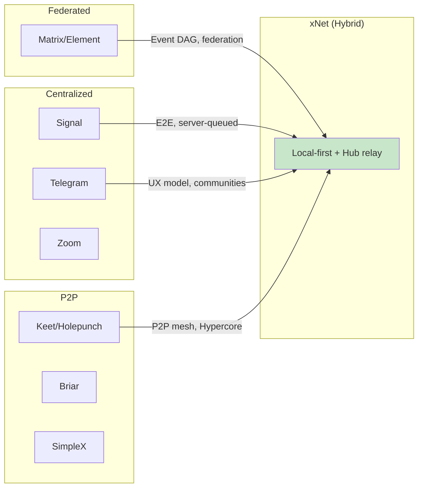

| Platform | Topology             | Identity           | Offline Delivery         | Encryption                   | Video            |
| -------- | -------------------- | ------------------ | ------------------------ | ---------------------------- | ---------------- |
| Telegram | Centralized          | Phone number       | Server queues            | MTProto (not E2E by default) | Server-relayed   |
| Signal   | Centralized          | Phone number       | Server queues            | Double Ratchet (E2E)         | WebRTC + TURN    |
| Matrix   | Federated            | @user:server       | Homeserver stores        | Megolm (E2E opt-in)          | WebRTC + SFU     |
| Keet     | Pure P2P             | Keypair (seed)     | Peer must be online      | Noise + symmetric            | P2P streams      |
| Briar    | Pure P2P             | Device key         | Both online (or Mailbox) | Per-connection               | None             |
| SimpleX  | Blind relays         | None (per-contact) | Relay queues             | Double Ratchet               | WebRTC           |
| **xNet** | **Hub-assisted P2P** | **DID:key**        | **Hub persists**         | **XChaCha20 + Ed25519**      | **WebRTC + SFU** |

### Key Architectural Lessons

1. **Keet** proves P2P messaging works but offline delivery requires peers online — xNet's hub solves this.
2. **Matrix** proves event DAGs with signed events converge — xNet's Change<T> with Lamport clocks is equivalent.
3. **Signal** proves per-message forward secrecy is achievable — but complex. Per-room keys (like Keet) are acceptable for v1.
4. **Telegram** proves the UX model — communities with channels, topics, threads, reactions, bots.
5. **SimpleX** proves blind relays work for metadata privacy — xNet's hub could optionally be a blind relay.

---

## Architecture Overview

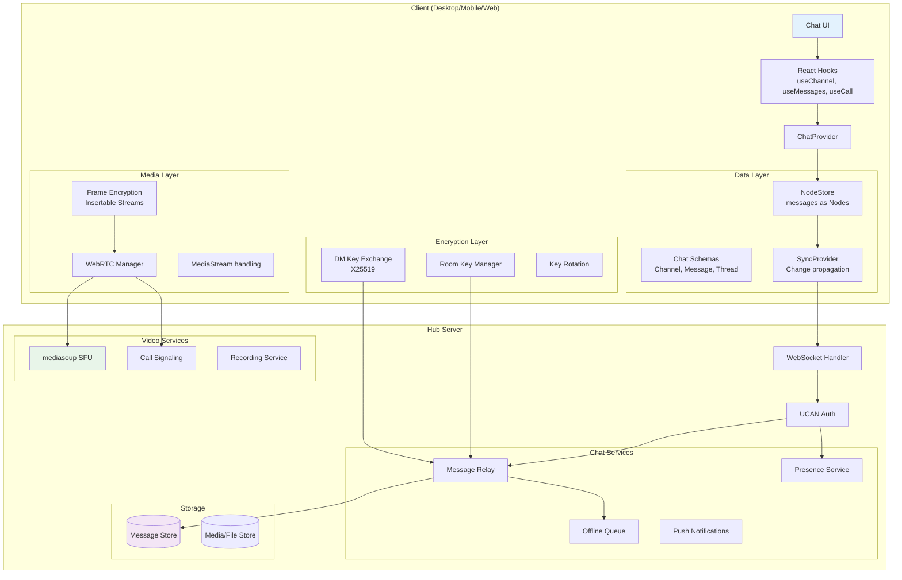

---

## Data Model

### Integration with Comments

The commenting system (planStep03_6Comments) already defines:

- `CommentThread` — a target node + anchor + resolved state
- `Comment` — a thread member with content + parent

Chat messages are structurally identical. A **unified message primitive** serves both:

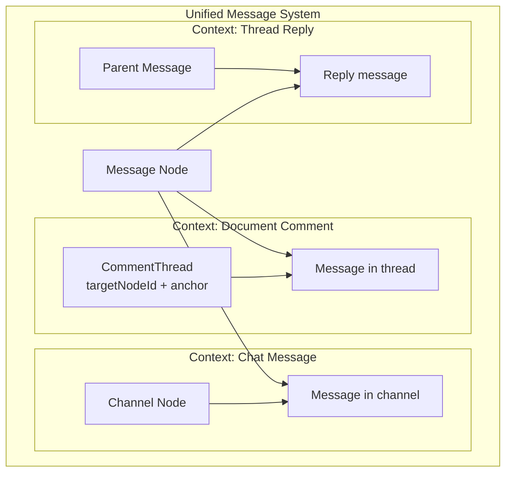

### Schemas

```typescript
// ═══════════════════════════════════════════════════════
// CHANNEL — A conversation container (DM, group, or channel)
// ═══════════════════════════════════════════════════════

const ChannelSchema = defineSchema({
  name: 'Channel',
  namespace: 'xnet://xnet.dev/',
  properties: {
    name: text({ maxLength: 200 }),
    description: text({ maxLength: 2000 }),
    type: select({
      options: [
        { id: 'dm', label: 'Direct Message' },
        { id: 'group', label: 'Group Chat' },
        { id: 'channel', label: 'Channel' },
        { id: 'thread', label: 'Thread' }
      ] as const,
      required: true
    }),
    // Visibility
    visibility: select({
      options: [
        { id: 'private', label: 'Private' },
        { id: 'public', label: 'Public' }
      ] as const
    }),
    // Members (for DM/group — channels use UCAN instead)
    members: person({ multiple: true }),
    // For DM: the other party's DID
    dmPeerDID: text({}),
    // Community this channel belongs to (optional)
    communityId: relation({ target: 'xnet://xnet.dev/Community' }),
    // Encryption
    encrypted: checkbox({}),
    // Pinned messages (ordered list of message IDs)
    pinnedMessages: text({ multiple: true }),
    // Last activity (for sorting)
    lastMessageAt: date({}),
    lastMessagePreview: text({ maxLength: 200 })
  }
})

// ═══════════════════════════════════════════════════════
// MESSAGE — A single message (shared with commenting system)
// ═══════════════════════════════════════════════════════

const MessageSchema = defineSchema({
  name: 'Message',
  namespace: 'xnet://xnet.dev/',
  properties: {
    // Content
    body: text({ required: true, maxLength: 4000 }),
    // Context: where does this message live?
    channelId: relation({ target: 'xnet://xnet.dev/Channel' }),
    threadId: relation({ target: 'xnet://xnet.dev/CommentThread' }),
    // Threading
    replyToId: relation({ target: 'xnet://xnet.dev/Message' }),
    // Mentions
    mentions: person({ multiple: true }),
    // Attachments (content-addressed files)
    attachments: file({ multiple: true }),
    // Message type
    messageType: select({
      options: [
        { id: 'text', label: 'Text' },
        { id: 'system', label: 'System' },
        { id: 'call', label: 'Call Event' },
        { id: 'file', label: 'File Share' }
      ] as const
    }),
    // Reactions (serialized: { emoji: [DID, DID, ...] })
    reactions: text({}),
    // Edit state
    edited: checkbox({}),
    editedAt: date({}),
    // Forwarded from
    forwardedFrom: relation({ target: 'xnet://xnet.dev/Message' }),
    // Encryption envelope (if E2E)
    encryptedBody: text({}), // XChaCha20 ciphertext (replaces body when encrypted)
    encryptionKeyId: text({}) // Which room key version was used
  }
})

// ═══════════════════════════════════════════════════════
// COMMUNITY — A Telegram-like community (collection of channels)
// ═══════════════════════════════════════════════════════

const CommunitySchema = defineSchema({
  name: 'Community',
  namespace: 'xnet://xnet.dev/',
  properties: {
    name: text({ required: true, maxLength: 200 }),
    description: text({ maxLength: 2000 }),
    avatar: file({}),
    // Owner DID
    owner: person({}),
    // Categories for organizing channels
    categories: text({ multiple: true }), // JSON: [{ id, name, channelIds }]
    // Join rules
    joinRule: select({
      options: [
        { id: 'open', label: 'Anyone can join' },
        { id: 'invite', label: 'Invite only' },
        { id: 'approval', label: 'Request + approval' }
      ] as const
    })
  }
})

// ═══════════════════════════════════════════════════════
// MEETING — A video/audio call session
// ═══════════════════════════════════════════════════════

const MeetingSchema = defineSchema({
  name: 'Meeting',
  namespace: 'xnet://xnet.dev/',
  properties: {
    // Context
    channelId: relation({ target: 'xnet://xnet.dev/Channel' }),
    // State
    status: select({
      options: [
        { id: 'ringing', label: 'Ringing' },
        { id: 'active', label: 'Active' },
        { id: 'ended', label: 'Ended' }
      ] as const
    }),
    // Participants
    participants: person({ multiple: true }),
    // Topology
    topology: select({
      options: [
        { id: 'p2p', label: 'Peer-to-Peer' },
        { id: 'sfu', label: 'SFU (Hub-relayed)' }
      ] as const
    }),
    // Timing
    startedAt: date({}),
    endedAt: date({}),
    // Recording
    recordingEnabled: checkbox({}),
    recordingNodeId: relation({ target: 'xnet://xnet.dev/Recording' }),
    // Breakout rooms
    breakoutRooms: text({}) // JSON: [{ id, name, participants }]
  }
})
```

### Message as Change<T>

Each message is a Node created via `store.create()`, which produces a signed `Change<NodePayload>`. This gives every message:

- **Author attribution** — `change.authorDID` (non-repudiable)
- **Ordering** — `change.lamport` (global causal order)
- **Integrity** — `change.hash` (BLAKE3, tamper-evident)
- **Chain linkage** — `change.parentHash` (verifiable history)
- **Timestamp** — `change.wallTime` (wall clock for display)
- **Signature** — Ed25519 over the canonical payload

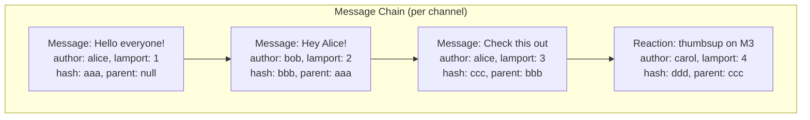

---

## Messaging Protocol

### Message Flow

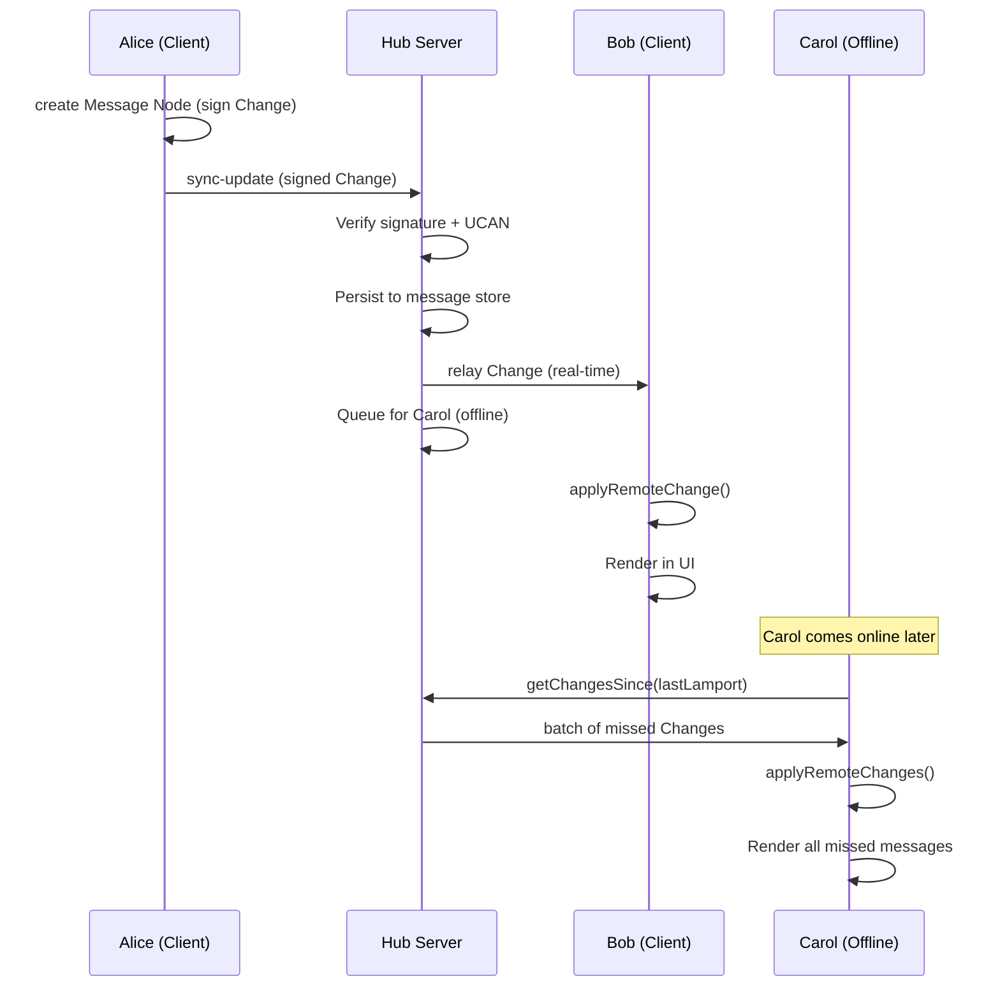

### Ephemeral Events (Not Persisted)

Some events are transient and don't need the full Change<T> treatment:

```typescript
// Sent via awareness / ephemeral channel (not stored as Nodes)
interface EphemeralEvent {
  type: 'typing' | 'read-receipt' | 'presence' | 'call-signal'
  channelId: string
  authorDID: DID
  data: any
}

// Typing indicator
{ type: 'typing', channelId: 'ch-1', authorDID: 'did:key:alice', data: { active: true } }

// Read receipt (last message seen)
{ type: 'read-receipt', channelId: 'ch-1', authorDID: 'did:key:bob', data: { messageId: 'msg-99' } }

// Presence update
{ type: 'presence', authorDID: 'did:key:carol', data: { status: 'online', lastSeen: 1706000000 } }
```

These use the existing Y.js Awareness protocol — broadcast to all channel subscribers, not persisted.

### Delivery Guarantees

| Guarantee               | Mechanism                                          |
| ----------------------- | -------------------------------------------------- |
| **At-least-once**       | Hub persists + client retries on reconnect         |
| **Ordering**            | Lamport timestamps + causal chain (parentHash)     |
| **Deduplication**       | Change hash (same hash = same message, skip)       |
| **Offline delivery**    | Hub queues missed changes, client pulls on connect |
| **Sender verification** | Ed25519 signature on every Change                  |

---

## Encryption Strategy

### Tier 1: Transport Encryption (Always On)

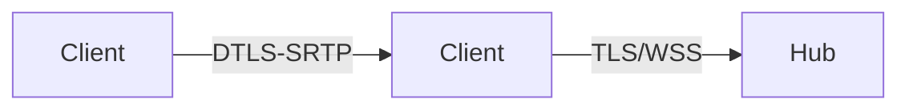

All WebSocket connections use TLS. P2P connections use DTLS. The hub can read message metadata but this is acceptable for the relay role.

### Tier 2: Room-Key Encryption (E2E for Groups)

Each encrypted channel has a symmetric key shared among members:

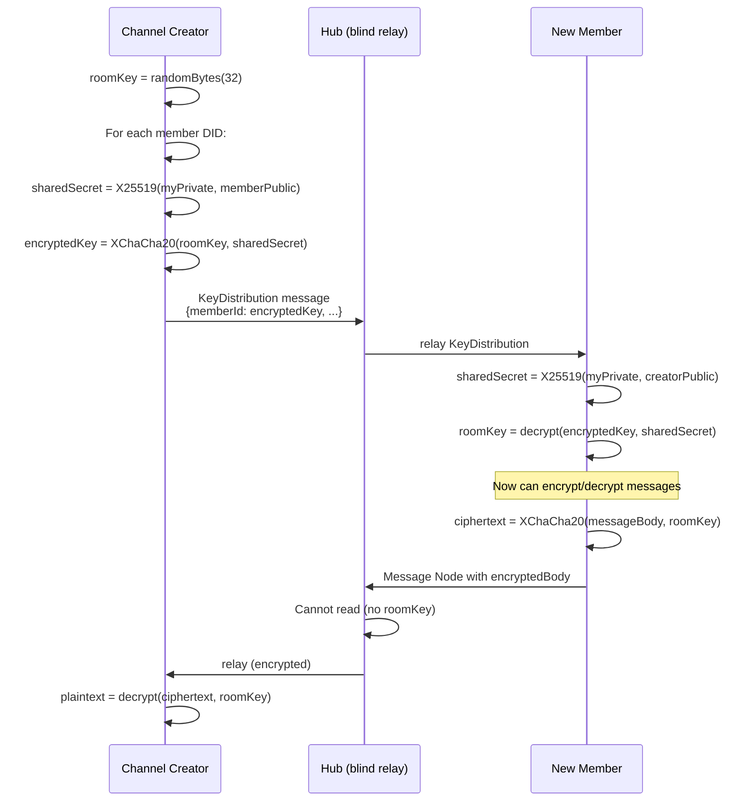

**Key rotation:** When a member is removed, the creator generates a new `roomKey` and re-distributes to remaining members. Past messages remain encrypted with the old key (forward secrecy: removed member can't read future messages).

### Tier 3: Per-Message Ratchet (DMs, Future)

For DM conversations requiring perfect forward secrecy, implement a Double Ratchet:

```
Alice                          Bob
  |                              |
  |-- X3DH key agreement ------>|
  |                              |
  |-- Message 1 (ratchet key 1)|-->
  |-- Message 2 (ratchet key 2)|-->
  |<-- Message 3 (ratchet key 3)--|
  |                              |
  (each message uses a unique key,
   compromising one reveals nothing)
```

This is deferred to v2 — room-key encryption is sufficient for launch.

### Key Storage

```typescript
// Keys stored in local-only encrypted storage (never synced)
interface ChannelKeyRing {
  channelId: string
  currentKeyId: string
  keys: {
    [keyId: string]: {
      key: Uint8Array // XChaCha20 symmetric key
      createdAt: number
      rotatedAt?: number // null = current
      creatorDID: DID
    }
  }
}
```

---

## Video & Audio Architecture

### Topology Decision

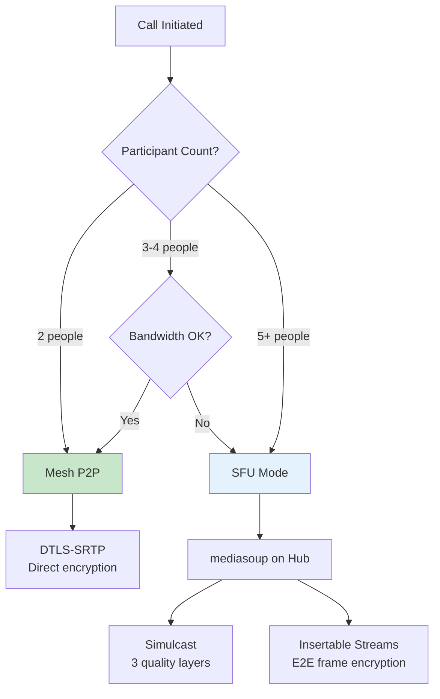

### SFU Integration (mediasoup)

mediasoup is a Node.js-native SFU library — it runs in the same process as the hub:

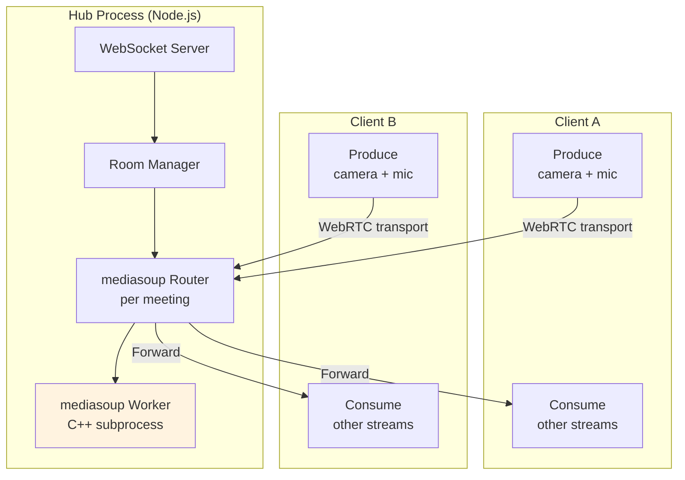

### Call Signaling Protocol

```typescript
// WebSocket messages for call management

// Client → Hub
interface CallCreate {
  type: 'call-create'
  channelId: string
  mediaOptions: MediaOptions
}
interface CallJoin {
  type: 'call-join'
  meetingId: string
}
interface CallLeave {
  type: 'call-leave'
  meetingId: string
}
interface CallProduce {
  type: 'call-produce'
  meetingId: string
  kind: 'audio' | 'video' | 'screen'
  rtpParameters: any
}
interface CallConsume {
  type: 'call-consume'
  meetingId: string
  producerId: string
}

// Hub → Client
interface CallCreated {
  type: 'call-created'
  meetingId: string
  topology: 'p2p' | 'sfu'
  routerRtpCapabilities?: any
}
interface CallNewProducer {
  type: 'call-new-producer'
  meetingId: string
  producerId: string
  kind: string
  peerDID: DID
}
interface CallPeerLeft {
  type: 'call-peer-left'
  meetingId: string
  peerDID: DID
}

// P2P signaling (forwarded via hub)
interface CallPeerSignal {
  type: 'call-peer-signal'
  meetingId: string
  targetDID: DID
  signal: RTCSessionDescription | RTCIceCandidate
}
```

### E2E Encryption for Video (Insertable Streams)

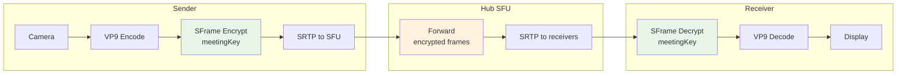

The SFU sees encrypted frame payloads but can still:

- Route streams by RTP headers
- Perform bandwidth estimation
- Select simulcast layers
- Handle NACK/retransmission

### Breakout Rooms

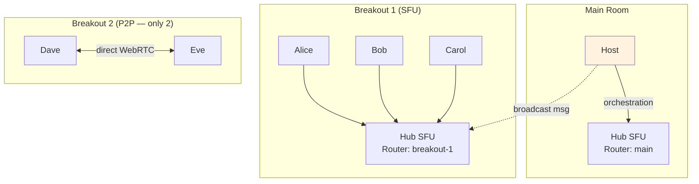

**Breakout flow:**

1. Host sends `breakout-create` with room assignments (signed, UCAN-authorized)
2. Hub creates separate mediasoup Routers per breakout room
3. 2-person rooms optionally use P2P (saves server resources)
4. Participants receive `breakout-assigned` signal, disconnect from main, connect to breakout
5. Host can broadcast audio/text to all breakouts
6. Timer or manual `breakout-end` brings everyone back

### Screen Sharing

```typescript
// Client-side screen capture
const screenStream = await navigator.mediaDevices.getDisplayMedia({
  video: {
    displaySurface: 'monitor',
    width: { ideal: 1920 },
    height: { ideal: 1080 },
    frameRate: { ideal: 15, max: 30 }
  },
  audio: true // system audio
})

// Separate producer for screen share (independent quality control)
const screenProducer = await transport.produce({
  track: screenStream.getVideoTracks()[0],
  encodings: [
    { rid: 'low', maxBitrate: 500_000, scaleResolutionDownBy: 4 },
    { rid: 'high', maxBitrate: 3_000_000 }
  ],
  codecOptions: { videoGoogleStartBitrate: 1000 },
  appData: { type: 'screen' }
})
```

### Recording

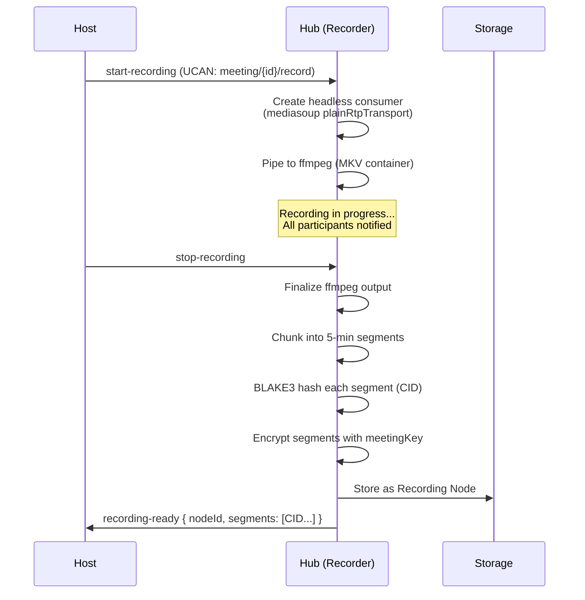

Recording Node:

```typescript
const RecordingSchema = defineSchema({
  name: 'Recording',
  namespace: 'xnet://xnet.dev/',
  properties: {
    meetingId: relation({ target: 'xnet://xnet.dev/Meeting' }),
    channelId: relation({ target: 'xnet://xnet.dev/Channel' }),
    duration: number({}),
    segments: text({ multiple: true }), // CID list
    encryptionKeyId: text({}),
    participants: person({ multiple: true }),
    startedAt: date({ required: true })
  }
})
```

---

## Community & Channel Model (Telegram-Inspired)

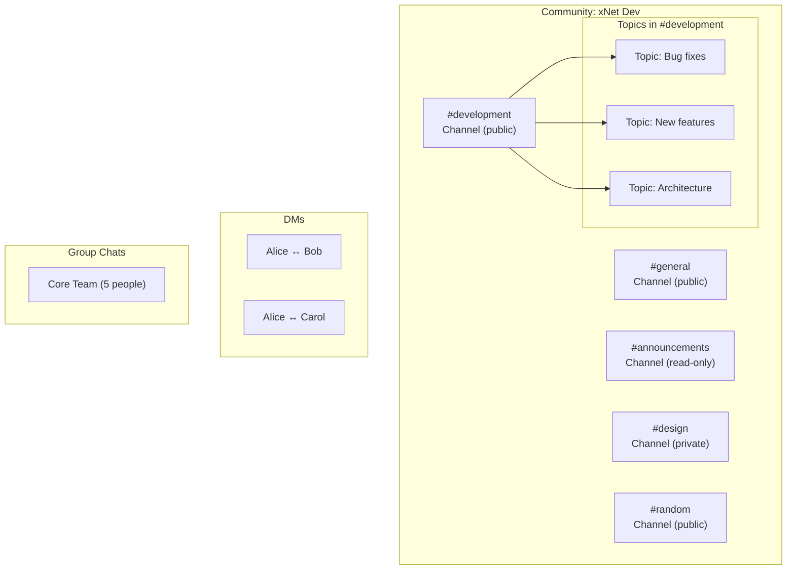

### Channel Types

| Type         | Description                        | UCAN Model                                          |
| ------------ | ---------------------------------- | --------------------------------------------------- |
| DM           | 1:1 encrypted chat                 | Auto-granted on both sides                          |
| Group        | Small group (2-50), all can write  | Creator delegates `write` to members                |
| Channel      | Large (50-10000+), curated posting | Creator delegates `read` broadly, `write` to admins |
| Announcement | One-to-many broadcast              | Creator has `write`, everyone has `read`            |
| Topic        | Sub-thread within a channel        | Inherits parent channel permissions                 |

### UCAN Capabilities for Chat

```typescript
// Channel-level capabilities
{ with: 'xnet://channel/{id}', can: 'channel/read' }
{ with: 'xnet://channel/{id}', can: 'channel/write' }
{ with: 'xnet://channel/{id}', can: 'channel/moderate' }
{ with: 'xnet://channel/{id}', can: 'channel/admin' }
{ with: 'xnet://channel/{id}', can: 'channel/invite' }

// Community-level capabilities
{ with: 'xnet://community/{id}', can: 'community/admin' }
{ with: 'xnet://community/{id}', can: 'community/create-channel' }
{ with: 'xnet://community/{id}', can: 'community/join' }

// Meeting capabilities
{ with: 'xnet://meeting/{id}', can: 'meeting/join' }
{ with: 'xnet://meeting/{id}', can: 'meeting/record' }
{ with: 'xnet://meeting/{id}', can: 'meeting/breakout' }
{ with: 'xnet://meeting/{id}', can: 'meeting/screen-share' }

// Hierarchy: admin > moderate > write > read
// admin: delete others' messages, ban users, change settings
// moderate: pin, delete messages, mute users
// write: send messages, react, reply
// read: view messages only
```

---

## Integration with Commenting System

The commenting system and chat share the `Message` schema. The difference is context:

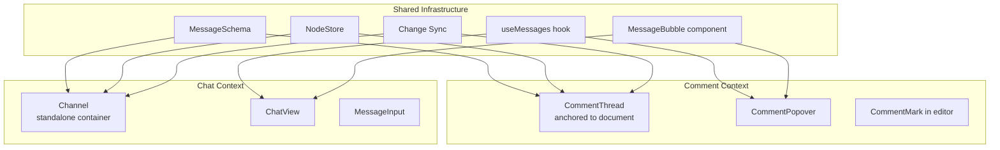

**Shared components:**

- `MessageBubble` — renders a single message (author, time, body, reactions)
- `MessageInput` — compose box with markdown, mentions, attachments
- `useMessages(contextId)` — loads messages for a channel OR thread
- `ReactionPicker` — emoji reactions on messages
- Message schema, sync, and encryption

**Divergent components:**

- Comments: popover UI, document anchoring, resolve/reopen
- Chat: channel list, conversation view, typing indicators, read receipts, calls

---

## Offline & Sync Strategy

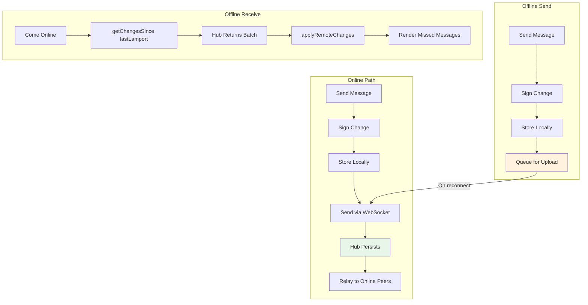

### Hub Message Store

The hub stores message Changes in an append-only log per channel:

```sql
CREATE TABLE channel_messages (
  id TEXT PRIMARY KEY,
  channel_id TEXT NOT NULL,
  author_did TEXT NOT NULL,
  lamport INTEGER NOT NULL,
  wall_time INTEGER NOT NULL,
  change_hash TEXT NOT NULL,
  parent_hash TEXT,
  payload BLOB NOT NULL, -- serialized Change<NodePayload>
  created_at INTEGER NOT NULL,

  -- Indexes for efficient queries
  UNIQUE(channel_id, change_hash)
);

CREATE INDEX idx_channel_lamport ON channel_messages(channel_id, lamport);
CREATE INDEX idx_channel_time ON channel_messages(channel_id, wall_time);
```

### Client-Side Pagination

```typescript
// Load messages for a channel with cursor-based pagination
async function loadMessages(channelId: string, options: {
  before?: LamportTimestamp  // Load messages before this timestamp
  limit?: number             // Default: 50
}): Promise<Message[]> {
  // Try local store first
  const local = await store.listNodes({
    schemaId: MessageSchema.iri,
    filter: { channelId },
    before: options.before,
    limit: options.limit ?? 50,
    order: 'desc',
  })

  // If local has fewer than requested, fetch from hub
  if (local.length < (options.limit ?? 50)) {
    const remote = await hub.getChangesSince(channelId, options.before?.time ?? 0)
    await store.applyRemoteChanges(remote)
    // Re-query local store
    return store.listNodes({ ... })
  }

  return local
}
```

---

## Push Notifications

For mobile/desktop when the app is in the background:

```mermaid
flowchart LR
    HUB[Hub] -->|"New message for offline user"| PUSH_SERVICE[Push Service]
    PUSH_SERVICE -->|"Web Push / APNs / FCM"| DEVICE[Device]
    DEVICE --> NOTIFICATION[System Notification]

    Note over PUSH_SERVICE: Hub stores push subscription<br/>per device per user.<br/>Notification payload is<br/>minimal metadata only<br/>(no message content for privacy).
```

**Privacy-preserving push:**

- Notification contains only: `channelId`, `senderName`, `timestamp`
- No message body in the push payload (fetched on tap)
- User can opt into preview (`showPreview: true` → includes first 100 chars)
- Push subscriptions stored per-device, removable by user

---

## Package Structure

```
packages/
  chat/
    src/
      index.ts
      schemas/
        channel.ts           # ChannelSchema
        message.ts           # MessageSchema (shared with comments)
        community.ts         # CommunitySchema
        meeting.ts           # MeetingSchema
        recording.ts         # RecordingSchema
      services/
        message-service.ts   # Send, edit, delete, react
        channel-service.ts   # Create, join, leave, settings
        encryption.ts        # Room key management
        push.ts              # Push notification subscriptions
      hooks/
        useChannel.ts        # Channel state + members
        useMessages.ts       # Message list + pagination
        useTyping.ts         # Typing indicators
        usePresence.ts       # Online/offline/away
        useCall.ts           # Call state management
        useUnread.ts         # Unread counts
      components/
        ChatView.tsx         # Full chat interface
        ChannelList.tsx      # Sidebar channel list
        MessageBubble.tsx    # Single message (shared w/ comments)
        MessageInput.tsx     # Compose box (shared w/ comments)
        ReactionPicker.tsx   # Emoji reactions
        CallControls.tsx     # Mute/video/screen/hangup
        VideoGrid.tsx        # Video participant grid
        BreakoutPanel.tsx    # Breakout room management
      video/
        rtc-manager.ts       # WebRTC connection management
        sfu-client.ts        # mediasoup-client wrapper
        p2p-client.ts        # Direct P2P call handler
        topology.ts          # P2P vs SFU decision logic
        e2ee.ts              # Insertable Streams frame encryption
        screen-share.ts      # Screen capture utilities
      types.ts               # Shared types
    test/
      message.test.ts
      channel.test.ts
      encryption.test.ts
      call.test.ts
```

Hub additions:

```
packages/hub/src/
  services/
    chat-relay.ts            # Message relay + offline queue
    chat-presence.ts         # Online/typing/read-receipt ephemeral
    call-signaling.ts        # WebRTC signaling for calls
    sfu.ts                   # mediasoup integration
    recording.ts             # Recording coordinator
    push-notifications.ts    # Web Push / APNs / FCM
  routes/
    chat.ts                  # /chat HTTP endpoints (history, search)
    calls.ts                 # /calls HTTP endpoints
```

---

## Implementation Phases

### Phase 1: Core Messaging (Week 1-2)

- MessageSchema + ChannelSchema (shared with comments)
- `useMessages` hook with local store + hub sync
- `ChatView` + `MessageBubble` + `MessageInput` components
- DM creation (1:1 channels)
- Typing indicators via Awareness
- Basic unread tracking

### Phase 2: Groups & Communities (Week 3-4)

- Group channels (2-50 members)
- Community schema + channel organization
- UCAN-based channel permissions
- Channel discovery (public channels on hub)
- Message threading (reply-to)
- Reactions

### Phase 3: Encryption (Week 5-6)

- Room-key encryption for group channels
- X25519 DM key exchange
- Key rotation on member removal
- Encrypted message storage (hub can't read)

### Phase 4: Voice/Video Calls (Week 7-9)

- P2P calls (2 person, WebRTC mesh)
- mediasoup SFU integration on hub
- Call signaling protocol
- Simulcast (3 quality layers)
- E2E frame encryption (Insertable Streams)

### Phase 5: Advanced Video (Week 10-11)

- Screen sharing
- Breakout rooms
- Recording (hub-side ffmpeg)
- Large meetings (Last-N, dominant speaker)

### Phase 6: Polish & Notifications (Week 12)

- Push notifications (Web Push + APNs + FCM)
- Message search (FTS on hub)
- Message forwarding
- Pinned messages
- Bots/webhooks API

---

## Scalability Path

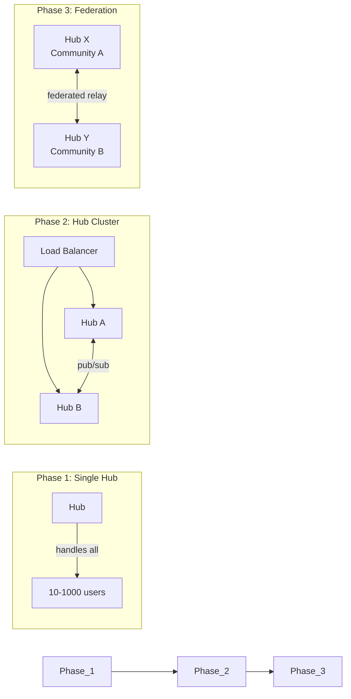

---

## Key Trade-offs

| Decision          | Chosen                         | Alternative                   | Rationale                                                                                                                      |
| ----------------- | ------------------------------ | ----------------------------- | ------------------------------------------------------------------------------------------------------------------------------ |
| Message storage   | NodeStore (Change<T>)          | Yjs Y.Array                   | Signed, ordered, hash-chained — better for chat audit trail. Yjs is better for collaborative editing, not append-only logs.    |
| Encryption (v1)   | Per-room symmetric key         | Double Ratchet                | Simpler key management, acceptable for groups. Ratchet adds per-message forward secrecy but is complex.                        |
| Video SFU         | mediasoup (in-process)         | LiveKit (sidecar)             | Node.js native, embeddable, custom signaling. LiveKit is more batteries-included but separate process.                         |
| Offline delivery  | Hub queues changes             | Pure P2P (hope peers overlap) | Reliability is critical for messaging. Hub as always-on peer solves this.                                                      |
| Message format    | Nodes via defineSchema         | Custom protobuf               | Reuses existing infrastructure. No new serialization/storage layer.                                                            |
| Reactions         | Serialized in message property | Separate Reaction Nodes       | Simpler (fewer Nodes), reactions are small. Separate Nodes would give individual Change history per reaction but adds clutter. |
| Typing indicators | Awareness (ephemeral)          | Typed Changes                 | Typing is transient — should not be persisted or signed. Awareness is perfect.                                                 |

---

## Dependencies

| Package            | Purpose                            | Notes                       |
| ------------------ | ---------------------------------- | --------------------------- |
| `mediasoup`        | SFU core (C++ workers)             | Node.js API, ~6K stars      |
| `mediasoup-client` | Browser SFU client                 | WebRTC transport management |
| `web-push`         | Push notifications                 | Web Push protocol (VAPID)   |
| `@xnet/crypto`     | XChaCha20, X25519, Ed25519, BLAKE3 | Already exists              |
| `@xnet/identity`   | DID, UCAN, KeyBundle               | Already exists              |
| `@xnet/data`       | NodeStore, schemas                 | Already exists              |
| `@xnet/sync`       | Change<T>, Lamport, SyncProvider   | Already exists              |
| `@xnet/react`      | WebSocketSyncProvider, Awareness   | Already exists              |

---

## References

- [Keet / Holepunch](https://keet.io) — P2P messaging with Hypercore/Autobase
- [Matrix Spec](https://spec.matrix.org) — Federated event DAG with E2E
- [Signal Protocol](https://signal.org/docs/) — Double Ratchet, X3DH
- [SimpleX Chat](https://simplex.chat) — No-identifier blind relays
- [mediasoup](https://mediasoup.org) — Node.js SFU library
- [Insertable Streams](https://w3c.github.io/webrtc-encoded-transform/) — E2E video encryption
- [SFrame RFC](https://datatracker.ietf.org/doc/draft-ietf-sframe-enc/) — Secure frame format
- [planStep03_6Comments](../planStep03_6Comments/README.md) — xNet commenting system (shared Message schema)
- [Yjs Security Analysis](./YJS_SECURITY_ANALYSIS.md) — Signing infrastructure reusable for chat
- [Hub Phase 1](../planStep03_8HubPhase1VPS/README.md) — Hub relay architecture
