# Mastodon-Style Social Networking for xNet

## Executive Summary

This exploration examines how to integrate Mastodon-style microblogging and social networking into xNet, leveraging the existing decentralized infrastructure (DID identity, P2P sync, schema-first data model, Hub infrastructure) while maintaining the local-first, user-owned-data philosophy. The goal is a federated social experience where posts, follows, and timelines are user-owned Nodes synced peer-to-peer through Hubs, with optional ActivityPub bridging for interop with the wider Fediverse.

**Key dependency**: This design builds on the xNet Hub (`@xnetjs/hub`) as defined in [plan03_8HubPhase1VPS](../plans/plan03_8HubPhase1VPS/README.md). The Hub provides always-on sync relay, server-side queries (SQLite FTS5), content-addressed file hosting, peer discovery, schema registry, and hub-to-hub federation -- all of which are directly leveraged for social features.

---

## 1. What Mastodon Gets Right (And What We Borrow)

Mastodon's core model is simple and proven:

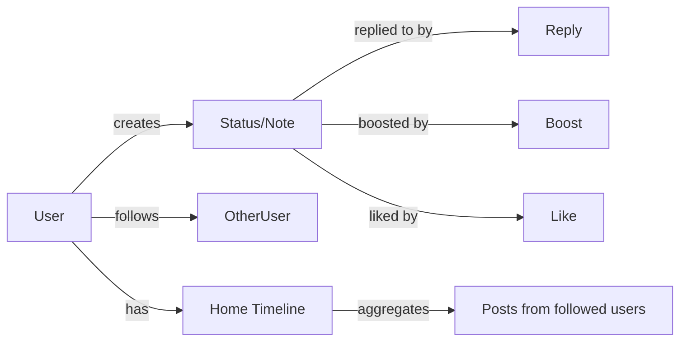

### Key Concepts We Adopt

| Mastodon Concept | xNet Equivalent          | Notes                              |
| ---------------- | ------------------------ | ---------------------------------- |
| Account/Actor    | DID + Profile Node       | Self-sovereign identity            |
| Status/Toot      | Post Node                | Schema-defined, CRDT-synced        |
| Follow           | Follow Node              | Directed relationship between DIDs |
| Boost/Reblog     | Boost Node               | References original Post           |
| Favourite/Like   | Like Node                | References a Post                  |
| Reply            | Post with `inReplyTo`    | Thread via relation property       |
| Timeline         | Computed feed            | Local query over synced Posts      |
| Instance         | Hub (`@xnetjs/hub`)      | Always-on peer, not an authority   |
| Hashtag          | Tag property             | Indexed for discovery              |
| Mention          | Person reference in Post | DID-based, not @user@server        |

### What We Intentionally Diverge From

1. **No server-centric model**: Users don't "join an instance." Their data lives on their devices and syncs through Hubs.
2. **No HTTP inbox/outbox**: We use WebSocket sync through Hubs instead of HTTP POST to inboxes.
3. **Hybrid query model**: Feed assembly can happen client-side OR via Hub's server-side query engine (FTS5).
4. **DID-native addressing**: Users are `did:key:z6Mk...` not `@user@server.tld`.
5. **Optional ActivityPub bridge**: A Hub can run an AP bridge service for Fediverse interop.
6. **Hub != Authority**: Unlike Mastodon instances, Hubs don't own user data or identity. Users can switch Hubs freely.

---

## 2. Data Model: Social Schemas

Using xNet's `defineSchema()` system, we define the core social primitives:

### 2.1 Profile Schema

```typescript
const Profile = defineSchema({
  name: 'Profile',
  namespace: 'xnet://xnet.dev/',
  properties: {
    displayName: text({ required: true, maxLength: 50 }),
    bio: text({ maxLength: 500 }),
    avatar: file({ accept: ['image/*'] }),
    header: file({ accept: ['image/*'] }),
    discoverable: checkbox({ default: true }),
    manuallyApprovesFollowers: checkbox({ default: false }),
    fields: text({ multiple: true }) // Key-value pairs serialized
  }
})
// IRI: xnet://xnet.dev/Profile
```

The Profile is a singleton Node per DID -- one per identity. The DID itself serves as the globally unique actor identifier.

### 2.2 Post Schema

```typescript
const Post = defineSchema({
  name: 'Post',
  namespace: 'xnet://xnet.dev/',
  properties: {
    content: text({ required: true, maxLength: 500 }),
    contentWarning: text({ maxLength: 200 }),
    visibility: select({
      options: ['public', 'followers', 'mentioned', 'direct'],
      default: 'public'
    }),
    inReplyTo: relation({ target: 'xnet://xnet.dev/Post' }),
    mentions: person({ multiple: true }),
    tags: multiSelect({ options: [] }), // Dynamic hashtags
    attachments: file({ multiple: true, accept: ['image/*', 'video/*', 'audio/*'] }),
    sensitive: checkbox({ default: false }),
    language: text({ maxLength: 10 }),
    publishedAt: date()
  }
})
// IRI: xnet://xnet.dev/Post
```

### 2.3 Follow Schema

```typescript
const Follow = defineSchema({
  name: 'Follow',
  namespace: 'xnet://xnet.dev/',
  properties: {
    target: person({ required: true }), // DID of who we're following
    status: select({
      options: ['pending', 'accepted', 'rejected'],
      default: 'pending'
    }),
    notify: checkbox({ default: true }) // Get notifications for this person
  }
})
// IRI: xnet://xnet.dev/Follow
```

### 2.4 Like Schema (Universal)

The Like schema targets **any Node** -- not just Posts. This means the same `useLike()` hook works for timeline posts, wiki pages, database records, chat messages, comments, and any future Node type. See [Universal Social Primitives](./UNIVERSAL_SOCIAL_PRIMITIVES.md) for the full design.

```typescript
const Like = defineSchema({
  name: 'Like',
  namespace: 'xnet://xnet.dev/',
  properties: {
    target: relation({ required: true }), // ANY Node ID -- schema-agnostic
    targetSchema: text() // Optional: schema IRI for query optimization
  }
})
// IRI: xnet://xnet.dev/Like
// Works on: Posts, Pages, Database records, Messages, Comments, Files...
```

### 2.5 Boost Schema (Universal)

```typescript
const Boost = defineSchema({
  name: 'Boost',
  namespace: 'xnet://xnet.dev/',
  properties: {
    target: relation({ required: true }), // ANY Node -- share anything to your timeline
    targetSchema: text(),
    comment: text({ maxLength: 500 }) // Optional quote-boost
  }
})
// IRI: xnet://xnet.dev/Boost
```

### 2.6 Notification Schema (Universal)

```typescript
const Notification = defineSchema({
  name: 'Notification',
  namespace: 'xnet://xnet.dev/',
  properties: {
    type: select({
      options: [
        'follow',
        'like',
        'boost',
        'mention',
        'reply',
        'follow_request',
        'react',
        'comment'
      ],
      required: true
    }),
    actor: person({ required: true }), // Who triggered this
    target: relation(), // The Node this is about (any schema)
    targetSchema: text(), // Schema IRI for rendering context
    read: checkbox({ default: false })
  }
})
// IRI: xnet://xnet.dev/Notification
```

### Data Model Diagram

Note: Like, Boost, and Notification use **universal `target`** -- they can reference any Node regardless of schema. See [Universal Social Primitives](./UNIVERSAL_SOCIAL_PRIMITIVES.md).

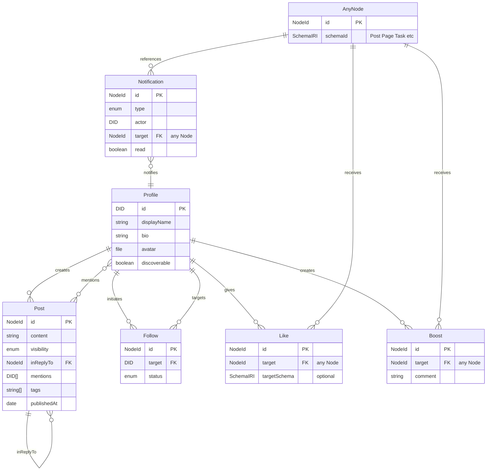

### 2.7 Universal Social Primitives

A key design decision: **Like, Boost, Comment, React, and Bookmark are schema-agnostic**. They target any Node by ID, regardless of what schema that Node belongs to. This means:

- `useLike(nodeId)` works on a timeline Post, a wiki Page, a database Task, a chat Message
- `useBoost(nodeId)` can share any Node to your timeline
- `useReact(nodeId, emoji)` adds emoji reactions to anything
- `useComment(nodeId)` attaches a comment thread to any Node
- `useBookmark(nodeId)` saves any Node for later

This is possible because xNet Node IDs are globally unique (nanoid, schema-independent). The social primitives reference a Node ID without needing to know what kind of Node it is.

**Full exploration**: See [Universal Social Primitives](./UNIVERSAL_SOCIAL_PRIMITIVES.md) for the complete design, including the required `relation()` property change, query patterns, Hub indexing, and all universal primitive schemas.

---

## 3. Federation Architecture: Hub-Powered Social

### 3.1 The Hub as Social Infrastructure

The xNet Hub (`@xnetjs/hub`) is the backbone of social networking. Unlike Mastodon's monolithic instance server, the Hub is a focused always-on peer that provides specific services. For social features, we leverage these Hub capabilities:

| Hub Service                       | Social Use                                                    | Hub Phase |
| --------------------------------- | ------------------------------------------------------------- | --------- |
| **Sync Relay** (node-relay)       | Store-and-forward Posts, Follows, Likes between offline peers | Phase 8   |
| **Query Engine** (FTS5)           | Server-side timeline queries, hashtag search, user search     | Phase 5   |
| **File Storage** (CID-addressed)  | Avatar/header images, post media attachments                  | Phase 9   |
| **Peer Discovery** (DID registry) | Find users by DID, resolve to WebSocket endpoint              | Phase 12  |
| **Schema Registry**               | Publish and resolve social schemas across the network         | Phase 10  |
| **Hub Federation**                | Cross-hub timeline queries, trending aggregation              | Phase 13  |
| **Awareness Persistence**         | Online/offline status, "last seen" for profiles               | Phase 11  |

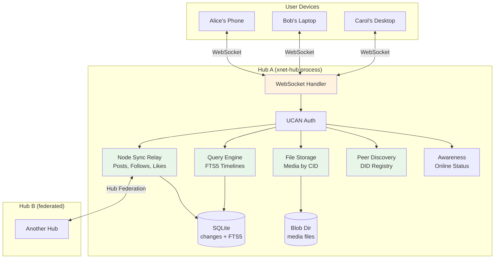

### 3.2 How Posts Propagate Through Hubs

Unlike Mastodon's HTTP inbox delivery, xNet propagates social data through the Hub's Node Sync Relay:

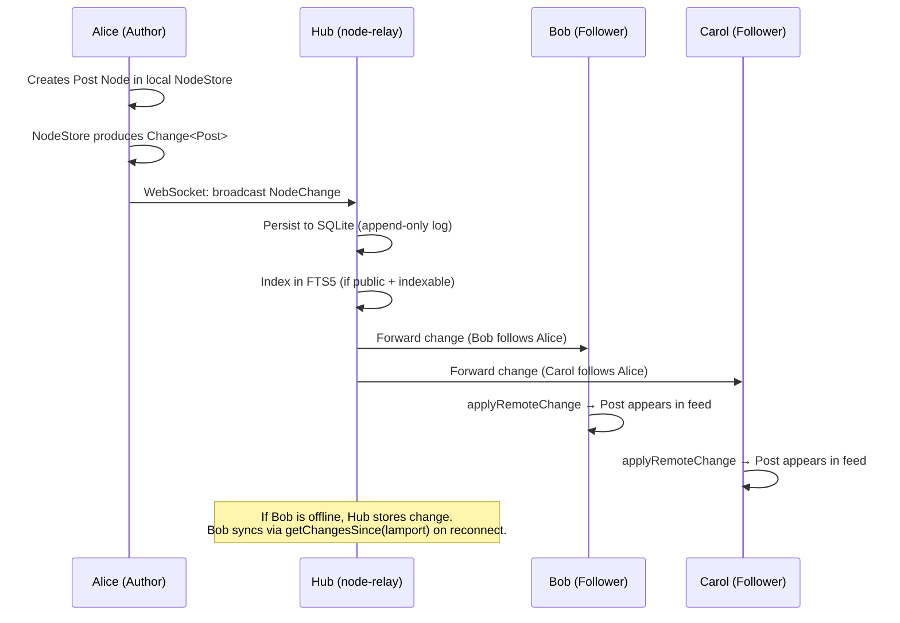

The Hub's **delta sync protocol** (Phase 8 of Hub plan) is critical here: when Bob reconnects, he sends his latest Lamport timestamp and receives only the changes he missed. This is the same mechanism used for document sync, now applied to social Nodes.

### 3.3 Follow Mechanics via Hub

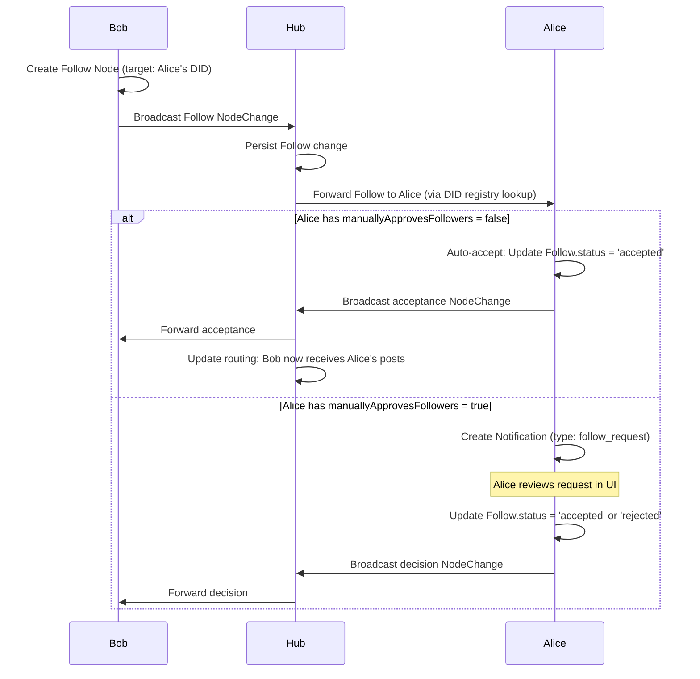

The Hub's **Peer Discovery** service (Phase 12) resolves Alice's DID to her WebSocket connection, enabling the Follow to reach her even if Bob doesn't know her network address.

### 3.4 Hub vs. Mastodon Instance

| Aspect         | Mastodon Instance                    | xNet Hub                                     |
| -------------- | ------------------------------------ | -------------------------------------------- |
| Runs           | PostgreSQL + Redis + Sidekiq + Nginx | Single Node.js process + SQLite              |
| Deploy         | Complex, needs $20+/mo VPS           | `npx @xnetjs/hub`, $5/mo VPS or free (local) |
| Owns user data | Yes (server is source of truth)      | No (caches + relays, user device is source)  |
| Owns identity  | Yes (@user@server)                   | No (DID is portable, Hub just resolves it)   |
| User switching | Complex migration + redirect         | Just point client at new Hub URL             |
| Offline use    | Impossible                           | Full offline, Hub syncs on reconnect         |
| Moderation     | Instance admin has full power        | Hub operator sets relay policies only        |

### 3.5 Visibility & Access Control

Post visibility maps to Hub relay permissions, enforced by UCAN capabilities:

| Visibility  | Hub Behavior                                             | UCAN Requirement                                       |
| ----------- | -------------------------------------------------------- | ------------------------------------------------------ |
| `public`    | Relay to all connected peers, index in FTS5              | None (open broadcast)                                  |
| `followers` | Relay only to peers with accepted Follow for this author | `{ with: 'xnet://did:key:.../Follow', can: 'read' }`   |
| `mentioned` | Relay only to mentioned DIDs                             | `{ with: 'xnet://did:key:.../Post/:id', can: 'read' }` |
| `direct`    | Relay encrypted payload to recipient only                | Encrypted with recipient's X25519 key                  |

For `direct` messages, we leverage `@xnetjs/crypto`'s XChaCha20-Poly1305 encryption:

```typescript
// Encrypt post content for specific recipient
const encrypted = encrypt(
  postContent,
  recipientPublicKey, // X25519 from their KeyBundle (resolved via Hub's DID registry)
  senderPrivateKey
)
// Store as encrypted Uint8Array in Post.content
// Hub relays the blob but cannot read it (zero-knowledge)
```

### 3.6 Multi-Hub Federation for Social

Users can connect to multiple Hubs for redundancy, and Hubs federate with each other for cross-community discovery:

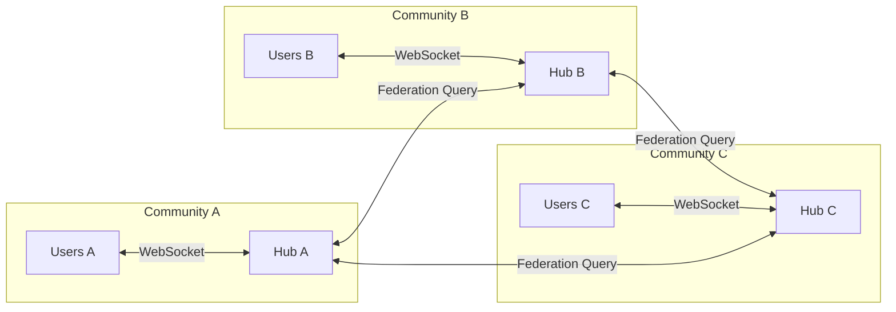

Hub Federation (Phase 13 of Hub plan) enables:

- **Cross-hub user search**: Find users on other Hubs by name or DID
- **Federated timelines**: "Public" feed aggregated from multiple Hubs (like Mastodon's federated timeline)
- **Trending across Hubs**: Reciprocal Rank Fusion merges trending data from peer Hubs
- **Cross-hub thread resolution**: If a reply lives on Hub B, Hub A can fetch it via federation query

---

## 4. Timeline/Feed Assembly

### 4.1 Dual-Mode Feed: Local + Hub Query

Feed assembly uses a **hybrid approach** -- local queries for data already synced, Hub queries for larger datasets or when the device is resource-constrained:

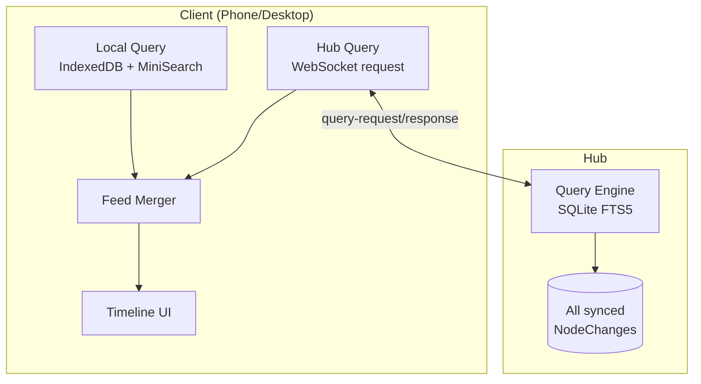

**When to use local vs. Hub queries:**

| Scenario                         | Query Mode | Rationale                                |
| -------------------------------- | ---------- | ---------------------------------------- |
| User has < 100 follows           | Local      | All data fits in IndexedDB               |
| Mobile device, large follow list | Hub        | Avoid syncing 100K+ posts to device      |
| Hashtag search                   | Hub        | Hub's FTS5 index covers all public posts |
| Own profile feed                 | Local      | Own data is always local                 |
| Federated/public timeline        | Hub        | Aggregates posts from all Hub users      |
| Offline                          | Local      | Hub unavailable, show cached data        |

### 4.2 Local Feed Construction

For users with modest follow counts, the home timeline is assembled locally:

```typescript
async function getHomeTimeline(store: NodeStore, myDID: DID) {
  // 1. Get all accepted follows
  const follows = await store.query({
    schemaId: 'xnet://xnet.dev/Follow',
    filter: { createdBy: myDID, status: 'accepted' }
  })
  const followedDIDs = follows.map((f) => f.properties.target)

  // 2. Query posts from followed users + own posts
  const posts = await store.query({
    schemaId: 'xnet://xnet.dev/Post',
    filter: {
      createdBy: { $in: [...followedDIDs, myDID] },
      visibility: { $in: ['public', 'followers'] },
      inReplyTo: null
    },
    sort: { publishedAt: 'desc' },
    limit: 50
  })

  // 3. Interleave boosts from followed users
  const boosts = await store.query({
    schemaId: 'xnet://xnet.dev/Boost',
    filter: { createdBy: { $in: followedDIDs } },
    sort: { createdAt: 'desc' },
    limit: 20
  })

  return mergeAndSort(posts, boosts)
}
```

### 4.3 Hub-Powered Feed Construction

For larger datasets or server-side timelines, the client delegates to the Hub's query engine:

```typescript
// Client sends query over existing WebSocket connection to Hub
async function getHomeTimelineFromHub(hubConnection: WebSocket, myDID: DID) {
  // Hub's query engine (Phase 5) handles this server-side with SQLite FTS5
  const response = await hubConnection.query({
    type: 'timeline',
    feed: 'home',
    actor: myDID,
    limit: 50,
    since: lastSeenLamport // Delta fetch -- only new posts
  })
  return response.posts
}

// Hub-side implementation (in @xnetjs/hub services/query.ts)
async function handleTimelineQuery(query: TimelineQuery, db: Database) {
  // Hub already has all NodeChanges persisted (Phase 8: node-relay)
  // and FTS5 indexed (Phase 5: query engine)
  const follows = db
    .prepare(
      `
    SELECT json_extract(payload, '$.properties.target') as target_did
    FROM node_changes
    WHERE schema_id = 'xnet://xnet.dev/Follow'
      AND author_did = ?
      AND json_extract(payload, '$.properties.status') = 'accepted'
  `
    )
    .all(query.actor)

  const posts = db
    .prepare(
      `
    SELECT * FROM node_changes
    WHERE schema_id = 'xnet://xnet.dev/Post'
      AND author_did IN (${follows.map(() => '?').join(',')})
      AND lamport > ?
    ORDER BY lamport DESC
    LIMIT ?
  `
    )
    .all(...follows.map((f) => f.target_did), query.since, query.limit)

  return { posts }
}
```

### 4.4 Feed Types

| Feed          | Source                   | Query Mode      | Description                              |
| ------------- | ------------------------ | --------------- | ---------------------------------------- |
| Home          | Followed users' posts    | Local or Hub    | Chronological, no algorithm              |
| Local         | Same Hub's public posts  | Hub             | Discover users on same Hub               |
| Federated     | Public posts across Hubs | Hub (federated) | Aggregated via Hub Federation (Phase 13) |
| Profile       | Single user's posts      | Local or Hub    | Their post history                       |
| Thread        | Post + all replies       | Hub (cross-hub) | Conversation view, may span Hubs         |
| Notifications | Actions targeting you    | Local           | Follows, likes, boosts, mentions         |
| Hashtag       | Posts with specific tag  | Hub (FTS5)      | Full-text search by tag                  |
| Search        | Full-text over all posts | Hub (FTS5)      | Powered by Hub's query engine            |

### 4.5 Indexing Strategy

**Client-side** (for offline/local queries):

```typescript
// MiniSearch in @xnetjs/query for local full-text
const localIndex = new MiniSearch({
  fields: ['content', 'tags'],
  storeFields: ['createdBy', 'publishedAt', 'visibility']
})
```

**Hub-side** (for server-powered queries):

```sql
-- SQLite FTS5 virtual table (created by Hub's query engine, Phase 5)
CREATE VIRTUAL TABLE posts_fts USING fts5(
  content,
  tags,
  content_rowid,    -- References node_changes.rowid
  tokenize='porter unicode61'
);

-- Materialized indexes for fast timeline assembly
CREATE INDEX idx_posts_author ON node_changes(author_did, lamport DESC)
  WHERE schema_id = 'xnet://xnet.dev/Post';

CREATE INDEX idx_posts_tag ON node_changes(json_extract(payload, '$.properties.tags'))
  WHERE schema_id = 'xnet://xnet.dev/Post';
```

---

## 5. Discovery & Search (Hub-Powered)

### 5.1 User Discovery via Hub Peer Registry

The Hub's **Peer Discovery** service (Phase 12) provides the backbone for finding users:

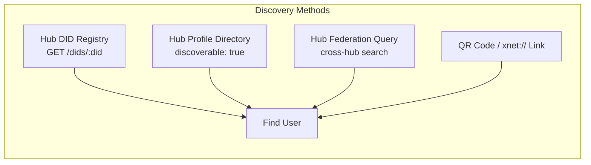

1. **Hub DID Resolution** (`GET /dids/:did`): The Hub maintains a registry of DIDs → WebSocket endpoints. Peers auto-register on authenticated WebSocket connect (Phase 12.3).
2. **Profile Directory**: Hub queries its SQLite for all Profile Nodes with `discoverable: true`, serving a searchable user directory.
3. **Federated User Search**: Hub Federation (Phase 13) queries peer Hubs for matching profiles, deduplicating by DID.
4. **Direct Share**: QR codes or `xnet://did:key:z6Mk.../Profile` links resolved via any connected Hub.

```typescript
// Client-side: find a user by name or DID
const results = await hubConnection.query({
  type: 'user-search',
  query: 'alice', // Searches displayName, bio
  federate: true // Also query peer Hubs
})
// Returns: [{ did, displayName, bio, avatar_cid, hub_endpoint }]
```

### 5.2 Hashtag Discovery via Hub FTS5

Hashtags are indexed in the Hub's FTS5 engine, enabling instant tag search and trending:

```typescript
// When a Post is created with tags, the Hub's node-relay persists it.
// The query engine automatically indexes tag fields in FTS5.

// Client queries Hub for hashtag feed
const tagFeed = await hubConnection.query({
  type: 'timeline',
  feed: 'tag',
  tag: 'decentralization',
  limit: 50
})

// Hub SQL (internal):
// SELECT * FROM node_changes
// WHERE schema_id = 'xnet://xnet.dev/Post'
//   AND json_extract(payload, '$.properties.tags') LIKE '%decentralization%'
// ORDER BY lamport DESC LIMIT 50
```

### 5.3 Trending & Recommendations (Hub-Computed)

The Hub computes trending data from its persisted NodeChanges:

```typescript
// Hub-side trending computation (new service in @xnetjs/hub)
class TrendingService {
  // Runs periodically (every 5 minutes)
  computeTrending(db: Database) {
    // Trending tags: count unique authors per tag in time windows
    const trending1h = db
      .prepare(
        `
      SELECT json_extract(payload, '$.properties.tags') as tag,
             COUNT(DISTINCT author_did) as authors
      FROM node_changes
      WHERE schema_id = 'xnet://xnet.dev/Post'
        AND wall_time > unixepoch() - 3600
      GROUP BY tag ORDER BY authors DESC LIMIT 20
    `
      )
      .all()

    // Popular posts: count likes + boosts per post
    const popular = db
      .prepare(
        `
      SELECT json_extract(payload, '$.properties.post') as post_id,
             COUNT(*) as engagement
      FROM node_changes
      WHERE schema_id IN ('xnet://xnet.dev/Like', 'xnet://xnet.dev/Boost')
        AND wall_time > unixepoch() - 86400
      GROUP BY post_id ORDER BY engagement DESC LIMIT 20
    `
      )
      .all()

    return { tags: trending1h, posts: popular }
  }

  // Follow suggestions: social graph analysis
  suggestFollows(db: Database, myDID: DID) {
    // "Friends of friends" -- people followed by people I follow
    return db
      .prepare(
        `
      SELECT target_did, COUNT(*) as mutual_count FROM (
        SELECT json_extract(f2.payload, '$.properties.target') as target_did
        FROM node_changes f1
        JOIN node_changes f2
          ON json_extract(f1.payload, '$.properties.target') = f2.author_did
        WHERE f1.author_did = ?
          AND f1.schema_id = 'xnet://xnet.dev/Follow'
          AND f2.schema_id = 'xnet://xnet.dev/Follow'
          AND json_extract(f2.payload, '$.properties.target') != ?
      )
      GROUP BY target_did ORDER BY mutual_count DESC LIMIT 10
    `
      )
      .all(myDID, myDID)
  }
}
```

Cross-Hub trending uses **Hub Federation** (Phase 13): each Hub shares its trending data, and the client's Hub merges results using Reciprocal Rank Fusion (already implemented in the federation plan).

---

## 6. ActivityPub Bridge (Hub Service, Optional)

For users who want to interact with the broader Fediverse (Mastodon, Pleroma, Pixelfed, etc.), the Hub can run an **AP Bridge service** -- an additional Hono route handler that translates between xNet NodeChanges and ActivityPub HTTP:

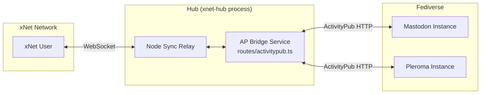

The bridge runs inside the same Hub process -- no separate deployment needed. It's enabled with a flag:

```bash
npx @xnetjs/hub --port 4444 --activitypub --ap-domain social.example.com
```

### 6.1 DID to ActivityPub Actor Mapping

```
xNet DID:     did:key:z6MkhaXgBZDvotDkL5257faiztiGiC2QtKLGpbnnEGta2doK
AP Actor:     https://bridge.xnet.dev/users/z6MkhaXgBZDvotDkL5257faiztiGiC2QtKLGpbnnEGta2doK
WebFinger:    @z6MkhaX...2doK@bridge.xnet.dev
```

### 6.2 Translation Rules

| xNet                     | Direction | ActivityPub                        |
| ------------------------ | --------- | ---------------------------------- |
| Post Node (create)       | ->        | Create(Note) to followers' inboxes |
| Post Node (delete)       | ->        | Delete(Note)                       |
| Follow Node (create)     | ->        | Follow activity                    |
| Follow.status = accepted | ->        | Accept(Follow)                     |
| Like Node                | ->        | Like activity                      |
| Boost Node               | ->        | Announce activity                  |
| Incoming Create(Note)    | <-        | Create Post Node in bridge's store |
| Incoming Follow          | <-        | Create Follow Node                 |
| Incoming Like            | <-        | Create Like Node                   |

### 6.3 Bridge Implementation Sketch

```typescript
class ActivityPubBridge {
  private store: NodeStore
  private syncProvider: SyncProvider
  private httpServer: HTTPServer // For AP inbox

  // xNet -> ActivityPub
  async onLocalChange(change: Change<NodePayload>) {
    const node = change.payload
    if (node.schemaId === 'xnet://xnet.dev/Post') {
      const activity = this.postToActivity(node)
      await this.deliverToFollowers(activity, change.authorDID)
    }
  }

  // ActivityPub -> xNet
  async onInboxReceive(activity: APActivity) {
    switch (activity.type) {
      case 'Create':
        const post = this.activityToPost(activity)
        await this.store.create(post)
        break
      case 'Follow':
        const follow = this.activityToFollow(activity)
        await this.store.create(follow)
        break
      // ...
    }
  }

  private postToActivity(node: Node): APActivity {
    return {
      '@context': 'https://www.w3.org/ns/activitystreams',
      type: 'Create',
      actor: this.didToActorURI(node.createdBy),
      object: {
        type: 'Note',
        content: node.properties.content,
        published: new Date(node.properties.publishedAt).toISOString(),
        to: this.resolveAudience(node.properties.visibility),
        tag: this.buildTags(node.properties.mentions, node.properties.tags),
        inReplyTo: node.properties.inReplyTo ? this.nodeIdToURI(node.properties.inReplyTo) : null
      }
    }
  }
}
```

---

## 7. Implementation Plan

> **Prerequisite**: Hub Phase 1-12 must be complete (signaling, auth, sync relay, node-relay, query engine, file storage, peer discovery). These provide the infrastructure social features build on.

### Phase 1: Core Schemas & Local Social (2-3 weeks)

1. Define and register social schemas (Post, Profile, Follow, Like, Boost, Notification) via Hub's Schema Registry
2. Implement local feed assembly queries in `@xnetjs/query`
3. Build basic React hooks: `useTimeline()`, `useProfile()`, `useThread()`
4. Create compose UI component for posting
5. Profile view with post history
6. Media upload via Hub's File Storage (`PUT /files/:cid`)

### Phase 2: Hub-Powered Social Sync (2-3 weeks)

1. Extend Hub's node-relay with social-specific routing (visibility-aware delivery via UCAN)
2. Implement follow/unfollow lifecycle through Hub (with DID resolution for delivery)
3. Like and Boost propagation via Hub's NodeChange broadcast
4. Notification generation in Hub on incoming social events (server-side)
5. Direct messaging with E2E encryption (Hub relays opaque blobs)

### Phase 3: Hub Social Services (2-3 weeks)

1. Add `TrendingService` to Hub (tag/post trending computation)
2. Add social-specific FTS5 indexes to Hub's query engine
3. Add `SuggestionsService` to Hub (follow suggestions from social graph)
4. "Local" timeline query (all public posts on this Hub)
5. Profile directory with search (`GET /dids?search=...`)

### Phase 4: Hub Federation for Social (2-3 weeks)

1. Extend Hub Federation (Phase 13) with social query types (timeline, trending, user-search)
2. Cross-hub thread resolution (fetch replies from other Hubs)
3. Federated timeline aggregation (public posts across peer Hubs)
4. Cross-hub trending merge via Reciprocal Rank Fusion
5. Global hashtag search across federated Hubs

### Phase 5: ActivityPub Bridge (3-4 weeks, optional)

1. Add `routes/activitypub.ts` to Hub (Hono route handler)
2. WebFinger endpoint for DID → AP actor resolution
3. DID ↔ Actor URI mapping with Hub's DID registry
4. Bidirectional translation (NodeChanges ↔ AP Activities)
5. HTTP Signatures (Ed25519) for S2S authentication
6. Follower synchronization between xNet Follow Nodes and AP Follow activities

### Phase 6: Polish & Moderation (2-3 weeks)

1. Content warnings and sensitive media handling
2. Block/mute at social layer (Hub-enforced + client-side PeerAccessControl)
3. Report mechanism (Flag activity to Hub operator)
4. Media attachments with blurhash previews (generated on Hub file upload)
5. Thread view and conversation UI

---

## 8. Key Technical Decisions

### 8.1 Why Not Just Implement ActivityPub Directly?

| ActivityPub Assumption | xNet Reality                   | Resolution                                     |
| ---------------------- | ------------------------------ | ---------------------------------------------- |
| Server-to-server HTTP  | WebSocket sync through Hubs    | Hub AP bridge service for interop              |
| Server hosts user data | User owns data locally         | Hub caches, doesn't own (user can switch Hubs) |
| HTTP Signatures (RSA)  | Ed25519 + UCAN                 | Hub bridge translates auth                     |
| JSON-LD over HTTP      | Nodes over WebSocket sync      | Schema mapping in bridge                       |
| Server-assigned IDs    | Content-addressed (BLAKE3 CID) | Hub maps CID → deterministic URL               |
| Central inbox per user | Hub's node-relay broadcasts    | Hub aggregates and forwards                    |

Implementing ActivityPub natively would require an always-online HTTP server per user, which contradicts the local-first model. The Hub bridge approach gives interoperability without sacrificing the architecture -- the AP bridge is just another Hub service (`--activitypub` flag), not a separate deployment.

### 8.2 Conflict Resolution for Social Actions

Social actions are naturally idempotent and conflict-free:

- **Posts**: Unique per `(author DID, Node ID)`. No conflicts possible.
- **Likes**: Deduplicated by `(author DID, post ID)`. Double-like is a no-op.
- **Follows**: Deduplicated by `(follower DID, target DID)`. LWW on status field.
- **Boosts**: Unique per `(author DID, post ID)`. Double-boost is a no-op.

The existing Lamport + LWW conflict resolution in NodeStore handles the edge cases (e.g., concurrent follow accept/reject resolves to latest wall-time).

### 8.3 Scalability Considerations

| Scale                | Strategy                          | Hub Config                     |
| -------------------- | --------------------------------- | ------------------------------ |
| < 100 followers      | Single Hub, all data local        | $5/mo VPS, 1 SQLite DB         |
| 100 - 10K followers  | Single Hub, Hub-side queries      | $10/mo VPS, SQLite scales fine |
| 10K - 100K followers | Multiple Hubs, Hub Federation     | 3+ Hubs, geo-distributed       |
| > 100K followers     | Hub cluster + Global Index Shards | Phase 14-15 of Hub plan        |

For most users (< 10K followers), a single Hub is sufficient. The Hub's SQLite can handle millions of NodeChanges efficiently. For high-follower-count users, the Hub's **Global Index Shards** (Phase 14) distribute the query load across multiple Hub instances.

The Hub's Node Pool with LRU eviction (Phase 3.2) ensures memory stays bounded even with millions of posts -- hot data stays in RAM, cold data lives in SQLite.

### 8.4 Storage Estimates

Per-user storage for social data:

| Content                    | Size              | 1000 posts |
| -------------------------- | ----------------- | ---------- |
| Post Node (text only)      | ~500 bytes        | 500 KB     |
| Post Node (with image ref) | ~1 KB             | 1 MB       |
| Follow Node                | ~200 bytes        | N/A        |
| Like Node                  | ~150 bytes        | N/A        |
| Change metadata            | ~300 bytes/change | 300 KB     |

A user with 1000 posts, 500 follows, and 2000 likes uses ~3 MB of structured data. Media files are stored on the Hub via File Storage (`/files/:cid`) and referenced by CID in Post Nodes.

**Hub-side storage**: The Hub persists all NodeChanges for connected users. A Hub serving 1000 users with 1000 posts each stores ~3 GB of structured data in SQLite -- well within a $5/mo VPS capacity. Media files (images/video) are stored separately in the Hub's blob directory with storage quotas per user.

---

## 9. Comparison with Mastodon Architecture

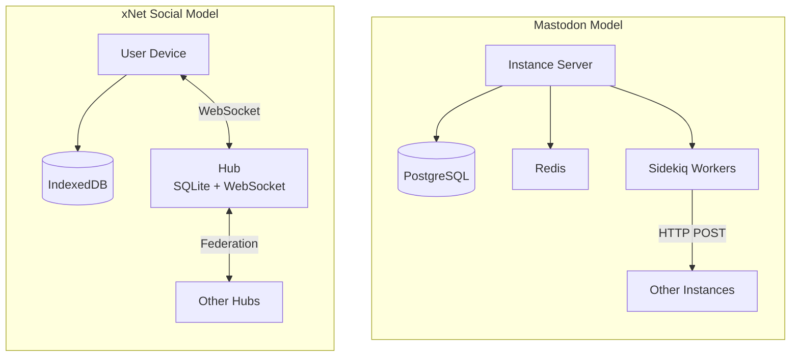

| Aspect            | Mastodon                             | xNet Social (Hub-Powered)                                  |
| ----------------- | ------------------------------------ | ---------------------------------------------------------- |
| Data ownership    | Instance operator                    | User (on device), Hub caches                               |
| Identity          | Instance-scoped (@user@server)       | Global DID (portable across Hubs)                          |
| Availability      | Server uptime                        | Device + Hub (Hub is the always-on peer)                   |
| Migration         | Complex export/import + redirect     | Point client at new Hub URL (instant)                      |
| Moderation        | Instance admin has full control      | Hub operator sets relay policies, user controls own blocks |
| Discovery         | WebFinger + HTTP                     | Hub DID Registry + Federation Query                        |
| Encryption        | TLS only (server sees all)           | E2E for DMs (Hub can't read), transport for public         |
| Offline use       | Not possible                         | Full offline, Hub syncs on reconnect (delta sync)          |
| Algorithm         | Chronological                        | Chronological (pluggable via client-side logic)            |
| Search            | Elasticsearch (optional)             | Hub FTS5 (built-in, zero config)                           |
| Media             | S3 / local filesystem                | Hub File Storage (CID-addressed, BLAKE3 verified)          |
| Deploy cost       | $20+/mo (Postgres + Redis + workers) | $5/mo (single process + SQLite)                            |
| Deploy complexity | Complex (5+ services)                | `npx @xnetjs/hub` or `docker run xnet/hub`                 |

---

## 10. React Hooks API (Proposed)

```typescript
// --- Feed Hooks ---

// Home timeline (posts from followed users)
const { posts, loading, loadMore } = useTimeline('home')

// Profile feed
const { posts } = useTimeline('profile', { did: userDID })

// Hashtag feed
const { posts } = useTimeline('tag', { tag: 'decentralization' })

// Thread view
const { thread, replies } = useThread(postId)

// --- Social Action Hooks ---

// Compose and publish a post
const { publish, draft, setDraft } = useCompose()
await publish({ content: 'Hello world!', visibility: 'public' })

// Follow/unfollow
const { follow, unfollow, status } = useFollow(targetDID)

// Like/unlike
const { like, unlike, isLiked, count } = useLike(postId)

// Boost
const { boost, unboost, isBoosted, count } = useBoost(postId)

// --- Profile Hooks ---

// Own profile management
const { profile, updateProfile } = useMyProfile()

// View another user's profile
const { profile, posts, followers, following } = useProfile(did)

// --- Notification Hook ---
const { notifications, unreadCount, markRead } = useNotifications()

// --- Discovery Hooks ---
const { results } = useSearch(query) // Full-text search
const { trending } = useTrending() // Trending tags/posts
const { suggestions } = useSuggestions() // Follow suggestions
```

---

## 11. Open Questions

1. **Character limit**: Mastodon uses 500 chars. Do we match this or allow longer posts?
   - Recommendation: 500 default, configurable per-user since there's no instance policy.

2. **Media hosting**: Where do images/videos live in a P2P network?
   - **Answer: Hub File Storage** (Phase 9 of Hub plan). Files are uploaded via `PUT /files/:cid`, verified with BLAKE3, served with immutable cache headers. This is already designed and specified -- social media just uses it.
   - CID-addressing means the same image uploaded to multiple Hubs is deduplicated by content hash.
   - Storage quotas per user are enforced by the Hub.

3. **Moderation without admins**: How do we handle abuse in a network with no central authority?
   - Relay operators can set content policies (like instance admins)
   - Users can block/mute at their client level
   - Community-maintained blocklists (shared as xNet Nodes)
   - Reputation scoring via existing PeerScorer

4. **Quote posts**: Mastodon historically resisted these but added them in v4.5. Do we support from day one?
   - Recommendation: Yes, the Boost schema already has an optional `comment` field.

5. **Edit history**: Mastodon added post editing in v4.0. How does this work with CRDTs?
   - NodeStore's Change history naturally provides edit history
   - Each property update is a separate Change with a Lamport timestamp
   - UI can show "Edited" badge and display previous versions from change log

6. **Hub trust**: How does a user choose which Hub to use?
   - User configures Hub URL in `XNetProvider` (`hubUrl` option, Phase 7 of Hub plan)
   - Multiple Hubs possible for redundancy (connect to several)
   - Hub reputation based on uptime, federation status, community trust
   - Users can self-host: `npx @xnetjs/hub` or Docker (it's just a single process)
   - Switching Hubs is instant -- just change the URL, all data syncs from device

---

## 12. Package Structure (Proposed)

```
packages/
  social/               # New package: @xnetjs/social (shared schemas + logic)
    src/
      schemas/
        post.ts         # Post schema definition
        profile.ts      # Profile schema
        follow.ts       # Follow schema
        like.ts         # Like schema
        boost.ts        # Boost schema
        notification.ts # Notification schema
        index.ts        # Re-exports all schemas
      feed/
        timeline.ts     # Feed assembly logic (local mode)
        thread.ts       # Thread resolution
        types.ts        # Feed query types (shared with Hub)
      sync/
        social-router.ts    # Visibility-aware sync routing rules
        follow-manager.ts   # Follow/unfollow lifecycle
        notification-gen.ts # Generate notifications from events
      moderation/
        block.ts            # Block/mute management
        report.ts           # Report generation
        filter.ts           # Content filtering
      index.ts
    tests/
      schemas.test.ts
      feed.test.ts
      sync.test.ts

  social-react/         # New package: @xnetjs/social-react (UI layer)
    src/
      hooks/
        useTimeline.ts      # Hybrid: local query OR Hub query
        useCompose.ts       # Post creation + file upload via Hub
        useFollow.ts
        useLike.ts
        useBoost.ts
        useProfile.ts       # Profile with Hub DID resolution
        useThread.ts        # Cross-hub thread fetching
        useNotifications.ts
        useSearch.ts        # Hub FTS5 search
        useTrending.ts      # Hub trending service
        useSuggestions.ts   # Hub follow suggestions
      components/
        PostCard.tsx
        ComposeBox.tsx
        Timeline.tsx
        ProfileHeader.tsx
        ThreadView.tsx
        NotificationList.tsx
      index.ts

  hub/                  # EXISTING package: @xnetjs/hub (add social services)
    src/
      services/
        # --- Existing Hub services (already planned) ---
        signaling.ts
        relay.ts            # Yjs sync relay
        node-relay.ts       # NodeChange relay (social data flows here)
        query.ts            # FTS5 engine (social indexes added)
        files.ts            # Media hosting (avatars, attachments)
        discovery.ts        # DID registry (user lookup)
        schemas.ts          # Schema registry (social schemas)
        awareness.ts        # Online/offline presence
        federation.ts       # Hub-to-hub queries
        # --- New social-specific services ---
        social-router.ts    # Visibility-aware NodeChange routing
        trending.ts         # Tag/post trending computation
        suggestions.ts      # Follow suggestions (social graph)
        notifications.ts    # Server-side notification generation
        activitypub.ts      # AP bridge (optional, --activitypub flag)
      routes/
        # --- Existing routes ---
        backup.ts
        files.ts
        schemas.ts
        dids.ts
        federation.ts
        # --- New social routes ---
        timeline.ts         # /timeline/:feed endpoint
        trending.ts         # /trending endpoint
        activitypub.ts      # /inbox, /outbox, /.well-known/webfinger
```

### Why Social Services Live in the Hub

The Hub already provides exactly the infrastructure social networking needs:

| Social Need                        | Hub Service That Provides It                               |
| ---------------------------------- | ---------------------------------------------------------- |
| Post delivery to offline followers | `node-relay.ts` (store-and-forward NodeChanges)            |
| Timeline queries                   | `query.ts` (FTS5, already handles schema-filtered queries) |
| Media hosting                      | `files.ts` (CID-addressed, BLAKE3 verified)                |
| User search                        | `discovery.ts` (DID registry + profile search)             |
| Schema sharing                     | `schemas.ts` (publish/resolve social schemas)              |
| Cross-hub feeds                    | `federation.ts` (federated queries with RRF dedup)         |
| Online status                      | `awareness.ts` (presence persistence)                      |
| Auth for visibility                | `auth/ucan.ts` (capability-based access control)           |

Adding social is primarily about:

1. Registering the social schemas
2. Adding visibility-aware routing logic to the existing node-relay
3. Adding a trending/suggestions computation service
4. Adding timeline-specific query endpoints

---

## 13. Security Considerations

### Authentication (Hub UCAN Layer)

- All social actions are signed with Ed25519 (existing Change signature mechanism)
- Hub verifies UCAN tokens on WebSocket connect (Phase 2 of Hub plan)
- Room-level capability checks gate access to social data
- Follow requests carry UCAN proof of identity
- Hub's `auth/capabilities.ts` extended with social-specific capabilities:
  - `{ with: 'xnet://xnet.dev/Post', can: 'create' }` -- permission to post
  - `{ with: 'xnet://did:key:.../followers', can: 'read' }` -- read followers-only

### Privacy

- DMs use XChaCha20-Poly1305 end-to-end encryption
- Hub relays encrypted DM blobs -- **zero-knowledge** (Hub's backup is already opaque-blob-only)
- Followers-only posts: Hub checks Follow Node existence before relaying
- Metadata (who follows whom) is visible to Hub operators -- future work could encrypt social graph

### Spam Prevention

- Hub's existing **rate limiting** (Phase 6: `middleware/rate-limit.ts`) limits posts per DID per time window
- Hub's existing **message size limits** (5MB max) prevent abuse
- PeerScorer (from `@xnetjs/network/security`) rates peers by behavior
- Hub-level blocklists (DID-based, shared between federated Hubs)
- Community-maintained blocklists (shared as xNet Nodes via Schema Registry)

### Data Integrity

- Every NodeChange is content-addressed (BLAKE3 hash)
- Hub verifies hash + signature before persisting (Yjs Security, Phase 16)
- Hash chains detect tampering or missing data
- Hub's node-relay deduplicates by hash (Phase 8.3) -- replay attacks are no-ops

---

## 14. Summary

xNet's existing infrastructure -- particularly the Hub -- is remarkably well-suited for Mastodon-style social networking:

- **Identity**: DID:key provides self-sovereign, portable identity (no "@user@server" lock-in)
- **Data Model**: `defineSchema()` can express Posts, Follows, Likes as first-class Nodes
- **Hub Sync Relay**: NodeChange store-and-forward provides offline delivery to followers
- **Hub Query Engine**: SQLite FTS5 powers server-side timelines, hashtag search, trending
- **Hub File Storage**: CID-addressed media hosting for avatars and post attachments
- **Hub Peer Discovery**: DID registry enables user search and follow resolution
- **Hub Federation**: Cross-hub timeline queries, trending merge, thread resolution
- **Encryption**: KeyBundle provides E2E encryption for DMs (Hub is zero-knowledge)
- **Access Control**: UCAN capabilities gate visibility at the Hub level

The main gaps to fill (beyond what Hub already provides):

1. Social schema definitions (`@xnetjs/social` package)
2. Visibility-aware routing in the Hub's node-relay
3. Trending/suggestions computation services in the Hub
4. Social-specific React hooks and UI components
5. Optional ActivityPub bridge as a Hub service

This aligns with the Vision document's Phase 4 (Decentralize) goal of "Social Networks" and builds directly on the Hub infrastructure defined in [plan03_8HubPhase1VPS](../plans/plan03_8HubPhase1VPS/README.md). The Hub provides everything a Mastodon instance does (relay, search, media, discovery) but without owning user data or identity.

### Hub Services Dependency Map

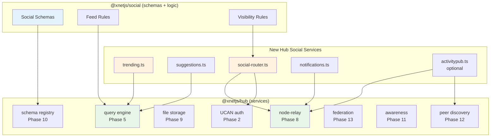
