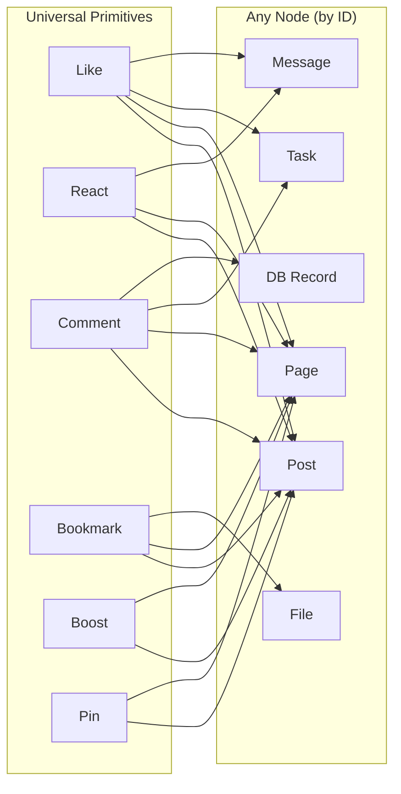

# Universal Social Primitives

## Executive Summary

xNet's Node-based architecture enables a powerful pattern: **social verbs (Like, React, Comment, Bookmark, Boost, Pin) that work on any Node regardless of schema**. Instead of building "likes for posts" and "likes for pages" and "likes for chat messages" separately, we build a single Like primitive that targets any Node by ID. Write once, apply everywhere.

This is possible because:

1. Node IDs are globally unique (nanoid, 21 chars, schema-independent)
2. The NodeStore indexes nodes in a flat ID space (`store.get(id)` doesn't need a schema)
3. Social primitives only need to know _the target Node ID_ -- not what kind of Node it is



---

## 1. The Core Insight

In most apps, social interactions are tightly coupled to specific content types:

- Twitter: likes on tweets
- Notion: comments on pages
- Slack: reactions on messages
- GitHub: reactions on issues, PRs, comments

In xNet, since everything is a Node with a globally unique ID, we can decouple the social verb from the content type entirely. A Like doesn't need to know if it's liking a Post, a Page, or a Task -- it just knows a Node ID.

### Why This Isn't Over-Engineered

The concern with "universal" patterns is usually that they become too abstract. But social primitives are genuinely universal -- the semantics of "I endorse this thing" or "save this for later" don't change based on what the thing is. The UI renders differently (heart vs. thumbs-up vs. star), but the data primitive is identical.

**Prior art that validates this pattern:**

- GitHub: Same reaction system on Issues, PRs, Discussions, Comments
- Slack: Same emoji reactions on messages, files, threads, canvas blocks
- GitHub Discussions: Same reactions on messages in any channel type
- Google Workspace: Same comments on Docs, Sheets, Slides, Drive files

---

## 2. Required Schema System Change

### 2.1 Making `relation()` Schema-Agnostic

Currently in `packages/data/src/schema/properties/relation.ts`, the `target` field is required:

```typescript
interface RelationOptions {
  target: SchemaIRI // Required -- locks relation to a specific schema
  multiple?: boolean
  required?: boolean
}
```

**Proposed change**: Make `target` optional. When omitted, the relation can reference any Node:

```typescript
interface RelationOptions {
  target?: SchemaIRI // Optional -- when omitted, targets any Node
  multiple?: boolean
  required?: boolean
}
```

This is safe because:

- The `target` is **never enforced at runtime** -- the validate function only checks that the value is a non-empty string
- The `target` is only used as metadata for UI hints (e.g., showing a node picker filtered to a specific schema)
- Existing schemas with `target` set continue to work unchanged

### 2.2 The `targetSchema` Optimization Field

While the relation itself is schema-agnostic, we add an optional `targetSchema` text field to each universal primitive. This serves as a **query optimization hint** -- it lets the Hub index likes-per-schema and enables the UI to render context-appropriate icons without fetching the target Node.

```typescript
properties: {
  target: relation({ required: true }),     // The Node ID (any schema)
  targetSchema: text(),                     // e.g., 'xnet://xnet.dev/Post' (optimization only)
}
```

---

## 3. Universal Primitive Schemas

### 3.1 Like

The simplest primitive. "I endorse this Node."

```typescript
const Like = defineSchema({
  name: 'Like',
  namespace: 'xnet://xnet.dev/',
  properties: {
    target: relation({ required: true }), // Any Node ID
    targetSchema: text() // Schema hint for queries/UI
  }
})
// IRI: xnet://xnet.dev/Like
// Deduplicated by: (createdBy DID, target NodeId) -- one like per user per node
```

**Conflict resolution**: If a user likes the same Node twice (e.g., from two devices before sync), the NodeStore deduplicates by `(createdBy, target)`. The second like is a no-op.

### 3.2 React (Emoji Reactions)

Like, but with a specific emoji. Multiple reactions per user per Node are allowed.

```typescript
const React = defineSchema({
  name: 'React',
  namespace: 'xnet://xnet.dev/',
  properties: {
    target: relation({ required: true }),
    targetSchema: text(),
    emoji: text({ required: true, maxLength: 10 }) // e.g., '👍', '🎉', '❤️'
  }
})
// IRI: xnet://xnet.dev/React
// Deduplicated by: (createdBy DID, target NodeId, emoji) -- one of each emoji per user
```

### 3.3 Bookmark

"Save this Node for later." Private to the user (not broadcast to others).

```typescript
const Bookmark = defineSchema({
  name: 'Bookmark',
  namespace: 'xnet://xnet.dev/',
  properties: {
    target: relation({ required: true }),
    targetSchema: text(),
    collection: text(), // Optional grouping: "read-later", "favorites", etc.
    note: text({ maxLength: 500 }) // Optional private note
  }
})
// IRI: xnet://xnet.dev/Bookmark
// Visibility: private (only synced to user's own devices, never broadcast)
```

### 3.4 Comment

"Attach a text response to this Node." Creates threaded discussions on anything.

```typescript
const Comment = defineSchema({
  name: 'Comment',
  namespace: 'xnet://xnet.dev/',
  properties: {
    target: relation({ required: true }), // The Node being commented on
    targetSchema: text(),
    inReplyTo: relation(), // Parent comment (for threading)
    content: text({ required: true, maxLength: 2000 }),
    attachments: file({ multiple: true })
  }
})
// IRI: xnet://xnet.dev/Comment
// Threading: Comments can reply to other Comments (inReplyTo) for nested threads
```

### 3.5 Boost (Share)

"Share this Node to my timeline." Can optionally add commentary (quote-boost).

```typescript
const Boost = defineSchema({
  name: 'Boost',
  namespace: 'xnet://xnet.dev/',
  properties: {
    target: relation({ required: true }), // Any Node -- share anything
    targetSchema: text(),
    comment: text({ maxLength: 500 }) // Optional quote text
  }
})
// IRI: xnet://xnet.dev/Boost
```

### 3.6 Pin

"Feature this Node on my profile." A curated collection of highlighted Nodes.

```typescript
const Pin = defineSchema({
  name: 'Pin',
  namespace: 'xnet://xnet.dev/',
  properties: {
    target: relation({ required: true }),
    targetSchema: text(),
    order: number() // Display order on profile
  }
})
// IRI: xnet://xnet.dev/Pin
```

### 3.7 Flag (Report)

"Report this Node for moderation." Sent to the Hub operator.

```typescript
const Flag = defineSchema({
  name: 'Flag',
  namespace: 'xnet://xnet.dev/',
  properties: {
    target: relation({ required: true }), // The Node being reported
    targetSchema: text(),
    reason: select({
      options: ['spam', 'abuse', 'harassment', 'illegal', 'other'],
      required: true
    }),
    description: text({ maxLength: 1000 })
  }
})
// IRI: xnet://xnet.dev/Flag
```

---

## 4. Universal React Hooks

The power of this pattern is in the hooks -- write once, use everywhere:

```typescript
// --- Universal hooks (work on ANY Node) ---

function useLike(nodeId: NodeId) {
  // Returns: { like, unlike, isLiked, count, likedBy }
  // Queries: all Like nodes where target == nodeId
  // Creates: Like node with target = nodeId, targetSchema = resolved from store
}

function useReact(nodeId: NodeId) {
  // Returns: { react, unreact, reactions: Map<emoji, { count, reactedByMe }> }
  // Queries: all React nodes where target == nodeId, grouped by emoji
}

function useBookmark(nodeId: NodeId) {
  // Returns: { bookmark, unbookmark, isBookmarked }
  // Private: only syncs to user's own devices
}

function useComments(nodeId: NodeId) {
  // Returns: { comments, addComment, replyTo, count }
  // Queries: all Comment nodes where target == nodeId
  // Supports: nested threading via inReplyTo
}

function useBoost(nodeId: NodeId) {
  // Returns: { boost, unboost, isBoosted, count }
  // Creates: Boost node that appears in user's timeline
}

function usePin(nodeId: NodeId) {
  // Returns: { pin, unpin, isPinned }
  // Creates: Pin node shown on user's profile
}

function useFlag(nodeId: NodeId) {
  // Returns: { flag }
  // Creates: Flag node sent to Hub operator
}
```

### Usage Examples

```tsx
// Like a timeline post
function PostCard({ post }) {
  const { isLiked, like, unlike, count } = useLike(post.id)
  return <button onClick={isLiked ? unlike : like}>❤️ {count}</button>
}

// Like a wiki page (same hook!)
function PageHeader({ page }) {
  const { isLiked, like, unlike, count } = useLike(page.id)
  return <button onClick={isLiked ? unlike : like}>⭐ {count}</button>
}

// React to a chat message (same hook!)
function ChatMessage({ message }) {
  const { reactions, react } = useReact(message.id)
  return <EmojiPicker onSelect={(emoji) => react(emoji)} />
}

// Comments on a database record
function RecordDetail({ record }) {
  const { comments, addComment } = useComments(record.id)
  return <CommentThread comments={comments} onAdd={addComment} />
}

// Bookmark a file
function FileCard({ file }) {
  const { isBookmarked, bookmark } = useBookmark(file.id)
  return <button onClick={bookmark}>🔖</button>
}
```

---

## 5. Query Patterns

### 5.1 "Get all likes for this Node"

```typescript
// Client-side (local query)
const likes = await store.query({
  schemaId: 'xnet://xnet.dev/Like',
  where: { target: nodeId }
})
const count = likes.length
const isLikedByMe = likes.some((l) => l.createdBy === myDID)

// Hub-side (SQLite)
const likes = db
  .prepare(
    `
  SELECT author_did, wall_time FROM node_changes
  WHERE schema_id = 'xnet://xnet.dev/Like'
    AND json_extract(payload, '$.properties.target') = ?
    AND NOT deleted
`
  )
  .all(nodeId)
```

### 5.2 "Get all nodes I've liked"

```typescript
// My likes (for a "Liked" page in the UI)
const myLikes = await store.query({
  schemaId: 'xnet://xnet.dev/Like',
  where: { createdBy: myDID },
  sort: { createdAt: 'desc' }
})
// Then resolve each target Node for display
const likedNodes = await Promise.all(myLikes.map((l) => store.get(l.properties.target)))
```

### 5.3 "Get reaction counts grouped by emoji"

```typescript
// Hub-side (efficient aggregation)
const reactions = db
  .prepare(
    `
  SELECT json_extract(payload, '$.properties.emoji') as emoji,
         COUNT(*) as count,
         SUM(CASE WHEN author_did = ? THEN 1 ELSE 0 END) as my_count
  FROM node_changes
  WHERE schema_id = 'xnet://xnet.dev/React'
    AND json_extract(payload, '$.properties.target') = ?
    AND NOT deleted
  GROUP BY emoji
`
  )
  .all(myDID, nodeId)
// Returns: [{ emoji: '👍', count: 5, my_count: 1 }, { emoji: '🎉', count: 2, my_count: 0 }]
```

### 5.4 "Get comment thread for a Node"

```typescript
// All top-level comments + nested replies
const comments = await store.query({
  schemaId: 'xnet://xnet.dev/Comment',
  where: { target: nodeId, inReplyTo: null }, // Top-level only
  sort: { createdAt: 'asc' }
})

// For each comment, fetch replies
for (const comment of comments) {
  comment.replies = await store.query({
    schemaId: 'xnet://xnet.dev/Comment',
    where: { inReplyTo: comment.id },
    sort: { createdAt: 'asc' }
  })
}
```

---

## 6. Hub Integration

### 6.1 Hub Indexing for Universal Primitives

The Hub's Query Engine (Phase 5) needs indexes optimized for universal primitive queries:

```sql
-- Index: "all likes for a given target Node" (most common query)
CREATE INDEX idx_likes_target ON node_changes(
  json_extract(payload, '$.properties.target')
) WHERE schema_id = 'xnet://xnet.dev/Like' AND NOT deleted;

-- Index: "all reactions for a given target Node"
CREATE INDEX idx_reacts_target ON node_changes(
  json_extract(payload, '$.properties.target'),
  json_extract(payload, '$.properties.emoji')
) WHERE schema_id = 'xnet://xnet.dev/React' AND NOT deleted;

-- Index: "all comments for a given target Node"
CREATE INDEX idx_comments_target ON node_changes(
  json_extract(payload, '$.properties.target'),
  json_extract(payload, '$.properties.inReplyTo')
) WHERE schema_id = 'xnet://xnet.dev/Comment' AND NOT deleted;

-- Index: "all likes by a given user" (for "My Likes" page)
CREATE INDEX idx_likes_author ON node_changes(author_did, wall_time DESC)
  WHERE schema_id = 'xnet://xnet.dev/Like' AND NOT deleted;

-- Index: "all bookmarks by a given user"
CREATE INDEX idx_bookmarks_author ON node_changes(author_did, wall_time DESC)
  WHERE schema_id = 'xnet://xnet.dev/Bookmark' AND NOT deleted;
```

### 6.2 Hub Aggregation Endpoint

The Hub exposes an efficient aggregation endpoint for social counts:

```typescript
// Hub route: GET /social/counts?targets=id1,id2,id3
// Returns engagement counts for multiple nodes in one request

interface SocialCounts {
  [nodeId: string]: {
    likes: number
    reactions: Record<string, number> // emoji -> count
    comments: number
    boosts: number
    myLike: boolean
    myReactions: string[]
    myBookmark: boolean
  }
}

// Hub implementation
app.get('/social/counts', async (c) => {
  const targets = c.req.query('targets').split(',')
  const myDID = c.get('authedDID') // From UCAN auth middleware

  const counts: SocialCounts = {}
  for (const nodeId of targets) {
    counts[nodeId] = {
      likes: db
        .prepare(
          `SELECT COUNT(*) as c FROM node_changes
        WHERE schema_id = 'xnet://xnet.dev/Like'
        AND json_extract(payload, '$.properties.target') = ?
        AND NOT deleted`
        )
        .get(nodeId).c,
      // ... similar for reactions, comments, boosts
      myLike:
        db
          .prepare(
            `SELECT 1 FROM node_changes
        WHERE schema_id = 'xnet://xnet.dev/Like'
        AND json_extract(payload, '$.properties.target') = ?
        AND author_did = ? AND NOT deleted`
          )
          .get(nodeId, myDID) != null
    }
  }
  return c.json(counts)
})
```

### 6.3 Sync Behavior by Primitive Type

Not all primitives sync the same way:

| Primitive | Sync Scope                                             | Rationale                     |
| --------- | ------------------------------------------------------ | ----------------------------- |
| Like      | Broadcast to Hub + target author                       | Author wants notification     |
| React     | Broadcast to Hub + target author                       | Same as Like                  |
| Comment   | Broadcast to Hub + target author + thread participants | Discussion context            |
| Boost     | Broadcast to Hub + all followers                       | Appears in booster's timeline |
| Bookmark  | **Private** -- only user's own devices                 | Personal collection           |
| Pin       | Broadcast to Hub (public profile data)                 | Visible on profile            |
| Flag      | **Direct to Hub operator only**                        | Moderation action             |

---

## 7. Deduplication Rules

Each primitive has a natural deduplication key to prevent duplicates:

| Primitive | Dedup Key                    | Behavior                            |
| --------- | ---------------------------- | ----------------------------------- |
| Like      | `(createdBy, target)`        | One like per user per Node          |
| React     | `(createdBy, target, emoji)` | One of each emoji per user per Node |
| Bookmark  | `(createdBy, target)`        | One bookmark per user per Node      |
| Comment   | None (unique per Node ID)    | Multiple comments allowed           |
| Boost     | `(createdBy, target)`        | One boost per user per Node         |
| Pin       | `(createdBy, target)`        | One pin per user per Node           |
| Flag      | `(createdBy, target)`        | One report per user per Node        |

Deduplication is enforced at the **application layer** (before creating the Node), not at the storage layer. The hook checks if a matching Node already exists before creating a new one:

```typescript
function useLike(nodeId: NodeId) {
  const existing = useQuery({
    schemaId: 'xnet://xnet.dev/Like',
    where: { target: nodeId, createdBy: myDID }
  })

  const like = async () => {
    if (existing.length > 0) return // Already liked, no-op
    await store.create(Like, { target: nodeId, targetSchema: resolveSchema(nodeId) })
  }

  const unlike = async () => {
    if (existing.length === 0) return
    await store.delete(existing[0].id)
  }

  return { like, unlike, isLiked: existing.length > 0 }
}
```

---

## 8. UI Rendering by Context

The same primitive renders differently based on where it appears:

| Context         | Like Icon    | React Style             | Comment Style          |
| --------------- | ------------ | ----------------------- | ---------------------- |
| Timeline Post   | ❤️ Heart     | Emoji bar below post    | Reply thread           |
| Wiki Page       | ⭐ Star      | Emoji picker in toolbar | Inline margin comments |
| Database Record | 👍 Thumbs up | Cell-level reactions    | Row-level discussion   |
| Chat Message    | ❤️ Heart     | Hover emoji picker      | Thread reply           |
| File            | ⭐ Star      | N/A                     | File comments          |

The hook returns raw data; the component decides how to render:

```tsx
// Generic LikeButton -- renders based on context prop
function LikeButton({ nodeId, variant = 'heart' }) {
  const { isLiked, like, unlike, count } = useLike(nodeId)
  const icons = { heart: '❤️', star: '⭐', thumbs: '👍' }
  return (
    <button onClick={isLiked ? unlike : like}>
      {icons[variant]} {count > 0 && count}
    </button>
  )
}
```

---

## 9. Required Changes to Implement

### 9.1 Schema System Change (Minimal)

In `packages/data/src/schema/properties/relation.ts`:

```diff
 interface RelationOptions {
-  target: SchemaIRI
+  target?: SchemaIRI
   multiple?: boolean
   required?: boolean
 }
```

One line. Fully backward-compatible (existing schemas with `target` set continue to work).

### 9.2 NodeStore Query Enhancement

In `packages/data/src/store/types.ts`, add property-level filtering:

```typescript
interface ListNodesOptions {
  schemaId?: SchemaIRI
  where?: Record<string, unknown> // NEW: property-level filter
  sort?: Record<string, 'asc' | 'desc'>
  limit?: number
  offset?: number
  includeDeleted?: boolean
}
```

Implementation filters `NodeState.properties` against the `where` clause. For the Hub, this translates to SQLite WHERE clauses with `json_extract`.

### 9.3 New Package: Universal Primitives

```
packages/
  social/
    src/
      primitives/
        like.ts           # Like schema + dedup logic
        react.ts          # React schema + emoji grouping
        comment.ts        # Comment schema + threading
        bookmark.ts       # Bookmark schema (private sync)
        boost.ts          # Boost schema + timeline injection
        pin.ts            # Pin schema + ordering
        flag.ts           # Flag schema + Hub delivery
        index.ts          # Re-exports
      hooks/
        useLike.ts        # Universal like hook
        useReact.ts       # Universal react hook
        useComments.ts    # Universal comment hook
        useBookmark.ts    # Universal bookmark hook
        useBoost.ts       # Universal boost hook
        usePin.ts         # Universal pin hook
        useFlag.ts        # Universal flag hook
        useSocialCounts.ts  # Batch counts from Hub
```

---

## 10. Interaction with Social Networking Features

These universal primitives integrate naturally with the Mastodon-style social layer (see [MASTODON_SOCIAL_NETWORKING.md](./MASTODON_SOCIAL_NETWORKING.md)):

| Social Feature          | Universal Primitive Used                                                            |
| ----------------------- | ----------------------------------------------------------------------------------- |
| Like a post             | `useLike(postId)`                                                                   |
| React to a post         | `useReact(postId)`                                                                  |
| Reply to a post         | Post schema's `inReplyTo` (not a universal primitive -- it's a Post-specific field) |
| Boost a post            | `useBoost(postId)`                                                                  |
| Bookmark a post         | `useBookmark(postId)`                                                               |
| Pin a post to profile   | `usePin(postId)`                                                                    |
| Report a post           | `useFlag(postId)`                                                                   |
| Comment on a page       | `useComments(pageId)`                                                               |
| Star a database         | `useLike(databaseId)`                                                               |
| React to a chat message | `useReact(messageId)`                                                               |

The social timeline feature (Post, Follow, Timeline) remains Post-specific -- you don't "follow a wiki page." But the engagement primitives are universal.

---

## 11. Scalability & Storage

### Per-Node Overhead

Each universal primitive creates a small Node (~150-300 bytes per action):

| Primitive | Size per Instance | Typical Volume                   |
| --------- | ----------------- | -------------------------------- |
| Like      | ~150 bytes        | 1 per user per liked Node        |
| React     | ~180 bytes        | 1-3 per user per reacted Node    |
| Comment   | ~500-2500 bytes   | Varies widely                    |
| Bookmark  | ~200 bytes        | 1 per user per bookmarked Node   |
| Boost     | ~200-700 bytes    | 1 per user per boosted Node      |
| Pin       | ~170 bytes        | Max ~20 per user (UI constraint) |

### Hub Storage Impact

For a Hub serving 1000 users, each with 500 likes, 100 bookmarks, 50 reacts:

- Likes: 1000 _ 500 _ 150B = **75 MB**
- Bookmarks: 1000 _ 100 _ 200B = **20 MB**
- Reacts: 1000 _ 50 _ 180B = **9 MB**
- **Total**: ~104 MB -- trivial for SQLite

### Client Storage Impact

Users only store their own primitives + primitives on their own content locally:

- Own likes: 500 \* 150B = 75 KB
- Likes on own posts (from others): ~2000 \* 150B = 300 KB
- **Total per user**: < 1 MB

---

## 12. Privacy Considerations

| Primitive | Visibility                   | Who Can See                        |
| --------- | ---------------------------- | ---------------------------------- |
| Like      | Public                       | Anyone who can see the target Node |
| React     | Public                       | Anyone who can see the target Node |
| Comment   | Inherits target visibility   | Same audience as target Node       |
| Bookmark  | **Private**                  | Only the bookmarking user          |
| Boost     | Public (appears in timeline) | Followers of the booster           |
| Pin       | Public (profile)             | Anyone viewing the profile         |
| Flag      | **Private to Hub operator**  | Only Hub moderation                |

Bookmarks are notable: they are **never synced to the Hub or other peers**. They only sync between the user's own devices (encrypted, via the Hub's backup service if needed).

---

## 13. Summary

Universal social primitives are a natural fit for xNet's Node-based architecture:

- **One implementation, many surfaces**: Write `useLike()` once, use it on posts, pages, tasks, messages, files
- **Minimal schema change**: Make `relation.target` optional (one line)
- **Hub-optimized**: SQLite indexes on `json_extract(payload, '$.properties.target')` handle all query patterns efficiently
- **Privacy-aware**: Bookmarks stay private, Flags go to moderators, everything else follows target visibility
- **Conflict-free**: Natural dedup keys prevent duplicates without complex CRDT logic
- **Composable**: Each primitive is independent -- apps can adopt any subset

This pattern turns xNet from "a document/database tool with social features bolted on" into "a unified data platform where social interaction is a first-class, cross-cutting capability."
