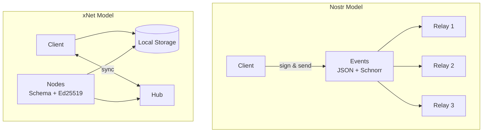
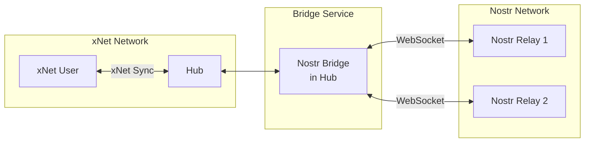
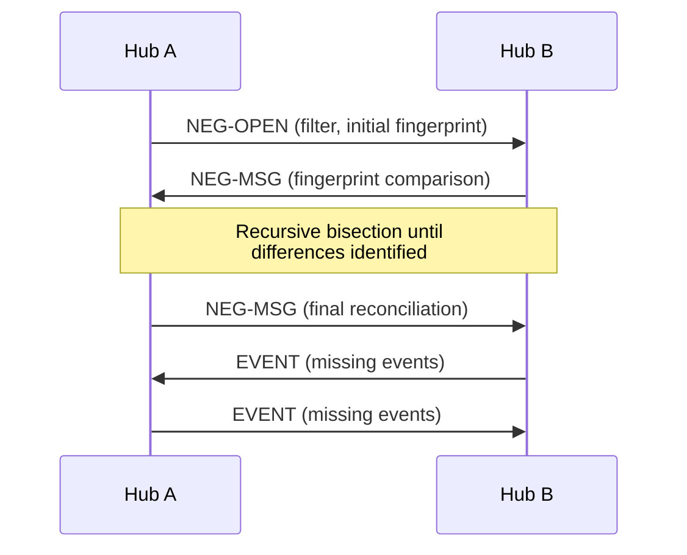
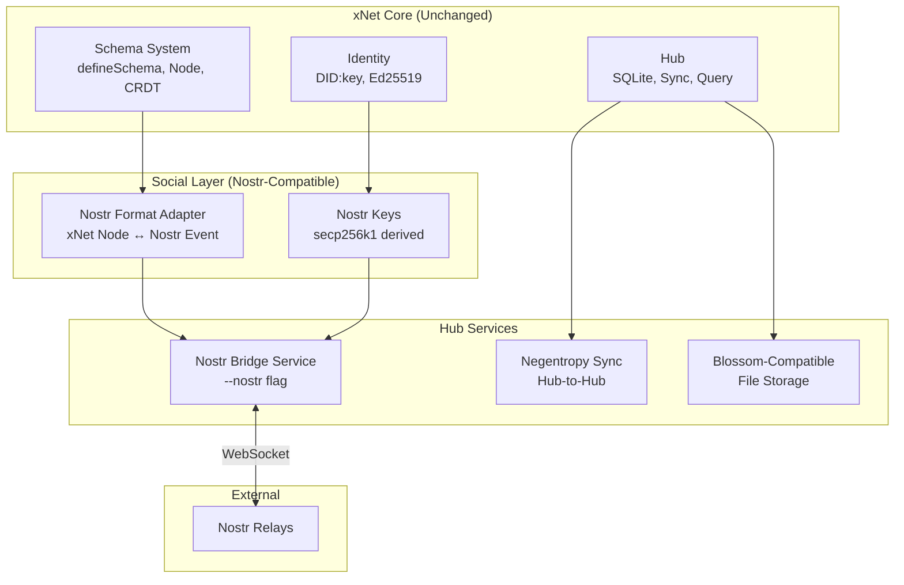

# Nostr Integration Exploration

## Executive Summary

This exploration examines how xNet could integrate with or adopt elements from [Nostr](https://github.com/nostr-protocol/nostr), a simple, open protocol for decentralized social networking. Nostr's design philosophy ("Notes and Other Stuff Transmitted by Relays") shares significant overlap with xNet's goals but makes fundamentally different tradeoffs.

**Key question**: Should xNet integrate with Nostr (bridge/interop), adopt Nostr components (use their primitives), or remain separate but learn from their design?

**TL;DR Recommendation**: **Selective adoption + optional bridge**. Adopt Nostr's simple event format for social features (it's battle-tested), add a Nostr bridge service to the Hub for interop, but keep xNet's richer data model (schemas, CRDTs) for documents and structured data where Nostr's simplicity becomes a limitation.

---

## 1. What is Nostr?

Nostr is a minimalist protocol with three core concepts:

1. **Events**: JSON objects with `id`, `pubkey`, `created_at`, `kind`, `tags`, `content`, `sig`
2. **Relays**: Dumb WebSocket servers that accept/store/serve events
3. **Clients**: Smart apps that sign events and query relays

```json
{
  "id": "sha256(serialized)",
  "pubkey": "32-byte hex public key (secp256k1)",
  "created_at": 1234567890,
  "kind": 1,
  "tags": [
    ["e", "event-id"],
    ["p", "pubkey"]
  ],
  "content": "Hello world",
  "sig": "64-byte schnorr signature"
}
```

That's it. Everything else (DMs, reactions, long-form content, marketplaces, etc.) is built on top via NIPs (Nostr Implementation Possibilities).

### Key NIPs Relevant to xNet

| NIP    | Name               | Relevance to xNet                                 |
| ------ | ------------------ | ------------------------------------------------- |
| NIP-01 | Basic Protocol     | Core event format, relay protocol                 |
| NIP-02 | Follow List        | Social graph (kind 3)                             |
| NIP-17 | Private DMs        | E2E encrypted messages                            |
| NIP-25 | Reactions          | Like/React (kind 7)                               |
| NIP-29 | Relay-based Groups | Similar to Hub-based communities                  |
| NIP-44 | Encrypted Payloads | ChaCha20 encryption (similar to xNet's XChaCha20) |
| NIP-54 | Wiki               | Collaborative documents                           |
| NIP-77 | Negentropy Syncing | Efficient set reconciliation (like delta sync)    |
| NIP-B7 | Blossom            | Content-addressed media storage                   |

---

## 2. Architectural Comparison



| Aspect              | Nostr                        | xNet                     |
| ------------------- | ---------------------------- | ------------------------ |
| Identity            | secp256k1 keypair            | Ed25519 DID:key          |
| Signatures          | Schnorr (BIP-340)            | Ed25519                  |
| Data format         | Flat JSON events             | Schema-defined Nodes     |
| Content addressing  | SHA256 of event              | BLAKE3 CID               |
| Storage             | Relay-side only              | Local-first + Hub        |
| Conflict resolution | Last-write-wins (kind-based) | CRDT (Yjs) + Lamport LWW |
| Rich text           | None (plain content)         | Yjs CRDT                 |
| Encryption          | NIP-44 (ChaCha20)            | XChaCha20-Poly1305       |
| Sync                | REQ/EVENT WebSocket          | Delta sync via Hub       |
| Schema              | Kind number (loose)          | Schema IRI (strict)      |

### Key Differences

1. **Simplicity vs. Richness**: Nostr is intentionally minimal. xNet has schemas, CRDTs, relations.
2. **Local-first**: xNet stores data locally first; Nostr relies on relays for storage.
3. **Crypto curves**: Nostr uses secp256k1 (Bitcoin-compatible); xNet uses Ed25519 (faster, smaller sigs).
4. **Structured data**: Nostr events are flat; xNet Nodes have typed properties and relations.

---

## 3. Integration Approaches

### Approach A: Nostr Bridge (Like ActivityPub Bridge)

Add a Nostr bridge service to the Hub, similar to the ActivityPub bridge in [MASTODON_SOCIAL_NETWORKING.md](./MASTODON_SOCIAL_NETWORKING.md).



**How it works:**

1. Hub maintains a secp256k1 keypair for each xNet user who opts in
2. xNet Post Nodes → Nostr kind:1 events (signed with derived secp256k1 key)
3. Nostr events from followed users → xNet Post Nodes
4. Reactions, follows, etc. bidirectionally translated

**Key challenge**: Key derivation. xNet uses Ed25519, Nostr uses secp256k1. Options:

- Derive secp256k1 from Ed25519 seed (deterministic mapping)
- User imports existing Nostr nsec
- Hub stores separate Nostr keypair per user

**Pros:**

- Access to Nostr's existing user base and relays
- Users can post once, reach both networks
- No changes to xNet core protocol

**Cons:**

- Translation overhead and semantic mismatches
- Two identities to manage (DID + npub)
- Some Nostr features (zaps, badges) don't have xNet equivalents

### Approach B: Adopt Nostr Event Format for Social

Replace xNet's Post/Like/Boost schemas with Nostr-compatible events for social features only.

```typescript
// Instead of xNet Post schema:
const NostrCompatiblePost = defineSchema({
  name: 'NostrEvent',
  namespace: 'xnet://xnet.dev/',
  properties: {
    // Store raw Nostr event fields
    nostrId: text(), // SHA256 event ID
    kind: number(), // Nostr kind
    content: text(),
    tags: text(), // JSON-serialized tags array
    sig: text(), // Schnorr signature (if from Nostr)
    // xNet additions
    xnetNodeId: text() // Our Node ID
  }
})
```

**How it works:**

1. Social events use Nostr's kind numbers and tag conventions
2. Events are dual-signed (Ed25519 for xNet, optionally Schnorr for Nostr)
3. Hub can relay events directly to Nostr relays without translation
4. Non-social data (documents, databases) remains pure xNet

**Pros:**

- Native interop with Nostr for social features
- Battle-tested event format
- Nostr clients could potentially connect to xNet Hub

**Cons:**

- Two signing schemes to maintain
- Nostr's flat format loses xNet's typed relations
- Increased complexity in the data layer

### Approach C: Learn from Nostr, Stay Separate

Cherry-pick good ideas from Nostr NIPs without protocol compatibility:

| Nostr Concept     | xNet Adoption                                                 |
| ----------------- | ------------------------------------------------------------- |
| NIP-77 Negentropy | Implement for Hub-to-Hub sync (efficient set reconciliation)  |
| NIP-B7 Blossom    | Hub's file storage is already CID-addressed (similar concept) |
| NIP-29 Groups     | Hub's relay-based model is conceptually similar               |
| Kind numbers      | Already have Schema IRIs (richer)                             |
| Tag system        | Could add `tags` property to Post schema for compatibility    |

**Pros:**

- Clean architecture, no protocol bridging
- Can adopt best ideas without constraints
- xNet identity model stays pure

**Cons:**

- No interop with Nostr network
- Miss out on Nostr's ecosystem and user base

---

## 4. Technical Deep Dive: Key Mapping

The biggest technical challenge is **identity mapping** between Ed25519 (xNet) and secp256k1 (Nostr).

### Option 1: Key Derivation (Recommended)

Derive both keys from a common master seed:

```typescript
// User's master seed (32 bytes from CSPRNG or mnemonic)
const masterSeed = crypto.getRandomValues(new Uint8Array(32))

// Derive xNet Ed25519 key
const xnetKey = hkdf(masterSeed, 'xnet-ed25519', 32)
const ed25519Keypair = ed25519.generateFromSeed(xnetKey)
const did = createDID(ed25519Keypair.publicKey) // did:key:z6Mk...

// Derive Nostr secp256k1 key (for bridge)
const nostrKey = hkdf(masterSeed, 'nostr-secp256k1', 32)
const secp256k1Keypair = secp256k1.generateFromSeed(nostrKey)
const npub = bech32Encode('npub', secp256k1Keypair.publicKey) // npub1...
```

This gives deterministic key mapping: same master seed always produces the same DID and npub.

### Option 2: Import Existing Nostr Key

For users who already have a Nostr identity:

```typescript
// User provides their nsec (Nostr secret key)
const nsec = 'nsec1...'
const nostrPrivateKey = bech32Decode(nsec)
const nostrPublicKey = secp256k1.getPublicKey(nostrPrivateKey)

// Store in encrypted KeyBundle alongside Ed25519 keys
const keyBundle: ExtendedKeyBundle = {
  signingKey: ed25519PrivateKey, // xNet identity
  encryptionKey: x25519PrivateKey, // xNet encryption
  nostrKey: nostrPrivateKey, // Nostr identity (optional)
  identity: { did, npub }
}
```

### Option 3: NIP-26 Delegation (Deprecated)

NIP-26 allowed key delegation but is now deprecated ("adds unnecessary burden for little gain"). Not recommended.

---

## 5. Feature-by-Feature Mapping

### 5.1 Social Posts

| xNet            | Nostr                     | Notes                 |
| --------------- | ------------------------- | --------------------- |
| Post Node       | kind:1 (Short Text Note)  | Direct mapping        |
| Post.content    | event.content             | Plain text            |
| Post.inReplyTo  | `e` tag with reply marker | Thread reference      |
| Post.mentions   | `p` tags                  | Pubkey references     |
| Post.tags       | `t` tags                  | Hashtags              |
| Post.visibility | No direct equivalent      | Nostr is public-first |

**Bridge translation:**

```typescript
function postToNostrEvent(post: Node, nostrPrivateKey: Uint8Array): NostrEvent {
  const tags: string[][] = []

  // Add reply reference
  if (post.properties.inReplyTo) {
    const replyId = xnetIdToNostrId(post.properties.inReplyTo)
    tags.push(['e', replyId, '', 'reply'])
  }

  // Add mentions
  for (const did of post.properties.mentions || []) {
    const npub = didToNpub(did)
    tags.push(['p', npub])
  }

  // Add hashtags
  for (const tag of post.properties.tags || []) {
    tags.push(['t', tag.toLowerCase()])
  }

  const event = {
    kind: 1,
    created_at: Math.floor(post.createdAt / 1000),
    content: post.properties.content,
    tags,
    pubkey: getNostrPubkey(nostrPrivateKey)
  }

  event.id = sha256(serializeEvent(event))
  event.sig = schnorrSign(event.id, nostrPrivateKey)

  return event
}
```

### 5.2 Reactions (Universal Primitives)

xNet's [Universal Social Primitives](./UNIVERSAL_SOCIAL_PRIMITIVES.md) map well to Nostr:

| xNet            | Nostr                     | Notes                                  |
| --------------- | ------------------------- | -------------------------------------- |
| Like (any Node) | kind:7 (Reaction)         | Nostr reactions also work on any event |
| React (emoji)   | kind:7 with emoji content | `content: '+'` or `content: '🎉'`      |
| Boost           | kind:6 (Repost)           | Quote-boost = kind:1 with `q` tag      |
| Comment         | kind:1111 (NIP-22)        | Universal comment system               |

Nostr's kind:7 reaction is remarkably similar to xNet's universal Like:

```json
// Nostr reaction (NIP-25)
{
  "kind": 7,
  "content": "+", // or emoji like "🔥"
  "tags": [
    ["e", "<event-id-being-reacted-to>"],
    ["p", "<pubkey-of-event-author>"]
  ]
}
```

### 5.3 Private Messages

| xNet                       | Nostr                       |
| -------------------------- | --------------------------- |
| DM (encrypted Post)        | kind:14 (NIP-17 Private DM) |
| XChaCha20-Poly1305         | ChaCha20 (NIP-44)           |
| E2E encrypted in NodeStore | Gift-wrapped events         |

NIP-44's encryption is similar but not identical to xNet's:

| Aspect       | xNet               | Nostr NIP-44           |
| ------------ | ------------------ | ---------------------- |
| Cipher       | XChaCha20-Poly1305 | ChaCha20 + HMAC-SHA256 |
| Key exchange | X25519 ECDH        | secp256k1 ECDH         |
| Nonce        | 24 bytes (XChaCha) | 32 bytes               |
| MAC          | Poly1305 (in AEAD) | HMAC-SHA256            |

**Bridge challenge**: Converting between encryption schemes requires re-encryption at the bridge. The bridge would need access to decrypted content temporarily, which is a security concern.

**Recommendation**: Don't bridge DMs. Users who want private cross-network communication should use one network or the other, not both.

### 5.4 Groups

xNet's Hub-based communities are conceptually similar to NIP-29 Relay-based Groups:

| xNet                | Nostr NIP-29          |
| ------------------- | --------------------- |
| Hub                 | Relay                 |
| Hub-enforced access | Relay-enforced access |
| UCAN capabilities   | `h` tag + relay rules |
| Admin roles         | `kind:39003` roles    |

The Hub could expose NIP-29-compatible endpoints, allowing Nostr clients to join xNet communities.

### 5.5 Long-form Content

| xNet                  | Nostr                              |
| --------------------- | ---------------------------------- |
| Page (Yjs CRDT)       | kind:30023 (NIP-23 Long-form)      |
| Collaborative editing | No equivalent (Nostr is immutable) |
| Structured properties | Freeform markdown                  |

**Key difference**: xNet Pages are collaborative CRDTs; Nostr articles are immutable events (replaceable, but not collaboratively editable). This is a fundamental incompatibility -- Nostr cannot represent real-time collaborative editing.

### 5.6 File Storage

xNet's Hub File Storage and Nostr's Blossom (NIP-B7) are strikingly similar:

| xNet Hub                     | Nostr Blossom                |
| ---------------------------- | ---------------------------- |
| `PUT /files/:cid`            | `PUT /<sha256>`              |
| BLAKE3 hash                  | SHA256 hash                  |
| kind:10063 server list       | kind:10063 server list       |
| Immutable, content-addressed | Immutable, content-addressed |

**Opportunity**: Make Hub's file storage Blossom-compatible. Same endpoints, same addressing, but verify BLAKE3 in addition to SHA256.

---

## 6. Sync Protocol Comparison

### xNet Delta Sync (Current)

- Client tracks Lamport timestamp
- `getChangesSince(lamport)` returns only new changes
- Works well for small sets of changes

### Nostr Negentropy (NIP-77)

- Range-based set reconciliation
- Efficiently syncs large sets with minimal bandwidth
- Fingerprints of ranges, recursive bisection

**Recommendation**: Adopt Negentropy for Hub-to-Hub federation. It's more efficient than naive delta sync when hubs have diverged significantly.



---

## 7. Integration Architecture (Recommended)

Based on the analysis, here's the recommended integration approach:



### What Changes

1. **Identity package**: Add optional secp256k1 key derivation alongside Ed25519
2. **Social package**: Add Nostr event translation layer
3. **Hub**: Add `--nostr` flag to enable bridge service
4. **Hub**: Implement Negentropy (NIP-77) for efficient federation
5. **Hub**: Make file storage Blossom-compatible

### What Stays the Same

1. **Schema system**: xNet schemas remain the source of truth
2. **CRDT layer**: Yjs for collaborative documents (no Nostr equivalent)
3. **Local-first**: Data lives on device first, Hub caches
4. **DID identity**: Primary identity remains DID:key

---

## 8. Implementation Plan

### Phase 1: Key Infrastructure (1 week)

1. Add `@xnet/nostr` package with:
   - secp256k1 key generation/derivation
   - Schnorr signing (BIP-340)
   - bech32 encoding (npub, nsec, note)
2. Extend `KeyBundle` to optionally include Nostr key

### Phase 2: Event Translation (1 week)

1. Implement bidirectional translation:
   - Post Node → kind:1 event
   - Like Node → kind:7 event
   - Boost Node → kind:6 event
2. Add Nostr event validation (signature verification)

### Phase 3: Hub Bridge Service (2 weeks)

1. Add `NostrBridgeService` to Hub
2. WebSocket connections to configurable Nostr relays
3. Event publishing (xNet → Nostr)
4. Event subscription (Nostr → xNet for followed users)
5. Configuration: `--nostr --nostr-relays wss://relay.damus.io,wss://nos.lol`

### Phase 4: Negentropy Sync (2 weeks)

1. Implement NIP-77 Negentropy protocol
2. Use for Hub-to-Hub federation (replace naive delta sync)
3. Optional: expose as standard Nostr relay interface

### Phase 5: Blossom Compatibility (1 week)

1. Add SHA256 verification alongside BLAKE3 for file uploads
2. Implement Blossom BUD-01/02/03 endpoints
3. Users can use xNet Hub as a Blossom server

---

## 9. Risks and Mitigations

| Risk                         | Mitigation                                         |
| ---------------------------- | -------------------------------------------------- |
| Two identities confuse users | Clear UI showing "xNet identity" vs "Nostr bridge" |
| DM privacy at bridge         | Don't bridge DMs; keep them network-specific       |
| Nostr protocol changes       | Bridge is optional; core xNet unaffected           |
| Semantic mismatches          | Document clearly what does/doesn't translate       |
| secp256k1 adds dependency    | Optional, only loaded when Nostr features used     |

---

## 10. Comparison with ActivityPub Bridge

| Aspect      | ActivityPub Bridge    | Nostr Bridge             |
| ----------- | --------------------- | ------------------------ |
| Protocol    | HTTP REST + JSON-LD   | WebSocket + JSON         |
| Identity    | Actor URIs            | npub/nsec                |
| Signatures  | HTTP Signatures (RSA) | Schnorr (secp256k1)      |
| Discovery   | WebFinger             | Relay lists (kind:10002) |
| Server role | Authoritative         | Dumb relay               |
| Complexity  | High (many specs)     | Low (minimal spec)       |

The Nostr bridge is simpler to implement than ActivityPub because:

1. No HTTP Signatures (just sign the event)
2. No Actor/Inbox resolution (just connect to relays)
3. Simple event format (no JSON-LD)

---

## 11. Open Questions

1. **Key derivation standard**: Should we propose a standard for Ed25519 ↔ secp256k1 derivation from common seed?

2. **Relay operation**: Should xNet Hub also function as a Nostr relay (accepting kind:1 events from any Nostr client)?

3. **Zaps**: Nostr has Lightning payment integration (NIP-57). Should xNet support this? Would require Bitcoin/Lightning infrastructure.

4. **Which relays**: Should Hub connect to all public relays, or only a curated list? Who decides?

5. **Nostr-native users**: Can someone use xNet with _only_ a Nostr identity (no DID)? Or is xNet identity always primary?

---

## 12. Summary

| Integration Level                                  | Effort | Interop | Recommended                       |
| -------------------------------------------------- | ------ | ------- | --------------------------------- |
| **Full adoption** (replace xNet social with Nostr) | High   | Full    | No (loses xNet's richer features) |
| **Bridge service** (translate at Hub)              | Medium | Good    | **Yes**                           |
| **Negentropy adoption** (sync protocol only)       | Low    | None    | **Yes**                           |
| **Blossom compatibility** (file storage)           | Low    | Partial | **Yes**                           |
| **No integration**                                 | Zero   | None    | No (miss ecosystem opportunity)   |

**Final recommendation**: Implement a Nostr bridge as an optional Hub service, adopt Negentropy for efficient sync, and make file storage Blossom-compatible. This gives xNet users access to the Nostr ecosystem while preserving xNet's richer data model for documents, databases, and collaborative editing where Nostr's simplicity falls short.

---

## References

- [Nostr Protocol](https://github.com/nostr-protocol/nostr)
- [NIPs Repository](https://github.com/nostr-protocol/nips)
- [NIP-01: Basic Protocol](https://github.com/nostr-protocol/nips/blob/master/01.md)
- [NIP-44: Encrypted Payloads](https://github.com/nostr-protocol/nips/blob/master/44.md)
- [NIP-77: Negentropy Syncing](https://github.com/nostr-protocol/nips/blob/master/77.md)
- [NIP-B7: Blossom](https://github.com/nostr-protocol/nips/blob/master/B7.md)
- [Blossom Spec](https://github.com/hzrd149/blossom)
- [xNet Mastodon Social Networking](./MASTODON_SOCIAL_NETWORKING.md)
- [xNet Universal Social Primitives](./UNIVERSAL_SOCIAL_PRIMITIVES.md)
- [xNet Hub Plan](../planStep03_8HubPhase1VPS/README.md)
