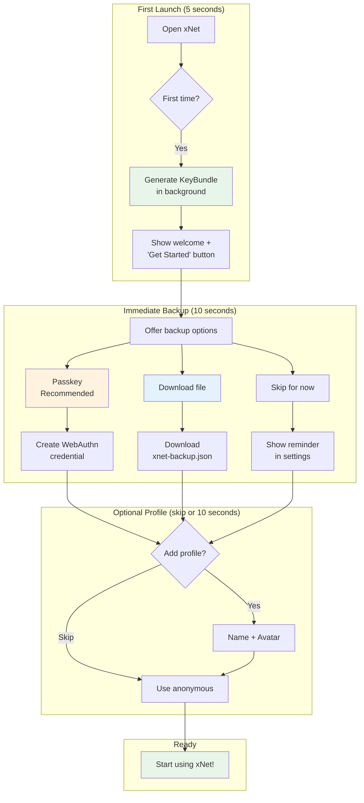
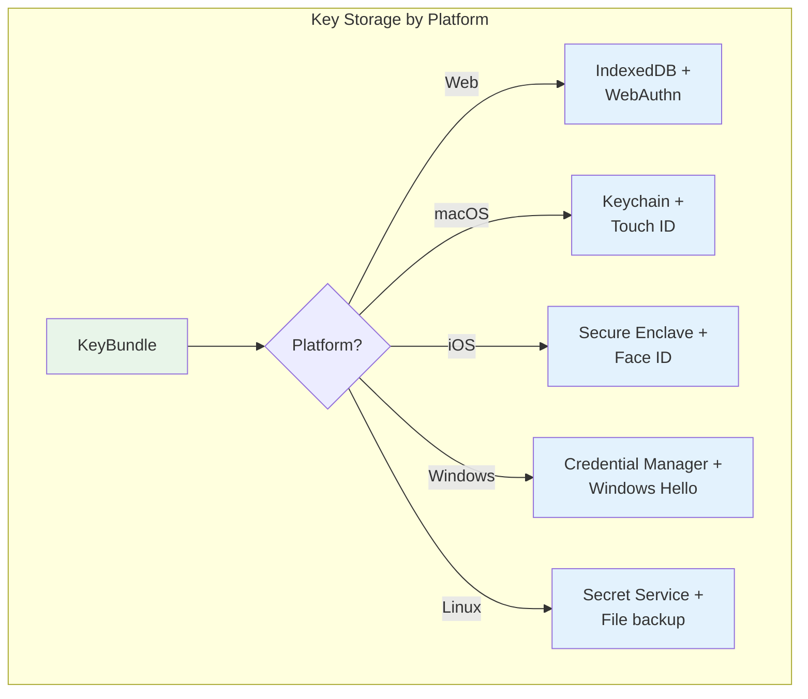
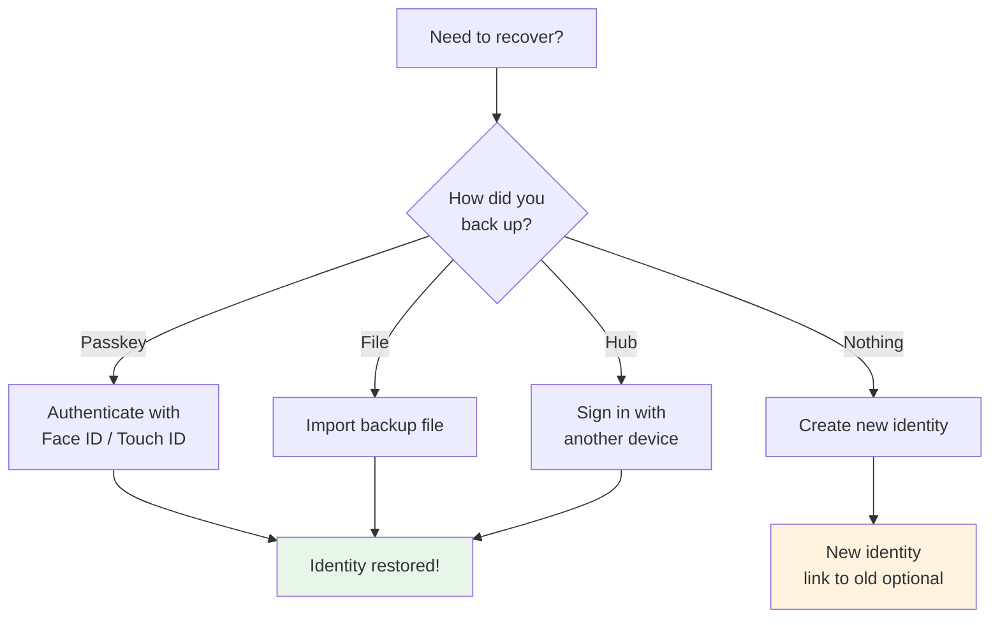
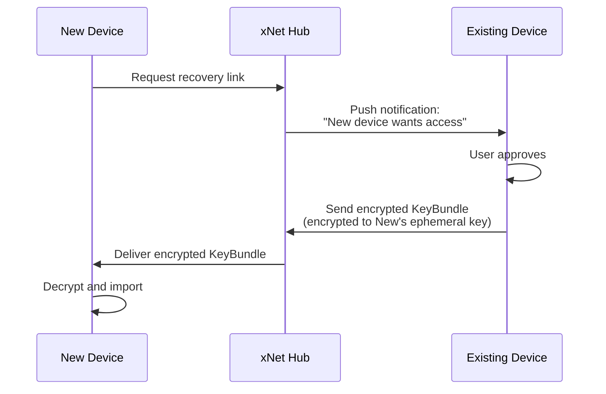
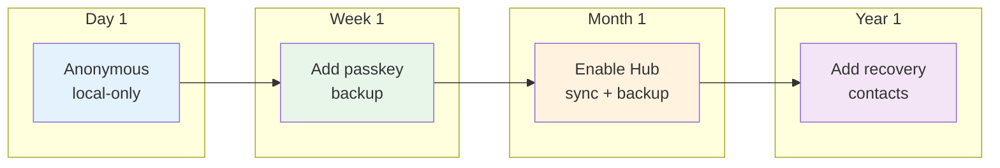

# Seamless P2P Onboarding

> How Nostr nailed onboarding and how xNet can do even better

## The Problem

Traditional P2P apps have terrible onboarding:

1. **Seed phrase anxiety** — "Write down these 24 words. If you lose them, you lose everything forever."
2. **Technical jargon** — "Generate your Ed25519 keypair to create a DID:key identity"
3. **No progressive disclosure** — Users must understand everything upfront
4. **Fear of permanence** — "This is your identity forever" feels scary
5. **Backup as homework** — "Remember to back up your keys!" (they won't)

Meanwhile, centralized apps: click "Sign up", enter email, done. Users trade sovereignty for convenience.

## Nostr's Breakthrough

Nostr.com demonstrated that cryptographic identity can feel _easier_ than traditional signup:


**What makes it work:**

| Aspect            | Traditional Signup          | Nostr.com                      |
| ----------------- | --------------------------- | ------------------------------ |
| Required info     | Email, password, often name | Nothing                        |
| Identity creation | Server generates account    | Client generates keys          |
| Backup            | Optional, often forgotten   | Offered immediately, one-click |
| Profile           | Required upfront            | Optional, add later            |
| Recovery          | Password reset email        | Backup file or extension       |
| Time to first use | 30-60 seconds               | 5-10 seconds                   |

**The key insight:** Nostr front-loads backup (download file) while back-loading everything else (profile is optional). Users have sovereignty from second one, but don't feel burdened by it.

## xNet's Current State

xNet has the cryptographic primitives but no elegant onboarding flow:

```typescript
// packages/identity/src/did.ts
export function generateIdentity(): { identity: Identity; privateKey: Uint8Array } {
  const { publicKey, privateKey } = generateSigningKeyPair()
  const did = createDID(publicKey)
  return {
    identity: { did, publicKey, created: Date.now() },
    privateKey
  }
}

// packages/identity/src/keys.ts
export function generateKeyBundle(): KeyBundle {
  const { publicKey: signingPublic, privateKey: signingKey } = generateSigningKeyPair()
  const { privateKey: encryptionKey } = generateKeyPair()
  return {
    signingKey,
    encryptionKey,
    identity: { did: createDID(signingPublic), publicKey: signingPublic, created: Date.now() }
  }
}

// packages/identity/src/passkey.ts
export class BrowserPasskeyStorage implements PasskeyStorage {
  async store(keyBundle: KeyBundle, credentialId: string): Promise<StoredKey>
  async retrieve(storedKey: StoredKey, credentialId: string): Promise<KeyBundle>
}
```

**What's missing:**

1. No user-facing onboarding flow
2. No automatic backup prompts
3. Passkey storage exists but isn't wired to onboarding
4. No key recovery flow

## Proposed xNet Onboarding Flow

### Flow Diagram



### Step-by-Step UX

#### Step 1: Instant Identity (0 seconds of user time)

```typescript
// On app launch, before any UI
const keyBundle = generateKeyBundle()
// Keys exist. User has an identity. They just don't know it yet.
```

The user sees a welcome screen. Behind the scenes, they already have a DID.

#### Step 2: Backup First (The Nostr Innovation)

Instead of "Create Account", the first action is "Secure Your Identity":

```
┌─────────────────────────────────────────┐
│                                         │
│   Welcome to xNet                       │
│                                         │
│   Your identity is ready.               │
│   Let's make sure you never lose it.    │
│                                         │
│   ┌─────────────────────────────────┐   │
│   │  Use Passkey (Recommended)      │   │
│   │  Secured by Face ID / Touch ID  │   │
│   └─────────────────────────────────┘   │
│                                         │
│   ┌─────────────────────────────────┐   │
│   │  Download Backup File           │   │
│   │  Save to a secure location      │   │
│   └─────────────────────────────────┘   │
│                                         │
│   ┌─────────────────────────────────┐   │
│   │  Skip for Now                   │   │
│   │  You can do this later          │   │
│   └─────────────────────────────────┘   │
│                                         │
└─────────────────────────────────────────┘
```

**Why backup first?**

- It's the only thing that _must_ happen for sovereignty
- Users are most engaged during onboarding
- Sets expectation that this is _their_ data to protect

#### Step 3: Optional Profile

```
┌─────────────────────────────────────────┐
│                                         │
│   How should others see you?            │
│                                         │
│   ┌───────┐                             │
│   │       │  Add a photo (optional)     │
│   │  +    │                             │
│   └───────┘                             │
│                                         │
│   Display name (optional)               │
│   ┌─────────────────────────────────┐   │
│   │                                 │   │
│   └─────────────────────────────────┘   │
│                                         │
│   ┌─────────────────────────────────┐   │
│   │  Continue                       │   │
│   └─────────────────────────────────┘   │
│                                         │
│   Skip — stay anonymous                 │
│                                         │
└─────────────────────────────────────────┘
```

**Key points:**

- Everything optional
- "Stay anonymous" is a valid choice, not a failure
- Can add/change profile anytime later

#### Step 4: Done

User lands in the app. Total time: 10-20 seconds. Zero required information provided.

## Technical Implementation

### Backup File Format

```typescript
interface XNetBackup {
  version: 1
  created: string // ISO timestamp
  identity: {
    did: string // did:key:z...
  }
  keys: {
    // Encrypted with user-provided password (optional) or plaintext
    signingKey: string // base64
    encryptionKey: string // base64
  }
  // Optional metadata
  profile?: {
    name?: string
    avatar?: string // CID
  }
  // Encrypted with keys above
  hub?: {
    url: string
    backupEnabled: boolean
  }
}
```

**Security consideration:** Backup file can be:

1. **Plaintext** — User downloads, stores securely (like Nostr)
2. **Password-protected** — Optional encryption layer
3. **Passkey-protected** — WebAuthn PRF extension derives key

### Passkey Integration (WebAuthn)

```typescript
// Create passkey during onboarding
async function createPasskeyBackup(keyBundle: KeyBundle): Promise<void> {
  // 1. Create WebAuthn credential
  const credential = await navigator.credentials.create({
    publicKey: {
      challenge: crypto.getRandomValues(new Uint8Array(32)),
      rp: { name: 'xNet', id: window.location.hostname },
      user: {
        id: new TextEncoder().encode(keyBundle.identity.did),
        name: keyBundle.identity.did.slice(0, 20) + '...',
        displayName: 'xNet Identity'
      },
      pubKeyCredParams: [{ type: 'public-key', alg: -7 }], // ES256
      authenticatorSelection: {
        authenticatorAttachment: 'platform', // Face ID, Touch ID, Windows Hello
        residentKey: 'required',
        userVerification: 'required'
      },
      extensions: {
        prf: {} // PRF extension for key derivation (if supported)
      }
    }
  })

  // 2. Derive encryption key from PRF output (or fallback to stored key)
  const prfOutput = credential.getClientExtensionResults().prf
  const encryptionKey = prfOutput ? await deriveKeyFromPRF(prfOutput) : generateKey()

  // 3. Encrypt and store KeyBundle
  const encrypted = encrypt(serializeKeyBundle(keyBundle), encryptionKey)

  // 4. Store in IndexedDB
  await storeEncryptedBackup(credential.id, encrypted, encryptionKey)
}

// Recover identity with passkey
async function recoverWithPasskey(): Promise<KeyBundle> {
  const credential = await navigator.credentials.get({
    publicKey: {
      challenge: crypto.getRandomValues(new Uint8Array(32)),
      rpId: window.location.hostname,
      userVerification: 'required',
      extensions: { prf: { eval: { first: new TextEncoder().encode('xnet-recovery') } } }
    }
  })

  // Retrieve and decrypt using PRF-derived key or stored key
  return await retrieveEncryptedBackup(credential.id)
}
```

### Hub Cloud Backup (Optional)

For users who want extra safety without managing files:

```typescript
// packages/identity/src/hub-backup.ts
async function enableHubBackup(keyBundle: KeyBundle, hubUrl: string): Promise<void> {
  // 1. Create UCAN for backup capability
  const backupUcan = await createUCAN({
    issuer: keyBundle,
    audience: hubUrl,
    capabilities: [{ with: `backup:${keyBundle.identity.did}`, can: 'backup/*' }]
  })

  // 2. Encrypt KeyBundle with user's own encryption key
  const encrypted = encrypt(serializeKeyBundle(keyBundle), keyBundle.encryptionKey)

  // 3. Upload to hub (hub sees only encrypted blob)
  await fetch(`${hubUrl}/backup/identity`, {
    method: 'PUT',
    headers: { Authorization: `Bearer ${backupUcan}` },
    body: encrypted
  })
}
```

**Zero-knowledge:** Hub stores encrypted blob. Only user can decrypt.

### Platform-Specific Storage



| Platform           | Primary Storage    | Biometric     | Fallback        |
| ------------------ | ------------------ | ------------- | --------------- |
| Web (PWA)          | IndexedDB          | WebAuthn      | Download file   |
| macOS (Electron)   | Keychain           | Touch ID      | Export file     |
| iOS (Expo)         | Keychain           | Face ID       | iCloud Keychain |
| Windows (Electron) | Credential Manager | Windows Hello | Export file     |
| Linux (Electron)   | Secret Service     | N/A           | Export file     |

## Recovery Flows

### Recovery Flow Diagram



### File Recovery

```typescript
async function recoverFromFile(file: File): Promise<KeyBundle> {
  const text = await file.text()
  const backup: XNetBackup = JSON.parse(text)

  if (backup.version !== 1) {
    throw new Error('Unsupported backup version')
  }

  // Reconstruct KeyBundle
  return {
    signingKey: base64ToBytes(backup.keys.signingKey),
    encryptionKey: base64ToBytes(backup.keys.encryptionKey),
    identity: {
      did: backup.identity.did,
      publicKey: parseDID(backup.identity.did),
      created: new Date(backup.created).getTime()
    }
  }
}
```

### Multi-Device Recovery

When user has multiple devices connected to Hub:



## Progressive Trust Model

Users shouldn't have to make all security decisions upfront:



| Stage   | Features              | Trust Level             |
| ------- | --------------------- | ----------------------- |
| Day 1   | Local-only, anonymous | Zero trust required     |
| Week 1  | Passkey backup        | Trust device biometrics |
| Month 1 | Hub sync              | Trust Hub operator      |
| Year 1  | Recovery contacts     | Trust selected people   |

**Key insight:** User can be productive immediately with zero trust decisions. Security features are offered when relevant, not demanded upfront.

## Comparison with Competitors

| Feature           | xNet (Proposed)  | Nostr           | Bluesky       | Traditional      |
| ----------------- | ---------------- | --------------- | ------------- | ---------------- |
| Time to first use | ~10s             | ~10s            | ~30s          | ~60s             |
| Required info     | None             | None            | Email + phone | Email + password |
| Key generation    | Client-side      | Client-side     | Server-side   | N/A              |
| Immediate backup  | Yes (prompted)   | Yes (download)  | N/A           | N/A              |
| Passkey support   | Yes              | Via NIP-07      | No            | Sometimes        |
| Anonymous option  | Yes              | Yes             | No            | No               |
| Cloud backup      | Optional (Hub)   | Via relay       | Implicit      | Implicit         |
| Multi-device      | Passkey + Hub    | Manual key copy | Server-synced | Server-synced    |
| Recovery          | Passkey/File/Hub | Key/Extension   | Email         | Email            |

**xNet advantages over Nostr:**

1. **Passkey-first** — Biometric backup is primary, not extension-dependent
2. **Hub backup** — Zero-knowledge cloud backup without managing relays
3. **Progressive disclosure** — Security features introduced over time

## Implementation Phases

### Phase 1: Core Onboarding Flow

```
packages/react/src/components/
  Onboarding/
    OnboardingProvider.tsx     # State machine for flow
    WelcomeStep.tsx            # "Your identity is ready"
    BackupStep.tsx             # Passkey / Download / Skip
    ProfileStep.tsx            # Optional name + avatar
    hooks/
      useOnboarding.ts         # Flow state + actions
```

**Deliverables:**

- [ ] `useOnboarding()` hook with state machine
- [ ] Backup file download (plaintext JSON)
- [ ] Skip option with settings reminder
- [ ] Profile creation (optional)

### Phase 2: Passkey Integration

```
packages/identity/src/
  passkey.ts                   # Existing, needs enhancement
  passkey-recovery.ts          # New: recovery flow
  passkey-credential.ts        # New: WebAuthn wrapper
```

**Deliverables:**

- [ ] WebAuthn credential creation during onboarding
- [ ] PRF extension for key derivation (with fallback)
- [ ] Passkey recovery flow
- [ ] Platform detection (Face ID vs Touch ID vs Windows Hello)

### Phase 3: Hub Cloud Backup

**Deliverables:**

- [ ] Encrypted identity backup to Hub
- [ ] Recovery via Hub (with existing device approval)
- [ ] Backup status in settings

### Phase 4: Multi-Device Sync

**Deliverables:**

- [ ] Device-to-device key transfer
- [ ] Push notification for approval
- [ ] Device management UI

## API Design

### React Hooks

```typescript
// Main onboarding hook
function useOnboarding(): {
  step: 'welcome' | 'backup' | 'profile' | 'complete'
  identity: Identity | null

  // Actions
  createBackupPasskey: () => Promise<void>
  downloadBackupFile: () => void
  skipBackup: () => void
  setProfile: (profile: { name?: string; avatar?: File }) => Promise<void>
  skipProfile: () => void

  // Recovery
  recoverFromPasskey: () => Promise<void>
  recoverFromFile: (file: File) => Promise<void>
}

// Identity management
function useIdentity(): {
  identity: Identity | null
  keyBundle: KeyBundle | null

  hasBackup: boolean
  backupMethods: ('passkey' | 'file' | 'hub')[]

  exportBackup: () => Promise<Blob>
  enableHubBackup: (hubUrl: string) => Promise<void>
}

// Recovery
function useRecovery(): {
  recover: (method: 'passkey' | 'file' | 'hub') => Promise<void>
  recoverFromFile: (file: File) => Promise<void>

  isRecovering: boolean
  error: Error | null
}
```

### Onboarding Component

```tsx
import { OnboardingProvider, OnboardingFlow } from '@xnet/react'

function App() {
  return (
    <XNetProvider>
      <OnboardingProvider>
        {({ isOnboarding }) => (isOnboarding ? <OnboardingFlow /> : <MainApp />)}
      </OnboardingProvider>
    </XNetProvider>
  )
}
```

## Open Questions

1. **Passkey credential naming** — What appears in the browser's passkey list?
   - Option A: "xNet Identity" (generic)
   - Option B: "xNet - did:key:z6Mk..." (technical)
   - Option C: "xNet - [display name]" (personal)

2. **Backup file encryption** — Should backup files be password-protected by default?
   - Pro: More secure if file is stolen
   - Con: Users forget passwords, defeats purpose
   - Recommendation: Plaintext by default, optional password

3. **Multiple identities** — Should xNet support multiple identities per device?
   - Nostr does this (identity switching)
   - Adds complexity to onboarding
   - Recommendation: Single identity initially, multi-identity later

4. **Recovery contact design** — How should social recovery work?
   - Shamir secret sharing across contacts?
   - Requires contacts to also use xNet
   - Phase 4+ feature

## References

- [NIP-01: Basic protocol flow description](https://github.com/nostr-protocol/nips/blob/master/01.md)
- [NIP-07: window.nostr capability](https://github.com/nostr-protocol/nips/blob/master/07.md)
- [WebAuthn PRF Extension](https://w3c.github.io/webauthn/#prf-extension)
- [packages/identity/src/did.ts](../../packages/identity/src/did.ts)
- [packages/identity/src/keys.ts](../../packages/identity/src/keys.ts)
- [packages/identity/src/passkey.ts](../../packages/identity/src/passkey.ts)
- [Hub Backup API](../planStep03_8HubPhase1VPS/05-backup-api.md)
