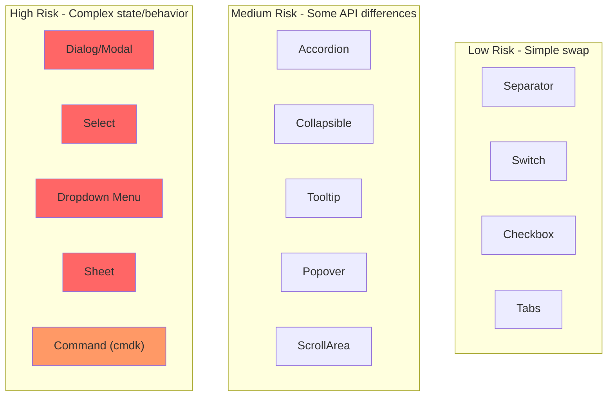
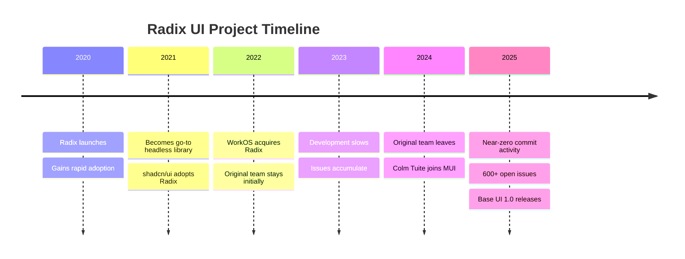
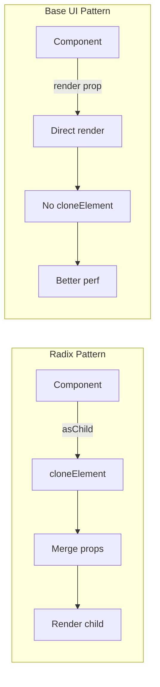
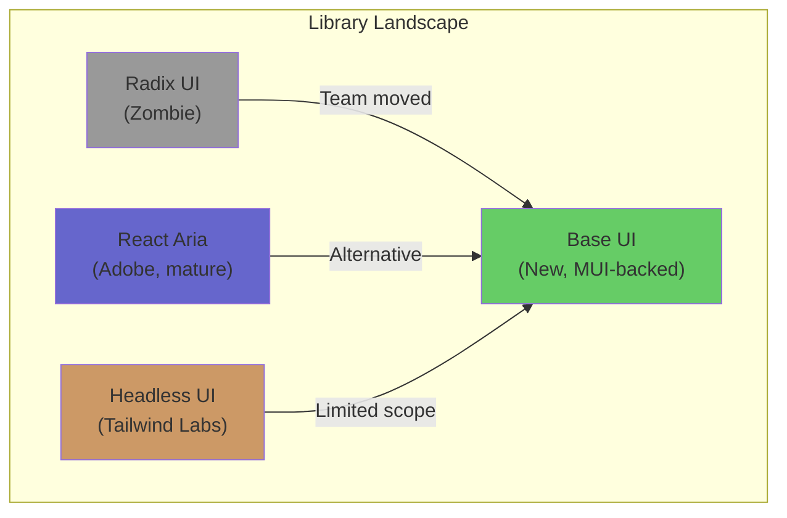
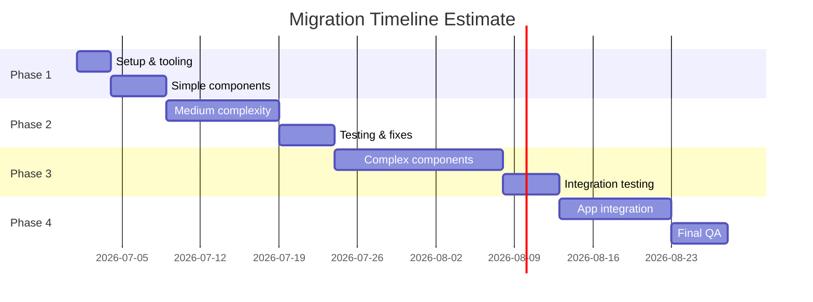
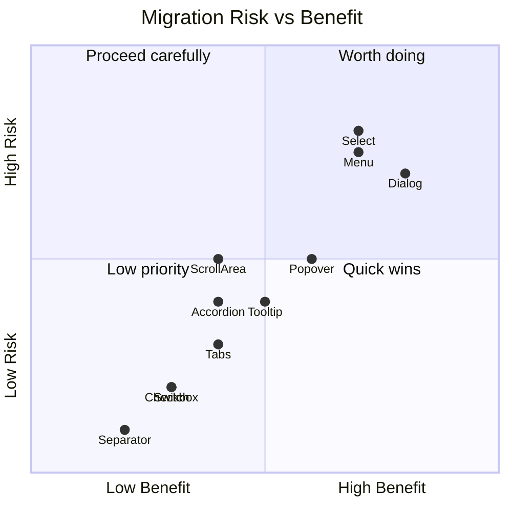
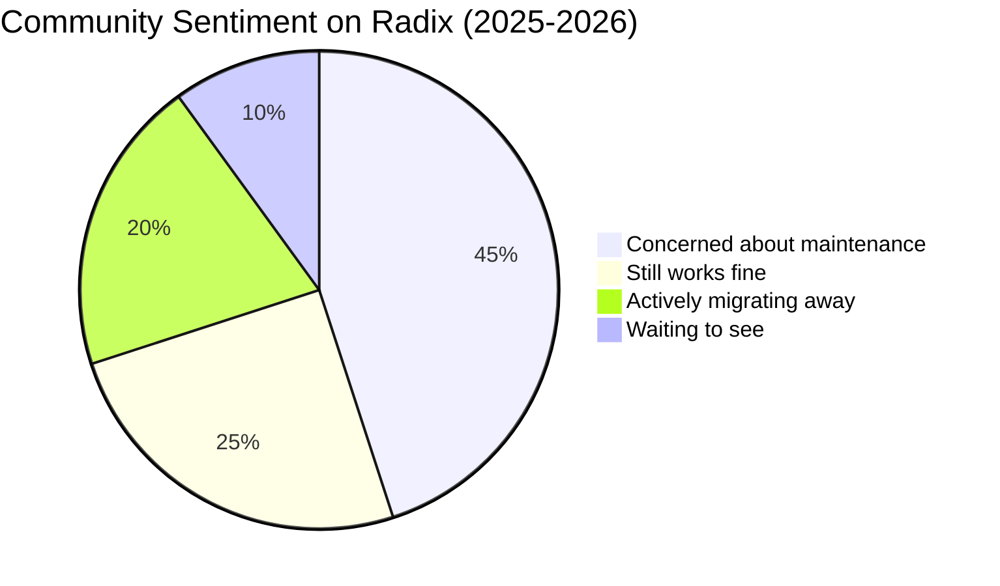
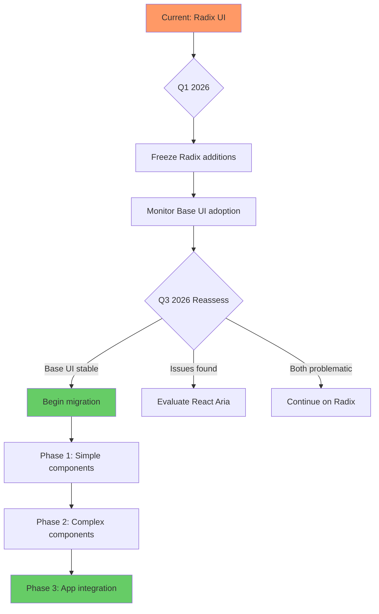

# Radix UI to Base UI Migration Exploration

> Should xNet migrate from Radix UI primitives to MUI's Base UI given Radix's apparent abandonment?

**Date**: January 2026  
**Status**: Exploration  
**Impact**: Medium (UI package, all apps)

---

## Executive Summary

Radix UI, our current headless component library, has effectively become a zombie project. The original team left after WorkOS acquired it, commit activity has nearly stopped, and 600+ issues remain unaddressed. MUI's Base UI reached 1.0 in December 2025 and is actively positioning itself as the successor. This exploration evaluates whether xNet should migrate.

**Recommendation**: **Wait 6 months, then reassess.** Base UI is promising but too new. Our current Radix usage works, and the migration cost outweighs immediate benefits. However, we should:

1. Avoid adding new Radix primitives
2. Monitor Base UI's stability and adoption
3. Plan migration path for Q3 2026

---

## Current State: xNet's Radix Usage

### Dependencies in `@xnet/ui`

```
@radix-ui/react-accordion      ^1.2.12
@radix-ui/react-checkbox       ^1.1.4
@radix-ui/react-collapsible    ^1.1.12
@radix-ui/react-dialog         ^1.1.6
@radix-ui/react-dropdown-menu  ^2.1.6
@radix-ui/react-popover        ^1.1.6
@radix-ui/react-scroll-area    ^1.2.10
@radix-ui/react-select         ^2.1.6
@radix-ui/react-separator      ^1.1.8
@radix-ui/react-slot           ^1.1.2
@radix-ui/react-switch         ^1.2.6
@radix-ui/react-tabs           ^1.1.13
@radix-ui/react-tooltip        ^1.1.8
```

### Components Using Radix (34 total)

| Category       | Components                                                                                                          |
| -------------- | ------------------------------------------------------------------------------------------------------------------- |
| **Primitives** | Accordion, Checkbox, Collapsible, Modal, Menu, Popover, ScrollArea, Select, Separator, Sheet, Switch, Tabs, Tooltip |
| **Composed**   | CodeBlock, DataTable, KeyValue, LogEntry, StatusDot, ThemeToggle, TreeView                                          |
| **Components** | ColorPicker, DatePicker, DIDAvatar, EmptyState, SearchInput, Skeleton, TagInput                                     |
| **Other**      | Button (uses Slot), IconButton, Input, Badge, Command (cmdk), ResizablePanel                                        |

### Migration Complexity Map



---

## The Case Against Radix: Why It's a Zombie

### Maintenance Reality



### GitHub Statistics Comparison

| Metric                | Radix UI         | Base UI (MUI) |
| --------------------- | ---------------- | ------------- |
| **Stars**             | 18,500+          | Growing       |
| **Open Issues**       | 626              | ~50           |
| **Open PRs**          | 129              | Active review |
| **Recent Commits**    | Near zero        | High activity |
| **Corporate Backing** | WorkOS (passive) | MUI (active)  |
| **Original Team**     | Left             | Hired by MUI  |

### Critical Quotes from Community

**MUI maintainer (romgrk):**

> "Base UI is a new unstyled component library that's meant to be a successor to Radix. The company that bought the project didn't really invest in it so the team working on it left, and there was a build up of tech debt over the years."

**Reddit user (sjltwo-v10):**

> "Radix isn't being updated anymore so it only made sense [for shadcn to add Base UI support]."

**Developer (alex-ebb-2000, 313 upvotes):**

> "Some core libraries [shadcn] builds on are unmaintained... Radix UI, that lots of shadcn components built on, also unmaintained, has bugs that not get fixed for years."

### Known Radix Issues Affecting xNet

| Issue                                        | Impact          | Status        |
| -------------------------------------------- | --------------- | ------------- |
| No keyboard-only focus-visible (#1803)       | A11y regression | Open 2+ years |
| Dialog scroll lock persists after navigation | UX bug          | Unresolved    |
| Tooltip in popover auto-opens (#2248)        | UX bug          | Unresolved    |
| Uses deprecated `cloneElement` via `asChild` | Tech debt       | Won't fix     |
| No combobox component                        | Missing feature | Won't add     |

---

## Base UI: The Contender

### What Is Base UI?

**Not to be confused with Uber's `baseui`** (which is a styled component library). MUI's Base UI is a headless primitive library designed as a direct Radix successor.

- **Package**: `@base-ui-components/react`
- **Version**: 1.0.0 (December 2025)
- **Backing**: MUI (profitable company, ~$10M ARR)
- **Key hire**: Colm Tuite (Radix co-creator)

### Architecture Comparison



### API Comparison: Dialog Example

**Radix UI:**

```tsx
import * as Dialog from '@radix-ui/react-dialog'

;<Dialog.Root>
  <Dialog.Trigger asChild>
    <Button>Open</Button>
  </Dialog.Trigger>
  <Dialog.Portal>
    <Dialog.Overlay className="overlay" />
    <Dialog.Content className="content">
      <Dialog.Title>Title</Dialog.Title>
      <Dialog.Description>Description</Dialog.Description>
      <Dialog.Close asChild>
        <Button>Close</Button>
      </Dialog.Close>
    </Dialog.Content>
  </Dialog.Portal>
</Dialog.Root>
```

**Base UI:**

```tsx
import * as Dialog from '@base-ui-components/react/dialog'

;<Dialog.Root>
  <Dialog.Trigger render={<Button />}>Open</Dialog.Trigger>
  <Dialog.Portal>
    <Dialog.Backdrop className="overlay" />
    <Dialog.Popup className="content">
      <Dialog.Title>Title</Dialog.Title>
      <Dialog.Description>Description</Dialog.Description>
      <Dialog.Close render={<Button />}>Close</Dialog.Close>
    </Dialog.Popup>
  </Dialog.Portal>
</Dialog.Root>
```

### Key Differences

| Aspect                | Radix UI                 | Base UI                             |
| --------------------- | ------------------------ | ----------------------------------- |
| **Composition**       | `asChild` + cloneElement | `render` prop                       |
| **Naming**            | Dialog.Content           | Dialog.Popup                        |
| **Naming**            | Dialog.Overlay           | Dialog.Backdrop                     |
| **Animation**         | Manual state tracking    | Built-in transition data attributes |
| **Detached triggers** | Not supported            | Supported                           |
| **Bundle**            | Per-component packages   | Single package                      |

---

## Alternative: React Aria Components

Before committing to Base UI, we should consider Adobe's React Aria:



### React Aria Pros

- **Most accessible**: Best-in-class ARIA implementation
- **Adobe backing**: Huge company, long-term commitment
- **Active development**: Regular releases, responsive maintainers
- **Comprehensive**: More components than Radix

### React Aria Cons

- **Heavier API**: More verbose, steeper learning curve
- **Mobile issues**: Reported click handling problems
- **Different philosophy**: Hooks-first vs component-first

### Community Sentiment on React Aria

**Pro (Wild_Boysenberry2916):**

> "I would highly recommend react-aria-components. Headless, customizable, best accessibility, very fast responses if you make a github issue."

**Con (sickcodebruh420):**

> "Don't go near React Aria Components. Outrageous issues with click handling on mobile."

---

## Migration Analysis

### Effort Estimation



**Total estimate**: ~8 weeks of focused work

### Component-by-Component Migration Map

| Radix Component | Base UI Equivalent | Migration Notes                        |
| --------------- | ------------------ | -------------------------------------- |
| `Dialog`        | `Dialog`           | Rename Content→Popup, Overlay→Backdrop |
| `Popover`       | `Popover`          | Similar API                            |
| `Tooltip`       | `Tooltip`          | Similar API                            |
| `Select`        | `Select`           | API differs significantly              |
| `Dropdown Menu` | `Menu`             | Different composition pattern          |
| `Accordion`     | `Accordion`        | Similar API                            |
| `Tabs`          | `Tabs`             | Similar API                            |
| `Checkbox`      | `Checkbox`         | Similar API                            |
| `Switch`        | `Switch`           | Similar API                            |
| `Scroll Area`   | `ScrollArea`       | Similar API                            |
| `Collapsible`   | `Collapsible`      | Similar API                            |
| `Separator`     | Native `<hr>`      | Can remove dependency                  |
| `Slot`          | `render` prop      | Different pattern                      |

### Risk Assessment



---

## User & Developer Sentiment Summary

### Sentiment Analysis



### Key Concerns Raised

1. **Abandonment fear**: "I am concerned that Radix was once hot, but quickly went off to the wayside. I would hate to migrate and BaseUI go in the same direction."

2. **MUI track record**: "Joy UI was also built by MUI, but then the attention shifted and it was put on hold. The fact that Base UI is made by the people at MUI is not a strong guarantee."

3. **Conflict of interest**: "There's a conflict of interest. MUI sells components. Why expand base ui when you get paid for advanced components?"

4. **Migration friction**: "I tried to migrate a pet project today. Unfortunately its still a bit buggy."

### Key Praise for Base UI

1. **Active development**: Much higher commit activity than Radix
2. **Technical improvements**: Better animation support, no deprecated APIs
3. **Team credibility**: Radix co-creator now working on it
4. **Corporate backing**: MUI is profitable and committed

---

## Recommendations

### Decision Matrix

| Option                      | Pros                            | Cons                         | Recommendation  |
| --------------------------- | ------------------------------- | ---------------------------- | --------------- |
| **Stay on Radix**           | No work required, stable enough | Tech debt, no fixes coming   | Short-term only |
| **Migrate to Base UI**      | Active development, similar API | Too new, potential bugs      | Wait 6 months   |
| **Migrate to React Aria**   | Best a11y, Adobe backing        | Different API, mobile issues | Consider for v2 |
| **Build custom primitives** | Full control                    | Massive effort               | Not practical   |

### Recommended Strategy



### Immediate Actions

1. **Document all Radix workarounds** we've implemented
2. **Create abstraction layer** around Radix primitives (makes future migration easier)
3. **Subscribe to Base UI releases** and track stability
4. **Prototype one component** on Base UI to assess API compatibility

### Q3 2026 Migration Criteria

Before migrating, Base UI should have:

- [ ] 6+ months of stable releases
- [ ] shadcn/ui full migration complete
- [ ] No critical open issues
- [ ] Clear documentation and migration guides
- [ ] Community adoption validation (npm downloads, GitHub activity)

---

## Appendix: Full Library Comparison

### Feature Matrix

| Feature               | Radix UI            | Base UI             | React Aria         | Headless UI         |
| --------------------- | ------------------- | ------------------- | ------------------ | ------------------- |
| **Maintainer**        | WorkOS (passive)    | MUI (active)        | Adobe (active)     | Tailwind (active)   |
| **Philosophy**        | Unstyled primitives | Unstyled primitives | Hooks + components | Unstyled primitives |
| **TypeScript**        | Native              | Native              | Native             | Native              |
| **A11y**              | Good                | Good                | Excellent          | Good                |
| **Component count**   | ~30                 | ~25                 | ~40                | ~10                 |
| **Animation support** | Basic               | Advanced            | Basic              | Tailwind-focused    |
| **React 19**          | Partial             | Full                | Full               | Full                |
| **SSR**               | Yes                 | Yes                 | Yes                | Yes                 |
| **Bundle size**       | Small               | Small               | Medium             | Small               |
| **API stability**     | Stable (frozen)     | Evolving            | Stable             | Stable              |

### Bundle Size Comparison (Dialog component)

| Library            | Size (minified) | Size (gzipped) |
| ------------------ | --------------- | -------------- |
| Radix Dialog       | ~15 KB          | ~5 KB          |
| Base UI Dialog     | ~12 KB          | ~4 KB          |
| React Aria Dialog  | ~20 KB          | ~7 KB          |
| Headless UI Dialog | ~10 KB          | ~3 KB          |

---

## References

1. [Base UI 1.0 Release Announcement](https://base-ui.com/blog/base-ui-1-0)
2. [Reddit: Base UI 1.0 Released](https://reddit.com/r/reactjs/comments/base-ui-1-0)
3. [Reddit: Did shadcn just add Base UI support?](https://reddit.com/r/reactjs/comments/shadcn-base-ui)
4. [Radix UI GitHub Issues](https://github.com/radix-ui/primitives/issues)
5. [MUI's Position on Base UI](https://mui.com/blog/base-ui)
6. [React Aria Documentation](https://react-spectrum.adobe.com/react-aria)
