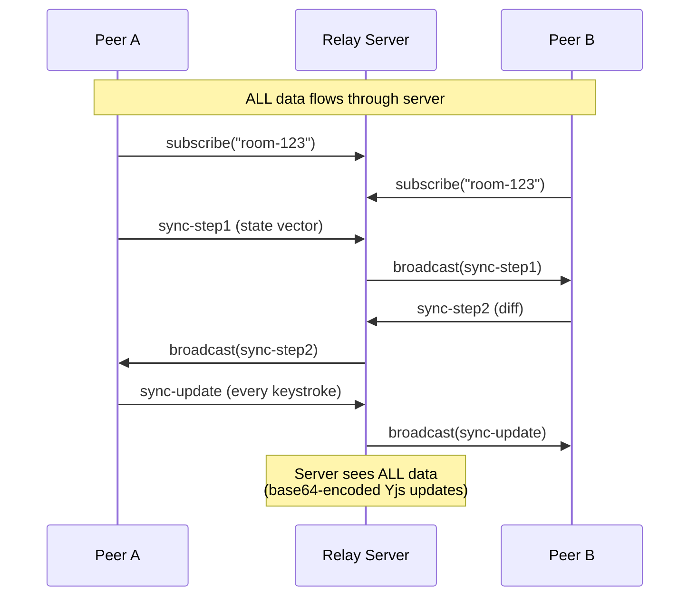
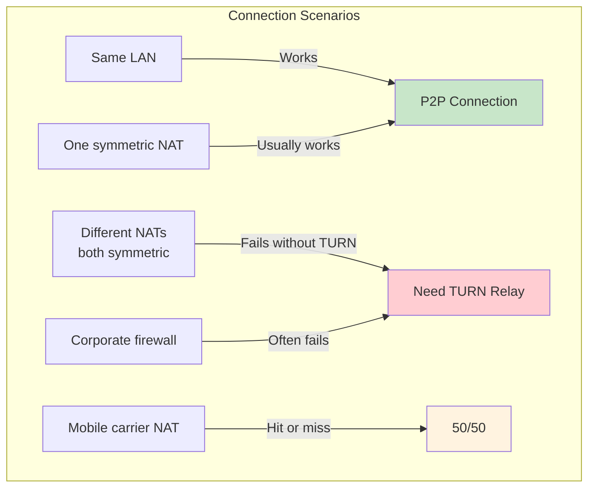
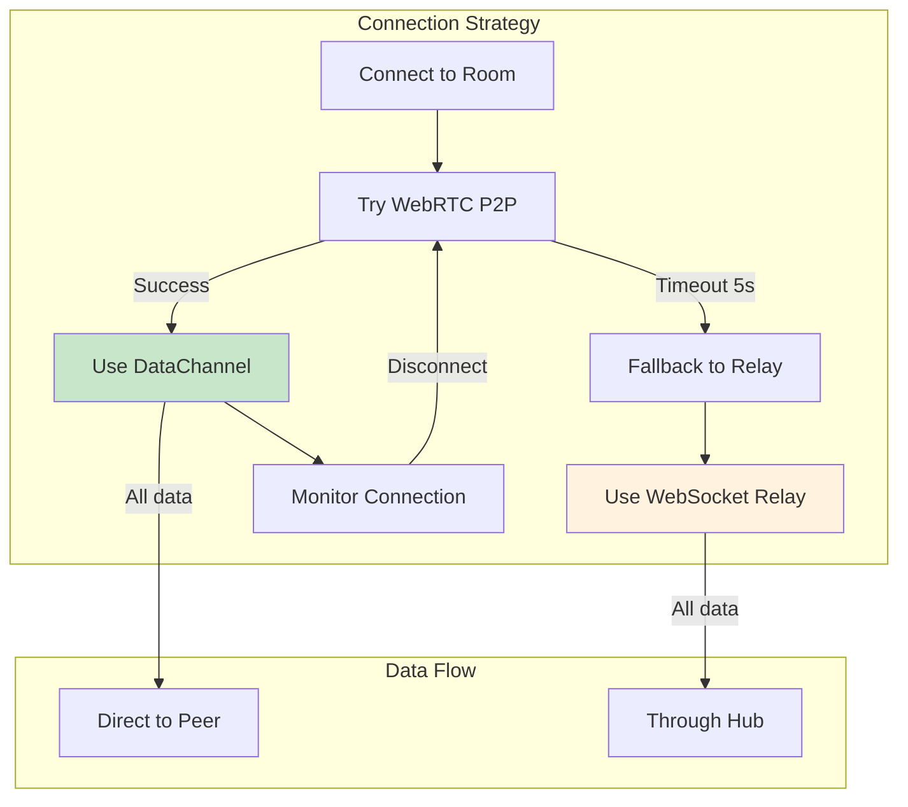

# Minimal Signaling-Only Hub for P2P WebRTC

> Can the hub just broker connections and let all data flow peer-to-peer?

## Context

The current xNet Hub plan ([planStep03_8HubPhase1VPS](../planStep03_8HubPhase1VPS/README.md)) envisions a full-featured server that:

1. Handles signaling (peer discovery)
2. Acts as a sync relay (persists Y.Doc state)
3. Stores encrypted backups
4. Runs server-side queries

This exploration asks: **What if we stripped it down to just signaling?** The minimal hub would only facilitate WebRTC connection establishment. Once peers connect, all data flows directly peer-to-peer—the hub sees nothing.

## Current Architecture: Relay vs P2P

xNet currently has **two sync paths**, and understanding which one is active is crucial:

### Path A: y-webrtc (True P2P)

```mermaid
sequenceDiagram
    participant A as Peer A
    participant Sig as Signaling Server
    participant B as Peer B

    Note over A,B: Phase 1: Discovery via Signaling
    A->>Sig: subscribe("room-123")
    B->>Sig: subscribe("room-123")
    A->>Sig: publish(announce)
    Sig->>B: broadcast(announce)

    Note over A,B: Phase 2: WebRTC Handshake via Signaling
    A->>Sig: publish(SDP offer)
    Sig->>B: forward(SDP offer)
    B->>Sig: publish(SDP answer)
    Sig->>A: forward(SDP answer)
    A->>Sig: publish(ICE candidate)
    Sig->>B: forward(ICE candidate)

    Note over A,B: Phase 3: Direct P2P (signaling no longer needed)
    A<-->B: WebRTC DataChannel
    A->>B: Yjs sync-step1/2
    A<-->B: Yjs updates (encrypted)

    Note over Sig: Signaling server sees:<br/>- Room subscriptions<br/>- SDP offers/answers<br/>- ICE candidates<br/>- NOTHING about actual data
```

**Code location:** `packages/network/src/providers/ywebrtc.ts`

```typescript
export function createYWebRTCProvider(
  doc: XDocument,
  roomName: string,
  options: YWebRTCOptions
): YWebRTCProvider {
  const provider = new WebrtcProvider(roomName, doc.ydoc, {
    signaling: options.signalingServers, // Only used for handshake
    password: options.password,
    maxConns: options.maxConns ?? 20
  })
  return { provider, destroy: () => provider.destroy() }
}
```

### Path B: WebSocketSyncProvider (Server Relay)



**Code location:** `packages/react/src/sync/WebSocketSyncProvider.ts`

```typescript
// This provider relays ALL data through the server
private _onDocUpdate = (update: Uint8Array, origin: unknown): void => {
  if (origin === this) return
  if (this.connected) {
    this._publish({
      type: 'sync-update',
      from: this.peerId,
      update: toBase64(update)  // <-- All data goes to server
    })
  }
}
```

## The Key Question

**Which path is xNet actually using today?**

Looking at the code:

1. `WebSocketSyncProvider` exists and works—it's used when you can't establish WebRTC
2. `y-webrtc` provider exists but has limitations (can't have two providers in same room in same process)
3. The Electron app runs a signaling server but clients use `WebSocketSyncProvider` for reliability

**Current default: Server relay (Path B)**

The y-webrtc P2P path is available but not the primary path because:

- WebRTC connection establishment is flaky
- NAT traversal fails without TURN servers
- Same-device testing doesn't work with y-webrtc

## What Would a Signaling-Only Hub Look Like?

### Architecture

```mermaid
flowchart TB
    subgraph "Minimal Signaling Hub"
        WS[WebSocket Server<br/>port 4444]
        ROOMS[Room Registry<br/>in-memory]
        HEALTH[/health endpoint]

        WS --> ROOMS
    end

    subgraph "Peer A"
        A_APP[xNet App]
        A_WEBRTC[WebRTC]
    end

    subgraph "Peer B"
        B_APP[xNet App]
        B_WEBRTC[WebRTC]
    end

    A_APP -->|"1. subscribe/publish"| WS
    B_APP -->|"1. subscribe/publish"| WS

    A_WEBRTC <-->|"2. DataChannel<br/>(after handshake)"| B_WEBRTC

    style WS fill:#e8f5e9
    style A_WEBRTC fill:#e3f2fd
    style B_WEBRTC fill:#e3f2fd
```

### What the Hub Does

| Function           | Implementation                            |
| ------------------ | ----------------------------------------- |
| Room subscription  | Track which WebSockets are in which rooms |
| Message forwarding | Broadcast publishes to room subscribers   |
| Keepalive          | Respond to ping with pong                 |
| Health check       | HTTP endpoint for monitoring              |

### What the Hub Does NOT Do

| Function                        | Why Not                          |
| ------------------------------- | -------------------------------- |
| Persist any data                | Peers handle their own storage   |
| Store Y.Doc state               | No server-side CRDT              |
| Run queries                     | Queries run on client devices    |
| Authenticate beyond room access | UCAN verification optional       |
| See actual content              | Only sees SDP/ICE signaling data |

### Implementation

The current signaling server (`infrastructure/signaling/src/server.ts`) is already almost exactly this:

```typescript
// This is literally all it does:
function handlePublish(sender: WebSocket, topicName: string, data: unknown) {
  const topic = topics.get(topicName)
  if (!topic) return

  const message = JSON.stringify({
    type: 'publish',
    topic: topicName,
    data
  })

  topic.subscribers.forEach((client) => {
    if (client !== sender && client.readyState === WebSocket.OPEN) {
      client.send(message)
    }
  })
}
```

**The signaling server is already minimal.** It's 259 lines of code, does no persistence, and sees no user data when used with y-webrtc.

## The Real Problem: WebRTC Reliability

The reason xNet uses server relay instead of true P2P isn't the hub design—it's WebRTC connection reliability:

### WebRTC Connection Challenges



### NAT Traversal Success Rates

| Scenario              | Success Rate | Solution             |
| --------------------- | ------------ | -------------------- |
| Same LAN              | ~100%        | mDNS discovery       |
| Home → Home           | ~70%         | STUN usually enough  |
| Home → Corporate      | ~40%         | Need TURN            |
| Mobile → Mobile       | ~30%         | Need TURN            |
| Corporate → Corporate | ~10%         | Definitely need TURN |

### The TURN Problem

TURN servers relay traffic when P2P fails, but:

- They cost money (bandwidth)
- They see all traffic (encrypted, but still)
- They're centralized infrastructure

**Key insight:** A TURN relay is essentially the same as `WebSocketSyncProvider` but more complex. If you need fallback relay anyway, why not just use WebSocket relay?

## Proposed Hybrid Architecture

Instead of choosing between "pure P2P" and "server relay," xNet should do both:



### Implementation: Hybrid Provider

```typescript
// packages/sync/src/hybrid-provider.ts

export class HybridSyncProvider {
  private webrtcProvider: WebrtcProvider | null = null
  private wsProvider: WebSocketSyncProvider | null = null
  private mode: 'webrtc' | 'websocket' | 'connecting' = 'connecting'

  constructor(
    private doc: Y.Doc,
    private room: string,
    private options: {
      signalingUrl: string
      webrtcTimeout?: number // Default: 5000ms
      preferP2P?: boolean // Default: true
    }
  ) {
    this.connect()
  }

  private async connect() {
    if (this.options.preferP2P !== false) {
      // Try WebRTC first
      this.mode = 'connecting'
      const connected = await this.tryWebRTC()

      if (connected) {
        this.mode = 'webrtc'
        this.emit('mode', 'webrtc')
        return
      }
    }

    // Fallback to WebSocket relay
    this.mode = 'websocket'
    this.emit('mode', 'websocket')
    this.connectWebSocket()
  }

  private async tryWebRTC(): Promise<boolean> {
    return new Promise((resolve) => {
      const timeout = setTimeout(() => {
        this.webrtcProvider?.destroy()
        this.webrtcProvider = null
        resolve(false)
      }, this.options.webrtcTimeout ?? 5000)

      this.webrtcProvider = new WebrtcProvider(this.room, this.doc, {
        signaling: [this.options.signalingUrl]
      })

      this.webrtcProvider.on('peers', (event) => {
        if (event.webrtcPeers?.length > 0) {
          clearTimeout(timeout)
          resolve(true)
        }
      })
    })
  }

  private connectWebSocket() {
    this.wsProvider = new WebSocketSyncProvider(this.doc, {
      url: this.options.signalingUrl,
      room: this.room
    })
  }

  get connectionMode(): 'webrtc' | 'websocket' | 'connecting' {
    return this.mode
  }

  destroy() {
    this.webrtcProvider?.destroy()
    this.wsProvider?.destroy()
  }
}
```

### UI Indicator

```typescript
// Show users what mode they're in
function SyncIndicator() {
  const { mode, peerCount } = useSync()

  return (
    <div className="sync-indicator">
      {mode === 'webrtc' && (
        <>
          <P2PIcon className="text-green-500" />
          <span>Direct P2P ({peerCount} peers)</span>
        </>
      )}
      {mode === 'websocket' && (
        <>
          <CloudIcon className="text-yellow-500" />
          <span>Via relay server</span>
        </>
      )}
      {mode === 'connecting' && (
        <>
          <Spinner />
          <span>Connecting...</span>
        </>
      )}
    </div>
  )
}
```

## Hub Modes

The hub could support multiple operational modes:

### Mode 1: Signaling Only (Minimal)

```bash
xnet-hub --mode signaling
```

- Only handles WebRTC handshake
- No data persistence
- No relay capability
- Lowest resource usage
- Best for privacy-focused deployments

### Mode 2: Signaling + Relay (Current Default)

```bash
xnet-hub --mode relay
```

- Handles WebRTC handshake
- Falls back to WebSocket relay when P2P fails
- No persistence (data lost on restart)
- Good for reliable sync without storage

### Mode 3: Full Hub (Planned)

```bash
xnet-hub --mode full
```

- Signaling + relay
- Persists Y.Doc state (SQLite)
- Encrypted backup storage
- Server-side queries
- Full feature set

## Share Link Flow (Minimal Hub)

The question asked about share links. Here's how they'd work with signaling-only:

```mermaid
sequenceDiagram
    participant Owner as Owner Device
    participant Hub as Signaling Hub
    participant Guest as Guest (via Share Link)

    Note over Owner: Owner creates share link
    Owner->>Owner: Generate UCAN token<br/>for room access

    Note over Owner,Guest: Share link contains:<br/>- Room ID<br/>- UCAN token<br/>- Hub URL

    Guest->>Hub: Connect with UCAN
    Hub->>Hub: Verify UCAN (optional)
    Guest->>Hub: subscribe(room-123)
    Owner->>Hub: Already subscribed

    Note over Owner,Guest: WebRTC Handshake
    Owner->>Hub: SDP offer
    Hub->>Guest: forward offer
    Guest->>Hub: SDP answer
    Hub->>Owner: forward answer

    Note over Owner,Guest: Direct P2P established
    Owner<-->Guest: Yjs sync via DataChannel
    Note over Hub: Hub is now idle<br/>(can disconnect)
```

**Key insight:** Once WebRTC is established, the hub is no longer needed. Peers can stay connected indefinitely without the hub.

### Share Link Format

```typescript
interface ShareLink {
  version: 1
  room: string // Room ID (derived from doc ID + share ID)
  hub: string // wss://hub.xnet.dev
  ucan: string // Access token (optional for public shares)
  expires?: number // Expiration timestamp
}

// Encoded as URL
// https://xnet.dev/s/eyJ2IjoxLCJyb29tIjoiLi4uIn0
```

## Feasibility Assessment

### What's Already Implemented

| Component         | Status     | Location                                           |
| ----------------- | ---------- | -------------------------------------------------- |
| Signaling server  | ✅ Working | `infrastructure/signaling/`                        |
| y-webrtc provider | ✅ Working | `packages/network/src/providers/ywebrtc.ts`        |
| WebSocket relay   | ✅ Working | `packages/react/src/sync/WebSocketSyncProvider.ts` |
| UCAN tokens       | ✅ Working | `packages/identity/`                               |
| Room-based sync   | ✅ Working | Both providers                                     |

### What's Needed for Signaling-Only Mode

| Component              | Effort | Notes                                 |
| ---------------------- | ------ | ------------------------------------- |
| Hybrid provider        | Medium | Combine y-webrtc + WebSocket fallback |
| Connection mode UI     | Low    | Show P2P vs relay status              |
| UCAN room verification | Low    | Already have UCAN, need to wire it    |
| TURN server (optional) | Medium | For better P2P success rate           |
| Hub mode flag          | Low    | CLI option to disable relay           |

### Estimated Effort

| Task                              | Days         |
| --------------------------------- | ------------ |
| Hybrid provider implementation    | 2-3          |
| Integration with existing hooks   | 1-2          |
| UI for connection mode            | 1            |
| Testing across network conditions | 2            |
| Documentation                     | 1            |
| **Total**                         | **7-9 days** |

## Recommendation

**Yes, a signaling-only hub is feasible and already mostly exists.**

The current signaling server is already minimal—it just forwards messages between rooms. The real work is:

1. **Make y-webrtc the primary sync path** (not WebSocket relay)
2. **Add transparent fallback** to relay when P2P fails
3. **Show users their connection mode** (P2P vs relay)

### Proposed Implementation Order

1. **Phase 1: Hybrid Provider** - Try WebRTC, fallback to WebSocket
2. **Phase 2: Hub Mode Flag** - `--signaling-only` disables relay
3. **Phase 3: Connection UI** - Show P2P vs relay status
4. **Phase 4: TURN Support** - Improve P2P success rate (optional)

### When to Use Each Mode

| Use Case                        | Recommended Mode  |
| ------------------------------- | ----------------- |
| Maximum privacy                 | Signaling-only    |
| Reliable sync                   | Relay (current)   |
| Offline-first with cloud backup | Full hub          |
| Self-hosted family/team         | Signaling + relay |
| Paid hosted service             | Full hub          |

## Conclusion

The minimal signaling-only hub is not only feasible—**it's what the current signaling server already is**. The gap is in the client-side: making WebRTC the primary path with graceful fallback to relay.

The current `WebSocketSyncProvider` works great but routes all data through the server. By prioritizing `y-webrtc` and falling back to WebSocket only when needed, xNet can achieve true P2P sync while maintaining reliability.

## References

- [planStep03_2Signaling](../planStep03_2Signaling/README.md) - P2P signaling plan
- [planStep03_8HubPhase1VPS](../planStep03_8HubPhase1VPS/README.md) - Full hub plan
- [infrastructure/signaling/](../../infrastructure/signaling/) - Current signaling server
- [packages/network/src/providers/ywebrtc.ts](../../packages/network/src/providers/ywebrtc.ts) - y-webrtc wrapper
- [packages/react/src/sync/WebSocketSyncProvider.ts](../../packages/react/src/sync/WebSocketSyncProvider.ts) - WebSocket relay
- [y-webrtc](https://github.com/yjs/y-webrtc) - Yjs WebRTC provider
