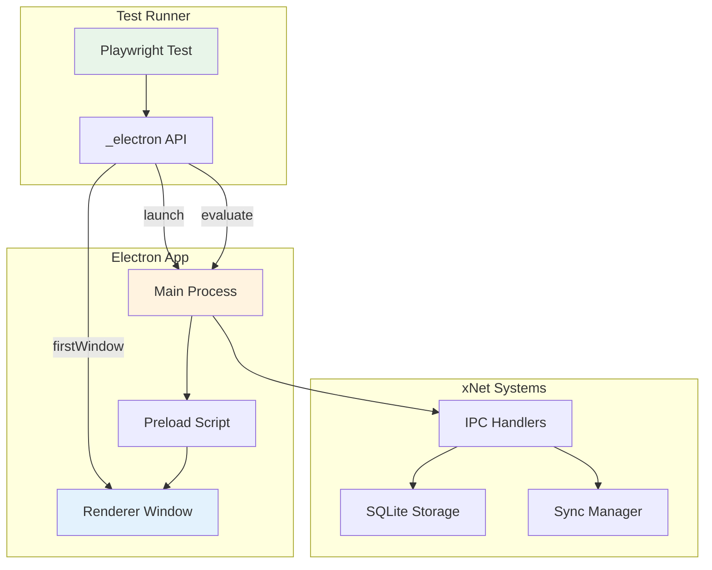
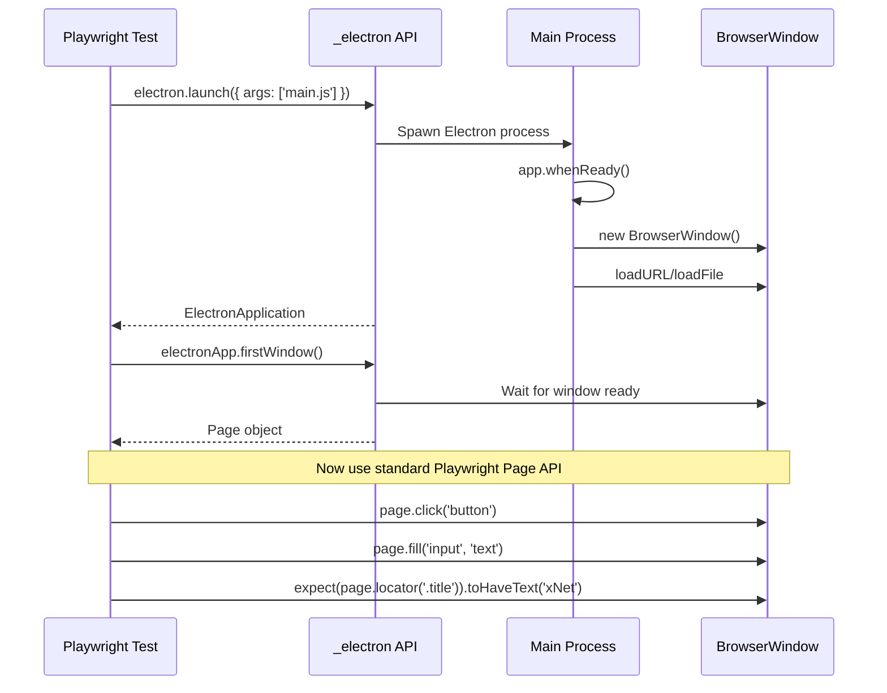
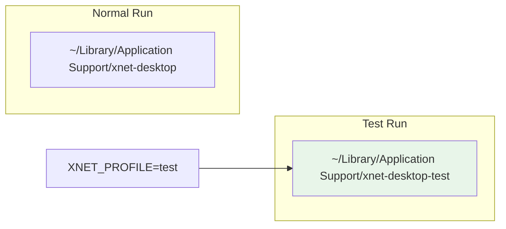
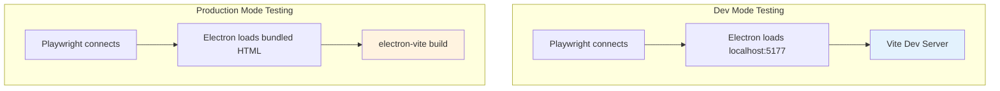
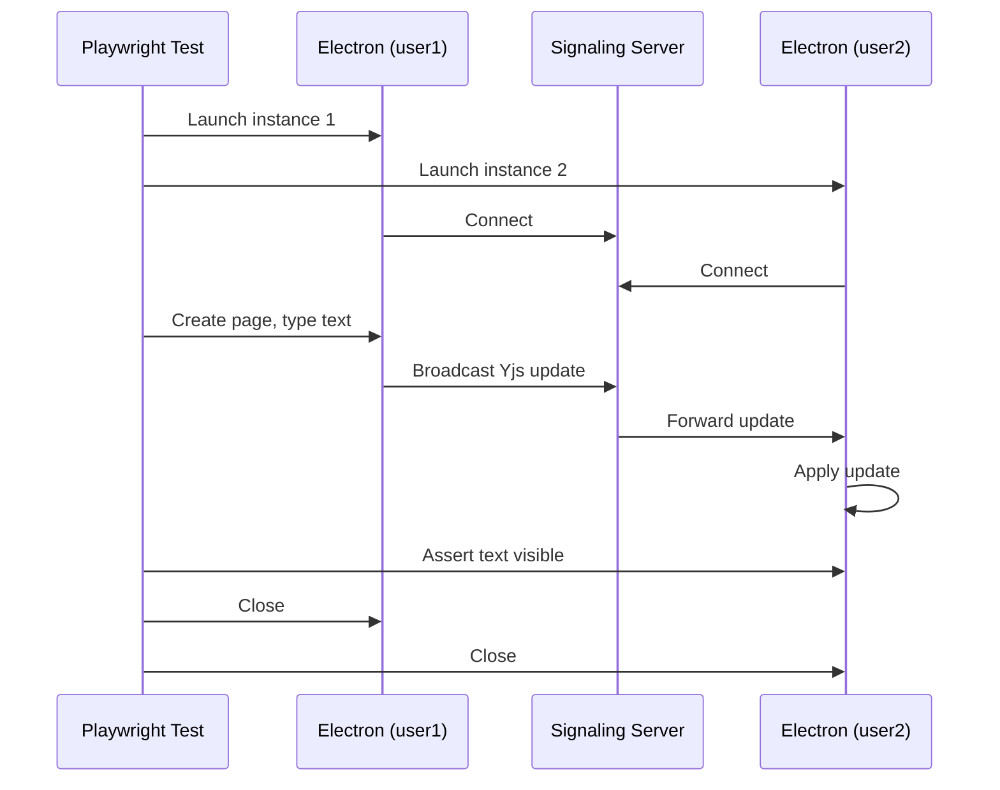

# Playwright + Electron Testing for xNet

> How can we use Playwright to automate and test the xNet Electron app?

## Executive Summary

Playwright has **experimental but functional** support for Electron automation. This allows us to:

1. Launch the xNet Electron app programmatically
2. Interact with the renderer window (click, type, assert)
3. Access the main process (evaluate code, check state)
4. Run automated E2E tests against the full desktop app

This exploration documents how to set it up and what's possible.

## Architecture Overview



## How Playwright Electron Support Works

### Key Concepts

| Concept               | Description                                            |
| --------------------- | ------------------------------------------------------ |
| `_electron`           | Experimental Playwright API for Electron               |
| `ElectronApplication` | Represents a running Electron app                      |
| `firstWindow()`       | Returns the first BrowserWindow as a Playwright `Page` |
| `evaluate()`          | Run code in the main Electron process                  |

### Connection Flow



## Setup Requirements

### 1. Install Dependencies

```bash
# In apps/electron or root
pnpm add -D playwright @playwright/test
```

### 2. Playwright Config

Create `apps/electron/playwright.config.ts`:

```typescript
import { defineConfig } from '@playwright/test'

export default defineConfig({
  testDir: './e2e',
  timeout: 30000,
  retries: 0,
  use: {
    trace: 'on-first-retry',
    video: 'on-first-retry'
  },
  // No webServer - we launch Electron directly
  projects: [
    {
      name: 'electron',
      testMatch: '**/*.e2e.ts'
    }
  ]
})
```

### 3. Electron Test Fixture

Create `apps/electron/e2e/fixtures.ts`:

```typescript
import { test as base, _electron, ElectronApplication, Page } from '@playwright/test'
import { resolve } from 'path'

type ElectronFixtures = {
  electronApp: ElectronApplication
  window: Page
}

export const test = base.extend<ElectronFixtures>({
  electronApp: async ({}, use) => {
    // Build the app first (or use dev mode)
    const electronApp = await _electron.launch({
      args: [resolve(__dirname, '../out/main/index.js')],
      env: {
        ...process.env,
        NODE_ENV: 'test',
        XNET_PROFILE: 'test' // Isolated test profile
      }
    })

    await use(electronApp)
    await electronApp.close()
  },

  window: async ({ electronApp }, use) => {
    const window = await electronApp.firstWindow()
    // Wait for app to be ready
    await window.waitForLoadState('domcontentloaded')
    await use(window)
  }
})

export { expect } from '@playwright/test'
```

### 4. Example Test

Create `apps/electron/e2e/app.e2e.ts`:

```typescript
import { test, expect } from './fixtures'

test.describe('xNet Desktop App', () => {
  test('launches and shows main window', async ({ window }) => {
    // Check window title
    const title = await window.title()
    expect(title).toContain('xNet')

    // Take screenshot
    await window.screenshot({ path: 'e2e/screenshots/launch.png' })
  })

  test('can create a new page', async ({ window }) => {
    // Click "New Page" button (adjust selector to match actual UI)
    await window.click('[data-testid="new-page-button"]')

    // Verify page editor appears
    await expect(window.locator('[data-testid="page-editor"]')).toBeVisible()
  })

  test('can type in the editor', async ({ window }) => {
    // Navigate to a page
    await window.click('[data-testid="new-page-button"]')

    // Type in the editor
    const editor = window.locator('[contenteditable="true"]')
    await editor.click()
    await editor.type('Hello from Playwright!')

    // Verify text appears
    await expect(editor).toContainText('Hello from Playwright!')
  })
})
```

## Testing Main Process

Playwright can evaluate code directly in the main Electron process:

```typescript
test('can access main process state', async ({ electronApp }) => {
  // Run code in main process
  const dataPath = await electronApp.evaluate(async ({ app }) => {
    return app.getPath('userData')
  })

  expect(dataPath).toContain('xnet')

  // Access custom exports from main process
  const profileName = await electronApp.evaluate(async () => {
    // This runs in main process context
    // Can access anything exported from main/index.ts
    const { profile } = await import('./index.js')
    return profile
  })

  expect(profileName).toBe('test')
})
```

## Test Data Isolation



The xNet Electron app already supports profile isolation via `XNET_PROFILE` env var. Tests should use a dedicated profile to avoid polluting real user data.

## Running Tests

### Package.json Scripts

Add to `apps/electron/package.json`:

```json
{
  "scripts": {
    "test:e2e": "pnpm build && playwright test",
    "test:e2e:headed": "pnpm build && playwright test --headed",
    "test:e2e:debug": "pnpm build && playwright test --debug"
  }
}
```

### Command Line

```bash
# Run all E2E tests
cd apps/electron && pnpm test:e2e

# Run specific test file
pnpm test:e2e app.e2e.ts

# Run in headed mode (see the app)
pnpm test:e2e:headed

# Debug mode (step through)
pnpm test:e2e:debug
```

## What Can Be Tested

### UI Interactions

| Capability         | Supported | Notes                           |
| ------------------ | --------- | ------------------------------- |
| Click elements     | Yes       | Standard Playwright selectors   |
| Type text          | Yes       | Including contenteditable       |
| Keyboard shortcuts | Yes       | `page.keyboard.press('Meta+n')` |
| Drag and drop      | Yes       | Canvas interactions             |
| Screenshots        | Yes       | Full window or element          |
| Video recording    | Yes       | For debugging failures          |

### Application State

| Capability            | Supported | Notes                     |
| --------------------- | --------- | ------------------------- |
| Check window title    | Yes       | `window.title()`          |
| Evaluate main process | Yes       | `electronApp.evaluate()`  |
| Access IPC            | Partial   | Via main process evaluate |
| Check localStorage    | Yes       | `page.evaluate()`         |
| Check IndexedDB       | Yes       | `page.evaluate()`         |

### Network

| Capability           | Supported | Notes                     |
| -------------------- | --------- | ------------------------- |
| Mock HTTP requests   | Yes       | `page.route()`            |
| WebSocket inspection | Limited   | Can intercept but complex |
| Signaling server     | External  | Need to start separately  |

## Limitations

### Known Issues

1. **Experimental API** - The `_electron` API is marked experimental
2. **No native dialogs** - File pickers, alerts need mocking
3. **No system tray** - Can't interact with tray icons
4. **Multiple windows** - Need to handle manually via `electronApp.windows()`
5. **DevTools** - Can interfere with tests if open

### Workarounds

```typescript
// Mock native dialogs
test.beforeEach(async ({ electronApp }) => {
  await electronApp.evaluate(async ({ dialog }) => {
    dialog.showOpenDialog = async () => ({
      canceled: false,
      filePaths: ['/mock/path/file.txt']
    })
  })
})

// Handle multiple windows
test('handles popup window', async ({ electronApp }) => {
  const [popup] = await Promise.all([
    electronApp.waitForEvent('window'),
    mainWindow.click('button.open-popup')
  ])
  await expect(popup.locator('h1')).toHaveText('Popup')
})
```

## Dev vs Production Testing



### Dev Mode (Faster iteration)

```typescript
// fixtures.ts - dev mode variant
export const devTest = base.extend<ElectronFixtures>({
  electronApp: async ({}, use) => {
    // Start dev server first (or assume it's running)
    const electronApp = await _electron.launch({
      args: [resolve(__dirname, '../src/main/index.ts')],
      env: {
        ...process.env,
        NODE_ENV: 'development',
        VITE_PORT: '5177',
        XNET_PROFILE: 'test'
      }
    })

    await use(electronApp)
    await electronApp.close()
  }
})
```

### Production Mode (CI/CD)

```typescript
// fixtures.ts - production mode
export const prodTest = base.extend<ElectronFixtures>({
  electronApp: async ({}, use) => {
    // Must build first: pnpm build
    const electronApp = await _electron.launch({
      args: [resolve(__dirname, '../out/main/index.js')],
      env: {
        ...process.env,
        NODE_ENV: 'production',
        XNET_PROFILE: 'test'
      }
    })

    await use(electronApp)
    await electronApp.close()
  }
})
```

## CI/CD Integration

### GitHub Actions Example

```yaml
# .github/workflows/e2e-electron.yml
name: Electron E2E Tests

on:
  push:
    branches: [main]
  pull_request:
    branches: [main]

jobs:
  test:
    runs-on: macos-latest # or ubuntu-latest with xvfb
    steps:
      - uses: actions/checkout@v4

      - uses: pnpm/action-setup@v2
        with:
          version: 8

      - uses: actions/setup-node@v4
        with:
          node-version: 20
          cache: pnpm

      - name: Install dependencies
        run: pnpm install

      - name: Build packages
        run: pnpm build

      - name: Build Electron app
        run: pnpm --filter xnet-desktop build

      - name: Run E2E tests
        run: pnpm --filter xnet-desktop test:e2e

      - uses: actions/upload-artifact@v4
        if: failure()
        with:
          name: playwright-report
          path: apps/electron/playwright-report/
```

### Linux CI (with xvfb)

```yaml
jobs:
  test:
    runs-on: ubuntu-latest
    steps:
      # ... setup steps ...

      - name: Run E2E tests with xvfb
        run: xvfb-run --auto-servernum pnpm --filter xnet-desktop test:e2e
```

## Testing Multi-Instance Sync

One powerful use case is testing P2P sync between two Electron instances:

```typescript
import { test, expect, _electron } from '@playwright/test'

test('two instances can sync', async () => {
  // Launch first instance
  const app1 = await _electron.launch({
    args: ['out/main/index.js'],
    env: { ...process.env, XNET_PROFILE: 'user1' }
  })
  const window1 = await app1.firstWindow()

  // Launch second instance
  const app2 = await _electron.launch({
    args: ['out/main/index.js'],
    env: { ...process.env, XNET_PROFILE: 'user2', VITE_PORT: '5178' }
  })
  const window2 = await app2.firstWindow()

  // Create page in instance 1
  await window1.click('[data-testid="new-page"]')
  await window1.locator('[contenteditable]').type('Hello from User 1')

  // Wait for sync
  await window2.waitForTimeout(2000)

  // Verify content appears in instance 2
  await expect(window2.locator('[contenteditable]')).toContainText('Hello from User 1')

  // Cleanup
  await app1.close()
  await app2.close()
})
```



## Recommended Test Structure

```
apps/electron/
  e2e/
    fixtures.ts           # Electron launch fixtures
    helpers/
      navigation.ts       # Navigation helpers
      editor.ts           # Editor interaction helpers
    tests/
      launch.e2e.ts       # Basic launch tests
      navigation.e2e.ts   # Sidebar, routing tests
      editor.e2e.ts       # Editor functionality
      database.e2e.ts     # Database/table views
      canvas.e2e.ts       # Canvas interactions
      sync.e2e.ts         # Multi-instance sync
    screenshots/          # Test screenshots
  playwright.config.ts
```

## Implementation Effort

| Task               | Effort        | Priority |
| ------------------ | ------------- | -------- |
| Install Playwright | 5 min         | High     |
| Create fixtures.ts | 30 min        | High     |
| Basic launch test  | 15 min        | High     |
| Navigation tests   | 2 hrs         | Medium   |
| Editor tests       | 3 hrs         | Medium   |
| Sync tests         | 4 hrs         | Medium   |
| CI/CD integration  | 2 hrs         | High     |
| **Total**          | **~12 hours** |          |

## Recommendation

**Yes, Playwright can navigate and test the xNet Electron app.**

The setup is straightforward:

1. Install `playwright` and `@playwright/test`
2. Create a fixture that launches Electron with test profile
3. Use standard Playwright `Page` API for interactions

Key benefits:

- Same API as web testing
- Screenshots, video, traces for debugging
- Can test multi-instance sync scenarios
- CI/CD friendly

Start with basic launch and navigation tests, then expand to editor and sync tests.

## References

- [Playwright Electron API](https://playwright.dev/docs/api/class-electron)
- [ElectronApplication API](https://playwright.dev/docs/api/class-electronapplication)
- [electron-vite](https://electron-vite.org/)
- [xNet Electron App](../../apps/electron/)
