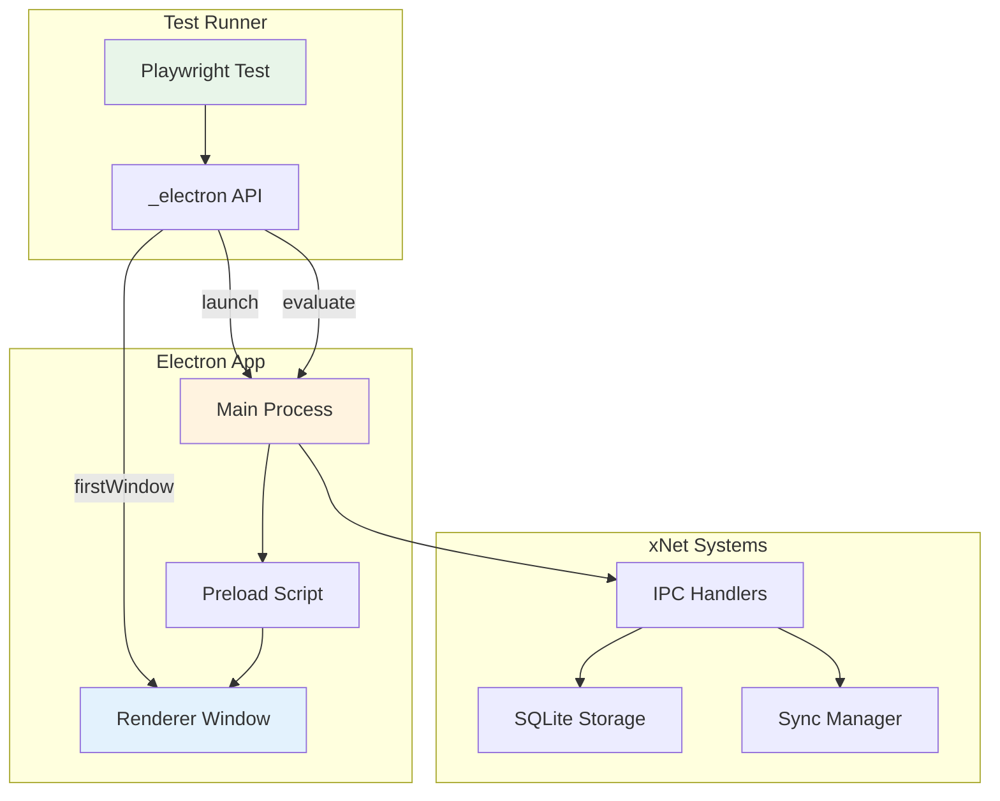
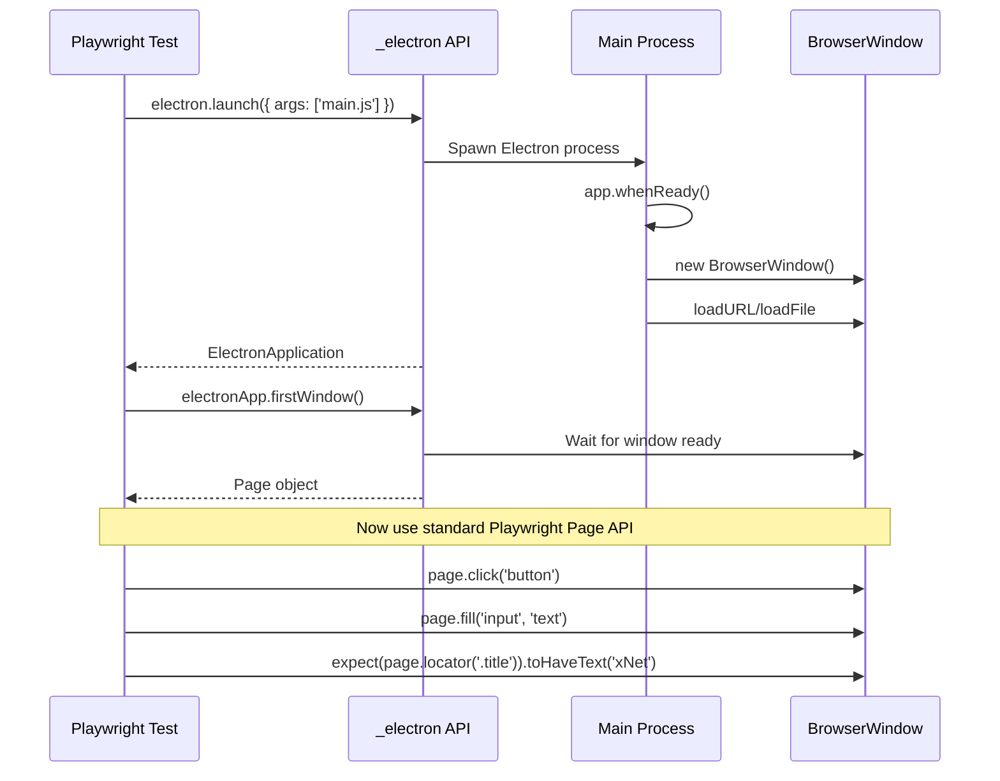
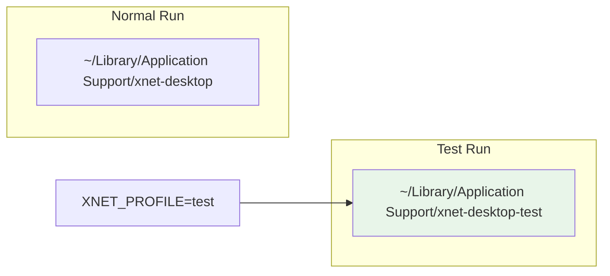
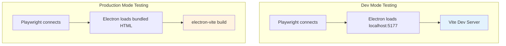
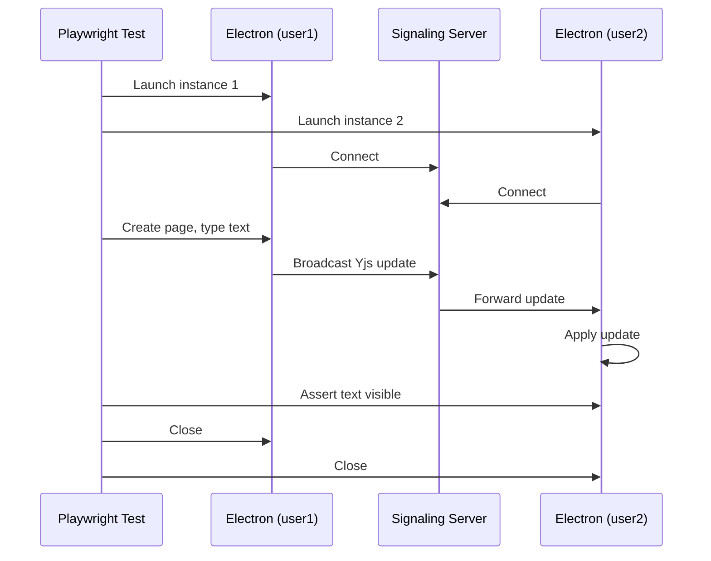
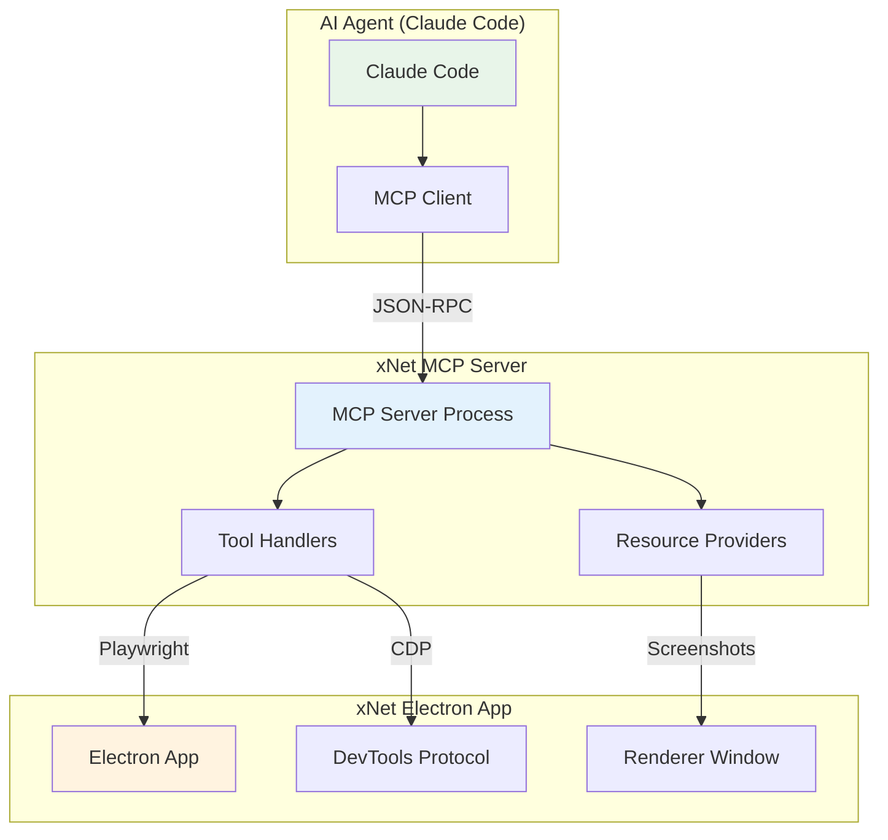
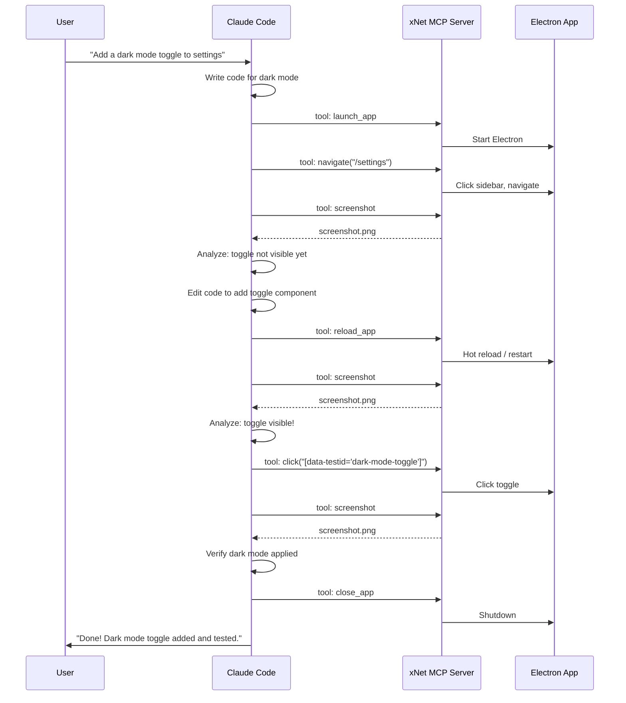

# Playwright + Electron Testing for xNet

> How can we use Playwright to automate and test the xNet Electron app?

## Executive Summary

Playwright has **experimental but functional** support for Electron automation. This allows us to:

1. Launch the xNet Electron app programmatically
2. Interact with the renderer window (click, type, assert)
3. Access the main process (evaluate code, check state)
4. Run automated E2E tests against the full desktop app

This exploration documents how to set it up and what's possible.

## Architecture Overview



## How Playwright Electron Support Works

### Key Concepts

| Concept               | Description                                            |
| --------------------- | ------------------------------------------------------ |
| `_electron`           | Experimental Playwright API for Electron               |
| `ElectronApplication` | Represents a running Electron app                      |
| `firstWindow()`       | Returns the first BrowserWindow as a Playwright `Page` |
| `evaluate()`          | Run code in the main Electron process                  |

### Connection Flow



## Setup Requirements

### 1. Install Dependencies

```bash
# In apps/electron or root
pnpm add -D playwright @playwright/test
```

### 2. Playwright Config

Create `apps/electron/playwright.config.ts`:

```typescript
import { defineConfig } from '@playwright/test'

export default defineConfig({
  testDir: './e2e',
  timeout: 30000,
  retries: 0,
  use: {
    trace: 'on-first-retry',
    video: 'on-first-retry'
  },
  // No webServer - we launch Electron directly
  projects: [
    {
      name: 'electron',
      testMatch: '**/*.e2e.ts'
    }
  ]
})
```

### 3. Electron Test Fixture

Create `apps/electron/e2e/fixtures.ts`:

```typescript
import { test as base, _electron, ElectronApplication, Page } from '@playwright/test'
import { resolve } from 'path'

type ElectronFixtures = {
  electronApp: ElectronApplication
  window: Page
}

export const test = base.extend<ElectronFixtures>({
  electronApp: async ({}, use) => {
    // Build the app first (or use dev mode)
    const electronApp = await _electron.launch({
      args: [resolve(__dirname, '../out/main/index.js')],
      env: {
        ...process.env,
        NODE_ENV: 'test',
        XNET_PROFILE: 'test' // Isolated test profile
      }
    })

    await use(electronApp)
    await electronApp.close()
  },

  window: async ({ electronApp }, use) => {
    const window = await electronApp.firstWindow()
    // Wait for app to be ready
    await window.waitForLoadState('domcontentloaded')
    await use(window)
  }
})

export { expect } from '@playwright/test'
```

### 4. Example Test

Create `apps/electron/e2e/app.e2e.ts`:

```typescript
import { test, expect } from './fixtures'

test.describe('xNet Desktop App', () => {
  test('launches and shows main window', async ({ window }) => {
    // Check window title
    const title = await window.title()
    expect(title).toContain('xNet')

    // Take screenshot
    await window.screenshot({ path: 'e2e/screenshots/launch.png' })
  })

  test('can create a new page', async ({ window }) => {
    // Click "New Page" button (adjust selector to match actual UI)
    await window.click('[data-testid="new-page-button"]')

    // Verify page editor appears
    await expect(window.locator('[data-testid="page-editor"]')).toBeVisible()
  })

  test('can type in the editor', async ({ window }) => {
    // Navigate to a page
    await window.click('[data-testid="new-page-button"]')

    // Type in the editor
    const editor = window.locator('[contenteditable="true"]')
    await editor.click()
    await editor.type('Hello from Playwright!')

    // Verify text appears
    await expect(editor).toContainText('Hello from Playwright!')
  })
})
```

## Testing Main Process

Playwright can evaluate code directly in the main Electron process:

```typescript
test('can access main process state', async ({ electronApp }) => {
  // Run code in main process
  const dataPath = await electronApp.evaluate(async ({ app }) => {
    return app.getPath('userData')
  })

  expect(dataPath).toContain('xnet')

  // Access custom exports from main process
  const profileName = await electronApp.evaluate(async () => {
    // This runs in main process context
    // Can access anything exported from main/index.ts
    const { profile } = await import('./index.js')
    return profile
  })

  expect(profileName).toBe('test')
})
```

## Test Data Isolation



The xNet Electron app already supports profile isolation via `XNET_PROFILE` env var. Tests should use a dedicated profile to avoid polluting real user data.

## Running Tests

### Package.json Scripts

Add to `apps/electron/package.json`:

```json
{
  "scripts": {
    "test:e2e": "pnpm build && playwright test",
    "test:e2e:headed": "pnpm build && playwright test --headed",
    "test:e2e:debug": "pnpm build && playwright test --debug"
  }
}
```

### Command Line

```bash
# Run all E2E tests
cd apps/electron && pnpm test:e2e

# Run specific test file
pnpm test:e2e app.e2e.ts

# Run in headed mode (see the app)
pnpm test:e2e:headed

# Debug mode (step through)
pnpm test:e2e:debug
```

## What Can Be Tested

### UI Interactions

| Capability         | Supported | Notes                           |
| ------------------ | --------- | ------------------------------- |
| Click elements     | Yes       | Standard Playwright selectors   |
| Type text          | Yes       | Including contenteditable       |
| Keyboard shortcuts | Yes       | `page.keyboard.press('Meta+n')` |
| Drag and drop      | Yes       | Canvas interactions             |
| Screenshots        | Yes       | Full window or element          |
| Video recording    | Yes       | For debugging failures          |

### Application State

| Capability            | Supported | Notes                     |
| --------------------- | --------- | ------------------------- |
| Check window title    | Yes       | `window.title()`          |
| Evaluate main process | Yes       | `electronApp.evaluate()`  |
| Access IPC            | Partial   | Via main process evaluate |
| Check localStorage    | Yes       | `page.evaluate()`         |
| Check IndexedDB       | Yes       | `page.evaluate()`         |

### Network

| Capability           | Supported | Notes                     |
| -------------------- | --------- | ------------------------- |
| Mock HTTP requests   | Yes       | `page.route()`            |
| WebSocket inspection | Limited   | Can intercept but complex |
| Signaling server     | External  | Need to start separately  |

## Limitations

### Known Issues

1. **Experimental API** - The `_electron` API is marked experimental
2. **No native dialogs** - File pickers, alerts need mocking
3. **No system tray** - Can't interact with tray icons
4. **Multiple windows** - Need to handle manually via `electronApp.windows()`
5. **DevTools** - Can interfere with tests if open

### Workarounds

```typescript
// Mock native dialogs
test.beforeEach(async ({ electronApp }) => {
  await electronApp.evaluate(async ({ dialog }) => {
    dialog.showOpenDialog = async () => ({
      canceled: false,
      filePaths: ['/mock/path/file.txt']
    })
  })
})

// Handle multiple windows
test('handles popup window', async ({ electronApp }) => {
  const [popup] = await Promise.all([
    electronApp.waitForEvent('window'),
    mainWindow.click('button.open-popup')
  ])
  await expect(popup.locator('h1')).toHaveText('Popup')
})
```

## Dev vs Production Testing



### Dev Mode (Faster iteration)

```typescript
// fixtures.ts - dev mode variant
export const devTest = base.extend<ElectronFixtures>({
  electronApp: async ({}, use) => {
    // Start dev server first (or assume it's running)
    const electronApp = await _electron.launch({
      args: [resolve(__dirname, '../src/main/index.ts')],
      env: {
        ...process.env,
        NODE_ENV: 'development',
        VITE_PORT: '5177',
        XNET_PROFILE: 'test'
      }
    })

    await use(electronApp)
    await electronApp.close()
  }
})
```

### Production Mode (CI/CD)

```typescript
// fixtures.ts - production mode
export const prodTest = base.extend<ElectronFixtures>({
  electronApp: async ({}, use) => {
    // Must build first: pnpm build
    const electronApp = await _electron.launch({
      args: [resolve(__dirname, '../out/main/index.js')],
      env: {
        ...process.env,
        NODE_ENV: 'production',
        XNET_PROFILE: 'test'
      }
    })

    await use(electronApp)
    await electronApp.close()
  }
})
```

## CI/CD Integration

### GitHub Actions Example

```yaml
# .github/workflows/e2e-electron.yml
name: Electron E2E Tests

on:
  push:
    branches: [main]
  pull_request:
    branches: [main]

jobs:
  test:
    runs-on: macos-latest # or ubuntu-latest with xvfb
    steps:
      - uses: actions/checkout@v4

      - uses: pnpm/action-setup@v2
        with:
          version: 8

      - uses: actions/setup-node@v4
        with:
          node-version: 20
          cache: pnpm

      - name: Install dependencies
        run: pnpm install

      - name: Build packages
        run: pnpm build

      - name: Build Electron app
        run: pnpm --filter xnet-desktop build

      - name: Run E2E tests
        run: pnpm --filter xnet-desktop test:e2e

      - uses: actions/upload-artifact@v4
        if: failure()
        with:
          name: playwright-report
          path: apps/electron/playwright-report/
```

### Linux CI (with xvfb)

```yaml
jobs:
  test:
    runs-on: ubuntu-latest
    steps:
      # ... setup steps ...

      - name: Run E2E tests with xvfb
        run: xvfb-run --auto-servernum pnpm --filter xnet-desktop test:e2e
```

## Testing Multi-Instance Sync

One powerful use case is testing P2P sync between two Electron instances:

```typescript
import { test, expect, _electron } from '@playwright/test'

test('two instances can sync', async () => {
  // Launch first instance
  const app1 = await _electron.launch({
    args: ['out/main/index.js'],
    env: { ...process.env, XNET_PROFILE: 'user1' }
  })
  const window1 = await app1.firstWindow()

  // Launch second instance
  const app2 = await _electron.launch({
    args: ['out/main/index.js'],
    env: { ...process.env, XNET_PROFILE: 'user2', VITE_PORT: '5178' }
  })
  const window2 = await app2.firstWindow()

  // Create page in instance 1
  await window1.click('[data-testid="new-page"]')
  await window1.locator('[contenteditable]').type('Hello from User 1')

  // Wait for sync
  await window2.waitForTimeout(2000)

  // Verify content appears in instance 2
  await expect(window2.locator('[contenteditable]')).toContainText('Hello from User 1')

  // Cleanup
  await app1.close()
  await app2.close()
})
```



## Recommended Test Structure

```
apps/electron/
  e2e/
    fixtures.ts           # Electron launch fixtures
    helpers/
      navigation.ts       # Navigation helpers
      editor.ts           # Editor interaction helpers
    tests/
      launch.e2e.ts       # Basic launch tests
      navigation.e2e.ts   # Sidebar, routing tests
      editor.e2e.ts       # Editor functionality
      database.e2e.ts     # Database/table views
      canvas.e2e.ts       # Canvas interactions
      sync.e2e.ts         # Multi-instance sync
    screenshots/          # Test screenshots
  playwright.config.ts
```

## Implementation Effort

| Task               | Effort        | Priority |
| ------------------ | ------------- | -------- |
| Install Playwright | 5 min         | High     |
| Create fixtures.ts | 30 min        | High     |
| Basic launch test  | 15 min        | High     |
| Navigation tests   | 2 hrs         | Medium   |
| Editor tests       | 3 hrs         | Medium   |
| Sync tests         | 4 hrs         | Medium   |
| CI/CD integration  | 2 hrs         | High     |
| **Total**          | **~12 hours** |          |

## Recommendation

**Yes, Playwright can navigate and test the xNet Electron app.**

The setup is straightforward:

1. Install `playwright` and `@playwright/test`
2. Create a fixture that launches Electron with test profile
3. Use standard Playwright `Page` API for interactions

Key benefits:

- Same API as web testing
- Screenshots, video, traces for debugging
- Can test multi-instance sync scenarios
- CI/CD friendly

Start with basic launch and navigation tests, then expand to editor and sync tests.

---

# Part 2: MCP Server for Autonomous AI Development

> How can Claude Code (or other AI agents) directly interact with the xNet Electron app to implement features and debug them autonomously?

## The Vision: Self-Debugging AI Development



## What is MCP?

The **Model Context Protocol (MCP)** is a standard for connecting AI assistants to external tools and data sources. It defines:

- **Tools**: Executable functions the AI can invoke (e.g., click, type, screenshot)
- **Resources**: Data sources the AI can read (e.g., current page state, console logs)
- **Prompts**: Reusable templates for common interactions

MCP uses JSON-RPC 2.0 over stdio or HTTP for communication.

## Autonomous Development Loop

With an MCP server wrapping Playwright + Electron, Claude Code could:



## MCP Server Implementation

### Directory Structure

```
infrastructure/mcp-electron/
  src/
    index.ts              # MCP server entry point
    tools/
      app-control.ts      # Launch, reload, close app
      navigation.ts       # Click, type, navigate
      inspection.ts       # Screenshot, get element, console logs
      assertions.ts       # Check visibility, text content
    resources/
      screenshot.ts       # Current screenshot resource
      dom-state.ts        # Current DOM structure
      console-logs.ts     # Recent console output
    electron-bridge.ts    # Playwright Electron wrapper
  package.json
  tsconfig.json
```

### Core MCP Server

```typescript
// infrastructure/mcp-electron/src/index.ts
import { Server } from '@modelcontextprotocol/sdk/server/index.js'
import { StdioServerTransport } from '@modelcontextprotocol/sdk/server/stdio.js'
import { ElectronBridge } from './electron-bridge'

const bridge = new ElectronBridge()

const server = new Server(
  { name: 'xnet-electron', version: '1.0.0' },
  { capabilities: { tools: {}, resources: {} } }
)

// ─── Tools ─────────────────────────────────────────────────────────────────

server.setRequestHandler('tools/list', async () => ({
  tools: [
    {
      name: 'launch_app',
      description: 'Launch the xNet Electron app',
      inputSchema: {
        type: 'object',
        properties: {
          profile: { type: 'string', description: 'Profile name for isolation' },
          devMode: { type: 'boolean', description: 'Run in dev mode with hot reload' }
        }
      }
    },
    {
      name: 'close_app',
      description: 'Close the Electron app'
    },
    {
      name: 'screenshot',
      description: 'Take a screenshot of the current window',
      inputSchema: {
        type: 'object',
        properties: {
          selector: {
            type: 'string',
            description: 'Optional CSS selector to screenshot specific element'
          }
        }
      }
    },
    {
      name: 'click',
      description: 'Click an element',
      inputSchema: {
        type: 'object',
        properties: {
          selector: { type: 'string', description: 'CSS selector or text selector' }
        },
        required: ['selector']
      }
    },
    {
      name: 'type',
      description: 'Type text into an element',
      inputSchema: {
        type: 'object',
        properties: {
          selector: { type: 'string', description: 'CSS selector for input/contenteditable' },
          text: { type: 'string', description: 'Text to type' }
        },
        required: ['selector', 'text']
      }
    },
    {
      name: 'navigate',
      description: 'Navigate to a route in the app',
      inputSchema: {
        type: 'object',
        properties: {
          route: { type: 'string', description: 'Route path like /settings or /page/abc123' }
        },
        required: ['route']
      }
    },
    {
      name: 'get_console_logs',
      description: 'Get recent console output from the app'
    },
    {
      name: 'get_element_info',
      description: 'Get information about an element',
      inputSchema: {
        type: 'object',
        properties: {
          selector: { type: 'string', description: 'CSS selector' }
        },
        required: ['selector']
      }
    },
    {
      name: 'wait_for_selector',
      description: 'Wait for an element to appear',
      inputSchema: {
        type: 'object',
        properties: {
          selector: { type: 'string' },
          timeout: { type: 'number', description: 'Timeout in ms (default 5000)' }
        },
        required: ['selector']
      }
    },
    {
      name: 'reload_app',
      description: 'Reload the renderer window (for testing code changes)'
    },
    {
      name: 'evaluate',
      description: 'Run JavaScript in the renderer context',
      inputSchema: {
        type: 'object',
        properties: {
          script: { type: 'string', description: 'JavaScript code to evaluate' }
        },
        required: ['script']
      }
    }
  ]
}))

server.setRequestHandler('tools/call', async (request) => {
  const { name, arguments: args } = request.params

  switch (name) {
    case 'launch_app':
      await bridge.launch(args?.profile, args?.devMode)
      return { content: [{ type: 'text', text: 'App launched successfully' }] }

    case 'close_app':
      await bridge.close()
      return { content: [{ type: 'text', text: 'App closed' }] }

    case 'screenshot': {
      const screenshot = await bridge.screenshot(args?.selector)
      return {
        content: [
          {
            type: 'image',
            data: screenshot.toString('base64'),
            mimeType: 'image/png'
          }
        ]
      }
    }

    case 'click':
      await bridge.click(args.selector)
      return { content: [{ type: 'text', text: `Clicked: ${args.selector}` }] }

    case 'type':
      await bridge.type(args.selector, args.text)
      return { content: [{ type: 'text', text: `Typed "${args.text}" into ${args.selector}` }] }

    case 'navigate':
      await bridge.navigate(args.route)
      return { content: [{ type: 'text', text: `Navigated to ${args.route}` }] }

    case 'get_console_logs':
      const logs = bridge.getConsoleLogs()
      return { content: [{ type: 'text', text: logs.join('\n') }] }

    case 'get_element_info': {
      const info = await bridge.getElementInfo(args.selector)
      return { content: [{ type: 'text', text: JSON.stringify(info, null, 2) }] }
    }

    case 'wait_for_selector':
      await bridge.waitForSelector(args.selector, args.timeout)
      return { content: [{ type: 'text', text: `Element found: ${args.selector}` }] }

    case 'reload_app':
      await bridge.reload()
      return { content: [{ type: 'text', text: 'App reloaded' }] }

    case 'evaluate': {
      const result = await bridge.evaluate(args.script)
      return { content: [{ type: 'text', text: JSON.stringify(result) }] }
    }

    default:
      throw new Error(`Unknown tool: ${name}`)
  }
})

// ─── Resources ─────────────────────────────────────────────────────────────

server.setRequestHandler('resources/list', async () => ({
  resources: [
    {
      uri: 'xnet://screenshot',
      name: 'Current Screenshot',
      mimeType: 'image/png',
      description: 'Screenshot of the current app state'
    },
    {
      uri: 'xnet://console',
      name: 'Console Logs',
      mimeType: 'text/plain',
      description: 'Recent console output'
    },
    {
      uri: 'xnet://dom',
      name: 'DOM Structure',
      mimeType: 'text/html',
      description: 'Current page DOM (simplified)'
    }
  ]
}))

server.setRequestHandler('resources/read', async (request) => {
  const { uri } = request.params

  switch (uri) {
    case 'xnet://screenshot': {
      const screenshot = await bridge.screenshot()
      return {
        contents: [
          {
            uri,
            mimeType: 'image/png',
            blob: screenshot.toString('base64')
          }
        ]
      }
    }

    case 'xnet://console':
      return {
        contents: [
          {
            uri,
            mimeType: 'text/plain',
            text: bridge.getConsoleLogs().join('\n')
          }
        ]
      }

    case 'xnet://dom': {
      const dom = await bridge.getDOM()
      return {
        contents: [
          {
            uri,
            mimeType: 'text/html',
            text: dom
          }
        ]
      }
    }

    default:
      throw new Error(`Unknown resource: ${uri}`)
  }
})

// ─── Start Server ──────────────────────────────────────────────────────────

async function main() {
  const transport = new StdioServerTransport()
  await server.connect(transport)
  console.error('xNet Electron MCP server running')
}

main().catch(console.error)
```

### Electron Bridge (Playwright Wrapper)

```typescript
// infrastructure/mcp-electron/src/electron-bridge.ts
import { _electron, ElectronApplication, Page } from 'playwright'
import { resolve } from 'path'

export class ElectronBridge {
  private app: ElectronApplication | null = null
  private window: Page | null = null
  private consoleLogs: string[] = []

  async launch(profile = 'mcp-test', devMode = false): Promise<void> {
    if (this.app) {
      await this.close()
    }

    const args = devMode
      ? [resolve(__dirname, '../../../apps/electron/src/main/index.ts')]
      : [resolve(__dirname, '../../../apps/electron/out/main/index.js')]

    this.app = await _electron.launch({
      args,
      env: {
        ...process.env,
        NODE_ENV: devMode ? 'development' : 'production',
        XNET_PROFILE: profile,
        VITE_PORT: '5177'
      }
    })

    this.window = await this.app.firstWindow()
    await this.window.waitForLoadState('domcontentloaded')

    // Capture console logs
    this.window.on('console', (msg) => {
      this.consoleLogs.push(`[${msg.type()}] ${msg.text()}`)
      if (this.consoleLogs.length > 100) {
        this.consoleLogs.shift()
      }
    })
  }

  async close(): Promise<void> {
    if (this.app) {
      await this.app.close()
      this.app = null
      this.window = null
    }
  }

  async screenshot(selector?: string): Promise<Buffer> {
    this.ensureWindow()
    if (selector) {
      return await this.window!.locator(selector).screenshot()
    }
    return await this.window!.screenshot()
  }

  async click(selector: string): Promise<void> {
    this.ensureWindow()
    await this.window!.click(selector)
  }

  async type(selector: string, text: string): Promise<void> {
    this.ensureWindow()
    await this.window!.locator(selector).fill(text)
  }

  async navigate(route: string): Promise<void> {
    this.ensureWindow()
    // Use the app's router - evaluate in renderer
    await this.window!.evaluate((r) => {
      // @ts-ignore - router is on window in dev
      window.__router?.navigate({ to: r })
    }, route)
    await this.window!.waitForLoadState('networkidle')
  }

  async waitForSelector(selector: string, timeout = 5000): Promise<void> {
    this.ensureWindow()
    await this.window!.waitForSelector(selector, { timeout })
  }

  async reload(): Promise<void> {
    this.ensureWindow()
    await this.window!.reload()
    await this.window!.waitForLoadState('domcontentloaded')
  }

  async evaluate(script: string): Promise<unknown> {
    this.ensureWindow()
    return await this.window!.evaluate(script)
  }

  async getElementInfo(selector: string): Promise<object> {
    this.ensureWindow()
    return await this.window!.evaluate((sel) => {
      const el = document.querySelector(sel)
      if (!el) return { found: false }
      const rect = el.getBoundingClientRect()
      return {
        found: true,
        tagName: el.tagName,
        id: el.id,
        className: el.className,
        textContent: el.textContent?.slice(0, 200),
        isVisible: rect.width > 0 && rect.height > 0,
        bounds: { x: rect.x, y: rect.y, width: rect.width, height: rect.height }
      }
    }, selector)
  }

  async getDOM(): Promise<string> {
    this.ensureWindow()
    return await this.window!.evaluate(() => {
      // Return simplified DOM structure
      function simplify(el: Element, depth = 0): string {
        if (depth > 5) return '...'
        const indent = '  '.repeat(depth)
        const attrs = el.id ? ` id="${el.id}"` : ''
        const cls = el.className ? ` class="${el.className}"` : ''
        const children = Array.from(el.children)
          .map((c) => simplify(c, depth + 1))
          .join('\n')
        return `${indent}<${el.tagName.toLowerCase()}${attrs}${cls}>\n${children}\n${indent}</${el.tagName.toLowerCase()}>`
      }
      return simplify(document.body)
    })
  }

  getConsoleLogs(): string[] {
    return [...this.consoleLogs]
  }

  private ensureWindow(): void {
    if (!this.window) {
      throw new Error('App not launched. Call launch_app first.')
    }
  }
}
```

## Claude Code Configuration

To enable Claude Code to use this MCP server, add to `~/.claude/claude_desktop_config.json`:

```json
{
  "mcpServers": {
    "xnet-electron": {
      "command": "node",
      "args": ["/path/to/xNet/infrastructure/mcp-electron/dist/index.js"],
      "env": {
        "NODE_ENV": "development"
      }
    }
  }
}
```

Or for Claude Code CLI, create `.mcp.json` in the project root:

```json
{
  "mcpServers": {
    "xnet-electron": {
      "command": "pnpm",
      "args": ["--filter", "@xnet/mcp-electron", "start"],
      "cwd": "/path/to/xNet"
    }
  }
}
```

## Use Cases for Autonomous Development

### 1. Implement and Verify UI Changes

```
User: "Add a button that exports the current page to Markdown"

Claude:
1. Writes the ExportButton component
2. Calls launch_app
3. Calls navigate("/page/test-page")
4. Calls screenshot - sees no export button
5. Edits code to import and render ExportButton
6. Calls reload_app
7. Calls screenshot - sees export button!
8. Calls click("[data-testid='export-button']")
9. Verifies download triggered
10. Calls close_app
11. Reports success to user
```

### 2. Debug Visual Regressions

```
User: "The sidebar is overlapping the editor, can you fix it?"

Claude:
1. Calls launch_app
2. Calls screenshot
3. Analyzes: sidebar z-index issue
4. Edits Tailwind classes
5. Calls reload_app
6. Calls screenshot
7. Verifies fix
8. Commits change
```

### 3. Test P2P Sync (Multi-Instance)

```
User: "Verify that changes sync between two instances"

Claude:
1. Launches two app instances with different profiles
2. Creates a page in instance 1
3. Types content
4. Screenshots instance 2
5. Verifies content appeared
6. Reports sync working
```

## Tool Categories

### App Lifecycle

| Tool         | Description                 |
| ------------ | --------------------------- |
| `launch_app` | Start Electron with profile |
| `close_app`  | Shutdown gracefully         |
| `reload_app` | Hot reload for code changes |

### Navigation & Interaction

| Tool                | Description                     |
| ------------------- | ------------------------------- |
| `navigate`          | Go to a route                   |
| `click`             | Click element by selector       |
| `type`              | Type into input/contenteditable |
| `wait_for_selector` | Wait for element to appear      |

### Inspection & Debugging

| Tool               | Description                  |
| ------------------ | ---------------------------- |
| `screenshot`       | Capture current state        |
| `get_element_info` | Inspect element properties   |
| `get_console_logs` | Read recent console output   |
| `evaluate`         | Run arbitrary JS in renderer |

## Security Considerations

### Sandboxing

The MCP server runs with full access to:

- Launch arbitrary Electron processes
- Execute JavaScript in the renderer
- Read/write filesystem (via Electron's Node integration)

**Mitigations:**

1. Only enable in development
2. Use isolated test profiles (`XNET_PROFILE=mcp-test`)
3. Don't expose to untrusted AI agents
4. Consider read-only mode for CI

### Rate Limiting

For autonomous loops, consider:

- Maximum screenshots per minute
- Timeout for hung operations
- Circuit breaker for repeated failures

## Integration with Existing Tests

The MCP server can reuse Playwright E2E test helpers:

```typescript
// Shared helpers
import { createTestPage, login, createDatabase } from '../e2e/helpers'

// In MCP tool handler
case 'setup_test_data':
  await createTestPage(bridge.window!, { title: args.title })
  return { content: [{ type: 'text', text: 'Test page created' }] }
```

## Implementation Roadmap

| Phase     | Task                          | Effort      |
| --------- | ----------------------------- | ----------- |
| 1         | Basic MCP server scaffold     | 2 hrs       |
| 2         | App lifecycle tools           | 2 hrs       |
| 3         | Navigation & click tools      | 3 hrs       |
| 4         | Screenshot & inspection tools | 2 hrs       |
| 5         | Console log capture           | 1 hr        |
| 6         | Multi-instance support        | 3 hrs       |
| 7         | Claude Code integration       | 1 hr        |
| 8         | Documentation & examples      | 2 hrs       |
| **Total** |                               | **~16 hrs** |

## Benefits for xNet Development

1. **Faster iteration** - AI can test changes without human intervention
2. **Visual verification** - Screenshots confirm UI changes work
3. **Regression detection** - AI notices if something breaks
4. **Sync testing** - Automated multi-instance P2P verification
5. **Self-documenting** - AI can screenshot and describe what it built

## Future Enhancements

### Chrome DevTools Protocol (CDP) Integration

For deeper inspection:

- Network request monitoring
- Performance profiling
- Memory snapshots
- DOM mutation observation

### Video Recording

Record autonomous sessions for review:

```typescript
case 'start_recording':
  await bridge.startRecording()
  return { content: [{ type: 'text', text: 'Recording started' }] }

case 'stop_recording':
  const video = await bridge.stopRecording()
  return { content: [{ type: 'resource', uri: video }] }
```

### AI-Friendly Selectors

Expose semantic selectors for common elements:

```typescript
case 'get_semantic_elements':
  return {
    content: [{
      type: 'text',
      text: JSON.stringify({
        sidebar: '[data-testid="sidebar"]',
        editor: '[data-testid="editor"]',
        newPageButton: '[data-testid="new-page"]',
        // ... etc
      })
    }]
  }
```

## References

- [Model Context Protocol Specification](https://modelcontextprotocol.io/)
- [MCP TypeScript SDK](https://github.com/modelcontextprotocol/typescript-sdk)
- [Playwright Electron API](https://playwright.dev/docs/api/class-electron)
- [xNet Electron App](../../apps/electron/)
