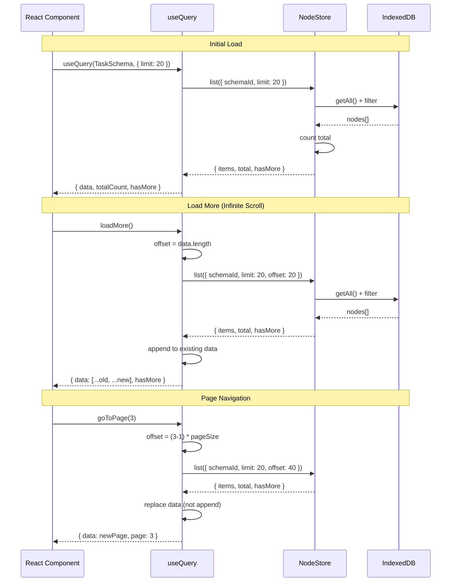
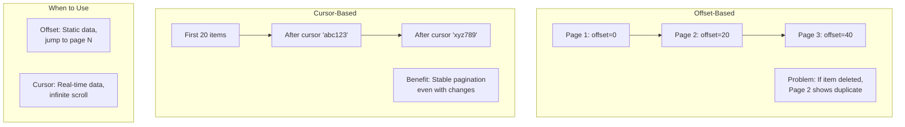
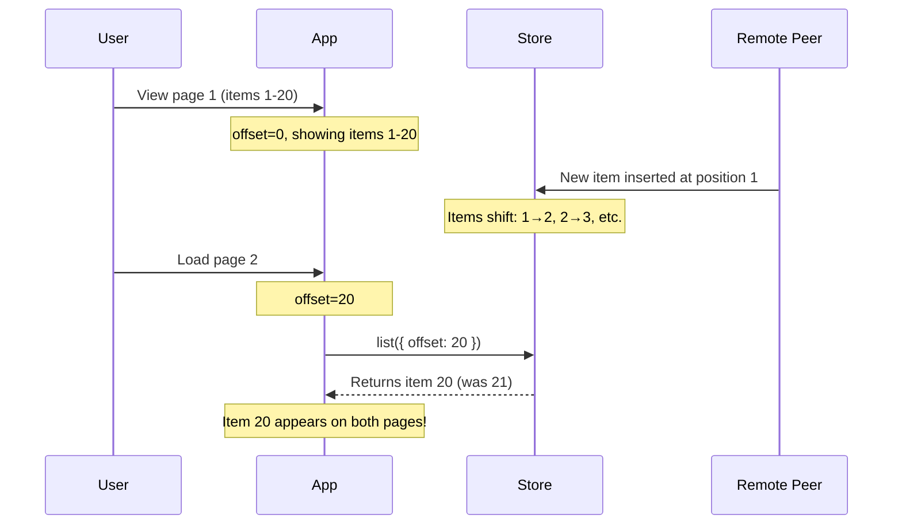

# 0037: useQuery Pagination

> Exploration of pagination patterns for the `useQuery` hook in `@xnet/react`

## Status: Exploration

## Problem Statement

The current `useQuery` hook in `@xnet/react` supports basic `limit` and `offset` options for pagination, but lacks:

1. **No `totalCount`** - Can't show "Page 1 of 10" or progress indicators
2. **No `hasMore`** - Can't know if more data exists without fetching
3. **No pagination helpers** - No `nextPage()`, `prevPage()`, `loadMore()` functions
4. **No cursor support** - Only offset-based pagination (problematic for real-time data)
5. **No infinite scroll pattern** - Must manually manage accumulated data

This exploration examines pagination patterns from TanStack Query, Relay, SWR, and Apollo to design an improved API.

## Current State

### Current `useQuery` API

```typescript
// packages/react/src/hooks/useQuery.ts
interface QueryFilter<P> {
  where?: Partial<InferCreateProps<P>>
  includeDeleted?: boolean
  orderBy?: { [K in keyof InferCreateProps<P>]?: 'asc' | 'desc' }
  limit?: number // Supported but basic
  offset?: number // Supported but basic
}

interface QueryListResult<P> {
  data: FlatNode<P>[]
  loading: boolean
  error: Error | null
  reload: () => Promise<void>
}
```

### Existing `@xnet/query` Types

The `@xnet/query` package already has a more complete `QueryResult` type:

```typescript
// packages/query/src/types.ts
interface QueryResult<T> {
  items: T[]
  total: number // Total count before pagination
  hasMore: boolean // Whether more results exist
  cursor?: string // For cursor-based pagination
}
```

## Research: Industry Patterns

### TanStack Query - Paginated Queries

```typescript
// Offset-based with keepPreviousData
const { data, isPreviousData } = useQuery({
  queryKey: ['projects', page],
  queryFn: () => fetchProjects(page),
  placeholderData: keepPreviousData // Show old data while loading new
})

// Infinite queries
const { data, fetchNextPage, hasNextPage, isFetchingNextPage } = useInfiniteQuery({
  queryKey: ['projects'],
  queryFn: ({ pageParam }) => fetchProjects(pageParam),
  initialPageParam: 0,
  getNextPageParam: (lastPage) => lastPage.nextCursor
})

// Access all pages
const allItems = data.pages.flatMap((page) => page.items)
```

**Key insights:**

- Separate hooks for paginated vs infinite queries
- `keepPreviousData` prevents flicker during page transitions
- `pageParam` abstraction works for both offset and cursor
- `getNextPageParam` function determines if more pages exist

### Relay - Cursor-Based Pagination

```typescript
const { data, loadNext, hasNext, isLoadingNext } = usePaginationFragment(
  graphql`
    fragment FriendsList on User
    @refetchable(queryName: "FriendsListPaginationQuery") {
      friends(first: $count, after: $cursor)
      @connection(key: "FriendsList_friends") {
        edges { node { name } }
        pageInfo { endCursor, hasNextPage }
      }
    }
  `,
  userRef
)

// Load more
<Button onClick={() => loadNext(10)}>Load more</Button>
```

**Key insights:**

- Cursor-based pagination built into GraphQL schema
- `@connection` directive handles list accumulation automatically
- `pageInfo` is standardized (endCursor, hasNextPage, hasPreviousPage, startCursor)
- Bi-directional pagination with `loadNext` and `loadPrevious`

### Apollo Client - Field Policies

```typescript
// Offset-based with automatic merging
const cache = new InMemoryCache({
  typePolicies: {
    Query: {
      fields: {
        posts: offsetLimitPagination(['category']) // keyArgs
      }
    }
  }
})

// Cursor-based with Relay style
const cache = new InMemoryCache({
  typePolicies: {
    Query: {
      fields: {
        comments: relayStylePagination()
      }
    }
  }
})

// Component uses fetchMore
const { data, fetchMore } = useQuery(POSTS_QUERY)

fetchMore({
  variables: { offset: data.posts.length }
})
```

**Key insights:**

- Pagination logic in cache layer, not component
- `keyArgs` determines cache identity (e.g., different categories = different lists)
- `merge` function controls how pages combine
- Works with any pagination style via custom field policies

## Architecture

### Data Flow with Pagination



### Cursor vs Offset Pagination



## Proposed API

### Option A: Extended QueryFilter (Minimal Change)

Add pagination metadata to existing hook:

```typescript
interface QueryFilter<P> {
  // Existing
  where?: Partial<InferCreateProps<P>>
  orderBy?: { [K in keyof InferCreateProps<P>]?: 'asc' | 'desc' }
  includeDeleted?: boolean

  // Pagination
  limit?: number
  offset?: number
  cursor?: string // NEW: cursor-based pagination
}

interface QueryListResult<P> {
  // Existing
  data: FlatNode<P>[]
  loading: boolean
  error: Error | null
  reload: () => Promise<void>

  // NEW: Pagination metadata
  totalCount: number | null // null if count not available
  hasMore: boolean

  // NEW: Pagination helpers
  loadMore: (count?: number) => Promise<void> // For infinite scroll
  nextPage: () => Promise<void> // For page-based
  prevPage: () => Promise<void> // For page-based
  goToPage: (page: number) => Promise<void>

  // NEW: Current pagination state
  pagination: {
    page: number
    pageSize: number
    totalPages: number | null
  }
}
```

**Usage:**

```typescript
// Infinite scroll
const { data, loadMore, hasMore, loading } = useQuery(TaskSchema, { limit: 20 })

return (
  <>
    {data.map(task => <TaskCard key={task.id} task={task} />)}
    {hasMore && (
      <button onClick={() => loadMore()} disabled={loading}>
        Load more
      </button>
    )}
  </>
)

// Page-based
const { data, pagination, goToPage } = useQuery(TaskSchema, {
  limit: 20,
  offset: 0
})

return (
  <>
    {data.map(task => <TaskCard key={task.id} task={task} />)}
    <Paginator
      page={pagination.page}
      totalPages={pagination.totalPages}
      onPageChange={goToPage}
    />
  </>
)
```

### Option B: Separate usePaginatedQuery Hook

Keep `useQuery` simple, add specialized hook:

```typescript
// Simple list (no pagination)
const { data } = useQuery(TaskSchema)

// Paginated list with full control
const {
  data,
  page,
  pageSize,
  totalCount,
  totalPages,
  hasNextPage,
  hasPrevPage,
  nextPage,
  prevPage,
  goToPage,
  setPageSize,
  loading,
  error
} = usePaginatedQuery(TaskSchema, {
  where: { status: 'active' },
  orderBy: { createdAt: 'desc' },
  pageSize: 20,
  initialPage: 1
})
```

### Option C: useInfiniteQuery Hook (Recommended for Real-time)

Separate hook optimized for infinite scroll with cursor support:

```typescript
interface UseInfiniteQueryOptions<P> {
  where?: Partial<InferCreateProps<P>>
  orderBy?: { [K in keyof InferCreateProps<P>]?: 'asc' | 'desc' }
  pageSize?: number // default: 20
}

interface UseInfiniteQueryResult<P> {
  data: FlatNode<P>[] // All loaded items (accumulated)
  loading: boolean // Initial load
  loadingMore: boolean // Subsequent loads
  error: Error | null

  hasMore: boolean
  loadMore: () => Promise<void>

  // For virtualized lists
  totalCount: number | null
  loadedCount: number

  // Reset to initial state
  reset: () => Promise<void>
}

function useInfiniteQuery<P>(
  schema: DefinedSchema<P>,
  options?: UseInfiniteQueryOptions<P>
): UseInfiniteQueryResult<P>
```

**Usage with virtualized list:**

```typescript
const { data, loadMore, hasMore, loadingMore, totalCount } = useInfiniteQuery(
  TaskSchema,
  { orderBy: { createdAt: 'desc' }, pageSize: 50 }
)

return (
  <VirtualList
    items={data}
    totalCount={totalCount ?? data.length}
    onEndReached={() => hasMore && loadMore()}
    renderItem={(task) => <TaskCard task={task} />}
    footer={loadingMore ? <Spinner /> : null}
  />
)
```

## Implementation Plan

### Phase 1: Storage Layer Changes

Add `countNodes` to NodeStore:

```typescript
// packages/data/src/store/store.ts
interface NodeStore {
  // Existing
  get(id: string): Promise<NodeState | null>
  list(options?: ListNodesOptions): Promise<NodeState[]>

  // NEW
  count(options?: CountNodesOptions): Promise<number>
}

interface CountNodesOptions {
  schemaId?: SchemaIRI
  where?: Record<string, unknown> // Optional: filter before counting
  includeDeleted?: boolean
}
```

### Phase 2: Enhanced useQuery

```typescript
// packages/react/src/hooks/useQuery.ts

interface QueryListResult<P> {
  data: FlatNode<P>[]
  loading: boolean
  error: Error | null
  reload: () => Promise<void>

  // Pagination (always available)
  totalCount: number | null
  hasMore: boolean
  loadMore: () => Promise<void>
}
```

### Phase 3: Dedicated Pagination Hooks

```typescript
// packages/react/src/hooks/usePaginatedQuery.ts
export function usePaginatedQuery<P>(
  schema: DefinedSchema<P>,
  options?: PaginatedQueryOptions<P>
): PaginatedQueryResult<P>

// packages/react/src/hooks/useInfiniteQuery.ts
export function useInfiniteQuery<P>(
  schema: DefinedSchema<P>,
  options?: InfiniteQueryOptions<P>
): InfiniteQueryResult<P>
```

### Phase 4: Cursor Support (Optional)

For cursor-based pagination (more complex, may not be needed initially):

```typescript
// Cursor encoding: base64({ id, sortValue })
interface CursorInfo {
  nodeId: string
  sortField: string
  sortValue: unknown
}

function encodeCursor(info: CursorInfo): string
function decodeCursor(cursor: string): CursorInfo
```

## Comparison Matrix

| Feature               | Option A (Extended) | Option B (Separate) | Option C (Infinite) |
| --------------------- | ------------------- | ------------------- | ------------------- |
| API simplicity        | Medium              | High                | High                |
| Breaking changes      | None                | None                | None                |
| Infinite scroll       | Yes                 | No (separate hook)  | Optimized           |
| Page navigation       | Yes                 | Optimized           | No                  |
| Real-time friendly    | Medium              | Medium              | High                |
| Implementation effort | Low                 | Medium              | Medium              |
| Bundle size impact    | Low                 | Medium              | Medium              |

## Recommendation

**Implement in stages:**

1. **Phase 1**: Add `totalCount` and `hasMore` to existing `useQuery` (Option A minimal)
   - Low risk, immediate value
   - Enables basic pagination UI
2. **Phase 2**: Add `useInfiniteQuery` hook (Option C)
   - Optimized for infinite scroll (common pattern)
   - Handles data accumulation automatically
   - Works well with real-time subscriptions

3. **Phase 3**: Add `usePaginatedQuery` hook (Option B) if needed
   - Only if discrete page navigation is frequently requested
   - Lower priority than infinite scroll

## Detailed Implementation

### Enhanced QueryListResult

```typescript
// packages/react/src/hooks/useQuery.ts

export interface QueryListResult<P extends Record<string, PropertyBuilder>> {
  /** The queried nodes */
  data: FlatNode<P>[]
  /** Whether currently loading initial data */
  loading: boolean
  /** Whether loading more data */
  loadingMore: boolean
  /** Any error that occurred */
  error: Error | null
  /** Reload the query from scratch */
  reload: () => Promise<void>

  // Pagination
  /** Total count of matching nodes (null if not yet loaded) */
  totalCount: number | null
  /** Whether more data is available */
  hasMore: boolean
  /** Load more data (for infinite scroll) */
  loadMore: (count?: number) => Promise<void>
  /** Current pagination state */
  pagination: PaginationState
}

export interface PaginationState {
  /** Number of items loaded */
  loadedCount: number
  /** Page size (limit) */
  pageSize: number
  /** Current offset */
  offset: number
}
```

### useInfiniteQuery Implementation Sketch

```typescript
// packages/react/src/hooks/useInfiniteQuery.ts

export function useInfiniteQuery<P extends Record<string, PropertyBuilder>>(
  schema: DefinedSchema<P>,
  options: InfiniteQueryOptions<P> = {}
): InfiniteQueryResult<P> {
  const { pageSize = 20, where, orderBy, includeDeleted } = options
  const { store, isReady } = useNodeStore()
  const schemaId = schema._schemaId

  // State
  const [pages, setPages] = useState<FlatNode<P>[][]>([])
  const [loading, setLoading] = useState(true)
  const [loadingMore, setLoadingMore] = useState(false)
  const [error, setError] = useState<Error | null>(null)
  const [totalCount, setTotalCount] = useState<number | null>(null)
  const [hasMore, setHasMore] = useState(true)

  // Flatten all pages
  const data = useMemo(() => pages.flat(), [pages])

  // Load initial page
  const loadInitial = useCallback(async () => {
    if (!store) return
    setLoading(true)
    try {
      const [nodes, count] = await Promise.all([
        store.list({ schemaId, limit: pageSize, offset: 0, includeDeleted }),
        store.count({ schemaId, includeDeleted })
      ])
      const filtered = applyWhereFilter(flattenNodes<P>(nodes), where)
      const sorted = applySorting(filtered, orderBy)
      setPages([sorted])
      setTotalCount(count)
      setHasMore(sorted.length === pageSize)
    } catch (err) {
      setError(err instanceof Error ? err : new Error(String(err)))
    } finally {
      setLoading(false)
    }
  }, [store, schemaId, pageSize, where, orderBy, includeDeleted])

  // Load more pages
  const loadMore = useCallback(async () => {
    if (!store || loadingMore || !hasMore) return
    setLoadingMore(true)
    try {
      const offset = data.length
      const nodes = await store.list({ schemaId, limit: pageSize, offset, includeDeleted })
      const filtered = applyWhereFilter(flattenNodes<P>(nodes), where)
      const sorted = applySorting(filtered, orderBy)
      setPages((prev) => [...prev, sorted])
      setHasMore(sorted.length === pageSize)
    } catch (err) {
      setError(err instanceof Error ? err : new Error(String(err)))
    } finally {
      setLoadingMore(false)
    }
  }, [store, schemaId, pageSize, data.length, where, orderBy, includeDeleted, loadingMore, hasMore])

  // Reset to initial state
  const reset = useCallback(async () => {
    setPages([])
    setHasMore(true)
    await loadInitial()
  }, [loadInitial])

  // Auto-load on mount
  useEffect(() => {
    if (isReady) loadInitial()
  }, [isReady, loadInitial])

  // Subscribe to changes (append new items, update existing)
  useEffect(() => {
    if (!store) return
    return store.subscribe((event) => {
      // Handle real-time updates while preserving pagination
      // ... subscription logic
    })
  }, [store, schemaId, where])

  return {
    data,
    loading,
    loadingMore,
    error,
    hasMore,
    loadMore,
    totalCount,
    loadedCount: data.length,
    reset
  }
}
```

## Real-time Considerations

### Problem: New Items During Pagination

When using offset-based pagination with real-time data:



### Solution: Hybrid Approach

```typescript
// For infinite scroll: prepend new items, don't shift
useEffect(() => {
  return store.subscribe((event) => {
    if (event.type === 'created' && matchesFilter(event.node)) {
      // Prepend to first page (user sees new items at top)
      setPages((prev) => {
        const [firstPage, ...rest] = prev
        return [[flattenNode(event.node), ...firstPage], ...rest]
      })
      // Increment total count
      setTotalCount((prev) => (prev !== null ? prev + 1 : null))
    }
  })
}, [store, matchesFilter])
```

## Testing Strategy

```typescript
describe('useInfiniteQuery', () => {
  it('loads initial page', async () => {
    const { result } = renderHook(() => useInfiniteQuery(TaskSchema, { pageSize: 10 }))

    await waitFor(() => expect(result.current.loading).toBe(false))

    expect(result.current.data).toHaveLength(10)
    expect(result.current.hasMore).toBe(true)
    expect(result.current.totalCount).toBe(50) // assuming 50 total
  })

  it('loads more on demand', async () => {
    const { result } = renderHook(() => useInfiniteQuery(TaskSchema, { pageSize: 10 }))

    await waitFor(() => expect(result.current.loading).toBe(false))

    act(() => {
      result.current.loadMore()
    })

    await waitFor(() => expect(result.current.loadingMore).toBe(false))

    expect(result.current.data).toHaveLength(20)
  })

  it('handles real-time inserts', async () => {
    const { result } = renderHook(() => useInfiniteQuery(TaskSchema, { pageSize: 10 }))

    await waitFor(() => expect(result.current.loading).toBe(false))
    const initialCount = result.current.data.length

    // Simulate new item from sync
    act(() => {
      store.emit('change', { type: 'created', node: newTask })
    })

    expect(result.current.data).toHaveLength(initialCount + 1)
    expect(result.current.data[0].id).toBe(newTask.id) // prepended
  })

  it('resets pagination', async () => {
    const { result } = renderHook(() => useInfiniteQuery(TaskSchema, { pageSize: 10 }))

    await waitFor(() => expect(result.current.loading).toBe(false))
    act(() => {
      result.current.loadMore()
    })
    await waitFor(() => expect(result.current.data).toHaveLength(20))

    act(() => {
      result.current.reset()
    })

    await waitFor(() => expect(result.current.data).toHaveLength(10))
  })
})
```

## Migration Path

### Backward Compatibility

The enhanced `useQuery` is fully backward compatible:

```typescript
// Before (still works)
const { data, loading } = useQuery(TaskSchema, { limit: 20 })

// After (new features available)
const { data, loading, hasMore, loadMore, totalCount } = useQuery(TaskSchema, { limit: 20 })

// Ignore new fields if not needed
const { data } = useQuery(TaskSchema, { limit: 20 })
```

### Gradual Adoption

1. **Week 1**: Add `totalCount` and `hasMore` to `useQuery`
2. **Week 2**: Add `loadMore` to `useQuery` for basic infinite scroll
3. **Week 3**: Add `useInfiniteQuery` for optimized infinite scroll
4. **Week 4**: Add `usePaginatedQuery` for page-based navigation (if needed)

## Open Questions

1. **Should `totalCount` be opt-in?** Counting can be expensive for large datasets. Consider:

   ```typescript
   useQuery(TaskSchema, { limit: 20, countTotal: true })
   ```

2. **How to handle filters with totalCount?** If `where` filtering is client-side, `totalCount` from storage won't match filtered count. Options:
   - Return both `totalCount` (storage) and `filteredCount` (after where)
   - Only count filtered items (requires storage-level filtering)

3. **Cursor format for xNet?** If implementing cursor-based pagination:
   - Base64 encoded `{ nodeId, sortField, sortValue }`
   - Or opaque string from storage layer

4. **Virtual list integration?** Should we provide a `useVirtualInfiniteQuery` that integrates with react-virtual/react-window?

## References

- [TanStack Query - Paginated Queries](https://tanstack.com/query/latest/docs/framework/react/guides/paginated-queries)
- [TanStack Query - Infinite Queries](https://tanstack.com/query/latest/docs/framework/react/guides/infinite-queries)
- [Relay - Pagination](https://relay.dev/docs/guided-tour/list-data/pagination/)
- [Apollo - Pagination](https://www.apollographql.com/docs/react/pagination/overview/)
- [Understanding Pagination](https://www.apollographql.com/blog/understanding-pagination-rest-graphql-and-relay)

---

[Back to Explorations](./README.md)
