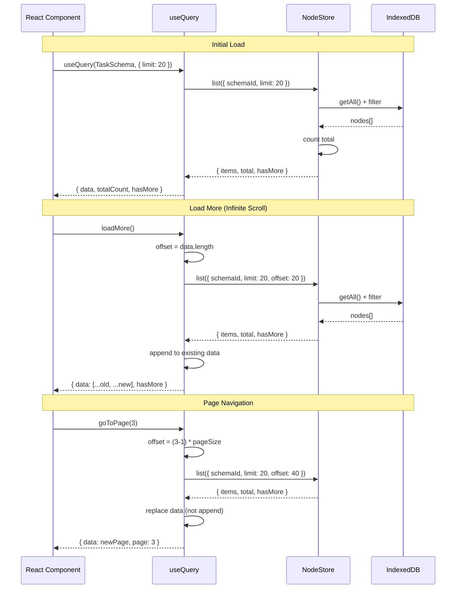
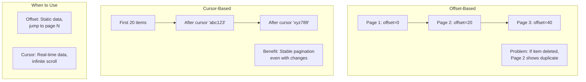
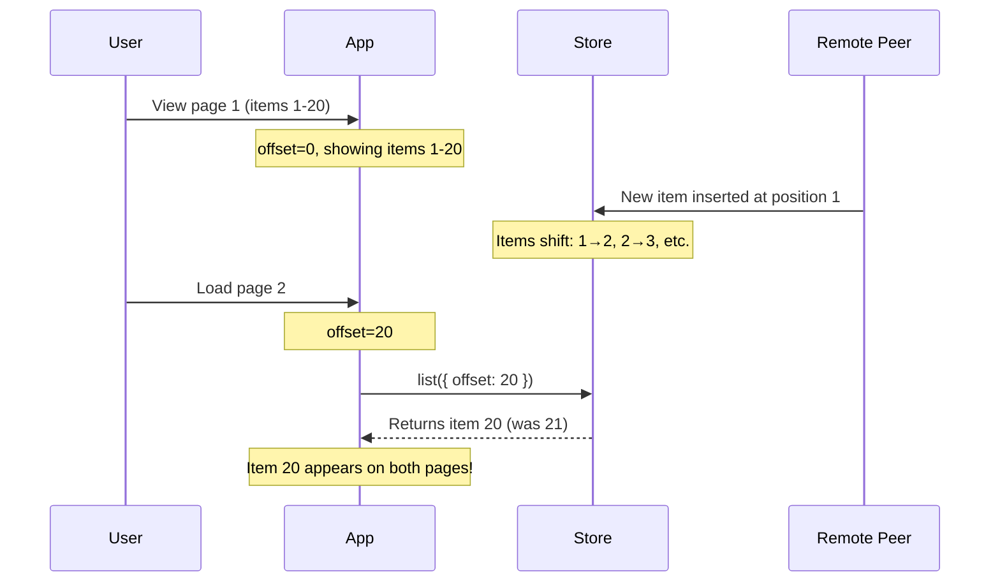
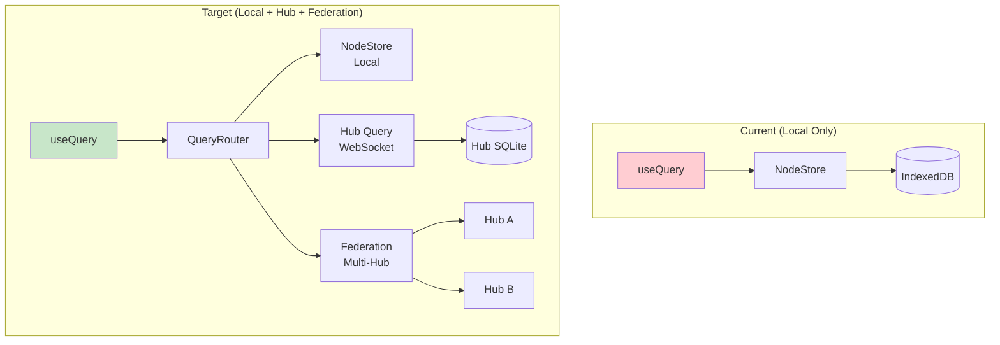
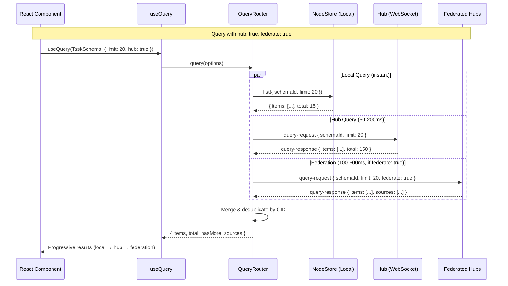
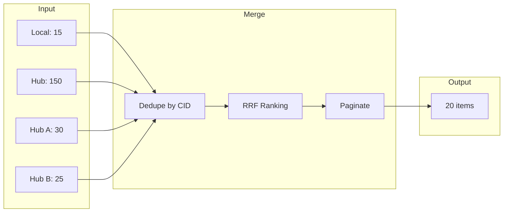
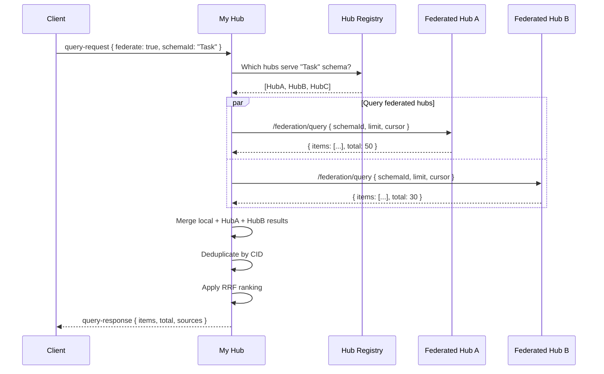

# 0037: useQuery Pagination

> Exploration of pagination patterns for the `useQuery` hook in `@xnet/react`

## Status: Exploration

## Problem Statement

The current `useQuery` hook in `@xnet/react` supports basic `limit` and `offset` options for pagination, but lacks:

1. **No `totalCount`** - Can't show "Page 1 of 10" or progress indicators
2. **No `hasMore`** - Can't know if more data exists without fetching
3. **No pagination helpers** - No `nextPage()`, `prevPage()`, `loadMore()` functions
4. **No cursor support** - Only offset-based pagination (problematic for real-time data)
5. **No infinite scroll pattern** - Must manually manage accumulated data

This exploration examines pagination patterns from TanStack Query, Relay, SWR, and Apollo to design an improved API.

## Current State

### Current `useQuery` API

```typescript
// packages/react/src/hooks/useQuery.ts
interface QueryFilter<P> {
  where?: Partial<InferCreateProps<P>>
  includeDeleted?: boolean
  orderBy?: { [K in keyof InferCreateProps<P>]?: 'asc' | 'desc' }
  limit?: number // Supported but basic
  offset?: number // Supported but basic
}

interface QueryListResult<P> {
  data: FlatNode<P>[]
  loading: boolean
  error: Error | null
  reload: () => Promise<void>
}
```

### Existing `@xnet/query` Types

The `@xnet/query` package already has a more complete `QueryResult` type:

```typescript
// packages/query/src/types.ts
interface QueryResult<T> {
  items: T[]
  total: number // Total count before pagination
  hasMore: boolean // Whether more results exist
  cursor?: string // For cursor-based pagination
}
```

## Research: Industry Patterns

### TanStack Query - Paginated Queries

```typescript
// Offset-based with keepPreviousData
const { data, isPreviousData } = useQuery({
  queryKey: ['projects', page],
  queryFn: () => fetchProjects(page),
  placeholderData: keepPreviousData // Show old data while loading new
})

// Infinite queries
const { data, fetchNextPage, hasNextPage, isFetchingNextPage } = useInfiniteQuery({
  queryKey: ['projects'],
  queryFn: ({ pageParam }) => fetchProjects(pageParam),
  initialPageParam: 0,
  getNextPageParam: (lastPage) => lastPage.nextCursor
})

// Access all pages
const allItems = data.pages.flatMap((page) => page.items)
```

**Key insights:**

- Separate hooks for paginated vs infinite queries
- `keepPreviousData` prevents flicker during page transitions
- `pageParam` abstraction works for both offset and cursor
- `getNextPageParam` function determines if more pages exist

### Relay - Cursor-Based Pagination

```typescript
const { data, loadNext, hasNext, isLoadingNext } = usePaginationFragment(
  graphql`
    fragment FriendsList on User
    @refetchable(queryName: "FriendsListPaginationQuery") {
      friends(first: $count, after: $cursor)
      @connection(key: "FriendsList_friends") {
        edges { node { name } }
        pageInfo { endCursor, hasNextPage }
      }
    }
  `,
  userRef
)

// Load more
<Button onClick={() => loadNext(10)}>Load more</Button>
```

**Key insights:**

- Cursor-based pagination built into GraphQL schema
- `@connection` directive handles list accumulation automatically
- `pageInfo` is standardized (endCursor, hasNextPage, hasPreviousPage, startCursor)
- Bi-directional pagination with `loadNext` and `loadPrevious`

### Apollo Client - Field Policies

```typescript
// Offset-based with automatic merging
const cache = new InMemoryCache({
  typePolicies: {
    Query: {
      fields: {
        posts: offsetLimitPagination(['category']) // keyArgs
      }
    }
  }
})

// Cursor-based with Relay style
const cache = new InMemoryCache({
  typePolicies: {
    Query: {
      fields: {
        comments: relayStylePagination()
      }
    }
  }
})

// Component uses fetchMore
const { data, fetchMore } = useQuery(POSTS_QUERY)

fetchMore({
  variables: { offset: data.posts.length }
})
```

**Key insights:**

- Pagination logic in cache layer, not component
- `keyArgs` determines cache identity (e.g., different categories = different lists)
- `merge` function controls how pages combine
- Works with any pagination style via custom field policies

## Architecture

### Data Flow with Pagination



### Cursor vs Offset Pagination



## Proposed API

### Option A: Extended QueryFilter (Minimal Change)

Add pagination metadata to existing hook:

```typescript
interface QueryFilter<P> {
  // Existing
  where?: Partial<InferCreateProps<P>>
  orderBy?: { [K in keyof InferCreateProps<P>]?: 'asc' | 'desc' }
  includeDeleted?: boolean

  // Pagination
  limit?: number
  offset?: number
  cursor?: string // NEW: cursor-based pagination
}

interface QueryListResult<P> {
  // Existing
  data: FlatNode<P>[]
  loading: boolean
  error: Error | null
  reload: () => Promise<void>

  // NEW: Pagination metadata
  totalCount: number | null // null if count not available
  hasMore: boolean

  // NEW: Pagination helpers
  loadMore: (count?: number) => Promise<void> // For infinite scroll
  nextPage: () => Promise<void> // For page-based
  prevPage: () => Promise<void> // For page-based
  goToPage: (page: number) => Promise<void>

  // NEW: Current pagination state
  pagination: {
    page: number
    pageSize: number
    totalPages: number | null
  }
}
```

**Usage:**

```typescript
// Infinite scroll
const { data, loadMore, hasMore, loading } = useQuery(TaskSchema, { limit: 20 })

return (
  <>
    {data.map(task => <TaskCard key={task.id} task={task} />)}
    {hasMore && (
      <button onClick={() => loadMore()} disabled={loading}>
        Load more
      </button>
    )}
  </>
)

// Page-based
const { data, pagination, goToPage } = useQuery(TaskSchema, {
  limit: 20,
  offset: 0
})

return (
  <>
    {data.map(task => <TaskCard key={task.id} task={task} />)}
    <Paginator
      page={pagination.page}
      totalPages={pagination.totalPages}
      onPageChange={goToPage}
    />
  </>
)
```

### Option B: Separate usePaginatedQuery Hook

Keep `useQuery` simple, add specialized hook:

```typescript
// Simple list (no pagination)
const { data } = useQuery(TaskSchema)

// Paginated list with full control
const {
  data,
  page,
  pageSize,
  totalCount,
  totalPages,
  hasNextPage,
  hasPrevPage,
  nextPage,
  prevPage,
  goToPage,
  setPageSize,
  loading,
  error
} = usePaginatedQuery(TaskSchema, {
  where: { status: 'active' },
  orderBy: { createdAt: 'desc' },
  pageSize: 20,
  initialPage: 1
})
```

### Option C: useInfiniteQuery Hook (Recommended for Real-time)

Separate hook optimized for infinite scroll with cursor support:

```typescript
interface UseInfiniteQueryOptions<P> {
  where?: Partial<InferCreateProps<P>>
  orderBy?: { [K in keyof InferCreateProps<P>]?: 'asc' | 'desc' }
  pageSize?: number // default: 20
}

interface UseInfiniteQueryResult<P> {
  data: FlatNode<P>[] // All loaded items (accumulated)
  loading: boolean // Initial load
  loadingMore: boolean // Subsequent loads
  error: Error | null

  hasMore: boolean
  loadMore: () => Promise<void>

  // For virtualized lists
  totalCount: number | null
  loadedCount: number

  // Reset to initial state
  reset: () => Promise<void>
}

function useInfiniteQuery<P>(
  schema: DefinedSchema<P>,
  options?: UseInfiniteQueryOptions<P>
): UseInfiniteQueryResult<P>
```

**Usage with virtualized list:**

```typescript
const { data, loadMore, hasMore, loadingMore, totalCount } = useInfiniteQuery(
  TaskSchema,
  { orderBy: { createdAt: 'desc' }, pageSize: 50 }
)

return (
  <VirtualList
    items={data}
    totalCount={totalCount ?? data.length}
    onEndReached={() => hasMore && loadMore()}
    renderItem={(task) => <TaskCard task={task} />}
    footer={loadingMore ? <Spinner /> : null}
  />
)
```

## Implementation Plan

### Phase 1: Storage Layer Changes

Add `countNodes` to NodeStore:

```typescript
// packages/data/src/store/store.ts
interface NodeStore {
  // Existing
  get(id: string): Promise<NodeState | null>
  list(options?: ListNodesOptions): Promise<NodeState[]>

  // NEW
  count(options?: CountNodesOptions): Promise<number>
}

interface CountNodesOptions {
  schemaId?: SchemaIRI
  where?: Record<string, unknown> // Optional: filter before counting
  includeDeleted?: boolean
}
```

### Phase 2: Enhanced useQuery

```typescript
// packages/react/src/hooks/useQuery.ts

interface QueryListResult<P> {
  data: FlatNode<P>[]
  loading: boolean
  error: Error | null
  reload: () => Promise<void>

  // Pagination (always available)
  totalCount: number | null
  hasMore: boolean
  loadMore: () => Promise<void>
}
```

### Phase 3: Dedicated Pagination Hooks

```typescript
// packages/react/src/hooks/usePaginatedQuery.ts
export function usePaginatedQuery<P>(
  schema: DefinedSchema<P>,
  options?: PaginatedQueryOptions<P>
): PaginatedQueryResult<P>

// packages/react/src/hooks/useInfiniteQuery.ts
export function useInfiniteQuery<P>(
  schema: DefinedSchema<P>,
  options?: InfiniteQueryOptions<P>
): InfiniteQueryResult<P>
```

### Phase 4: Cursor Support (Optional)

For cursor-based pagination (more complex, may not be needed initially):

```typescript
// Cursor encoding: base64({ id, sortValue })
interface CursorInfo {
  nodeId: string
  sortField: string
  sortValue: unknown
}

function encodeCursor(info: CursorInfo): string
function decodeCursor(cursor: string): CursorInfo
```

## Comparison Matrix

| Feature               | Option A (Extended) | Option B (Separate) | Option C (Infinite) |
| --------------------- | ------------------- | ------------------- | ------------------- |
| API simplicity        | Medium              | High                | High                |
| Breaking changes      | None                | None                | None                |
| Infinite scroll       | Yes                 | No (separate hook)  | Optimized           |
| Page navigation       | Yes                 | Optimized           | No                  |
| Real-time friendly    | Medium              | Medium              | High                |
| Implementation effort | Low                 | Medium              | Medium              |
| Bundle size impact    | Low                 | Medium              | Medium              |

## Recommendation

**Implement in stages:**

1. **Phase 1**: Add `totalCount` and `hasMore` to existing `useQuery` (Option A minimal)
   - Low risk, immediate value
   - Enables basic pagination UI
2. **Phase 2**: Add `useInfiniteQuery` hook (Option C)
   - Optimized for infinite scroll (common pattern)
   - Handles data accumulation automatically
   - Works well with real-time subscriptions

3. **Phase 3**: Add `usePaginatedQuery` hook (Option B) if needed
   - Only if discrete page navigation is frequently requested
   - Lower priority than infinite scroll

## Detailed Implementation

### Enhanced QueryListResult

```typescript
// packages/react/src/hooks/useQuery.ts

export interface QueryListResult<P extends Record<string, PropertyBuilder>> {
  /** The queried nodes */
  data: FlatNode<P>[]
  /** Whether currently loading initial data */
  loading: boolean
  /** Whether loading more data */
  loadingMore: boolean
  /** Any error that occurred */
  error: Error | null
  /** Reload the query from scratch */
  reload: () => Promise<void>

  // Pagination
  /** Total count of matching nodes (null if not yet loaded) */
  totalCount: number | null
  /** Whether more data is available */
  hasMore: boolean
  /** Load more data (for infinite scroll) */
  loadMore: (count?: number) => Promise<void>
  /** Current pagination state */
  pagination: PaginationState
}

export interface PaginationState {
  /** Number of items loaded */
  loadedCount: number
  /** Page size (limit) */
  pageSize: number
  /** Current offset */
  offset: number
}
```

### useInfiniteQuery Implementation Sketch

```typescript
// packages/react/src/hooks/useInfiniteQuery.ts

export function useInfiniteQuery<P extends Record<string, PropertyBuilder>>(
  schema: DefinedSchema<P>,
  options: InfiniteQueryOptions<P> = {}
): InfiniteQueryResult<P> {
  const { pageSize = 20, where, orderBy, includeDeleted } = options
  const { store, isReady } = useNodeStore()
  const schemaId = schema._schemaId

  // State
  const [pages, setPages] = useState<FlatNode<P>[][]>([])
  const [loading, setLoading] = useState(true)
  const [loadingMore, setLoadingMore] = useState(false)
  const [error, setError] = useState<Error | null>(null)
  const [totalCount, setTotalCount] = useState<number | null>(null)
  const [hasMore, setHasMore] = useState(true)

  // Flatten all pages
  const data = useMemo(() => pages.flat(), [pages])

  // Load initial page
  const loadInitial = useCallback(async () => {
    if (!store) return
    setLoading(true)
    try {
      const [nodes, count] = await Promise.all([
        store.list({ schemaId, limit: pageSize, offset: 0, includeDeleted }),
        store.count({ schemaId, includeDeleted })
      ])
      const filtered = applyWhereFilter(flattenNodes<P>(nodes), where)
      const sorted = applySorting(filtered, orderBy)
      setPages([sorted])
      setTotalCount(count)
      setHasMore(sorted.length === pageSize)
    } catch (err) {
      setError(err instanceof Error ? err : new Error(String(err)))
    } finally {
      setLoading(false)
    }
  }, [store, schemaId, pageSize, where, orderBy, includeDeleted])

  // Load more pages
  const loadMore = useCallback(async () => {
    if (!store || loadingMore || !hasMore) return
    setLoadingMore(true)
    try {
      const offset = data.length
      const nodes = await store.list({ schemaId, limit: pageSize, offset, includeDeleted })
      const filtered = applyWhereFilter(flattenNodes<P>(nodes), where)
      const sorted = applySorting(filtered, orderBy)
      setPages((prev) => [...prev, sorted])
      setHasMore(sorted.length === pageSize)
    } catch (err) {
      setError(err instanceof Error ? err : new Error(String(err)))
    } finally {
      setLoadingMore(false)
    }
  }, [store, schemaId, pageSize, data.length, where, orderBy, includeDeleted, loadingMore, hasMore])

  // Reset to initial state
  const reset = useCallback(async () => {
    setPages([])
    setHasMore(true)
    await loadInitial()
  }, [loadInitial])

  // Auto-load on mount
  useEffect(() => {
    if (isReady) loadInitial()
  }, [isReady, loadInitial])

  // Subscribe to changes (append new items, update existing)
  useEffect(() => {
    if (!store) return
    return store.subscribe((event) => {
      // Handle real-time updates while preserving pagination
      // ... subscription logic
    })
  }, [store, schemaId, where])

  return {
    data,
    loading,
    loadingMore,
    error,
    hasMore,
    loadMore,
    totalCount,
    loadedCount: data.length,
    reset
  }
}
```

## Real-time Considerations

### Problem: New Items During Pagination

When using offset-based pagination with real-time data:



### Solution: Hybrid Approach

```typescript
// For infinite scroll: prepend new items, don't shift
useEffect(() => {
  return store.subscribe((event) => {
    if (event.type === 'created' && matchesFilter(event.node)) {
      // Prepend to first page (user sees new items at top)
      setPages((prev) => {
        const [firstPage, ...rest] = prev
        return [[flattenNode(event.node), ...firstPage], ...rest]
      })
      // Increment total count
      setTotalCount((prev) => (prev !== null ? prev + 1 : null))
    }
  })
}, [store, matchesFilter])
```

## Testing Strategy

```typescript
describe('useInfiniteQuery', () => {
  it('loads initial page', async () => {
    const { result } = renderHook(() => useInfiniteQuery(TaskSchema, { pageSize: 10 }))

    await waitFor(() => expect(result.current.loading).toBe(false))

    expect(result.current.data).toHaveLength(10)
    expect(result.current.hasMore).toBe(true)
    expect(result.current.totalCount).toBe(50) // assuming 50 total
  })

  it('loads more on demand', async () => {
    const { result } = renderHook(() => useInfiniteQuery(TaskSchema, { pageSize: 10 }))

    await waitFor(() => expect(result.current.loading).toBe(false))

    act(() => {
      result.current.loadMore()
    })

    await waitFor(() => expect(result.current.loadingMore).toBe(false))

    expect(result.current.data).toHaveLength(20)
  })

  it('handles real-time inserts', async () => {
    const { result } = renderHook(() => useInfiniteQuery(TaskSchema, { pageSize: 10 }))

    await waitFor(() => expect(result.current.loading).toBe(false))
    const initialCount = result.current.data.length

    // Simulate new item from sync
    act(() => {
      store.emit('change', { type: 'created', node: newTask })
    })

    expect(result.current.data).toHaveLength(initialCount + 1)
    expect(result.current.data[0].id).toBe(newTask.id) // prepended
  })

  it('resets pagination', async () => {
    const { result } = renderHook(() => useInfiniteQuery(TaskSchema, { pageSize: 10 }))

    await waitFor(() => expect(result.current.loading).toBe(false))
    act(() => {
      result.current.loadMore()
    })
    await waitFor(() => expect(result.current.data).toHaveLength(20))

    act(() => {
      result.current.reset()
    })

    await waitFor(() => expect(result.current.data).toHaveLength(10))
  })
})
```

## Migration Path

### Backward Compatibility

The enhanced `useQuery` is fully backward compatible:

```typescript
// Before (still works)
const { data, loading } = useQuery(TaskSchema, { limit: 20 })

// After (new features available)
const { data, loading, hasMore, loadMore, totalCount } = useQuery(TaskSchema, { limit: 20 })

// Ignore new fields if not needed
const { data } = useQuery(TaskSchema, { limit: 20 })
```

### Gradual Adoption

1. **Week 1**: Add `totalCount` and `hasMore` to `useQuery`
2. **Week 2**: Add `loadMore` to `useQuery` for basic infinite scroll
3. **Week 3**: Add `useInfiniteQuery` for optimized infinite scroll
4. **Week 4**: Add `usePaginatedQuery` for page-based navigation (if needed)

## Open Questions

1. **Should `totalCount` be opt-in?** Counting can be expensive for large datasets. Consider:

   ```typescript
   useQuery(TaskSchema, { limit: 20, countTotal: true })
   ```

2. **How to handle filters with totalCount?** If `where` filtering is client-side, `totalCount` from storage won't match filtered count. Options:
   - Return both `totalCount` (storage) and `filteredCount` (after where)
   - Only count filtered items (requires storage-level filtering)

3. **Cursor format for xNet?** If implementing cursor-based pagination:
   - Base64 encoded `{ nodeId, sortField, sortValue }`
   - Or opaque string from storage layer

4. **Virtual list integration?** Should we provide a `useVirtualInfiniteQuery` that integrates with react-virtual/react-window?

5. **Hub query latency?** Remote hub queries add 50-200ms latency. Should pagination be:
   - Local-first with hub results streaming in?
   - Hub-authoritative with local as cache?

6. **Federation result merging?** When querying multiple hubs, how to handle:
   - Different total counts from each hub?
   - Duplicate items (same CID) across hubs?
   - Inconsistent sort orders?

---

## Part 2: Remote Hub & Federated Query Support

This section extends the pagination design to support querying remote hubs and federated multi-hub queries, as defined in [plan03_8HubPhase1VPS](../plans/plan03_8HubPhase1VPS/README.md).

### Current Architecture Gap

The current `useQuery` only queries local `NodeStore` (IndexedDB). The Hub architecture introduces:

1. **Hub as always-on sync peer** - Hub has complete workspace data via Yjs/NodeChange relay
2. **Hub query endpoint** - FTS5 + structured queries over WebSocket
3. **Hub federation** - Hub-to-hub queries for cross-organization search
4. **Three-tier search** - Local → Workspace (Hub) → Global (Federated Hubs)



### Hub Query Protocol

The Hub exposes queries over the existing WebSocket connection (same as sync):

```typescript
// Client → Hub (over WebSocket)
interface HubQueryRequest {
  type: 'query-request'
  queryId: string
  schemaId?: SchemaIRI
  where?: Record<string, unknown>
  orderBy?: { field: string; direction: 'asc' | 'desc' }[]
  limit: number
  offset?: number
  cursor?: string
  text?: string // Full-text search
  federate?: boolean // Query federated hubs too
}

// Hub → Client
interface HubQueryResponse {
  type: 'query-response'
  queryId: string
  items: NodeState[]
  total: number
  hasMore: boolean
  cursor?: string
  sources: QuerySource[] // Which hubs contributed results
  executionMs: number
}

interface QuerySource {
  hubId: string
  hubUrl: string
  itemCount: number
  latencyMs: number
}
```

### Data Flow: Local + Hub + Federation



### Proposed API: Extended Options

```typescript
interface QueryFilter<P> {
  // Existing local options
  where?: Partial<InferCreateProps<P>>
  orderBy?: { [K in keyof InferCreateProps<P>]?: 'asc' | 'desc' }
  includeDeleted?: boolean
  limit?: number
  offset?: number
  cursor?: string

  // NEW: Remote query options
  source?: QuerySource
  hub?: boolean | HubQueryOptions
  federate?: boolean | FederateOptions
  text?: string // Full-text search (hub-only)
}

type QuerySource = 'local' | 'hub' | 'federation' | 'auto'

interface HubQueryOptions {
  /** Hub URL (defaults to configured hub) */
  url?: string
  /** Timeout in ms (default: 5000) */
  timeout?: number
  /** Use hub as authoritative source (vs local-first) */
  authoritative?: boolean
}

interface FederateOptions {
  /** Max number of hubs to query (default: 5) */
  maxHubs?: number
  /** Timeout per hub in ms (default: 3000) */
  timeout?: number
  /** Only query hubs serving this schema */
  schemaRouting?: boolean
}
```

### Proposed API: Extended Result

```typescript
interface QueryListResult<P> {
  // Existing
  data: FlatNode<P>[]
  loading: boolean
  error: Error | null
  reload: () => Promise<void>

  // Pagination
  totalCount: number | null
  hasMore: boolean
  loadMore: () => Promise<void>

  // NEW: Source information
  sources: {
    local: { count: number; latencyMs: number }
    hub?: { count: number; latencyMs: number; url: string }
    federation?: {
      hubs: { url: string; count: number; latencyMs: number }[]
      totalHubs: number
    }
  }

  // NEW: Loading states per source
  loadingStates: {
    local: boolean
    hub: boolean
    federation: boolean
  }
}
```

### Progressive Loading Pattern

Results appear progressively as each tier responds:

```typescript
function TaskList() {
  const { data, loadingStates, sources } = useQuery(TaskSchema, {
    limit: 20,
    hub: true,
    federate: true
  })

  return (
    <>
      {/* Results appear progressively */}
      {data.map((task) => (
        <TaskCard key={task.id} task={task} />
      ))}

      {/* Show loading indicators per tier */}
      <div className="text-sm text-gray-500">
        {loadingStates.local && <Spinner size="sm" />}
        {!loadingStates.local && `${sources.local.count} local`}
        {' | '}
        {loadingStates.hub && <Spinner size="sm" />}
        {!loadingStates.hub && sources.hub && `${sources.hub.count} from hub`}
        {' | '}
        {loadingStates.federation && <Spinner size="sm" />}
        {!loadingStates.federation &&
          sources.federation &&
          `${sources.federation.hubs.length} hubs queried`}
      </div>
    </>
  )
}
```

### Result Merging Strategy

When combining results from multiple sources:



```typescript
function mergeQueryResults<P>(
  local: QueryResult<P>,
  hub: QueryResult<P> | null,
  federation: QueryResult<P>[] | null,
  options: { limit: number; offset: number }
): MergedQueryResult<P> {
  const allItems: Array<FlatNode<P> & { _source: string; _score: number }> = []

  // Collect all results with source attribution
  for (const item of local.items) {
    allItems.push({ ...item, _source: 'local', _score: 1.0 })
  }

  if (hub) {
    for (const item of hub.items) {
      allItems.push({ ...item, _source: 'hub', _score: 0.9 })
    }
  }

  if (federation) {
    for (const result of federation) {
      for (const item of result.items) {
        allItems.push({ ...item, _source: result.hubUrl, _score: 0.8 })
      }
    }
  }

  // Deduplicate by CID (content hash)
  const seen = new Map<string, (typeof allItems)[0]>()
  for (const item of allItems) {
    const cid = item.id // Or compute from content hash
    if (!seen.has(cid) || seen.get(cid)!._score < item._score) {
      seen.set(cid, item) // Keep highest-scored duplicate
    }
  }

  // Apply Reciprocal Rank Fusion for final ranking
  const ranked = reciprocalRankFusion([...seen.values()])

  // Apply pagination
  const paginated = ranked.slice(options.offset, options.offset + options.limit)

  // Calculate total (sum of unique items across all sources)
  const totalCount = Math.max(local.total, hub?.total ?? 0, ...federation.map((f) => f.total))

  return {
    items: paginated,
    totalCount,
    hasMore: options.offset + options.limit < totalCount,
    sources: {
      /* ... */
    }
  }
}
```

### Hub-Specific Pagination Considerations

#### 1. Total Count Accuracy

Local `totalCount` may differ from Hub's count (Hub has complete data, local may have subset):

```typescript
interface PaginationState {
  // Local count (what we have locally)
  localCount: number

  // Hub count (authoritative if connected)
  hubCount: number | null

  // Use hub count when available, fall back to local
  get totalCount(): number
}
```

#### 2. Cursor Synchronization

Cursors must work across local and remote:

```typescript
interface UnifiedCursor {
  // Local cursor (IndexedDB position)
  local?: { nodeId: string; sortValue: unknown }

  // Hub cursor (server-provided opaque token)
  hub?: string

  // Federation cursors (per-hub)
  federation?: Record<string, string>
}

// Encode as single cursor string for API
function encodeCursor(cursor: UnifiedCursor): string {
  return btoa(JSON.stringify(cursor))
}
```

#### 3. Offline Behavior

When Hub is unreachable:

```typescript
const { data, sources, error } = useQuery(TaskSchema, {
  hub: true,
  federate: true
})

// Graceful degradation
if (sources.hub === null) {
  // Hub offline - show local results only
  // UI can indicate "showing cached results"
}

if (error?.code === 'HUB_TIMEOUT') {
  // Partial results available
  // data contains local + any federation results that succeeded
}
```

### Federation Query Flow



### Schema-Based Query Routing

Queries can be routed to hubs that serve specific schemas:

```typescript
interface FederationConfig {
  // Hub capabilities (advertised to federation)
  serves: {
    schemas: SchemaIRI[]
    capabilities: ('fulltext' | 'vector' | 'structured')[]
  }

  // Peer hubs and what they serve
  peers: {
    url: string
    did: string
    schemas: SchemaIRI[]
    trustLevel: 'full' | 'metadata-only'
  }[]
}

// Query routing
function routeQuery(query: HubQueryRequest, config: FederationConfig): string[] {
  if (!query.schemaId) {
    // No schema filter - query all peers
    return config.peers.map((p) => p.url)
  }

  // Route to hubs serving this schema
  return config.peers.filter((p) => p.schemas.includes(query.schemaId!)).map((p) => p.url)
}
```

### Implementation Phases (Extended)

#### Phase 5: Hub Query Integration

```typescript
// packages/react/src/hooks/useQuery.ts - Add hub support

const loadFromHub = useCallback(async () => {
  if (!hubOptions || !connectionManager) return null

  const queryId = crypto.randomUUID()
  const request: HubQueryRequest = {
    type: 'query-request',
    queryId,
    schemaId,
    where: filter.where,
    orderBy: filter.orderBy,
    limit: filter.limit ?? 20,
    offset: filter.offset ?? 0,
    cursor: filter.cursor
  }

  return new Promise<HubQueryResponse>((resolve, reject) => {
    const timeout = setTimeout(
      () => reject(new Error('Hub query timeout')),
      hubOptions.timeout ?? 5000
    )

    connectionManager.sendQuery(request, (response) => {
      clearTimeout(timeout)
      resolve(response)
    })
  })
}, [connectionManager, schemaId, filter, hubOptions])
```

#### Phase 6: Federation Support

```typescript
// packages/react/src/hooks/useQuery.ts - Add federation

const loadFromFederation = useCallback(async () => {
  if (!federateOptions) return null

  // Federation is handled by the hub - we just set the flag
  const request: HubQueryRequest = {
    ...baseRequest,
    federate: true
  }

  const response = await sendHubQuery(request)

  // Response includes results from all federated hubs
  return {
    items: response.items,
    total: response.total,
    sources: response.sources
  }
}, [federateOptions, baseRequest])
```

#### Phase 7: Progressive Results Hook

```typescript
// packages/react/src/hooks/useProgressiveQuery.ts

export function useProgressiveQuery<P>(
  schema: DefinedSchema<P>,
  options: ProgressiveQueryOptions<P>
): ProgressiveQueryResult<P> {
  const [localResult, setLocalResult] = useState<QueryResult<P> | null>(null)
  const [hubResult, setHubResult] = useState<QueryResult<P> | null>(null)
  const [fedResult, setFedResult] = useState<QueryResult<P>[] | null>(null)

  const [loadingStates, setLoadingStates] = useState({
    local: true,
    hub: !!options.hub,
    federation: !!options.federate
  })

  // Load local immediately
  useEffect(() => {
    loadLocal().then((result) => {
      setLocalResult(result)
      setLoadingStates((s) => ({ ...s, local: false }))
    })
  }, [loadLocal])

  // Load hub in parallel
  useEffect(() => {
    if (!options.hub) return
    loadHub().then((result) => {
      setHubResult(result)
      setLoadingStates((s) => ({ ...s, hub: false }))
    })
  }, [loadHub, options.hub])

  // Load federation in parallel
  useEffect(() => {
    if (!options.federate) return
    loadFederation().then((result) => {
      setFedResult(result)
      setLoadingStates((s) => ({ ...s, federation: false }))
    })
  }, [loadFederation, options.federate])

  // Merge results as they arrive
  const mergedData = useMemo(() => {
    return mergeQueryResults(localResult, hubResult, fedResult, {
      limit: options.limit ?? 20,
      offset: options.offset ?? 0
    })
  }, [localResult, hubResult, fedResult, options.limit, options.offset])

  return {
    data: mergedData.items,
    totalCount: mergedData.totalCount,
    hasMore: mergedData.hasMore,
    loadingStates,
    sources: mergedData.sources,
    loading: loadingStates.local, // Consider "loading" only for local
    loadingAny: Object.values(loadingStates).some(Boolean),
    error: null,
    reload: async () => {
      /* ... */
    },
    loadMore: async () => {
      /* ... */
    }
  }
}
```

### Privacy Considerations

| Query Type | What Hub Sees                    | What Federated Hubs See          |
| ---------- | -------------------------------- | -------------------------------- |
| Local only | Nothing                          | Nothing                          |
| Hub query  | Query terms, schema, user DID    | Nothing                          |
| Federated  | Query terms, schema, user DID    | Query terms, schema, hub DID     |
| Full-text  | Search text, highlighted results | Search text (if hub forwards)    |
| Encrypted  | HMAC-hashed terms only           | HMAC-hashed terms (if forwarded) |

**Mitigations:**

1. `source: 'local'` for sensitive queries
2. Hub is user-chosen (self-host for full control)
3. Federation is opt-in per query
4. Encrypted workspace search (HMAC terms)

### Comparison: Local vs Hub vs Federation

| Aspect           | Local Only         | With Hub              | With Federation         |
| ---------------- | ------------------ | --------------------- | ----------------------- |
| Latency          | <10ms              | 50-200ms              | 100-500ms               |
| Completeness     | Only synced data   | All workspace data    | Cross-organization      |
| Offline          | Full functionality | Graceful degradation  | Local fallback          |
| Total count      | Local count only   | Accurate count        | Aggregated estimate     |
| Full-text search | MiniSearch (basic) | FTS5 (advanced)       | FTS5 across hubs        |
| Vector search    | On-device (slow)   | Server-side (fast)    | Distributed             |
| Privacy          | Maximum            | Trust hub operator    | Trust federated hubs    |
| Real-time        | Instant updates    | Sync delay (~1s)      | Higher latency          |
| Pagination       | Cursor/offset      | Server-side efficient | Coordinated across hubs |

## References

- [TanStack Query - Paginated Queries](https://tanstack.com/query/latest/docs/framework/react/guides/paginated-queries)
- [TanStack Query - Infinite Queries](https://tanstack.com/query/latest/docs/framework/react/guides/infinite-queries)
- [Relay - Pagination](https://relay.dev/docs/guided-tour/list-data/pagination/)
- [Apollo - Pagination](https://www.apollographql.com/docs/react/pagination/overview/)
- [Understanding Pagination](https://www.apollographql.com/blog/understanding-pagination-rest-graphql-and-relay)

---

[Back to Explorations](./README.md)
