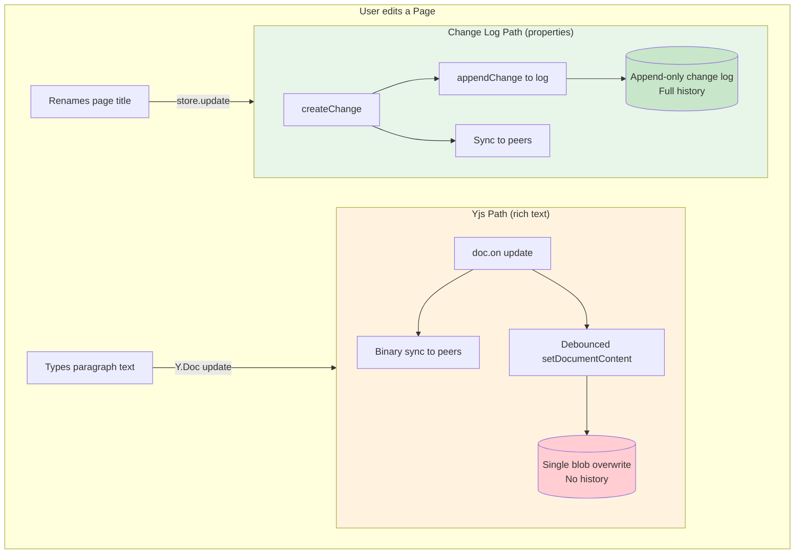
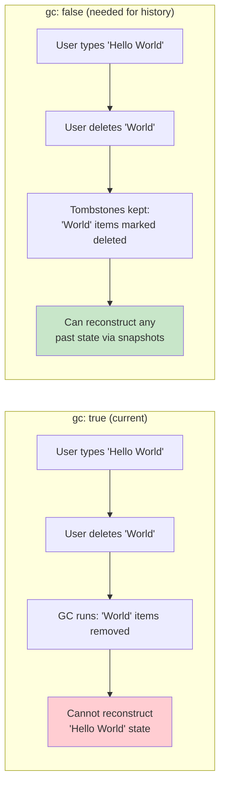
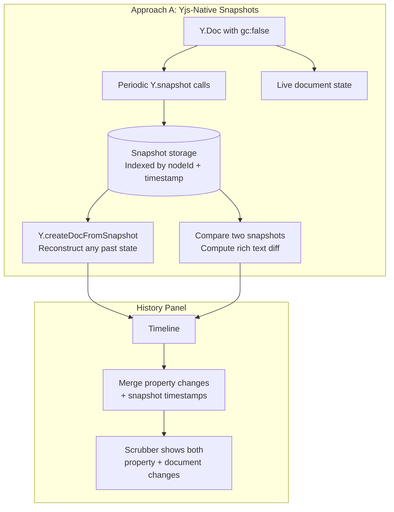
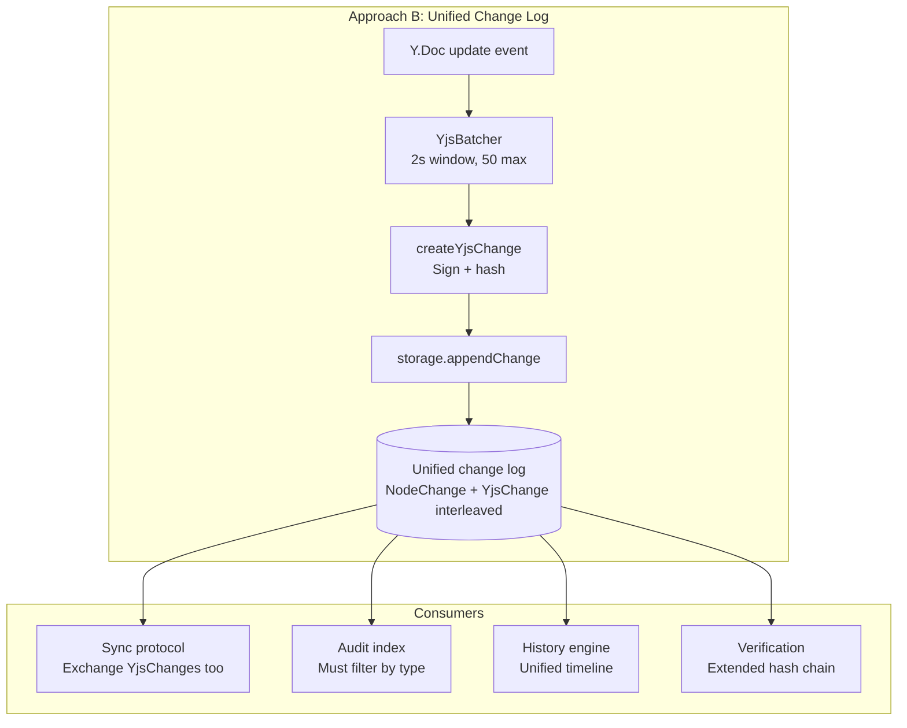
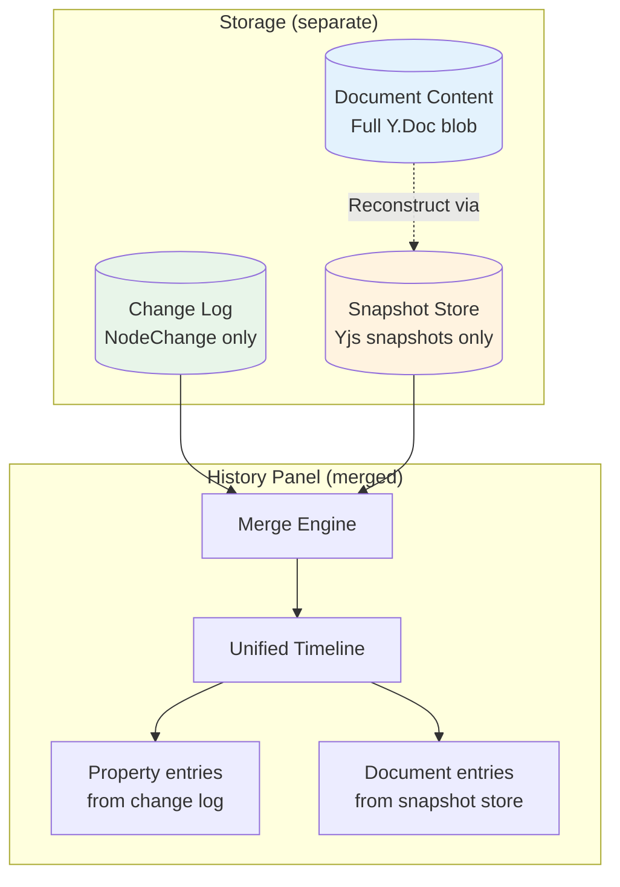
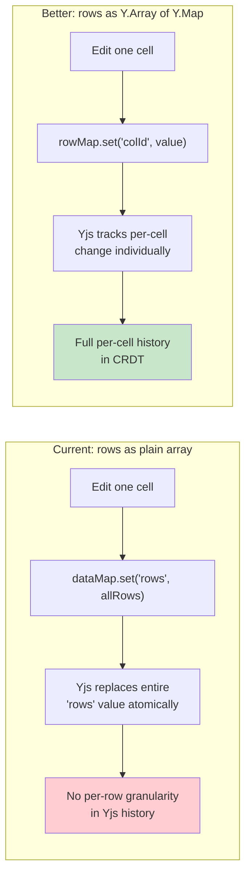

# Yjs History Integration: Unified Timeline for Rich Text & Structured Data

> How should the History devtools panel show Yjs document changes alongside NodeStore property changes? Should Yjs updates live in the change log? What are the tradeoffs?

## Context

xNet nodes have **two independent data paths** (see [0026_NODE_CHANGE_ARCHITECTURE.md](./0026_[x]_NODE_CHANGE_ARCHITECTURE.md)):

1. **Structured properties** (title, icon, status) — stored as `Change<NodePayload>` in the change log, synced via LWW event sourcing
2. **Rich document content** (text, rows, diagrams) — stored as a `Y.Doc` binary blob via `setDocumentContent()`, synced via Yjs CRDT protocol

The History panel currently only shows path #1. A user scrubbing through a page's history sees title/icon changes but not the hundreds of text edits that constitute the page's actual content. For databases, row mutations are invisible because rows live inside the Y.Doc, not in the change log.

---

## Current Architecture



**The gap:** Yjs document content has no incremental history in storage. `setDocumentContent()` overwrites the previous blob entirely. The change log only records property mutations.

---

## Yjs Already Stores History (in its CRDT)

Yjs is a CRDT — it doesn't just store current state, it stores the **full operation history** needed for conflict-free merging. Every character insertion, deletion, and formatting change is an `Item` in the internal `StructStore`. This history powers:

- **Conflict resolution** — concurrent edits merge automatically
- **Sync** — computing diffs between peers via state vectors
- **Snapshots** — `Y.snapshot(doc)` captures a point-in-time reference

### Available Yjs APIs

```typescript
// Capture current state as a lightweight reference
const snap = Y.snapshot(doc)

// Reconstruct document at a past snapshot (REQUIRES gc: false)
const historicalDoc = Y.createDocFromSnapshot(doc, snap)

// Snapshot-aware type reading (no full doc reconstruction)
const mapAtSnapshot = Y.typeMapGetAllSnapshot(doc.getMap('meta'), snap)
const arrayAtSnapshot = Y.typeListToArraySnapshot(doc.getArray('blocks'), snap)

// Serialize snapshots for storage
const bytes = Y.encodeSnapshot(snap)
const restored = Y.decodeSnapshot(bytes)
```

### The gc Constraint

**Critical:** `Y.createDocFromSnapshot()` requires the origin doc to have been created with `gc: false`. Currently, **every Y.Doc in xNet uses the default `gc: true`**, meaning deleted items are garbage-collected and historical reconstruction is impossible.



**Sites that create Y.Docs (would all need `gc: false`):**

| Location            | File                                         |
| ------------------- | -------------------------------------------- |
| Document factory    | `packages/data/src/document.ts`              |
| Node pool           | `packages/react/src/sync/node-pool.ts`       |
| useNode fallback    | `packages/react/src/hooks/useNode.ts`        |
| Canvas store        | `packages/canvas/src/store.ts`               |
| BSM (Electron main) | `apps/electron/src/main/bsm.ts`              |
| Seed panel          | `packages/devtools/src/panels/Seed/Seed.tsx` |

---

## Three Approaches to Yjs History

### Approach A: Yjs-Native Snapshots (Recommended)

Use Yjs's built-in snapshot mechanism. Don't put Yjs updates in the change log at all.



**How it works:**

1. Switch all Y.Doc creation to `gc: false`
2. Capture `Y.snapshot(doc)` periodically (on save, on paragraph breaks, every N seconds)
3. Store serialized snapshots in a dedicated store (IndexedDB `snapshots` table)
4. History panel merges snapshot timestamps with property change timestamps into a unified timeline
5. Scrubbing to a snapshot reconstructs the doc via `Y.createDocFromSnapshot()`

**Pros:**

- Uses Yjs's own CRDT history — no data duplication
- Snapshots are tiny (just a state vector + delete set, typically <1KB)
- Reconstruction is fast (Yjs handles it natively)
- No changes to the change log, audit index, or sync protocol
- Works with existing Yjs sync — peers can send snapshots as part of sync

**Cons:**

- Requires `gc: false` on all docs — increased memory/storage (2-5x for long-lived docs)
- Cannot retroactively add history to existing docs created with `gc: true`
- Snapshot granularity depends on capture frequency (not per-keystroke)
- `Y.createDocFromSnapshot()` reconstructs the whole doc, not just a diff

**Storage cost of `gc: false`:**

| Document type                           | `gc: true` size | `gc: false` estimate | Notes                    |
| --------------------------------------- | --------------- | -------------------- | ------------------------ |
| Short page (1K chars, few edits)        | ~2KB            | ~3KB                 | Minimal overhead         |
| Medium page (10K chars, moderate edits) | ~15KB           | ~30-50KB             | 2-3x                     |
| Heavy page (50K chars, heavy editing)   | ~60KB           | ~200-400KB           | Can be 5-7x              |
| Database (100 rows)                     | ~50KB           | ~100-500KB           | Depends on edit patterns |

### Approach B: Yjs Updates in the Change Log

Persist batched Yjs updates as `Change<YjsUpdatePayload>` entries in the same change log as `NodeChange`.



**How it works:**

1. Wire `doc.on('update', ...)` through `YjsBatcher` with `onFlush` calling `createYjsChange()` + `storage.appendChange()`
2. Widen `NodeStorageAdapter.appendChange()` to accept `NodeChange | YjsChange`
3. Add `isYjsChange()` guards to all consumers (audit, history, verification, diff, blame)
4. Extend sync protocol to exchange `YjsChange` objects alongside `NodeChange`

**Pros:**

- True unified timeline — every keystroke batch appears alongside property changes
- Full audit trail with cryptographic signatures on document edits
- Single source of truth for all history
- Leverages existing infrastructure (`Change<T>`, hash chain, Lamport timestamps)

**Cons:**

- **Massive storage cost.** A 2-second batch of Yjs updates for a paragraph of typing is ~1-5KB. A 1-hour editing session at 30 batches/minute = 1,800 changes = 2-9MB of change log per node per hour. This dwarfs property changes (~200 bytes each).
- **Breaking changes everywhere.** Every consumer of `getChanges()` / `getAllChanges()` must handle both types. The audit index, blame engine, diff engine, verification engine, pruning engine, and undo manager all assume `Change<NodePayload>`.
- **Redundant data.** The Yjs updates are already stored in the Y.Doc blob. Persisting them again in the change log doubles storage.
- **Hash computation is expensive for Yjs updates.** `Uint8Array` serializes to verbose JSON (`{"0":65,"1":66,...}`), making BLAKE3 hashing and canonical JSON slow.
- **Sync complexity.** Two sync protocols would need to be unified or at least coordinated to avoid conflicts.

### Approach C: Hybrid — Parallel Stores with Merged Timeline

Keep Yjs and NodeStore data separate in storage, but merge them at the presentation layer (History panel).



**How it works:**

1. Keep the change log for `NodeChange` only (no type widening needed)
2. Add a `SnapshotStore` for periodic Yjs snapshots (separate IndexedDB table)
3. History panel's merge engine interleaves property changes and snapshot timestamps by `wallTime`
4. Scrubbing a property change materializes via `HistoryEngine` (existing)
5. Scrubbing a document change reconstructs via `Y.createDocFromSnapshot()` (new)

**Pros:**

- No breaking changes to existing change log consumers
- Clean separation of concerns
- Moderate storage overhead (only snapshots, not all updates)
- Can be implemented incrementally

**Cons:**

- Two separate stores to query and maintain
- Timeline merging adds complexity
- No cryptographic chain linking document edits to property edits
- Still requires `gc: false` for snapshot reconstruction

---

## Comparison Matrix

| Factor                            | A: Yjs Snapshots       | B: Unified Log                        | C: Hybrid             |
| --------------------------------- | ---------------------- | ------------------------------------- | --------------------- |
| **Storage overhead**              | Low (snapshots ~1KB)   | Very high (updates ~5KB/batch)        | Low-medium            |
| **Breaking changes**              | Minimal (add gc:false) | Extensive (every consumer)            | Minimal               |
| **Timeline granularity**          | Per-snapshot interval  | Per-batch (2s)                        | Per-snapshot interval |
| **Audit trail for doc edits**     | No (snapshots only)    | Yes (signed changes)                  | No                    |
| **Implementation effort**         | Medium                 | Very high                             | Medium                |
| **Sync protocol changes**         | None                   | Major                                 | None                  |
| **Retroactive for existing docs** | No (need gc:false)     | No (need gc:false for reconstruction) | No                    |
| **Risk**                          | Low                    | High                                  | Low                   |

---

## Database Row History

Database rows are stored as a plain JS array in `Y.Map.set('rows', [...])`. This has important implications:



**Current behavior:** When someone edits one cell in a 100-row database, the entire `rows` array (~50-100KB) is replaced. Two users editing different cells will conflict at the Yjs level (LWW on the `'rows'` key).

**To get per-row/per-cell history in the future**, rows should be migrated from a plain JS array to nested Yjs types:

```
Y.Map('data')
  └── Y.Array('rows')
       ├── Y.Map (row 0) → { id: 'abc', text: Y.Text, number: 42, ... }
       ├── Y.Map (row 1) → { id: 'def', text: Y.Text, number: 99, ... }
       └── ...
```

This is a separate data model migration, orthogonal to the history integration approach chosen above.

---

## Impact on Existing Systems

### Audit Index

The audit index (`packages/history/src/audit-index.ts`) currently works exclusively with `NodeChange`. It accesses `change.payload.schemaId`, `change.payload.properties`, and `change.payload.deleted` — all fields absent from `YjsUpdatePayload`.

- **Approach A/C:** No impact. Audit index continues to work on `NodeChange` only.
- **Approach B:** Would **crash at runtime** without adding `isYjsChange()` guards in `toAuditEntry()`, `inferOperation()`, `getSchemaActivity()`, and `summarize()`. Would need a new `'document-update'` operation type.

### Verification Engine

The verification engine validates the hash chain for a node's changes. YjsChanges in the log would extend the chain.

- **Approach A/C:** No impact.
- **Approach B:** Would need to handle `YjsChange` payloads in hash verification. The `Uint8Array` → JSON serialization for hashing is concerning (verbose, slow).

### Blame Engine

Per-property attribution. Document content is not "properties" in the current sense.

- **Approach A/C:** Could add a synthetic "document" blame entry showing last editor + edit count based on snapshot metadata.
- **Approach B:** Could correlate YjsChange author DIDs with specific content regions (complex — would need to map Yjs Items to their authors).

### Pruning Engine

Prunes old changes to reclaim storage.

- **Approach A/C:** Snapshots can be pruned independently (keep every Nth snapshot).
- **Approach B:** Pruning YjsChanges is dangerous — you'd lose the ability to reconstruct past states unless you also store snapshots.

---

## Recommendation

**Approach A (Yjs-Native Snapshots)** for MVP, with a path to **Approach C (Hybrid)** for production.

### Phase 1: Enable Yjs History Infrastructure

1. Switch all `new Y.Doc()` to `new Y.Doc({ gc: false })`
2. Add `SnapshotStore` interface to `NodeStorageAdapter` (or a new adapter)
3. Capture snapshots on document save (`setDocumentContent` calls) — piggyback on existing debounce
4. Store `{ nodeId, timestamp, snapshot: Uint8Array }` in a dedicated IndexedDB table

### Phase 2: Integrate into History Panel

1. Add `yDocRegistry` access to `useHistoryPanel`
2. Create a `DocumentHistoryEngine` that loads snapshots and reconstructs past states
3. Merge snapshot entries into the property change timeline by `wallTime`
4. Show document changes as a new entry type ("document edited") with a preview

### Phase 3: Database Row History

1. Migrate database row storage from plain array to `Y.Array` of `Y.Map`
2. Per-cell changes become individually trackable in Yjs history
3. Database history shows row-level diffs using snapshot comparison

### Future: Approach B for Compliance

If cryptographic audit trails for document edits become a requirement:

1. Wire `YjsBatcher` into the `doc.on('update')` path
2. Widen `appendChange` to accept `Change<NodePayload | YjsUpdatePayload>`
3. Add `isYjsChange()` guards to all consumers
4. Extend sync protocol

This can be done later without invalidating the snapshot-based approach — both are additive.

---

## Open Questions

1. **Migration path for existing docs.** Switching to `gc: false` only affects new docs. Existing docs with `gc: true` will never have historical state. Do we accept this, or attempt a flag-day migration?

2. **Snapshot capture frequency.** Every save? Every paragraph? Every N seconds? More frequent = better granularity but more storage. The `YjsBatcher` config (2s window, paragraph breaks) could inform snapshot timing.

3. **Memory budget for `gc: false`.** On mobile/low-memory devices, keeping all tombstones may be prohibitive. Should `gc: false` be opt-in per document or per platform?

4. **Snapshot storage location.** Same IndexedDB database? Separate? Should snapshots be synced to peers for collaborative history?

5. **Database row migration timeline.** Converting from plain arrays to `Y.Array`/`Y.Map` is a breaking change for existing databases. Needs a migration strategy.
