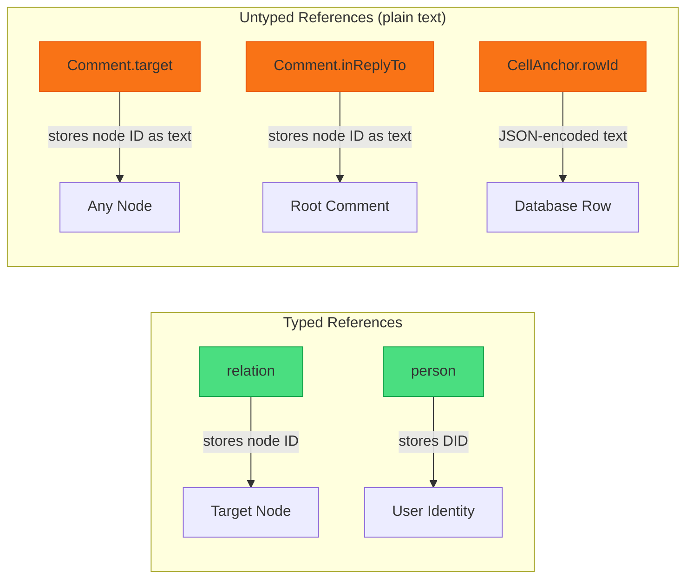
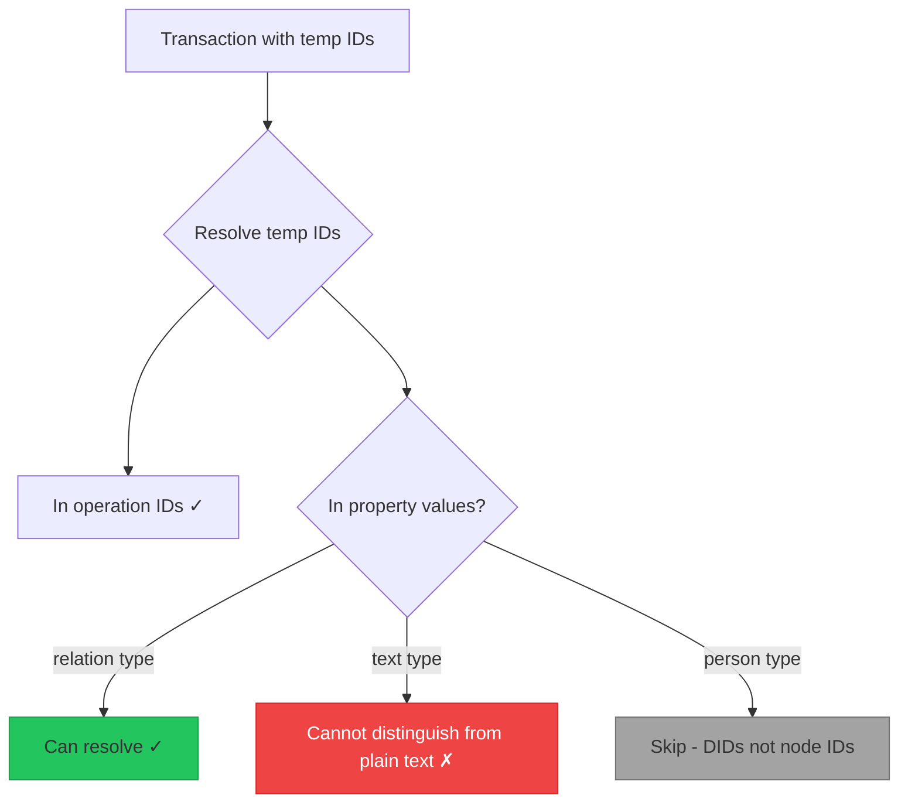
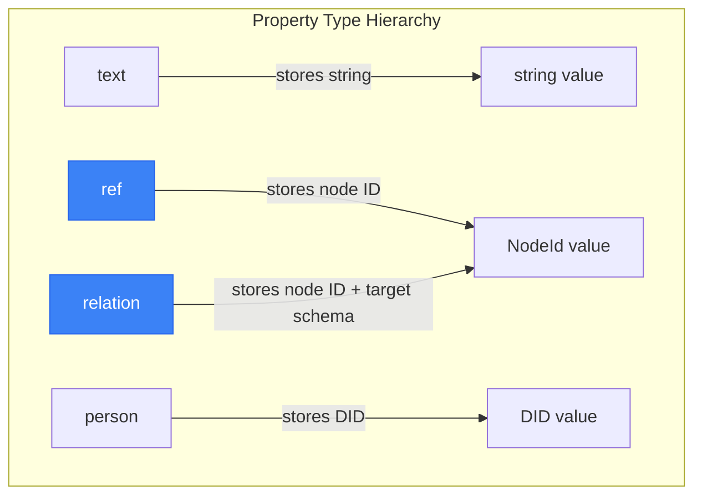
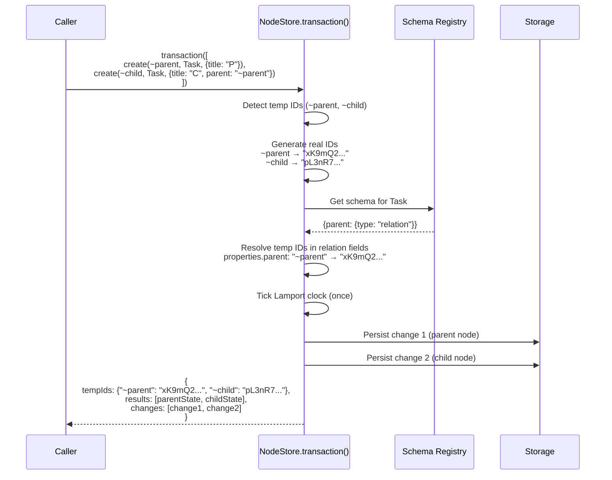

# Temp IDs and Reference Types for Transactional Node Creation

> How can we create multiple related nodes in a single transaction without pre-generating IDs or using workarounds? Should we adopt Datomic/DataScript-style negative temp IDs? Do we need a first-class `ref` property type?

## Problem Statement

When creating multiple related nodes in one transaction, you need to know a node's ID before it exists in order to reference it from another node. Today this requires awkward workarounds:

```typescript
// Current: pre-generate IDs manually
const parentId = createNodeId()
const childId = createNodeId()

await store.transaction([
  { type: 'create', options: { id: parentId, schemaId: 'Task', properties: { title: 'Parent' } } },
  {
    type: 'create',
    options: { id: childId, schemaId: 'Task', properties: { title: 'Child', parent: parentId } }
  }
])
```

Or worse, use sequential `create()` calls (no shared batch ID, no atomicity):

```typescript
const parent = await store.create({ schemaId: 'Task', properties: { title: 'Parent' } })
const child = await store.create({
  schemaId: 'Task',
  properties: { title: 'Child', parent: parent.id }
})
```

The seed data hit this exact problem -- database row IDs needed to be generated before the Y.Doc transaction so comment anchors could reference them.

## Prior Art: Datomic and DataScript

### Datomic Temp IDs

Datomic uses **string temp IDs** in transactions. Any string that doesn't start with `:` is treated as a temp ID. The transactor resolves all occurrences of the same temp ID to the same real entity ID:

```clojure
;; Datomic: string tempids
[{:db/id "order-1"
  :order/line-items ["item-1" "item-2"]}
 {:db/id "item-1"
  :line-item/product "chocolate"
  :line-item/quantity 1}
 {:db/id "item-2"
  :line-item/product "whisky"
  :line-item/quantity 2}]
```

Key design points:

- Temp IDs are **strings** -- any string works as a placeholder
- The same string used multiple times resolves to the **same entity**
- The transaction result includes a `tempids` map: `{"order-1" => 12345, "item-1" => 12346, ...}`
- The reserved temp ID `"datomic.tx"` refers to the transaction entity itself
- Temp IDs can appear anywhere an entity ID is expected

### DataScript Temp IDs

DataScript (the in-browser ClojureScript port) simplifies Datomic's model:

```clojure
;; DataScript: negative integer tempids
(d/transact! conn
  [{:db/id -1
    :name  "Maksim"
    :age   45
    :aka   ["Max Otto von Stierlitz"]}
   {:db/id -2
    :name  "Ivan"
    :friend -1}])  ;; -1 resolves to same entity as above
```

Key differences from Datomic:

- Temp IDs are **negative integers** (not strings)
- `-1`, `-2`, etc. are placeholders resolved at transaction time
- The transaction report includes `tempids`: `{-1 => 1, -2 => 2}`
- Negative numbers **cannot collide** with real entity IDs (which are always positive)
- Schema declares `:db.type/ref` on attributes, so DataScript knows which values are entity references and should have temp IDs resolved

### The `:db.type/ref` Value Type

Both Datomic and DataScript have a **first-class reference type** in their schema:

```clojure
;; Schema declaration
{:friend {:db/valueType :db.type/ref}}
```

This is critical because it tells the system:

1. The value stored in this attribute is an **entity ID**, not an arbitrary number
2. During transactions, **temp IDs in ref-typed attributes should be resolved**
3. Queries can **join through refs** automatically (entity navigation)
4. The Pull API can **walk refs** to fetch nested entities

Without `:db.type/ref`, the system cannot distinguish between `{:age -1}` (literal number) and `{:friend -1}` (temp ID reference). The schema provides the necessary type information.

## Current State in xNet

### Property Types

xNet has 15 implemented property types. Two are reference-like:

| Type       | Stores                           | Validates              | Knows it's a ref?                         |
| ---------- | -------------------------------- | ---------------------- | ----------------------------------------- |
| `relation` | `string` (node ID) or `string[]` | Non-empty string check | **Yes** -- config has `target: SchemaIRI` |
| `person`   | `string` (DID) or `string[]`     | DID format regex       | **No** -- references users, not nodes     |
| `text`     | `string`                         | Length check only      | **No**                                    |

### How References Are Used Today



There are **four patterns** for cross-node references:

1. **`relation()` property** -- typed, schema-aware, but only used in TaskSchema (`parent`, `subtasks`)
2. **`person()` property** -- typed, but for DIDs not node IDs
3. **`text()` as foreign key** -- untyped, used by CommentSchema for `target`, `inReplyTo`, `replyToCommentId`
4. **JSON-encoded anchors** -- anchor data contains `rowId`/`propertyKey` as JSON strings inside a `text()` field

### The Transaction API

`store.transaction()` already supports batched operations with a shared Lamport timestamp and batch ID:

```typescript
type TransactionOperation =
  | { type: 'create'; options: CreateNodeOptions }
  | { type: 'update'; nodeId: NodeId; options: UpdateNodeOptions }
  | { type: 'delete'; nodeId: NodeId }
  | { type: 'restore'; nodeId: NodeId }
```

But it has **no temp ID support** -- `CreateNodeOptions.id` is an optional real ID, and there's no mechanism to reference a to-be-created node from another operation in the same batch.

### ID Generation

Node IDs are generated via `nanoid()` -- 21-character URL-safe random strings. IDs are always strings, never numbers.

## Design Proposal: Temp IDs for xNet

### Why Negative Numbers Won't Work

DataScript uses negative integers because its entity IDs are positive integers. In xNet, node IDs are **strings** (nanoid). There's no natural "negative" string. We need a different sentinel.

### Option A: String-Prefixed Temp IDs (Recommended)

Use a reserved prefix (e.g., `~`) that cannot appear in real nanoid IDs:

```typescript
await store.transaction([
  { type: 'create', options: { id: '~parent', schemaId: 'Task', properties: { title: 'Parent' } } },
  {
    type: 'create',
    options: { id: '~child', schemaId: 'Task', properties: { title: 'Child', parent: '~parent' } }
  }
])
// Returns: { tempIds: { '~parent': 'abc123...', '~child': 'def456...' }, ... }
```

Pros:

- Familiar to Datomic users (string temp IDs)
- Unambiguous: `~` prefix is never in nanoid output
- Human-readable: `~comment`, `~reply`, `~parent`
- Can use any descriptive name

Cons:

- Need schema awareness to know which fields contain node ID references (to resolve temp IDs in values)

### Option B: Numeric String Temp IDs

Use negative-number strings to mirror DataScript more directly:

```typescript
await store.transaction([
  { type: 'create', options: { id: '-1', schemaId: 'Task', properties: { title: 'Parent' } } },
  {
    type: 'create',
    options: { id: '-2', schemaId: 'Task', properties: { title: 'Child', parent: '-1' } }
  }
])
```

Pros:

- Direct DataScript analogy
- Very concise

Cons:

- Less readable than descriptive names
- `-1` could be confused with a literal string value in text fields

### Option C: Symbol/Object Temp IDs

Use a `TempId` wrapper type:

```typescript
const parent = tempId('parent')
const child = tempId('child')

await store.transaction([
  { type: 'create', options: { id: parent, schemaId: 'Task', properties: { title: 'Parent' } } },
  {
    type: 'create',
    options: { id: child, schemaId: 'Task', properties: { title: 'Child', parent: parent } }
  }
])
```

Pros:

- Type-safe at compile time
- No string collision risk

Cons:

- Requires a wrapper type that must be serializable
- More API surface

## The Ref Type Question

### Do We Need a First-Class `ref` Type?

For temp ID resolution to work automatically, the transaction processor needs to know which property values are node ID references. Currently:

- `relation()` properties **are** refs -- config says `{ target: SchemaIRI }`
- `text()` properties used as refs (Comment.target, Comment.inReplyTo) are **not** distinguishable from plain text



### Option 1: Schema-Driven Resolution (Requires Ref Type)

Add a `ref()` property type that stores node IDs with full type information:

```typescript
export const CommentSchema = defineSchema({
  properties: {
    target: ref({ required: true }), // was: text({ required: true })
    inReplyTo: ref({}), // was: text({})
    replyToCommentId: ref({}) // was: text({})
    // ... rest unchanged
  }
})
```

The `ref()` type would:

- Store a `string` (node ID), same as `relation()` but without a target schema constraint
- Signal to the transaction processor that values should have temp IDs resolved
- Enable future features: reverse lookups, cascade delete, referential integrity checks



`ref` vs `relation`:

- **`ref()`** -- untyped node reference ("this field points to a node, any schema")
- **`relation()`** -- typed node reference ("this field points to a node of schema X")
- `relation()` could be implemented as `ref()` + target schema metadata

### Option 2: Explicit Resolution Fields

Instead of adding a new type, let the caller declare which fields should be resolved:

```typescript
await store.transaction(operations, {
  resolveFields: {
    Comment: ['target', 'inReplyTo', 'replyToCommentId']
  }
})
```

Pros: No schema changes
Cons: Error-prone, caller must remember to declare fields, not self-documenting

### Option 3: Convention-Based Resolution

Resolve temp IDs in **all string properties** that match the temp ID pattern:

```typescript
// If any string value starts with '~', resolve it
```

Pros: Zero configuration
Cons: Could accidentally resolve literal text values that happen to start with `~`

## Recommendation

### Phase 1: Temp IDs with Prefix Convention

1. Use `~`-prefixed strings as temp IDs (Option A)
2. Resolve temp IDs in:
   - Operation `id` fields (always)
   - Operation `nodeId` fields (always)
   - Property values of type `relation` (schema-driven)
3. Return a `tempIds` map in the transaction result

```typescript
// New transaction API
interface TransactionResult {
  batchId: string
  results: (NodeState | null)[]
  changes: NodeChange[]
  tempIds: Record<string, NodeId> // NEW: '~parent' => 'abc123...'
}
```

### Phase 2: Add `ref()` Property Type

1. Add `ref()` -- a node ID reference without target schema constraint
2. Migrate Comment.target, Comment.inReplyTo from `text()` to `ref()`
3. Extend temp ID resolution to cover `ref()` properties
4. `relation()` becomes sugar for `ref()` + target schema config

```typescript
// ref() - untyped node reference
export function ref(options?: { required?: boolean; multiple?: boolean }): PropertyBuilder<string>

// relation() - typed node reference (extends ref semantics)
export function relation(options: RelationOptions): PropertyBuilder<string>
```

### Phase 3: Automatic Features on Ref Types

Once the schema knows which fields are refs, we can build:

- **Reverse lookups**: "find all comments targeting node X" without scanning
- **Cascade operations**: delete a node and its dependents
- **Referential integrity warnings**: warn when deleting a referenced node
- **Graph traversal**: walk the node graph through ref edges

## Transaction Flow with Temp IDs



## Concrete Example: Seed Data Fixed

The database seed that motivated this exploration would become:

```typescript
// Before: manual ID pre-generation
const rowIds = [generateId(), generateId(), generateId()]
// ... build rows with rowIds[0], rowIds[1], ...
// ... create comments with JSON.stringify({ rowId: rowIds[0], propertyKey: 'text' })

// After: temp IDs in transaction
await store.transaction([
  // Create database node
  { type: 'create', options: { id: '~db', schemaId: 'Database', properties: { title: 'Sample' } } },
  // Create comment on a cell -- if we had ref-aware anchor resolution
  {
    type: 'create',
    options: {
      schemaId: 'Comment',
      properties: {
        target: '~db', // resolved automatically because 'target' is ref()
        anchorType: 'cell',
        anchorData: JSON.stringify({ rowId: '~row1', propertyKey: 'text' }),
        content: 'Great row!'
      }
    }
  }
])
```

Note: `anchorData` is a JSON-encoded `text()` field -- temp IDs inside JSON strings would **not** be resolved automatically. This is a limitation. Options:

1. Keep pre-generating IDs for anchor data (pragmatic)
2. Add a post-processing hook for JSON-encoded ref fields (complex)
3. Restructure anchor data as separate ref properties (breaking change)

## Open Questions

1. **Should `ref()` replace `relation()`, or coexist?** If `relation()` = `ref()` + target hint, do we keep both?
2. **Nested temp IDs in JSON strings** -- anchorData contains refs as JSON. Do we support resolving inside JSON, or accept this as a known limitation?
3. **Temp ID scope** -- should temp IDs be scoped to a single transaction (like Datomic), or can they persist across transactions in a session?
4. **Sync implications** -- temp IDs are resolved locally before changes are synced. Remote peers never see temp IDs. Any edge cases?
5. **Validation** -- should `ref()` validate that the referenced node exists? Datomic doesn't enforce this for tempids within the same transaction, but does for existing entity IDs.
