# First-Class Relations: A Global Graph for Local-First Architecture

> Deep exploration of what becomes possible when `relation()` is a first-class primitive — reverse lookups, cross-peer graph traversal, privacy-scoped subgraphs, cascade operations, and a unified query model across a decentralized network.

## Context

[Exploration 0039](./0039_[x]_TEMPID_AND_REF_TYPES.md) established `relation()` as xNet's universal foreign key type — the equivalent of Datomic's `:db.type/ref`. Phase 1 (temp IDs) solves the transactional creation problem. This document explores Phase 2: **what a first-class relation type makes possible across every layer of a local-first, decentralized system.**

Today, relations are stored as forward pointers — a node holds the ID of the node it references. The system has no awareness of the graph these references form. This exploration asks: what if it did?

## The Vision: A Global Decentralized Graph

Every xNet node is a vertex. Every `relation()` property is a directed edge. Every `person()` property is an edge to an identity. Across all peers, all users, all devices — these edges form a **global graph** that no single participant fully sees, but that the system can reason about locally and collaboratively.

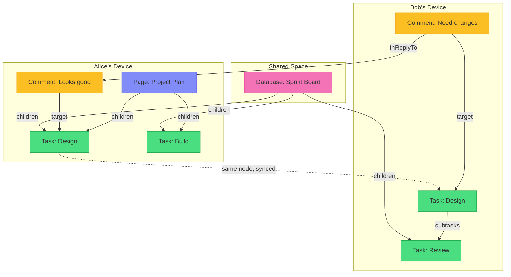

This is not a centralized graph database. It is a **convergent graph** — each peer holds a partial view, and the graph grows as peers sync.

## Part 1: The Relation Index

### The Core Problem

Today, answering "what nodes reference node X?" requires a full scan:

```typescript
// Current: O(n) scan of all nodes
const comments = await store.list({ schemaId: CommentSchema.schema['@id'] })
const commentsOnTask = comments.filter((c) => c.properties.target?.value === taskId)
```

With thousands of nodes, this is untenable. The fix is a **reverse index** — a secondary data structure mapping target IDs to the nodes that reference them.

### Relation Index Design

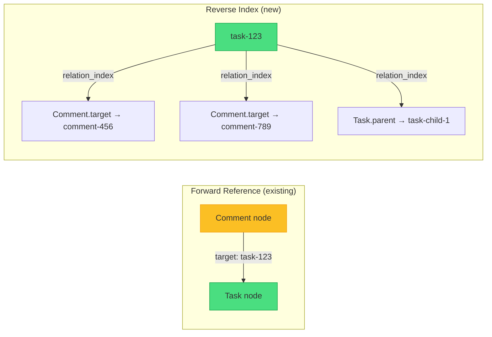

#### IndexedDB Schema Extension

```typescript
// New object store in xnet-nodes database (version 4)
interface RelationIndexEntry {
  id: string // composite key: `${targetId}:${sourceId}:${propertyKey}`
  targetId: NodeId // the node being referenced
  sourceId: NodeId // the node doing the referencing
  sourceSchemaId: string // schema of the source node
  propertyKey: string // which relation property
  lamport: string // serialized LamportTimestamp for ordering
}

// Indexes:
//   byTarget: targetId                    → "find all nodes referencing X"
//   byTargetSchema: [targetId, sourceSchemaId] → "find all Comments referencing X"
//   bySource: sourceId                    → "find all outbound relations from X"
```

#### Maintenance

The relation index is maintained as a side effect of `applyChange()`:

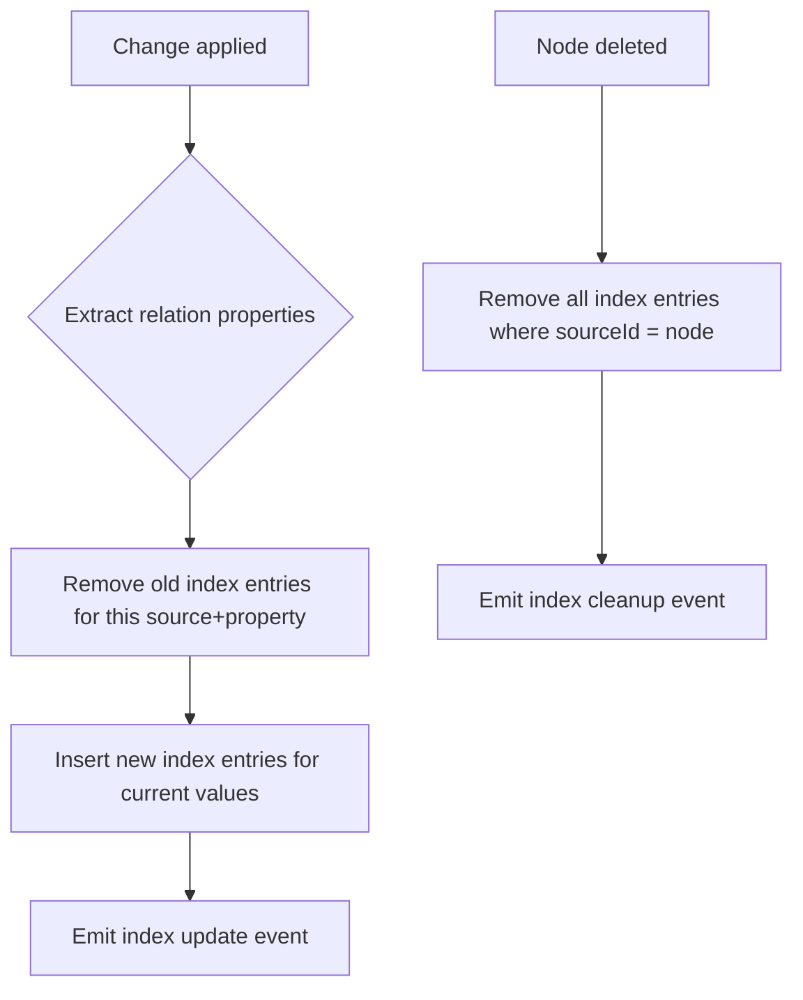

For every `Change<NodePayload>`, the store:

1. Looks up the schema to find which properties have `type === 'relation'`
2. Removes any existing index entries for `(sourceId, propertyKey)`
3. Inserts new entries for the current value(s)
4. This is O(k) where k = number of relation properties on the schema — typically 1-3

### Query API Extensions

```typescript
// New: reverse lookup
const comments = await store.getRelated(taskId, {
  schemaId: 'xnet://xnet.fyi/Comment', // optional: filter by source schema
  property: 'target' // optional: filter by property name
})

// New: check if referenced
const isReferenced = await store.hasRelations(taskId)

// New: count references
const commentCount = await store.countRelated(taskId, {
  schemaId: 'xnet://xnet.fyi/Comment',
  property: 'target'
})
```

### React Hook: `useRelated`

```typescript
function useRelated<S extends DefinedSchema>(
  targetId: NodeId,
  sourceSchema: S,
  options?: { property?: string }
): FlatNode<S['_properties']>[]

// Usage
const comments = useRelated(taskId, CommentSchema, { property: 'target' })
const subtasks = useRelated(taskId, TaskSchema, { property: 'parent' })
const allRefs = useRelated(taskId) // everything pointing at this node
```

This subscribes to the relation index and updates reactively when references change.

## Part 2: Graph Traversal

### Walking the Graph

Once the relation index exists, we can traverse the graph in both directions. This unlocks queries that are currently impossible without application-level joins.

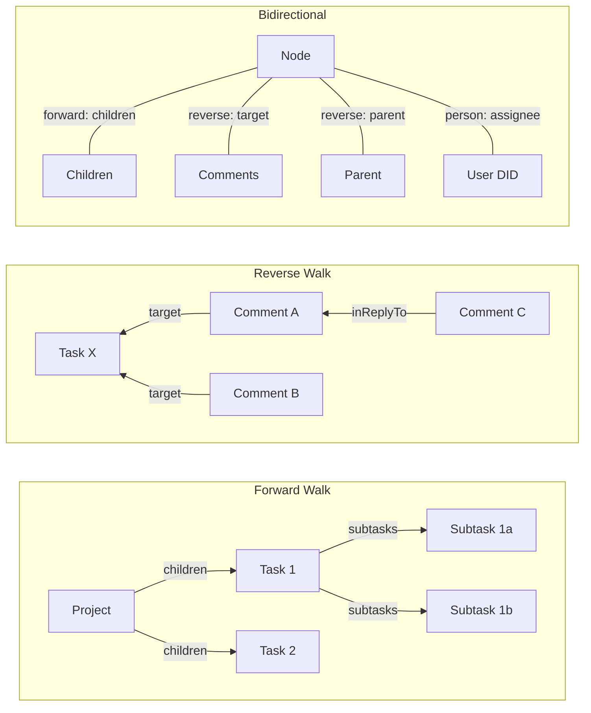

### Graph Query Language

Rather than inventing a query language, we extend the existing `where` clause with traversal operators:

```typescript
// Depth-1: nodes whose 'parent' relation points to projectId
useQuery(TaskSchema, {
  where: { parent: projectId } // already works today (exact match)
})

// NEW: Reverse query — tasks that are referenced BY projectId
useQuery(TaskSchema, {
  whereRelated: { targetOf: projectId, property: 'children' }
})

// NEW: Transitive closure — all descendants
useQuery(TaskSchema, {
  whereReachable: { from: projectId, through: 'parent', direction: 'reverse' }
})

// NEW: Multi-hop — tasks assigned to users who are members of a team
useQuery(TaskSchema, {
  whereJoin: [
    { through: 'assignee', schema: PersonSchema },
    { through: 'memberOf', value: teamId }
  ]
})
```

### The Pull Pattern (Datomic-Inspired)

Datomic's Pull API lets you declare a tree of data to fetch in one call. With first-class relations, we can do the same:

```typescript
const result = await store.pull(taskId, {
  // Forward: follow these relation properties
  forward: {
    parent: true, // single hop
    subtasks: {
      // nested pull
      forward: { assignee: true }
    }
  },
  // Reverse: find nodes pointing at me
  reverse: {
    'Comment.target': true, // all comments on this task
    'Task.parent': {
      // child tasks
      forward: { assignee: true } // ...with their assignees
    }
  }
})
```

This returns a **tree-shaped snapshot** with no N+1 queries — all resolved in a single traversal.

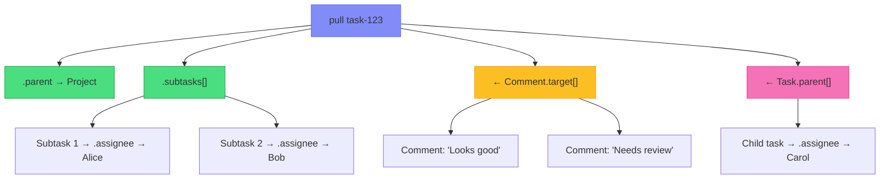

### React Hook: `usePull`

```typescript
const task = usePull(taskId, {
  forward: { parent: true, subtasks: { forward: { assignee: true } } },
  reverse: { 'Comment.target': true }
})

// task.parent → FlatNode<PageProperties>
// task.subtasks → FlatNode<TaskProperties>[] each with .assignee resolved
// task['Comment.target'] → FlatNode<CommentProperties>[]
```

## Part 3: Cascade Operations

### Referential Awareness

With the relation index, the system can answer "what happens to the rest of the graph when this node changes?"

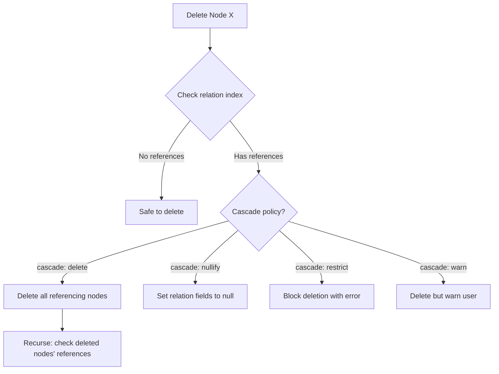

### Schema-Level Cascade Declaration

```typescript
const CommentSchema = defineSchema({
  name: 'Comment',
  namespace: 'xnet://xnet.fyi/',
  properties: {
    target: relation({
      required: true,
      onDelete: 'cascade' // delete comment when target is deleted
    }),
    inReplyTo: relation({
      onDelete: 'nullify' // set to null when parent comment is deleted
    })
  }
})

const TaskSchema = defineSchema({
  name: 'Task',
  namespace: 'xnet://xnet.fyi/',
  properties: {
    parent: relation({
      target: 'xnet://xnet.fyi/Task',
      onDelete: 'nullify' // orphan the task, don't delete it
    })
  }
})
```

### Cascade in a Decentralized System

Cascades in a centralized database are transactional. In a decentralized system, they're **eventually consistent**:

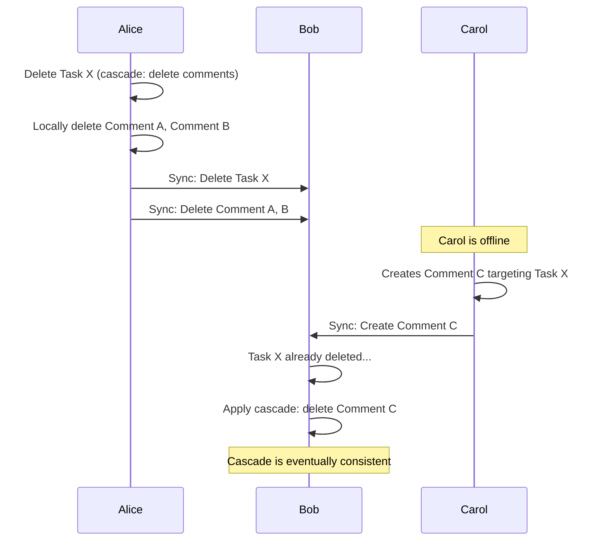

Key decisions:

- **Cascades are local-first**: each peer applies cascade rules when it learns about a deletion
- **Orphan detection**: on sync, check if a newly-received node targets a deleted node → apply cascade
- **Conflict**: if Alice deletes a task and Bob simultaneously adds a comment, the cascade runs on each peer independently. The CRDT convergence property means all peers reach the same state.
- **Undo**: since deletions are soft deletes, cascades can be reversed by restoring the root node

## Part 4: The Privacy-Scoped Graph

> **Implementation status:** Privacy scopes are entirely aspirational. Today, all nodes are unencrypted and all sync rooms are open. The infrastructure needed — scope storage, per-scope encryption keys, scope-based sync room partitioning — does not exist yet. This section describes a target architecture.

### The Problem with a Global Graph

A truly global graph leaks information. If Alice can traverse from her task to Bob's private notes through a shared reference, the graph becomes a privacy violation. The solution: **privacy scopes** that partition the graph into visibility boundaries.

### Privacy Scopes

Every node belongs to a **scope** — a privacy boundary that determines who can see it and how it syncs.

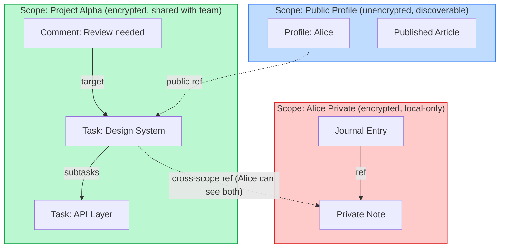

### Scope Model

```typescript
type PrivacyLevel = 'private' | 'shared' | 'public'

interface Scope {
  id: ScopeId // nanoid
  name: string // human-readable
  privacy: PrivacyLevel
  owner: DID // creator
  members: DID[] // for 'shared' scopes
  encryptionKey?: Uint8Array // symmetric key for 'private' and 'shared'
  syncRoomId?: string // WebSocket room for 'shared' and 'public'
}
```

| Privacy Level | Encrypted at Rest | Encrypted in Transit | Syncs To        | Discoverable  |
| ------------- | ----------------- | -------------------- | --------------- | ------------- |
| `private`     | Yes (user key)    | N/A (never leaves)   | User's devices  | No            |
| `shared`      | Yes (scope key)   | Yes (scope key)      | Scope members   | By invitation |
| `public`      | No                | No                   | Anyone who asks | Yes           |

### Cross-Scope References

A relation can cross scope boundaries. The reference itself is just a node ID — a string. But traversing that reference may hit a **permission boundary**:

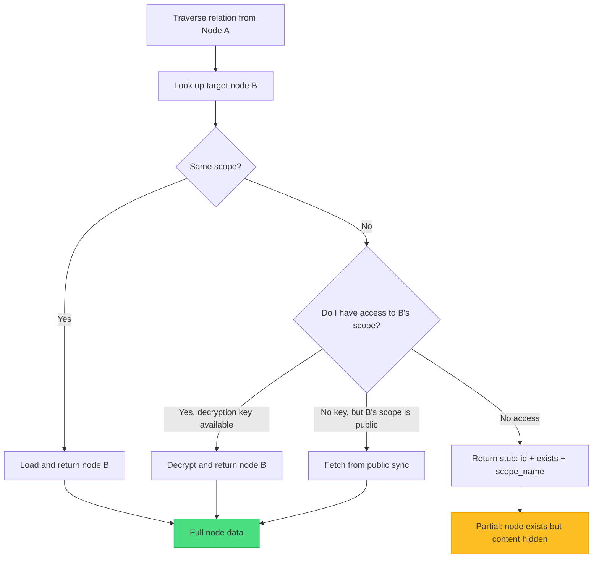

A **stub reference** tells the UI "this node exists and is called 'Project Alpha Task' but you don't have access to view it." This is critical for UX — the user sees a broken link vs. a permission boundary.

### Encrypted Relations

For private and shared scopes, node IDs in relations could themselves be encrypted:

```typescript
// Option A: Plaintext IDs, encrypted content (simpler)
// Anyone with the relation index can see the graph structure
// but cannot read node contents without the scope key
{
  target: 'abc123',  // plaintext node ID
  // node abc123's properties are encrypted at rest
}

// Option B: Encrypted IDs (stronger privacy, higher complexity)
// Graph structure itself is hidden
{
  target: encrypt('abc123', scopeKey),  // encrypted reference
  // must decrypt to traverse
}
```

Option A is recommended for v1 — it preserves the ability to maintain a relation index without key material, and graph structure alone leaks limited information.

## Part 5: Cross-Peer Graph Sync

### How the Graph Grows

Each peer holds a partial graph. When peers sync, their partial graphs merge. The relation index grows as new nodes arrive:

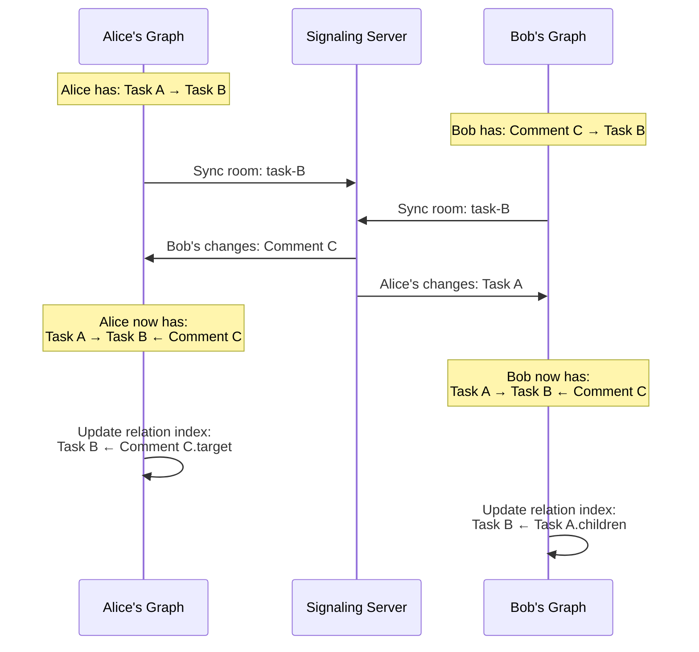

### Lazy Graph Discovery

Not all of the graph needs to be present locally. When the user traverses a relation to a node that isn't synced yet, the system can **discover** it:

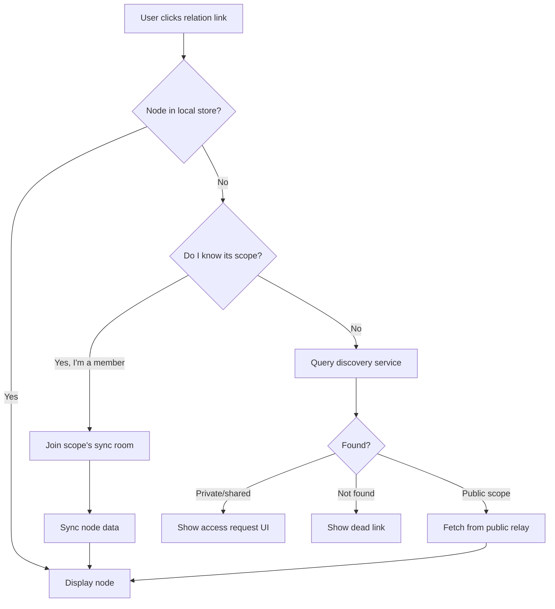

This creates a **pull-based graph expansion**: your local graph grows as you follow edges. Unlike a centralized graph database where all data is always available, a decentralized graph is **demand-driven**.

### Graph Sync Strategies

| Strategy             | Description                                               | Use Case                                    |
| -------------------- | --------------------------------------------------------- | ------------------------------------------- |
| **Eager subgraph**   | When syncing a node, also sync its depth-1 neighbors      | Opening a page loads its tasks and comments |
| **Lazy traversal**   | Only sync a node when the user explicitly navigates to it | Following a link in a comment               |
| **Scope-level sync** | Sync all nodes in a scope as a batch                      | Joining a shared workspace                  |
| **Pinned subgraph**  | Keep a subgraph always synced in background               | Dashboard with aggregated counts            |

```typescript
// Eager subgraph: configure which relations to pre-fetch on sync
const syncProfile = defineSyncProfile({
  schema: 'xnet://xnet.fyi/Task',
  eagerRelations: {
    forward: ['parent', 'subtasks'], // sync parent and children
    reverse: ['Comment.target'] // sync comments on this task
  },
  depth: 2 // up to 2 hops
})
```

## Part 6: Computed Graph Properties

### Aggregations Over Relations

With a relation index, we can compute properties by aggregating over the graph:

```typescript
const TaskSchema = defineSchema({
  name: 'Task',
  namespace: 'xnet://xnet.fyi/',
  properties: {
    status: select({ options: ['todo', 'doing', 'done'] }),
    parent: relation({ target: 'xnet://xnet.fyi/Task' }),

    // Computed at read time (never stored)
    commentCount: rollup({
      source: 'Comment.target', // reverse relation
      aggregate: 'count'
    }),
    subtaskProgress: rollup({
      source: 'Task.parent', // reverse: child tasks
      property: 'status',
      aggregate: 'percentWhere',
      condition: { equals: 'done' }
    }),
    allDescendantsDone: formula({
      expression: 'subtaskProgress === 100 || subtaskProgress === null'
    })
  }
})
```

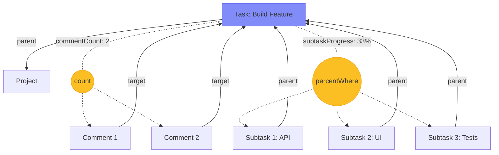

These rollups are **computed at read time** from the relation index — never stored. This is critical for a CRDT system: stored aggregates would create conflicts that don't converge.

### Reactive Rollups in React

```typescript
function TaskCard({ taskId }: { taskId: NodeId }) {
  const task = useQuery(TaskSchema, taskId)
  const commentCount = useRollup(taskId, 'Comment.target', 'count')
  const subtaskProgress = useRollup(taskId, 'Task.parent', {
    property: 'status',
    aggregate: 'percentWhere',
    condition: { equals: 'done' },
  })

  return (
    <div>
      <h3>{task.title}</h3>
      <span>{commentCount} comments</span>
      <ProgressBar value={subtaskProgress} />
    </div>
  )
}
```

## Part 7: Graph-Aware Deletion and Garbage Collection

### The Tombstone Problem

In a CRDT system, deleted nodes become tombstones. But with relations, a tombstone may still be referenced by living nodes. Garbage collection must be graph-aware:

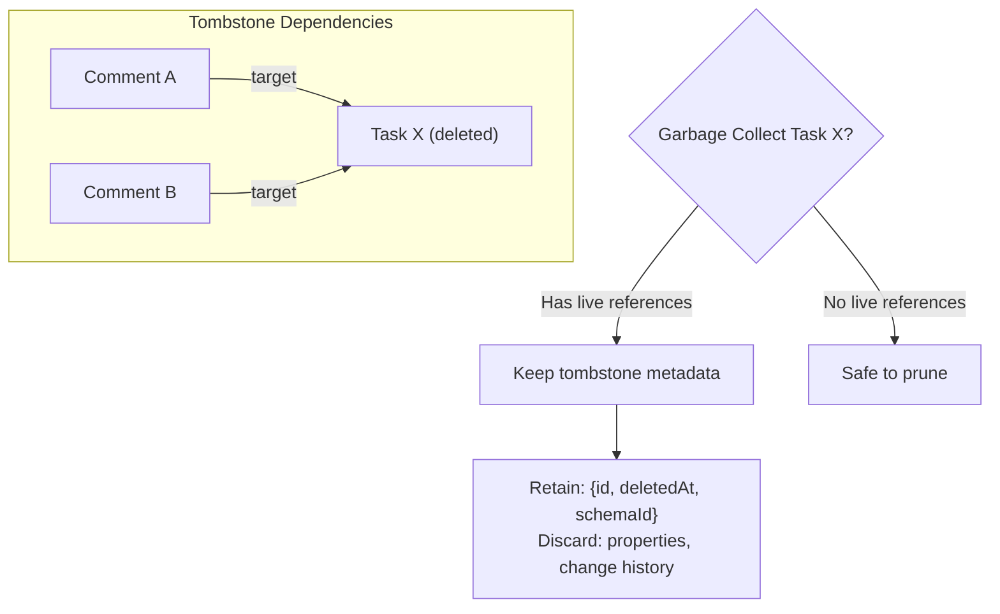

### Garbage Collection Tiers

| Tier                   | Condition                                               | Action                                          |
| ---------------------- | ------------------------------------------------------- | ----------------------------------------------- |
| **Active**             | Not deleted                                             | Full node + changes retained                    |
| **Tombstone**          | Deleted, has live inbound refs                          | Keep ID + deletion metadata, discard properties |
| **Orphaned tombstone** | Deleted, no live inbound refs, age > TTL                | Prune entirely                                  |
| **Cascade target**     | Deleted, all referencing nodes have `onDelete: cascade` | Delete referencing nodes, then prune            |

## Part 8: Person Relations and the Social Graph

### Unifying Node References and Identity References

`relation()` points to nodes. `person()` points to DIDs. Together they form two edge types in the graph:

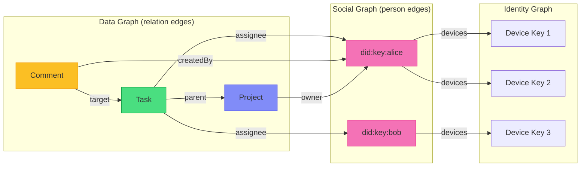

### Social Queries via Graph Traversal

```typescript
// "Show me everything assigned to Alice"
useQuery(TaskSchema, {
  where: { assignee: aliceDID }
})

// "Show me all users who have commented on my tasks" (multi-hop)
// Task.createdBy = me → reverse Comment.target → Comment.createdBy = ???
const collaborators = await store.traverse({
  from: myDID,
  path: [
    { reverse: 'Task.createdBy' }, // my tasks
    { reverse: 'Comment.target' }, // comments on my tasks
    { forward: 'createdBy' } // who wrote those comments
  ],
  collect: 'person', // collect DIDs at the end
  deduplicate: true
})
```

### Person Index

Similar to the relation index, but keyed by DID:

```typescript
interface PersonIndexEntry {
  id: string // composite: `${did}:${nodeId}:${propertyKey}`
  did: DID // the person referenced
  nodeId: NodeId // the node doing the referencing
  nodeSchemaId: string // schema of the referencing node
  propertyKey: string // which person property
}

// "Everything involving Alice"
const aliceNodes = await store.getByPerson(aliceDID)

// "Tasks assigned to Alice"
const aliceTasks = await store.getByPerson(aliceDID, {
  schemaId: 'xnet://xnet.fyi/Task',
  property: 'assignee'
})
```

## Part 9: UCAN Integration with Graph Permissions

### Current State: What Exists Today

xNet's identity and authorization infrastructure has three layers, each at a different level of maturity:

**Layer 1: DID:key Identity (Fully Implemented, Used Everywhere)**

- Every user has an Ed25519 keypair → `did:key:z6Mk...` identity
- `parseDID()` / `createDID()` convert between DIDs and raw public keys
- Every `Change<NodePayload>` is signed with Ed25519 and verified on receipt
- Every Yjs update is wrapped in a signed envelope and verified before applying
- ClientID attestations bind Yjs client IDs to DIDs
- This layer works and is enforced at runtime across the entire system

**Layer 2: UCAN Token Functions (Implemented, Never Called at Runtime)**

- `createUCAN()` — creates JWT-like `header.payload.signature` tokens
- `verifyUCAN()` — parses and verifies signature + expiration
- `hasCapability()` — checks if a token grants `{with: resource, can: action}`
- These functions exist in `@xnet/identity` and pass their unit tests
- **No code path in the app ever calls them** — not the signaling server, not the sync layer, not the NodeStore

**Known issues with the current UCAN implementation:**

- **Signature bug:** `createUCAN()` signs `JSON.stringify(payload)` but `verifyUCAN()` also signs a reconstructed JSON object — this works only because the field order happens to match. Per JWT spec, the signature should be over `base64url(header).base64url(payload)`, not the raw JSON.
- **No proof chain validation:** The `prf` field stores parent UCAN strings, but `verifyUCAN()` never recursively validates them. A token with fabricated proofs would pass verification.
- **No attenuation checking:** UCAN's key feature is that delegated tokens can only narrow (never widen) capabilities. There's no code to enforce this constraint.

**Layer 3: Permission Evaluation (Type Definitions Only, No Implementation)**

- `PermissionEvaluator` interface in `@xnet/core` — `hasCapability()`, `resolveGroups()`, `getPermissions()`
- `Group`, `Role`, `PermissionGrant`, `ResourceScope`, `Condition` types
- `STANDARD_ROLES` (viewer/editor/admin) and utility functions like `roleHasCapability()`
- **No class implements `PermissionEvaluator`** — the interface has zero consumers

**Current reality:** The signaling server is fully open (no auth). Any peer can join any sync room. Node mutations require a valid Ed25519 signature (DID-based), but there is no authorization — any authenticated user can write to any node they can reach.

```mermaid
flowchart LR
    subgraph "Implemented & Enforced"
        DID[DID:key Identity]
        SIGN[Ed25519 Change Signing]
        VERIFY[Signature Verification]
        DID --> SIGN --> VERIFY
    end

    subgraph "Implemented, Not Used"
        UCAN_CREATE[createUCAN]
        UCAN_VERIFY[verifyUCAN]
        UCAN_CAP[hasCapability]
        UCAN_CREATE -.-> UCAN_VERIFY -.-> UCAN_CAP
    end

    subgraph "Types Only, No Implementation"
        PERM_EVAL[PermissionEvaluator]
        GROUPS[Groups & Roles]
        GRANTS[PermissionGrants]
        PERM_EVAL -.-> GROUPS -.-> GRANTS
    end

    VERIFY -.->|"gap"| UCAN_CREATE
    UCAN_CAP -.->|"gap"| PERM_EVAL

    style DID fill:#4ade80,stroke:#16a34a
    style SIGN fill:#4ade80,stroke:#16a34a
    style VERIFY fill:#4ade80,stroke:#16a34a
    style UCAN_CREATE fill:#fbbf24,stroke:#f59e0b
    style UCAN_VERIFY fill:#fbbf24,stroke:#f59e0b
    style UCAN_CAP fill:#fbbf24,stroke:#f59e0b
    style PERM_EVAL fill:#fecaca,stroke:#dc2626
    style GROUPS fill:#fecaca,stroke:#dc2626
    style GRANTS fill:#fecaca,stroke:#dc2626
```

### The Path from DID Signing to UCAN Authorization

Bridging the gap requires these concrete steps:

1. **Fix UCAN signature format** — sign `base64url(header).base64url(payload)` per JWT/UCAN spec, not raw JSON
2. **Implement proof chain validation** — recursively verify `prf` tokens, check that each delegation attenuates (narrows) the parent's capabilities
3. **Integrate UCAN into the signaling server** — require a valid UCAN to join a sync room, where the token's `with` field matches the room/scope ID
4. **Integrate UCAN into NodeStore** — check capabilities before applying mutations (not just signature validity)
5. **Implement `PermissionEvaluator`** — a concrete class that resolves UCAN chains + group membership to answer "can DID X do action Y on resource Z?"

### Vision: Graph-Aware Authorization

Once UCAN is actually enforced, first-class relations create the opportunity to make authorization **graph-aware**:

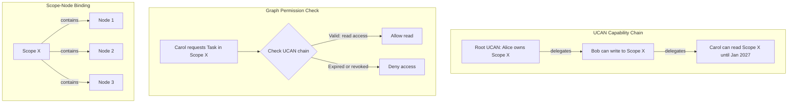

### Permission Scopes on Relations (Future)

```typescript
const TeamSchema = defineSchema({
  name: 'Team',
  namespace: 'xnet://xnet.fyi/',
  properties: {
    members: person({ multiple: true }),
    projects: relation({
      target: 'xnet://xnet.fyi/Project',
      multiple: true,
      // Relation-level permission: only team members can modify this relation
      permission: 'team:members'
    })
  }
})
```

> **Note:** The `permission` field on `relation()` is aspirational. It requires the full UCAN → PermissionEvaluator pipeline to be operational before it can be enforced.

## Part 10: The Full Architecture

### Data Flow with Relations

```mermaid
flowchart TD
    subgraph "Write Path"
        MUT[Mutation] --> VALIDATE[Validate against schema]
        VALIDATE --> SIGN[Sign Change with Ed25519]
        SIGN --> STORE[Write to IndexedDB]
        STORE --> RIDX[Update Relation Index]
        STORE --> PIDX[Update Person Index]
        RIDX --> EMIT[Emit change event]
        PIDX --> EMIT
        EMIT --> SYNC[Broadcast via SyncManager]
        EMIT --> REACT[Notify React subscribers]
    end

    subgraph "Read Path"
        QUERY[Query/Pull] --> LOCAL[Local NodeStore]
        LOCAL --> RESOLVE[Resolve forward relations]
        LOCAL --> REVERSE[Resolve reverse relations via index]
        RESOLVE --> SCOPE_CHECK[Check scope access]
        REVERSE --> SCOPE_CHECK
        SCOPE_CHECK --> COMPUTE[Compute rollups]
        COMPUTE --> FLAT[Flatten for React]
    end

    subgraph "Sync Path"
        REMOTE[Remote Change arrives] --> VERIFY[Verify signature]
        VERIFY --> CLOCK[Update Lamport clock]
        CLOCK --> MERGE[LWW merge]
        MERGE --> RIDX2[Update Relation Index]
        MERGE --> CASCADE_CHECK[Check cascade rules]
        RIDX2 --> REACT2[Notify subscribers]
        CASCADE_CHECK -->|Cascade needed| CASCADE_OP[Execute cascades]
        CASCADE_OP --> RIDX2
    end
```

### IndexedDB Store Map (v4)

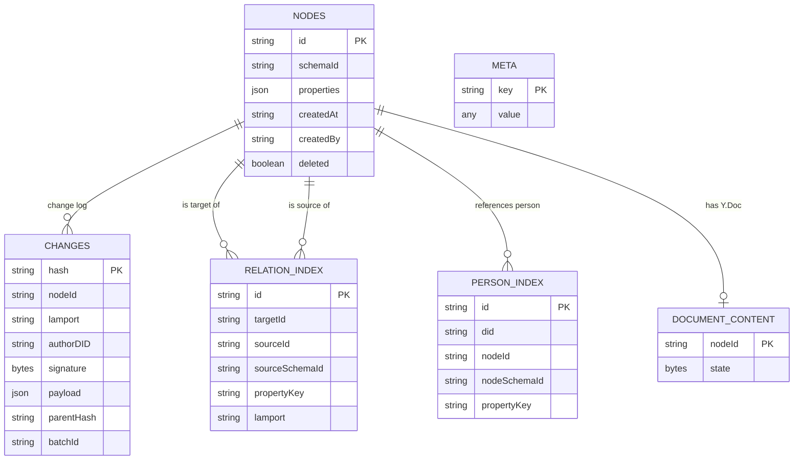

## Part 11: Implementation Roadmap

### Phase 2a: Relation Index (Foundation)

| Task                                                   | Effort | Impact                      |
| ------------------------------------------------------ | ------ | --------------------------- |
| Add `relation_index` object store to IndexedDB adapter | S      | Enables all reverse lookups |
| Maintain index in `applyChange()`                      | M      | Automatic, no API change    |
| `store.getRelated()` method                            | S      | Core query primitive        |
| `useRelated()` React hook                              | S      | Reactive reverse lookups    |
| Backfill index from existing data on upgrade           | M      | Migration path              |

### Phase 2b: Graph Traversal

| Task                                     | Effort | Impact                     |
| ---------------------------------------- | ------ | -------------------------- |
| `store.pull()` method (Datomic-style)    | L      | Declarative graph fetching |
| `store.traverse()` for multi-hop queries | L      | Complex graph queries      |
| `usePull()` React hook                   | M      | Reactive graph trees       |
| Cycle detection in traversal             | S      | Safety                     |

### Phase 2c: Cascade Operations

| Task                                             | Effort | Impact                          |
| ------------------------------------------------ | ------ | ------------------------------- |
| `onDelete` option on `relation()`                | S      | Schema declaration              |
| Cascade execution in `applyChange()`             | M      | Automatic referential integrity |
| Cross-peer cascade convergence                   | L      | Distributed consistency         |
| Undo cascade (restore root → restore dependents) | M      | User experience                 |

### Phase 2d: Privacy Scopes

> **Prerequisite:** Phase 2d depends on fixing the UCAN implementation first. See Part 9 for the gap analysis. At minimum, steps 1-3 (fix signature format, implement proof chain validation, integrate into signaling server) must be complete before scope key management is viable.

| Task                                          | Effort | Impact                       |
| --------------------------------------------- | ------ | ---------------------------- |
| Fix UCAN signature format (JWT spec)          | S      | Correctness prerequisite     |
| Implement UCAN proof chain validation         | M      | Trust chain prerequisite     |
| Scope model and storage                       | M      | Foundation for privacy       |
| Scope-based sync room partitioning            | L      | Data isolation               |
| UCAN integration in signaling server          | M      | Room-level access control    |
| Cross-scope relation stubs                    | M      | UX for permission boundaries |
| Scope key management (UCAN key exchange)      | L      | Cryptographic access control |
| Encrypted-at-rest for private scopes          | L      | Security                     |
| UCAN integration in NodeStore (write control) | L      | Mutation-level authorization |

### Phase 2e: Social Graph

| Task                         | Effort | Impact                    |
| ---------------------------- | ------ | ------------------------- |
| Person index in IndexedDB    | S      | Fast user-centric queries |
| `store.getByPerson()` method | S      | Query by DID              |
| Social traversal queries     | M      | Collaboration features    |
| User profile nodes           | M      | Identity in the graph     |

## Open Questions

1. **Index size**: The relation index grows linearly with the number of relations. For a node with 10,000 comments, the index entry count is large. Should we cap reverse lookups with pagination, or is IndexedDB performant enough?

2. **Cross-device index sync**: The relation index is derived data — it can be rebuilt from changes. Should it sync between devices, or should each device build its own index? Rebuilding is safer but slower on first load.

3. **Scope granularity**: Is scope-per-node too fine-grained? Should scopes be workspace-level (coarser) or property-level (finer)? The answer likely depends on use case — workspace-level for v1, with per-node overrides later.

4. **Encrypted graph structure**: Option A (plaintext IDs, encrypted content) leaks the graph topology. For high-security use cases, is Option B (encrypted IDs) worth the complexity? Consider: graph topology reveals "Alice interacts with Bob" even without content.

5. **Relation cardinality limits**: Should `relation({ multiple: true })` have a maximum cardinality? A node with 100,000 outbound relations is likely a modeling error. But setting hard limits in a decentralized system means different peers might disagree on the limit.

6. **Bidirectional relations**: Should we support declaring both sides of a relation in the schema? E.g., Task has `parent` and Page has `children`, and the system ensures they stay in sync. This is convenient but creates update conflicts in CRDTs.

7. **Graph queries and offline**: Complex traversals may reference nodes the user hasn't synced yet. Should the query return partial results with "holes", or should it block until the subgraph is available? Partial results with explicit stubs is more local-first, but complicates UI logic.

## Conclusion

The `relation()` type is more than a foreign key — it is the foundation for treating xNet's data as a **graph**. The relation index turns a bag of disconnected nodes into a navigable, queryable, reactive graph structure. Privacy scopes partition this graph into trust boundaries. Cross-peer sync grows the graph collaboratively. And because every edge is a signed, timestamped, CRDT-compatible change, the graph converges without coordination.

The implementation path is incremental: each phase delivers standalone value while building toward the full vision. Phase 2a (relation index) alone transforms the developer experience by eliminating O(n) scans for reverse lookups. Each subsequent phase compounds on this foundation.
