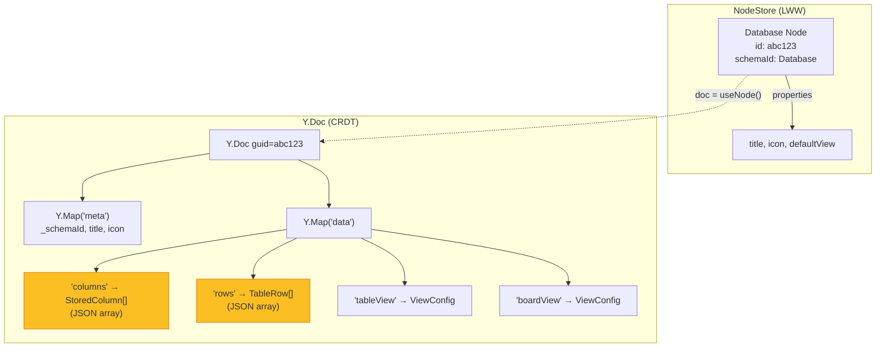
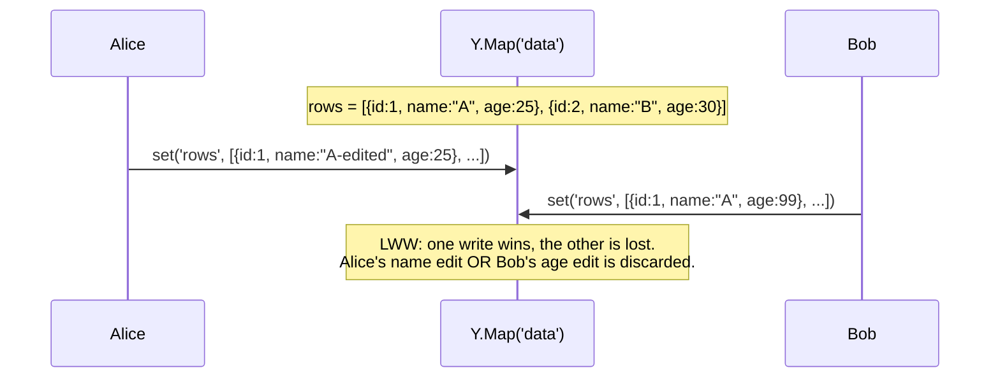
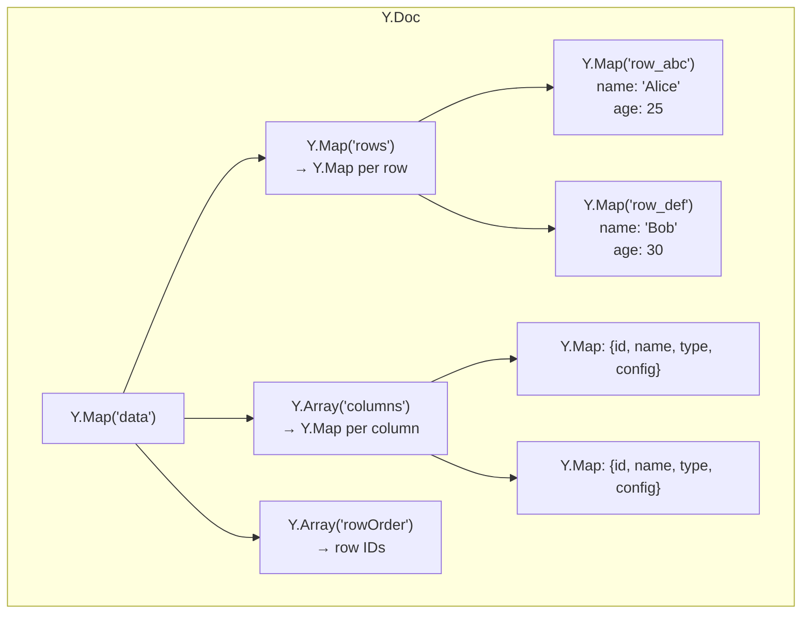
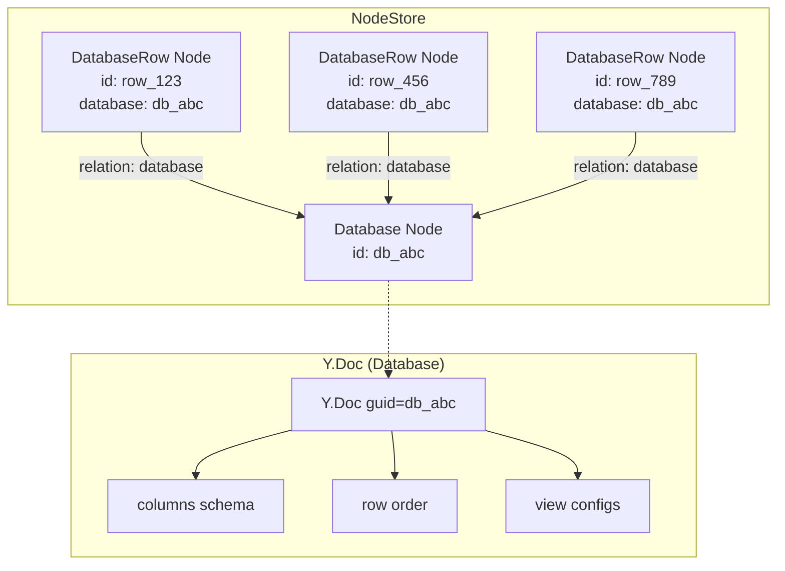
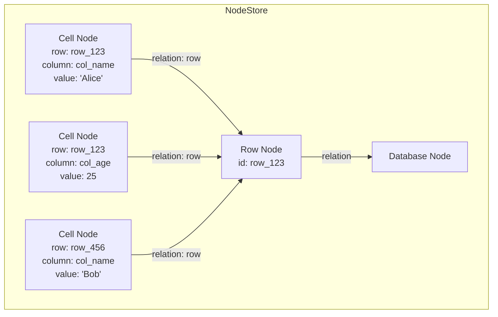
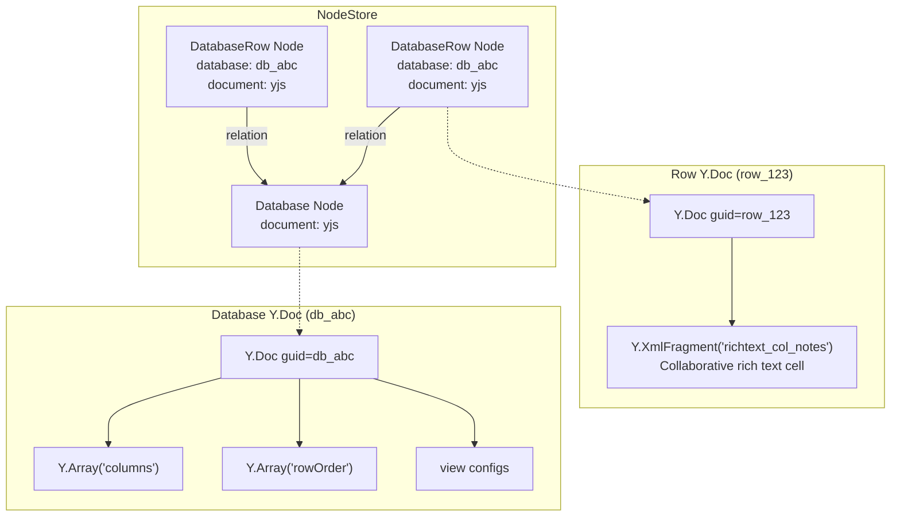
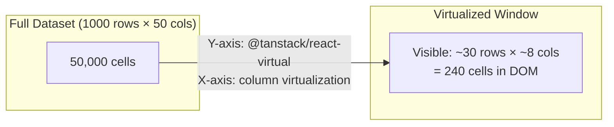

# Database Data Model: Current State and Future Architectures

> How should xNet store database rows, columns, and cells? What trade-offs exist between embedding everything in a Y.Doc vs modeling rows/cells as Nodes? How do we scale to 1M+ cells with virtualized pagination on both axes?

## Current Architecture

### Overview

A "Database" in xNet is a Node with `schemaId: 'xnet://xnet.fyi/Database'` and a Y.Doc for collaborative state. All mutable content — rows, columns, view configs — lives inside a single `Y.Map('data')` on the Y.Doc.



### Data Structures

**StoredColumn** — defines a database property/column:

```typescript
interface StoredColumn {
  id: string // e.g., 'col_1738590000000'
  name: string // Display name
  type: PropertyType // 'text' | 'number' | 'checkbox' | 'select' | ...
  config?: Record<string, unknown> // Type-specific (select options, etc.)
}
```

**TableRow** — a flat object with column values:

```typescript
interface TableRow {
  id: string // e.g., '1738590000000' (Date.now())
  [columnId: string]: unknown // One entry per column
}
```

**ViewConfig** — display settings per view:

```typescript
interface ViewConfig {
  id: string
  name: string
  type: 'table' | 'board' | 'gallery' | 'timeline' | 'calendar' | 'list'
  visibleProperties: string[] // Ordered visible column IDs
  propertyWidths?: Record<string, number> // Table column widths
  sorts: SortConfig[]
  filter?: FilterGroup
  groupByProperty?: string // Board: group-by column
}
```

### How Mutations Work

Every mutation replaces the **entire** `rows` or `columns` array in the Y.Map:

```typescript
// Adding a row
const currentRows = dataMap.get('rows') as TableRow[]
dataMap.set('rows', [...currentRows, newRow])

// Updating a cell
const updatedRows = currentRows.map((row) =>
  row.id === rowId ? { ...row, [columnId]: value } : row
)
dataMap.set('rows', updatedRows)

// Deleting a row
dataMap.set(
  'rows',
  currentRows.filter((row) => row.id !== rowId)
)
```

### Ordering

- **Row order**: position in the `rows[]` array. Reordering replaces the entire array.
- **Column order**: position in the `columns[]` array + `ViewConfig.visibleProperties[]` for per-view ordering.
- **Sorting**: applied at the view layer via TanStack Table (`getSortedRowModel()`), does NOT mutate the stored array.

### Rendering

- **Table**: `@tanstack/react-virtual` for Y-axis row virtualization. No X-axis virtualization — all visible columns render.
- **Board**: No virtualization. All cards in all columns render.
- **Gallery/Calendar/Timeline**: Defined in `@xnet/views` but not yet wired into the Electron app.

---

## Problems with Current Architecture

### 1. Whole-Array Replacement (No Per-Cell CRDT)

Every cell edit replaces the entire `rows[]` array in the Y.Map. Two users editing different cells in the same database will conflict at the Y.Map key level:



This is the **most critical issue**. Yjs CRDTs support per-element conflict resolution with `Y.Array` and `Y.Map`, but we're not using them — we're stuffing plain JSON into a single Y.Map entry.

### 2. No Per-Row Identity in the CRDT Layer

Row IDs are `Date.now().toString()` — not integrated with the Node system. Rows are:

- Not individually addressable by the sync layer
- Not individually signable or verifiable
- Not queryable via `NodeStore.list()`
- Not referenceable via `relation()` properties (comments use JSON-encoded `rowId` in `anchorData`)

### 3. No X-Axis Virtualization

All visible columns render in the DOM even if the table is scrolled horizontally. With 50+ columns, this creates thousands of DOM nodes per visible row.

### 4. No Pagination or Lazy Loading

All rows load from the Y.Doc into memory at once. The virtualizer handles rendering, but the JavaScript heap holds every row object. At 10K+ rows with 20 columns, this is ~200K property reads on every Y.Map observation.

### 5. Dynamic Schema Not in Registry

Database column schemas are built at runtime in the component (`buildSchema()`), not registered in `SchemaRegistry`. This means:

- Temp ID resolution can't find relation properties in database columns
- No validation against database schemas
- No schema-aware features (reverse lookups, cascade deletes)

---

## Alternative Architectures

### Option A: Y.Map of Y.Maps (Per-Cell CRDT)

Keep everything in the Y.Doc but use nested Yjs types for granular conflict resolution.



**How it works:**

- `rows` is a `Y.Map<string, Y.Map>` — each row is a nested Y.Map keyed by row ID
- `columns` is a `Y.Array<Y.Map>` — ordered array of column definitions
- `rowOrder` is a `Y.Array<string>` — ordered array of row IDs for display order
- Cell edits mutate `rows.get(rowId).set(columnId, value)` — per-cell CRDT resolution

**Reordering:**

- Row reorder: manipulate `Y.Array('rowOrder')` — Yjs handles array move conflicts
- Column reorder: manipulate `Y.Array('columns')` positions or a separate `Y.Array('columnOrder')`

**Pros:**

- Per-cell conflict resolution — two users editing different cells never conflict
- Per-row and per-column CRDT operations (add, delete, reorder) resolve independently
- Natural Yjs undo/redo per-cell via `Y.UndoManager`
- Yjs handles array ordering conflicts automatically

**Cons:**

- More complex Y.Doc structure (nested Y.Maps)
- Larger Y.Doc binary size (Yjs metadata per entry vs flat JSON)
- Still loads all rows into memory (no lazy loading)
- Y.Map observation is noisier (fires for every cell change, not just the `'rows'` key)

**Scale assessment:**

- Works well up to ~50K rows. Beyond that, Y.Doc binary size and observation overhead become problematic.
- Column count is effectively unlimited (dozens to low hundreds).

---

### Option B: Every Row Is a Node

Each database row becomes a full Node in the NodeStore, with a `relation()` back to the parent database.



**How it works:**

- New schema: `DatabaseRowSchema` with `database: relation({ target: 'xnet://xnet.fyi/Database' })` + dynamic columns as untyped properties
- Row create/update/delete goes through `NodeStore.create()` / `update()` / `delete()`
- Each row gets its own `id` (nanoid), Lamport timestamps, `createdBy`, `createdAt`
- Columns, row order, and view configs stay in the Database's Y.Doc
- Cell edits = `store.update(rowId, { properties: { [columnId]: value } })` — per-property LWW

**Row ordering:**

- A `Y.Array<string>` of row IDs in the Database Y.Doc
- Or a `sortOrder: number` property on each row node (fractional indexing like `0.5`, `0.25`, `0.75`)

**Column ordering:**

- Stays in Y.Doc as today — columns are schema metadata, not content

**Querying:**

```typescript
// Get all rows for a database
const rows = await store.list({
  schemaId: 'xnet://xnet.fyi/DatabaseRow',
  filter: { database: databaseId }
})
```

**Pros:**

- Per-row identity: each row is a first-class Node with nanoid, timestamps, author
- Per-property LWW: two users editing different cells on the same row resolve cleanly
- Rows are individually syncable — only changed rows transmit
- Rows are queryable via NodeStore: filter, sort, count, paginate
- Comments can use `relation()` to reference rows directly (not JSON-encoded `anchorData.rowId`)
- Temp IDs work: `store.transaction([create('~db', Database, ...), create('~row1', DatabaseRow, {database: '~db', ...})])`
- Row-level access control becomes possible (per-node permissions)
- Familiar pattern — this is how Notion, Airtable, and most database tools work internally

**Cons:**

- More NodeStore operations (1 per cell edit vs 1 per database mutation)
- Column reordering doesn't benefit from Yjs CRDT ordering
- Need to solve pagination at the NodeStore level (currently `list()` returns all matching nodes)
- More complex sync — each row is a separate change in the sync log
- Migration from current architecture requires converting Y.Doc rows to Nodes

**Scale assessment:**

- Scales to millions of rows (they're just Nodes in IndexedDB, same as tasks/pages/comments)
- Need `list()` with offset/limit for pagination
- Need indexed queries for filtering (currently linear scan)

---

### Option C: Every Cell Is a Node

The most granular option — each cell value is its own Node.



**How it works:**

- `CellSchema` with `row: relation()`, `column: text()` (or relation to a Column Node), `value: unknown`
- Each cell is individually addressable, versionable, and permissionable

**Pros:**

- Maximum granularity — per-cell versioning, per-cell permissions, per-cell conflict resolution
- Sparse storage — empty cells don't create nodes
- Comments can directly reference cells via `relation()` without JSON encoding

**Cons:**

- **Massive overhead**: a 1000-row × 20-column database = 20,000 nodes just for cells, plus 1,000 row nodes = 21,001 total nodes
- At 1M cells, that's 1M+ nodes in the store — each with Lamport timestamps, signatures, etc.
- Reading a single row requires querying all its cells (N queries or a join)
- Rendering a page of 50 rows × 20 columns = 1,000 individual node reads
- Syncing a new database requires transmitting 20K+ changes
- Way too many Lamport clock ticks — defeats the purpose of batching

**Scale assessment:**

- Does not scale. The overhead per cell is too high for the benefit.
- Only makes sense for very sparse datasets (e.g., a spreadsheet where 95% of cells are empty)

**Verdict: Not recommended.** The per-cell node overhead far outweighs the benefits.

---

### Option D: Hybrid — Rows as Nodes, Rich Cells as Y.Docs

Combine Option B with Y.Doc for cells that need collaborative editing (rich text cells).



**How it works:**

- Rows are Nodes (Option B) with simple properties stored in NodeStore (text, number, checkbox, select, date, etc.)
- If a column type is `richtext`, the cell content lives in the Row's Y.Doc as a named `Y.XmlFragment`
- The Database Y.Doc stores columns, row order, and view configs
- Most cell edits go through NodeStore (fast, LWW); rich text edits go through Y.Doc (CRDT)

**Pros:**

- Best of both worlds: NodeStore for structured data, Y.Doc for collaborative rich text
- Scales well — rows are just nodes, rich text cells are lazy-loaded Y.Docs
- Per-row sync: only dirty rows transmit changes
- Rich text cells get character-level CRDT merge

**Cons:**

- Two sync mechanisms per row (NodeStore changes + Y.Doc updates)
- More complex hook: `useNode()` for row metadata, `Y.Doc` for rich text cells
- Row Y.Docs are only created/synced when a rich text column exists

---

## Scaling Considerations

### Pagination

The current `NodeStore.list()` returns all matching nodes. For databases with 10K+ rows, we need:

```typescript
interface ListNodesOptions {
  schemaId?: SchemaIRI
  filter?: Record<string, unknown>
  sort?: { property: string; direction: 'asc' | 'desc' }[]
  offset?: number // NEW: skip N rows
  limit?: number // NEW: return at most N rows
  cursor?: string // NEW: cursor-based pagination
}

interface ListNodesResult {
  nodes: NodeState[]
  total: number // Total matching count
  hasMore: boolean
  cursor?: string // For next page
}
```

For the IndexedDB adapter, this maps to IDB cursor operations with `.advance(offset)` and counting stops at `limit`.

### Virtualized Grid (X + Y)

For large databases, we need virtualization on **both axes**:



**Y-axis (rows):** Already implemented via `@tanstack/react-virtual`. Needs to be pagination-aware — the virtualizer fetches pages of rows as the user scrolls.

**X-axis (columns):** Not currently implemented. Options:

1. **Column virtualization** with `@tanstack/react-virtual` horizontal — render only visible columns + overscan
2. **Sticky columns** — first N columns are always rendered (pinned), rest are virtualized
3. **TanStack Table column virtualization** — TanStack Table v8 supports column virtualization natively

**Combined virtualization:**

```typescript
const rowVirtualizer = useVirtualizer({
  count: totalRows,           // May be larger than loaded rows (paginated)
  getScrollElement: () => containerRef.current,
  estimateSize: () => ROW_HEIGHT,
  overscan: 10
})

const colVirtualizer = useVirtualizer({
  horizontal: true,
  count: columns.length,
  getScrollElement: () => containerRef.current,
  estimateSize: (i) => columnWidths[i] ?? DEFAULT_WIDTH,
  overscan: 3
})

// Only render cells in the visible window
{rowVirtualizer.getVirtualItems().map(virtualRow => (
  <tr key={virtualRow.key}>
    {colVirtualizer.getVirtualItems().map(virtualCol => (
      <td key={virtualCol.key}>
        {renderCell(rows[virtualRow.index], columns[virtualCol.index])}
      </td>
    ))}
  </tr>
))}
```

### Row Ordering at Scale

At 1M rows, maintaining an explicit `rowOrder` array becomes expensive. Options:

1. **Fractional indexing** — Each row has a `sortKey: string` property. Inserting between two rows generates a key between their keys (e.g., Figma's approach using `a0`, `a0V`, `a1`).

2. **Linked list** — Each row has `nextRowId: relation()`. Traversal is O(n) but inserts are O(1). Bad for random access.

3. **B-tree in Y.Doc** — A `Y.Array<string>` of row IDs. Yjs handles concurrent inserts/reorders. Scales to ~100K before Y.Doc binary size becomes an issue.

4. **No explicit order** — Default to `createdAt` sort. User-defined sorts are view-level only. Drag reorder sets a `manualSortKey` property on the row. This is the simplest and most scalable option.

**Recommendation:** Fractional indexing via a `sortKey` property on each row node. It's O(1) for insert/reorder, requires no global array, and works naturally with NodeStore queries (`sort: [{ property: 'sortKey', direction: 'asc' }]`).

### Column Ordering at Scale

Databases rarely exceed 100 columns. The current approach (array position) is fine. A `Y.Array` of column definitions in the Database Y.Doc handles concurrent column reordering via Yjs CRDT.

---

## Recommendation

### Short Term: Option A (Y.Map of Y.Maps)

Migrate from flat JSON arrays to nested Yjs types within the existing Y.Doc:

- `Y.Map('rows')` → `Y.Map<rowId, Y.Map<columnId, value>>`
- `Y.Array('columns')` → `Y.Array<Y.Map>` (column definitions)
- `Y.Array('rowOrder')` → row ID ordering

This fixes the critical **whole-array replacement** problem without changing the data model architecture. Per-cell conflict resolution, no NodeStore changes needed, minimal migration.

### Medium Term: Option B or D (Rows as Nodes)

When we need:

- Pagination / lazy loading of rows
- Per-row permissions or access control
- Direct `relation()` references to rows (not JSON-encoded)
- Row-level sync (only transmit changed rows)
- Querying rows across databases

Migrate rows to the NodeStore. The Database Y.Doc retains columns, row order, and view configs. Simple cell values (text, number, checkbox, select, date) are Node properties. Rich text cells optionally live in per-row Y.Docs.

### Scale Targets

| Scale        | Architecture                             | Notes                                        |
| ------------ | ---------------------------------------- | -------------------------------------------- |
| < 5K rows    | Option A (nested Y.Maps)                 | Simple, no migration from current patterns   |
| 5K–100K rows | Option B (rows as Nodes)                 | Need pagination in NodeStore                 |
| 100K–1M rows | Option B + indexed queries               | Need property indexes in storage adapter     |
| 1M+ rows     | Option B + cursor pagination + lazy sync | Only sync visible pages, background prefetch |

---

## Open Questions

1. **Migration path** — How do we migrate existing Y.Doc databases to nested Y.Maps (Option A) or NodeStore rows (Option B) without data loss?
2. **Column schema changes** — When a column type changes (e.g., text → number), how do we coerce existing cell values? Per-row migration or lazy coercion on read?
3. **Cross-database queries** — Should rows be queryable across databases? (e.g., "find all rows where status = 'done' across all databases") This only works with Option B/D.
4. **Rich text cells** — Do we need per-cell rich text editing (like Notion)? This favors Option D.
5. **Formula/rollup columns** — These compute values from other cells. With Option B, do we compute on read (expensive) or cache in a computed property (stale)?
6. **Undo/redo** — Y.Doc undo is scoped to the document. With Option B, undo means reversing NodeStore changes, which has different semantics.
